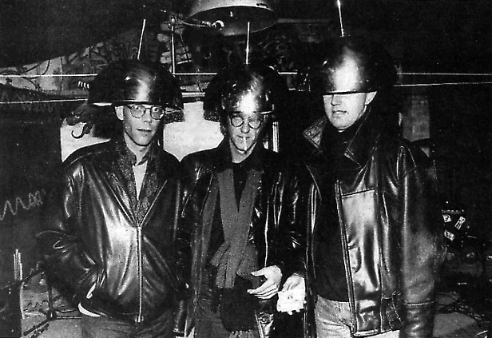
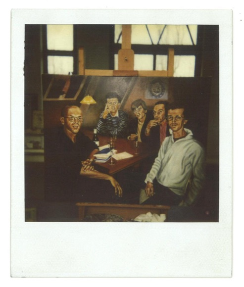

---
Pr-id: Bilwet Fascismemap
P-id: Theory on Demand
A-id: 30
Type: article
Book-type: anthology
Anthology item: article
Item-id: unique no.
Article-title: Hoezo Bilwet?
Article-status: accepted
Author: Bilwet
Author-email:   corresponding address
Author-bio:  about the author
Abstract:   short description of the article (100 words)
Keywords:   50 keywords for search and indexing
Rights: CC BY-NC 4.0
...

# 1. Hoezo Bilwet? Een inleiding

Door Bilwet. Verschenen op de Bilwebsite thing.desk.nl/bilwet/,
geschreven in 1994.

Afb. 1: Bilweters Bas-Jan, Geert en Arjen  in kraakpand Vrankrijk bij de presentatie van *De Bewegingsleer* (1990).

*The Media are here to go*

*Het universum van de Bilwet fellow travellers*

## I. ‘Dag, wij zijn van Bilwet’

De stichting 'Bilwet' (in oprichting sedert 1983) wil de Beoefening van
ILlegale WETenschap bevorderen. Dit o.a. door lezingen, boekwerken,
wisselende kontakten, radioprogramma's, reizen, manifesten,
telefoongesprekken en vertalingen. Bilwet publiceerde *Het Beeldenrijk:
over stralingsangst en ruimteverlangen* (Amsterdam 1985),
*Bewegingsleer* (Amsterdam 1990, Berlin 1991, New York 1994), *Het
Buitenmediale* door Arjen Mulder (Amsterdam 1991), *Hör zu oder Stirb*
door Geert Lovink (Berlin 1992), *Media Archief* (Amsterdam 1992,
Bensheim 1993) en *Der Datendandy* (Bensheim 1994/NL-floppy versie:
Amsterdam/De Balie, 1995). Bilwet vertaalde Wolfgang Pohrt, *Berichten
van het slagveld der kritiek*, Paul Virilio, *Horizon Negatief* en p.m.,
*bolo'bolo*. Zij publiceert o.a. in *Mediamatic*, *Andere Sinema*,
*Schwarzer Faden*, *NN*, *Blvd*, *Heaven Sent* (RIP) en *De Digitale
Stad*. Bilwet neemt sinds 1989 deel aan het Jaarboek voor Ambulante
Wetenschappen *Arcade*. In de zomer van 1993 verscheen *Arcade \#4* met
als thema 'De Groeten aan het Morgenland'. Sedert 1987 is op Radio
Patapoe (Amsterdam) en Radio Rataplan (Nijmegen) is het programma De
*Bilwet-portrettengalerij* te beluisteren. Het Bilwetmuseum dat
ingericht zal worden, biedt theoretisch en provisorisch asiel aan
objecten, situaties, vraagstukken, observaties, aangegeven feiten. Deze
collectie heeft geen publieke openstelling - men kan er slechts in
verzeild raken. Ook wordt gewerkt aan Bilwetfilms, -encyclopedieën,
Cd-roms met daarop de kritische *Studienausgabe*, te beginnen met de
*Frühschriften* (Bollmann Verlag, 1994).

Bilwet houdt zich thans bezig met incest als volksvermaak, fascinerend
Addis Abeba, Digital Island Budapest, figuurcorrectie, georganiseerde
onschuld, Meeneemstad Eindhoven, elektronische eenzaamheid,
verzamelingenleer, Zoroaster, tactische media en Freenets, algemene
toerismetheorie, althaische Sprachen, Het Noorden, de aanbidding van het
Kruis, yugo.anti-war, filosofische dieren Draculaland Roemenië, vakantie
in Siberië, erg normaal werk, verdovende drugstheorie, de omgedraaide
ooguitsteking, actueel heidendom, Ex Oriente Lux, moordreligies, de
opheffing van Armenië, het 20ste-eeuwse lichaam, Vilém Flusser,
laat-communisme, wolken, onafhankelijke media in ex-Joegoslavië.
Daarnaast wordt er gedacht over toerismeleer, woestijnen, lamantijnen,
fuga's, het postmillenium. Bilwet herlas recentelijk Desmond Morris *De
naakte aap*, het verzameld werk van Hendrik de Vries, Adrien Turels
*Technokratie, Genetokratie, Autarkie*, alles van Joao Guimaraes Rosa,
de Bijbel en Fritz Fischer, *Griff nach der Weltmacht*. ‘Niet van boeken
alleen.’ De theorie komt bij het onsamenhangende geheel Bilwet voort uit
een combinatie van stilstand en snelheid, reizen en thuisblijven.
Theorie betekent schrijven als een *third* *mind*, maar ook schilderen,
tv-kijken, zwijgen, lachen, wandelen, het stuiten op wonderbaarlijke
woorden, flarden van zinnen, brieven uit den vreemde, compact-slogans en
mysterieuze titels, wat knipsels, vergeelde pockets.

## II. ‘Ja, Bilwet is een speculant’

Voor Bilwet begint de speculatie voorbij het nulpunt van de betekenis.
Als woorden bevrijd zijn van de informatielast die ze mee moeten torsen,
raken ze in vervoering en trekken op verkenning uit. Zodra ze hun eigen
gang gaan, kunnen ze iedere logica volgen en op alle informatie
anticiperen waar ze ooit nog mee opgezadeld zullen worden. Het
speculeren met de taal volgt de stelregel: voorkomen is beter dan
deconstrueren. Tijdens de werkuren van de Bilwet-optiebeurs worden
begrippen, willekeurige data en onvermijdelijke situaties kortgesloten
op hun verdwijnpunt in de toekomst. Het opereren aan gene zijde van de
toekomst doet de Bilwet-speculant iedere bestaande lezersmarkt vergeten.
De woekering van de woorden roept een chaosveld op waar doorheen de
tekst zijn fatale koers bepaalt. Daarbij heeft iedereen het nakijken,
inclusief de mixers zelf.

De biltekst is moeilijk, maar leidt nooit tot misverstanden over de
toelaatbaarheid van de strekking ervan. Voor Bilwet is de gevaarlijke
tekst over het riskante onderwerp uitgespeeld en uitgesloten. Bilwet
heeft een warme belangstelling voor alle taboes van de wereld, maar geen
behoefte ze te doorbreken. Het openlijk flirten met, of nog eens
doorwerken van het gedachtengoed uit de roemrijke jaren twintig en
dertig, dat grenzen, diepten en hoogten verkende van het Dasein in het
tijdperk van de techniek, heeft de belangstelling niet. Voor Bilwet
begint de wereld na '45. De dodelijke angel is uit de tekst gehaald en
kan er niet nogmaals in gestopt worden. Die constatering gaat aan iedere
bilwettekst vooraf.

De auteur Bilwet is vanouds een *third mind*: twee jongens en een
typemachine. De aanschaf van Pc’s heeft daar weinig aan veranderd. Een
biltekst kan niet door één enkele schrijver worden gemaakt, maar heeft
minstens twee, maar vaak ook vier, vijf of meer medewerkers nodig. De
samengestelde tekst is niet de optelsom der individuen, maar iets totaal
anders, een samenballing van inzichten en uitglijers waar de bilweter
alleen nooit op was gekomen. De bestanddelen van de *ideelle
Gesamtautor* nemen al hun data mee en hangen die hardnekkig op aan
kleine ergernissen om bilwetmatigheden op te stellen. Door de
aanwezigheid van meerderen worden vooroordelen en kleingeestigheden
wederzijds uitgedoofd en houdt de biltekst *observation as ideas* over.
Bilwet is een geestverruimend middel. Bilwet is geen pseudoniem, maar
een vrolijke methode, een kortsluiting, een telefoongesprek. Bilwet is
zowel opgewekte theorie als een *happy writer*. Het is geen groep,
beweging, syndicaat, commune of genootschap, maar is in Groot-Duitsland
raar genoeg een *Agentur*. Van begin af aan is het een stichting in
oprichting geweest. Bilwet kent geen lidmaatschap of donateurs, maar wel
een reizend ambassadeur, een erelid voor het leven en een politiek
commissaris. Zonder belangstelling voor elkaars specifieke invalshoeken
dumpt eenieder wat hij toevallig bij zich heeft. Het is maar wie of wat
er binnen komt lopen bij een biltekst *in progress*.

Het rukken en trekken aan het begrip 'media' is een dankbare bezigheid.
Media is een container met een ongekend volume. Het lijkt of de hele
wereld erin gevat kan worden. De mediatheorie onderneemt een expeditie
om over de rand van de mediale planeet te vallen, in de wetenschap dat
deze rond is. Het blijkt mogelijk de media-almacht te ontkennen door
buitenaards te gaan. ‘We are here to go.’ De media zijn geen *primordial
uncarved block*, het oppervlak ervan vertoont barstjes, patronen. Het
alienstandpunt maakt die zichtbaar.

## III. ‘Maar wie zijn dat in vredesnaam?’

Bilwet is in 1983 opgericht door de Amsterdamse sociofilosoof Basjan van
Stam ter gelegenheid van het verschijnen van zijn eerste boek
*Seksisme/fascisme: rekonstruktie van een mannenideaal*. Gedurende een
verblijf van Geert Lovink in Berlijn ontstonden de plannen om tezamen
een boek te maken over seks en oorlog, hetgeen resulteerde in *Het Beeldenrijk* (1985). Geert Lovink was ooit politicoloog en schreef voor
het weekblad *bluf!*, wat Bilwet ook ging doen. Begin 1986 traden Arjen
Mulder (bioloog en *Waarheid*-filmrecensent) en Ger Peeters uit Nijmegen
(socioloog/fulltime reiziger) toe tot het gezelschap en werden er
cursussen gegeven over *Mannenfantasieën* (Klaus Theweleit) en *De
Fatale Strategieën* (Baudrillard). Niet veel later trad reli-specialist
Lex Wouterloot toe en verhuisde van Stam naar Noord-Groningen, alwaar
hij zich ging toeleggen op het verven. Vervolgens verschenen er een
aantal vertalingen en artikelen over de kraakbeweging, die samen werden
gebracht in het boek *Bewegingsleer*, waarvan ook een Duitse en
Amerikaanse editie verscheen. Sinds 1988 is er sprake van een
mediatheorie in aanbouw en begon het schrijven voor bladen als *Andere
Sinema* en *Mediamatic*. Mulder kwam in 1991 met een eigen, meer
literaire media-analyse (*Het Buitenmediale*, Uitgeverij Perdu,
Amsterdam), terwijl Lovink Geert aandacht besteedde aan vrije radio's en
undergroundgroepen en ging werken in het Wilde Oosten. Onlangs werd de
Duitse editie van het *Media-archief* uitgegeven bij Uitgeverij
Bollmann, alweer de derde uitgave in het Duits. In februari was de
Bilwet op tournee in Groot-Duitschland, onder de titel *Datendandy Tour
1994*.

Afb. 2: Bilwet, het schilderij, gemaakt door Bas-Jan (1992).
