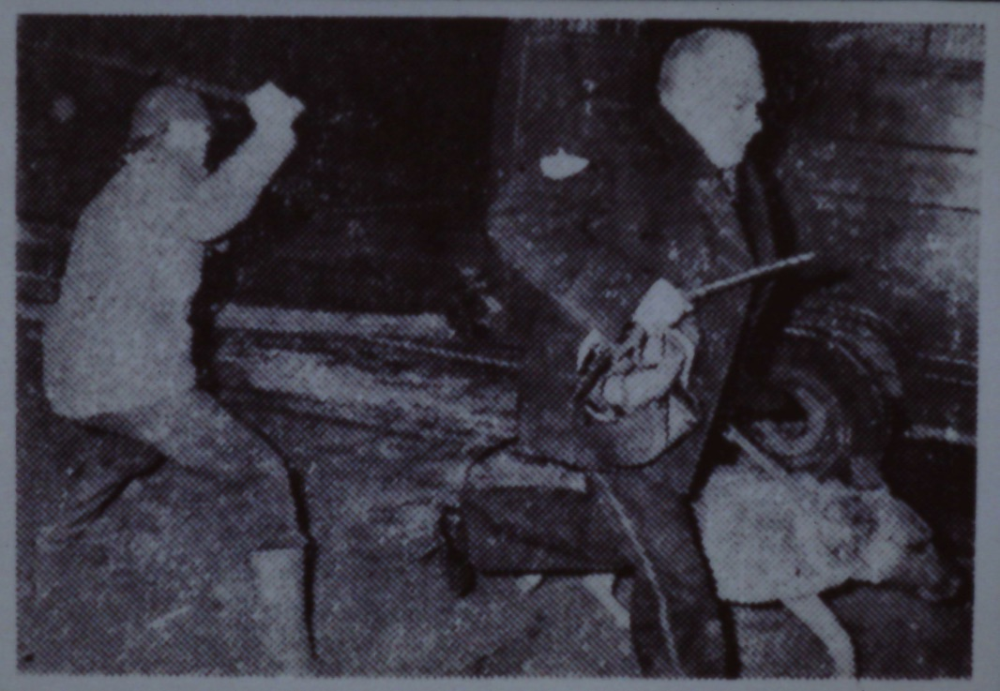

---
Pr-id: Bilwet Fascismemap
P-id: Theory on Demand
A-id: 30
Type: article
Book-type: anthology
Anthology item: article
Item-id: unique no.
Article-title: 'Alleen door een wonder kan ik behouden worden': Over Boris, Bor en de Wolf
Article-status: accepted
Author: Geert Lovink en Bas-Jan van Stam
Author-email:   corresponding address
Author-bio:  about the author
Abstract:   short description of the article (100 words)
Keywords:   50 keywords for search and indexing
Rights: CC BY-NC 4.0
...

# 13. ‘Alleen door een wonder kan ik behouden worden’: Over Boris, Bor en de Wolf

Door Geert Lovink en Bas-Jan van Stam. Lezing met lichtbeelden gehouden in de hal van kraakpand Van
Hall (van Hallstraat 625-627, Amsterdam) op 27 februari 1987 door stichting Bilwet. M.m.v.: Bas, Kuifje,
Gerard Reve, John Raket, Farwerck, Nietzsche en Bor de Wolf. Vanwege het auteursrecht zijn de meeste Kuifje-plaatjes uit het origineel niet in deze uitgave opgenomen.

Afb. 1.

Uit het nagelaten werk van Nietzsche:

‘Ein Gott der Liebe könnte eines Tages sprechen, gelangweilt durch seine
Tugend: “versuchen wir’s einmal mit der Teufelei!”

-- und siehe da, ein neuer Ursprung des Bösen! Aus Langeweile und Tugend!
–’

Afb.2.

Er zijn vele soorten wolven: goed en boos, echt en mythisch. De wolf in
de roman *Wolf* van de volksschrijver Gerard Reve is een soort van goede
weerwolf, een wolfman en een echte liefdeswolf. Zijn naam luidt Wolf en
over Wolf lezen we:

> Toen Wolf nog een jongen was, had hij dikwijls onenigheid thuis, en er
> gingen weinig dagen voorbij waarop hij geen ruzie had met zijn ouders.
> Wolf was een erg levenslustige en rumoerige jongen, die niet lang stil
> kon zitten, en graag overal naar toe ging waar ‘’iets aan de hand
> was’’, zoals hij het zelf noemde.

Enkele pagina’s verder ontmoet Wolf een leuke jongen, André geheten:

> ‘’Wat doe jij, André? Wat doe jij graag?’’ vroeg Wolf.
>
> ‘’Ik studeer nog,’’ antwoordde André. ‘’Ik studeer biologie.’’
>
> ‘’Wat is dat?’’ vroeg Wolf.
>
> ‘’Dat is van planten, en van dieren,’’ antwoordde André. ‘’Ik
> bestudeer dieren.’’
>
> ‘’Vinden die dieren dat goed?’’ wilde Wolf vragen, maar hij wist niet
> of dat wel een goede vraag was, dus vroeg hij het niet.’

Afb. 3.

In de Winkler Prins wordt de dierkundige wolf beschreven als een:

> \[…\] roofdier, canus lupus, uit de familie Hondachtigen, dat in
> uiterlijkheid en afmeting sterk doet denken aan de Duitse herdershond.
> Hij onderscheidt zich daarvan evenwel doordat hij wat “magerder” is,
> een wat sterkere en langere snuit heeft en een ruigbehaarde staart die
> tot de enkels afhangt. In Noord-Amerika komen veel geheel zwarte
> exemplaren voor. De wolf is een typische cultuurvlieder. De paartijd
> valt midden in de winter. Men hoort dan, vooral ’s nachts, het
> langgerekte huilen.

Afb. 4.

In een boekje voor de jeugd uit de ‘Natuur-Serie’, dat bedoeld is om
kinderen lief te laten zijn voor de echte natuur en dat dit keer over de
wolf gaat, staat dat wolven ‘onvermoeibare reizigers’ zijn:

> Als ze eten, eten ze veel zodat ze lange tijd zonder voedsel kunnen.
> Wolven kunnen niet erg hard rennen, behalve als ze achter een
> vluchtende prooi aanzitten, maar ze kunnen het urenlang volhouden.
> Soms kunnen de paden en sporen die ze gebruiken wel zestig kilometer
> ver gevolgd worden, over bergen, door bossen en rivieren.

Ook de goede liefdeswolf van Gerard Reve zit het zwerven in het bloed.
Onverwacht krijgt Wolf namelijk een erfenis:

> Plotseling stierf Oom Victor. Bij zijn testament had Oom Victor een
> brief aan Wolf gevoegd. In de brief schreef Oom Victor, dat Wolf een
> bewijs van rijvaardigheid moest gaan verwerven, om een motorvoertuig
> te kunnen besturen. ‘’En als je dat hebt, moet je een grote automobiel
> kopen waar je in kunt wonen terwijl je er mede reist. Ik bezit ook een
> woonwagen, en die is nu voor jou. Je behoeft nog slechts een
> automobiel te kopen om die woonwagen voort te trekken.’’ – Wolf was
> erg dankbaar, en nam meteen lessen, om het automobiel rijden te leren.
> Reeds bij het eerste examen slaagde hij.

Afb. 5.

Dat orde en discipline verschijnselen zijn die ook in de echte natuur
voorkomen, maakt het kindernatuurboekje uit de Natuur-Serie duidelijk:

> De leider eet en drinkt altijd eerst en hij neemt het beste deel van
> het voedsel. Wolven van een lagere rang moeten gehoorzamen aan een
> wolf van een hogere rang en die voor laten gaan. Deze strikte regel
> voorkomt vechtpartijen. Door met z’n allen een prooi te volgen kunnen
> ze een dier doden dat groot genoeg is voor een waar feestmaal. Alle
> leden van de groep hebben hier voordeel bij, speciaal de zwakkere
> dieren.

Afb. 6.

Uit de ‘gegevens over de wolf’ die we in het Natuur-Serieboekje vinden,
blijkt nog eens dat de natuurwolf niks met de Boze Wolf te maken heeft.
Neus, oren, vacht, staart, ogen en poten worden besproken, maar niet
zijn bek met blikkerende vraatzuchtige messcherpe tanden en al evenmin
zijn enorme verzwelgende keel. De Boze Wolf is dan ook een heel ander
dier.

Afb. 7.

> De wolf liep zonder een woord te spreken naar grootmoeders bed en at
> haar op. Daarna trok hij haar kleren aan, zette haar mutsje op, ging
> in haar bed liggen en trok de gordijnen dicht. Het verwonderde
> Roodkapje dat de deur openstond en toen ze de kamer binnenkwam, leek
> alles haar zo vreemd en ze dacht: Waarom ben ik eigenlijk zo bang
> vandaag, anders ben ik toch zo graag bij grootmoeder. Daar lag
> grootmoeder. Ze had haar mutsje over het gezicht getrokken en zag er
> erg raar uit.
>
> ‘’Wat heb je een grote oren, grootmoeder.’’
>
> ‘’Die heb ik om je beter te kunnen horen.’’
>
> ‘’Wat heb je toch grote ogen, grootmoeder.’’
>
> ‘’Die heb ik om je beter te kunnen zien.’’
>
> ‘’Wat heb je grote handen, grootmoeder.’’
>
> ‘’Die heb ik om je beter te kunnen pakken.’’
>
> ‘’Maar grootmoeder, wat heb je een verschrikkelijk grote mond.’’
>
> ‘’Die heb ik om je beter op te kunnen eten.’’
>
> En nauwelijks had de wolf dat gezegd of met één sprong was hij uit het
> bed en at de arme Roodkapje helemaal op. Toen de wolf zijn zin
> gekregen had, ging hij weer in bed liggen, viel in slaap en begon hard
> te snurken.

Afb. 8.

De ongelooflijke vraatzucht van de Boze Wolf met het daaropvolgende
ongegeneerde slapen en snurken, staat ook in *De wolf en de zeven
geitjes* centraal:

> De geitjes riepen: ‘‘Laat eerst je poot zien, dan weten we of je ons
> lief moedertje bent.’’ De wolf legde z’n poot op de vensterbank en
> toen ze zagen dat hij wit was, geloofden ze hem, deden de deur open:
> en toen was het toch de wolf. De wolf maakte korte metten met hen. Een
> voor een slokte hij ze op. Toen de wolf verzadigd was, sjokte hij weg,
> ging onder een boom liggen en viel al gauw in slaap. Toen de wolf
> uitgeslapen was, stond hij op, want hij had dorst. Toen hij bij de
> beek kwam en zich voorover bukte om te drinken, trokken de zwaarste
> stenen hem naar beneden en verdronk hij jammerlijk. De zeven geitjes
> zagen het uit de verte en kwamen hard aanlopen en riepen: ‘’De wolf is
> dood, de wolf is dood.’’ En ze dansten met hun moeder langs de beek
> van plezier.

Afb. 9.

Dat de Boze Wolf een dodelijk gevaar is dat alleen bestreden kan worden
door de wolf zélf te doden, maken zulke sprookjes wel duidelijk. De Boze
Wolf is het Kwaad Zelve, dat het vooral gemunt heeft op vrouwen, kleine
meisjes en onschuldige kinderen. De Boze Wolf is een bedreiging voor het
nageslacht, een soort van geslachtsziekte, vies en gruwelijk, en daarmee
een bedreiging van de cultuur. De fascistische regering van Vichy stelde
daarom de jood voor als een wolf, een geldwolf natuurlijk, maar ook De
Gaulle en het verzet. Trouwens: ook Janmaat en de Beierse politicus
Strauss zijn als wolven afgebeeld op politieke affiches. Janmaat en
Strauss vormden kennelijk een bedreiging voor de linkse sibbe-cultuur.

Het sprookje van de Boze Wolf houdt de waarschuwing in, dat het slecht
met je afloopt wanneer je je niet aan de regels houdt. In zulke gevallen
bedient de sterke arm zich van de Boze Wolf, die dan gelukkig wel
aangelijnd is. De afgerichte politiewolven zijn er om de natuurlijke
orde te herstellen.

Afb. 10.

Die natuurlijke orde lijkt overigens soms verdacht veel op een mythische
orde. Het kinder-wolvenboekje uit de Natuur-Serie besteedde dan wel geen
aandacht aan de muil van de wolf, maar zomaar ineens zitten we middenin
de Germaanse mythologie:

‘Tot de attributen van Odin of Wodan behoorden zijn beide wolven Freki
en Geri. Zij rustten gewoonlijk aan zijn voeten en brachten geluk. In
het oud-Germaanse Eddalied staat bijvoorbeeld: als gij in een donker bos
een wolf hoort huilen, geluk in de strijd is u zeker beschoren als uw
oog hem het eerst ziet.’

Odin of Wodan had trouwens ook twee raven. Zij heetten Hugin en Munin,
wat respectievelijk het terugkijken en vooruitkijken betekent. Zij
vlogen de hele dag over de wijde wereld en berichtten hun baas alles wat
er gebeurde.

Afb. 11.

Voor de oude Germanen waren wolven belangrijke dieren. Ze brachten als
helpers van Odin niet alleen geluk, maar je kon jezelf ook in een wolf
veranderen. Dan werd je een wolfman of zoals dat later heette: een
weerwolf. Volgens een zekere Farwerck, die hier onderzoek naar gedaan
heeft en in de Tweede Wereldoorlog een foute wolf was, bestaan er nog
steeds veel eigennamen die het bestanddeel *ulf*, dat wil zeggen wolf,
in zich dragen. Adolf was in het Goties Atha­ulf en in het Angelsaksies
Aethwulf met de betekenis Edelwolf. Hitler, die erg veel van de muziek
van Wagner hield en een graag geziene gast bij de erven-Wagner was, werd
als hij bij de familie Wagner op bezoek kwam, altijd begroet met Ome
Wolf. Ook de SS was een weerwolvengenootschap en Farwerck bewijst dat
hij ook na de oorlog een foute wolf was, want alhoewel zijn boek
*Noord-Europese mysteriën en hun sporen tot op heden* voor het eerst
verscheen in 1970 schrijft hij op bladzij 218: ‘Ook zien we telkens de
sporen van weerwolfgenootschappen, hoewel het niet mogelijk is, daarover
veel bijzonderheden te vertellen.’

Hoe dan ook wordt Wolf uit het boek van Gerard Reve op een gegeven
moment gedwongen voor weerwolf te spelen. Wolf is namelijk, naïef als
hij is, in slecht gezelschap beland. Samen met een zekere Broer en een
zekere Zus, beiden net als Wolf muzikanten, vormen ze een rondtrekkend
gezelschap en Broer en Zus delen al gauw de lakens uit. Ze veranderen
het programma:

‘‘’Op het eind wordt het echt een wilde boel. Dat willen de mensen
graag,’’ legde Broer Wolf uit. Uit koffer haalde hij nu een geel kostuum
tevoorschijn, dat aan alle zijnaden was afgezet met gekleurde
vogelvederen, en vroeg Wolf, dit snel aan te trekken. Wolf aarzelde.
Waarom moest hij dit vreemde kostuum aan doen?’

Afb. 12.

Nog een stukje Germaanse mythologie. Ditmaal uit de proza-Edda, een
oud-Germaans Bijbelboek, en daarin wordt verteld over de geboorte van
Odin, die wolven en raven hield:

> En waar leefde Ymir van? Het eerste wat gebeurde was dat er uit de
> dauw een koe ontstond, en uit haar uiers vloeiden vier stromen melk en
> daarmee voedde Ymir zich. Waarvan leefde de koe? Ze likte de bedauwde
> zoutstenen af en op de eerste dag dat ze de stenen likte, kwam ’s
> avonds uit het gesteente mensenhaar tevoorschijn, op de tweede dag een
> mensenhoofd, en op de derde dag was er een hele mens, die heet Buri,
> had een schoon uiterlijk, was groot en sterk en hij kreeg een zoon,
> die hij Bor noemde. Bor nam Bestla, dochter van de reus Bulthoorn, tot
> vrouw en zij kregen drie zonen: Odin, Wili en We.

Wanneer politiewolven losgelaten worden, kunnen de gekste dingen
gebeuren. Dat gebeurt min of meer ook in de Germaanse mythologie.
Farwerck schrijft er het volgende over:

> Dan gebeurt er iets verschrikkelijks: de wolf verslindt namelijk de
> zon en dat is voor de mensen een harde slag. Een andere wolf rooft de
> maan en richt daardoor grote schade aan. De wolf rent met opengesperde
> muil, de onderkaak op de aarde en de bovenkaak in de hemel. Hij zou
> zijn muil nog verder opensperren als er meer ruimte was. De wolf
> verslindt Odin, maar dadelijk verschijnt Odins zoon Widar en treedt
> met zijn voet op de onderkaak van de wolf. Met één hand grijpt hij de
> bovenkaak van de wolf en scheurt zijn muil open, waardoor deze sterft.

Dit verhaal over de eindslag in de Germaanse godenwereld en de perverse
rol die de wolven daarin spelen, bestaat nog steeds, alleen is het nu
net als het geval is bij sprookjes waar wolven in meedoen, behoorlijk
vervormd en voor de kinderziel aangepast. In het Noord-Hollandse
Blokker, waar de Beatles ooit eens hebben opgetreden, wordt op de
kleuterschool een vangspelletje gedaan. De kinderen moeten dan een vak
overrennen waarin de wolf zit. Dat durven ze natuurlijk niet, maar dan
zingen ze:

> ‘De wolf zit gevangen
>
> tussen twee ijzeren stangen
>
> tussen zon en tussen maan
>
> herder laat je schaapjes gaan’

En dan rennen ze over en blijkt de wolf dus helemaal niet gevangen te
zijn, maar hij probeert juist zoveel mogelijk kinderen te vangen.

Afb. 13.

We wisten al dat Bor de vader van de wolvengod Odin was. In de
Fabeltjeskrant hebben ze hetzelfde verband gelegd. Hier is Bor de Wolf
een echte kinderwolf, die af en toe weleens wat humeurig is. In de
Fabeltjeskrant lezen we het volgende bericht:

> Bor is een beetje boos. Op alles en iedereen. Hoe dat precies komt
> weet hij zelf niet eens… Als wolf wil hij het zo nu en dan gewoon eens
> flink op een huilen zetten. Bor is naar het Enge Bos gegaan. Dat is
> nog een hele wandeling. ‘’Brrr,’’ mompelt Bor. ‘’Het is hier echt heel
> eng. Het is hier koud en kil, het is hier vochtig! Maar toch blijf ik
> hier zitten. Ik geloof dat iedereen een hekel aan me heeft. Niemand
> die me een leuke wolf vindt.’’ Bor doet zijn ogen dicht. En even later
> snurkt de wolf zo hard, dat de bomen van het Enge Bos ervan schudden.

Afb. 14. Hergé, *De Scepter van Ottokar*, 1938.

Is Bor de Wolf in de Fabeltjeskrant alleen vanwege zijn voorliefde tot
het Enge Bos nog enigszins een slechte wolf, in het werk van Hergé, in
Kuifje dus, ligt dit anders. In het album *De* *Scepter van Ottokar* uit
1938 én in *Mannen op de maan,* gemaakt tussen 1950 en 1953, speelt Bor
de Wolf de rol van het Kwaad. In *De* *Scepter van Ottokar* heet hij
simpelweg Boris en in *Mannen op de maan* heet Boris ‘kolonel Jorgen’.
We laten nu de dia’s van Boris uit *De Scepter van Ottokar* de revue
passeren en vatten het verhaal samen, maar eerst nog wat over de figuur
van Boris.

Boris is in *De* *Scepter van Ottokar* een handlanger van ene Müsstler.
Deze naam Müsstler is een samenvoeging van Mussolini en Hitler. Müsstler
is dictator over het land Bordurië, waarin dus weer dat ‘Bor’ zit. Boris
is een Borduriër en dit land wil het buurland Syldavië veroveren. Om dit
voor te bereiden is Boris doorgedrongen tot het hof van Syldavië, waar
hij het tot adjudant van de koning geschopt heeft. Uiterlijk en wat zijn
uniform betreft vertoont Bor frappante gelijkenis met Himmler, de leider
van de SS- weerwolven. Als adjudant van de koning zit Boris op een
ideale positie om de Bordurische verovering van Syldavië voor te
bereiden. Een echte wolf in schaapskleren. Wanneer Kuifje, die op de
hoogte is van de Bordurische plannen, de koning wil spreken, ontmoet hij
eerst Boris. En Boris probeert Kuifje vervolgens eerst in een hinderlaag
te lokken en als dat mislukt en Kuifje toch in het paleis weet door te
dringen, laat Boris hem arresteren als zijnde een jonge anarchist.
Kuifje ontsnapt echter en wordt bij toeval aangereden door de auto van
de koning. Dan spreekt hij alsnog de koning en zo weet Kuifje Boris’
kwade plannen te verijdelen. Hij ontmaskert Boris als een verrader en
schakelt hem met een rake vuistslag uit.

Als naoorlogse atoomgeleerde en rakettenbouwer heeft professor
Zonnebloem natuurlijk wat met het fascisme van doen. Zonnebloems
atoomraket lijkt als twee druppels water op de V2-raketten waarmee de
Nazi’s onder leiding van Zonnebloems collega Wernher von Braun in
Peenemünde experimenteerden. In *De zaak Zonnebloem* duikt dan ook
zonder commentaar een boekje op met onderzoek naar de meest geavanceerde
nazitechnologie: raketten en straaljagers. Zonnebloems assistent bij het
maanexperiment heet niet voor niks Wolff met dubbel ‘f’. En dat wolven
iets met de maan en de zon hebben, was al bekend uit de Germaanse
mythologie. Een paar jaar voor Hergé aan zijn *Mannen op de maan* begon,
had een sciencefictionschrijver al een dergelijk verband gelegd. Ernst
Pommerel, een bekende Kuifoloog, wees ons hierop. Het gaat om het boekje
*Rocketship Galileo* van de Amerikaanse schrijver Robert A. Heinlein,
dat in 1947 voor het eerst uitkwam maar nog steeds te koop is. Daarin
wordt verteld dat een Amerikaanse maanexpeditie met hun ruimteschip
Galileo op de maan landt en tot hun verbazing ontdekt dat ze niet de
eersten zijn. De Nazi’s zijn hen voor geweest en wat bedoeld was als een
vreedzame ruimtetocht eindigt in een heuse oorlog, waarbij de beide
ruimteraketten van de Nazi’s, Wodan en Thor genaamd, vernietigd worden.
Hergé geeft van hetzelfde vermoeden, namelijk dat ruimtevaart en
fascisme iets met elkaar van doen hebben, een meer verborgen versie.

Afb. 15. Hergé, *Mannen op de maan*, 1950-1953.

Het eerste optreden van Boris in *Mannen op de maan* is dat hij wraak
neemt op de vuistslag die Kuifje hem bijna vijftien jaar eerder
toebracht. Die kaakslag en de erop volgende vernederende scène zit Boris
kennelijk nogal hoog en die móét gewroken worden al brengt hem dat ook
tot op de maan en al heeft Boris zijn SS-uniform ervoor moeten
uittrekken en ook nog eens, zoals zovele oud-Nazi’s, zijn naam moeten
veranderen. In het Maanproject heet Boris kolonel Jorgen. Boris alias
kolonel Jorgen, die in de volgende serie dia’s de Raket probeert te
kapen, want hij meent aanspraak te kunnen maken op de atoomraket, Boris
dus, is de personificatie van het Kwaad. Boris is fascist vanwege zijn
uniform, communist vanwege zijn banden met het totalitaire op
Sovjet-Rusland geïnspireerde Bordurië, hij is een verrader, een
dierenbeul, terrorist en ruimtekaper, wreed, sadistisch en genadeloos,
gevoelloos, gedisciplineerd, hij rookt voortdurend ook als het niet mag,
is gehoorzaam tot in de dood, maar tegelijkertijd is hij ook superieur,
absoluut superieur in vergelijking met Wolff, zijn zielige handlanger,
en ten slotte heeft Boris een zekere standing en adel: in de *Scepter
van Ottokar* wordt dat aangegeven door zijn mooie uniformen en zijn
oogglas en in *Mannen op de maan* is het vooral zijn fiere houding die
hem voornaam maakt. Kortom: eens een Bor de Wolf, altijd een Boze Wolf.

Afb. 16. Hergé, *Mannen op de maan*, 1950-1953.

In Gerard Reves Wolf speelt gelukkig ook een Kuifje-figuur mee, meneer
Stafman geheten, want anders zou het met Wolf die toch al niet begreep
waarom hij een weerwolf moest zijn, slechts zijn afgelopen. Meneer
Stafman redt Wolf uit de geldgierige klauwen van de gemene Broer en Zus.
Dan doet zich iets vreemds voor. Wolf wil wel en wil niet dat Broer
boete doet en in zijn twijfel krijgt hij kwade sm-gedachtes:

> ‘’Straf… straf…’’ hamerde een stem door Wolf heen. Hij gevoelde hoe
> een vreemde, misselijk makende smaak in zijn mond kwam. - ‘’Je kunt
> een flink pak slaag krijgen,’’ zeide meneer Stafman tegen Broer. ‘’En
> als ik zeg een pak slaag, dan bedoel ik een pak slaag. Wat wil je? Ja,
> of nee?...’’ Wolf moest diep ademhalen om zijn duizeligheid te
> overwinnen. Wat ging er nu gebeuren? Het was iets wat hij niet wilde,
> wat hij niet mócht willen dat gebeurde, maar tegelijkertijd kwamen er
> gedachten in hem op, die hij niet wilde hebben, en waarin hij ernaar
> verlangde, dat meneer Stafman met Broer zoude doen wat hij gedreigd
> had te doen… - ‘’Ja, straf…’’ kreunde Wolf onhoorbaar. Hij probeerde
> wat hij dacht, niet te denken en niet te willen, maar tevergeefs. Hij
> sloop de kamer uit, naar de keuken, en sloot de deur achter zich. Hij
> bleef de rijzende en dalende stemmen uit de grote kamer horen, maar de
> betekenis der woorden drong niet tot hem door. Alles was verdriet,
> dacht Wolf. En was dat verdriet niet zijn, Wolf zijn eigen schuld?...
> Wolf huilde niet gauw als hij verdriet had, maar nu stond hij opeens
> midden in de keuken te snikken.

Afb. 17. Hergé, *Mannen op de maan*, 1950-1953.

Zodra Boris gevangen is genomen legt hij een verklaring af die typisch
is voor de SS. ‘‘’Ik zal jullie maar meteen zeggen,’’ verklaart hij,
‘’dat uit mij niets te krijgen is. Dus jullie verliezen je tijd met me
te ondervragen. Ik antwoord op geen enkele vraag. Probeer ’t eerder met
Wolff, die keldermot zal het ’n genoegen zijn jullie een en ander
duidelijk te maken.’’’ Kuifje en de anderen nemen dit serieus en stellen
Boris inderdaad geen enkele vraag meer en Boris zwijgt.

Hoewel Boris stevig vastgebonden is, weet hij niettemin te ontsnappen.
Samen met zijn zielige handlanger Wolff overvalt hij Kuifje en de
anderen en pas als Boris zijn revolver trekt om, zoals hij zelf zegt
‘korte metten met ze te maken’ komt de zielige Wolff tot inkeer. Hij
tracht de revolver uit Boris zijn handen te pakken. Daarop ontstaat een
vechtpartij, er valt een schot en Boris blijkt dodelijk getroffen te
zijn door een kogel die net als de pin door het hart van Dracula midden
door Boris hart gaat.

Kuifje begrijpt nu dat Wolff berouw heeft, raapt zijn bril die tijdens
de worsteling met Boris gevallen is op, geeft hem aan Wolff terug en
schenkt hem zijn vertrouwen. En zo is alles toch nog goed gekomen. Ook
met Wolf van de volksschrijver Gerard Reve komt alles aan het eind toch
nog goed. Na lange omzwervingen vindt Wolf André, de leuke jongen van
het begin die de dieren bestudeerde, terug. Precies op dezelfde plek als
waar Wolf hem de eerste keer ontmoette en met precies hetzelfde tentje:

> Er streek een onverwachte bries over het veld, en een wolk schoof voor
> de zon. Een windstoot beroerde het tentje, schudde aan de opgerolde
> voorhang die boven de ingang over de top van het tentpaaltje
> gedrapeerd lag, en wierp die naar beneden. Het doek van de voorhang
> ontrolde zich in zijn val, en sloot de ingang van het tentje af. André
> liet zich languit achterover zakken, terwijl hij Wolf met zijn armen
> omklemd hield, en trok hem over zich heen. ‘‘Eindelijk, Wolf…
> Eindelijk…’’ fluisterde hij, terwijl hij met zijn gloeiende lippen
> teder het oor van Wolf streelde.

Afb. 18. Hergé, *Mannen op de maan*, 1950-1953. 

Boris was het Absolute Kwaad dat alleen maar tot inkeer gebracht kon
worden door zijn dood, zoals dat een echte Boze Wolf ook betaamt. Maar
ook zijn zielige handlanger Wolff moet dood. Wolff is te ver meegegaan
op het pad van de Boze Wolf en pleegt zelfmoord, door de Raket ergens
tussen maan en aarde te verlaten. Hij schrijft een afscheidsbrief en
daarin staan de mysterieuze woorden: ‘Wat mij betreft zal een wonder me
misschien veroorloven ook te ontsnappen.’ Hierin ligt de hoop besloten
dat hij misschien toch kan overleven in de kosmische ruimte en wellicht
door reïncarnatie op aarde terug te keren. In de latere drukken is deze
occulte tekst veranderd in een stelliger regel. Dan heet het: ‘Wat mij
betreft: alleen door een wonder kan ik behouden worden…’ Maar op wat
voor wonder kan Wolff hier doelen? Vast en zeker op het wonder van de
mythe van de eeuwige terugkeer van Goed en Kwaad.
