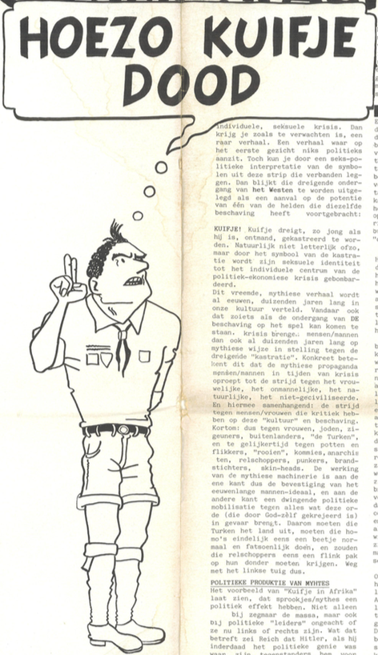
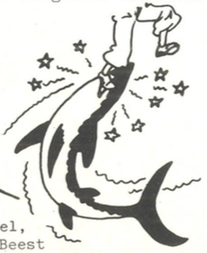

---
Pr-id: Bilwet Fascismemap
P-id: Theory on Demand
A-id: 30
Type: article
Book-type: anthology
Anthology item: article
Item-id: unique no.
Article-title: Seksisme racisme: Hoezo Kuifje dood?
Article-status: accepted
Author: Bas-Jan van Stam
Author-email:   corresponding address
Author-bio:  about the author
Abstract:   short description of the article (100 words)
Keywords:   50 keywords for search and indexing
Rights: CC BY-NC 4.0
...

# 13. Seksisme racisme: Hoezo Kuifje dood?

Door Bas-Jan van Stam. Verschenen in *Bluf!* nr. 67, 5 mei 1983.

Seksisme/Fascisme: rekonstruktie van een mannen-ideaal*, dat is de titel
van een boekje dat ik heb geschreven.*[^1] *Daarin doe ik een greep uit
enkele centrale mythen van de Westerse beschaving: de mythe van de
rationaliteit, de mythe van de heldhaftigheid, en die van de Westerse
superioriteit. Die mythes onderzoek ik op hun seksistische grond. Naar
aanleiding daarvan dit verhaal.*

## I. Alledaags racisme versus politiek racisme

Zo’n beetje iedereen zal wel eens de ervaring hebben gehad, dat racisten
buitengewoon handig zijn je voor schut te zetten. Als je ingaat tegen
een racistische opmerking van iemand op de markt, in een winkel of op
een verjaardag, dan loop je het risico door zo iemand in de kortst
mogelijke tijd ‘weerlegd’ te worden met de opmerking, dat een tante van
een zwager … enzovoorts. ‘Ik heb het haar zelf horen zeggen!’
Uitgeëvangeliseerd ben je en zo iemand, die je meende te moeten
terechtwijzen, kijkt dan om zich heen met een gezicht van: ‘Ik
racistisch? Kom nou! Die Turken passen zich toch ook niet aan? Dat is
toch gewoon zo? Mag ik dat niet eens meer zeggen, of hoe zit dat nou?’
En jij wordt op jouw beurt beschuldigd van naïviteit, intolerantie en
dat je ook achter alles iets racistisch ziet.

Van zulk soort ‘slimme trucs’ wordt constant gebruikgemaakt in het
alledaags racisme. Zo automatisch gaat dat, dat menigeen geen trek meer
heeft er nog tegenin te gaan. Het heeft toch geen zin. Wat dat betreft
lijkt het ook veel effectiever actie te voeren tegen de politiek
georganiseerde vormen van racisme. Acties in het bijzonder dus tegen de
NVU en de Centrum Partij en meer in het algemeen tegen racistische
praktijken, maatregelen en tendensen bij de overheid, ‘gewone’ politieke
partijen en de politie, enzovoorts.

Voor mij is het echter de vraag of een dergelijke afbakening van de
antifascistische strategie op den duur wel effectief is. Ik vraag me af
of het zin heeft je te concentreren op het politiek georganiseerde
racisme, terwijl ondertussen het alledaagse racisme buiten schot gelaten
wordt. Tegelijkertijd denk ik, dat het inderdaad weinig zin heeft
alledaagse racistische uitspraken steeds maar weer te willen ontmaskeren
als leugens en onwaarheden. Voor mij is het namelijk niet de allereerste
vraag of mensen het wel doorhebben, dat hun racistische uitspraken op
leugens en onwaarheden berusten. Dat hebben ze zelf ook wel door.
Vandaar namelijk die ‘slimme trucs’, als een automaat toegepast. Voor
mij is het daarom allereerst de vraag waarom ze hun toevlucht nemen tot
zulk soort leugens. Dat is het probleem en niet zozeer of ze zonder het
zelf te weten leugens vertellen.

De neiging om de bestrijding van het alledaagse racisme niet centraal te
stellen, heeft volgens mij alles te maken met een fundamentele
miskenning van de manier waarop zoiets als het politiek bewustzijn van
mensen in het algemeen werkt. In het algemeen gesproken bepalen mensen
hul politieke voorkeur niet op grond van het grondig bestuderen van
meestal toch nietszeggende partijprogramma’s, maar eerder op grond van
wat ik hier ‘mythische’ beweegredenen noem. Het mythische is naar mijn
mening veel belangrijker in de politiek, dan al die zogenaamde
rationele, op feiten gebaseerde en objectieve politieke redeneringen,
programma’s en tegenargumenten.

Op deze kanten van het alledaags racisme ga ik in op deze pagina’s.
Eerst meer in het algemeen (Kuifje in Afrika), dan toegespitst op een
recente gebeurtenis (De Tram). Vervolgens geef ik een voorbeeld van
alledaags racisme en ten slotte wil ik iets over de werking van
hetzelfde mythische bewustzijn binnen ‘de’ antifascistische beweging
zelf te berde brengen.

## II. Kuifje in Afrika

Eén van de verhalen die ik als mythe in mijn boekje heb gelezen, is
*Kuifje in Afrika.* Dit eerste officiële album van Hergé had mijn
belangstelling, omdat het ontstaan was tijdens het dieptepunt van de
crisis voor de Tweede Wereldoorlog (1930). Net als in onze tijd was er
sprake van openlijke racistische tendensen – Hitler begon aan zijn
overrompelende mars naar het parlement – en bestond er een neiging
waarbij radicaal-links en -rechts tegenover elkaar op straat kwamen te
staan. Tussen deze beide radicale kampen in bevond zich het politieke
midden, dat als een opeenhoping van grote logge blokken zo goed en zo
kwaad als het ging nog machtspolitiek probeerde te bedrijven.

De nieuwe, jonge, dynamische en enthousiaste medewerker Sjors Rémie
hield er bij zijn werkgever *Le Vingtième Siècle* uitgesproken politieke
ideeën op na. Bijvoorbeeld dat ‘het’ socialisme verderfelijk en uit den
boze was en alles wat daar maar ook in de verte mee te maken kon hebben
dus met kracht bestreden diende te worden. Vanuit deze enthousiaste
visie had Hergé eerder (in 1929) al de reporter met de Kuif naar de
Sovjet-Unie doen afreizen. Uit het verslag dat De Kuif over deze missie
naar de krant opstuurde, bleek dat de socialistische heilstaat niets
anders was den een poel van ellende, corruptie, armoede, onderdrukking,
bedrog, uitbuiting, terrorisme, gemenigheid, enzovoorts. ‘Het’
socialisme kon dus ook geen oplossing bieden voor de
politiek-economische crisis van die jaren. Weg met die rooien, dus!

Welke oplossing zag Hergé dan wel zitten? Een belangrijk element van
zijn oplossing is natuurlijk te vinden in het openlijk racistische
karakter van *Kuifje in Afrika.*[^2] De zwarte Afrikaanse bevolking
wordt voorgesteld als buitengewoon dom en lui. Die ‘eigenschappen’ van
het ‘n\*\*\*\*ras’ blijken voor Hergé een bron van vermaak op te
leveren.[^3] Met deze racistische grappen liet Hergé zijn lezertjes en
lezeresjes als vertegenwoordigertjes van het superieure blanke ras
vrolijk schateren om de domme streken van een ander ras. Allemaal nette,
welopgevoede Rooms-Katholiekjes, die nu als vette, weldoorvoede
zestigers in het Brusselse tekeergaan tegen het Noord-Afrikaanse ras.
(Maar dit terzijde.) Terwijl de fascisten in Duitsland dus bezig waren
met de vernietiging van het ‘Joodse ras’, bevestigde Hergé op deze wijze
het idee dat gevoelens van superioriteit inderdaad iets te maken hebben
met ‘natuurlijke raskenmerken’.

Als je naar de vorm van *Kuifje in Afrika* kijkt, vallen je twee dingen
aan dit stripverhaal in het bijzonder op. Ten eerste is dat het nogal
sprookjesachtige karakter. Het is voor kleine kinderen bedoeld, er
gebeuren allemaal vreemde dingen, Kuifje heeft ruzie met allerlei
beesten, de n\*\*\*\*tjes doen ook al eng, en dan is er nog die gemene
schurk die Kuifje dood wil maken. Maar hoe eng het ook alleemaal is,
uiteindelijk komt toch alles goed: eind goed, al goed! Het tweede dat
opvalt, is dat Kuifje het in zijn uppie (slechts bijgestaan door zijn
hondje Bobbie) doet. Heel af en toe helpt God hem, of een priester, maar
dat is ook zo’n beetje God.

Deze sprookjesvorm heeft dus het effect dat allerlei gevaren, van wat
voor aard ze ook zijn, op een individuele wijze worden ‘opgelost’. De
oplossing die Hergé voorstelt ligt dus op het individuele vlak, zoals
dat heet. Zoiets hoor je ook in onze tijd maar al te vaak. Bijvoorbeeld:
wie echt wil werken, wie echt erachteraan zit om werk te vinden, die kan
heus nog wel werk vinden. Al die lamlendige, rondhangende werklozen, dat
zijn profiteurs, luie en verwende welvaartskinderen. De knoet erover
dus!

Inhoudelijk gezien valt vooral op, dat het verhaal heel associatief
geschreven/getekend is. De sprookjesvorm wordt gevuld met een
droominhoud. Hergé heeft het verhaal bij wijze van spreken met zijn ogen
dicht gemaakt. En dat levert een verhaal op, waarin niet een duidelijke,
van tevoren bedachte lijn inzit, zoals dat met de latere albums wel het
geval is. Eigenlijk is *Kuifje in Afrika* als verhaal niets anders dan
een op het eerste gezicht willekeurige aaneenschakeling van bizarre
grappen, enge situaties en korte, spannende voorvalletjes. Maar toch is
het een ‘compleet’ verhaal. En omdat het zo’n ‘complete’ indruk wekt,
moet er ook een bepaalde, verborgen structuur en logica in zitten. De
‘logica’ van een dergelijk schakelverhaal kun je het beste vergelijken
met de ‘logica’ van een droom. Ook in dromen gebeuren allerlei vreemde
dingen die op het eerste gezicht vaak niets met elkaar te maken hebben.

Ik bedoel maar: Freud dus!

Freud en Kuifje, dat was voor mij een openbaring, opzienbarend,
onthullend, verbazingwekkend, haren overeind, perplex en wat dies meer
zij. Net alsof ik aan het eind van een lange bergwandeling bovenaan de
top kwam. Alles was daarvoor nog in de mist, maar dan lost plotseling de
bewolking op en zie ik het landschap beneden me. Ineens zie ik de
samenhang: alles lig ineens dicht bij elkaar, alle wegen staan met
elkaar in verbinding, dorpen, boerderijen, riviertjes, bomen en daar
ergens moet mijn tent staan, zo fiets ik naar de bakker, daar
achterlangs loopt ook een weg naar het dorp, enzovoorts. *Kuifje in
Afrika* is zo’n landschap diep beneden je. Pas als je die hele omweg van
de politiek-economische crisis, het racisme van die dagen, de ‘dreiging’
van de Sovjet-Unie, de enorme werkloosheid, enzovoorts, naar de
individuele droomwereld en zijn sekspolitieke symbolen hebt afgelegd,
pas dan krijg je zich op die mythische machinerie van het fascisme. Pas
dan zie je de verbindingen tussen bijvoorbeeld de plaatsen waar je
droomt, geniet, bang bent en waar je geld wisselt (om maar iets te
noemen).

Wat blijkt namelijk? Dat Hergé door middel van zijn stripheld Kuifje de
maatschappelijke politiek-economische crisis vertaalt in een
individuele, sekspolitieke crisis. De toentertijd volgens velen op
stapel staande ondergang van **de beschaving** koppelt Hergé (‘God zij
hem ganadig’) aan een individuele seksuele crisis. Dan krijg je zoals te
verwachten is, een raar verhaal. Een verhaal waar op het eerste gezicht
niets politieks aan zit. Toch kun je door een sekspolitieke
interpretatie van de symbolen uit deze strip die verbanden leggen. Dan
blijkt die dreigende ondergang van het Westen te worden uitgelegd als
een aanval op de potentie van één van de helden die dezelfde beschaving
heeft voortgebracht:

KUIFJE! Kuifje dreigt, zo jong als hij is, ontmand, gecastreerd te
worden. Natuurlijk niet letterlijk ofzo, maar door het symbool van de
castratie wordt zijn seksuele identiteit tot het individuele centrum van
de politiek-economische crisis gebombardeerd.

Het castratiemes gaat van hand tot hand: de papegaai, de kapitein, de
n\*\*\*\* met de zaag, de scheepsarts, de deur van de behandelkamer, de
boef, de siderrrog, de metalen (!) reddingskabel, de haai. Op die manier
wordt de castratiedreiging van Bobbie op Kuifje overgedragen. De
N\*\*\*\* en het Beest vervullen een cruciale rol daarbinnen: de
N\*\*\*\* door z’n stommiteiten, het beest voltrekt de
‘castratiedreiging’. (In werkelijkheid is de castratieketen nog enkele
schakels langer, zie daarvoor het boekje.)

Dit vreemde, mythische verhaal wordt al eeuwen, duizenden jaren lang in
onze cultuur verteld. Vandaar ook dat zoiets als de ondergang van ‘de’
beschaving op het spel kan komen te staan. Crises brengen mensen/mannen
dan ook al duizenden jaren op mythische wijze in stelling tegen de
dreigende ‘castratie’. Concreet betekent dit dat de mythische propaganda
mensen/mannen in tijden van crisis oproept tot de strijd tegen het
vrouwelijke, het onmannelijke, het natuurlijke, het niet-geciviliseerde.
En hiermee samenhangend: de strijd tegen mensen/vrouwen die kritiek
hebben op deze ‘cultuur’ en beschaving. Kortom: dus tegen vrouwen,
joden, zigeuners, buitenlanders, ‘de Turken’, en tegelijkertijd tegen
potten en flikkers, ‘rooien’, commies, anarchisten, relschoppers,
punkers, brandstichters, skinheads. De werking van de mythische
machinerie is aan de ene kant dus de bevestiging van het eeuwenlange
mannen-ideaal en aan de andere kant een dwingende politieke mobilisatie
tegen alles wat deze orde (die door God zelf gecreëerd is) in gevaar
brengt. Daarom moeten die Turken het land uit, moeten die homo’s
eindelijk eens een beetje normaal en fatsoenlijk doen en zouden die
relschoppers eens een flink pak op hun donder moeten krijgen. Weg met
het linkse tuig dus.

## III. Politiek productie van mythes

Het voorbeeld van *Kuifje in Afrika* laat zien dat sprookjes/mythes een
politiek effect hebben. Niet alleen bij zeg maar de massa, maar ook bij
politieke ‘leiders’, ongeacht of ze nu links of rechts zijn. Wat dat
betreft zei Reich dat Hitler, als hij inderdaad het politieke genie was
waar zijn tegenstanders hem voor hielden, dat juist Hitler dan heeft
onthuld hoe politiek ‘werkt’: namelijk langs de weg van de beïnvloeding
van het onbewuste, het mythische. De werking van mythes kun je wat dit
betreft vergelijken met een machine. Zo’n machine produceert de
politieke context waarbinnen mensen leven, denken, handelen. Dat
betekent dat het belangrijk is meer inzicht te krijgen in de werking van
deze mythische machines. Want het is niet zo, dat zo’n machine tot
stilstand gebracht kan worden door een steen tussen de tandwielen te
gooien. Eerder is het omgekeerd: die machines gaan pas werken zodra er
stenen gegooid worden.

## IV. De mythe van de tram

Eén van de meest vreemde dingen rond de ontruiming van de Lucky Luyk
indertijd, vond ik wel ‘De Tram’, of beter: ‘De Mythe van de Tram’.[^4]
Dat verhaal van die tram noem ik een mythe, omdat het een omvorming van
emoties liet zien in een bepaald symbool. In dat symbool, de tram dus,
verenigden mensen zich die elkaar totaal niet kenden en vonden ze bij
elkaar houvast. De zaak was voor hen helder en klaar. Hun twijfels waren
opgelost en hun verontwaardiging richtte zich massaal naar een groep van
buitenstaanders, in dit geval ‘de’ kraakbeweging.

Het is ongelooflijk, maar daags na de Lucky Luyk en nog dagen dáárna het
gesprek van de dag die tram. Ik heb verhalen gehoord waarin verteld
werd, dat de heldhaftige bestuurder als de kapitein van een zinkend
schip als laatste man van boord ging terwijl inmiddels de tram al in
lichterlaaie stond en kort tevoren had die nog bomvol gezeten met
mensen. Ooggetuigen zouden gezien hebben, dat de bestuurder dwars door
knetterende vlammen en dikke wolken walmende rook (veel plastic troep en
rubber en zo) zich nog een weg baande naar achteren om te controleren of
al zijn passagiers zich wel in veiligheid hadden weten te brengen. Het
leek Beilen wel, maar dan een beetje erger.[^5] Dit was namelijk pure
anarchie. Dit had niets meer met kraken te maken. Dat waren geen normale
krakers meer, maar stukken ongedierte, die uit het hele land waren
samengestroomd om hier even de boet te ontregelen en onschuldige burgers
het ziekenhuis in te trappen. Er had wel een invalide in die tram kunnen
zitten; er had wel paniek kunnen uitbreken; ze hadden wel allemaal
levend kunnen verbranden; een wonder dat het zo goed is afgelopen
(jammer ook wel een beetje eigenlijk), enzovoorts. Plus, dat zo’n
trammetje al gauw een paar miljoen kost. En wie draait daar weer voor
op? Wij met z’n allen! Probeer de schuldigen maar eens te pakken te
krijgen tussen al dat tuig, enzovoorts.

Op die manier functioneerde dit verhaal van de Tram als een emotionele
legitimering van het politiegeweld. Alle kranten deden daaraan mee.
(Alleen *De Waarheid* probeerde met de foto van die Rietveld-student een
tegen-mythe in het leven te roepen.) De Tram werd in enkele dagen het
symbool van de *law-and-order*-rechtstaat. Alle onderhuidse angsten
klampten zich plotsklaps vast aan dat ene symbool van de brandende tram.
Er hoefde verder ook niets meer beargumenteerd te worden: met die Tram
brandde het laatste restje twijfel weg, dat de meeste mensen nog hadden,
als het ging om de vraag of dat nou wel zo nodig moest al dat
machtsvertoon bij ontruimingen in de stad. Mensen die anders hun mond
nog hielden, zongen nu eendrachtig mee in het requiem van de tram en
knikten ‘ja’ als het koor bezwerend sprak dat het tuig in strafkampen
moest worden opgesloten. Nu keken ze mij vijandig aan als ik zei dat ik
niet in de krakers-sters als beesten te keer waren gegaan, maar de
politie. Dan keken ze medelijdend naar elkaar alsof mijn stem geklonken
had als van iemand uit het dodenrijk.

Een in de fik geraakte tram haalt altijd de krant. In zekere zin
symboliseert een tram de dynamische circulatie in een drukke stad. Als
dat vlamvat, dan ‘staat gansch het raderwerk stil’. Maar nu kwam er iets
nog bedreigenders bij: de Lucky Luyk en ‘de’ kraakbeweging. Door die
combinatie sloeg pas echt de vlam in de pan.

## V. De buurman

Het voorbeeld van de Tram maakte de actualiteit van de
mythes-in-het-algemeen duidelijk. Nu wil ik hetzelfde verschijnsel
toespitsen op het onderliggende verband tussen seksisme en racisme. Het
alledaagse racisme dus. Het gaat over iemand bij mij uit de straat. Hij
is inmiddels verhuisd, dus wat dat betreft is het probleem opgelost.
Boven en naast hem woonden vier Marokkaanse gezinnen. Regelmatig kwam
hij bij hem over de vloer. De ene keer om te helpen bij het aanleggen
van een douche, de andere keer om formulieren in te vullen of om gewoon
te ouwehoeren. Ook met de kinderen van de Marokkanen kon hij overweg.
Bepaald geen slechte verhouding dus.

Toen hoorde ik hem een keer tegen één van die Marokkaanse buurjongetjes
zeggen, terwijl hij hem bij zijn schouders greep en hem tegen de gevel
duwde: ‘Ze moesten jullie allemaal doodmaken. Doodmaken, hoor je?’ Als
hij hetzelfde in een voor mij vreemde taal gezegd had, dan zou ik
begrepen hebben, dat hij zoiets gezegd moest hebben als: ‘Hé, wil je
soms vechten tegen zo’n oude man? Zal ik eens laten zien hoe sterk ik
nog ben?’ Ook het buurjongetje moest er een beetje om lachen, alsof hij
verstaan had wat ik begrepen zou hebben, als ik hem niet woordelijk
verstaan had.

Enkele dagen later besloot ik terug te komen op het rare incident. Ik
dacht, laat ik nou maar niet meteen met die racistische toestand
beginnen, maar eerst iets aardigs zeggen over zijn buren. Nou, dat was
hij roerend met me eens: beste buren, beter dan Nederlandse vaak, want
dat was ook niet veel soeps meer tegenwoordig. ‘Maar zal ik jou eens wat
vertellen?’ vroeg hij en ging toen op fluisterafstand tegen me aan
leunen. ‘Nou?’ vroeg ik, al vermoedend wat voor verhaal volgen zou, want
die vertrouwelijke en intieme sfeer kende ik van vorige gelegenheden.
‘Weetje, die Turk van driehoog hierboven,’ fluisterde hij en op dat
moment schoot me zijn mededeling te binnen over zijn nichtje die zulke
enorme dijen moest hebben, dat ze je er met gemak mee kon pletten, plus
zijn gehijg over een kraakster aan de overkant, die hem haar tieten had
laten zien omdat ze expres bukte toen ze wist dat hij keek. ‘Die Turk,’
zei hij, ‘is al bezig aan zijn derde wijf. De eerste twee heeft hij
doodgeneukt. Doodgeneukt, hoor je? Godver, ik heb ze vaak horen gillen,
die krengen. En nou ligt zij in het OVG.[^6] Ach man, laat ik jou dit
vertellen, die gasten horen hier niet. Laat ze dat Godverdomme bij hun
eigen in Turkije doen. Daar mag het misschien.’

‘Marokko,’ verbeterde ik, maar ook deze tweede keer wist ik niet hoe ik
hier nou op kon reageren. Ontkennen wat hij me ‘in vertrouwen’ had
toegefluisterd, had geen zin. Niet omdat het wellicht ‘waar’ zou zijn
wat hij me over zijn buurman op driehoog had verteld, daar geloofde ik
niets van. Maar het had geen zin, omdat het in twijfel trekken van de
‘waarheid’ van zijn beschuldigingen het gesprek op een ander onderwerp
zou brengen waar het juist niet over moest gaan. Zoiets ontkennen is
hetzelfde als het aangaan van een discussie over de vraag of het nou wel
of niet waar is, dat Joden meer stinken dan Nederlanders. Niet het
probleem is dat die man van driehoog zo ‘beestachtig potent’ zou zijn,
maar veel meer dat die oude buurman zijn eigen onbewuste
angsten/verlangens niet anders dan op zo’n manier (vertrouwelijk en wel)
ter sprake kon/wilde brengen. Waar het mij om gaat is het beantwoorden
van de vraag, waarom vertrouwelijkheid deze racistische vorm kiest.

## VI. De mythe rond Ton H.

De politieke productie van mythes is niet aan ‘rechts’ of aan racisten
voorbehouden. Eén van de fraaiste voorbeelden van mythevorming bij
‘links’ is Ton H, het 2,80 meter lange ‘ware gezicht’ van de Centrum
Partij.[^7] Vooral toen hij die bom gegooid zou hebben in het
Ajax-stadion. *De Waarheid* deed lustig mee aan deze mythevorming rond
Ton H.’s persoon. En gleed toen ook gevoelig onderuit. Ze hadden nog
niet koud de ‘bewijzen’ breed uit op de voorpagina uitgemeten, of prompt
de volgende dag meldde zich de echte dader bij de politie. Weg mythe,
weg eenheid!

Een ander ietwat versleten voorbeeld van politiek mythevorming is
natuurlijk ‘Het Kapitaal’, dat het allemaal doet. Of een andere: de
Staat. Weg met het kapitaal, weg met de Staat, weg met het beest Ton H.
en weg met alles wat daarmee te maken heeft. Zo’n symbool zorgt ervoor
dat ‘links’ het ineens zomaar helemaal met elkaar eens is. Alle concrete
belangstellingen, alle persoonlijke frustraties, twijfels, ongenoegens,
voorkeuren enzovoorts worden allemaal gelijkgeschakeld en moeten wijken
voor de strijd rond dat ene symbool van Het Beest, dat klaar staat om
ons op te eten. Allemaal tegen het Beest, want het Beest moet dood!

Op die manier kun je nauwelijks nog verwachten dat antifascistische
strijd bevrijdend werkt. Als ieder haar of zijn persoonlijke, politieke
enzovoorts belangen moet opofferen aan de Strijd tegen het Beest, dus.
Fascisme zelf fungeert trouwens ook vaak als een, om niet te zeggen het
symbool van het Beest en het beestachtige.

## VII. Conclusies

Is Ton H., is het Fascisme dan niet beestachtig? Uiteindelijk denk ik
dat ik inderdaad ‘nee’ moet antwoorden. Wat die Ton H., wat het Fascisme
laat zien, is de uiterste individuele respectievelijk maatschappelijke
consequentie van een cultuur die gebaseerd is op de fixatie van
mannelijke en vrouwelijke identiteiten. Die basis maakt de werking van
de mythische machine van het fascisme mogelijk.

Een citaat uit een album ter ere van de vijftigste verjaardag van Kuif
is illustratief. Daar (in *Het Imaginair Museum van Kuifje,* p. 21-23)
staat: ‘In het raam van een christelijke opvoeding die de geslachten als
rassen van elkaar scheidde, was de vrouw, voor Hergé, een vreemd land,
een andere wereld.’ Of dat nou per se zo typisch christelijk is, dat
wens ik te betwijfelen. Als ik een zekere Horst Kurnitzky moet geloven
(*Triebstruktur des Geldes* heeft hij o.a. geschreven), dan heeft dat
mechanisme te maken met de wijze waarop mensen al vanaf het
allervroegste begin ‘cultuur’ gemaakt hebben.

Ik bedoel dus maar: kennelijk is voor onze beschaving de meest primaire
‘rassentegenstelling’ die tussen mannen en vrouwen. Dat betekent niet
alleen dat mensen voor hun emotionele huishouding primair afhankelijk
zijn van hun ‘seksuele identiteit’. Het betekent bovendien dat dit de
mythische basis vormt voor alle andere tegenstellingen, fronten,
onderdrukkingsmechanismen, onderdrukte/verdrongen verlangens,
enzovoorts. Van je allervroegste begin af wordt de vorming van je
gevoelsleven rond dat ene onderscheid geconstrueerd: heeft het een
pikkie of niet? (Of dat bij beesten is, dat interesseert me niet zo.)
Belangrijk vind ik slechts, dat de politieke onderdrukking van mythes
telkens weer draait om dat ene onderscheid.

Binnen dit fundamentele onderscheid vindt ook de productie plaats wat we
het rationele denken noemen (zie hoofdstuk 1 uit mijn boekje). Uit het
voorbeeld van buurman bleek dan ook dat racistische vooroordelen niet op
een ‘rationele’ wijze weerlegd kunnen worden. Het is eenvoudig niet zo,
dat racisten overtuigd worden van hun ongelijk, als je aantoont dat het
niet ‘waar’ is, wat ze over Turken, n\*\*\*\*\*, feministes, vrouwen,
homo’s, twaalfjarige punkers, enzo beweren. Een rationele tegenstrategie
van ‘racistische leugens’ schiet wat dat betreft te kort.

## VIII. Perspectief

Natuurlijk is dit geen ‘nieuw’ verhaal. Iedereen weet zo’n beetje
tegenwoordig wel dat fascisme, seksisme, vrouwenhaat, homohaat en noem
maar op met elkaar te maken hebben. Soms fungeert het als een soort
verplicht prevelementje dat je af moet draaien wil je je tot ‘de’
antifascistische beweging mogen rekenen. Maar hoe of die dingen nu
concreet samenhangen en hoe je in een antifascistische strategie daar
rekening mee kunt houden, dat is heel wat anders. Als je daarover aan de
praat raakt, dan resulteert dat meestal in een uiterst moeizaam
gemanoeuvreer met formuleringen van ‘minimale prioriteiten’ en
‘minimumdoelstellingen’, waarbij je ondertussen ook verduveld goed moet
opletten per ongeluk in een formulering niet weer een of andere
bedreigde groep te vergeten. Het AFFRA weet daarover mee te praten.[^8]

Ik heb niet de pretentie hieruit te zijn. Wel heb ik het idee dat die
eindeloze discussie over wat je nu het eerst moet bestrijden en wat het
belangrijkste is om te bestrijden, ten dele daarom zo eindeloos is omdat
men binnen ‘de’ antifascistische beweging tamelijk blind is voor de
mythische kanten aan fascisme.

Maar wat dan wel? Allereerst is denk ik nodig dat men binnen ‘de’
antifascistische beweging in het bijzonder en bij de andere zogenoemde
maatschappij veranderende bewegingen in het algemeen oog krijgt voor de
effecten en logica van het mythische productieproces. Pas dan versta ik
wat zo’n buurman me in vertrouwen toefluisterde. Dan pas krijg ik oor
voor zijn ‘reële angstgevoelens’. Pas dan ten slotte krijg ik er oog
voor waarom bijvoorbeeld die rottige huizen waarin mensen gedwongen
worden te wonen, waarom die muren hen zo frustreren. Bevolkingspolitiek
(de politieke regulering van mensen) is de reductie van de samenleving
tot de cellenstructuur van de tegenstelling tussen man en vrouw. Binnen
deze cellen wordt de mythe van het andere ras, van het vreemde land
Afrika geproduceerd, waar de Kuif tegen het Beest (Sint-Joris en de
Draak) moest vechten. Politici zijn ook wel erg dom, als ze niet
aansluiten op deze productieplaatsen. Om stemmen te krijgen,
om-de-Stem-des-Volkes-wille, moeten ze wel.

In de tweede plaats lijkt me een voorwaarde, dat we zelf breken met de
productie van mythes op basis van de scheiding tussen mensen in twee
seksen, die als vreemde rassen om elkaar heen sluipen en elkaar vanuit
hun ooghoeken beloeren, met kloppend hart in de keel elkaar voorzichtig
(je weet maar nooit) betasten om elkaar uiteindelijk gewelddadig te
overweldigen. In mythes is het altijd zo dat het mannetje eerst held
moet zijn, eerst een vreselijk gevecht moet leveren, om daarna als
beloning bij het vrouwtje te mogen. Vernietiging is een voorwaarde tot
liefde. Bij het Songfestival in Duitsland klapte de zaal elke keer
geestdriftig als ‘de inzending van Israël’ weer een paar puntjes erbij
kreeg. O, wat houden de Duitsers van de Joden!

Het alternatief dus. Ik kan nu wel ingewikkeld gaan doen over de
aansluiting bij de vrouwenbeweging, over de noodzaak van een
mannenbeweging, enzovoorts; over het ontwikkelen van een andere inhoud
voor waarheid/rationaliteit op basis van een andere vormgeving aan de
verhouding tussen mensen; dus over het breken met de seksuele
reproductie als culturele basisvorm van de maatschappelijke reproductie;
over het Verlangen dat vrij moet zijn eigen productieplaatsen te kiezen;
over het Verlangen dat geen object kent; en over wat daar allemaal wel
niet mee samenhangt, enzovoorts … Maar dat zijn allemaal dromen. Ik
droom inderdaad van een complex gebouw waar ik tv ga kijken in een
ruimte waar andere mensen tv kijken en op het beeldscherm kijken we naar
onze eigen dromen. Heel complex, maar tegelijkertijd een feest. Meestal
eindigt de droom ermee, dat ik me plotseling herinner dat ik de sleutel
terug moet brengen. Een oudere man neem hem lachend in ontvangst.
Misschien moeten we vaker dromen, elkaar onze dromen vertellen, elkaar
onze sleutels uitwisselen. Ik zeg maar wat. Maar hoe dan ook, het is wat
anders, dan wat Colijn vlak voor het uitbreken van de Tweede
Wereldoorlog gezegd schijnt te hebben. Van hem mochten we rustig gaan
slapen, vadertje Staat waakte over ons. Hij was in het geheel niet
geïnteresseerd in onze dromen. Als we maar sliepen, dan kwam alles wel
in orde.

[^1]: Bas-Jan van Stam, *Seksisme Fascisme: rekonstruktie van een
    mannenideaal: over de korrespondentie tussen een ouwe Griek, een
    fiere held en een jonge reporter* (Amsterdam: Stam, 1983).

[^2]: Hergé, *Kuifje in Afrika* (1931-‘32).

[^3]: Letters van n-woorden in de oorspronkelijke tekst zijn vervangen
    door sterretjes (\*). Zie voor een verantwoording het voorwoord van
    deze bundel.

[^4]: De Lucky Luyk was een in 1981 gekraakt pand aan de Jan
    Luijkenstraat in het Museumkwartier, Amsterdam Zuid. De ontruiming
    van dit pand in oktober 1982 ging gepaard met zulke grote rellen,
    dat burgemeester Wim Polak voor het eerst sinds de Tweede
    Wereldoorlog de noodtoestand uitriep. Zowel krakers als politie
    gebruikten in de confrontaties excessief geweld, waarbij ook een
    tram op de kruising van de Van Baerlestraat en de Paulus
    Potterstraat in vlammen op ging. De ontruiming van Lucky Luyk wordt
    gezien als een keerpunt in de geschiedenis van de kraakbeweging,
    waarbij de beweging veel van haar steun bij de samenleving verloor.

[^5]: Op 2 december 1975 begon de twaalfdaagse Treinkaping bij Wijster
    door een groep Zuid-Molukse jongeren (niet te verwarren met de veel
    bloedigere tweede treinkaping bij De Punt in 1977) waarbij drie
    doden vielen. Wijster ligt tussen treinstations Hoogeveen en Beilen.

[^6]: Het Onze-Lieve-Vrouwe-Gasthuis in Amsterdam.

[^7]: De Haagse Ton H., een grote kerel en lid van de Centrumpartij,
    werd in januari 1983 verdacht van het gooien van twee bommen in het
    Ajax-stadion tijdens de wedstrijd Ajax-FC Den Haag. Omdat van H. ook
    werd gedacht de lijfwacht van Janmaat te zijn geweest, werd hij
    gezien als ‘het ware gezicht van de Centrumpartij’. H. bleek
    onschuldig te zijn en bovendien nooit als Janmaats lijfwacht te
    hebben gediend.

[^8]: AFFRA, het Anti-Fascistisch Front Amsterdam, werd in 1982
    opgericht als koepelorganisatie voor krakerscollectieven,
    homorechtenactivisten, buurtcommités, werknemersorganisaties, enz.
    Het zette een centrale meldlijn voor fascistische activiteiten op,
    waar melding kon worden gemaakt van racisme, seksisme, xenofobie,
    autocratisch staatsbestuur (samen de ‘potentiele basis voor
    fascisme’). Ook werkte AFFRA ‘fascistische’ activiteiten, zoals
    bijeenkomsten van de Centrumpartij en de NVU, actief tegen. AFFRA
    liep echter tegen het probleem aan dat zo ongeveer elke vorm van
    onderdrukking aan fascisme werd gelijkgesteld, waardoor het woord
    fascisme betekenisloos werd en het onmogelijk werd een
    antifascistische strategie uit te stippelen.
