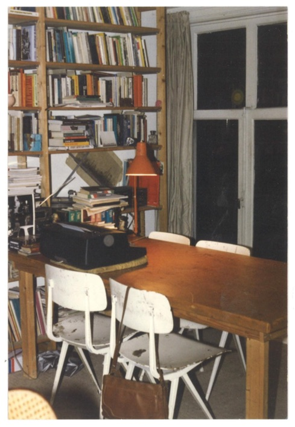

---
Pr-id: Bilwet Fascismemap
P-id: Theory on Demand
A-id: 30
Type: article
Book-type: anthology
Anthology item: article
Item-id: unique no.
Article-title: Inleiding: Dialoog tijdens het redigeren van de Bilwet-fascismemap
Article-status: accepted
Author: Sepp Eckenhaussen en Geert Lovink
Author-email:   corresponding address
Author-bio:  about the author
Abstract:   short description of the article (100 words)
Keywords:   50 keywords for search and indexing
Rights: CC NC-SA 4.0
...

# Inleiding: Dialoog tijdens het redigeren van de Bilwet-fascismemap

Door Sepp Eckenhaussen en Geert Lovink.

## I. Hoe het allemaal begon

Tussen 1983 en 1999 kwamen Bas-Jan van Stam, Geert Lovink, Arjen Mulder,
Ger Peeters en Lex Wouterloot onregelmatig - en in verschillende
samenstellingen - bijeen in een groep met de illustere naam Bilwet: de
stichting ter Bevordering van de Illegale Wetenschap. Bilwet stond voor
van alles en nog wat: een non-medium, ambulante uitgever, een didactisch
projectiel binnen de Amsterdamse kraakbeweging, een schrijfcollectief
met ambitie en internationaal succes, een jongensclub met een liefde
voor theorie in duistere tijden. In deze map is een tekst uit 1994
opgenomen, *Hoezo Bilwet? Een inleiding*, waarin meer te vinden is over
de intenties van dit stelletje ongeregeld.

Bilwet was natuurlijk geen stichting en strikt genomen ook niet
illegaal, het was eerder een 'extramurale' intellectuele samenzwering in
de marge van de afkalvende autonome beweging; in een verhard en
depressief klimaat, gedomineerd door bezuinigingen, werkloosheid en *no
future*. In dit intense leven op de pauzestand was de academische route
sowieso uitgesloten. Krakers waren radicale activisten, doe-mensen,
anarchisten, gespuis dat niet zomaar een promotieplaats kreeg
aangeboden. Dat komt ervan, als je niet redelijk wilt denken en niks van
zowel de burgerlijke wereld als het academisch marxisme moest hebben.
Dan nog eerder de journalistiek in...? Ook dat werd niks, zo bleek wel.

Bilwet kwam in voorjaar 1983 tot leven na het verschijnen van Bas-Jan
van Stams boek *Seksisme/fascisme, rekonstruktie van een mannen-ideaal*.
Dit onderwerp is niet toevallig. Begin jaren tachtig zat er flink wat
beweging in het nadenken over wat historisch fascisme was, en hoe de
naoorlogse generaties, die het zelf niet aan den lijve hadden
meegemaakt, en het publiek waren van de lawine aan herdenkingen, zich
hiertoe wilde verhouden. Dit geschiedde in de schaduw van de opkomst van
een extreemrechts milieu dat minutieus in kaart werd gebracht door het
fascisme-onderzoekcollectief FOK en andere groepen.[^1] Na een recensie
van Bas-Jans boek in het aktieweekblad *bluf!* van de hand van Geert,
kwam een ontmoeting tot stand en werd in een levendige correspondentie
de grondslag gelegd voor Bilwet als groep. Rond dezelfde had Geert het
tweedelige *Männerphantasien* van Klaus Theweleit gelezen voor een
bijvak in massapsychologie tijdens zijn opleiding politicologie aan de
UvA – het werk waar ook Bas-Jan zich had door laten inspireren. Niet
veel later verhuisde Geert voor een jaar naar West-Berlijn om daar
intensief de studie naar hedendaagse theorie in te zetten. De vraag hoe
het historisch fascisme op een eigen manier kon worden geïnterpreteerd
bleef daarbij op de voorgrond. In 1985 verscheen het eerste Bilwetboek,
geschreven door Bas-Jan en Geert, *Het Beeldenrijk*, een vrolijke
post-Freudiaanse analyse van drie hedendaagse films (*Paris, Texas*/*The
Day After*/*The Right Stuff*) waarin getracht werd de psychoanalytische
duiding van angsten en verlangens in het mediatijdperk op z'n Hollands
vast te leggen.[^2]

## II. Het ontstaan van de fascismemap

Na het verschijnen van een lovende recensie van *Het Beeldenrijk* die
Arjen Mulder, toenmalige filmrecensent van CPN-dagblad *De Waarheid*,
schreef, trad hij toe bij de groep. Ook Ger Peeters (Nijmegen) en Lex
Wouterloot werden niet veel later lid. Een van de eerste activiteiten
van de nu vijf man sterke groep was een cursus voor krakers en andere
activisten in Theweleits boek, dat net in een verkorte Nederlandse
vertaling door een Nijmeegse mannengroep was uitgegeven. De
theoriecursus werd zowel in Amsterdam als in Nijmegen gehouden.

In de periode van 1984-‘94 schreef de groep ongeveer twintig teksten
over hedendaags fascisme, bij elkaar goed voor ongeveer 300 pagina’s. In
de planning moest dit Bilwets tweede boek worden. In 1986 schreef Geert
hiervoor een opzet (die in deze map is opgenomen).[^3] Echter, niet veel
later deed de personal computer zijn intrede. De artikelen die al waren
geschreven op elektrische typemachines zouden eigenlijk overtypt moeten
worden. Aangezien er toen nog geen tekstscanners (ORC) waren, viel het
project tussen wal en schip en werd nooit afgemaakt. Een andere reden
hiervoor was het karakter van de teksten, die veeleer een
scholingskaraker hadden en niet van A tot Z gezamenlijk waren
opgeschreven. De aandacht verschoof weer naar het geven van een cursus,
weer in Amsterdam en Nijmegen, waarin gezamenlijk *De fatale
strategieën* van Jean Baudrillard werd gelezen, in een Nederlandse
vertaling, uitgeven door 1001. Qua schrijven verschoof de aandacht van
Geert en Arjen naar het vastleggen van de geschiedenis van de
kraakbeweging, die in 1987 in een rap tempo uit elkaar viel (niet veel
later uitgegeven als Bilwets tweede boek, *Bewegingsleer*).[^4]

De actualiteit van het historisch fascisme verdween langzaam maar zeker
op de achtergrond en werd overgenomen door de opkomst van 'nieuwe media'
en het naderende einde van de Koude Oorlog en de 20e eeuw. Het
herdenken bleef ook begin jaren negentig nog prominent op de agenda met
50 jaar dit en dat, maar werd overvleugeld door technologie, neoliberaal
beleid, crisis en oorlog (in de Golf, Joegoslavië, Afrika) die de agenda
beheersten. Het einde van de geschiedenis leek voorbij, wat viel er nog
te leren van het verleden?

Hoe dan ook is het zonder verdere introductie wel duidelijk Bilwet
gekenmerkt werd door een fascinatie voor fascisme. Die kwam niet uit de
lucht vallen. Wat betekende de 'waakzaamheid' waartoe de CPN, *Trouw* en
*Het Parool* opriepen, 40 of 50 jaar na de machtsovername van Hitler, de
Februaristaking en de bevrijding van Auschwitz, behalve dan het gedenken
van de slachtoffers? Het bleek niet langer voldoende te beweren dat de
oorsprong van het fascisme in het grootkapitaal lag, waarin een 'volkse'
oplossing wordt aangedragen met als doel de macht te verdedigen met
autoritaire middelen om zo de groeiende macht van de arbeidersklasse en
andere sociale bewegingen te breken.[^5] De onderstromen en het
doorleven van fascisme kwamen in plaats daarvan in de aandacht. In het
boek *Anne Frank in the World,* in 1985 uitgegeven door de Anne Frank
Stichting, wordt bijvoorbeeld niet alleen over de wrede herinneringen en
geschiedenissen besproken, maar ook gewaarschuwd voor racisme,
antisemitisme en vooroordelen in het heden.[^6] Bovendien kwam naast het
institutionele, op herdenken gerichte antifascisme (waarop de CPN zo’n
beetje een monopolie had) het niet-institutionele antifascisme (dat
later tot Antifa uitgroeide) op vanuit de krakersbeweging.

Vanaf de jaren 80 zien we dus, grof gezegd, een verschuiving van de
aandacht van gevolgen naar oorzaken. De vraag was niet langer alleen hoe
men de afschuw kan tonen voor concentratiekampen, totalitarisme,
onderdrukking en neofascisme, maar hoe het kon dat grote delen van de
bevolking, niet alleen in landen als Duitsland, Spanje en Italië,
passief en actief achter de autoritaire leiders gingen staan. Dit is de
oorspronkelijke vraag van een breed scala aan denkers, van Wilhelm Reich
en de beoefenaars van de autoritaire persoonlijkheidsstudie tot en met
Louis Althusser, die zich afvroeg hoe mensen door ideologie worden
aangesproken. Zo ontstond een psychoanalytische lezing van geheime
angsten, wensen en dromen, en hoe deze op zo’n manier kunnen worden
omgebogen en gepolitiseerd, dat het lijkt alsof ‘het grote gevaar’ komt
van sterke vrouwen, slinkse Joden, chanteerbare homoseksuelen,
buitenlanders en andere 'minderheden'.

## III. Dialoog

Sepp Eckenhaussen: Door terug te gaan naar Bilwets werk uit de jaren ’80
en ’90, keren we ook terug naar de geboorte van de mediatheorie. Ik
vraag me simpelweg af: wat was voor Bilwet de relatie tussen
fascismeanalyse en mediatheorie?

Geert Lovink: Het klopt dat wij daar parallel aan werkten. Dit ligt
geheel in de lijn van het werk van de Duitse mediatheorie en dat van
Friedrich Kittler in het bijzonder. In zijn boek *Grammophon Film
Typewriter* uit 1986, komen oorlog, fascisme, technologie en media
expliciet samen.[^7] Oorlog versnelt het onderzoek, denk maar even aan
radar en de computer, maar ook aan de FM-band en de muziekcassette. De
naoorlogse Electronica en de popmuziek zijn volgens Kittler
‘afvalproducten van WO II’.

Sepp: Hoe is Bilwets fascismeanalyse uit de jaren ’80 en ’90 bruikbaar
te maken voor de hedendaagse context? Wat moeten we *nu *met dit boek?

Geert: Allereerst is er het motief van Foucault, dat BAK – basis voor
actuele kunst in Utrecht ook onlangs oppakte: het niet-fascistische
leven.[^8] Maar wat is dat? Wat moeten we dan voorkomen, waar moeten we
waakzaam voor zijn, wat bestrijden? Of moeten dat allemaal juist achter
ons laten. Kunnen we dat wel? Hebben we de hel van de 20e eeuw
daadwerkelijk overstegen en is de collectieve psyché (en die van het
individu) werkelijk zo veranderd, dat het niet meer ontvankelijk is voor
massapsychose en het projecteren van maatschappelijke problemen op
minderheden? Belangrijk is te snappen wat het individu vandaag de dag
gaat doen zodra het in het defensief is gedrongen. De herverdeling van
welvaart verloopt niet meer zoals 40-50 jaar geleden. Hierdoor zijn
velen die buiten de boot vallen open gaan staan voor rechts-populisme.
De vraag is welke psychologische constellatie hierbij hoort. De vraag
zou dus niet moeten zijn of het historisch fascisme terugkeert maar hoe
grote groepen die niet (langer) profiteren van de rijkdom via beelden,
dromen en propaganda kunnen worden aangesproken, en uiteindelijk
gemobiliseerd, om geweld tegen afwijkende groepen te gaan gebruiken.

Sepp: Het gaat inderdaad niet om het kunnen aanwijzen van *de* fascist.
'Punch a Nazi' is het toppunt van domheid. Het heeft geen zin mensen uit
te maken voor fascist die zichzelf niet (openlijk) als fascist
identificeren. Je vervalt dan alleen maar in een welles-nietes-discussie
rond de definitie en toepassing van 'fascisme'. En dan ook nog eens
geweld gaan gebruiken? Nee, ik denk dat de grote urgentie van
hedendaagse fascismeanalyse ligt in het kunnen begrijpen en verklaren
van hedendaagse maatschappelijke tendensen en het anticiperen op
structurele toekomstige gevaren. Maar dat is natuurlijk ook niet een
neutrale analyse zonder politieke aannames of grondslagen. Bij
fascismeanalyse hoort de antifascistische strijd, en wellicht ook de
non-fascist. De belangrijkste vraag lijkt dan ook te zijn: wat betekent
het vandaag de dag om antifascist of non-fascist te zijn? In
verschillende landen zien we Trump, Orbán, Duterte, Bolsonaro, de Gouden
Dagenraad en in Nederland Wilders en Baudet die een gooi doen naar zo'n
positie. Hoe kijkt de non-fascist naar zulke verschillende bewegingen op
de wereld? Wat zegt fascismeanalyse ons over de *strong men *van
vandaag?

Geert: Een cruciale overgangstekst hier is Laclau’s *On Populist Reason*
uit 2005.[^9] Deze stamt niet uit de jaren 80, alhoewel zijn *Hegemony*
*and* *Socialist Strategy* wel die tijd is geschreven, samen met Chantal
Mouffe.[^10] Toch kunnen we *On Populist Reason* zien als een belangrijk
document dat vooral naar de toekomst wijst. Het punt is denk ik niet
meer zozeer dat mensen zich aangesproken voelen als ‘volk’ of ‘natie’.
Laclau wijst op de sociale heterogeniteit van vandaag de dag. Die kan
zich in tijden van crisis tegen het liberaal-democratische bestel keren.
Nu zijn er veel minder beleidsinstrumentaria om te sturen. Neem niet
alleen de onderklasse maar ook de ZZP’ers. Die zijn nauwelijks meer te
binden aan wat nog over is van de sociale/christelijk democratische
consensus. Wat van belang is in dit voorstadium, is de ideologische
verwarring en het bewuste mixen van linkse en rechtse thema’s en eisen,
zoals we nu bij de Franse beweging van de gele hesjes zien. Het
historisch fascisme dient hierbij als ijkpunt, als leerschool, en niet
zozeer als een absolute maatstaf. We moeten dus ophouden alles waar we
het niet mee eens zijn en als gevaarlijk beschouwen, te bestempelen als
fascistisch. Het populisme, zoals Laclau dat beschrijft, is denk ik een
beter hedendaags kader. De rijke geschiedenis, zoals we die in deze
rauwe Bilwetmap, kunnen nalezen dient dan als een inspiratiebron om te
laten zien hoe 40 jaar geleden de fascisme-analyse ineens enorm gelaagd
werd.

Sepp: Maar toch, over wat voor fascisme hebben we het nou eigenlijk
precies? Op wikikids.nl lees ik:

> Het fascisme is een politieke stroming die is bedacht door Benito
> Mussolini uit Italië. Fascisten vinden de democratie slecht en hebben
> liever een dictator, die zelf alle beslissingen neemt. Voor fascisten
> weegt het belang van het land als geheel zwaarder dan dat van de
> mensen en moet daarom iedereen meewerken aan het belang van de staat.
> Daarom zijn mensen in fascistische landen gevangengezet of vermoord
> als ze het niet eens waren met de regering. Fascisten vinden dat de
> menselijke soort verbeterd wordt door het 'recht van de sterkste'.
> \[…\] Omdat fascisten vinden dat dit ook voor landen geldt, vinden ze
> oorlog belangrijk en speelt het leger een grote rol. De Tweede
> Wereldoorlog is bijvoorbeeld begonnen door het fascistische Duitsland
> van Adolf Hitler. \[…\] Veel fascistische landen werkten samen in de
> Tweede Wereldoorlog, maar nadat ze die oorlog hadden verloren werd het
> fascisme nooit meer acceptabel gevonden.[^11]

Dit is de Jip-en-Janneke-definitie van fascisme als een historisch
netjes afgerond en ethisch afgesloten fenomeen. Die ging jullie niet ver
genoeg. Zoals Bas-Jans *boek Seksisme/fascisme* uit 1983 al toont, was er
blijkbaar een tendens in de jaren ’80 om fascisme niet alleen als
politieke stroming te zien, maar het op een of andere manier gelijk te
stellen aan seksisme. De omslag van dat boek laat bovendien zien dat het ook nog iets met racisme te maken had. Waarom? En tot welke definitie leidt
dit? Waar blijft de historische component in zo’n nieuwe definitie?

Geert: Het ging ons niet om gelijkstellen maar om het leggen van
verbanden als het gaat om de oorzaken van fascisme als politieke
stroming. Waar ligt de voedingsbodem en kan die worden weggenomen. In
Jip-en-Janneke-taal: voorkomen is beter. Eventueel zou nieuw fascisme op
straat kunnen worden bevochten (en overwonnen) dan wel worden verboden
door wetten, infiltratie en repressie (de legalistische variant), maar
waarom niet via opvoeding, onderwijs en politieke organisatie ervoor
zorgen dat mensen zich hoe dan ook niet aangesproken voelen en het spel
doorzien?

Sepp: Jullie waren niet de enigen die zo’n psychoanalyse van het
fascisme schreven. Het openbreken van conventionele definities van
fascisme is meer dan eens geprobeerd. Logisch, want wanneer we ons blind
blijven staren op wat fascisme ooit geweest is, zonder te kijken naar
veranderende productieverhoudingen, globalisering, verschuivende
politieke allianties, de groeiende macht van sociale media, etc., zullen
we nooit herkennen dat de onderstroom die ónder die historische
verschijningsvormen zat, nu misschien op een andere manier tot
uitdrukking komt dan honderd jaar geleden. Maar het valt mij op dat
wanneer fascisme-analyses voorbijgaan aan historische
verschijningsvormen, dit resulteert dat vaak in een soort
psychoanalytische *sweeping claim.*

Theweleit’s theorie is een goed voorbeeld: fascisme is het uit de hand
gelopen kolken van mannelijke fantasieën en onzekerheid. Als die
zogenoemde fascistische Soldaatmannen maar liefdevol waren opgevoed en
niet zo bang waren voor het stromen van hun eigen verlangens, had
fascisme volgens Theweleit nooit bestaan. Ik las laatst een artikel van
Bifo in de bundel *A New Fascism?, *dat heel interessant was, maar ook
verviel in zo’n soort claim. Theweleit wordt later in deze bundel nog in
detail besproken, dus laten hier als voorbeeld Bifo even volgen:

> Nationalism and fascism are mythological references, an expression of
> the desire for revenge, for violence. \[…\] \[Today,\] fascism is
> rising as a desperate and demented rebellion against the impotence of
> the will, against the subjugation of human events to the automaton.
> \[…\] Impotence is the distinctive quality of our time. Impotence and
> rage that impotence provokes – especially amongst white men – is, in
> my opinion, the deep and current return of fascism.[^12]

Hedendaags fascisme staat dus gelijk aan impotentie (inderdaad, een
mannenkwaal). Het probleem met zulke *sweeping claims *is dat ze het
vaak al te makkelijk maken voor hun critici. Bifo moet dan bijvoorbeeld
aan het einde van de tekst meteen toegeven:
> Those who cannot dance to
> the rhythm of neo-liberal competition are expelled from the planet,
> expelled from life, expelled from the right to survival, unless
> marginalised people create automous spaces of extra-economic
> exchange. Do you have to define this? Is the right word ‘fascism’? I
don’t know.

Je kunt dat wegwuiven, maar het is wel een echt probleem.
Zowel monomanie als inflatie van begrippen liggen op de loer, want juist
verruimende vaagheid van begrippen is nodig voor een alomvattende
tunnelvisie. In een Theweleitkritiek uit de jaren '80 schreef Arjen al:
'Je kunt Theweleit wel verwijten dat hij in zijn enthousiasme soms lijkt
te menen dat zijn model de enige juiste is, d.w.z. de ''werkelijke''
verklaring die alle andere verklaringen uitsluit en overbodig maakt.'

Ik snap best dat Bilwet voorbij het nulpunt van betekenis wilde
speculeren, en dat dit schrijf experiment spannend was (ik voel dat zelf
ook), maar is dat wel wat we vandaag zouden moeten willen? Is dat nog
ergens goed voor in de post-feitelijke samenleving? Zijn we niet een
keer pomo moe? Geeft een opgeblazen definitie enig aanknopingspunt, enig
inzicht om te vechten tegen hedendaags fascisme? Te strakke definities
leveren geen politiek inzicht op, zoveel is duidelijk. Maar is eindeloos
gespeculeer met steeds een andere sweeping claim niet even erg?

Geert: De psychoanalytische a.k.a. hermeneutische methode heeft nu
eenmaal tijd en ruimte nodig. Je gaat graven en volgt sporen, lijnen,
associaties, elementen uit dromen. Er bestaat niet zoiets als een
Twittervorm van deconstructie. Het zou op zich een goed plan zijn om
eens experimenten te gaan doen met het versnellen van diepte analyses.
Kan dat überhaupt? Postmoderniteit staat bij jou, vermoed ik, voor
relativering, maar daar kan binnen de fascisme analyse geen sprake
zijn—daarvoor het thema te serieus en te urgent, denk maar aan de
opkomst van Wilders en Baudet. Racisme in Nederland bestaat wel degelijk
en dat kan niet zomaar door een spraak- of denkpolitie via verboden in
oude media zoals kranten en tv worden opgelost.

Sepp: Ik zal niet langer de purist/jurist uithangen, want de
onduidelijkheid waar we het over hebben had ook een positieve kant.
Bilwet was namelijk altijd opzoek naar de productieve uitglijers, of de
opluchtende uitglijers, of ten minste de grappige uitglijers. Bas-Jan
vertelde ooit in een interview met Jo van der Spek over jou:

> Wij lezen dingen verkeerd. Mijn vader had op een soort
> barbecue-installatie in Frankrijk zo’n tegeltje en daar stond een
> mannetje gebogen te harken in de grond en als tekst stond erop 'Niet
> zonder moeite'. Geert ergerde zich daar werkelijk bont en blauw aan,
> totdat ik zei, dat 'niet' is een werkwoord, je moet zonder moeite
> nieten. Toen was het acceptabel. Dus je moet verkeerd lezen, dan
> schiet je op, dan kom je verder. Het is het weggooien van ballast, het
> streven naar niks.[^13]

Jullie hebben dan ook nogal eens een zeperd gemaakt. Klimaatbewustzijn
wegzetten als ecofascistische biopolitiek bijvoorbeeld, of sporten
bestempelen als lichamelijke oefening van de fascistische ideologie. Ik
kan wel genieten van dat opblazen voorbij het nulpunt. Wat vind je zelf
van zulke uitglijers als je ze terugleest? Kunnen we er iets mee? Zit
hier een kwaliteit in die we vandaag de dag uit het oog verloren zijn?

Geert: Dat zijn voor mij analyses van maatschappelijke fenomenen, in dit
geval sport en milieu. Je moet die dingen niet op jezelf gaan betrekken.
Het gaat hier niet om smaak of lifestyle-keuzes. Bas-Jan hield van
kijken naar voetbal. Ik lag liever op het strand terwijl Arjen hield van
wandelen. So what? Reactionaire beelden over de ‘ware’ natuur van een
land circuleren nog steeds en zulke puristische ideeën over een zuiver,
niet-vervuild land waar alles en iedereen netjes gescheiden naast elkaar
leeft en afval apart wordt opgehaald en verwerkt, zijn er nog steeds en
spelen, zeker in Duitsland, in identitaire kringen van vandaag de dag,
onder jongeren, een belangrijke rol. Het Nederlandse onderwijssysteem is
gebaseerd op apartheid, op ‘gescheiden ontwikkeling’, met VMBO en MBO
voor de migranten en de onderklasse en gymnasium voor de
‘leidinggevenden’. Veel mensen hangen die gedachte nog steeds aan. Die
groepen dienen niet met elkaar in contact te komen.

Sepp: In 1994 karakteriseerden jullie bij Bilwet de mediatheorie als
‘een expeditie om over de rand van de mediale planeet te vallen, in de
wetenschap dat deze rond is. Het blijkt mogelijk de media-almacht te
ontkennen door buitenaards te gaan. ‘’We are here to go.’’ De media zijn
geen *primordial uncarved block, *het oppervlak ervan vertoont barstjes,
patronen. Het alienstandpunt maakt die zichtbaar.’[^14] Zien we hier een
nieuwe manier om een buitenpositie in te nemen, om een
maatschappijkritiek van de ander te schrijven? In andere woorden, was de
mediatheorie in beginsel niet precies dat soort analyse waar jullie,
leunend op Klaus Theweleit en de psychoanalyse, in de fascismemap aan
voorbij probeerden te gaan?

Geert: We probeerden in eerste instantie weg te komen van het
toetermodel dat media louter en alleen ziet als doorgeefluik van
propaganda voor de heersende klasse. Eigen mediadistributiekanalen
opbouwen was belangrijk en daar hoorde ook eigen theorievorming bij.
Bilwet was daar onderdeel van (en het INC, dat deze map ruim 30 jaar
later uitgeeft, kan in deze traditie worden bezien). Ook wilden we weg
van het Habermas’ idee dat het hier zou gaan om een soort strijd in een
publieke arena waar wij dan wat input aan moesten geven. Wij wilden niet
langer participeren in de show van een ander. Hoe kunnen we media anders
denken en structureel anders vormgeven? Dat was een vraag die Klaus
Theweleit (samen met Friedrich Kittler in zijn Freiburgse tijd) indirect
bezighield: hoe kunnen de media ‘ontwapend’ worden en ontdaan worden van
hun autoritaire en militaire oorsprong? Moeten we daarvoor eerst de
geschiedenis kennen een (psycho)analyse hebben gemaakt? Ik vind dat nog
steeds een relevante vraag ook al snap ik wel dat we met de tijd steeds
verder wegraken van die 20e-eeuwse ‘oorsprong’. De democratisering van
de kanalen, technologieën en gerelateerde vakkennis blijft een inzet.
Dat heet in saai pragmatische Nederlands ‘mediawijsheid’ en daar zou
veel meer aandacht voor moeten zijn. We moeten niet terug naar dat ene
kanaal, dat ene platform, die ene stem. Veelstemmigheid betekent een
radicale aanval op de centraliserende tendensen van Facebook en Google,
minoritaire expressie vormen verdwijnen voordat je het weet, vroeger
door censuur en controle op toegang, en naar door algoritmes die ons
wegfilteren en onzichtbaar maken.

Sepp: Dit is trouwens niet de eerste keer dat wij over de relatie tussen
fascisme-analyse en mediatheorie in gesprek gaan. In 2018 interviewden
Sara-Lot van Uum en ik je samen voor het UvA-studentenblad *Simulacrum*
over memes en hedendaags fascisme, een interview dat uiteindelijk
neerkwam op de vraag: kunnen we een fascisme-psychoanalyse van
hedendaagse mediafenomenen maken?[^15] Je was toen
ambivalent in je antwoord: de productiesnelheid van memes is te hoog
voor een goede psychoanalyse, maar we kunnen ons ook niet doodstaren op
die productiesnelheid zelf zoals Deleuzianen doen (‘Oh! Wat een
productie! Geweldig!’). De conclusie die uit die ambivalentie kwam was
zoiets als (hou je vast): memes kunnen misschien wel een broeinest voor
fascisme zijn, omdat ze getuigen van een crisis in mannenidealen
(zogenaamd veroorzaakt door feminazis, *social justice warriors*,
*reverse rape* etc.), maar door de ‘*weak links*’ op sociale media en de
instabiliteit in de betekenis van memes kunnen we deze analyse nooit
hard maken en is er ook geen écht gevaar. Eigenlijk het enige dat we te
winnen hebben bij zo'n analyse is, zo stelde je, bewustwording van wat
die crisis in het mannenideaal vandaag de dag is: ‘*the void*’, het
nihilisme. Ambivalentie én een sweeping claim dus. Wat als we nu eens
wel uitspraken willen doen over fascisme in de netwerksameleving, maar
geen genoegen nemen met een ambivalent antwoord en ook geen *sweeping
claim* over de ander accepteren?

Geert: Een *sweeping claim* wordt vervelend als het uitmondt in een
moreel oordeel over de ander en het bestaande verschillen uitwist.
Verder denken dan gevraagd wordt, doorzeuren, op zoek gaan naar de
oorsprong van zaken (bijvoorbeeld via geschiedenis of de etnografie van
woorden en beelden) is iets heel anders. Je probeert op die manier juist
uit de bestaande hokjesgeest en de voorgebakken ideologieën weg te komen
door in te zoomen op details die er zogenaamd niks toe doen. Een andere
truc is inderdaad die buitenaardse optiek die uitnodigt tot een radicaal
andere zichtwijze (ook al is het maar voor even). Weer een andere
techniek is de aandacht voor het weerzinwekkende. Of de
vervreemdingstactiek. Een ander gaat de zaak van alledag in Nederland
bekijken vanuit Somalisch gezichtspunt. Of Chinees. Dit leidt allemaal
af van waar de meesten van ons zich mee bezighouden, of dat nu
gedicteerd wordt door *De Wereld Draait Door* of *PewDiePie*, dat maakt
niet uit.

Sepp: Jij stelde ooit dat het fascisme-onderzoek van Bilwet in de kern
ging om de overdracht van het WOII-trauma van de generatie die het aan
den lijve meemaakte op de generatie die er alleen van gehoord had.[^16]
De techniek die jullie voor dit onderzoek gebruikten was de *third
mind:* ‘De auteur Bilwet is vanouds een *third mind: *twee jongens en
een typemachine. De samengestelde tekst is niet de optelsom van
individuen, maar iets totaal anders, een samenballing van inzichten en
uitglijers waar de bilweter alleen nooit op was gekomen.’[^17] Jullie
schreven samen, zittend op witte stoelen, boekenkast binnen handbereik.
Nu wij samen schrijven lijkt, rijst een soortgelijke kwestie van
generatie-overdracht. Toen jullie de teksten in deze bundel schreven,
waren jullie namelijk ongeveer even oud als ikzelf nu ben. Dertig jaar
later ben ik, naar jij zegt, de eerste die de wereld van Bilwet
binnenstapt. Zullen wij die *third mind *nu aanspreken om de
generatiegrens die ons scheidt te slechten en om zo een brug te slaan
tussen de historische en de hedendaagse waarde van Bilwets geschriften?

Geert: Samen schrijven is zeer zeker geen generatiegebonden fenomeen.
Met tools zoals GoogleDocs, CryptPad en Etherpad wordt het steeds
makkelijker. Het probleem is alleen dat de urgentie en het verlangen
soms ontbreken. In de neoliberale wereld levert anoniem werken onder een
collectieve naam niks op voor je CV, hoe leuk het ook is. Zeker in de
creatieve sector worden mensen steeds individueler gemaakt. We doen nog
steeds veel samen door arbeidsdeling en specialiteiten. We hebben
anderen bitterhard nodig, maar dat resulteert niet automatisch in
anonieme collectieve entiteiten. Zoals je zegt, pas met zo’n naam kan
het fenomeen van de *third mind* optreden. Het gaat hier niet om het
louter optellen van twee of meer talenten. Je moet je echt inspannen dat
het eindproduct een hele andere kant opgaat. Collectieven komen in de
kunst nog steeds regelmatig voor maar zijn redelijk zelden als het om
schrijven gaat. Uitzondering vormen Tiqqun en The Invisible Committee.
Zij schrijven over collectieve ervaringen en politieke strategie. Wu
Ming in Italië bestaat nog steeds, zij schrijven samen fictie onder die
naam.

Sepp: Ja ik denk dat je gelijk hebt met je analyse over collectief
schrijverschap. Maar hoe zit het met die generatieoverdracht? De
fascisme-discussie in de jaren '70 en '80 was een mannendiscussie. De
allermeeste auteurs die geciteerd worden in deze bundel,
inleiding incluis, zijn mannen. De vertaling van Theweleit werd opgezet
door 'mannentijdschrift' *Manuskript*. Er wordt meer dan eens verwezen
naar 'mannenpraatgroepen'. En niet te vergeten, Bilwet was een
mannenclub. Toch was de fascisme-analyse geen circel-jerk-discussie over
mannenrechten zoals die vandaag de dag door 'incels' gevoerd wordt.
Integendeel. Het was voor mij een openbaring toen mijn moeder me
vertelde over de fascisme-discussies van toen. Het patriarchaat is
aannemelijkerwijs niet millenia lang in stand gehouden door vrouwen,
maar (deels onbewust) gereproduceerd door zorgvuldig gedisciplineerde
mannen. Bovendien rees het inzicht dat patriarchale machtsstructuren ook
voor mannen in zekere zin onderdrukkend zijn. Voor feministen als mijn
moeder was het daarom duidelijk dat in de sekse-emancipatie ook mannen
een duidelijke taak hadden, namelijk zelfanalyse. Waar makkelijker te
beginnen met zo'n mannenfeminisitische zelfanalyse dan bij het toppunt
van uit de hand gelopen mannenidealen, het fascisme?

Het lijkt er dus op dat het in de fascismeanalyse van jullie generatie
niet echt om ging wie *de* fascist was, of zelf om *het* fascisme als
zodanig, maar om het vinden van een ingang voor kritische zelfanalyse
van de mannelijke subjectiviteit. Was dat voor Bilwet inderdaad het
geval? Waarom was Bilwet eigenlijk een exclusieve mannengroep? In welke
mate was het problematisch dat de analyse van de mannelijke
subjectiviteit vrijwel uitsluitend door de mannelijke stem werd
geproduceerd? Werden mannenpraatgroepen ter ondersteuning van de
feministische zaak werden binnen de feministische beweging overwegend
met goedkeuring ontvangen, of was er ook kritiek? Hoe zou dat vandaag de
dag zijn? Is feministische zelfanalyse van en door mannen nog steeds
relevant? Bestaat dit mannenfeminisme nog, of is het verdrongen door
nieuwe vormen van identiteitspolitiek?

Geert: In denk dat fascisme-onderzoek voor Bilwet wel een onderzoek naar
onze eigen subjectiviteit was, maar ik geloof niet dat we bewust een
mannengroep waren. Wel was het zo dat onze manier van theorie en
schrijven totaal marginaal was en ons nog verder in die fringe drukte.
Ook nu is het zo dat vrouwen daar bewust of onbewust niet voor kiezen.
Voor hen is de druk, de dwang om maatschappelijk succesvol te zijn echt
groter. Of misschien was er sprake van subtiele vormen van desinteresse?
Het waren in ieder geval gescheiden werelden die niet echt met elkaar in
contact stonden. Maar ik denk niet dat het problematisch was dat mannen
over fascisme schreven, aangezien dit voor een groot deel was
geïnspireerd door feministische geschriften en acties van de (radicale)
vrouwenbeweging. En praatgroepen, die zijn er nog steeds. Punt is alleen
dat we sinds alt-right ook Jordan Peterson hebben... Dat is de nieuwe
identiteitspolitiek die de niet-fascistische zelfanalyse verdrongen
heeft.

[^1]: Zie bijvoorbeeld Antifascistisch kollektief, *De rechterkant van
    Nederland: een overzicht van extreemrechtse en fascistische
    verschijnselen in Nederland* (Amsterdam: SUA, 1983).

[^2]: Bilwet, *Het Beeldenrijk: over stralingsangst en ruimteverlangen*
    (Amsterdam: Raket en lont, 1985).

[^3]: Zie ‘Opzet Bilwet-fascismemap’ in de bijlage van deze bundel.

[^4]: Bilwet, *Bewegingsleer* (Amsterdam: Ravijn, 1990), ook online:
    <http://www.thing.desk.nl/bilwet/bilwet/Bewegingsleer/index.html>.

[^5]: Zulke klassiek-Marxistische verklaringen zijn te lezen in,
    bijvoorbeeld, Reinhard Kühnl, red. *Texte zur Faschismussdiskussion
    I: Positionen und Kontroversen* (Reinbek bei Hamburg: Rowohlt
    Verlag, 1974).

[^6]: *Anne Frank in the World,* red. Anne Frank Stichting (Amsterdam:
    Bert Bakker, 1985), vooral 72-77.

[^7]: Friedrich Kittler, *Grammophon Film Typewriter* (Berlijn:
    Brinkmann & Bose, 1986).

[^8]: Michel Foucault, ‘Preface,’ in Gilles Deleuze en Félix Guattari,
    *Anti-Oedipus: Capitalism and Schizophrenia* (London: Continuum,
    2004 (1984)), xv.

[^9]: Ernesto Laclau, *On Populist Reason* (London & New York: Verso,
    2005).

[^10]: Ernesto Laclau en Chantal Mouffe, *Hegemony and Socialist
    Strategy: Towards a Radical Democratic Politics* (London & New York:
    Verso, 1985).

[^11]: ‘Fascisme,’ *WikiKids,* geraadpleegd op 11 februari 2019,
    <https://wikikids.nl/Fascisme>.

[^12]: Franco ‘Bifo’ Berardi, ‘Dynamics of Humiliation and Postmodern
    Fascism,’ in *A New Fascism?, *edited by Susanne Pfeffer (London:
    Koenig Books, 2018), 11-12.

[^13]: ‘Interview van Jo van der Spek met Bilwet (Basjan van Stam en Lex
    Wouterloot) Voor ARKZIN/Zagreb,’ *Thing.Desk.nl*, september
    1995, [*https://thing.desk.nl/bilwet/TXT/BILWET.INT.txt*](https://thing.desk.nl/bilwet/TXT/BILWET.INT.txt).

[^14]: Zie ‘Hoezo Bilwet? Een inleiding’ in deze bundel.

[^15]: INC publiceerde een herziene Engelse vertaling van dit
    interview: [*http://networkcultures.org/blog/2018/12/21/memes-and-everyday-fascism-a-triptych-on-the-collective-techno-subconscious-as-incubator-of-a-mens-ideal/*](http://networkcultures.org/blog/2018/12/21/memes-and-everyday-fascism-a-triptych-on-the-collective-techno-subconscious-as-incubator-of-a-mens-ideal/).

[^16]: Zie ‘Opzet Bilwet-fascismemap’ in de bijlage van deze bundel.

[^17]: Zie ‘Hoezo Bilwet? Een inleiding’ in deze bundel.
