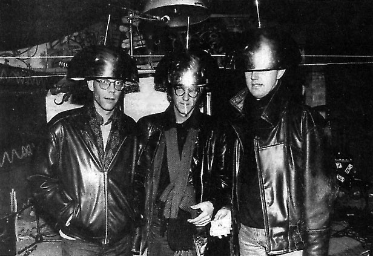
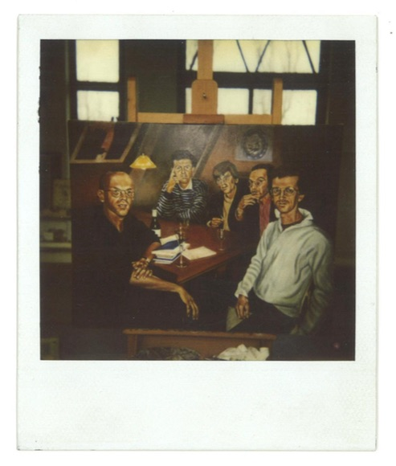
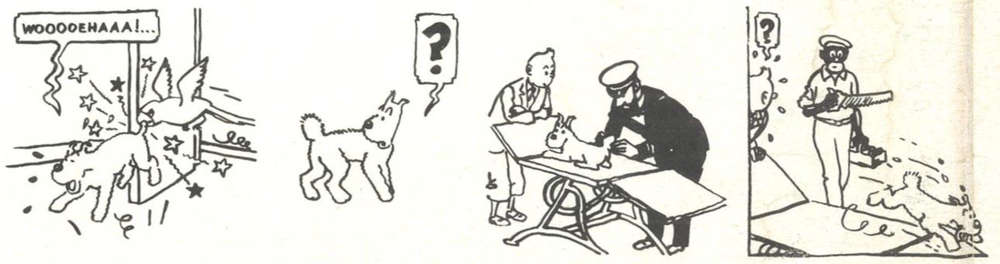
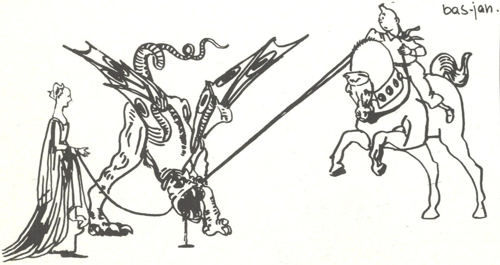

# Voorwoord: Van non-fascisme tot kuifosofie – een mannenfeminisme

Door Sepp Eckenhaussen.

Dit boek brengt de teksten over hedendaags fascisme samen die het
schrijverskrakerscollectief Bilwet schreef tussen 1983 en 1999. Het gaat
om een lezing met lichtbeelden, een brochure voor de Antimilitaristische
Dagen ’85, filmkritieken, een serie postkaarten, recensies van
oorlogsromans, mijmeringen in Berlijn, een ambulant-wetenschappelijk
artikel over filosofenmode en nog zo wat. Wat zijn de gemeenschappelijke
kenmerken van deze bonte verzameling teksten? Belangrijker nog, hoe en
waarom zou je die vandaag de dag nog lezen die meer dan dertig jaar oud
zijn? In dit voorwoord leg ik, als redacteur en samensteller van de map,
allereerst in hoofdlijnen het idee achter de opbouw van de bundel uit en
vervolgens de rol die elk hoofdstuk daarin speelt. Ten slotte volgt een
korte verantwoording over taal- en notengebruik.

## I. Het uitgangspunt

Belangrijk is bij het uitgeven van de Bilwet-fascismemap niet zozeer dat
twintig of dertig jaar oude fascismeanalyses vandaag de dag nog
simpelweg toepasbaar zouden zijn. Wel denken we dat er in de
antifascistische discussies, die links-progressieve kringen nog niet zo
lang geleden gemeengoed waren, belangrijke lessen liggen voor het heden.
Millenials en de post-9/11-generatie zijn veelal grootgebracht met
waarden die gebaseerd zijn op feministische en antifascistische
discussies uit de jaren ’70 en ’80. Het geëmancipeerde huishouden,
abortusrecht, LHBTQ-rechten, autonoom en antiautoritair denken…
Voorbeelden van ‘progressieve waarden’ die pas twee generaties breed
gedragen worden, maar toch al diep verankerd liggen in het collectieve
denken. In de jaren ’70-’80 was ‘de verbeelding aan de macht’ en ‘moest
alles anders’.[^1] Wanneer het gaat om de feministische aspecten van
deze collectieve waarden, is het bovendien duidelijk welke historische
seksestrijd eraan ten grondslag ligt. De theorieën van Simone de
Beauvoir, de Dollemina’s, de strijd voor het vrouwenkiesrecht, de eerste
Maagdenhuisbezetting in ‘69, de vrouwenbeweging en baas in eigen buik
zijn algemeen bekend. Boeken zoals Alice Schwarzers *Het ‘kleine
verschil’ en de grote gevolgen: vrouwen over zichzelf, begin van een
bevrijding* de gemoederen in de maatschappelijke discussie nogal hoog
oplopen.[^2] Door de opkomst van de continentaal-Europese discipline
‘vrouwenstudies’ en instituten zoals het ATRIA is deze kennis bovendien
op een actieve/activistische manier verduurzaamd.[^3]

De geschiedenis van de antifascistische discussies, die chronologisch
samenviel met en verbonden was aan de feministische discussies, geniet
minder bekendheid. Dit is dan ook meteen de reden voor het uitgeven van
de Bilwet-fascismemap. Hoe zag het antifascistisch discours in de jaren
’70 en ’80 eruit? Welke maatschappelijke functie had het precies? Op
deze vragen geeft de Bilwet-fascismemap een antwoord. Het belang van
deze bundel ligt er daarom in, dat het een inkijk geeft in de precieze
opbouw van het antifascistisch discours van de jaren ’70 en ’80 en de
functie die dit had in de klasse- en seksestrijd van toen: een feminisme
voor mannen.

## II. Hoofdstukopbouw

### Inleiding

Hoe de teksten in deze bundel geschreven werden en waarom ze veeleer
nooit eerder gepubliceerd zijn, legt Bilweter Geert Lovink uit in de
inleiding. Bovendien maken Geert en ik in die inleiding gebruik van onze
*third mind* om op zoek te gaan naar de huidige relevantie van Bilwets
schrijven in de jaren ’80 en ’90 en de hedendaagse fascismeanalyse in
het algemeen.

### Hoofdstuk 1: Hoezo Bilwet?

Een belangrijke vraag is natuurlijk wie of wat Bilwet nu eigenlijk was. Een definitie van Bilwet is schier onmogelijk, maar een beetje
achtergrondinformatie is voor oningewijden en later geborenen onmisbaar.
Daarom is het eerste hoofdstuk van dit boek, *Hoezo Bilwet?,* waarin het collectief zelf beschrijft wat Bilwet was, hoe het zich
bewoog en wat het zich afvroeg.

### Hoofdstuk 2: De vertoogmixer van Klaus Theweleit

Maar naast de vraag ‘hoezo Bilwet?’ is er natuurlijk de belangrijkere
vraag ‘hoezo fascismeanalyse?’ Het was op zich niet zo vreemd dat Bilwet
schreef over fascisme in de context van de kraakbeweging, de opkomst van
extreemrechts in Nederland en de institutionalisering van antifascisme
in herdenkingspraktijken, maar om wat voor soort fascisme-analyse was
het ze precies te doen? Om daarachter te komen, begint deze uitgave met
sporen van nog vóórdat het fascismebegrip om de hoek komt kijken, bij de
Duitse filosoof Klaus Theweleit en diens bespiegelingen op de
maatschappelijke organisatie van de moderne tijd. Het eerste echte
artikel in deze bundel is een recensie van Theweleits *Büch der
Könige, *die vertrekt vanuit de vraag: ‘Waarom schrijven schrijvers?’
Deze reflexieve vraag, gesteld door Bilwet, betekent natuurlijk ook:
waarom schrijft Bilwet?

Theweleits algemene (maar opzettelijk niet sluitende) antwoord op deze
vraag is dat de schrijverskunst niet opereert uit autonome
genialiteiten, maar uit Orfeuscomplexen: het onvermogen van de schrijver
om te gaan met zijn eigen geschiedenis, wat leidt tot een schrijven ten
koste van de grote liefde. Het resultaat van deze autopsychoanalyse van
de schrijver Theweleit wordt door Bilwet omschreven als was het hun
eigen schrijversmotto: ‘Verhalen en begrippen duiken op, ballen samen,
beginnen te knetteren, gaan verbindingen aan en krijgen voor de lezers
een intensiteit, die na de schok der herkenning zoiets als een ervaring
van de ‘’echte geschiedenis’’ oplevert.’ Wanneer Bilwet schrijft, staat
hen dus niet een reductie van de geschiedenis of de hedendaagse conditie
tot een gestroomlijnd narratief over de ander voor ogen, maar een
knetterend openbreken van de taal en de eigen subjectiviteit door het
samenbrengen van tegengestelde polen. Wanneer het aankomt op fascisme
ontstaat zo hopelijk een ‘echte geschiedenis’ die niet beperkt blijft
tot een projectie van ‘het fascisme’ op de Ander, maar een beeld van
onophoudelijke stromen aan driften en ideeën die zich niet laten
opsluiten binnen of buiten het zelf (niet in de laatste plaats omdat
juist dat opsluiten, die hang naar orde, een voedingsbodem voor fascisme
is).

### Hoofdstukken 3-4: Theweleitkritieken

Bilwets inzicht in de schrijversdrift hing dus direct samen met haar
hang naar fascismeanalyse. Hoe zit dat precies? Logisch voortbouwend op
de door Theweleit voorgestane zelfanalyse nam Bilwet ook Theweleits
benadering van fascisme over. Theweleits interesse in fascisme was niet
in eerste instantie historisch van inslag, maar veeleer geboren uit de
noodzaak tot collectieve zelfanalyse die men na 1945 systematisch voor
zich uit heeft weten te schuiven. In de volgende twee hoofdstukken, twee
totaal verschillende Theweleitkritieken, blijven we daarom bij
Theweleit, maar maken we de overstap van zelfanalyse (of Bilwetanalyse)
naar fascisme-analyse.

In de eerste kritiek, een korte weergave van Theweleits 'boodschap' over
fascisme in krakersaktieweekblad *bluf!* van Bas-Jan van Stam en Geert
Lovink, wordt beetje bij beetje de verbondenheid tussen zelfkritiek en
fascismeanalyse duidelijk. Speelsgewijs vatten Bas-Jan en Geert nu eens
delen van Theweleits cultuurtheorie samen, dan weer interviewen ze zijn
vertalers of speculeren er lustig op los voorbij enige strikte
lezing. Ziehier de vierhoekige basis die Theweleit Bilwet bood:
oorlogstrauma, cultuurgenealogie, fascisme en auto-psychoanalyse. Deze
speculatieve vier-eenheid vormt de kern van alle Bilteksten over
hedendaags fascisme.

De tweede kritiek, geschreven door Arjen Mulder, is theoretischer van
aard en laat een hele andere kant van Bilwets schrijven zien. Hij is
saai en langdradig, maar een technische en scherp geformuleerde uitleg
van Theweleits argumentatie, psychoanalyse en filosofische aannames.
Arjen vertelt over Theweleits leentjebuur van Deleuze en Guattari en
mijmert over de dood tijdens twee boswandelingen met Foucault. Bovendien
is deze tekst een echte kritiek, die de problematische kanten van
Theweleits *Mannenfantasie* blootlegt door zijn fascismeanalyse tegen
die van Baudrillard uit te spelen. Kortom: uitstekend lesmateriaal voor
krakers en andere fascismesceptici.

### Hoofdstuk 5-6: De niet-fascistische lijn

Pas dan, middels een artikel van Bas-Jan van Stams hand, geraken we bij
de daadwerkelijke fascismeanalyse van Bilwet, bij de unieke bijdrage aan
de maatschappelijke discussie. Hier beginnen we te zien hoe Bilwet de
vier van Theweleit geleende polen samenbrengt en hoe dat knettert.
Grosso modo is deze tekst is een verkorte weergave van de inhoud
van *Fascisme/Seksisme: rekonstruktie van een mannenideaal, *een boek
dat in 1983 door Bas-Jan van Stam geschreven werd en dat de geboorteakte
van Bilwet was.

Het is moeilijk *Fascisme/Seksisme *te kenmerken – het is dan ook uniek.
Het was zo’n beetje een psychoculturele zelfanalyse van hedendaags
fascisme, niet fascistisch maar ook niet per se antifascistisch; een
futuristische cultuurgeneaologie van uit de hand gelopen mannenidealen
die zich niet tevredenstelde met bestaande antifascistische analyses van
fascisme in de Ander; tegelijkertijd ook weer geen ‘ontdekking van de
fascist in jezelf’. Het was een zoektocht naar de sentimenten die ten
grondslag lagen aan de opkomst van het historische én hedendaagse
fascisme. Bas-Jan zag de boodschap van de conservatief-rechtse
Centrumpartij als hét voorbeeld van een hedendaags fascisme. De
voedingsbodem van deze politieke boodschap was, aldus Bas-Jan, echter
een alledaags verzet tegen de oncontroleerbaarheid van instituties en
bewegingen in het alledaagse leven: de NS, de belastingdienst, ‘Den
Haag’, de immigratiedienst, krakers en ga zo maar door. Hij vroeg zich
af: waarom moet zo’n op zich gegrond alledaags verzet nu eigenlijk
altijd zowel seksistisch, racistisch, als autocratisch zijn? En wat
betekent het vandaag de dag om antifascistisch (en dus ook
antiracistisch en feministisch) te zijn, deze emotionele alledaagsheid
van het hedendaags fascisme in ogenschouw nemende?

Voorlopig kunnen we kunnen de karakterisering van *Fascisme/seksisme *op
dit strategische niveau houden: het was een hermeneutisch spel, een
provocatief bijeenrapen van seksisme, racisme en fascisme, dat naast de
antifascistische actie een niet-fascistische lijn stelde. Toch was
Bas-Jans tekst nog wankel. Hij besloot zijn kritiek met de opmerking dat
hij ‘bepaald niet tevreden \[was\] met deze tekst’ en concludeerde
schier wanhopig: ‘wie de oplossing weet werpe de eerste steen…’

Die eerste steen kwam er ongeveer drie maanden later. In *De gewonnen,
de verloren, de permanente oorlog* werkten Bas-Jan en Geert de
niet-fascistische lijn gezamenlijk verder uit. Het woord ‘fascisme’ komt
in deze tekst niet een keer voor, maar de overlevering en doorwerken van
oorlogstrauma’s uit WOII staat onaflatend centraal. Bas-Jan en Geert
trappen af met een Theweleitiaanse lezing van twee oorlogskronieken,
Norman Mailers *Helden zonder glorie* en Armando’s *De SS’ers*. Met
Mailers psychonarratief over een groep Amerikaanse helden zonder glorie
in Japan wordt het punt gemaakt van dat militarisme gelijkstaat aan
perverse seksualiteit. En uit de soldatengetuigenissen van *De SS’ers*
wordt duidelijk dat Nederlandse elitetroepen in het Duitse leger niet
zozeer meeliepen in een massachoreografie, maar juist vochten aan het
innerlijke front: tegen hun eigen zwakheid en beestachtigheid. Het was
erom te doen jezelf te beheersen, een echte Soldaatman te zijn, een
*Einzelkämpfer* die steeds in beweging is en zodoende onderdeel van de
*Blitz*-machine. Met andere woorden: het (Nazi)leger maakte een man van
je. Dit was op zich geen schokkend inzicht. Sterker nog, deze door
Marcel Bullinga verwoorde wijsheid was in de jaren ’80-’90 algemeen
bekend in de kringen van krakers en ander links tuig.

Het interessante in Bas-Jans en Geerts tekst is nu juist dat zij geen
genoegen namen met de simpele psychoanalytische (en strikt
Theweleitiaanse) lezing dat, als die Soldaatmannen nu maar acceptatie en
zekerheid van hun mannelijkheid hadden gekend, al deze problemen met uit
de hand gelopen mannenfantasieën (fascistisch of anderszins) niet zouden
hebben bestaan. Wanneer de soldatenlust wordt gereduceerd tot
psychologisch probleem, kan dit probleem namelijk relatief simpel
opgelost worden door psychoanalytici. Deze simpele psychoanalytische
oplossing kan dan op zijn beurt weer geïnstrumentaliseerd worden door
het leger bij het gezond houden van de soldaatjes. Bas-Jan en Geert
waarschuwden: ‘het risico is niet denkbeeldig, dat de legerleiding het
stuur van dit voertuig \[van de onderdrukte mannenverlangens\] van de
antimilitaristische mannenbeweging overneemt en er een avant-garde van
bevrijde mannen-soldaten zal ontstaan’. Vanuit deze analyse kwamen Geert
en Bas-Jan vervolgens tot een reflectie op de verweving van seksisme,
fascisme en militarisme in Nederland ten tijde van de Koude Oorlog. Ze
stelden en beantwoordden de (strategische én ethische) vraag: wat voor
fascisme-, seksisme- en militarismekritiek hebben we vandaag de dag
nodig? Met andere woorden, hoe kunnen we ons hier en nu longwringen uit
de holle frasen van het heersende (anti)militaristische discours? Hoe
wordt antimilitarisme vervangen door niet-militarisme?

Ten antwoord wijzen Bas-Jan en Geert op de nieuwe situatie, die ontstond
in de Koude Oorlog en voortduurt tot op heden, waarin het onderscheid
tussen het militaire en het civiele is opgeheven. Door de gelijktijdige
technologisering (computersystemen) en mediatisering (denk aan de
Vietnamoorlog als eerste tv-oorlog) van de oorlog heeft het leger geen
Soldaatmannen meer nodig, maar technisch specialisten. Tegelijkertijd is
het militarisme geruisloos verspreid naar iedere plek van
maatschappelijke vorming. Ook op school kan immers de Vietnamoorlog op
tv gevolgd worden. Als gevolg is de *nieuwe oorlog,* zonder
frontervaring, niet mannelijk of vrouwelijk, maar technisch. Het leger
maakt tegenwoordig geen man, maar een technisch specialist van je!

Waarom blijft het leger dan in zijn zelfpresentatie (reclamespotjes,
ceremonies, defilés) toch voornamelijk het oude mannenideaal bieden? Dit
is volgens Bas-Jan en Geert pure nostalgie, materieel achterhaalde
ideologie die als zodanig ontmaskerd dient te worden. Bovendien moet
voor een niet-militaristische en uiteindelijk ook niet-fascistische
positie vooral de *nieuwe oorlog* met al zijn gedepersonaliseerde
snelheid en communicatiesystemen onderzocht worden. Een andersoortig
stromen heeft zich aangediend.

### Hoofdstukken 7-8: Verdwenen sporen

Voortbouwend op Theweleit spitste Bilwets fascismeanalyse zich dus in
eerste instantie vooral toe op hedendaags fascisme als overidentificatie
met mannenidealen. Van daaruit volgde Bilwet verschillende lijnen van
onderzoek, kijkend naar de Bilwetmatigheden van het nieuwe stromen in de
nieuwe oorlog, nieuwe mannen, nieuwe machten, nieuwe media en nieuwe
geschiedenis. Sommige van deze lijnen zijn heel specifiek, andere breed,
allemaal zijn ze uiteindelijk met elkaar vervlochten.

In de tweede helft van deze publicatie volgen we drie van deze
thematische lijnen, te beginnen met Bilwets besprekingen van verdwenen
sporen. Een bespreking, in andere woorden, van het stromende einde van
de geschiedenis. Deze lijn bestaat uit twee in Berlijn geschreven
teksten van Geert Lovink over verdwenen sporen van het historisch
fascisme. De teksten neigen naar historische exposés, maar vormen door
hun nadruk op de praktijk van herdenken ook een toepassing van
de *hedendaagse* fascisme-analyse.

De eerste van deze twee teksten, *Erfassung, Aussonderung, Vernichtung,*
stelt de relatie tussen historisch en hedendaags fascismeonderzoek
centraal. Aanleiding was de controverse in Nederland na het publiceren
van prof. C.I. Dessaurs boek *Mag de dokter doden?,* waarin de
legalisering van euthanasie en abortus werd benoemd als invoering van
Nazistische eugenetica. ‘Zo wint de geest van Hitler toch de
Wereldoorlog nog,’ concludeerde Dessaur.[^4] Hierdoor kwam de vraag naar
boven, welke maatschappelijke en wetenschappelijke denkpatronen het
historisch fascisme eigenlijk achtergelaten had. Voor Geert reden om een
kennismaking te schrijven met het werk van de Hamburgse *Verein zur
Erforschung der Nationalsozialistischen Gesundheits- und Sozialpolitik,*
dat sinds 1984 onderzoek deed naar de biopolitiek van het gezondheids-
en bevolkingsbeleid in Nazi-Duitsland*.* Een paar van de nauwkeurige
historische exposés van de *Verein* samenvattend, zet Geert de
Nazilogica van ‘registreren, sorteren en deporteren’ uiteen, die in ’86
blijkbaar nog niet zo algemeen bekend was als nu. Schokkend is vooral
het inzicht dat het ‘vernietigen’ van zes miljoen levens (tot de dag van
vandaag vaak gezien als het dieptepunt van de fascistische misdadigheid
en eindpunt van de geschiedenis) pas het begin had moeten zijn van de
wetenschappelijk gestaafde ‘Endlösung’ van het probleem van ‘asocialen’
(20-50 miljoen ‘vernietigingen’).

De tweede tekst in deze lijn, *Spurensicherung – Spurenvernichtung,* is
een ‘verlate voorstudie’ voor de super 8-film *De zaak 40-61-84* (1984)
van Geert Lovink en Just Vercruijsse. Deze film was, kortgezegd, een
onderzoek naar de ‘derde fase’ van herdenken. De eerste fase is het
herdenken gebeurt aan de hand van directe herinneringen en relikwieën
zoals in bijvoorbeeld het hedendaagse Auschwitz-toerisme*.* De tweede
fase van herdenken is het zoeken van de sporen, het vinden van de
‘schuldige boom’ à la Armando. De derde fase vangt aan nadat alle
overlevenden en materiële sporen verdwenen zijn, wanneer alleen het
trauma nog is overgebleven. De centrale vraag van *De zaak 40-61-84* was
dan ook: wat gebeurt er met fascismeanalyse wanneer historische sporen
verdwenen zijn? Bestaat de herinnering (aan het fascisme) zonder dat
deze zich kan vastmaken aan of manifesteren op een fysieke plek? Deze
aanhoudende focus op trauma (de afwezigheid van herinnering of materieel
overblijfsel), zelfs als het om bespiegelingen op historisch fascisme
ging, maakte een centraal deel uit van de Bilwet-fascisme-map. In een
intern Bilmemo uit 1986 van Geert over de fascisme-map staat namelijk te
lezen:

> De stelling van deze map is dat het antifascisme dat in de laatste
> vijf jaar zo groeide, niet zozeer voortkomt uit ‘’objectieve’’ groei
> van het neofascisme of fascistische tendensen bij de staat, maar één
> uitdrukking is van de overdracht van de herinnering van de eerste
> generatie op de tweede. De maatschappelijke organisatie van de
> herinnering is inzet van strijd. Welke beelden hebben wij, die deze
> tijd niet hebben meegemaakt, van deze afschrikwekkende periode? Zijn
> deze van nationalistische aard? Worden de tegenstellingen uit die tijd
> verzwegen? Veel vragen die omhoogkomen als het gedenken voor de deur
> staat of, en dat gebeurt veel vaker, er vergelijkingen getrokken
> worden met de jaren dertig en de bezettingstijd.[^5]

Meer dan in alle andere, is het in deze teksten over verloren sporen
inderdaad te doen om een analyse van de generatieoverdracht van het
oorlogstrauma en de cultureel-politieke doorwerking daarvan. In
hetzelfde memo legt Geert bovendien ook over de specifieke vorm van deze
analyse uit:

> Het fascisme wordt zo niet meer gezien als een structuur of een vorm,
> maar als een proces of beweging die zich trachtte te vestigen in alle
> lagen van de bevolking en binnen alle instituties. Vanaf het eindpunt,
> de gaskamers van Auschwitz, worden de sporen terug gevolgd. Niet zoals
> voorheen gebeurde naar de Duitse Romantiek maar naar de
> maatschappelijke organisatie van de moderne tijd.[^6]

*Spurensicherung – Spurenvernichtung* is precies zo’n terugvolgen van
bewegingen. Geert en Just voltrokken hun onderzoek aan de hand van
stadswandelingen door Berlijn, van oude plattegronden, van Harry
Mulisch’ *De zaak 40-61*, van Claude Lanzmanns *Shoah,* van het
schuldige landschap van Armando, van de alledaagse ‘Geschichte von
unten’ (oral history) die werd opgetekend door de Berliner
Geschichtswerkstatt, van antifascistisch-antipacifistische vertogen over
het Berlijnse Scheunenviertel door Eike Geisel en Wolfgang Pohrt en van
een Delftse theorie van de Berlijnse Muur als membraan. Het artikel
beschrijft zo een meanderende speurtocht bij de schuldvraag van het
fascisme, van literaire interventies naar herinneringen, van
geschiedenissen van hoe het echt geweest moet zijn naar geschiedenissen
van het voor altijd verdwenene. Wie heeft het nu eigenlijk gedaan, waar
is het Kwaad bedacht, waar kwam dat door en hoe (her)denken we dat?
Zoals eigenlijk ieder ander die zich over deze vraag gebogen heeft,
kwamen Geert en Just er niet helemaal uit. Maar al terugvolgend kwamen
ze wel tot een inzicht in het wezen van de geschiedenis. Zij vermoedden
dat de systematiek van vernietiging in het fascisme eigenlijk nooit aan
plaats gebonden was geweest, maar onzichtbaar opging in ‘beweging’ of
‘verkeer’. De geschiedenis zelf, zo speculeerden zij, de geschiedenis
van vaste plekken, was opgehouden te bestaan en overgegaan in plaatsloze
stromen. Zo komt ook in dit boek de geschiedkunde tot haar einde en
neemt het Bilweten weer de overhand.

### Hoofdstukken 9-12: Cultuurspeculatie

Pas in de volgende lijn, aan gene zijde van de geschiedenis, gaat
Bilwets fascisme-analyse écht los. We kunnen deze thematische lijn
misschien cultuurspeculatie noemen. Ooit schreef Bilwet:

> Voor Bilwet begint de speculatie voorbij het nulpunt van de betekenis.
> Als woorden bevrijd zijn van de informatielast die ze mee moeten
> torsen, raken ze in vervoering en trekken op verkenning uit. Zodra ze
> hun eigen gang gaan, kunnen ze iedere logica volgen en op alle
> informatie anticiperen waar ze ooit nog mee opgezadeld zullen worden.
> Het speculeren met de taal volgt de stelregel: voorkomen is beter dan
> deconstrueren.[^7]

Bilwet blijft dit devies nauwgezet trouw, met verrassend relevante
analyses tot gevolg. De eerste tekst is een stuk van Bas-Jan van Stam
over ‘de redelijkheid van het uniform’ voor Bilwets *Arcade: Jaarboek
voor Ambulante Wetenschappen*. Met een serie broodje-aapverhalen
illustreerde Bas-Jan de verknoping van de angsten voor
tweedehandskleding, de dood, kleine beestjes en het ‘Joodse complot’
achter de mode-industrie. Vervolgens vergeleek hij de verguizende visies
op mode van Plato, Thomas Moore en Adolf Hitler. Gedrieën concludeerden
de filosofen bij monde van Bas-Jan: mode is nergens goed voor, uniformen
zijn het redelijkst.

De tweede tekst uit deze lijn is afkomstig uit Bilwets derde boek, *De
datadandy* (1994), wat nooit in het Nederlands verschenen is.[^8] Deze
tekst is dus zowel ‘officieel’ van Bilwet, als van een latere datum dan
de rest. Toch is de relatie met de Bas-Jans tekst over filosofenmode
helder, omdat ook in deze tekst de esthetische doctrine uit Adolf
Hitlers geschriften besproken worden. Bilwet gaat hier namelijk terug
naar de oorsprong van die doctrine: Hitlers jeugd, zoals beschreven in
*Mein Kampf.* De Bilweters analyseerden het oedipale schema dat
‘duimendik’ op Hitlers jeugdherinneringen ligt en waarbinnen de kunst
voor Hitler in het incestueuze domein terechtkwam. Hitler projecteerde,
aldus Bilwet, zijn vieze verlangen naar zijn eigen reine moeder op de
kunst, resulterend in zijn ideeën over schone en de ‘ontaarde’ kunst.
Schone kunst is hygiënische kunst, gevrijwaard van het vieze incestueuze
stromen.

Ook de derde tekst, Arjen Mulders speculatieve recensie van Wim Wenders’
*Paris, Texas* en *Himmel über Berlin*, getuigt van de
cultuuranalystische inzichten die een hedendaags fascisme-begrip in
combinatie met een scherp oog en voldoende fantasie op kan leveren.
*Himmel über Berlin* opent met de beroemde zin: ‘Als das Kind Kind war,
wusste es nicht, dass es Kind war, alles war ihm beseelt, und alle
Seelen waren eins.’ Welk kind? Wenders zelf natuurlijk! In een
psychoanalytische filmlezing, ontrafelde Arjen Wenders’ zoektocht naar
een verloren eenheid (eerst in de American Dream, later in de Heimat).
Zo merkte hij in *Himmel über Berlin* eenzelfde narratief op als in Leni
Riefenstahls *Triumf des Willens*: van begin, via versplintering en
geschiedenis, naar nieuwe heelheid (overwinning van de dood). Wenders’
film, gemaakt vanuit antifascistische en antiautoritaire intenties,
verwerpt de massa’s zoals die in Riefenstahls films worden
gepresenteerd, maar, zo argumenteert Arjen, laat de triomf van de wil op
individueel niveau zegevieren. Bovendien verwordt de massa bij Wenders
tot antifascistisch medium, tot een op consumptie en media ingeschakelde
maatschappijvorm. In Wenders’ narratief van die eenzame maatschappij
werpen de engel Damiël en de marion Marion zich op als verlossers, als
heelmakers door liefde. Het is net even een andere manier van
Führerschap, maar met dezelfde mythische heelheid tot doel. Dit is
volgens Arjen een gevaarlijk ‘pre-fascistisch’ spel. Toen Duitsland
Duitsland was, wist het niet dat het Duitsland was.

In de vierde tekst in deze lijn, een ‘lezing met lichtbeelden’ over Bor,
Boris en de Wolf, geven Geert Lovink en Bas-Jan van Stam een
cultuurgenealogie van de wolf. Ze zetten daarbij het motief van de
Natuurlijke Wolf en de Boze Wolf tegenover elkaar. Is de wolf nu een
geteisterde ziel met diepe wortels in de Germaanse cultuur, een tembaar
machtsmiddel, of een woeste oerkracht van het Kwaad? Deze lezing mondt
uit in de analyse van een fascistisch wolfsfiguur in het Kuifje-album
*Mannen op de maan*, wat ons brengt bij de laatste Bilwet-analyselijn in
dit boek: kuifosofie.

### Hoofdstukken 13-18: Kuifosofie en Datadandy

Dankzij Bas-Jan van Stam komt de lijn van cultuurspeculatie komt ten
slotte, als knotsgek hoogtepunt, tot een heuse onderzoeksdiscipline: *de
kuifosofie.* ‘Seksisme racisme: hoezo Kuifje dood?’ is een Freudiaanse
lezing van *Kuifje in Afrika,* waarin Bas-Jan de mythische en
ongrijpbare vormen van het alledaags racisme bespreekt*.* De stelling is: 
> Pas als je \[de\] hele omweg van de politiek-economische crisis,
> het racisme van \[de jaren ‘30\], de ‘’dreiging’’ van de Sovjet-Unie, de
> enorme werkloosheid, enzovoorts, naar de individuele droomwereld en zijn
> sekspolitieke symbolen hebt afgelegd, pas dan krijg je zich op die
> mythische machinerie van het fascisme. \[…\] Wat blijkt namelijk? Dat
> Hergé door middel van zijn stripheld Kuifje de maatschappelijke
> politiek-economische crisis vertaalt in een individuele, sekspolitieke
crisis.[^9]

Met andere woorden, Kuifje is het ultieme voorbeeld van
mannenidealenpropaganda. Propaganda die we nota bene zonder enige
bedenking, zonder haar zelfs als propaganda te herkennen, tot op de dag
van vandaag aan onze kinderen blijven voeren!

In het volgende hoofdstuk legt Bas-Jan aan de hand van het laatste (en
onafgemaakte) Kuifje-album, *Kuifje en de alfa-kunst,* de taak van de
Kuifosofie uit. In de kern bestaat deze erin Kuifje los te weken uit
Hergés maatschappelijk en cultureel conservatieve denkkader en hem te
doen voortleven na de dood van Hergé.

Het derde hoofdstuk in deze lijn toont de kuifosofie als hoogtepunt van
Bilwet-fascismeanalyse en tegelijk als het begin van het einde.
Blijkbaar was nu niet alleen de geschiedkunde, maar ook de
taalspeculatie uitgeput, want Bas-Jan liet de taal los en begon zijn
cultuurspeculaties te ‘verven’ (wat hij tot op de dag van vandaag
volhoudt). In een reeks van zes iconische schilderijen (ook wel
postkaarten of Bilwet-kleurplaten genoemd) stelde Bas-Jan zich het leven
van Kuifje na de dood van Hergé voor en bevroeg zo de relatie tussen
Bobby, Hitler, christendom, het koloniale heden, de atoombom en
mannenidealen.

In latere jaren stortte Bilwet zich volledig op de nieuwe media en
fascisme verdween op de achtergrond. Toch stak fascisme binnen de
mediatheorie soms nog de kop op. Vandaar dat ook in Bilwets derde
essaybundel uit 1994, *De datadandy*, twee kuifosofische teksten te
vinden zijn, die de twee laatste hoofdstukken van deze bundel vormen.
Hier worden respectievelijk ‘het onschuldige fascisme van Hergé’ en ‘de
opvoeding tot mannelijkheid’ in de Kuifje-albums besproken. Duidelijk
voortbouwend op Bas-Jans eerdere teksten, verviel Bilwet hier soms in
herhaling, maar zette ook vervolgstappen ter volbrenging van de
kuifosofische opdracht. Hergés werk wordt gecontextualiseerd in de
(na)oorlogs(e) geschiedenis en de Theweleitiaanse lezing wordt verdiept
(uitgekleed worden de fallische paddenstoelen, angsten voor bedplassen
en racistische *common sense* in verschillende albums).

Is het dan uiteindelijk duidelijk hoe Kuifje gelezen moet worden? Niet
echt. Ondanks de vele pagina’s tekst die Bilwet aan Kuifje-analyses
besteedde, heeft het collectief de kuifosofie niet volbracht. Of
eigenlijk blijkt de opdracht van de Kuifosofie er bij nader inzien
helemaal niet te zijn om haar te volbrengen, maar juist om haar door
middel van productieve uitglijers en contradicties open te houden. En
dat geldt, denk ik, voor de hele Bilwet-fascismeanalyse.

Ik heb deze map met veel plezier van voor tot achter gelezen. Het
leverde me weinig antwoorden maar veel inzicht op. Misschien is dat dan
ook wel de kern, of in ieder geval een uitgangspunt van het
niet-fascisme: het streven naar genuanceerde inzichten in plaats van
heldere oordelen. Dat is in ieder geval een belangrijke waarde die mij
in mijn opvoeding is meegegeven en ik heb nu een beter beeld van waar
die vandaan komt. Op de vraag hoe deze waarde in het heden naar
niet-fascistisch handelen vertaald kan worden, bestaat geen juist
standaardantwoord. Maar de vraag hoe het niet-fascistische denken in de
gepolariseerde debatten van de geglobaliseerde neoliberale conditie van
waarde kan zijn, dient wel verder te worden uitgewerkt. Zie hiervoor de
dialoog die Geert en ik voeren in de inleiding van deze bundel.

## III. Verantwoording

Bilwet opereerde bij haar officiële publicaties als *third mind.* De
auteur was simpelweg Bilwet en individuele schrijvers speelden geen rol.
De meeste teksten in de fascismemap zijn echter ofwel nooit uitgegeven
(dus ook niet onder auteursnaam Bilwet), ofwel gepubliceerd onder de
persoonsnamen van individuele Bilweters. Vandaar dat ook in deze
publicatie de individuele auteurs van de meeste teksten worden benoemd.

De letters van n-woorden, die Bilwet hier en daar gebruikte, zijn in
deze publicatie door sterretjes (\*) vervangen. Belangrijk detail
hierbij is dat deze woorden in de Bilteksten vooral gebruikt werden in
directe referentie aan vroege Kuifje-albums. Wie een nieuwe druk van
*Kuifje in Afrika* koopt, zal geen n-woord meer tegenkomen, maar wie in
een lommerd een vroeg exemplaar op de kop weet te tikken, zal schrikken
bij het lezen.

Bij aktiebladen als *bluf!* was het gebruikelijk de taal open te breken
met subversieve, fonetische spelling. ‘Seksistische’ werd ‘sexistiese’,
‘economische’ werd ‘ekonomiese’, enz. Die spelling is natuurlijk
grappig, maar het subversieve is er vandaag de dag wel af. Daarom hebben
we, witte en groene boekjes bij de hand, de spelling aangepast aan de
hedendaagse normen.

In deze publicatie staan twee soorten voetnoten. Ten eerste zijn er de
literatuurverwijzingen die uit de oorspronkelijke manuscripten komen.
Deze zijn zo volledig mogelijk omgeschreven naar Chicago-stijl. Het moet
hierbij opgemerkt worden dat Bilwet lang niet altijd referenties plaatse
bij citaten. Die referentieloze citaten zijn ook in deze publicatie
grotendeels zonder referentie. Daarnaast zijn er uitleggende noten voor
fenomenen als ‘Bunkerbuit’, ‘CPN’ en ‘Cor van der Laak’, die niet meer
vanzelfsprekend als bekend mogen worden verondersteld.

[^1]: Twee belangrijke bespiegelingen op deze hang naar verandering in
    Nederland zijn *Alles moest anders: Het onvervuld verlangen van een
    linkse generatie* (Amsterdam: Nijgh & Van Ditmar, 1991) en Pieter
    Bootsma en Willem Breedveld *De verbeelding aan de macht: Het
    Kabinet -Den Uyl 1973-1977* (Den Haag: Sdu uitgevers, 1999).

[^2]: Alice Schwarzer, *Het ‘kleine verschil’ en de grote gevolgen:
    vrouwen over zichzelf, begin van een bevrijding* (Amsterdam:
    feministische uitgeverij SARA, 1977).

[^3]: Een belangrijk voorbeeld van het Europese
    feministisch-socialistische discours (van voor de Angelsaksische
    gender-theorie kwam overwaaien in de jaren ’90) is *Te elfde ure:
    feminisme 1,* vol. 3, no. 20 (1975), met teksten van o.a. Joyce
    Outshoorn, Anja Meulenbelt en Catherine Hall.

[^4]: Euthenasie blijft natuurlijk een populair discussieonderwerp. Zie
    voor een hedendaagse variant van deze controverse Paul Frissen,
    *Staat en taboe: politiek van de goede dood* (Amsterdam: Boom,
    2018).

[^5]: Zie ‘Opzet Bilwet-fascismemap’ in de bijlage van deze bundel.

[^6]: Idem.

[^7]: Zie ‘Hoezo Bilwet? Een inleiding’ in deze bundel.

[^8]: Bilwet, *De datadandy,* ongepubliceerd manuscript, 1994. De Duitse
    vertaling is uitgekomen als Agentur Bilwet, *Der Datendandy*
    (Berlin: Bollmann Verlag, 1994), ook online:
    <https://thing.desk.nl/bilwet/AgenturBilwet/Datendandy/index.html>.

[^9]: ‘Seksisme racisme’ in deze bundel.

# Inleiding: Dialoog tijdens het redigeren van de Bilwet-fascismemap

Door Sepp Eckenhaussen en Geert Lovink.

## I. Hoe het allemaal begon

Afb. 1: Bas-Jan en Geert in Frankrijk.

Tussen 1983 en 1999 kwamen Bas-Jan van Stam, Geert Lovink, Arjen Mulder,
Ger Peeters en Lex Wouterloot onregelmatig - en in verschillende
samenstellingen - bijeen in een groep met de illustere naam Bilwet: de
stichting ter Bevordering van de Illegale Wetenschap. Bilwet stond voor
van alles en nog wat: een non-medium, ambulante uitgever, een didactisch
projectiel binnen de Amsterdamse kraakbeweging, een schrijfcollectief
met ambitie en internationaal succes, een jongensclub met een liefde
voor theorie in duistere tijden. In deze map is een tekst uit 1994
opgenomen, *Hoezo Bilwet? Een inleiding*, waarin meer te vinden is over
de intenties van dit stelletje ongeregeld.

Bilwet was natuurlijk geen stichting en strikt genomen ook niet
illegaal, het was eerder een 'extramurale' intellectuele samenzwering in
de marge van de afkalvende autonome beweging; in een verhard en
depressief klimaat, gedomineerd door bezuinigingen, werkloosheid en *no
future*. In dit intense leven op de pauzestand was de academische route
sowieso uitgesloten. Krakers waren radicale activisten, doe-mensen,
anarchisten, gespuis dat niet zomaar een promotieplaats kreeg
aangeboden. Dat komt ervan, als je niet redelijk wilt denken en niks van
zowel de burgerlijke wereld als het academisch marxisme moest hebben.
Dan nog eerder de journalistiek in...? Ook dat werd niks, zo bleek wel.

Bilwet kwam in voorjaar 1983 tot leven na het verschijnen van Bas-Jan
van Stams boek *Seksisme/fascisme, rekonstruktie van een mannen-ideaal*.
Dit onderwerp is niet toevallig. Begin jaren tachtig zat er flink wat
beweging in het nadenken over wat historisch fascisme was, en hoe de
naoorlogse generaties, die het zelf niet aan den lijve hadden
meegemaakt, en het publiek waren van de lawine aan herdenkingen, zich
hiertoe wilde verhouden. Dit geschiedde in de schaduw van de opkomst van
een extreemrechts milieu dat minutieus in kaart werd gebracht door het
fascisme-onderzoekcollectief FOK en andere groepen.[^1] Na een recensie
van Bas-Jans boek in het aktieweekblad *bluf!* van de hand van Geert,
kwam een ontmoeting tot stand en werd in een levendige correspondentie
de grondslag gelegd voor Bilwet als groep. Rond dezelfde had Geert het
tweedelige *Männerphantasien* van Klaus Theweleit gelezen voor een
bijvak in massapsychologie tijdens zijn opleiding politicologie aan de
UvA – het werk waar ook Bas-Jan zich had door laten inspireren. Niet
veel later verhuisde Geert voor een jaar naar West-Berlijn om daar
intensief de studie naar hedendaagse theorie in te zetten. De vraag hoe
het historisch fascisme op een eigen manier kon worden geïnterpreteerd
bleef daarbij op de voorgrond. In 1985 verscheen het eerste Bilwetboek,
geschreven door Bas-Jan en Geert, *Het Beeldenrijk*, een vrolijke
post-Freudiaanse analyse van drie hedendaagse films (*Paris, Texas*/*The
Day After*/*The Right Stuff*) waarin getracht werd de psychoanalytische
duiding van angsten en verlangens in het mediatijdperk op z'n Hollands
vast te leggen.[^2]

## II. Het ontstaan van de fascismemap

Afb. 2: De officiële Bilwetfoto met Bas-Jan van Stam, Geert Lovink, Arjen Mulder, Ger Peeters en Lex Woutersloot.

Na het verschijnen van een lovende recensie van *Het Beeldenrijk* die
Arjen Mulder, toenmalige filmrecensent van CPN-dagblad *De Waarheid*,
schreef, trad hij toe bij de groep. Ook Ger Peeters (Nijmegen) en Lex
Wouterloot werden niet veel later lid. Een van de eerste activiteiten
van de nu vijf man sterke groep was een cursus voor krakers en andere
activisten in Theweleits boek, dat net in een verkorte Nederlandse
vertaling door een Nijmeegse mannengroep was uitgegeven. De
theoriecursus werd zowel in Amsterdam als in Nijmegen gehouden.

In de periode van 1984-‘94 schreef de groep ongeveer twintig teksten
over hedendaags fascisme, bij elkaar goed voor ongeveer 300 pagina’s. In
de planning moest dit Bilwets tweede boek worden. In 1986 schreef Geert
hiervoor een opzet (die in deze map is opgenomen).[^3] Echter, niet veel
later deed de personal computer zijn intrede. De artikelen die al waren
geschreven op elektrische typemachines zouden eigenlijk overtypt moeten
worden. Aangezien er toen nog geen tekstscanners (ORC) waren, viel het
project tussen wal en schip en werd nooit afgemaakt. Een andere reden
hiervoor was het karakter van de teksten, die veeleer een
scholingskaraker hadden en niet van A tot Z gezamenlijk waren
opgeschreven. De aandacht verschoof weer naar het geven van een cursus,
weer in Amsterdam en Nijmegen, waarin gezamenlijk *De fatale
strategieën* van Jean Baudrillard werd gelezen, in een Nederlandse
vertaling, uitgeven door 1001. Qua schrijven verschoof de aandacht van
Geert en Arjen naar het vastleggen van de geschiedenis van de
kraakbeweging, die in 1987 in een rap tempo uit elkaar viel (niet veel
later uitgegeven als Bilwets tweede boek, *Bewegingsleer*).[^4]

De actualiteit van het historisch fascisme verdween langzaam maar zeker
op de achtergrond en werd overgenomen door de opkomst van 'nieuwe media'
en het naderende einde van de Koude Oorlog en de 20e eeuw. Het
herdenken bleef ook begin jaren negentig nog prominent op de agenda met
50 jaar dit en dat, maar werd overvleugeld door technologie, neoliberaal
beleid, crisis en oorlog (in de Golf, Joegoslavië, Afrika) die de agenda
beheersten. Het einde van de geschiedenis leek voorbij, wat viel er nog
te leren van het verleden?

Hoe dan ook is het zonder verdere introductie wel duidelijk Bilwet
gekenmerkt werd door een fascinatie voor fascisme. Die kwam niet uit de
lucht vallen. Wat betekende de 'waakzaamheid' waartoe de CPN, *Trouw* en
*Het Parool* opriepen, 40 of 50 jaar na de machtsovername van Hitler, de
Februaristaking en de bevrijding van Auschwitz, behalve dan het gedenken
van de slachtoffers? Het bleek niet langer voldoende te beweren dat de
oorsprong van het fascisme in het grootkapitaal lag, waarin een 'volkse'
oplossing wordt aangedragen met als doel de macht te verdedigen met
autoritaire middelen om zo de groeiende macht van de arbeidersklasse en
andere sociale bewegingen te breken.[^5] De onderstromen en het
doorleven van fascisme kwamen in plaats daarvan in de aandacht. In het
boek *Anne Frank in the World,* in 1985 uitgegeven door de Anne Frank
Stichting, wordt bijvoorbeeld niet alleen over de wrede herinneringen en
geschiedenissen besproken, maar ook gewaarschuwd voor racisme,
antisemitisme en vooroordelen in het heden.[^6] Bovendien kwam naast het
institutionele, op herdenken gerichte antifascisme (waarop de CPN zo’n
beetje een monopolie had) het niet-institutionele antifascisme (dat
later tot Antifa uitgroeide) op vanuit de krakersbeweging.

Vanaf de jaren 80 zien we dus, grof gezegd, een verschuiving van de
aandacht van gevolgen naar oorzaken. De vraag was niet langer alleen hoe
men de afschuw kan tonen voor concentratiekampen, totalitarisme,
onderdrukking en neofascisme, maar hoe het kon dat grote delen van de
bevolking, niet alleen in landen als Duitsland, Spanje en Italië,
passief en actief achter de autoritaire leiders gingen staan. Dit is de
oorspronkelijke vraag van een breed scala aan denkers, van Wilhelm Reich
en de beoefenaars van de autoritaire persoonlijkheidsstudie tot en met
Louis Althusser, die zich afvroeg hoe mensen door ideologie worden
aangesproken. Zo ontstond een psychoanalytische lezing van geheime
angsten, wensen en dromen, en hoe deze op zo’n manier kunnen worden
omgebogen en gepolitiseerd, dat het lijkt alsof ‘het grote gevaar’ komt
van sterke vrouwen, slinkse Joden, chanteerbare homoseksuelen,
buitenlanders en andere 'minderheden'.

## III. Dialoog

Afb. 3: De tafel in Geerts huis waar 'twee jongens en een typmachine' werkten aan de fascismemap.

Sepp Eckenhaussen: Door terug te gaan naar Bilwets werk uit de jaren ’80
en ’90, keren we ook terug naar de geboorte van de mediatheorie. Ik
vraag me simpelweg af: wat was voor Bilwet de relatie tussen
fascismeanalyse en mediatheorie?

Geert Lovink: Het klopt dat wij daar parallel aan werkten. Dit ligt
geheel in de lijn van het werk van de Duitse mediatheorie en dat van
Friedrich Kittler in het bijzonder. In zijn boek *Grammophon Film
Typewriter* uit 1986, komen oorlog, fascisme, technologie en media
expliciet samen.[^7] Oorlog versnelt het onderzoek, denk maar even aan
radar en de computer, maar ook aan de FM-band en de muziekcassette. De
naoorlogse Electronica en de popmuziek zijn volgens Kittler
‘afvalproducten van WO II’.

Sepp: Hoe is Bilwets fascismeanalyse uit de jaren ’80 en ’90 bruikbaar
te maken voor de hedendaagse context? Wat moeten we *nu *met dit boek?

Geert: Allereerst is er het motief van Foucault, dat BAK – basis voor
actuele kunst in Utrecht ook onlangs oppakte: het niet-fascistische
leven.[^8] Maar wat is dat? Wat moeten we dan voorkomen, waar moeten we
waakzaam voor zijn, wat bestrijden? Of moeten dat allemaal juist achter
ons laten. Kunnen we dat wel? Hebben we de hel van de 20e eeuw
daadwerkelijk overstegen en is de collectieve psyché (en die van het
individu) werkelijk zo veranderd, dat het niet meer ontvankelijk is voor
massapsychose en het projecteren van maatschappelijke problemen op
minderheden? Belangrijk is te snappen wat het individu vandaag de dag
gaat doen zodra het in het defensief is gedrongen. De herverdeling van
welvaart verloopt niet meer zoals 40-50 jaar geleden. Hierdoor zijn
velen die buiten de boot vallen open gaan staan voor rechts-populisme.
De vraag is welke psychologische constellatie hierbij hoort. De vraag
zou dus niet moeten zijn of het historisch fascisme terugkeert maar hoe
grote groepen die niet (langer) profiteren van de rijkdom via beelden,
dromen en propaganda kunnen worden aangesproken, en uiteindelijk
gemobiliseerd, om geweld tegen afwijkende groepen te gaan gebruiken.

Sepp: Het gaat inderdaad niet om het kunnen aanwijzen van *de* fascist.
'Punch a Nazi' is het toppunt van domheid. Het heeft geen zin mensen uit
te maken voor fascist die zichzelf niet (openlijk) als fascist
identificeren. Je vervalt dan alleen maar in een welles-nietes-discussie
rond de definitie en toepassing van 'fascisme'. En dan ook nog eens
geweld gaan gebruiken? Nee, ik denk dat de grote urgentie van
hedendaagse fascismeanalyse ligt in het kunnen begrijpen en verklaren
van hedendaagse maatschappelijke tendensen en het anticiperen op
structurele toekomstige gevaren. Maar dat is natuurlijk ook niet een
neutrale analyse zonder politieke aannames of grondslagen. Bij
fascismeanalyse hoort de antifascistische strijd, en wellicht ook de
non-fascist. De belangrijkste vraag lijkt dan ook te zijn: wat betekent
het vandaag de dag om antifascist of non-fascist te zijn? In
verschillende landen zien we Trump, Orbán, Duterte, Bolsonaro, de Gouden
Dagenraad en in Nederland Wilders en Baudet die een gooi doen naar zo'n
positie. Hoe kijkt de non-fascist naar zulke verschillende bewegingen op
de wereld? Wat zegt fascismeanalyse ons over de *strong men *van
vandaag?

Geert: Een cruciale overgangstekst hier is Laclau’s *On Populist Reason*
uit 2005.[^9] Deze stamt niet uit de jaren 80, alhoewel zijn *Hegemony*
*and* *Socialist Strategy* wel die tijd is geschreven, samen met Chantal
Mouffe.[^10] Toch kunnen we *On Populist Reason* zien als een belangrijk
document dat vooral naar de toekomst wijst. Het punt is denk ik niet
meer zozeer dat mensen zich aangesproken voelen als ‘volk’ of ‘natie’.
Laclau wijst op de sociale heterogeniteit van vandaag de dag. Die kan
zich in tijden van crisis tegen het liberaal-democratische bestel keren.
Nu zijn er veel minder beleidsinstrumentaria om te sturen. Neem niet
alleen de onderklasse maar ook de ZZP’ers. Die zijn nauwelijks meer te
binden aan wat nog over is van de sociale/christelijk democratische
consensus. Wat van belang is in dit voorstadium, is de ideologische
verwarring en het bewuste mixen van linkse en rechtse thema’s en eisen,
zoals we nu bij de Franse beweging van de gele hesjes zien. Het
historisch fascisme dient hierbij als ijkpunt, als leerschool, en niet
zozeer als een absolute maatstaf. We moeten dus ophouden alles waar we
het niet mee eens zijn en als gevaarlijk beschouwen, te bestempelen als
fascistisch. Het populisme, zoals Laclau dat beschrijft, is denk ik een
beter hedendaags kader. De rijke geschiedenis, zoals we die in deze
rauwe Bilwetmap, kunnen nalezen dient dan als een inspiratiebron om te
laten zien hoe 40 jaar geleden de fascisme-analyse ineens enorm gelaagd
werd.

Sepp: Maar toch, over wat voor fascisme hebben we het nou eigenlijk
precies? Op wikikids.nl lees ik:

> Het fascisme is een politieke stroming die is bedacht door Benito
> Mussolini uit Italië. Fascisten vinden de democratie slecht en hebben
> liever een dictator, die zelf alle beslissingen neemt. Voor fascisten
> weegt het belang van het land als geheel zwaarder dan dat van de
> mensen en moet daarom iedereen meewerken aan het belang van de staat.
> Daarom zijn mensen in fascistische landen gevangengezet of vermoord
> als ze het niet eens waren met de regering. Fascisten vinden dat de
> menselijke soort verbeterd wordt door het 'recht van de sterkste'.
> \[…\] Omdat fascisten vinden dat dit ook voor landen geldt, vinden ze
> oorlog belangrijk en speelt het leger een grote rol. De Tweede
> Wereldoorlog is bijvoorbeeld begonnen door het fascistische Duitsland
> van Adolf Hitler. \[…\] Veel fascistische landen werkten samen in de
> Tweede Wereldoorlog, maar nadat ze die oorlog hadden verloren werd het
> fascisme nooit meer acceptabel gevonden.[^11]

Dit is de Jip-en-Janneke-definitie van fascisme als een historisch
netjes afgerond en ethisch afgesloten fenomeen. Die ging jullie niet ver
genoeg. Zoals Bas-Jans *boek Seksisme/fascisme* uit 1983 al toont, was er
blijkbaar een tendens in de jaren ’80 om fascisme niet alleen als
politieke stroming te zien, maar het op een of andere manier gelijk te
stellen aan seksisme. De omslag van dat boek laat bovendien zien dat het ook nog iets met racisme te maken had. Waarom? En tot welke definitie leidt
dit? Waar blijft de historische component in zo’n nieuwe definitie?

Afb. 4: De omslag van *Sekisme/Fascisme*.

Geert: Het ging ons niet om gelijkstellen maar om het leggen van
verbanden als het gaat om de oorzaken van fascisme als politieke
stroming. Waar ligt de voedingsbodem en kan die worden weggenomen. In
Jip-en-Janneke-taal: voorkomen is beter. Eventueel zou nieuw fascisme op
straat kunnen worden bevochten (en overwonnen) dan wel worden verboden
door wetten, infiltratie en repressie (de legalistische variant), maar
waarom niet via opvoeding, onderwijs en politieke organisatie ervoor
zorgen dat mensen zich hoe dan ook niet aangesproken voelen en het spel
doorzien?

Sepp: Jullie waren niet de enigen die zo’n psychoanalyse van het
fascisme schreven. Het openbreken van conventionele definities van
fascisme is meer dan eens geprobeerd. Logisch, want wanneer we ons blind
blijven staren op wat fascisme ooit geweest is, zonder te kijken naar
veranderende productieverhoudingen, globalisering, verschuivende
politieke allianties, de groeiende macht van sociale media, etc., zullen
we nooit herkennen dat de onderstroom die ónder die historische
verschijningsvormen zat, nu misschien op een andere manier tot
uitdrukking komt dan honderd jaar geleden. Maar het valt mij op dat
wanneer fascisme-analyses voorbijgaan aan historische
verschijningsvormen, dit resulteert dat vaak in een soort
psychoanalytische *sweeping claim.*

Theweleit’s theorie is een goed voorbeeld: fascisme is het uit de hand
gelopen kolken van mannelijke fantasieën en onzekerheid. Als die
zogenoemde fascistische Soldaatmannen maar liefdevol waren opgevoed en
niet zo bang waren voor het stromen van hun eigen verlangens, had
fascisme volgens Theweleit nooit bestaan. Ik las laatst een artikel van
Bifo in de bundel *A New Fascism?, *dat heel interessant was, maar ook
verviel in zo’n soort claim. Theweleit wordt later in deze bundel nog in
detail besproken, dus laten hier als voorbeeld Bifo even volgen:

> Nationalism and fascism are mythological references, an expression of
> the desire for revenge, for violence. \[…\] \[Today,\] fascism is
> rising as a desperate and demented rebellion against the impotence of
> the will, against the subjugation of human events to the automaton.
> \[…\] Impotence is the distinctive quality of our time. Impotence and
> rage that impotence provokes – especially amongst white men – is, in
> my opinion, the deep and current return of fascism.[^12]

Hedendaags fascisme staat dus gelijk aan impotentie (inderdaad, een
mannenkwaal). Het probleem met zulke *sweeping claims *is dat ze het
vaak al te makkelijk maken voor hun critici. Bifo moet dan bijvoorbeeld
aan het einde van de tekst meteen toegeven:
> Those who cannot dance to
> the rhythm of neo-liberal competition are expelled from the planet,
> expelled from life, expelled from the right to survival, unless
> marginalised people create automous spaces of extra-economic
> exchange. Do you have to define this? Is the right word ‘fascism’? I
don’t know.

Je kunt dat wegwuiven, maar het is wel een echt probleem.
Zowel monomanie als inflatie van begrippen liggen op de loer, want juist
verruimende vaagheid van begrippen is nodig voor een alomvattende
tunnelvisie. In een Theweleitkritiek uit de jaren '80 schreef Arjen al:
'Je kunt Theweleit wel verwijten dat hij in zijn enthousiasme soms lijkt
te menen dat zijn model de enige juiste is, d.w.z. de ''werkelijke''
verklaring die alle andere verklaringen uitsluit en overbodig maakt.'

Ik snap best dat Bilwet voorbij het nulpunt van betekenis wilde
speculeren, en dat dit schrijf experiment spannend was (ik voel dat zelf
ook), maar is dat wel wat we vandaag zouden moeten willen? Is dat nog
ergens goed voor in de post-feitelijke samenleving? Zijn we niet een
keer pomo moe? Geeft een opgeblazen definitie enig aanknopingspunt, enig
inzicht om te vechten tegen hedendaags fascisme? Te strakke definities
leveren geen politiek inzicht op, zoveel is duidelijk. Maar is eindeloos
gespeculeer met steeds een andere sweeping claim niet even erg?

Geert: De psychoanalytische a.k.a. hermeneutische methode heeft nu
eenmaal tijd en ruimte nodig. Je gaat graven en volgt sporen, lijnen,
associaties, elementen uit dromen. Er bestaat niet zoiets als een
Twittervorm van deconstructie. Het zou op zich een goed plan zijn om
eens experimenten te gaan doen met het versnellen van diepte analyses.
Kan dat überhaupt? Postmoderniteit staat bij jou, vermoed ik, voor
relativering, maar daar kan binnen de fascisme analyse geen sprake
zijn—daarvoor het thema te serieus en te urgent, denk maar aan de
opkomst van Wilders en Baudet. Racisme in Nederland bestaat wel degelijk
en dat kan niet zomaar door een spraak- of denkpolitie via verboden in
oude media zoals kranten en tv worden opgelost.

Sepp: Ik zal niet langer de purist/jurist uithangen, want de
onduidelijkheid waar we het over hebben had ook een positieve kant.
Bilwet was namelijk altijd opzoek naar de productieve uitglijers, of de
opluchtende uitglijers, of ten minste de grappige uitglijers. Bas-Jan
vertelde ooit in een interview met Jo van der Spek over jou:

> Wij lezen dingen verkeerd. Mijn vader had op een soort
> barbecue-installatie in Frankrijk zo’n tegeltje en daar stond een
> mannetje gebogen te harken in de grond en als tekst stond erop 'Niet
> zonder moeite'. Geert ergerde zich daar werkelijk bont en blauw aan,
> totdat ik zei, dat 'niet' is een werkwoord, je moet zonder moeite
> nieten. Toen was het acceptabel. Dus je moet verkeerd lezen, dan
> schiet je op, dan kom je verder. Het is het weggooien van ballast, het
> streven naar niks.[^13]

Jullie hebben dan ook nogal eens een zeperd gemaakt. Klimaatbewustzijn
wegzetten als ecofascistische biopolitiek bijvoorbeeld, of sporten
bestempelen als lichamelijke oefening van de fascistische ideologie. Ik
kan wel genieten van dat opblazen voorbij het nulpunt. Wat vind je zelf
van zulke uitglijers als je ze terugleest? Kunnen we er iets mee? Zit
hier een kwaliteit in die we vandaag de dag uit het oog verloren zijn?

Geert: Dat zijn voor mij analyses van maatschappelijke fenomenen, in dit
geval sport en milieu. Je moet die dingen niet op jezelf gaan betrekken.
Het gaat hier niet om smaak of lifestyle-keuzes. Bas-Jan hield van
kijken naar voetbal. Ik lag liever op het strand terwijl Arjen hield van
wandelen. So what? Reactionaire beelden over de ‘ware’ natuur van een
land circuleren nog steeds en zulke puristische ideeën over een zuiver,
niet-vervuild land waar alles en iedereen netjes gescheiden naast elkaar
leeft en afval apart wordt opgehaald en verwerkt, zijn er nog steeds en
spelen, zeker in Duitsland, in identitaire kringen van vandaag de dag,
onder jongeren, een belangrijke rol. Het Nederlandse onderwijssysteem is
gebaseerd op apartheid, op ‘gescheiden ontwikkeling’, met VMBO en MBO
voor de migranten en de onderklasse en gymnasium voor de
‘leidinggevenden’. Veel mensen hangen die gedachte nog steeds aan. Die
groepen dienen niet met elkaar in contact te komen.

Sepp: In 1994 karakteriseerden jullie bij Bilwet de mediatheorie als
‘een expeditie om over de rand van de mediale planeet te vallen, in de
wetenschap dat deze rond is. Het blijkt mogelijk de media-almacht te
ontkennen door buitenaards te gaan. ‘’We are here to go.’’ De media zijn
geen *primordial uncarved block, *het oppervlak ervan vertoont barstjes,
patronen. Het alienstandpunt maakt die zichtbaar.’[^14] Zien we hier een
nieuwe manier om een buitenpositie in te nemen, om een
maatschappijkritiek van de ander te schrijven? In andere woorden, was de
mediatheorie in beginsel niet precies dat soort analyse waar jullie,
leunend op Klaus Theweleit en de psychoanalyse, in de fascismemap aan
voorbij probeerden te gaan?

Geert: We probeerden in eerste instantie weg te komen van het
toetermodel dat media louter en alleen ziet als doorgeefluik van
propaganda voor de heersende klasse. Eigen mediadistributiekanalen
opbouwen was belangrijk en daar hoorde ook eigen theorievorming bij.
Bilwet was daar onderdeel van (en het INC, dat deze map ruim 30 jaar
later uitgeeft, kan in deze traditie worden bezien). Ook wilden we weg
van het Habermas’ idee dat het hier zou gaan om een soort strijd in een
publieke arena waar wij dan wat input aan moesten geven. Wij wilden niet
langer participeren in de show van een ander. Hoe kunnen we media anders
denken en structureel anders vormgeven? Dat was een vraag die Klaus
Theweleit (samen met Friedrich Kittler in zijn Freiburgse tijd) indirect
bezighield: hoe kunnen de media ‘ontwapend’ worden en ontdaan worden van
hun autoritaire en militaire oorsprong? Moeten we daarvoor eerst de
geschiedenis kennen een (psycho)analyse hebben gemaakt? Ik vind dat nog
steeds een relevante vraag ook al snap ik wel dat we met de tijd steeds
verder wegraken van die 20e-eeuwse ‘oorsprong’. De democratisering van
de kanalen, technologieën en gerelateerde vakkennis blijft een inzet.
Dat heet in saai pragmatische Nederlands ‘mediawijsheid’ en daar zou
veel meer aandacht voor moeten zijn. We moeten niet terug naar dat ene
kanaal, dat ene platform, die ene stem. Veelstemmigheid betekent een
radicale aanval op de centraliserende tendensen van Facebook en Google,
minoritaire expressie vormen verdwijnen voordat je het weet, vroeger
door censuur en controle op toegang, en naar door algoritmes die ons
wegfilteren en onzichtbaar maken.

Sepp: Dit is trouwens niet de eerste keer dat wij over de relatie tussen
fascisme-analyse en mediatheorie in gesprek gaan. In 2018 interviewden
Sara-Lot van Uum en ik je samen voor het UvA-studentenblad *Simulacrum*
over memes en hedendaags fascisme, een interview dat uiteindelijk
neerkwam op de vraag: kunnen we een fascisme-psychoanalyse van
hedendaagse mediafenomenen maken?[^15] Je was toen
ambivalent in je antwoord: de productiesnelheid van memes is te hoog
voor een goede psychoanalyse, maar we kunnen ons ook niet doodstaren op
die productiesnelheid zelf zoals Deleuzianen doen (‘Oh! Wat een
productie! Geweldig!’). De conclusie die uit die ambivalentie kwam was
zoiets als (hou je vast): memes kunnen misschien wel een broeinest voor
fascisme zijn, omdat ze getuigen van een crisis in mannenidealen
(zogenaamd veroorzaakt door feminazis, *social justice warriors*,
*reverse rape* etc.), maar door de ‘*weak links*’ op sociale media en de
instabiliteit in de betekenis van memes kunnen we deze analyse nooit
hard maken en is er ook geen écht gevaar. Eigenlijk het enige dat we te
winnen hebben bij zo'n analyse is, zo stelde je, bewustwording van wat
die crisis in het mannenideaal vandaag de dag is: ‘*the void*’, het
nihilisme. Ambivalentie én een sweeping claim dus. Wat als we nu eens
wel uitspraken willen doen over fascisme in de netwerksameleving, maar
geen genoegen nemen met een ambivalent antwoord en ook geen *sweeping
claim* over de ander accepteren?

Geert: Een *sweeping claim* wordt vervelend als het uitmondt in een
moreel oordeel over de ander en het bestaande verschillen uitwist.
Verder denken dan gevraagd wordt, doorzeuren, op zoek gaan naar de
oorsprong van zaken (bijvoorbeeld via geschiedenis of de etnografie van
woorden en beelden) is iets heel anders. Je probeert op die manier juist
uit de bestaande hokjesgeest en de voorgebakken ideologieën weg te komen
door in te zoomen op details die er zogenaamd niks toe doen. Een andere
truc is inderdaad die buitenaardse optiek die uitnodigt tot een radicaal
andere zichtwijze (ook al is het maar voor even). Weer een andere
techniek is de aandacht voor het weerzinwekkende. Of de
vervreemdingstactiek. Een ander gaat de zaak van alledag in Nederland
bekijken vanuit Somalisch gezichtspunt. Of Chinees. Dit leidt allemaal
af van waar de meesten van ons zich mee bezighouden, of dat nu
gedicteerd wordt door *De Wereld Draait Door* of *PewDiePie*, dat maakt
niet uit.

Sepp: Jij stelde ooit dat het fascisme-onderzoek van Bilwet in de kern
ging om de overdracht van het WOII-trauma van de generatie die het aan
den lijve meemaakte op de generatie die er alleen van gehoord had.[^16]
De techniek die jullie voor dit onderzoek gebruikten was de *third
mind:* ‘De auteur Bilwet is vanouds een *third mind: *twee jongens en
een typemachine. De samengestelde tekst is niet de optelsom van
individuen, maar iets totaal anders, een samenballing van inzichten en
uitglijers waar de bilweter alleen nooit op was gekomen.’[^17] Jullie
schreven samen, zittend op witte stoelen, boekenkast binnen handbereik.
Nu wij samen schrijven lijkt, rijst een soortgelijke kwestie van
generatie-overdracht. Toen jullie de teksten in deze bundel schreven,
waren jullie namelijk ongeveer even oud als ikzelf nu ben. Dertig jaar
later ben ik, naar jij zegt, de eerste die de wereld van Bilwet
binnenstapt. Zullen wij die *third mind *nu aanspreken om de
generatiegrens die ons scheidt te slechten en om zo een brug te slaan
tussen de historische en de hedendaagse waarde van Bilwets geschriften?

Geert: Samen schrijven is zeer zeker geen generatiegebonden fenomeen.
Met tools zoals GoogleDocs, CryptPad en Etherpad wordt het steeds
makkelijker. Het probleem is alleen dat de urgentie en het verlangen
soms ontbreken. In de neoliberale wereld levert anoniem werken onder een
collectieve naam niks op voor je CV, hoe leuk het ook is. Zeker in de
creatieve sector worden mensen steeds individueler gemaakt. We doen nog
steeds veel samen door arbeidsdeling en specialiteiten. We hebben
anderen bitterhard nodig, maar dat resulteert niet automatisch in
anonieme collectieve entiteiten. Zoals je zegt, pas met zo’n naam kan
het fenomeen van de *third mind* optreden. Het gaat hier niet om het
louter optellen van twee of meer talenten. Je moet je echt inspannen dat
het eindproduct een hele andere kant opgaat. Collectieven komen in de
kunst nog steeds regelmatig voor maar zijn redelijk zelden als het om
schrijven gaat. Uitzondering vormen Tiqqun en The Invisible Committee.
Zij schrijven over collectieve ervaringen en politieke strategie. Wu
Ming in Italië bestaat nog steeds, zij schrijven samen fictie onder die
naam.

Sepp: Ja ik denk dat je gelijk hebt met je analyse over collectief
schrijverschap. Maar hoe zit het met die generatieoverdracht? De
fascisme-discussie in de jaren '70 en '80 was een mannendiscussie. De
allermeeste auteurs die geciteerd worden in deze bundel,
inleiding incluis, zijn mannen. De vertaling van Theweleit werd opgezet
door 'mannentijdschrift' *Manuskript*. Er wordt meer dan eens verwezen
naar 'mannenpraatgroepen'. En niet te vergeten, Bilwet was een
mannenclub. Toch was de fascisme-analyse geen circel-jerk-discussie over
mannenrechten zoals die vandaag de dag door 'incels' gevoerd wordt.
Integendeel. Het was voor mij een openbaring toen mijn moeder me
vertelde over de fascisme-discussies van toen. Het patriarchaat is
aannemelijkerwijs niet millenia lang in stand gehouden door vrouwen,
maar (deels onbewust) gereproduceerd door zorgvuldig gedisciplineerde
mannen. Bovendien rees het inzicht dat patriarchale machtsstructuren ook
voor mannen in zekere zin onderdrukkend zijn. Voor feministen als mijn
moeder was het daarom duidelijk dat in de sekse-emancipatie ook mannen
een duidelijke taak hadden, namelijk zelfanalyse. Waar makkelijker te
beginnen met zo'n mannenfeminisitische zelfanalyse dan bij het toppunt
van uit de hand gelopen mannenidealen, het fascisme?

Het lijkt er dus op dat het in de fascismeanalyse van jullie generatie
niet echt om ging wie *de* fascist was, of zelf om *het* fascisme als
zodanig, maar om het vinden van een ingang voor kritische zelfanalyse
van de mannelijke subjectiviteit. Was dat voor Bilwet inderdaad het
geval? Waarom was Bilwet eigenlijk een exclusieve mannengroep? In welke
mate was het problematisch dat de analyse van de mannelijke
subjectiviteit vrijwel uitsluitend door de mannelijke stem werd
geproduceerd? Werden mannenpraatgroepen ter ondersteuning van de
feministische zaak werden binnen de feministische beweging overwegend
met goedkeuring ontvangen, of was er ook kritiek? Hoe zou dat vandaag de
dag zijn? Is feministische zelfanalyse van en door mannen nog steeds
relevant? Bestaat dit mannenfeminisme nog, of is het verdrongen door
nieuwe vormen van identiteitspolitiek?

Geert: In denk dat fascisme-onderzoek voor Bilwet wel een onderzoek naar
onze eigen subjectiviteit was, maar ik geloof niet dat we bewust een
mannengroep waren. Wel was het zo dat onze manier van theorie en
schrijven totaal marginaal was en ons nog verder in die fringe drukte.
Ook nu is het zo dat vrouwen daar bewust of onbewust niet voor kiezen.
Voor hen is de druk, de dwang om maatschappelijk succesvol te zijn echt
groter. Of misschien was er sprake van subtiele vormen van desinteresse?
Het waren in ieder geval gescheiden werelden die niet echt met elkaar in
contact stonden. Maar ik denk niet dat het problematisch was dat mannen
over fascisme schreven, aangezien dit voor een groot deel was
geïnspireerd door feministische geschriften en acties van de (radicale)
vrouwenbeweging. En praatgroepen, die zijn er nog steeds. Punt is alleen
dat we sinds alt-right ook Jordan Peterson hebben... Dat is de nieuwe
identiteitspolitiek die de niet-fascistische zelfanalyse verdrongen
heeft.

[^1]: Zie bijvoorbeeld Antifascistisch kollektief, *De rechterkant van
    Nederland: een overzicht van extreemrechtse en fascistische
    verschijnselen in Nederland* (Amsterdam: SUA, 1983).

[^2]: Bilwet, *Het Beeldenrijk: over stralingsangst en ruimteverlangen*
    (Amsterdam: Raket en lont, 1985).

[^3]: Zie ‘Opzet Bilwet-fascismemap’ in de bijlage van deze bundel.

[^4]: Bilwet, *Bewegingsleer* (Amsterdam: Ravijn, 1990), ook online:
    <http://www.thing.desk.nl/bilwet/bilwet/Bewegingsleer/index.html>.

[^5]: Zulke klassiek-Marxistische verklaringen zijn te lezen in,
    bijvoorbeeld, Reinhard Kühnl, red. *Texte zur Faschismussdiskussion
    I: Positionen und Kontroversen* (Reinbek bei Hamburg: Rowohlt
    Verlag, 1974).

[^6]: *Anne Frank in the World,* red. Anne Frank Stichting (Amsterdam:
    Bert Bakker, 1985), vooral 72-77.

[^7]: Friedrich Kittler, *Grammophon Film Typewriter* (Berlijn:
    Brinkmann & Bose, 1986).

[^8]: Michel Foucault, ‘Preface,’ in Gilles Deleuze en Félix Guattari,
    *Anti-Oedipus: Capitalism and Schizophrenia* (London: Continuum,
    2004 (1984)), xv.

[^9]: Ernesto Laclau, *On Populist Reason* (London & New York: Verso,
    2005).

[^10]: Ernesto Laclau en Chantal Mouffe, *Hegemony and Socialist
    Strategy: Towards a Radical Democratic Politics* (London & New York:
    Verso, 1985).

[^11]: ‘Fascisme,’ *WikiKids,* geraadpleegd op 11 februari 2019,
    <https://wikikids.nl/Fascisme>.

[^12]: Franco ‘Bifo’ Berardi, ‘Dynamics of Humiliation and Postmodern
    Fascism,’ in *A New Fascism?, *edited by Susanne Pfeffer (London:
    Koenig Books, 2018), 11-12.

[^13]: ‘Interview van Jo van der Spek met Bilwet (Basjan van Stam en Lex
    Wouterloot) Voor ARKZIN/Zagreb,’ *Thing.Desk.nl*, september
    1995, [*https://thing.desk.nl/bilwet/TXT/BILWET.INT.txt*](https://thing.desk.nl/bilwet/TXT/BILWET.INT.txt).

[^14]: Zie ‘Hoezo Bilwet? Een inleiding’ in deze bundel.

[^15]: INC publiceerde een herziene Engelse vertaling van dit
    interview: [*http://networkcultures.org/blog/2018/12/21/memes-and-everyday-fascism-a-triptych-on-the-collective-techno-subconscious-as-incubator-of-a-mens-ideal/*](http://networkcultures.org/blog/2018/12/21/memes-and-everyday-fascism-a-triptych-on-the-collective-techno-subconscious-as-incubator-of-a-mens-ideal/).

[^16]: Zie ‘Opzet Bilwet-fascismemap’ in de bijlage van deze bundel.

[^17]: Zie ‘Hoezo Bilwet? Een inleiding’ in deze bundel.

# 1. Hoezo Bilwet? Een inleiding

Door Bilwet. Verschenen op de Bilwebsite thing.desk.nl/bilwet/,
geschreven in 1994.

Afb. 1: Bilweters met stralingsangst en ruimteverlangen

*The Media are here to go*

*Het universum van de Bilwet fellow travellers*

## I. ‘Dag, wij zijn van Bilwet’

De stichting 'Bilwet' (in oprichting sedert 1983) wil de Beoefening van
ILlegale WETenschap bevorderen. Dit o.a. door lezingen, boekwerken,
wisselende kontakten, radioprogramma's, reizen, manifesten,
telefoongesprekken en vertalingen. Bilwet publiceerde *Het Beeldenrijk:
over stralingsangst en ruimteverlangen* (Amsterdam 1985),
*Bewegingsleer* (Amsterdam 1990, Berlin 1991, New York 1994), *Het
Buitenmediale* door Arjen Mulder (Amsterdam 1991), *Hör zu oder Stirb*
door Geert Lovink (Berlin 1992), *Media Archief* (Amsterdam 1992,
Bensheim 1993) en *Der Datendandy* (Bensheim 1994/NL-floppy versie:
Amsterdam/De Balie, 1995). Bilwet vertaalde Wolfgang Pohrt, *Berichten
van het slagveld der kritiek*, Paul Virilio, *Horizon Negatief* en p.m.,
*bolo'bolo*. Zij publiceert o.a. in *Mediamatic*, *Andere Sinema*,
*Schwarzer Faden*, *NN*, *Blvd*, *Heaven Sent* (RIP) en *De Digitale
Stad*. Bilwet neemt sinds 1989 deel aan het Jaarboek voor Ambulante
Wetenschappen *Arcade*. In de zomer van 1993 verscheen *Arcade \#4* met
als thema 'De Groeten aan het Morgenland'. Sedert 1987 is op Radio
Patapoe (Amsterdam) en Radio Rataplan (Nijmegen) is het programma De
*Bilwet-portrettengalerij* te beluisteren. Het Bilwetmuseum dat
ingericht zal worden, biedt theoretisch en provisorisch asiel aan
objecten, situaties, vraagstukken, observaties, aangegeven feiten. Deze
collectie heeft geen publieke openstelling - men kan er slechts in
verzeild raken. Ook wordt gewerkt aan Bilwetfilms, -encyclopedieën,
Cd-roms met daarop de kritische *Studienausgabe*, te beginnen met de
*Frühschriften* (Bollmann Verlag, 1994).

Bilwet houdt zich thans bezig met incest als volksvermaak, fascinerend
Addis Abeba, Digital Island Budapest, figuurcorrectie, georganiseerde
onschuld, Meeneemstad Eindhoven, elektronische eenzaamheid,
verzamelingenleer, Zoroaster, tactische media en Freenets, algemene
toerismetheorie, althaische Sprachen, Het Noorden, de aanbidding van het
Kruis, yugo.anti-war, filosofische dieren Draculaland Roemenië, vakantie
in Siberië, erg normaal werk, verdovende drugstheorie, de omgedraaide
ooguitsteking, actueel heidendom, Ex Oriente Lux, moordreligies, de
opheffing van Armenië, het 20ste-eeuwse lichaam, Vilém Flusser,
laat-communisme, wolken, onafhankelijke media in ex-Joegoslavië.
Daarnaast wordt er gedacht over toerismeleer, woestijnen, lamantijnen,
fuga's, het postmillenium. Bilwet herlas recentelijk Desmond Morris *De
naakte aap*, het verzameld werk van Hendrik de Vries, Adrien Turels
*Technokratie, Genetokratie, Autarkie*, alles van Joao Guimaraes Rosa,
de Bijbel en Fritz Fischer, *Griff nach der Weltmacht*. ‘Niet van boeken
alleen.’ De theorie komt bij het onsamenhangende geheel Bilwet voort uit
een combinatie van stilstand en snelheid, reizen en thuisblijven.
Theorie betekent schrijven als een *third* *mind*, maar ook schilderen,
tv-kijken, zwijgen, lachen, wandelen, het stuiten op wonderbaarlijke
woorden, flarden van zinnen, brieven uit den vreemde, compact-slogans en
mysterieuze titels, wat knipsels, vergeelde pockets.

## II. ‘Ja, Bilwet is een speculant’

Voor Bilwet begint de speculatie voorbij het nulpunt van de betekenis.
Als woorden bevrijd zijn van de informatielast die ze mee moeten torsen,
raken ze in vervoering en trekken op verkenning uit. Zodra ze hun eigen
gang gaan, kunnen ze iedere logica volgen en op alle informatie
anticiperen waar ze ooit nog mee opgezadeld zullen worden. Het
speculeren met de taal volgt de stelregel: voorkomen is beter dan
deconstrueren. Tijdens de werkuren van de Bilwet-optiebeurs worden
begrippen, willekeurige data en onvermijdelijke situaties kortgesloten
op hun verdwijnpunt in de toekomst. Het opereren aan gene zijde van de
toekomst doet de Bilwet-speculant iedere bestaande lezersmarkt vergeten.
De woekering van de woorden roept een chaosveld op waar doorheen de
tekst zijn fatale koers bepaalt. Daarbij heeft iedereen het nakijken,
inclusief de mixers zelf.

De biltekst is moeilijk, maar leidt nooit tot misverstanden over de
toelaatbaarheid van de strekking ervan. Voor Bilwet is de gevaarlijke
tekst over het riskante onderwerp uitgespeeld en uitgesloten. Bilwet
heeft een warme belangstelling voor alle taboes van de wereld, maar geen
behoefte ze te doorbreken. Het openlijk flirten met, of nog eens
doorwerken van het gedachtengoed uit de roemrijke jaren twintig en
dertig, dat grenzen, diepten en hoogten verkende van het Dasein in het
tijdperk van de techniek, heeft de belangstelling niet. Voor Bilwet
begint de wereld na '45. De dodelijke angel is uit de tekst gehaald en
kan er niet nogmaals in gestopt worden. Die constatering gaat aan iedere
bilwettekst vooraf.

De auteur Bilwet is vanouds een *third mind*: twee jongens en een
typemachine. De aanschaf van Pc’s heeft daar weinig aan veranderd. Een
biltekst kan niet door één enkele schrijver worden gemaakt, maar heeft
minstens twee, maar vaak ook vier, vijf of meer medewerkers nodig. De
samengestelde tekst is niet de optelsom der individuen, maar iets totaal
anders, een samenballing van inzichten en uitglijers waar de bilweter
alleen nooit op was gekomen. De bestanddelen van de *ideelle
Gesamtautor* nemen al hun data mee en hangen die hardnekkig op aan
kleine ergernissen om bilwetmatigheden op te stellen. Door de
aanwezigheid van meerderen worden vooroordelen en kleingeestigheden
wederzijds uitgedoofd en houdt de biltekst *observation as ideas* over.
Bilwet is een geestverruimend middel. Bilwet is geen pseudoniem, maar
een vrolijke methode, een kortsluiting, een telefoongesprek. Bilwet is
zowel opgewekte theorie als een *happy writer*. Het is geen groep,
beweging, syndicaat, commune of genootschap, maar is in Groot-Duitsland
raar genoeg een *Agentur*. Van begin af aan is het een stichting in
oprichting geweest. Bilwet kent geen lidmaatschap of donateurs, maar wel
een reizend ambassadeur, een erelid voor het leven en een politiek
commissaris. Zonder belangstelling voor elkaars specifieke invalshoeken
dumpt eenieder wat hij toevallig bij zich heeft. Het is maar wie of wat
er binnen komt lopen bij een biltekst *in progress*.

Het rukken en trekken aan het begrip 'media' is een dankbare bezigheid.
Media is een container met een ongekend volume. Het lijkt of de hele
wereld erin gevat kan worden. De mediatheorie onderneemt een expeditie
om over de rand van de mediale planeet te vallen, in de wetenschap dat
deze rond is. Het blijkt mogelijk de media-almacht te ontkennen door
buitenaards te gaan. ‘We are here to go.’ De media zijn geen *primordial
uncarved block*, het oppervlak ervan vertoont barstjes, patronen. Het
alienstandpunt maakt die zichtbaar.

## III. ‘Maar wie zijn dat in vredesnaam?’

Bilwet is in 1983 opgericht door de Amsterdamse sociofilosoof Basjan van
Stam ter gelegenheid van het verschijnen van zijn eerste boek
*Seksisme/fascisme: rekonstruktie van een mannenideaal*. Gedurende een
verblijf van Geert Lovink in Berlijn ontstonden de plannen om tezamen
een boek te maken over seks en oorlog, hetgeen resulteerde in *Het Beeldenrijk* (1985). Geert Lovink was ooit politicoloog en schreef voor
het weekblad *bluf!*, wat Bilwet ook ging doen. Begin 1986 traden Arjen
Mulder (bioloog en *Waarheid*-filmrecensent) en Ger Peeters uit Nijmegen
(socioloog/fulltime reiziger) toe tot het gezelschap en werden er
cursussen gegeven over *Mannenfantasieën* (Klaus Theweleit) en *De
Fatale Strategieën* (Baudrillard). Niet veel later trad reli-specialist
Lex Wouterloot toe en verhuisde van Stam naar Noord-Groningen, alwaar
hij zich ging toeleggen op het verven. Vervolgens verschenen er een
aantal vertalingen en artikelen over de kraakbeweging, die samen werden
gebracht in het boek *Bewegingsleer*, waarvan ook een Duitse en
Amerikaanse editie verscheen. Sinds 1988 is er sprake van een
mediatheorie in aanbouw en begon het schrijven voor bladen als *Andere
Sinema* en *Mediamatic*. Mulder kwam in 1991 met een eigen, meer
literaire media-analyse (*Het Buitenmediale*, Uitgeverij Perdu,
Amsterdam), terwijl Lovink Geert aandacht besteedde aan vrije radio's en
undergroundgroepen en ging werken in het Wilde Oosten. Onlangs werd de
Duitse editie van het *Media-archief* uitgegeven bij Uitgeverij
Bollmann, alweer de derde uitgave in het Duits. In februari was de
Bilwet op tournee in Groot-Duitschland, onder de titel *Datendandy Tour
1994*.

Afb. 2: Bilwet, het schilderij.

# 2. De vertoogmixer van Klaus Theweleit: Een boek bij de dood van Orfeus

Door Geert Lovink en Arjen Mulder. Eerder verschenen in *De Groene
Amsterdammer*, 15 maart 1989.

‘Laat de doden maar een beetje zingen.
En laat de dader alsjeblieft zijn mond houden.’
(Armando)

*Waarom schrijven schrijvers? In de hedendaagse literatuurkritiek is
deze vraag zo goed als taboe. Klaus Theweleit trekt zich daar echter
niets van aan. Onvervaard is hij begonnen aan een onmatig omvangrijk
project waarmee hij aan wil tonen dat schrijvers schrijven omdat zij aan
een ‘Orfeussyndroom’ lijden. Neem Gottfried Benn. Neem Bertolt Brecht.
Neem Franz Kafka. Allemaal schrijvers die hun grote werken schrijven ten
koste van hun geliefde. Na* Männerphantasien *schokt Theweleit opnieuw
met een provocerend boek.*[^1] *Arjen Mulder en Geert Lovink
comprimeerden de twaalfhonderd pagina’s van het eerste deel van wat
uiteindelijk een groots vierluik moet worden.*

Tien jaar na de duizend pagina dikke *Männerphantasien* is Klaus
Theweleit begonnen met de publicatie van zijn magnum opus, het *Buch der
Könige*. Het project zal uit vier banden van in totaal 3200 pagina’s
bestaan. Deel 1, *Orpheus und Eurydike*, kwam tijdens de laatste
Frankfurter Buchmesse uit en de eerste 30.000 exemplaren raakten in één
maand uitverkocht. *Männerphantasien* is in Duitsland en Nederland
synoniem geworden met het afscheid van een rigide marxisme; Theweleit
verklaart in dat boek het fascisme niet uit economische oorzaken maar
wel uit de onmogelijkheid van mannen om met hun eigen lichaam om te
gaan. De *Buch der Könige*-tetralogie zal het afscheid worden van een
net zo rigide opvatting die literatuur als autonome kunst beschouwt; in
tegenstelling tot deze bewering probeert Theweleit de literaire
schepping te verklaren uit het onvermogen van schrijvers om met hun
eigen geschiedenis om te gaan.

Met zijn 1222 bladzijden en 600 illustraties is het *Buch der Könige I*
opnieuw een genre op zich geworden. Het is een ‘tweede poging
biografieën te schrijven waar niemand om gevraagd heeft, een
detectiveroman, een case study’. Hoofdpersoon is Orfeus ‘in Landsberg,
Berlijn (West en Oost), Mantua, Florence aan de Poolcirkel, in Amerika,
in Praag; in 1945, 1607, 1283, 1901, 1968; met zijn lieren: tekst,
muziek, opera, radio, film en schilderijen’.

Tussendoor voegt ‘vertoogmixer’ Theweleit 312 pagina’s in over de
‘Schwierigkeiten der Geschichte’, een aaneenrijging van
inspiratiebronnen, binnengekomen post, ontmoetingen, rare boeken,
herinneringen, auto-psychoanalyse, besprekingen van platen (The Kinks)
en televisieprogramma’s, stripalbums, voetbalkampioenen en zijn moeder.
Met vrouw en kinderen op bezoek bij Alice Miller in Zürich, wordt het
‘brave kind’ doorgenomen; de New Yorkse psychohistoricus Lloyd deMause
wordt onder de lunch doorgevraagd over de cycli van de *Fantasywars*.
Velikovsky wordt nageslagen op de kosmische catastrofes, de Zürichse
schrijver p.m. op het nieuwe wereldsysteem *bolo’bolo*. Het houdt niet
op. ‘Reduceren is niet de opgave van de geschiedenisdetective.
Integendeel, hij moet toevoegen. Er kunnen nooit genoeg versies
bestaan.’

Theweleit slaagt erin de kunst weer een plaats in de maatschappij te
geven zonder dat het autonome element haar wordt ontnomen. Hij gebruikt
de meest diverse teksten, maar laat ze alle hun waardigheid. Daardoor is
zijn boek een bronnenlabyrint dat op zichzelf staat en niet gelezen kan
worden als vluchtig product van de tijdgeest. Anders dan in
*Männerphantasien* weigert Theweleit één sluitende theorie uit zijn
bronnen te distilleren, maar creëert hij een spanningsveld tussen wat
hij ‘polen’ noemt: ‘ik zou zo min mogelijk willen uitsluiten, en dat
gebeurt via polen. Polen kun je bij elkaar optellen, ze op elkaar
aansluiten en dan zie je wel waar kortsluiting ontstaat en waar zich
iets verbindt tot zoiets als een polennetwerk waarin je iets kunt
vangen, van de stromen en golven die echt in het net van de
werkelijkheid onderweg zijn, of waaruit het, nauwkeuriger,
natuurkundiger gesproken, bestáát.’

Geen dialectische of deductieve methode dus: de stromen die Theweleit in
*Männerphantasien* in de mannenlichamen had ontdekt, vindt hij hier in
zijn omgeving terug en hij trekt daar de consequentie uit voor het eigen
schrijven. Verhalen en begrippen duiken op, ballen samen, beginnen te
knetteren, gaan verbindingen aan en krijgen voor de lezers een
intensiteit, die na de schok der herkenning zoiets als een ervaring van
de ‘echte geschiedenis’ oplevert. Theweleit trok de consequentie ook op
praktisch niveau: hij tikte het boek uit op een speciaal voor hem
vervaardigde schrijftafel, waarop hij ononderbroken een tientallen
meters lange tekst door zijn machine kon laten stromen.

Na de soldatenmannen van *Männerphantasien* staan nu de kunstmannen
centraal. Zij zijn de koningen uit de titel. In dit eerste deel
ontcijfert Theweleit uiterst gedetailleerd de concrete omstandigheden
waardoor schrijvers als Gottfried Benn, Brecht, Hamsun, Kafka en Ezra
Pound in staat waren hun kunstproductie op gang te houden. Hij ontdekt
dat al deze schrijvers een bepaald patroon volgden dat de klassieke
mythe van Orfeus en Euridice als voorbeeld had.

Na de dood van zijn geliefde Euridice daalde de zanger Orfeus in de
onderwereld af om haar terug te eisen. De door zijn zang ontroerde
Hadesgoden staan hem dit toe, op voorwaarde dat hij niet omkijkt als hij
haar mee terugneemt. Kort voor terugkeer in de bovenwereld draait hij
zich echter om en verdwijnt Euridice voorgoed. Door deze ervaring
verandert Orfeus in de dichter die met zijn klaagzangen de hele natuur
aan zijn voeten krijgt. Hij weigert met andere vrouwen omgang te hebben
en wijdt zich volledig aan de kunst. Ten slotte wordt hij door razende
Menaden in stukken gescheurd en in zee geworpen, waarbij zijn hoofd
blijft zingen.

Waarom keek Orfeus om? Overweldigd door liefde, is het gebruikelijke
antwoord. Maar liefde waarvoor?, vraagt Theweleit zich af aan het begin
van zijn boek als hij de poëzie herleest van de Orfeïsche dichter bij
uitstek, Gottfried Benn. En hij begint te vertellen.

In september 1946 voltooit Benn het gedicht *Orpheus’ Tod* dat begint
met de zin: ‘Wie du mich zurücklasst liebste –’. Het jaar daarvoor heeft
zijn vrouw Herta von Wedemeyer zelfmoord gepleegd in het plaatsje
Neuhaus, waar Benn haar heen had gestuurd om aan de Russen te ontkomen.
Benn was zelf als militair arts achtergebleven in Berlijn. Als hij na
maanden hoort over de dood van Herta, begint hij direct aan het
Orfeusgedicht, dat hij voltooit als hij een jaar na haar dood haar graf
opnieuw bezoekt. In de oorlogsjaren had Benn in Landsberg zijn
belangrijkste werken geschreven: *Roman der Phänotyp*, *Statische
Gedichte*, *Ausdruckswelt*. Hij beschouwde deze boeken als de basis voor
een nieuwe Duitse cultuur, zoals hij aan zijn vriend Oelze schreef. Na
Herta’s dood is hij bevreesd niet meer te kunnen schrijven. Maar na
*Orpheus’ Tod* komt zijn productie weer op gang. De vraag is dan: wat
schreef Benn nu precies van zich af, opdat hij zijn stagnatie kon
overwinnen?

*Orpheus’ Tod* is een klassiek voorbeeld van ‘absolute lyriek’, een
hoogtepunt van ‘modernistisch’ schrijven. Schitterend maar na vele malen
lezen nog steeds ondoordringbaar. Ook Theweleit verklaart er iedere keer
weer door te worden betoverd. Dan begint hij Benns brieven aan Oelze en
ander biografisch materiaal te lezen en vindt hij een geheime code om
het gedicht te begrijpen. Benn blijkt de hele geschiedenis met Hera te
interpreteren als zijn beleving van de Orfeusmythe. Herta is de Euridice
die hij de onderwereld heeft ingestuurd om na haar dood, c.q. de
bevrijding van Duitsland, als nieuwe zanger voor heel het volk te kunnen
herrijzen. De in het gedicht voorkomende Menaden zijn de prostituees die
Benn bezochten op zijn spreekuur voor geslachtsziekten en hem in natura
wilden betalen. Benn wees hen af om Herta trouw te blijven. Ondertussen
echter schreef hij Oelze rare brieven die suggereerden dat zij met z’n
tweeën de nieuwe cultuur moesten voortbrengen.

Pas door de voltooiing van het gedicht zet Benn zich over zijn schaamte
om de dood van zijn vrouw heen en is hij in staat een nieuwe
gedaanteverandering te ondergaan en de oude Orfeus-problematiek achter
zich te laten. Hij trouwde daarna al snel een andere vrouw. Bovendien
begon hij een totaal ander type poëzie te schrijven.

Benn was zich tijdens de zojuist geschetste gebeurtenissen bewust van
het feit dat hij een ‘Orfeus-cyclus’ doorliep; hij had dat al met twee
eerdere vrouwen gedaan. Daarom neemt Theweleit hem ook als uitgangspunt
voor zijn beschouwingen over de vraag hoe de ‘productie van kunstmatige
werkelijkheden’ (kortweg: ‘kunst’) verloopt en wat liefde nu precies
inhoudt in een schrijversleven. Theweleit: ‘De productie van kunstmatige
werkelijkheid gebeurt niet door één iemand; een tweede, een derde nemen
eraan deel. Ook de kunstkinderen worden, lijkt het, geproduceerd door
paren. Mannen en vrouwen zijn “op z’n Orfeus” verbonden in relaties die
er deels uitzien als liefdesverhoudingen, maar als ’t even kan
productieverhoudingen zijn. Het centrale productiepaar lijkt te bestaan
uit twee mannen’ (Zie Plato en Socrates, Freud en Fliess. Benn en Oelze,
Brecht en Eisler).

Om werkelijk kunst te blijven maken moet de dichter zich voortdurend
hernieuwen. ‘Als hij zich niet zou veranderen, zou hij het gevaar lopen
te verstarren of een van die halfklare monsters te worden, waaraan zijn
productie en zijn leven altijd grenzen: homunculi, Frankensteins,
Dracula’s; ook journalisten, goeroes of andere in hun groei onderbroken
geesten die hij vreest voort te zullen brengen of zelf te worden als hij
het contact verliest met de veranderingen in de werkelijkheid.’

Dat vernieuwen doen kunstenaars dus middels de Orfeus-cyclus. De man
gebruikt een vrouw om tot zijn productie te komen en offert haar
vervolgens om een nieuwe productiecyclus in te kunnen gaan. Uit zichzelf
kan hij niet tot mooie gezangen komen, de schoonheid van zijn kunst
onttrekt hij aan het vrouwenlichaam. Alleen via haar kan hij een
verbinding aangaan met de Hades, de dood en ‘het wilde’, de natuur. Daar
haalt hij zijn stof vandaan.

In deze cyclus is de man altijd de overlevende, zoals Canetti die
beschreven heeft als prototype van de ‘heerser’; hij komt altijd bij de
‘Ü-Pol’, de ‘overlevingspool’ terecht, waarna hij uit schaamte de
voorgaande geschiedenis in een zwart gat doet verdwijnen, zodat het hem
onmogelijk wordt er iets van te leren. De man heeft vervolgens geen
andere keuze meer dan dezelfde cyclus opnieuw te doorlopen. ‘Groeien’
kan niet meer, intreden in de eigen geschiedenis is onmogelijk, de
‘niet-volledig geborene’ moet zichzelf voortdurend herboren laten worden
door een ander af te maken.

Op dit punt gekomen neemt Theweleit afscheid van zijn rol als detective
en wordt hij een wilde analyticus. Hij wil geen smeris of rechter zijn
en voorkomen dat men zegt: ‘Benn? O, die vermoordde z’n vrouwen en
Telewijt heeft dat ontmaskerd.’ Daarin wordt hij bijgestaan door zijn
*male couple* Friedrich Kittler, een Freiburgse germanist en
computerfreak die onderzoek doet naar de rol die vrouwen speelden bij de
introductie van nieuwe media in de negentiende en twintigste eeuw.
Vrouwen werken met de media als typiste, telefonistes, secretaresses.
Tegelijkertijd worden de nieuwe media gelijkgesteld aan vrouwenlichamen
(typemachines die vrouwennamen krijgen zoals Monika). Maar vrouwen
kunnen ook zelf als medium worden gebruikt. Kittler deed de verrassende
ontdekking dat bijna alle schrijvers in deze eeuw verliefd werden op
typistes en danseressen.

Theweleit neemt deze invalshoek over. De drang van kunstenaars om
contact te houden met veranderingen in de werkelijkheid, verplicht hen
zich in te laten met de nieuwe technische media, omdat die de
verandering op gang brengen en programmeren. ‘Doordat ze nieuwe
registratietechnieken mogelijk maken, schakelen ze ons op een andere
manier in op de werkelijkheid dan voorgaande generaties ingeschakeld (of
afgekoppeld) zijn geweest.’ Omdat vrouwen op een speciale manier
verbonden zijn met de nieuwste media, neemt het contact dat schrijvers
zoeken met die media keer op keer de vorm aan van een liefdesrelatie met
een vrouw. De reden die Benn opgaf voor zijn huwelijk met Herta von
Wedemeyer was haar vingervlugheid op de *typewriter*.

In de zes hoofdstukken die op het exposé over de moeilijkheden met
geschiedenis volgen beschrijft hij dit patroon door de eeuwen heen. Door
Beatrice als medium te nemen van de in de ‘summer of love’ van 1296 in
Florence ontdekte liefdesroes (een toespeling natuurlijk op San
Francisco 1967), introduceerde Dante literatuur in de landstaal in
plaats van in het Latijn. Monteverdi doorbrak in 1607 de polyfone
kerkmuziek met het duet in de opera, waarin voor het eerst door vrouwen
werd gezongen in plaats van door castraten. Zijn opera heette nota bene
*l’Orfeo*. In een uitvoerige reconstructie toont Theweleit aan hoe
Monteverdi verplicht werd door zijn adellijke opdrachtgever om de
liefdesverwikkeling tussen man en vrouw, Orfeus en Euridice, om te
buigen ten gunste van een relatie tussen zanger en koning. Alleen de
kunst mocht zegevieren, de menselijke verhoudingen moesten mislukken.

Meer uit onze tijd worden episoden uit de levens van Brecht, Hamsun,
Rilke en Kafka behandeld, zonder dat Theweleit verantwoording aflegt
over zijn keuze. Over de verhouding tussen leven en werk bij Brecht
schrijft hij het meest bittere hoofdstuk. Hij bespreekt de episode die
in 1941 begint in Moskou en eindigt in Santa Monica in Californië. Dat
Brecht Margarete Steffin gebruikte als typiste en minnares was tot
daaraan toe, maar dat hij haar in eenzaamheid stervend achterliet in
Moskou en daar vervolgens een gedicht over schreef waarin hij haar tot
kuchend sterrenbeeld uitroept en weer alles over en tegen haar meent te
kunnen zeggen waar hij zin in heeft, dat gaat Theweleit te ver. Het
ontbrak Brecht aan iedere schaamte. En ‘alleen waar schaamte blijft,
ontstaat geschiedenis. De schaamte maakt het mogelijk toegang te krijgen
tot wat er werkelijk tussen mensen plaatsvond.’

In zijn Kafka-hoofdstuk treedt Theweleit verder in de sporen van
Canetti’s *Het andere proces* en Kittler’s *Grammophon-Film-Typewriter*.
Kafka’s brievenbombardement op Felice Bauer brengt alle polen bij elkaar
die Theweleit in de voorafgaande duizend pagina’s op spanning heeft
gebracht. Kafka besluit na een toevallige ontmoeting op Felice verliefd
te worden. Ze was namelijk werkzaam bij Duitslands grootste fabrikant
van dicteerapparaten en parlografen, na eerder als stenotypiste bij een
grammofoonplatenfirma te hebben gewerkt.

Kafka’s fascinatie voor het mediagebruik uit zich in een eindeloze reeks
voorstellen om de nieuwe opnameapparatuur te verbreiden. Tevens gebruikt
hij haar om zijn eigen kunstproductie op gang te brengen. Hij vormt
Felice’ lichaam om tot een nog niet bestaand maar voorvoeld of gewild
apparaat om alles te registreren. Dat verklaart de reusachtige omvang
van de briefwisseling en de verlovingen die Kafka meerdere malen met
Felice aangaat teneinde zijn schrijven hoe dan ook voort te laten gaan.

Maar Kafka vervormt ook zijn eigen lichaam. Om te kunnen concurreren met
de moderne media moet hij zichzelf tot net zo’n ‘objectief’
registratieapparaat maken als de dictafoon. ‘Orfeus moet zichzelf in
stukken scheuren om iets op zijn tape te kunnen krijgen.’ De verwachting
bij de lezer dat ook Kafka keer op keer de Orfeus-cyclus zal doorlopen,
komt daardoor niet uit: Orfeus daalt zelf in de onderwereld af, terwijl
Euridice boven blijft.

Kort na de beëindiging van de briefwisseling trouwde Felice Bauer en
kreeg twee kinderen. En Kafka was tot inzicht gekomen in wat schrijven
is, maar ook in wat het zou kunnen zijn. Aan Milena Jesenká schrijft hij
ten slotte: ‘Merkwaardige, geheimzinnige, misschien gevaarlijke,
misschien verlossende troost van het schrijven: uit de rij van de
moordenaars springen, de misdaad observeren.’ Een inzicht dat ook Benn
ten slotte bereikte.

Dan stelt Theweleit zijn uiteindelijke vraag:

> Is dat het enige
> alternatief? Dat men om kunstmatige werkelijkheden te produceren, en
> vooral om te schrijven, anderen offert of zichzelf verteert? (…) Of
> heeft deze offerdwang te maken met de mate waarin een kunstmedium (de
> taal, de muziek, de schilderkunst, de film) zich verbindt of moet
> verbinden of meent te moeten verbinden met de politieke macht; je kunt
> ook zeggen: met de eis van de eigen werkzaamheid om in concurrentie te
> treden met de politieke macht?

Daarover zullen de volgende delen gaan. *Buch der Könige 1* sluit af in
1958. Dan schrijft H.D. (Hilda Doolittle) tijdens een psychoanalyse het
boek *End to Torment*, over haar jeugdliefde Ezra Pound. Hierin komt
zijn tot de slotsom dat zij de Euridice was van Orfeus Pound. Eerder in
haar leven had ze al een Euridice-gedicht geschreven dat begin met de
regels: ‘So you have swept me back, I who could have walked with the
live souls above the earth.’ Met Else Lasker-Schüler, vroege vriendin
van Benn, is zij de enige vrouw die Theweleit vermeldt als
schrijversliefdes die begrepen wat hun mannen met hen uitspookten.
Volgens hem waren zij in staat te schrijven zonder anderen op te offeren
omdat zij zich op de ‘Pol-Ohnmacht’ wisten te handhaven. Daardoor waren
zij in staat hun ‘eigen geschiedenis’ te leven in plaats van telkens
weer een metamorfose te ondergaan en helemaal opnieuw te beginnen. In de
visie van Theweleit betekent ‘een eigen geschiedenis hebben; dat men
niet telkens opnieuw geboren hoeft te worden om te blijven bestaan, maar
dat men in staat is om te groeien’.

Theweleit veralgemeniseert de schuldvraag omtrent de mannelijk
offerdwang. Iedereen heeft, zo zegt hij in het spoor van Alice Miller,
in zijn kindertijd een aantal moordaanslagen te verduren van de kant van
zijn opvoeders, aan wie men volledig is overgeleverd. (Hij beschrijft
terzijde hoe hij zelf ooit een auto-ongeluk veroorzaakte, net toen zijn
zwangere vrouw naast hem zat.) Door te aanvaarden dat men onmachtig is,
kan worden voorkomen dat men steeds weer op de overlevingspool
terechtkomt, waar men zelf anderen de grond in moet stampen. Vanuit de
positie van de onmacht kan men zien hoe onmachtig iedereen is (wat
gebeurd is, kan niet worden veranderd). En dat is volgens Theweleit het
begin van een eigen geschiedenis.

Theweleit is er niet tegen om anderen te ‘gebruiken’. In navolging van
de psychoanalyticus Winnicott stelt hij dat de ander als volwaardig
‘object’ gebruikt en dus ontregeld mag worden, als dat maar niet leidt
tot een ‘verbruik’ van die persoon, zoals in de relaties tussen Benn en
Herta von Wedemeyer, Brecht en Steffin gebeurde. Ook het ‘object’ moet
kunnen overleven. Orfeus zelf hoeft dat niet. ‘Als ik geluk heb is dit
een boek bij Orfeus’ dood geworden’, besluit hij zijn oneindige
schrijfrol.

–

Klaus Theweleit, *Buch der Könige, Band 1: Orpheus und Eurydike.* Uitg.
Stroemfeld/Roter Stern, 38 DM. Vanaf 1989 verschijnen: Band 2: *Benn: Dr
Orpheus am Machtpol*. Band 3: *Freud: Prof. Orpheus’ Ohr*. Band 4: K.
Theweleit & M. Langbein, *Celine: in Charons Nachen*.

[^1]: Zie voor besprekingen van dat eerdere boek *Mannenfantasie* de
    volgende twee hoofdstukken.

# 3. Drassige fantasieën achter de dijken: Bij de Nederlandse vertaling van *Männerphantasien*

Door Geert Lovink en Bas-Jan van Stam. Eerder verschenen in *Bluf!*, 21
november 1985.

## I. Fantasie en werkelijkheid

*Mannenfantasie* is een optimistisch en veelbelovend boek. Het gaat
ervanuit dat er nog tijd is om te praten en te denken, dat de fascisten
anno nu de macht nog niet in handen hebben, wie of wat dat ook mogen
zijn. En het is veelbelovend, omdat het de mogelijkheid biedt
vastgelopen stellingen op een nieuwe wijze te introduceren. In
tegenstelling tot de traditionele verklaring kiest Theweleit niet de
invalshoek van de politiek-economische verhoudingen, maar een onderzoek
naar fantasieën, beelden en symbolen. Of moeilijker gezegd: hij bekijkt
de verhouding tussen taal en het lichaam.

Zijn uitgangspunt is dat er geen ondubbelzinnige, rechtstreekse of
eenduidige verbinding bestaat tussen fantasie en werkelijkheid. Getuige
het feit dat zijn analyse zo direct herkenbaar is, pleit er veel voor
deze stelling. Want hoewel de politieke en economische situatie nu op
belangrijke punten totaal verschilt met de vooroorlogse, blijken de
fantasieën uit die tijd nog steeds levend te zijn.

Afb. 1: Flüsse des deutschen Faschismus...

Dat is meteen het rare van *Mannenfantasie*. Zo’n beetje alles uit die
tijd staat in het museum of kun je kopen in het Centrum voor Gebruikte
Goederen. Degelijke spullen, maar typisch vooroorlogs. Kortom:
geschiedenis. Aan zulk soort meubilair en onder zulke al even solide
bureaulampen heeft een stel enge mannen op papier hun fantasie de vrije
loop laten gaan. En kennelijk waren die fantasieën niet minder degelijk,
want nog steeds maken ze de tongen los. Het enige verschil is dan ook
dat het meubilair antieke trekjes heeft gekregen, maar die fantasieën
helemaal niets ouderwets hebben.

Een deel van de misverstanden over ‘mannenfantasieën’ berust op dit rare
verschijnsel. Namelijk dat fantasie en werkelijkheid los van elkaar
bekeken kunnen worden, ondanks onze kennis van de gevolgen van het
fascisme aan de macht. Wanneer je dit verschil niet in je achterhoofd
houdt bij het lezen, krijg je onvermijdelijk de vraag of niet alle
mannen potentiele fascisten zijn. Waar het hier wel om gaat is de
geheimzinnige aantrekkingskracht van fascistische oplossingen. Theweleit
zoekt daarvan de oorzaak in de opvoeding, de sekseverhoudingen en in het
bijzonder de beelden van mannen over vrouwen. En meer in het algemeen de
westerse culturele traditie. Deze vraag is lange tijd taboe geweest. Al
sinds 1933 heeft in het denken over fascisme de bestrijding van het
fascisme gedomineerd.

In het boek probeert Theweleit van anti-fascisme een niet-fascistische
manier van leven te maken. Ervan uitgaande dat fantasie en werkelijkheid
elkaar inderdaad niet rimpelloos dekken, kan dat ook. Zo’n benadering
biedt het perspectief, dat het niet langer onbegrijpelijk hoeft te zijn
dat de een wel warmloopt voor fantastische oplossingen en de ander juist
op tijd daartegen in verzet komt.

## II. 7 mannen

Mannenfantasie begint met de analyse van allerlei teksten van een
zevental fascistische mannen van ‘het eerste uur’. Dat waren
oud-strijders uit de Eerste Wereldoorlog, die in groepen van zo’n
honderd man tussen 1919 en 1923 gewapend door Duitsland en Oostenrijk
trokken om op eigen gezag de orde te herstellen. In het begin was de
Duitste staat niet in staat tegen deze ‘Freikorpsen’ op te treden. Als
bijvoorbeeld Van Thijn met de term ‘eigenrichting’ schermt, heeft hij
die periode op het oog. Alleen vergeet hij dan even dat het optreden van
de Freikorpsen juist gericht was tegen vormen van socialistisch
zelfbestuur, tegen de radendemocratieën, die toen overal in Duitsland
van de grond kwamen. Eigenrichting versus zelfbestuur, dus.

Uit de tekst van deze zeven fascisten blijkt dat ze grote moeite hadden
om hun frontleven na de wapenstilstand van 1918 op te geven. Ze wilden
niet terugkeren naar huis en moeder de vrouw. Theweleit komt hierachter
door de beschrijvingen van hun huwelijken de revue te laten passeren.
Hoe keken deze mannen tegen hun vrouwen en verloofdes aan?

Opvallend is dan dat deze mannen hun vrouwen nooit bij naam noemen, maar
dat ze altijd geïntroduceerd worden als zus van een goede vriend of
bevriende relatie. Na deze anonieme introductie verdwijnen de vrouwen
weer van het papier. Theweleit noemt deze anonimiteit een
‘afweerreactie’, een angst voor vrouwen, of algemener: een angst voor
wat door deze mannen als ‘vrouwelijk’ en dus ‘onmannelijk’ ervaren werd.

Deze mannen wilden niet over hun verhouding met of tot vrouwen
schrijven, omdat dat veel te gevoelig lag. Dat ‘verkopen’ en verhullen
ze door in de bewuste passages direct over te schakelen op de ‘toestand
in Duitsland’ en het vele werk dat gedaan moet worden om het land van de
ondergang te redden. Op de een of andere manier spreekt het voor hen dus
vanzelf dat ze van zo’n gevoelig onderwerp als ‘hun eigen vrouwen’
direct overstappen op ‘de chaos in Duitsland’. Het is voor hen een
andere manier om dezelfde angstgevoelens tot uitdrukking te brengen. Als
ze aan thuis denken, denken ze meteen aan het gevaar dat Duitsland
bedreigt, waarvan volgens hen de oorzaak is, dat de Staatsmacht zoek is.
En het gevaar dat hen het meeste angst inboezemde was de communistische
beweging: het Rode Gevaar. Op die manier onthult Theweleit het bestaan
van een associatieketen waarin vrouwen, politieke chaos en het Rode
Gevaar direct aan elkaar gekoppeld zijn.

## III. Witte vrouwen, zwarte mannen

In hun fantasie blijven de vrouwen thuis – de moeders en de echtgenotes
–, onbesproken: wit. Ze lijken op geen enkele manier rare dingen als
verliefdheid ter sprake te willen brengen. Het is goed om nogmaals te
bedenken dat het hier gaat over op schrift gestelde fantasieën.
Theweleit herleest teksten en het gaat er dan ook niet om of die mannen
nu wel of niet een ‘geregeld seksleven’ hadden. Hij constateert domweg
dat ze eroverheen schrijven, wanneer ze de gelegenheid hadden er wél
over te schrijven. In plaats daarvan gaan ze dan emmeren over iets
anders: het front, de chaos, Rode Vrouwen. Centraal staat niet hun
werkelijke leven maar hun fantasie-leven. Ook al is het natuurlijk zo,
dat ze in werkelijkheid niet bepaald op een moderne wijze met vrouwen
omgingen.

Afb. 2: Rossback en Hauenstein. De Freikorps-auteur Dwinger laat de communiste 'Marja' verkondigen: 'Ik zet de natuur op haar kop, bij mij stromen de rivieren bergopwaarts.'

Tegenover de Witte Vrouw staat dus de Rode Vrouw. In de romans worden
zij wel met naam en toenaam genoemd. En zodra in hun verhalen een vrouw
een naam heeft, weet je eigenlijk al wat er gebeuren gaat. Uiteindelijk
sterft ze, meestal op een gewelddadige wijze. Ze wordt letterlijk
doodgeschreven.

Rode Vrouwen zijn vrouwen die iets met communisten en socialisten
hebben. Ze heulen met het Rode Gevaar en onder hun rokken verbergen ze
een gevaarlijk wapen. Het zijn ‘castrerende’ vrouwen, die je hoofd op
hol brengen met geen andere bedoeling dan je van je mannelijkheid te
beroven. In de fantasie van de zeven mannen hebben ze ook een
‘ongeregeld’, vrij seksleven en gaan zij zich regelmatig te buiten aan
orgieën, waarbij de entourage soms rechtstreeks ontleend te zijn aan de
seks- en martelburchten van De Sade.

Tegelijkertijd hebben de Rode Vrouwen voor deze mannen iets
aantrekkelijks. Als symbool voor de maatschappelijke en politieke chaos
zijn zij het die het eerst in aanmerking komen om vernietigd te worden.
En dan ‘eerst’ niet in de zin van ‘eerst die en dan de rest’, maar als
symbolisch hoogtepunt. Vergelijkbaar bijvoorbeeld met het verbranden van
de *Stars and Stripes* als symbool van het Kapitalisme.

## IV. Bloedhekel

Een belangrijk gegeven uit Theweleits onderzoek is zijn koppeling tussen
angsten/verlangens en lichaamsopvattingen. Hij besteedt uitvoerig
aandacht aan het beeld dat de zeven mannen van hun lichaam hebben. Zo
verbindt hij gewelddadige fantasieën aan het fysieke lichaam.

Maatschappelijke ontwikkelingen werden door de fascisten inderdaad
ervaren als een fysieke bedreiging. En omgekeerd zoeken ze voor hun
angsten geen heil bij een zielenknijper, maar willen ze deze
maatschappelijk ‘oplossen’ door de orde te herstellen. Hun
lichaamsopvatting is iets wat voor hen vanzelf spreekt en is als zodanig
dan ook niet voor hen bespreekbaar. Juist daarin ligt echter voor
Theweleit een ingang om de fantasie en werkelijkheid te ontkoppelen.
Precies omdat fysieke angsten direct ‘vertaald’ werden in gewelddadige
fantasieën trad bij hen een automatisme in werking waarbij deze
fantasieën ook vanzelfsprekend in de praktijk gebracht werden.

Afb. 3: Greta Garbo en Herbert Marshall in *The Painted Veil* (1935) 

Belangrijk hierbij is dat Theweleit ervan uit gaat dat gevoelens niet
iets ‘puurs’, iets ‘zuiver natuurlijks’ zijn, maar dat ze in de loop van
de tijd veranderen en opnieuw geconstrueerd worden. De voorstelling van
het eigen lichaam is daarin cruciaal. Het legt de interpretatie vast van
welke symbolische veranderingen fysiek ervaren worden als iets
onprettigs of bedreigends, of juist als prettig, bevrijdend en
aantrekkelijk. Zo hangt voor Theweleit wat maatschappelijk wenselijk
geacht wordt in hoge mate af van wat prettige lichamelijke gevoelens
oproept.

## V. Stromen

In de teksten van fascisten wordt de Duitse situatie opvallend vaak
beschreven als een die bedreigd wordt door stromen, vloedgolven. Het
land wordt overspoeld door iets verschrikkelijks. De ondergang lijkt
slechts een kwestie van korte tijd, alles dreigt onder te stromen, er is
geen tijd meer om te praten, er moet gevochten worden uit puur
lijfsbehoud. Denk aan de leus van de Centrum Partij, waarin mensen
gemobiliseerd werden tegen ‘de stroom buitenlanders, die de grenzen
overspoelen’. Net als bij de ‘buitenlanders’ gaat het bij hen niet om
een werkelijke stroom of een zichtbare vloed, maar om een
vanzelfsprekende fantasie-voorstelling waarin het gevaar als een vloed
omschreven wordt.

Theweleits analyse is op dit punt het sterkst. Hij slaagt erin de
stroommetafoor als het om maatschappelijke ontwikkelingen gaat, te
herleiden tot (of in elk geval te relateren aan) de lichaamsopvatting
van de fascisten. Net als buiten ervaren de mannen ook van binnen dat
het allemaal een chaotische toestand is. Binnen en buiten is een chaos,
waar het broeit en kolkt. Van binnen zit het vol slijm, bloed en drek en
ze vrezen dat het allemaal naar buiten barst als bij een grote puist. Ze
zijn er doodsbang voor dat de maatschappelijke chaos in contact treedt
met de binnenkant en dat het deksel van de beerput vliegt.

Hun verdediging tegen dit ernstige fysieke gevaar is het symbolisch
pantseren van het lichaam. Ze zijn op zo’n manier
afgericht/opgevoed/getraind dat er zoiets als een lichaamspantser
ontstaan is. Dat beschermt hen tegen het gevaar dat de brei van fysieke
en maatschappelijke stront tot een moeras wordt, waaruit zij zich niet
op eigen kracht kunnen redden.

## VI. Blokkendoos

De vorming van het lichaamspantser als afweer tegen gevaarlijke
invloeden van buitenaf zette zich volgens Theweleit voor in de
fascistische staatsopvatting. Ze hadden een sterk individualistische
mensopvatting aan de ene kant, waarin alles om het handhaven en
onderhouden van het lichaamspantser draaide. En aan de andere kant een
‘corporatief’ staatsmodel als ideaal. Maar dan niet ‘corporatief’ in de
zin van dat allerlei verschillende maatschappelijke organen tezamen één
groot lichaam, de Staat, vormden. Maar een veel rigidere opvatting. De
Staat was uiteindelijk het Pantser dat het Volk moest beschermen tegen
het gevaar dat buiten de landsgrenzen op de loer lag. En misschien nog
gevaarlijker: het gevaar dat van binnen school in de vorm handlangers
van de Vijand, de Jood en de Syfilis.

Ze hadden een idee van de Staat dat uit concentrische cirkels van heel
kleine naar het allergrootste pantser bestond. Een buitengewoon star
beeld, dat nog het meest op een blokkendoos lijkt, waarin de
verschillende onderdelen bij elkaar een stevige muur vormen.

Afb. 4: *Jumbo,* affiche na 1918.

In hun ogen waren de socialistische radendemocratieën dan ook exact het
tegendeel van wat zij bij politieke machtsvorming voor ogen zagen. Die
beslisten voor zichzelf, kwamen voor hun eigen belangen op en predikten
nota bene de afschaffing van de Staat. Voor de fascisten betekende dat
dus hetzelfde als de maatschappelijke drek laten vervloeien met de
smeerboel en kolkende massa in hun eigen lichaam.

## VII. Kameraadschap

Naast een staatsideaal kenden ze ook een mannenideaal. Samengevat is dit
laatste: ‘een goed gesprek, dat kunnen alleen maar mannen onder elkaar’.
Kameraadschap was een heilig goed, dat vooral in de herinnering wordt
gekoesterd. Verraad was het ergste wat er kon gebeuren. Deze innige vorm
van kameraadschap van mannen onder elkaar, roept bij velen om de een of
andere reden de vraag op naar de geaardheid van deze mannen. Ook bij
Theweleit. De ‘homoseksualiteit’ kent vele varianten. Gewelddadig,
sportief, anti-seksueel, verstopt en in het openbaar. Het bevond zich in
een hiërarchisch netwerk en was inzet bij allerlei politieke intriges.
Nog steeds is dit verband tussen fascisme en homoseksualiteit een
omstreden kwestie, waarop Theweleit geen antwoord heeft.

Uiteindelijk kan het boek gelezen worden als een oproep, speciaal aan
mannen gericht, om niet langer geschiedenis te maken. Of dat nou
inhoudt, dat mannen in groepen moeten praten, heeft Theweleit
opengelaten. Van een ingreep op de intimiteit van de lezer is zondermeer
sprake.

## VIII. Chaos en de afbraak van angst: een gesprek met de vertalersgroep

Drie jaar geleden stond er in de het mannentijdschrift *Manuskript* een
oproep om het boek *Männerphantasien* van Klaus Theweleit te gaan
vertalen. Vijf mannen en één vrouw kwamen op dit plan af en besloten, na
met elkaar over het boek gesproken te hebben, niet zoals eerst de
bedoeling was, een samenvatting te gaan maken, maar een ingekorte
vertaling. De groep kende elkaar van tevoren nog niet en had nog nooit
Duitse teksten vertaald. Maar één van hen had de beide delen in hun
geheel gelezen. De 1100 pagina’s leveren zoveel materiaal en ideeën dat
je na lezing van het eerste deel al genoeg indrukken hebt om over na te
denken. Maar hoe ging dat vertalen van zo’n veelzijdig boek met een
groep eigenlijk in z’n werk? Hoe werd er geselecteerd en waarom vonden
zij het zo belangrijk dat *Männerphantasien* vertaald werd? In Nijmegen
hadden we hierover een gesprek met Harrie, Ragnar, Ditte, Ton, Leo en
Mart.

*In die 7 jaar dat* Männerphantasien *nu uit is, is ’t in Nederland wel
bekend geworden maar is het nog weinig gelezen. Het verhaal doet de
ronde dat ’t een moeilijk boek is. Geschreven in vakjargon met lange
zinnen. Merkten jullie daar wat van bij de vertaling?*

Theweleit is zeer zeker makkelijker te lezen dan de doorsnee Duitse
filosoof. Het boek wordt vooral als moeilijk bestempeld omdat de inhoud
niet een, twee, drie samen te vatten is. Hij is moeilijk te plaatsen
omdat hij zo veelzijdig in z’n onderwerpen en ideeën is. Maar de lengte
is inderdaad een struikelblok. Daarom is het tot de helft teruggebracht.
Mensen die er geen studie van willen maken kunnen met deze Nederlandse
uitgave toch een goed idee krijgen van wat hij te vertellen heeft. Onze
bedoeling was het juist voor actiemensen toegankelijk te maken, zonder
dat het een droge, theoretische samenvatting zou worden. Juist het
historische materiaal brengt de ideeën tot leven.

*Het boek is gehalveerd. Leverde dat onderling niet veel moeilijkheden
op wat er wel en niet uitgekozen werd?*

Vaak gebruikt hij meerdere voorbeelden om iets duidelijk te maken. En
aan het tweede geeft hij dan net een andere draai. Hij maakt nogal wat
uitstapjes en omzwervingen waar hij op door fantaseert. Daar hebben we
vaak geschrapt. Het hoofdstuk waarin hij een eindeloze reeks gedichten
opsomt hebben we helemaal weggelaten. Ook het gedeelte waarin hij ver
teruggaat in de geschiedenis en de conclusies hebben we sterk ingekort.

*Hoe was jullie Duits?*

Met het vertalen hadden we geen problemen. Daar heb je woordenboeken
voor. Psychoanalytische termen waren het grootste struikelblok. Tot op
het laatst toe zijn er vertaalfouten uitgehaald. Veel moeilijker was
alleen om in goed lopend Nederlands te schrijven.

Männerphantasien *wordt vaak afgedaan als een handboek voor
(mannen)praatgroepen. Het zou navelstaarderij propageren. Zien jullie in
het boek een oproep om op zoek te gaan naar de ‘fascist in jezelf’?*

Er bestaat een hoop verwarring over het woord ‘ervaring’. Theweleit laat
de neergeschreven ervaringen, de taal voor zichzelf spreken. Hij neemt
de beleving serieus, zonder een oordeel vooraf. Soms toetst hij deze aan
de werkelijke gebeurtenissen en vraagt zich dan af waarom de fantasie de
beschrijvingen zo vertekent. Hij vindt het belangrijk aan ervaringen een
eigen waarde toe te kennen. Pas dan kan je ze uit elkaar halen en
onderzoeken. Aan het opborrelen alleen heb je niets.

*Je kan er dus wel de pamfletten van de Centrumpartij mee bestuderen.
Zij hebben het bijvoorbeeld over de ‘stroom buitenlanders die Nederland
overspoelt’. Meestal wordt die statistisch weerlegd, maar je kan het dus
ook typeren als een angstfantasie. Is dat niet wat weinig?*

Theweleit zou het gebruik van zo’n stroombeeld zien als de verwoording
van een reële angst waar een bedreiging uit spreekt. Datgene wat in
gevaar is zou ter discussie gesteld moeten worden. De stroom zelf hoeft
helemaal geen gevaar te zijn, hoe groot die ook is. Kijk maar naar de
stroom toeristen. Wie is daar nou bang voor? Misschien alleen krakers…
Het boek toont aan dat die angsten niet bestreden kunnen worden met
rationele argumenten. In de trant van ‘het is maar zoveel procent, dat
het wel meevalt’. Dan zie je het als een argument dat weerlegd kan
worden.

*Maar waar blijft de schuld dan?*

De scheidslijn tussen het proberen te begrijpen wat iemand beweegt en
het moreel accepteren is heel dun. Theweleit ontslaat de soldatenmannen
alleen niet van de verantwoordelijkheid van hun daden. Juist het
schuldgevoel dat opgeroepen wordt doet dat wel. Schuldgevoel schuift de
verantwoordelijkheid weg. De consequenties worden niet onder ogen gezien
en de eigenlijke schuld wordt afgeschoven.

*De vraag blijft open wat je tegen fascisten doet die Turken op straat
in elkaar slaan.*

Als je zegt dat er alleen maar teksten mee geanalyseerd kunnen worden
zit daar een onderschatting van de verbeelding achter. Theweleit zegt
juist dat het typerende van deze mannen is dat zij de wereld inrichten
volgens hun eigen angsten en verlangens. Als de wereld niet voldoet aan
de manier waarop zij ernaar kijken, moet die wereld veranderd worden.
Hetgeen in de praktijk vernietiging ervan betekent. De analyse van de
taal is een indirecte confrontatie die anders is dan de directe, fysieke
confrontatie op straat. Theweleit geeft nou eenmaal geen antwoord op
praktische strategievragen als ‘hoe organiseer ik de antifascistische
strijd?’ Het enige dat je kan zeggen is, dat hij de nadruk legt op het
besef of ’t bewustzijn over lichamen en seksualiteit in de dagelijkse
omgang.

Afb. 5: Omslag van de roman *Lava* (1921).

*Is het in zo’n kijk antifascistisch om te streven naar chaos?*

De voorstellingen van chaos waarbij de massa’s in blinde woede complete
steden verwoesten komen omhoog als in de Staatsliedenbuurt de macht
ondermijnd wordt. Die angsten zijn bij de moderne, democratische mens
heel groot. De macht heeft die angst ook nodig om te kunnen voortbestaan
en de Centrumpartij doet daar een beroep op. Theweleit zegt dan dat die
angst door de verdringing van wat het fascisme geweest is, nooit is
onderzocht. Maar daarom is het nog geen pleidooi voor chaos. Het gaat om
het afbreken van de angst daarvoor. Als je chaos teweegbrengt zonder te
kijken naar de voorwaarden is het gevaar heel groot dat de
angstgevoelens op een fascistische wijze gemobiliseerd kunnen worden.

*Vinden jullie het jammer dat er in* Männerphantasien *geen recepten
staan?*

Terecht bekritiseert hij alle antifascistische strategieën als uitlopers
van de Verlichting die de ratio, de helderheid en de ordening voorstaan.
Hij laat zien dat die orde niet zo helder en overzichtelijk is als wel
gedacht wordt en bovendien iets heel anders heeft opgeleverd, namelijk
het fascisme zelf. Hij stelt daartegenover dat er geen vaste
uitgangspunten genomen moeten worden. De theorie heeft opgehouden
eeuwige waarheden te verkondigen, en of dat jammer is… ja, er zit zeker
een relativisme in. Het vergroot de mogelijkheden tot handelen. Er
bestaat niet één antifascistische strategie. In het woord ‘strategie’
zit al een eenheidsgedachte die automatisch de disciplinering binnen de
eigen gelederen tot gevolg heeft. Maar dat betekent nog niet dat je
alleen maar nog kan toekijken. Alleen kritiek is ook afweer, dat schuift
alles naar de ander of het andere. De beelden die opgeroepen worden bij
de lezing van *Männerphantasien* zijn niet alleen kritiek. Ze blijven
bij je hangen en je kan ze in je dagelijkse leven gebruiken. Als een
handleiding bij het televisiekijken.

# 4. Mannenfantasie mannenfantasie: Een Theweleitkritiek

Door Arjen Mulder. Geschreven in of na 1985.

## I. Feiten en wetenschap

*Mannenfantasie* van Klaus Theweleit laat zich lezen als een mengvorm
van tenminste twee soorten vertoog. Het ene vertoog is dat van het
mannelijke feminisme van de jaren ’70. Daarover heb ik het hier niet.
Het andere kan een wetenschappelijk vertoog worden genoemd, in de
klassieke zin van het woord. Zo zal ik het hier behandelen. Het gaat er
niet om of Theweleits verhaal wetenschappelijk gezien wel helemaal
klopt, of er geen logische fouten gemaakt zijn et cetera. Evenmin gaat
het erom of Theweleit de zijn wetenschappelijke vertoog onderbouwende
filosofie wel goed heeft begrepen of toegepast. Academische kritiek is
niet het oogmerk, evenmin als de vraag of *Mannenfantasie* ja dan nee
een goed boek is. De vragen zijn hier: hoe zit Theweleits
wetenschappelijk verhaal in elkaar, waar baseert hij het op, en als je
dit verhaal van begin tot einde als wetenschappelijk correct accepteert,
is er dan nog steeds kritiek mogelijk? En wat voor kritiek dan wel? En
schiet je iets op met die kritiek? Beginnen we bij het begin.

Het empirische object van Theweleits wetenschappelijke studie, het
feitenmateriaal waarop hij zijn onderzoek richt, wordt gevormd door de
teksten die geschreven zijn door vrijkorpssoldaten in het Duitsland van
de jaren ’20 en ’30. Theweleit omschrijft dit materiaal als:

> Geschriften
> van “de eerste soldaten van het Derde Rijk”. Het gaat hierbij om
> levensherinneringen van officieren die erbij betrokken waren, om romans
> van schrijvers die de stof in militaire zin verwerkt hebben, om
> schilderingen van de gevechten na de oorlog voor zover het ik-standpunt
> van de auteur erin overweegt en ze dus nog geen “historische werken”
> genoemd kunnen worden; bovendien om heroïsche beschrijvingen van de
> vrijkorpsstrijd achteraf, die met name in de jaren ’30 begonnen te
> verschijnen.[^1]

Het theoretische object van de studie - het onderwerp waarover Theweleit
theorieën formuleert op basis van een bestudering van het
feitenmateriaal - is de Soldaatman. ‘Een van de kenmerkende
eigenschappen van de hier behandelde literatuur is haar
gelijksoortigheid.’[^2] Het is of al deze teksten geschreven zijn door
een en dezelfde auteur, ‘één enkele fictieve schrijver’.[^3] In de
teksten gaat het om ‘beschrijvingen van toestanden en verlangens, die
karakteristiek waren voor de mensen die ze schreven. Alle “nationale”,
“conservatieve”, “fascistische” literatuur in de tijd van de Republiek
van Weimar vat zichzelf op als een weergave van het leven in zieke
toestand! Deze schrijvers leden “aan Duitsland” en verlangden intens
naar een gezonde toestand in het komende “Rijk”. Dit fundamentele gevoel
heb ik serieus genomen en als werkelijk gerespecteerd.’[^4] Door nu een
theoretisch model op te stellen van de gemeenschappelijke auteur van
deze teksten probeert Theweleit een verklaring te formuleren voor het in
de teksten uitgedrukte fundamentele gevoel. Een gevoel dat hij
fascistisch zal noemen.

De schakel tussen de beschreven toestanden en verlangens en de
beschrijvers ervan legt Theweleit in een model dat hij ontwikkelt van de
manier waarop deze mannen hun lichaam ervoeren; een model dat zowel als
verklarende theorie kan gelden voor die toestanden en verlangens als
voor de taal zelf van deze mannen. Dat theoretische model nu noemt hij
de Soldaatman. De soldaatman is dus geen werkelijk, concreet individu,
het is een theoretisch object met behulp waarvan Theweleit een
‘fundamenteel gevoel’ kan verklaren. Je kunt Theweleit dan ook niet
verwijten dat hij Kunst (romans, biografieën) behandelt alsof ze over de
Werkelijkheid gaan; ze gaan volgens hem over een abstract model, ‘één
fictieve schrijver’. Je kunt Theweleit wel verwijten dat hij in zijn
enthousiasme soms lijkt te menen dat zijn model de enig juiste
verklaring is, d.w.z. de ‘werkelijke’ verklaring die alle andere
verklaringen uitsluit en overbodig maakt.

Opgemerkt dient te worden dat Theweleits studieobject niet het fascisme
is. Hij plaatst zijn werk te midden van ‘studies die de moeite nemen de
ontstaansgeschiedenis van het fascisme te onderzoeken’.[^5] Hij laat
hierop echter al snel volgen:

> Ik zie de onderzochte literatuur als
onderdeel van een historische periode (niet louter als uitdrukking
ervan), als onderdeel van de fascistische manier om met het leven “klaar
te komen”, als onderdeel ook van de fascistische actie. De verlangens
die erin naar voren komen en de manier waarop ze naar voren komen zijn
voor mij van betekenis; niet waar de literatuur “op uit was”, niet wat
ze al dan niet (naar het heette) aanrichtte.[^6]

Hieruit blijkt al wel
dat Theweleit geen scherp onderscheid maakt tussen de Soldaatman als
onderdeel van de ontstaansgeschiedenis van het fascisme en de Soldaatman
als onderdeel van het fascisme zelf. Dat er volgens Theweleit ook
eigenlijk geen onderscheid gemaakt kan worden tussen het ontstaan van
het ding en het ding zelf, blijkt het duidelijkst uit zijn centrale
stelling over de Soldaatman, een stelling die zijn boek samenvat:
‘Niemand hoefde vanwege economische achteruitgang een politieke fascist
te worden - als iemand het werd, dan was hij al een fascist, een fascist
vanbinnen.’[^7]

## II. De onbewuste stroming

Hoe ziet het model Soldaatman er nu uit, hoe ziet zijn ervaring met zijn
lichaam eruit, wat is met andere woorden ‘een fascist van binnen’
volgens Theweleit? Eenvoudig eigenlijk. De Soldaatman heeft, volgens
Theweleit net als iedereen, een onbewuste dat voortdurend verlangens
produceert, verlangen na verlangen welt op uit zijn innerlijk, Theweleit
omschrijft het onbewuste als ‘het verlangen om te verlangen’. Het
verlangende onbewuste is kortgezegd een stromend onbewuste. De
Soldaatman echter voelt in zich een verinnerlijkt verbod om te
verlangen: zijn onbewuste mag niet stromen. Bij ‘normale’ mensen worden
de stromen van het onbewuste gereguleerd door het geweten, de moraal, de
verdringing van verboden verlangens, of op z’n Freuds gezegd het Ich:
een psychische instantie die bepaalt welke verlangens wel en welke niet
mogen worden verlangd. Het kenmerkende van de Soldaatman is dat bij hem
geen psychoanalytisch Ich kon worden aangetoond. De dam rondom zijn
stromende onbewuste wordt door een andere instantie gevormd, die niet
psychisch maar lichamelijk is. De Soldaatman heeft een lichaamspantser
dat om zijn onbewuste heen zit, althans zo ervaart hij dat. Het
lichaamspantser is een door opvoeding en vaak ook militaire dril
ontwikkeld spieromhulsel dat een gevoel van onkwetsbaarheid kan geven,
zowel ten opzichte van uiterlijke als van innerlijke dreigingen. De
uiterlijke dreiging is de vijand, de innerlijke komt van de kant van
zijn (verboden) verlangens.

Het lichaamspantser is te beschouwen als een ‘anti-productie’ ten
opzichte van de verlangensproductie van het onbewuste: terwijl het
onbewuste verlangt om te verlangen, voorkomt het lichaamspantser dat er
wordt verlangd; althans, het voorkomt dat die verlangens naar buiten
breken en zich aan objecten buiten het eigen lichaam hechten om door die
objectbinding zelf weer productief te worden, dat wil zeggen
maatschappelijk productief, creatief, progressief, bevrijdend, zowel
voor het verlangende subject als voor de maatschappelijke verhoudingen
waarbinnen de objecten hun plaats hebben. Eenvoudiger gezegd: het
lichaamspantser voorkomt dat onbewuste verlangens veranderingen
veroorzaken in de manier waarop de Soldaatman zijn lichaam ervaart en in
de maatschappelijke orde waarin hij zijn verlangens zou kunnen laten
binnenstromen. Het lichaamspantser is antirevolutionair.

De ervaring van een scheiding tussen een verlangend innerlijk en een
alle verlangens afwijzend uiterlijk zou volgens Theweleit te wijten zijn
aan de opvoeding die de Soldaatmannen genoten in het Wilhelminische
Duitsland van het eind van de 19e eeuw. De moeders beschouwden alles
wat er aan het lichaam van hun baby’s stroomde - poep, pies, spuug - als
vies, on-netjes, afkeuringswaardig, en ze weigerden dat lichaam op wat
voor manier dan ook te koesteren. Kwestie van preutsheid. Voordat het
bewustzijn van de Soldaatman was gevormd zat het er daardoor al bij hem
ingeramd dat er niets mocht stromen aan zijn lichaam, dat zijn lichaam
iets goors was. Al in zijn vroegste kindertijd was het de Soldaatman met
andere woorden onmogelijk gemaakt naar zijn eigen lichaam te verlangen,
het mooi, prettig, als iets goeds te ervaren. In psychoanalytische
termen gezegd: het was hem onmogelijk gemaakt zijn lichaamsgrenzen
libidineus te bezetten. Het lichaam moest voortdurend gestraft, gehard,
gepantserd. Stromen waren verboden, zowel de natuurlijke stromen van het
lichaam, als het verlangen om te stromen (te poepen, piesen, klaar te
komen), als ook het stromen van het verlangen zelf. De Soldaatman mocht
niets verlangen, hij moest in één woord zijn onbewuste verdringen. Hij
was bewust tegen lust en genot, bijvoorbeeld tegen de Joden die ‘de
hemel op aarde’ verlangden. Er moest worden gezwoegd en geleden. Arbeid
was nodig om het lichaamspantser in stand te houden en te stalen.
*Arbeit macht frei.*

Tegelijkertijd echter was het noodzakelijk dat het stromende innerlijk
door het pantser heen brak om het de soldaatman mogelijk te maken om
‘herboren’ te worden, wat concreet betekent: los te komen van zijn
ouders. Die doorbraak ervoer de soldaatman aan het front, in de
gevechtsroes, in de black-out die in zijn bewustzijn optrad als hij aan
het front de vijandelijke linies bestormde en hij al zijn onderdrukte
frustraties uitraasde: als de stromen van zijn verlangens gewelddadig
door het lichaamspantser naar buiten braken. Overleefde hij deze
uitbraak van zijn verlangens, overleefde hij kortom de aanval op de
vijand, dan had hij daarmee het ouderlijk verbod om te stromen radicaal
overtreden en die overtreding op eigen kracht overleefd! Hij had de band
met zijn moeder verbroken. Doordat hij een overlevende was voelde hij
hoe onkwetsbaar voor binnen- en buitenwereld zijn lichaamspantser om
zijn onbewuste heen sloot. Het lichaamspantser kon zich openen zonder
dat het stukging en de soldaatman vernietigde: dat is de essentie van de
frontervaring. ‘De strijd is voor deze lichamen, voor deze mannen,
misschien wel de enige kans te ervaren wat er eigenlijk precies met hen
aan de hand is.’[^8] In hun extatische frontervaringen ervoeren deze
soldaten van vlees en bloed zichzelf ten slotte ook als het object
Soldaatman: dat is wat Theweleit hier zegt.

## III. De drie vijanden

Vanuit deze tweedeling, deze fantasmatische scheiding tussen innerlijk
en uiterlijk binnen het lichaam, verklaart Theweleit (zo ongeveer) alle
‘toestanden en verlangens’ die hij beschreven vindt in de
vrijkorpsliteratuur. Hij verklaart er de ‘fascistische manier om met het
leven klaar te komen’ mee, of in Theweleits termen: het fascisme zelf.
Dat fascisme was gericht tegen drie vijanden.

De eerste vijand van de fascist, dat was de vrouw. Vrouwelijkheid,
erotiek en losbandigheid waren voor de soldaatman drie namen voor
dezelfde dreiging: hij associeerde ze allemaal met zijn eigen verboden
stromende innerlijk. Zoals hij zijn verlangens een halt moest toeroepen,
zo moest ook de vrouwelijkheid worden bestreden. Dat gebeurde op drie
fronten.

De vrouw die haar verlangens liet blijken, die hem bedreigde met haar
erotische begeerte: die moest dood. De erotische vrouw, door hem de rode
vrouw genoemd en vaak gelijkgesteld met de proletarische,
bolsjewistische en/of Joodse vrouw moest verminkt worden tot er een
bloederige brei overbleef, ze moest tot modder, tot een blubberige
stroom worden gemaakt. Motivatie: het feit dat ik van de rode vrouw een
modderstroom kan maken, bewijst dat ik sterker ben dan zij, dan haar
erotische verlangens, het bewijst dat ik géén stroom ben, niets
stromends in mij heb want ik leef nog en zij is dood. Een typisch
voorbeeld van wat ‘anti-productie’ is. Anti-productie is te definiëren
als ‘het afbreken van leven en aan de andere kant het opbouwen van een
nieuwe orde met behulp van de levenloos gemaakte realiteit.’[^9] Die
nieuwe orde is in dit verband het eigen, niet-stromende lichaam.

Het tweede front werd gevormde door de ‘eigen’ vrouwen: de echtgenotes
en zusters van de soldaten. Zij mochten geen erotische verlangens
hebben, zijn moesten volstrekt aseksueel zijn, ‘zuiver’, ‘rein’, ‘goed’:
niet verlangend, niet bedreigend. De Soldaatman maakte van haar een voor
hem ongevaarlijk en levenloos wezen, doordat hij daar op het voetstuk
van zijn eerbied plaatse, ver van het onzuivere, slechte, ‘echte’ leven.
Hij maakte haar tot een ‘witte vrouw’ (wit=zuiver). En ze moest niet het
lef hebben dat voetstuk af te komen en voor zichzelf een eigen
(stromend) leven te verlangen: dat maakte haar tot een rode vrouw, en
dan…

Ten derde waren er de moeders, de strenge moeders die de soldaatman
hadden gemaakt tot wat hij was en blijven wilde; de boosaardige moeder,
die met de dood als hoogste straf dreigde voor het geval hij mocht laten
merken dat zijn onbewuste vol stromende verlangens was. Zij was een
‘zwarte’, dodende moeder. Het was haar taak kinderen te krijgen en op te
voeden, mits ze daaraan geen lust beleefde. De geslachtsdaad was een
voortplantingsdaad en wee haar gebeente als het iets anders werd. Maar
ze bleef altijd een dreiging op de achtergrond. De Soldaatman kon zich
van zijn binding aan een lichamelijke, zijn onderdrukking verlangende
moeder eigenlijk alleen bevrijden door aan het front zichzelf te laten
herboren worden: zijn wedergeboorte daar was de moord op zijn moeder.

In deze drievoudige vrouwenhaat zit een element van genot voor de
Soldaatman. Hij streeft er telkens weer naar de vrouw op één manier te
zien: als een geslachtloos, levenloos wezen, die eigenlijk een
bloederige brei is, een modderige massa. Dit genotopwekkende beeld, dit
plaatje waar hij het liefst naar kijkt, noemt Theweleit de ‘eerste
waarnemingsidentiteit’ van de Soldaatman. Die waarnemingsidentiteit
heeft de kleur van vrouwenbloed: rood.

De tweede vijand van de fascist was de massa. Een menigte mensen die op
ongecoördineerde wijze samenstroomt op een plein en door de straten van
de stad beweegt: dat was een tweede beeld van het eigen stromende
innerlijk van de Soldaatman. Hij gedraagt zich ten opzichte van de massa
als tegenover de vrouw. De krioelende massa moet vernietigd worden
voordat ze de Soldaatman bereikt en zijn lichaamspantser aanraakt. Want
wordt hij aangeraakt, ‘gekoesterd’ - dan kan zijn lichaamspantser
verslappen, zijn innerlijk stroomt naar buiten, hij explodeert: hij
blijkt de massa in zich te hebben. Weg met die massa! (Weg met mijn
eigen verlangens!) En de soldaatman opent het geweervuur en de explosies
daarvan verjagen de massa. Wat overblijft is een leeg plein: dat beeld
wilde hij zien. Het is zijn tweede waarnemingsidentiteit die géén kleur
heeft: wit.

Toch is de Soldaatman er verzot op naar massa’s te kijken, mits ze
levenloos zijn, strak georganiseerd en ongevaarlijk gemaakt. In de
enorme fascistische massamanifestaties - optochten, partijdagen e.d. -
zien we hoe deze strak geordende, ingedamde, ritueel stromende massa’s
zijn georganiseerd: enorme hoeveelheden mensen, allemaal op een meter
afstand van elkaar (geen aanraking!), opmarcherend in vierkante of
rechthoekige blokken die onderling gescheiden zijn door een meter of wat
en die onder controle worden gehouden door het fascistische kader. Deze
manifestaties zijn rituele ensceneringen van een ander soort massa’s,
openbare vertoningen van de massa van de eigen verboden innerlijke
verlangens, die getoond durven worden doordat ze zo strak onder controle
worden gehouden. ‘In het heilige ritueel kan het goddeloze vertoond
worden, dat is het doel van het ritueel’, definieert Theweleit.[^10] De
fascistische massa is een anti-productie, een heilige, ‘zuivere’,
‘goede’ massa: de massa op een voetstuk geplaatst.

De derde vijand was het gevaarlijkst: het vreemde, niet-Arische ras. Het
woord ras had een geheel eigen betekenis voor de Soldaatman. Het ras
stond tegenover de massa:

> ‘Massa is gelijkheid en haar terreur. Massa is leed en dood. Massa is
> eeuwige vrede, misleiding en de wet voorschrijven. Massa is bij de man
> het verwijven van de wil. Massa is bij de vrouw prostitutie. \[…\] Ras
> is de bestemming van de weinigen, die de besten zijn. Ras is
> uitzondering en haar recht. Ras is geluk en leven. Ras is kracht,
> schoonheid en lust. Ras is strijd, wijsheid en spel. Ras is bij de man
> de hartstocht van het willen. Ras is bij de vrouw de passie van de
> overgave.’[^11]

Ras is in één woord het lichaamspantser, het geweld waarmee het
innerlijk in bedwang wordt gehouden, een geweld dat maar ‘weinigen’ op
kunnen brengen. Ras is de totalitaire, alomvattende eenheid die de
krioelende verwijfde massa van verlangens in het innerlijk bijeenhoudt.
Theweleit noemt die alomvattende eenheid een ‘molaire eenheid’, en de
veelheid van verlangens het ‘moleculaire’ innerlijk. Valt het molaire
uiteen dan barst het moleculaire naar buiten. Het racisme van de fascist
komt voort uit het gevoel dat rassenvermenging een directe aantasting
van het lichaamspantser inhoudt. Joden, Russen, zigeuners introduceren
lichaamsvreemde elementen in het Duitse ras: ze verslappen het Arische
lichaamspantser, ze vallen hem aan op zijn eigen front, z’n eigen
lichaam, ze moeten worden vernietigd voor ze hem vernietigen. Massa en
vrouw waren in de hand te houden in rituelen en ontseksualisering. Vrouw
en massa waren enkel beelden van het stromende innerlijk. Maar het
vreemde ras is een concrete aanval op het lichaamspantser van de
soldaatman, een reële in plaats van een symbolische dreiging: een
dodelijk gevaar. Liquideren!

Toch was er iets vreemds aan het ras van de Soldaatman. Hij wilde immers
zelf de vernietiging ervan meemaken en overleven: tijdens de
frontervaring. Maar hierbij moet worden bedacht dat hij die frontaanval
helemaal niet ervoer: als hij op de vijand afstormde en tot lijf aan
lijf contact overging, deed hij dat in een roes, een black-out. Als zijn
verlangens zijn lichaamspantser doorbraken en in contact kwamen met de
buitenwereld, raakte de Soldaatman meteen zijn bewustzijn kwijt:
emotioneel kwam hij nooit met iets buiten hem in aanraking. Dat hij deze
(innerlijke) aanval overleefde bewees vooral hoe sterk zijn
lichaamspantser was, tot welk een hoog ras hij behoorde. Bovendien: hij
was maar een moleculair onderdeel van een molaire legereenheid; viel
zijn eigen lichaamspantser uiteen, dan zat daaromheen het grotere
pantser van zijn legereenheid die een verzwakking van zijn
lichaamspantser op kon vangen. De black-out aan het front - het zichzelf
ervaren als stromend innerlijk en gepantserd uiterlijk - was letterlijk
een geheime ervaring: een ervaring die ook voor de Soldaatman geheim
bleef. Maar het was wel iets dat hij mee wilde maken, een bron van
genot: *stirb und werde*. Aan het front word je herboren. Het was zijn
derde waarnemingsidentiteit en de kleur ervan was zwart.

## IV. De leider van het lichaam

Zoals de Soldaatman zijn lichaam ervoer, zo organiseerde hij ook zijn
maatschappijvisie. De heersershouding die nodig was om binnen en buiten
gescheiden te houden, breidt hij maatschappelijk uit. De politieke macht
moet in handen komen van de van een hoger ras zijnde, cultuurdragende
fascisten. Het is hun taak om uit de Duitse massa een volk te maken en
uit het volk een natie. Het woord natie is voor de Soldaatman ook weer
een toverwoord. De natie is iets wat in de soldaatman zelf zit:

> ‘Mijn geweten beveelt me: ga! Ik gehoorzaam omdat ik weet dat de natie
> door mijn geweten spreekt’ schrijft een Soldaatman; ‘Die
> afzonderlijke, eenzijdige elementen van het leven, die elk voor zich
> naar de ondergang leiden, weer samensmelten, nuchtere feitenkennis en
> geloof zonder twijfels weer verenigen - dat is de Duitse opgave. In
> die eenheid is de natie aanwezig.’[^12]

Nationalisme is hier expliciet een aanspraak van de fascisten op de
macht over het eigen volk om daar een molaire eenheid van te maken, in
plaats van een moleculaire massa. Zoals de Soldaatman zichzelf tot
eenheid maakte, zo dienen de fascisten uit de massa een eenheid te maken
door haar te organiseren tot één volk; en het volk moet tot natie worden
gemaakt door de fascisten-eenheid bovenin die organisatie te plaatsen,
omdat zij ‘de natie’ in zichzelf hebben. In deze hiërarchie doodt iedere
hogere eenheid de massa onder haar en wekt haar opnieuw tot leven in een
eenheid, een organisatie van bovenaf. Eén en al anti-productie. Er
bestaan geen klassen. Er heerst eenheid: fascisme is een vorm van
corporatisme.

Het volk en de natie worden van de massa gebeurt op een specifieke
manier. In de massa staat een leider op, die de massa beveelt, richting
geeft, waardoor de massa ‘bezield’ raakt: volk is een bezielde massa.
Zoals de Soldaatman een ‘eenheid van ziel’ heeft doordat zijn geweten
hem beveelt. Bevelen geeft de leider aan de massa via een direct contact
met zijn, meest vlammende, ogen, maar vooral ook door zijn woorden, zijn
redevoeringen (niet door de inhoud maar door de kracht ervan, door de
klank die de klank van een bevel was). Door dit bevel ontneemt de leider
de massa haar wil en ‘smeedt’ haar aaneen tot volk onder zijn leiding.

Echter: de Führer zelf is niet de absolute macht, hij is de schakel
tussen de massa en de Absolute Macht. Die absolute macht heet de
Historisch Duitsche Wil, de Duitse Taak in de Wereldgeschiedenis, het
Reich (een absolute macht die bijvoorbeeld voorschreef dat koste wat
kost de Joden moesten worden uitgeroeid). De Führer betovert door zijn
mythische macht, hij is de uitvoerder van een boven-historische Wil.
Omdat zo’n soort leiderschap onder meer in de Wagneriaanse Romantiek van
de 19e eeuw al was aangekondigd en verheerlijkt, wordt de Duitse
Romantiek vaak opgevoerd als voorloper of wegbereider van het fascisme.
Maar ook die mythische taak tot een Duitse wereldheerschappij in een
Duizendjarig Rijk komt voort uit de scheiding die de soldaatman in zijn
lichaam heeft zitten.

> ‘De “eenheid van de natie” en het gevoel van geluk dat daarmee gepaard
> gaat, ontstaat doordat organisaties van molaire orde met andere
> molaire ordes in grotere eenheden samengaan, of doordat de molaire
> organisatie triomfeert over de moleculaire in een tot eenheid
> samengevoegd bouwsel. De eenheid waarover de fascist spreekt is een
> gewelddadige samenvoeging van onderdrukkers en onderdrukten tot een
> bouwsel van macht. Eenheid betekent een machtsverhouding, niet een
> verhouding van gelijken. Gelijkheid zou veelheid zijn, massa. Dat is
> juist het tegendeel van ‘eenheid’, die moet zijn samengesteld uit
> boven/onder, buiten/binnen enzovoort. Zo’n eenheid geeft de soldaatman
> een ingang tot lust. Zij hoedt hem voor de dood door opsplitsing en
> verval.’[^13]

De molaire legereenheid zorgde ervoor dat zelfs als de molaire eenheid
van het lichaamspantser van de Soldaatman bij de frontaanval uit elkaar
viel het daarna toch weer aaneensloot en de soldaat ‘heel’ en herboren
uit de black-out tevoorschijn kwam. Alle molaire eenheden, alle
gewelddadig in stand gehouden eenheden vertonen de neiging tot
opsplitsing en verval. Iedere molaire eenheid heeft weer een grotere
molaire eenheid als pantser om zichzelf heen nodig om in stand te
blijven. Soldaatman - frontsoldaten - legereenheid - leger - natie -
volk - Duitsland - Europa - de wereld - het Reich. Uiteindelijk moest de
hele aarde één molaire eenheid worden: zolang er nog eenheden samen
konden worden gevoegd zat er groei en ontwikkeling in het fascisme: ‘Het
fascisme heeft altijd grotere gehelen buiten zichzelf nodig, waarin het
al het bestaande aaneen smeedt om daarin telkens zelf aan de top te
staan.’[^14]

Vanuit deze inzichten is Theweleit in staat de complete ‘fascistische
actie’ in één regel samen te vatten, die op zijn beurt weer te verklaren
is uit zijn model Soldaatman: ‘Steeds staan twee bewegingen centraal in
de fascistische praktijk: aaneenvoegen (door de eigen groep) tot
hiërarchieën, en afstoten, dat wil zeggen doden, wat zich niet laat
samenvoegen.’[^15]

## V. Moederkoeien

Het bijzondere van het beeld dat Theweleit van het fascisme heeft
ontwikkeld, is dat terwijl de fascisten zelf voortdurend rondbazuinden
dat ze bezig waren Wereldhistorie te bedrijven, en zich daarnaar ook
gedroegen, ze in dit kader bezig zijn met een kronkel die vastzat in de
kleinst mogelijke eenheid uit diezelfde wereldgeschiedenis: hun eigen
lichaam.

> Het is de historisch-maatschappelijk-politieke ruimte, die ze met hun
> fantasie en hun affecten “bezet” houden. De impuls om deze ruimte te
> betreden lijkt niet voort te komen uit een werkelijke wil daartoe,
> maar eerder uit een vluchtbeweging. Hun bezetting van de grote
> politiek - altijd zijn het grote thema’s, staan de Nibelungen hun
> nader dan het theewater - deze bezetting van de lotgevallen van ras en
> mensheid impliceert de ontkenning van de kleine, nabij, de
> microgeschiedenis. Hun vlucht in de verte, in het openbare,
> maatschappelijke, wil de nabijheid ontwijken, het persoonlijke, het
> individuele of misschien beter het afzonderlijke.[^16]

Tegelijkertijd is het merkwaardige van Theweleits fascismebeeld, dat in
dit kader de soldaatmannen er eigenlijk niets aan konden doen dat ze er
zulke wrede fantasieën op na hielden en deze vorm gaven in het politieke
fascisme. Ze slaagden erin een manier van leven tot stand te brengen,
waarin ze het konden uithouden met de kronkel die als gevolg van hun
vroegste opvoeding vast zat in hun lichaam. Ze wisten op
bewonderenswaardige, of in ieder geval verbluffende wijze de gekke
scheiding tussen binnen en buiten die ze aan hun lichaam ervoeren, te
overleven. En dat ze daartoe zoveel mensen moesten moorden? Ach, ‘Mensen
doodmaken, dat is niks, sterven moeten ze toch een keer. Maar je mag ze
niet verloochenen. Nee, je mag ze niet verloochenen.’[^17] Wat hadden ze
anders kunnen willen dan het fascisme dat ze op wisten te bouwen?
Theweleit: ‘Hun moordpartijen (op vrouwen) lijken minder van doen te
hebben met het afweren van castratiedreiging dan met pogingen om een
fundamenteel gemis op te heffen.’[^18] Wie zou hen kunnen verwijten dat
ze dat gemis op wilden heffen? En dat ze daardoor verplicht waren bij
diegenen te behoren ‘die het gevoel hadden dat, om zélf te kunnen leven,
anderen moesten sterven’? Is dat niet eerder tragisch dan kwaadaardig?

Theweleit legt dan ook de schuld voor de gruwelen van het fascisme niet
bij de Soldaatmannen zelf. ‘De fascist die na de vernietigingsroes weer
bij zijn positieven komt wilde eigenlijk niet slecht zijn.’[^19]
Enerzijds ziet hij de oorzaak van het fascisme in de historische
ontwikkeling van de burgerlijke, patriarchale maatschappij. Anderzijds
richt hij de aandacht op de moeders van de soldaatmannen, die op zich
‘normaal’ functionerende onderdelen van die maatschappij waren.

> Als de psychoanalyse moediger was geweest had ze gezien dat de
> maatschappij moorddadig was, en zich niet blindgestaard op de
> “doodsdrift”. Meer specifiek was vooral de rol van de moeders, met
> name die in de tweefrontenlagen (=middenklassen), niet langer buiten
> schot gebleven. Dat zij medeverantwoordelijk waren voor het bestaan
> van zonen die zich begerig in dodelijke macromachines (=molaire
> eenheden) lieten inpassen, bleef (en blijft) onuitgesproken. Het werk
> van moeders is geen object voor de wetenschap. De heilige koe moeder
> werd niet geslacht en door het fascisme (als beeld) opnieuw
> ingehuldigd. Dat zonder de beslissende hulp van moeders zulke
> vernietigende halfgeborenen niet mogelijk waren geweest zou toch op
> zijn minst na 1945 duidelijk moeten zijn geworden. Toch gebeurde dat
> niet. En ook nu nog zijn tot op zekere hoogte zelfs vrouwen, die voor
> de bevrijding van vrouwen werken en leven bang erover te
> spreken.[^20]

En hij voegt hier tussen haakjes aan toe:

> Akkoord: te gemakkelijk valt daaruit een nieuwe versie van de
> vrouwelijke schuld aan alle kwaad te construeren. Anderzijds: hoe
> gemakkelijk zou zich uit de twee-eenheid moeder-kind een nieuw
> revolutionair bewustzijn kunnen ontwikkelen van vrouwen als
> producenten van niet-moorddadige mensen.[^21]

Theweleit wil de moederkoe slachten. Maar tegelijk maakt hij in een
historische schets duidelijk dat ze hooguit medeverantwoordelijk is voor
de beestachtige begeerten van haar zonen. Hij beschrijft haar als het
eindproduct van de ontwikkeling van de burgerlijke maatschappij sedert
de 11e eeuw. Dit ontwikkelingsproces is op te vatten als

> de functieverandering, waaraan vrouwen in de patriarchale
> verhoudingen in de loop van de geschiedenis onderworpen werden. De
> productieve kracht van vrouwen is in het patriarchaat zo goed als
> uitgesloten van de mannelijke, de openbaar maatschappelijke productie.
> Waar is die kracht gebleven? Voor een deel weggesijpeld in de directe
> slavenarbeid voor mannen. Maar met deze absorptie is ze nog niet
> verdwenen; de functie van vrouwen omvat meer dan een kleine draagbare
> krachtcentrale voor mannen te zijn. Vrouwen werden niet alleen op deze
> directe wijze uitgebuit en onderworpen, ze werden ook voor nog veel
> erger gebruikt, namelijk om als absorptiefactor te dienen van de
> productiekracht van mannen van de overheerste klassen ten gunste van
> de heersende.[^22]

De mannen uit de overheerste klassen mochten hun verlangens naar
vrijheid en geluk niet op de voor hen onbereikbare macht richten, dat
zou tot revolutie leiden. Daarom werd hen de vrouw voorgehouden als
object van hun verlangen. De productiekracht van hun onbewuste, dat wil
zeggen heel de stroom van hun verlangen naar vrede, vrijheid en avontuur
werd door slimme heersers op de vrouw gericht. Gevolg: een tweede vorm
van vrouwenonderdrukking.

> De vrouw wordt onderdrukt door haar op een voetstuk te plaatsen, door
> haar grenzeloos te maken, onwerkelijk zodat ze een principe wordt, het
> principe van het stromen, van de verte, van de onbestemde eindeloze
> verlokking. Deze vrouwenverering gaat gepaard met een ontkenning van
> de concrete, vleselijke realiteit van vrouwen.[^23]

In deze tweezijdige onderdrukking zagen de moeders van het Duitsland van
de laat-19^e^ eeuw zich geplaatst. Het lichaam van deze vrouwen werd
ofwel uitgebuit in ‘directe slavenarbeid’, ofwel zo verheerlijkt dat het
een verbod kreeg opgelegd op het hebben van een lichamelijke realiteit,
van eigen lichamelijke lusten en verlangens. Van zo’n soort vrouw kun je
niet eisen dat ze sympathie voelt voor het reële lichaam van haar zoon.
Waarom zou ze het koesteren? Haar verlangens mogen niet stromen, dan ook
de zijne niet. Haar lichaam moet zuiver zijn, dan ook het zijne. De
kille ‘zwarte’ moeder is door mannen, door de heersenden gemaakt tot wat
ze is: dat zij een zwarte moederkoe is (met witte vlekken) valt haar
niet te verwijten.

## VI. Wapperende moeders

Een pas op de plaats. Begrijpen we wel wat Theweleit allemaal zegt? Hij
heeft een model gemaakt van hoe de Soldaatman zichzelf ervaart. De
Soldaatman bestaat uit drie delen. In hem zit een onbewuste dat, net als
bij iedereen, voortdurend verlangens produceert, stromen van verlangens.
Daaromheen zit een lichaamspantser, een door opvoeding, militaire dril
en eigen lichaamswerk gevormd keihard spieromhulsel dat die stromen in
toom dient te houden. Buiten dat pantser zit de hem bedreigende
buitenwereld. De eindeloze verlokking van de verte vormt hij om tot een
verlangen om van de buitenwereld een steeds meer omvattende eenheid te
maken die hem omhult als een steeds grote, steeds onaantastbaarder
pantser dat zijn particuliere, nog vrij kwetsbare lichaamspantser
beschermt. De hele wereld moet deel zijn van zijn lichaam: de Soldaatman
is een zwaarlijvige.

Het model Soldaatman heeft drie kleuren: rood (van bloed), wit (van
zuiverheid en leegte), zwart (van de dood waar hij doorheen moet om
herboren te worden). Het zijn de kleuren van de moedergodin, het zijn de
kleuren van de fascistische vlag.

Centraal in deze theoretische constructie, in deze verklaring van het
fascisme, van de fascistische praktijk, staat het onbewuste: de angst
voor een stromend onbewuste dat voortdurend verlangens produceert. Was
die angst er niet, dan was er geen fascisme. Maar die angst is in een
eeuwen durend proces… Om Theweleit werkelijk te kunnen begrijpen, dienen
we ons allereerst af te vragen: wat is een stromend onbewuste eigenlijk?

## VII. Het gewilde verlangen

Theweleits theoretische constructie heeft hij, zoals elke
wetenschappelijke theorie, opgesteld met behulp van filosofische
begrippen. Een filosofie verklaart de wereld niet (dat doen
wetenschappelijke verklaringen), een filosofie stelt dat de wereld zus
en zo in elkaar zit. Doordat de begrippen in een filosofie samenhangen,
kan er een logisch samenhangende wetenschappelijke theorie mee worden
gevormd, die rationeel kan verklaren hoe de wereld functioneert.
Wetenschap beroept zich op een filosofie, filosofie beroept zich op
zichzelf, op z’n logische samenhang.

Theweleit hanteert als basis van zijn theorievorming omtrent de stromen
en het onbewuste de filosofie die Gilles Deleuze en Félix Guattari
ontvouwd hebben in hun boek *Anti-Öedipus: Kapitalismus und
Schizophrenie I*.[^24] In dit boekwerk is de meest uitgebreide en
complexe filosofie over de vrije wil van onze tijd uitgeschreven.
Deleuze en Guattari spreken niet van vrije wil, maar gebruiken daarvoor
het psychoanalytische begrip verlangen. Uit het boek klinkt een
luidruchtig ‘Ja’ op tegen alles wat de mens verlangen kan, en vandaaruit
klinkt een luidruchtig ‘Nee’ op tegen de psychoanalyse die de
veelomvattende verlangens van de mens heeft vastgepind aan moeder en
vader in het als normaal beschouwde Oedipuscomplex. De centrale stelling
van het boek luidt dat de processen die werkzaam zijn in de gewoonlijk
als geestesziekte gedefinieerde schizofrenie, dezelfde zijn als de
processen die de motor vormen van het kapitalisme (en retrospectief van
alle maatschappijen tot nu toe). Die processen noemen ze
‘Verlangenproductie’ en ‘Decodering’.

Theweleit beschrijft her en der door zijn *Mannenfantasie* de begrippen
die in de *Anti-Oedipus* samenhangend worden geïntroduceerd. Bovendien
doet Theweleit of dit filosofische werk heel zwaar en moeilijk is. En
dat, terwijl Deleuze en Guattari er niet voor terugschrikken voortdurend
grappen te maken en de zatste uitweidingen in hun betoog op te nemen.
Die uitbraken uit het stevig doortimmerde begrippenapparaat vormen een
van de sterkste argumenten voor de ‘juistheid’ van hun filosofie: op
iedere pagina bewijst het boek zichzelf. Omdat er zoveel onbegrip
bestaat over waar de *Anti-Oedipus* nu precies over gaat en Theweleit
dat onbegrip eerder versterkt dan wegneemt, volgt hier een kleine
excursie door het boek. Omdat het een pil is van zo’n 500 pagina’s zal
dit filosofische uitstapje meer het karakter hebben van een werkweek dan
van een schoolreisje. Maar wat hebben we gelachen!

## VIII. Twee stromen

Het kapitalisme kreeg vorm, als bekend, in de Industriële Revolutie. Die
revolutie was mogelijk doordat twee maatschappelijke elementen bij
elkaar werden gebracht, die tot dan toe geen directe relatie hadden
gehad. De arbeid was tot het begin van de 19e eeuw globaal gesproken
georganiseerd geweest in de stedelijke arbeid, die gestructureerd was in
het gildesysteem en zijn latere varianten, en in de landarbeid. Iemand
hoorde bij een bepaalde beroepsgroep door z’n familiegeschiedenis of
door z’n opleiding; de relatie tussen meester/baas en leerling/knecht
duurde een leven lang, de meester was verantwoordelijk voor zijn
leerling, de knecht wist zich verantwoordelijk voor zijn baas en voor
het ambacht waaraan hij zich zijn leven lang zou wijden. Hieraan kwam
een einde toen, bijvoorbeeld in Engeland, de landarbeid werd afgeschaft
en vervangen door schapenhouderij waarvoor veel minder arbeiders nodig
waren. De werkloos geworden arbeiders stroomden toen naar de steden, die
de grote industriecentra zouden worden. Er kwam met andere woorden een
stroom ‘vrije’ arbeiders op gang: vrij, omdat de maatschappelijke code
(regel) volgens welke tot dan de arbeid zijn maatschappelijke vorm had
gekregen, los werd gelaten. Die code werd bij het begin van de
industriële revolutie zogezegd gedecodeerd, ‘ontregeld’.

De vrije arbeider stond in een heel andere relatie tot zijn baas. De
arbeider verkocht zijn arbeidskracht door van zijn baas voor zijn werk
loon te ontvangen. De relatie baas-knecht werd niet meer bepaald door
een wederzijdse verantwoordelijkheid tussen meester/knecht en ambacht,
maar door geld. Rijkdom was tot het einde van de 18e eeuw iets wat
(grotendeels) door God werd bestierd. Als je arm was, was je dat omdat
God het wilde; als je rijk was idem dito. Deze codering van de rijkdom
(code: God geeft het, of niet) werd losgelaten. Rijkdom werd iets dat je
kon verwerven doordat je ervoor werkte, hetzij als baas, hetzij als
loontrekker. Rijkdom was de uitkomst van arbeid. Rijkdom lag niet vast,
geld kon stromen: iedereen kon rijk worden (of arm).

Zo kwam de motor van het kapitalisme op gang: twee stromen werden bij
elkaar gebracht: een geldstroom en een stroom van ‘vrije’ arbeiders.
Maar deze gedecodeerde stromen werden in het opkomende kapitalisme snel
gerécodeerd. De nieuwe code was vooral die van de loonafhankelijke
industriearbeid, die een nieuwe maatschappijstructuur opleverde
(klassenmaatschappij). In de 20e eeuw zou die recodering meer en meer
die van de nationale welzijnsstaat worden: je koopt/verkoopt arbeid en
daarvoor word je een veel grotere bestaanszekerheid gegarandeerd dan
alleen die van loon of winst.

Door de decodering van arbeid en geld werd een klassieke maatschappij
ondersteboven gehaald. Dat ondersteboven halen van een grotere structuur
noemen Deleuze en Guattari ‘deterritorialiseren’. De maatschappelijke
territoria, de gebieden waarin arbeid en rijkdom vastlagen, verloren hun
begrenzingen. Het kapitalisme is aldus te definiëren als een decodering
van stromen en een deterritorialiseren van de maatschappijstructuur. En
overal waar het kapitalisme komt, gebeurt het prompt: zie de Derde
Wereldlanden. Hiertegenover recodeert en reterritorialiseert het
kapitalisme met alle middelen, alle codes die toevallig voorhanden zijn:
van nationale staten en het vaderland, de familie als hoeksteen van de
maatschappij, tot religies, ideologieën, patriarchale tradities
enzovoort. Het kapitalisme is een maatschappijvorm die draait op het
feit dat ze voortdurend bezig is haar stabiliteit onderuit te halen.
Maar de decodering is relatief: met alle mogelijke middelen is ze
voortdurend bezig haar stabiliteit weer tot stand te brengen door
redodering en reterritorialisering.

## IX. Twee producties

Decoderen van stromen heeft explosieve mogelijkheden. Want toen geld en
arbeid de centrale maatschappelijke waarden werden, begon het tijdperk
van de (onbeperkte) productie: het tijdperk van de maatschappelijke
productie van goederen die weer voor geld gekocht konden worden, anders
gezegd: die een ruilwaarde hadden die in geld kon worden uitgedrukt. Het
tijdperk van de productie is daardoor ook het tijdperk van de
distributie en consumptie van goederen, die uiteindelijk alleen
geproduceerd konden worden door de combinatie van geld en vrije arbeid.
Het tijdperk van wat Marx de politieke economie noemde.

En daar zit de kapitalist dan in de directiekamer van zijn wereldwijde
concern. Hij is een balpenfabrikant. Het begon allemaal met het idee om
wat plastic of metaal te combineren met een speciaal soort inkt tot een
handig schrijfmachientje. Na een moeizame start bleek zijn product enorm
succesvol. Fabriek na fabriek kon worden opgezet, de landsgrenzen werden
overschreden, de oude kroonpennen- en inktpotjesindustrie ging over de
kop, overal waar hij komt ziet hij mensen met balpennen schrijven - hij
wordt er draaierig van. Hoe was dit enorme succes in godsnaam mogelijk?
En zijn verbazing brengt hem op een duidelijk inzicht: het is het geld
dat het ’m gedaan heeft. Het beginkapitaal waarmee hij zijn eerste
zaakje opzette, zijn eerste werknemers betaalde, het geld uit de winst
waarmee hij de failliet gegane inktindustrie op kon kopen, het geld
waarmee hij in het buitenland… Het is toch ongelooflijk… Wat heeft hij
allemaal voor een veranderingen in het dagelijks leven teweeggebracht;
en dat alleen doordat hij met geld wist om te gaan, doordat hij het geld
kon laten stromen! Heel de maatschappij is in beweging door het geld:
wat een energie, wat een power zit er in het kapitaal! Het kapitaal is
een soort enorme vormeloze massa die achter alle maatschappelijke
bewegingen zit, die alle maatschappelijke productie mogelijk maakt,
waarvan de producten door het hele maatschappelijke veld heen stromen en
god mag weten wat voor veranderingen veroorzaken!

Maar dan gaat er iets mis: de balpenindustrie maakt veel meer balpennen
dan af kunnen worden genomen. Overproductie! En hoe moet onze arme
kapitalist dat nu weer in de handen zien te krijgen! En in zijn
directiekamer, na de stafvergadering, voelt hij een diepe weerzin
opkomen tegen het kapitaal. Al die productie, wat moet je ermee, ik zit
tot over mijn oren in de problemen, alleen maar omdat het kapitaal mij
voortdurend verplicht meer en meer te produceren! Wat zit de
maatschappij toch vreselijk in elkaar, ik word erdoor vermorzeld. De
hele samenleving moet worden veranderd. Help! Het gaat fout! Kwam er
maar oorlog! Gebeurde er maar iets! Zolang de kapitalist zich verbaasde
over het kapitaal, droomde hij van de productie. Nu hij er weerzin tegen
voelt, droomt hij van anti-productie.

## X. Twee machines

Op gelijke wijze als het kapitalisme functioneert volgens Deleuze en
Guattari het onbewuste. Wat deed de balpenindustrieel in den beginne?
Hij bedacht dat inkt helemaal niet in een potje hoeft te zitten. Je kunt
het ook in een metalen of plastic buisje doen. Hij decodeerde de inkt,
wees haar een ander territorium toe: een buisje in plaats van een pot.
Zijn creativiteit, zijn creatieve energie maakte het hem mogelijk inkt
heel anders te zien dan tot dan toe gebruikelijk was (en als hijzelf
niet zo creatief was geweest, had hij die creativiteit kunnen kopen).
Zijn creatieve kracht decodeerde ook de pen: dat hoeft helemaal geen
houten houder plus stalen pen te zijn. Hij zag inkt en pen veel
concreter dan normaal was. Hij zag inkt los van de inktpot. Toen barstte
zijn creativiteit los (en wat een gevolgen).

Die creativiteit noemen Deleuze en Guattari het verlangen (de creatieve
energie erachter heet het libido). Het verlangen van de kapitalist
produceerde het schrijfmachientje balpen. Maar het verlangen van de
balpenbezitter kan van diezelfde balpen een machientje maken om het
hoofd mee te krabben, of om in je neus te peuteren, of om je thee mee te
roeren (roermachine), of om mee te zwaaien om iemands aandacht te
trekken (attentiemachine), of om wat ook mee te doen. Het verlangen
trekt zich niets aan van de codes (de code balpen=schrijfmachine), het
vat de dingen heel concreet op. Het verlangen vraagt nooit: wat is de
betekenis van dit ding, maar: hoe werkt het? Het verlangen decodeert
voortdurend, en koppelt allerlei dingen aan elkaar die helemaal niets
met elkaar te maken zouden hebben, en door die koppeling produceert het
verlangen machientjes (pen + hoofdkrabmachine). Het verlangen maakt van
ieder mens een knutselaar. Het verlangen koppelt één stroom (de stroom
van balpennen) aan een andere stroom (thee) en produceert daardoor een
nieuwe stroom (afgekoelde thee, een slok, je doet er nog een schep
suiker in, roert weer, iemand zegt: wat doe jij veel suiker in je thee,
je antwoordt: ja, maar het is rietsuiker, en een gesprek over de Derde
Wereld volgt: dat is de nieuwe stroom). Het verlangen is de drijvende
kracht achter elke handeling, de energie achter elke productie, elke
stroom en het verlangen is uiterst concreet bezig. Het verlangen
produceert koppelingen tussen heel verschillende, ‘heterogene’
elementen, maakt daar machines van die zelf weer van alles veroorzaken,
die zelf weer produceren. Een koppeling van heterogene elementen is een
machine. Het lichaam is een machine, het produceert stromen, poep en
pies en spuug en menstruatie en sperma en zweet en, en…

Het verlangen zelf is een machine, een ‘wensmachine’. Het onbewuste is
een fabriek waarin wensmachines verlangens produceren. Deze wensmachines
decoderen voortdurend, zijn een ‘revolutionaire’ kracht. Maar dan zegt
iemand: doe toch niet zo raar, je moet thee met een lepeltje roeren,
daar zijn balpennen helemaal niet voor. Tegenover het verlangen staan de
maatschappelijke codes, die zeggen: een balpen=een schrijfmachine, een
roermachine=een lepel. De maatschappelijke structuur die zegt dat een
balpen schrijft en dat je roert met een lepel, onderdrukt de
creativiteit om van een balpen een roermachine te maken. De
maatschappelijke structuur schrijft je voor wat je moet verlangen: met
een balpen wil ik schrijven, met een lepel wil ik roeren. Het
maatschappelijke onderdrukt het (revolutionaire) verlangen. Het
maatschappelijke is een anti-productie ten opzichte van de productie van
het verlangen, de productiekracht van het onbewuste.

‘Er bestaat slechts verlangen en het maatschappelijke, verder
niets.’[^25] En omdat iets alleen voor je bestaat, concreet is, als je
er iets mee kunt, als je het kunt koppelen aan je verlangen, stellen
Deleuze en Guattari: ‘Het objectieve bestaan van het verlangen is de
werkelijkheid *an sich*.’[^26]

En daar zit je je dan te verbazen. Het is toch verbluffend, zo’n balpen,
en wat ik er allemaal mee kan: schrijven (en wat kan ik allemaal niet
schrijven), en roeren en krabben en kietelen en de aandacht trekken en
peuteren en ’m door m’n vingers doorgeven en erop kauwen en en en… En ik
denk er niet eens bij na, ik doe het volkomen onbewust, zomaar… Wat zit
er toch een verbluffende creativiteit in me, wat kan ik allemaal niet!
Of ik? Nou ja, mijn hand, of m’n vingers… En wat doe ik allemaal nog
meer zeg! En die man die die balpen bedacht heeft, wat een creativiteit
eigenlijk, nou ja, misschien kreeg die ook zomaar een maf idee, en toen
ging hij knutselen, en wat gebeurde er daarna allemaal niet! Wat zit er
toch een verbluffende energie in de mens. Als je bedenkt wat er allemaal
tot stand is gebracht. En achter al die bedenksels zie die energie, dat
verlangen… achter alles wat er in de maatschappij gebeurt is dat de
drijvende kracht. En al die lijpe ideeën die mij af en toe door m’n
hoofd gaan, al die stromen van dwaze associaties, en iedereen heeft dat…
In alle mensen zit een krachtcentrale van creatieve energie, in iedere
mens zit een enorme fabriek die voortdurend stromen van verlangens
produceert, en het functioneert de hele tijd, nu eens onstuimig, dan
weer rustiger… Wat is het? Wat is die krachtcentrale? Is dat… het
onbewuste?

En dan houdt alles een ogenblik in. Moet je dan je hele leven aan kleine
dingen blijven knutselen? En ook die grote dingen, hele maatschappijen
draaien erdoor: iedereen zit de hele tijd stromen van details te
produceren en te bewerken! Mijn god, is dat nou het leven? In zekere zin
was het beter als er niets stroomde, niets functioneerde. Niet geboren
zijn, uit de geboortekringloop worden geslingerd, zonder mond om te
zuigen, zonder kont om te schijten, zonder handen, zonder maag (altijd
dat eten, bah), zonder al die delen die maar doen en doen en eisen en
eisen. Was er maar geen verlangen, een ogenblik rust. Het verlangen
lijdt aan al die delen waaraan het zich moet koppelen, die het moet
bewerken en combineren.

Stroomde het verlangen maar vrij, zonder al die obstakels, dan zou het
goed zijn. Want is dat niet het verlangen in pure vorm, het onbewuste:
een soort lichaam zonder organen dat in je lichaam zit en waarin
energiestromen draaien en draaien en tot iets enorms in staat zijn, maar
dan zijn er telkens weer die verdomde details waar je de hele tijd
rekening mee moet houden, die de stromen onderbreken, hen hun spoor
bijster doen raken, ze uitdoven tot er geen verlangen meer over is. Weg
met de delen! Mijn verlangen is een ongedeeld orgaanloos lichaam!

Zolang je je verbaasde over de kracht van het verlangen, droomde je van
de productie. Zodra je er weerzin tegen voelt, droom je van een
orgaanloos lichaam, een anti-productie (en daarna begint alles weer
opnieuw). Het orgaanloze lichaam is voor het verlangen wat het kapitaal
is voor de kapitalist.

De verlangenproductie veroorzaakt net als de maatschappelijke
productiedistributie en consumptie: van stromen. Na het roeren met een
balpen in je thee begon je een gesprek over de Derde Wereld. Dan vraag
je je af: waarom over de Derde Wereld? Omdat ik een bewust en solidair
wereldburger ben natuurlijk. Maar een andere keer haalde je je pen uit
de thee, likte hem af en ging schrijven. Waarom? Omdat ik een schrijver
ben, of wil worden. Een derde keer drupte er thee op je witte overhemd.
Toen ging je het wassen. Waarom? Omdat ik zo netjes ben. De
verlangenproductie volgt het schema: en… en… en… (balpen, thee en
suiker). De verlangendistributie volgt het schema: of… of… of… (Derde
Wereld, schrijven óf wassen). De verlangenconsumptie: dat dus, dat ben
ik, als eindconsumptie van een (gedistribueerde, geterritorialiseerde)
verlangenketen. In de verlangenconsumptie ervaart iemand zich als één
soort subject: dat ben ik dus (wereldburger, schrijver, netjes, en
morgen ben ik iemand anders, maar dan herinner ik me gisteren niet).
Niemand is dus één subject, één ik. Iedereen ervaart zich telkens als
een ander ik: ieder mens is een groepje. Maar het maatschappelijke
schrijft voor dat ieder mens één ik is, één persoonlijkheid. Iedereen
die zichzelf slechts als één ik ervaart, heeft zijn verlangenproductie
onderdrukt.

## XI. Oneindig veel intensiteiten

Het verlangen kent, als gezegd, twee polen, twee uitersten. De ene pool
is productief, de andere anti-productief. De productieve pool noemen
Deleuze en Guattari de schizofrene pool van het verlangen. Die kun je
waarnemen door je over je productiviteit te verbazen, als anders gezegd
een verbazingsmachine een koppeling legt tussen het orgaanloze lichaam
van het verlangen en de wensmachines. Schizofreen heet deze pool, omdat
het karakteristieke proces van de schizofrenie nou juist de onbeperkte
verlangenproductie is. De schizo laat z’n verlangenstromen alle
verbindingen aangaan en naar alle kanten uitwaaien en volgens een
onbeperkt aantal codes; hij gooit alle codes door elkaar (verbindt
roeren met balpen), hij decodeert absoluut, zoekt niet naar
stabiliserende recoderingen (een balpen schrijft, een lepel roert, er is
geen chaos). Het kapitalisme decodeert relatief, de schizo absoluut.
Vandaar dat Deleuze en Guattari de schizofrenie de grens van het
kapitalisme noemen (verder dan absoluut kan niet).

Maar, en dit moet goed worden onthouden, de schizo decodeert alleen ten
opzichte van de maatschappijstructuur, de macht, de wetgever, de
despoot, de vaste betekenis, die voorschrijft volgens welke codes
verlangens mogen stromen. Zolang hij onbekommerd mag decoderen is hij
een gelukkig mens. De schizo heeft het stadium bereikt waar hij alleen
maar stromen is, het productieproces: hij consumeert die producties
niet, hij laat al zijn subjecten opgaan in de stromen. Hij is wij in
plaats van ik. Hij is één met de natuur, omdat hij net als de natuur
voortdurend produceert, zonder coderingen van buitenaf. Hij is één met
de geschiedenis omdat hij alle subjecten is die ooit hebben bestaan: de
schizo bedrijft wereldgeschiedenis.

Maar dan komt de schizo met de buitenwereld in botsing. Bijvoorbeeld met
de psychiatrie, omdat hij zo ‘raar’ deed en ‘hulp’ nodig heeft. En de
psychiatrie begint hem te vragen naar zijn ouders (‘Huh?’ wat hebben die
ermee te maken: het onbewuste is ouderloos). Het zoekt naar een ik (‘Oh,
maar daar heb ik er zat van.’). Hoe zit het met je seksualiteit, wat mis
je in jezelf dat je zoveel verlangt? (‘Maar ik ben helemaal vol!’) De
schizo wordt voortdurend de verkeerde vragen gesteld, zo raakt hij de
kluts kwijt: ben ik dan gek dat er alleen maar stromen in mij zijn? Mij?
Hij wordt bang van al die stromen, hij slaat dicht, hij wil niet meer
verlangen: hij trekt zich terug op zijn orgaanloze lichaam en wordt de
zielige, autistische schizofreen, zoals we hem in de inrichtingen
aantreffen. Niet gek omdat hij gek was, hij was alleen extreem normaal.
Hij is gek omdat hij gek is gemaakt, omdat hij verplicht werd zijn
verlangenketens maatschappelijk te coderen, anti-productief.

De anti-productie is de andere pool van het verlangen. Deleuze en
Guattari noemen deze pool de paranoïde / fascistische pool: de pool
waarop je niet meer wil, waarop je zelf de onderdrukking van je
verlangen wenst; anders gezegd: als een paranoïde machine de koppeling
tussen het orgaanloze lichaam en de wensmachine legt: een afstoting van
het verlangen (zoals de verbazing een aantrekking van het verlangen is),
de ‘oerverdringing’ van het verlangen.

De normale toestand, de toestand van een ‘normaal’ mens, is dat er
tegelijkertijd een bepaald percentage aantrekking een afstaring is. Een
goed humeur, een enthousiaste dag: 70% aantrekking, 30% afstoting. Een
dag of uur later: 40% afstoting, of 70% of 23,5 of 52,14%. Die
percentages noemen Deleuze en Guattari ‘intensiteiten’ van het
verlangen. 100% aantrekking = schizofrenie, 100% afstoting = paranoia
(achtervolgingswaan). Aangezien alle intensiteiten al eens in de
geschiedenis zijn voorgekomen, kun je ze allemaal de naam geven van een
historisch personage. Dat bedoelde Nietzsche toen hij in het begin van
zijn gekte schreef: ‘Alle namen uit de geschiedenis, dat ben ik’ (alle
namen, alle intensiteiten, dus niet: alle concrete personen). Als de
schizo zich Jezus voelt, Dionysus, Jeanne d’Arc of Napoleon, een plant,
vrouw of oorspronkelijke bewoner van Amerika, dan heeft hij dus gewoon
gelijk.[^27]

## XII. De nieuwe aarde

Twee begrippen staan centraal in de filosofie van Deleuze en Guattari:
het verlangen en het maatschappelijke. ‘Er is geen maatschappelijke
productie van de realiteit aan de ene kant en verlangenproductie van
fantasie aan de andere kant. In werkelijkheid is de maatschappelijke
productie alleen maar de verlangenproductie onder bepaalde
voorwaarden.’[^28] Er is een directe schakeling tussen het verlangen en
het maatschappelijke. De kapitalist die een balpen uitvindt en die
grootschalig in productie neemt, doet dat omdat hij dat wil: zo kan hij
zijn (schizofrene) verlangen door het maatschappelijke veld laten
stromen. De massa’s die zich door de fascisten lieten onderdrukken,
deden dat omdat ze dat wilden, omdat ze zo hun (paranoïde) verlangen in
toom konden houden.

Toch bestaat er een onderscheid tussen het maatschappelijke en de
verlangenproductie. Deleuze en Guattari benoemen dit onderscheid als het
verschil tussen de ‘molaire machines enerzijds, of dit nu
maatschappelijke, technische of organische machines zijn, en de
wensmachines anderzijds, die tot de moleculaire orde behoren.’[^29] Het
verlangen organiseert zich in twee grondvormen: molaire eenheden (het
maatschappelijke) en moleculaire veelheden (de verlangenketens). Molaire
eenheden, dat zijn ‘ikken’, lichamen, lichaamspantsers, legers,
maatschappijen: totaalobjecten. Deze eenheden bestaan altijd uit
moleculaire veelheden. Schizofrenie als decoderend, moleculair proces
was alleen mogelijk, omdat er een coderende, molaire maatschappij
bestond, die tot moleculaire veelheden kon worden gedecodeerd en
gedeterritorialiseerd. De molaire veelheden zijn voorbewust gecodeerd,
‘bezet’. Het ongecodeerde verlangen is onbewust: het onbewuste is het
verlangen om te verlangen.

Een van de molaire eenheden (‘macromachines’ is een ander woord
daarvoor), is het ik, het ‘Ich’ zoals Freud het noemde. (Het orgaanloze
lichaam is geen macromachine maar een reuzenmolecuul). Het onbewuste,
schreven Deleuze en Guattari, is een fabriek waarin wensmachines staan,
die voortdurend verlangens produceren. Dit onbewuste is wat Freud het
‘Es’ noemde. Het Es, zei Freud, is polymorf pervers (dat wil zeggen: het
is niet netjes): ‘Waar Es is, moet Ich komen.’[^30] In termen van
Deleuze en Guattari: waar een ongebreidelde verlangenproductie is, daar
mag maar één soort verlangen komen. Dat mensen van alles wilden, wist
Freud ook wel, maar eigenlijk zei hij, wil de mens maar één ding: hij
wil zijn moeder voor zich alleen (hij wil de dood van zijn vader). Dit
verlangen heet het Oedipuscomplex: een verregaande reterritorialisering
van het verlangen. Door deze oedipale verlangens te verdringen, wordt
hij een normaal mens. Door het Oedipuscomplex te aanvaarden, en zijn
verlangen (libido) op een andere vrouw te richten dan zijn moeder,
treedt hij toe tot de beschaving.

In deze optiek is het onbewuste een soort theater waarop een symbolische
tragedie wordt opgevoerd: het Es onderwerpt zich aan het Ich, Oedipus
ziet ervan af om met zijn moeder maar bed te gaan en zijn vader te
doden. Zijn onvervulbare verlangen, zijn gemis, probeert hij te stillen
bij een andere vrouw. Weet de mens zijn oedipale verlangens niet
helemaal onder controle te krijgen, dan wordt hij neurotisch.
Normaliteit of neurose, dat is de keuze van de psychoanalyse (de double
bind, de tweezijdig doodlopende steeg volgens Deleuze en Guattari: een
perversie). Terwijl Freud de hele verlangenproductie terugvoert tot ‘Das
schmutzige kleine Geheimnis’ van de seksualiteit, bedrijft de schizo
wereldgeschiedenis; het is een iets ander perspectief: tragedie versus
productie.

De psychoanalyse stelt zich tot taak op te sporen waar, hoe en waardoor
de verwerking van het Oedipuscomplex (de verdringing) is misgegaan: ze
streeft ernaar van neurotici normale mensen te maken. (Met schizofrenen
weet de psychoanalyse niets aan te vangen). Deleuze en Guattari stellen
hier hun ‘schizoanalyse’ tegenover. De schizoanalyse is te omschrijven
als de voortdurende vraag naar het onbewuste, naar de moleculaire
productie van verlangens binnen een bepaalde molaire maatschappelijke
ordening, en daarmee ook naar diezelfde productie vinnen een op
revolutionaire omwentelingen gerichte strategie. Want een revolutionaire
politieke overtuiging kan heel goed gepaard gaan met reactionaire
organisatievormen van het verlangen (zie bijvoorbeeld de communistische
partijen). Deleuze en Guattari besluiten hun anti-Oedipale arbeid aldus:

> De opgave van de schizoanalyse bestaat er uiteindelijk in, om in
> ieder geval de natuur van de libidineuze bezettingen van het
> maatschappelijke veld, haar mogelijke innerlijke conflicten, haar
> betrekking tot voorbewuste bezettingen van dit veld, kortom, het
> omvattende spel van de wensmachines en de repressie van het verlangen
> bloot te leggen. Het schizofrene proces te verwerkelijken, te
> voltooien in plaats van het te onderbreken, in de leegte te laten
> circuleren of het een doel voor te houden. Nooit zal men in de
> deterritorialisering, de decodering van stromen ver genoeg kunnen
> gaan. Want de nieuwe aarde (‘In werkelijkheid zal de aarde op een dag
> een plaats van genezing zijn’) bevindt zich niet in de neurotische en
> perverse reterritorialiseringen die het proces onderbreken of het
> doeleinden voorhouden, ze bevindt zich overal, ze is één met de
> voltooiing, de verwerkelijking van het proces van de
> verlangenproductie, dit proces dat zich altijd al verwerkelijkt en
> voltooit, in zoverre en zolang als het zich voltrekt…[^31]

Aan deze opdracht heeft Theweleit zich gehouden. Hij heeft (tot op
zekere hoogte) een geslaagde schizoanalyse gegeven van de Soldaatman en
de betrekkingen tussen zijn verlangenproductie en de maatschappelijke
repressie waaronder hij leefde. Hij wist helder te analyseren waar de
kronkels in de stromen van het onbewuste van de Soldaatman door
veroorzaakt werden, en kon een strategie aangeven waardoor daar iets aan
te verhelpen zou zijn (het gemakkelijk te ontwikkelen ‘nieuwe
revolutionaire bewustzijn van vrouwen als producenten van
niet-moorddadige mensen’).

## XIII. Het natuurlijke verlangen

De schizoanalyse en de filosofie van de *Anti-Oedipus* is, er is al
meermalen op gewezen, alleen mogelijk binnen het kader van de
kapitalistische maatschappij. Het is een manier om onder het kapitalisme
te overleven, om frisse verlangens te produceren binnen de structurele
begrenzingen van de kapitalistische productiewijze. Ten opzichte van
deze productie stelt ze zich revolutionair op: ze wil het schizofrene
proces van de verlangenproductie, die ook de motor van het kapitalisme
is, voltooien, tot zijn absolute grens voeren. Daarna is de ‘nieuwe
aarde’ overal aanwezig, zonder maatschappelijke repressie die de
verlangenproductie in de war schopt. Ook de psychoanalyse is alleen
mogelijk binnen het kapitalistische systeem (in bijvoorbeeld Afrikaanse
stammen is Oedipus niet terug te vinden, of enkel via een
ongeloofwaardig aantal interpretaties). Alleen gedraagt de psychoanalyse
zich behoudend, reactionair ten opzichte van het kapitalisme: ze
probeert het in stand te houden door normale, ‘tot de beschaving
toegetreden’ mensen af te leveren.

Toch reikt de overeenkomst tussen schizo- en psychoanalyse dieper dan
hun plaats in het kapitalisme. Beide gaan ervan uit dat ‘verlangen’ de
natuurlijke toestand is, of dat verlangen nu schizofreen of oedipaal is.
Verlangen, willen, doet de mens altijd, van nature. En denk aan wat
Friedrich Nietzsche, de eerste filosoof van het verlangen zei: ‘De mens
wil nog liever het niets willen, dan niet te willen…’[^32] Wie niet wil,
is geen mens.

Theweleit gaf een wetenschappelijke, schizoanalytische verklaring van
het verlangen van de Soldaatman. Hij beriep zich hiervoor op de
filosofie van het verlangen van Deleuze en Guattari (die zich op hun
beurt weer bedienden van stellingen van Nietzsche en Wilhelm Reich).
Maar de filosofie van Deleuze en Guattari (net als de gedachtewereld
achter de psychoanalyse van Freud) beroept zich nergens op. Ze stelt dat
de mens wil, en van nature nog wel, en van nature revolutionair
bovendien. Een meeslepende stelling ongetwijfeld. Maar is het de enig
mogelijke?

## XIV. Het ongewilde verlangen

Tegenover het verlangen staat de macht, de macht die het verlangen
onderdrukt, de macht die het verlangen voorschrijft waarop ze zich moet
richten (de psychoanalyse is zo’n macht). Het verlangen verlangt, het
verlangt voortdurend, het verlangt steeds meer, het decodeert absoluut,
het hoopt zich op tot een orgaanloos lichaam: het orgaanloze lichaam is
de accumulatie van het verlangen, die uiteindelijk ieder verlangen
mogelijk maakt. Het kapitalisme produceert, het produceert steeds mee,
het produceert voortdurend, het overschrijdt alle grenzen, het hoopt
zich op tot een kapitaal: het kapitaal is de accumulatie van de
productiekracht, die uiteindelijk iedere productie mogelijk maakt. De
macht onderdrukt, de macht verbreidt zich over steeds meer
maatschappelijke terreinen (van de imperialistische economie tot de
intiemste psychoanalyse), de macht breidt zich uit over de hele aarde,
ook de natuur is in haar macht, ook de ruimte, de macht hoopt zich op
tot de absolute macht, het Reich is de accumulatie van de macht, waar
uiteindelijk iedere macht uit voortkomt en naar streeft.

Maar is dit de natuurlijke, de enig mogelijke gang van zaken?

> Het axioma, de mythe van een werkelijke of mogelijke accumulatie,
> beheerst ons volledig, hoewel we eigenlijk weten, dat men nooit iets
> accumuleert, dat de kapitalen zichzelf verteren - zoals de moderne
> reuzensteden of een overladen geheugen. Wat iedere accumulatiepoging
> bij voorbaat tot mislukken veroordeelt, dat is de leegte. Iets in ons
> de-accumuleert zich ter dood, verteert zich, vernielt zich, lost zich
> op en valt uiteen in zijn afzonderlijke delen, opdat we de druk van de
> werkelijkheid en het leven kunnen weerstaan. Op de bodem van elk
> productiesysteem verzet zich iets tegen de grenzeloosheid van de
> productie anders had ze ons allang onder zich begraven. Iets in de
> macht verzet zich - zowel bij degenen die haar uitoefenen, als bij hen
> die haar verdragen. Een dergelijk onderscheid is zinloos, niet vanwege
> de uitwisselbaarheid van de rollen, maar omdat de macht in haar vorm
> omkeerbaar is, omdat van beide kanten uit iets haar eenzijdige
> uitoefening tegenspreekt, zowel de mateloosheid van de macht, als de
> mateloosheid van de productie. Dit “iets” is niet het “verlangen”,
> maar iets dat bewerkt, dat de macht precies in die mate uiteenvalt,
> als waarin ze zich onherroepelijk uitbreidt. En dat is tegenwoordig
> overal het geval.[^33]

Iets in ons verzet zich tegen de productie, tegen de macht (ook tegen de
macht van het verlangen). Is dat de paranoïde pool van de
verlangenproductie? Nee, want het verzet zich ook tegen het orgaanloze
lichaam, de verlangenaccumulatie. Dit ‘iets’ is de leegte. De leegte is
ons natuurlijke verlangen, de natuurlijke toestand. ‘Ik weet niet wat ik
wil’: nee, natuurlijk niet, want je wilt niets willen.

Ook dit is filosofie. Maar is de veronderstelling dat niet-willen de
natuurlijke toestand is, niet minstens even aanvaardbaar als de
tegenovergestelde formule? En misschien wel meer aanvaardbaar, want een
stuk vriendelijker? ‘Elke filosofie die de mens de uitoefening van zijn
wil opdraagt, kan hem alleen maar doen verzinken in wanhoop.’[^34] Ook
Theweleit kan niet beargumenteren waarom de mens wil ‘stromen’, wil
verlangen, en niet wil dat dat stromen wordt ingeperkt. ‘Het lijkt mij
in ieder geval onwaarschijnlijk dat de neiging om het vloeien van
stromen te begrenzen uit de wens van de mensen zelf voortkomt,’
formuleert hij zijn axioma, zijn mythe van het revolutionaire
onbewuste.[^35] Zoals de communisten de mythe van de revolutionaire
arbeider aanhingen: was eenmaal de onderdrukking weggenomen, dan barstte
hij vanzelf los in de revolutie (maar wel onder leiding van de
communisten). En Baudrillard kan ook niet beargumenteren waarom we het
liefste niet willen en de spelingen van het lot het leukste vinden: ‘Ik
geloof eenvoudig dat we boven alles de voorkeur geven aan de fatale
samenhang.’[^36]

Akkoord. Uiteindelijk is iedere theorie gebaseerd op een geloof, op het
aanvaarden van een filosofie. Maar valt er nog iets te zeggen over het
‘stromende onbewuste’ en het fascisme op basis van Baudrillards
filosofie? En wat zijn de consequenties daarvan? Maakt het wat uit?

## XV. Twee bossen

Deleuze en Guattari kunnen alles verklaren: een schizofreen
productieproces doortrekt de hele natuur en de hele geschiedenis. Het
Verlangen is de motor achter alle productie. Maar één ding ontbreekt in
hun verhaal. Dat is de dood. Ook voor de fascisten was de dood
onbelangrijk. ‘Mensen doodmaken, dat is niks, sterven moeten ze toch een
keer. Maar je mag ze niet verloochenen. Nee, je mag ze niet
verloochenen. Voor ons is het toch niet het ergste dat ze ons willen
doden, maar dat ze ons onophoudelijk overgieten met hun haat, dat ze ons
nooit anders noemen dan moffen, hunnen, barbaren. Dat stemt
bitter.’[^37] Erger dan de dood is de vernedering van wat men is, van de
eigen, diepste, individuele wil. En hoe Theweleit de Soldaatmannen ook
noemt, hij verloochent hun diepste verlangens nooit. De verheffing van
de wil, van het verlangen tot de enige waarde leidt ertoe dat de dood
uit het blikveld verdwijnt, erbuiten wordt gesloten.

De dood heeft een geschiedenis. In de Renaissance (tot en met de Barok)
had de dood ‘de betekenis van een vereffening: het onderscheid in lot,
in rijkdom en levensvoorwaarden werd door het universele gebaar van de
dood teniet gedaan: onherroepelijk voerde hij een ieder naar het lot van
allen.’[^38] De dood maakte iedereen gelijk. De dood leidde het
bijzondere lot naar het algemene lot: zo uitte zich het algemene in het
bijzondere. In de Romantiek daarentegen stelde de dood het unieke in:

> In hem komt het individu tot zichzelf, in hem ontkomt het aan de
> monotonie en nivellering van de levensloop; in het langzame, half
> ondergrondse en niettemin reeds zichtbare naderen van de Dood wordt
> het gewone leven eindelijk tot Individualiteit; een zwarte ring
> isoleert het, en verleent het de stijl van zijn waarheid.[^39]

Eenieder sterft alleen, de dood vereenzaamt ieder mens: hij voert het
algemene naar het bijzondere lot: zo uit zich het bijzondere in het
algemene.

De consequentie van deze omkering in de filosofie van de dood is
verbluffend, zowel voor de kennis als voor de kunst. Het bestaan van een
‘stromend onbewuste’ en de relatie daarvan met de dood, laat zich uit
deze omkering verklaren. Daarom moet er hier iets dieper op in worden
gegaan. Dit gebeurt door een boswandeling uit de Renaissance en één uit
de Romantiek tegenover elkaar te plaatsen.

## XVI. Het verlaten bos

In 1550 beschrijft Giulio Camillo in *L’Idea del Teatra* de boswandeling
van de Renaissance:

> Als wij ons in een uitgestrekt woud zouden bevinden en de gehele
> omvang ervan zouden wensen te zien, zouden wij vanuit onze positie er
> middenin hiertoe niet in staat zijn, want ons blikveld werd slechts
> tot een klein gedeelte beperkt door de bomen onmiddellijk om ons heen,
> die een blik in de verte verhinderen. Maar als er vlakbij het woud een
> helling zou zijn die naar een hoge heuvel leidde, dan zouden we door
> het woud te verlaten en de helling te bestijgen een groot gedeelte van
> de vorm van het woud beginnen te zien, en vanaf de top van de heuvel
> zouden we het geheel overzien. Het woud is onze lagere wereld; de
> helling dat zijn de hemelen, de heuvel is de bovenhemelse wereld. En
> om de dingen van de lagere wereld te begrijpen, is het noodzakelijk om
> op te stijgen naar hogere dingen, van waaruit we, naar beneden ziend,
> een zekerder kennis van de lagere dingen kunnen hebben.[^40]

Vanuit het hogere standpunt ontvangen de dingen hun vaste plaats en
maat, hun vaststaande vorm. Het overzicht biedt een ware voorstelling
van Gods schepping, omdat het inzichtelijk maakt hoe de wereld der
verschijnselen uit haar Schepper voortvloeide: het duidt de Orde der
dingen aan. De wijsheid die oorzaak en geval niet verwart, is waar omdat
ze de wereld spiegelt, nabootst. De menselijke kennis (het geheugen) is
de spiegel van de wereld.

Die kennis kreeg vorm in de kunst van de emblematiek (de zinnebeeldige
voorstelling). Een embleem is een plaatje van een bijzonder geval dat
een algemene betekenis krijgt toegewezen in een begeleidende tekst. Het
plaatje toont één beeld, één ‘vaststaande vorm’. De tekst geeft het
beeld (de betekenaar) zijn plaats in de orde der dingen door het een
algemene betekenis te verlenen. Maar de relatie tussen betekenaar en
betekenis staat niet vast, er bestaat geen gelijkwaardigheid tussen
beeld en tekst, er schuilt in het geheel geen waarde in het
combinatorische spel van tekst en beeld. Een serie emblemen kan zelfs
een cirkel vormen van beelden en betekenissen, die alle even ‘waar’ en
‘spiegelend’ zijn, als voor ons gevoel willekeurig. Een voorbeeld.

> Nemen we het zinnebeeld van de adelaar, die doorboord is door een
> gevederde pijl. Boven deze illustratie staat een motto met als
> strekking, dat de mens zijn eigen ongeluk veroorzaakt. Het epigram
> onder de afbeelding legt uit wat de zin is van deze combinatie van
> beeld en motto: de adelaar is getroffen door een pijl, die voorzien is
> van zijn eigen veren. Hetzelfde plaatje kan als illustratie dienen van
> de wijsheid, dat ondank ’s werelds loon is (dan is de vogel dus het
> slachtoffer van onecht geworden). Maar het motto over de mens die
> zichzelf te gronde richt kan eveneens geïllustreerd worden door de
> zinnebeelden van een beer die zijn poot klem heeft geduwd bij het
> roven van honing, of een man die een brug doorzaagt waarop hijzelf
> staat. Men kan verder gaan, en de betekenis “ondank is ’s werelds
> loon” de betekenaar meegeven van een hond die zijn baas bijt, of een
> klimop die de boom waartegen hij groeit verstikt. De boom die door de
> klimop die hij voedt verstikt wordt, kar echter tevens staan voor
> ‘zelfopoffering’, en zelfopoffering kan de voorbeelden meekrijgen van
> een brandende kaars, of een zwijn dat zich in de speer van een jager
> stort. En waarom zou dit zwijn weer niet het symbool kunnen zijn van
> de mens die zijn eigen ongeluk veroorzaakt? - en de cirkel is rond. Om
> opnieuw te worden getrokken me nóg een keer het zwijn, maar nu
> bijvoorbeeld in de betekenis van “blinde woede”.[^41]

Terwijl ieder embleem, al die beelden van bijzondere gevallen, hun vaste
plaats krijgen in het algemene betekenissysteem, en dus naar de Orde der
dingen verwijzen - kan ieder embleem meerdere betekenissen hebben, en
iedere betekenis meerdere emblemen. Met andere woorden: ondanks de
vaststaande vorm en vaste plaats in de orde, blijft het embleem een
raadsel dat telkens geduid moet worden, het blijft zijn geheim (en
daarmee zijn bekoring) behouden.

## XVII. Het zingende bos

En dan de boswandeling van de Romantiek. Richard Wagner, de componist,
beschreef haar rond 1850:

> Als de wandelaar in het woud, door de algemene indruk overweldigd,
> zich neerzet om zijn stemming te doen beklijven, en zijn van het
> kwellend stadsgedruis bevrijde zielsvermogen tot een nieuwe wijze van
> waarneming inspannend, als het ware met nieuwe zintuigen horend,
> steeds scherper luistert, dan verneemt hij immer duidelijker de
> stemmen, die in eindeloze verscheidenheid uit het woud opklinken;
> voortdurend komen er nieuwe en andere bij, zoals hij er nog nooit
> meent te hebben gehoord; naarmate zij zich vermenigvuldigen, nemen zij
> ook toe in wonderlijke kracht, luider en luider wordt het geschal, en
> hoeveel stemmen, hoeveel afzonderlijke wijzen hij ook hoort, toch komt
> hem deze met verbijsterende helderheid aanzwellende tonenval weer
> voor, slechts één grote woudmelodie te zijn, die reeds van meet af
> zijn aandacht had geboeid, zoals vroeger eens zijn blik geboeid werd
> door de diepblauwe nachtelijke hemel, waarin, hoe langer hij zijn
> beschouwing verdiepte, des te duidelijker, scherper en klaarder de
> talloze sterrengroepen voor hem zichtbaar werden. Deze melodie zal
> eeuwig in hem naklinken, maar naneuriën kan hij haar niet; om haar
> weer geheel te horen moet hij opnieuw in het woud gaan, en wel op een
> zomeravond. Hoe dwaas zou het zijn als hij één der lieflijke
> woudzingers wilde vangen en thuis misschien laten africhten om hem een
> brokstukje dier grote woudmelodie voor te fluiten![^42]

Wagner zit midden in het bos. Hier is geen overzicht meer mogelijk (of
gewenst) over Gods schepping. Hier is geen vaste vorm meer waar te
nemen. Een bovenhistorisch standpunt in de bovenhemelse wereld bestaat
voor Wagner niet meer. Alles is geschiedenis geworden: alles is in
voortdurende beweging, zonder vaststaande orde, zonder God. Een wijsheid
die de wereld spiegelt of de Orde der dingen nabootst is niet meer
mogelijk.

Maar juist doordat hij midden in het bos zit, is hij in staat haar
essentie waar te nemen. Hij kan ervaren wat het bos werkelijk is, in
plaats van enkel te kijken hoe het er van bovenaf uitziet. Hem wordt de
‘ene grote woudmelodie’ geopenbaard, het ‘goddelijke’ dat in plaats van
God de Schepper is gekomen, het ‘raadselachtige’ in plaats van de
spiegeling, het algemene in het bijzondere. Deze alomvattende, vloeiende
woudmelodie is voor Wagner de zang van de ene, werkelijke Levenswil, die
alle organismen van het woud doortrekt en aan het produceren brengt: een
productie van ‘stemmen die in eindeloze verscheidenheid uit het woud
opklinken’ en die de stemmenaccumulatie van de woudmelodie veroorzaken,
waaruit uiteindelijk iedere stem mogelijk wordt…

Geen vaste orde meer, alles stroomt, is historie, is natuur: alles is
aangedreven door de ene Levenswil (een term uit de filosofie van
Schopenhauer, de filosoof op wie Wagner zich beriep). De levenswil is de
ene, absolute, positieve waarde, de Wereldlibido, het Es, de motor
achter elk leven, de algemene betekenis achter ieder bijzonder bestaan.
Maar deze niet-vaststaande vorm, dit ruisen der Woudmelodie is niet meer
te onthouden in het geheugen: ze kan worden herinnerd (‘eeuwig
naklinken’), maar niet onthouden (‘niet na te neuriën’). Ze moet direct
worden ervaren, nabootsen kan al helemaal ziet (‘hoe dwaas een lieflijke
woudzanger thuis te laten africhten’). Het is de opgave van het genie om
in een alomvattend kunstwerk de herinnering aan de oneindige
levensmelodie in stand te houden. Het geniale *Gesammtkunstwerk* met
zijn *Unendliche Melodie* moet het effect hebben dat het publiek
rechtstreeks bezield raakt door het stromen van de levenswil en opgaat
in het levensmysterie, het ‘goddelijke’. Hier geen plaatjes kijken en
uitleg geven meer: het kunstwerk moet de toeschouwer direct raken, dat
wil zeggen: direct het onbewuste van het publiek bespelen, in plaats van
het tot afstandelijke beschouwelijkheid te brengen.

De levenswil, het Verlangen, is de enige, universele en eeuwige waarde
geworden in een wereld waarin alles geschiedenis is geworden: alles
ordeloosheid, ‘verval’ en ‘ziekte’. Alleen in de vereeuwiging en
zuivering van de geschiedenis kan de wereld worden ‘genezen’. Deze
genezing zet in een tweezijdige beweging in. Als er alleen nog maar
historie is, moet alles worden onthouden: begin 19^e^ eeuw worden de
eerste musea geopend. De accumulatie van de geschiedenis begint tot het
geheugen er overladen van raakte). Maar ten tweede: als de geschiedenis
de enige zingever is, staat bevrijding uit die geschiedenis gelijk aan
eenwording met de Wil, het Werkelijke, de Zin, de Geest (de *Unendliche
Melodie* van Wagner): de vereeuwigde geschiedenis.

Wat gebeurt hierbij? Het opgaan in de essentie van het bestaande, de
versmelting met het Wezen en de Oorsprong – met het Reële – het leidt
leven en dood in categorieën van de ervaring tot niets: niets dan
voorstelling, een monotone droom, nivellerende biologie. In de
romantische totaalervaring zoals Wagner haar beschreef in die
verdiepende beschouwing die het individuele aansluit op de geschiedenis
en de natuur, waardoor hij opgaat in het object van zijn beschouwing,
speelt de uitsluiting van de dood een centrale rol. Met de eeuwigheid
van de wil heeft de vergankelijkheid van de dood, die de centrale rol
speelde in de emblematiek van de Renaissance, niets meer van doen: een
degradatie van de doodsfiguur, die alleen te verklaren is uit een
obscene verheffing van de waarde: de waarde van de ene, echte betekenis,
de waarde van het Verlangen.[^43]

De dood is in de Romantiek aldus een dubbele figuur geworden. Enerzijds
zoekt het individu de dood van het individuele door zijn wil op te laten
gaan in de Wereldwil. De oneindige melodie, de kosmische ervaring van
eenwording met het heelal, het opgaan in de natuur: alle drie
romantische sensaties die het individu zijn individualiteit doen
vergeten. Hij wordt er helemaal vol van, tijdloos, eeuwig, doodloos. De
dood is hier dus niet-bestaand (al lijkt hij terug te keren in het
verlangen om de individuele wil te laten verdwijnen in het Nirvana, het
Niets, het Willoze, het Eindelijk Hebben We Rust). Anderzijds heeft het
individu weet van zijn vergankelijkheid, zijn historiciteit: hij weet in
zich de dood al aanwezig. Deze dood is de demonische en mysterieuze
diepte waaruit de kunstenaar zijn gestalten aan het licht brengt, het
morbide: deze dood is de onzichtbare waarheid en het zichtbare geheim
van het individu (zijn enige). Maar deze morbide dood waaruit alle
productiviteit van het verlangen oprijst, is alleen maar een symbool (al
lijkt de dood hier concreet terug te keren in de gedaante van de geniale
zelfmoordenaar: Werther, Thomas Chatterton). Symbool of niet-bestaan:
iets anders had de romantische ervaring de dood niet te bieden.

De dood is het enige geheim. Want als alles is gaan stromen en er geen
orde meer bestaat, is er geen raadsel meer over. Het algemene raadsel
van het bestaan – het ‘goddelijke’ – is kenbaar doordat je erin op kunt
gaan. Ieder bijzonder, afzonderlijk raadsel kan echter ontraadseld
worden door het te verbinden met de Wil, het Verlangen en de
Werkelijkheid. Theweleit: ‘Pas als het lichaam niet meer geheim is
krijgt een openbaar politiek leven een echte kans, omdat het dan pas een
werkelijke basis heeft.’[^44] Zo is de werkzaamheid van Theweleit te
beschrijven: het raadsel van de Soldaatman, de geheime ervaring van zijn
lichaam te ontraadselen tot een verhaal over hoe het werkelijk was, over
wat hij werkelijk wilde. Pas dan… Dat een politiek leven zonder geheimen
ook al zijn bekoring kwijt is, en dus enkel nog onverschilligheid
oproept, dat ontgaat hem.

## XVIII. Oneindige zonsondergangen

In al het bijzondere, in de veelheid van de verschijnselen, het
algemene, de ene levenswil zien: waardoor en wanneer is deze ervaring
ontstaan? Een vrij nauwkeurige datumbepaling blijkt mogelijk. Rond 1800
begon Phillip Otto Runge met wat hij de landschapschilderkunst noemde,
de ‘Landschafterey’. Hij noemde het landschap ‘de expressie van de
diepste religieuze mystiek’, en zijn schilderijen waren ‘symbolen voor
het eeuwige ritme van het Wereld-Al’.[^45] Het landschap was de muziek
van de ziel.

> In de schilderijen van Runge wordt, voor het eerst misschien, het
> subject verondersteld dat tegenover de wereld der objecten staat en,
> om deze pijnlijke scheiding te overwinnen, “Dieselbe Sehnsucht in
> allen Gegenständen” zoekt - de broedergroet van alle omgevende
> gestalten. Ervaart men de eeuwige oorsprong van alle verschijningen in
> de oneindige melodie van de natuur, dan is tegelijk de smart om de
> verscheidenheid van de wereld vervlogen. De kunst van het landschap
> dient de eenwording met de tot tegenstander geworden natuur, en
> daarmee de “eenwording”: de vernietiging van het Ik. Ze stimuleert de
> verzinking in de aanschouwing. Daartoe moet ze een eind maken aan de
> emblematiek van de uiterlijke verschijningen, die in de kunst van de
> Barok had geheerst: alles moest onmiddellijke manifestatie zijn van
> het goddelijke.[^46]

Toen dat de opgave werd, de onmiddellijke manifestatie van het
(vormeloze, stromende, ritmische) goddelijke, betekende vorm voortaan
voor de kunstenaar lijden. ‘De vorm, dat was voor Wagner tevens de Wet,
het joodse keurslijf waaruit hij het christendom wilde bevrijden in zijn
opera Parsifal, het professoren- en journalistendom, de verkalkte
instituties, ook de jezuïtisch verziekte kerk waartegen de slapende Rede
van de Muziek moest worden gemobiliseerd, de demonische, monstrueuze én
verheven sublimiteit van het tot klank geworden Es, de wereldlibido van
de onwillekeurige melodie. Vorm hield voor Wagner de blokkade in, die
door de kerkleer was opgeworpen om te voorkomen dat de God van de
monotheïstische stilstand zou gaan stromen, zich zou verveelvoudigen in
een posthistorische mensheid van de Toekomst (de nieuwe aarde). De
kerkleer van de vorm en de wet is patriarchaal, en de antipatriarchale
gezindheid karakteriseert Wagner als revolutionair - als politiek
revolutionair (op de barricades van Dresden in 1848), en als muzikale.
Als anarchist, om kort te gaan, die de revolutie zag als een regeling
van een historisch proces zonder fundering in een door God geschapen
Orde.’[^47] Het doorbreken van de rationele vorm om de ‘irrationele’
inhoud te laten stromen, dat is de revolutionaire slogan.

## XIX. Historisch onderbewuste

Revolutionair? Ongetwijfeld. Maar revolutionair in naam van een
onbewuste dat pas aan het eind van de 18e eeuw was gaan stromen, toen de
scheiding tussen mens en natuur, tussen subject en object, tot stand was
gekomen. En dan niet revolutionair om de scheiding weer op te heffen,
maar om alles subjectief te maken, verlangend, productief door de
levenswil, onderdeel van een universele verlangenproductie.

Het kapitalisme ontstond toen een stroom geld en een stroom vrije
arbeiders gekoppeld werden tot een onbeperkte productie van stromen van
goederen, die de hele maatschappij ondersteboven haalde en zich
tegelijkertijd accumuleerde tot Kapitaal. Het onbewuste ontstond toe
zich een stroom geschiedenis bevrijdde uit een door God geschapen
bovenhistorische ‘objectieve’ orde, en deze gekoppeld werd aan een van
de dood ontdane stroom ‘subjectieve’ levenswil tot een universele
verlangenproductie, die stromen van verlangen door het onbewuste en het
maatschappelijke veld heen joeg, en zich tegelijkertijd accumuleerde tot
een orgaanloos lichaam. Maar misschien is dit overdreven.

Duidelijk is wel dat toen (om hier niet nader te analyseren redenen) aan
het eind van de 18e eeuw de scheiding mens-natuur, subject-object
ontstond, die scheiding te overwinnen werd in een landschapskunst à la
Runge, die de eenwording met de natuur proclameerde, en daarmee in één
keer door ook het stromende, ritmische en eeuwige onbewuste (de muziek
van de ziel). Wagner is exemplarisch voor het bevrijden, het ontketenen
van zoveel mogelijk stromen van het onbewuste in een universeel
ontwikkelend Gesammtkunstwerk, dat ook een politieke dimensie had. Want
in zijn toekomstvisie moest de hele maatschappij een Gesammtkunstwerk
worden, gezuiverde, vereeuwigde, esthetische politiek, het doorbreken
van de Duitse Wil in een van vreemde smetten bevrijde Duitsche of
Indo-Germaanse Historie.

Door Freud kreeg dit alle kanten op stromende onbewuste hij het begin
van de 20e eeuw weer een wet opgelegd: het verlangen stroomt naar moeder
de vrouw, in koers gehouden door de seksualiteit, de oedipale wet van
het onbewuste. Deleuze en Guattari bevrijdden in ’72 het verlangen weer
uit het oedipale gezinsframe, zodat het als schizofreen proces absoluut
kan stromen (decoderen), door het hele onbewuste en de maatschappij
heen, en een nieuwe aarde kan doen ontstaan. ‘In werkelijkheid zal de
aarde op een dag een plaats van genezing zijn’: een genezing waar Wagner
al van droomde, en die bestond in de vereeuwiging van de geschiedenis en
het verdwijnen van de dood. De schizofreen is alle namen van de
geschiedenis, en hij is in zijn verlangenproductie één met de natuur
(met de woudmelodie?). Iedere scheiding is verdwenen, alles stroomt
altijd overal. Er zijn geen grenzen meer, en als er grenzen zijn, is dat
onderdrukking, dan wordt het verlangen paranoïde / fascistisch.

Als er geen stromend innerlijk was, geen onbewuste, dan zou er ook geen
fascisme zijn. En als er geen stromende maatschappij was (de productie
in het kapitalisme) zou er vermoedelijk ook geen stromend onbewuste
zijn. Als Deleuze en Guattari, en met het Theweleit, ‘een fascist in
ieder mens’ ontdekken, kan dat omdat ze (filosofisch gesproken) eerst in
ieder mens een stromend onbewuste hebben geïnstalleerd. Is een van de
aantrekkelijke kanten van het fascisme als object van kritiek niet juist
dat het zo nadrukkelijk grenzen stelde, aan het lichaam, de vrouw, de
massa en het ras? Waar grenzen zijn, daar zijn stromen: want iedere
grens wordt ingesteld opdat hij wordt overschreden, en iedere
grensoverschrijding dient het Leven, het Onbewuste, het Es (ook de
fascisten wisten dat: zie hun frontervaring). Hoe meer grenzen er worden
ontdekt, des te meer bevrijding is mogelijk. (We hoeven niet naar de
Derde Wereld of de straat op voor een bevrijdingsstrijd, er is aan
onszelf nog zoveel werk te doen!)

Theweleit kan vertellen wat alle mensen van nature willen zonder het
zich bewust te zijn: grenzeloos stromen wilt u. Maar hij kan dat alleen
maar stellen, omdat hij ons eerst heeft aangepraat, dát we willen, dát
we een onbewuste hebben. En hij dwingt zijn lezers te willen: wie niet
verlangen wil, is een fascist. En als we nou eens echt niet wilden
verlangen?

> Iedereen geeft heimelijk de voorkeur aan een op willekeur berustende
> en wrede orde die de keuze heeft afschaft, boven de kwellingen van een
> liberale orde waarin men niet weet wat men wil, en waarin men
> gedwongen wordt te erkennen dat men niet weet wat men wil: want in het
> eerste geval is men overgeleverd aan de grootst mogelijke
> determinering, in het tweede geval aan de onverschilligheid.[^48]

## XX. Bevallingen en initiaties

De Soldaatman, de ‘fascist’, was tegen lust en genot. Hij verzette zich
tegen zijn natuurlijke verlangen om te verlangen. Dat kwam door de kille
opvoeding die hij te verduren kreeg in zijn vroegste kindertijd door een
moeder die het recht ontzegd was om zelf te mogen verlangen, om zelf met
plezier met het eigen lichaam te mogen omgaan. (De vader van de
Soldaatmannen was een slappeling, die in hun opvoeding een
ondergeschikte rol speelde). Hun verzet tegen het verlangen tegen het
stromende innerlijk, was een ‘mechanisme tot zelfbehoud’, zoals de
kinderpsychologe Margaret Mahler het noemde. Wat de Soldaatman nodig had
was een moeder die zijn lichaam liefdevol koesterde, in die zin was hij
nooit losgekomen van zijn moeder.

> In Mahlers terminologie zou men diegene die nooit de zekerheid heeft
> bemachtigd van eigen lichaamsgrenzen die van binnenuit libidineus
> bezet zijn, “symbiotisch” kunnen noemen. Maar dat lijkt me nog te
> klinisch/classificerend. Ik stel een eenvoudiger beschrijving voor,
> die de verschillende verschijningsvormen van dit type mens omvat,
> zonder die in een of andere richting vast te leggen. Ik zou willen
> zeggen dat het hier gaat om mensen die het geboorteproces niet tot het
> einde toe hebben doorlopen, “niet volledig geboren” zijn.
>
> Het “einde” van de geboorte zou ik die toestand willen noemen die
> Mahler in de “individuatie” bereikt ziet. Daarvoor is nodig dat
> kinderen zich differentiëren uit de onvermijdelijke symbiose, die
> bepalend is voor de eerste levensjaren. Dit gebeurt door een lustvolle
> bezetting van hun lichaamsgrens, totdat ze het zekere gevoel hebben
> dat ze een eigen zelf zijn, onderscheiden van de moeder en de anderen.
> Dit proces heeft alleen kans van slagen als ze van buitenaf liefdevol
> worden bejegend. Ze kunnen zich dan ook voor de spiegel als “object”
> zien zonder angst of verlangen om opnieuw opgeslokt te worden, en dit
> ook in hun spreken te kennen geven. Bijgevolg duurt de
> “buitenbaarmoederlijke” geboorte zo’n twee en een half jaar. Als die
> afgelopen is, dan is het kind een “Ich” geworden.[^49]

Een ‘volledig geboren mens’ is dus een zelfstandig individu, een wezen
dat in staat is zijn verlangen te laten stromen zonder bang te zijn
daardoor zichzelf te verliezen, zonder de noodzaak van een ‘mechanisme
tot zelfbehoud’. Pas als je je verlangen durft te verlangen ben je
volledig geboren.

Jean Baudrillard wijst er in zijn *De symbolische ruil en de dood* op,
dat er een tijd is geweest dat de biologische geboorte totaal
onbelangrijk was, net als de biologische dood:

> De wilden hebben geen biologische voorstelling van de dood. Het
> biologische feit -dood, geboorte of ziekte - alles wat natuurlijk is
> en dat wij als noodzakelijk en objectief beschouwen, heeft voor hen
> eenvoudigweg geen enkele zin. Het is de absolute wanorde, omdat het
> zich niet “symbolisch laat ruilen”, en wat zich niet symbolisch laat
> ruilen, vormt voor de groep een dodelijk gevaar. Dat zijn
> onverzoenlijke, onverzoende, toverachtige en vijandige krachten, die
> de ziel en het lichaam omsluipen, die de levenden en de doden
> beloeren: vroegere en kosmische energieën, die de groep niet de baas
> wist te worden in de ruil.[^50]

Wat is deze ‘symbolische ruil’, waardoor dood en geboorte ophouden
biologische feiten te zijn? Om in de huidige tijd te beginnen. Op een
gegeven moment word je je bewust dat je bestaat, dat je gemaakt bent en
geboren, zonder dat je er ooit om gevraagd hebt, zonder dat je het ooit
hebt kunnen willen. Je bent op aarde neergezet, je slaat je door het
leven heen, het is mooi en lelijk, vrolijk en verdrietig, maar wat je
ook doet, de uitkomst van al je moeite is dat je na een tijdje gewoon
dood gaat. De onomkeerbare, biologische dood maakt een einde aan alles.
Je kunt je leven doorgeven aan je kinderen, maar daarmee geef je hen ook
hun dood. Wij hebben ons leven ontvangen, maar we kunnen het aan niemand
teruggeven. Wij leven nog, waarom zijn anderen al dood?

‘De lichamelijke dood, die ons verlamt door de “objectieve” kracht die
wij hem hebben gegeven, jaagt de wilden geen schrik aan. Zij hebben de
dood nooit “genaturaliseerd”, zij weten dat de dood (net als het lichaam
of een natuurgebeuren) een maatschappelijke verhouding is, dat zijn
definitie maatschappelijk is.’[^51] Wij noemen de dood een realiteit: de
dood is de laatste zekerheid. Maar eigenlijk is ze iets imaginairs, want
wat de dood is weten we niet: niemand is ooit teruggekomen om het te
vertellen. De wilden, zoals Baudrillard ze noemt, kennen geen realiteit
en geen imaginaire, zij overtreffen die begrippen met de invoering van
het symbolische.

De initiatie is de tijd van de symbolische handeling. Het is het
cruciale ritueel in de jeugd van de primitieve stammen. In dit ritueel
‘verslindt’ de groep van de voorouders de initiatie-kandidaten, die
daarna door de aarde opnieuw worden gebaard, zoals hun moeder hen
gebaard heeft. De jongeren geven hun leven terug aan hun voorouders, die
hen daarna hun leven en hun dood weer geven. De dood wordt op deze
manier de inzet van een wederkerige uitwisseling, een ruil, tussen de
voorouders en de levenden. De dood wordt in plaats van een breuk een
maatschappelijke verhouding tussen partners, een circulatie van gaven en
tegengaven - een spel van onophoudelijke beantwoordingen, waarin de dood
zich niet meer als einde of als instantie kan installeren.

Nadat de geïnitieerden aldus zijn ‘wedergeboren’, worden ze overgedragen
in de handen van hun culturele initiatie-ouders, die hen onderwijzen,
verzorgen en opvoeden. Het niet-geïnitieerde kind is alleen maar
biologisch geboren, heeft enkel een ‘reële’ vader en een ‘reële’ moeder.
Om een maatschappelijk wezen te worden, moet het de symbolische
belevenis van de initiatorische geboorte/dood doormaken: het moet de
reis van het leven en de dood maken, om in de symbolische realiteit van
de ruil te treden. De initiatie maakt het kind van individu tot lid van
de stam.

‘De initiatie is het tegendeel van ons realiteitsprincipe. Het toont dat
de realiteit van de geboorte enkel ontstaat door de scheiding van dood
en geboorte; en dat de realiteit van het leven zelf ontstaat doordat het
leven van de dood wordt gescheiden.’[^52] Wij kunnen iets alleen maar
als reëel ervaren, als we het scheiden van iets anders dat daardoor
imaginair wordt. De realiteit, de objectiviteit van de natuur ontstaat
enkel door de scheiding van mens en natuur. Het lichaam wordt reëel door
het te scheiden van de ziel. Het bewustzijn wordt reëel door het te
scheiden van het onbewuste. De natuur is het imaginaire van de mens, de
ziel het imaginaire van het lichaam, de vrouw het imaginaire van de man,
de man het imaginaire van de vrouw, het onbewuste het imaginaire van het
bewustzijn, het ‘Oosten’ het imaginaire van het ‘Westen’, de vrijheid
het imaginaire van de onderdrukking: we kunnen ons, ons leven, alleen
als reëel ervaren door het tegenovergestelde imaginair te maken.

> De prijs die wij voor de “realiteit” van het leven betalen, om het als
> positieve waarde te leven, is het voortdurende fantasma van de dood:
> ons leven is reëel omdat de dood ons imaginaire is. Alle scheidingen
> tussen imaginair en reëel hebben hun oerbeeld in de scheiding van
> leven en dood.[^53]

Het symbolische beëindigt overal deze wederzijdse aantrekking van het
reële en het imaginaire, doordat ze iedere mogelijke scheiding vervangt
door een maatschappelijke ruil, die haar oerbeeld vindt in de initiatie,
de symbolische ruil tussen leven en dood. Voor ons is de ruil (als
economisch proces) enkel mogelijk binnen het leven. Dit scheidt ons van
de primitieven: voor hen houdt de ruil niet met het leven op.

> De symbolische ruil kent geen einde, noch onder de levenden, noch met
> de doden (noch met de stenen noch met de dieren). Het is een absolute
> wet: verplichting en wederkerigheid van de ruil zijn onoverwinnelijk.
> Tegen wie of was het ook gericht mag zijn, niemand kan zich aan deze
> wet onttrekken, op straffe van de dood. De dood betekent dan niets
> anders, als uit de cirkel van de symbolische ruil te zijn uitgesloten.
>
> Maar net zo goed kan men stellen dat dit ons niet van de primitieven
> scheidt en dat het voor ons precies hetzelfde is. Ondanks het hele
> systeem van de politieke economie is de wet van de symbolische ruil
> geen jota veranderd: wij ruilen voortaan met de verloochende en niet
> gedulde doden de breuk van de symbolische ruil met hen betalen we af
> met ons eigen voortdurende sterven en met onze angst voor de dood.
> Principieel is het net zo met de levenloze natuur en de dieren. Alleen
> een absurde opvatting van vrijheid kan aannemen, dat wij aan die wet
> zijn ontkomen; de schuld is universeel en nooit eindigend, we zullen
> het nooit klaarspelen om voor alle “vrijheid” die wij hebben genomen,
> “terug te geven”. De enorme waarde van deze schuld, die uit alle door
> ons verraden verplichtingen en wederkerigheden is ontstaan, is
> eigenlijk het onbewuste. Er is geen libido, geen verlangen, geen
> energetica en geen verdringing van de drift voor nodig, om daarover
> rekenschap af te leggen. Het onbewuste is in die zin maatschappelijk,
> dat het uit al datgene bestaat, dat zich niet maatschappelijk of
> symbolisch heeft kunnen ruilen. Net zo ruilt de dood zich in ieder
> geval, in het beste geval ruilt hij zich volgens een maatschappelijk
> ritueel, zoals bij de primitieven; in het ergste geval wordt hij door
> individuele rouwarbeid (Trauerarbeit) afbetaalt. Het onbewuste bestaat
> in z’n geheel uit een verwringing van de dood van een symbolisch
> proces (ruil, ritueel) in een economisch proces (afbetaling, arbeid,
> schuld, individueel). Daaruit komt een belangrijk onderscheid in
> plezier voort; wij gaan met onze doden om in de vorm van de
> melancholie, de primitieven leven met hen onder de voortekenen van het
> ritueel en het feest.[^54]

## XXI. Het verleide verlangen

Theweleit ontdekte dat de Soldaatman niet volledig geboren was. Wie wel
volledig geboren is, durft zijn verlangen, zijn onbewuste te laten
stromen, zonder bang te hoeven zijn daardoor zichzelf te verliezen. Door
een goede liefdevolle opvoeding zou aldus het fascisme uit de wereld
kunnen worden geholpen: in een wereld van volledige mensen is geen
gewelddadig zelfbehoud meer nodig. Tot dit uiteindelijke inzicht bracht
hem de filosofie van het verlangen.

Baudrillard ging uit van de tegenovergestelde stelling: verlangen om
niet te verlangen is de normale toestand: ruilen moeten we in plaats van
te willen verlangen. Dit voerde hem tot een beschouwing van de
initiatie, als tweede geboorte die de eerste geboorte vervangt, die van
de mens een maatschappelijk wezen maakt in plaats van een biologisch,
individueel persoon. Maar in onze huidige maatschappij bestaat de
initiatie toch niet meer? Toch wel: wij kennen nog steeds de initiatie,
het opgeven van de eigen wil, het loslaten van het zelfbestuurde,
zelfbewuste, zelfgewilde lot: in de verleiding namelijk.

De psychoanalyse heeft één aspect van het leven bevoorrecht en het
andere verzwegen. Ze heeft één van onze geboortes, de biologische en
genitale geboorte, overgewaardeerd en de andere, de geboorte door
initiatie, genegeerd. Ze heeft vergeten dat als er twee mensen betrokken
zijn bij onze biologische geboorte, er altijd anderen zijn die ons
verleiden (het kunnen dezelfde zijn), en in zekere zin zijn zij onze
ouders door initiatie. Deze tweede geboorte verlost ons van de eerste
geboorte en van alle oedipale conflicten die door de psychoanalyse wel
goed beschreven zijn, maar toch alleen de eerste betreffen.

Die eerste geboorte legt ons een geschiedenis op, één die wel oedipaal
moet zijn. Een geschiedenis van verdringing en rouw, van altijd
aangetaste en vernederende verhoudingen tot de Vader, de Wet, de
symbolische orde. Wat de psychoanalyse niet heeft ingezien, is dat ons
gelukkig altijd nog iets anders overkomt, een gebeurtenis zonder
precedent die geen geschiedenis inluidt, maar een lot, en die ons, omdat
ze geen geschiedenis kent, bevrijdt van die wording en die geschiedenis.
Deze gebeurtenis zonder precedent is de verleiding, ze is ook zonder
herkomst, ze komt van elders, ze komt altijd onaangekondigd, ze is een
pure gebeurtenis die met één slag de bewuste en onbewuste determinismen
uitwist.

> Allen zijn we eens voortgebracht, allen moeten weer worden verleid.
> Dat is de enige en ware “bevrijding”, een die ons uit Oedipus en de
> Wet leidt en die ons onttrekt aan de zware lijdensweg van de psyche,
> maar tegelijk ook aan de biologische fataliteit dat we zijn
> voortgebracht via de seks.
>
> De enige patiënten zijn zij die leiden aan de verleiding. En wel
> diegenen wie deze gebeurtenis zonder precedent nooit is overkomen,
> diegenen die deze tweede geboorte door initiatie niet hebben gekend en
> om deze reden gekluisterd blijven aan de oedipale geschiedenis en
> overgeleverd aan de psychoanalyse. Deze behandelt hen op basis van een
> economie van het verlangen, dat wil zeggen van het afwijzen van de
> verleiding, hoewel ze er in niet geringe mate toe heeft bijgedragen
> dat zij in die situatie belandden.
>
> Want de onbevattelijke hallucinatie van het individu over zijn eigen
> verlangen komt voort uit de psychoanalyse (natuurlijk niet alleen uit
> haar). De psychoanalyse is er aan liet eind van de “psychologische
> revolutie” van de 19e eeuw in geslaagd om op deze wijze een
> individuele psychische economie, een libido, een eigen verlangen en de
> oedipale verwikkelingen rond dit verlangen in de plaats te stellen van
> de gebeurtenis die van elders afkomstig is, van het initiërende,
> verleidelijke, fatale incident van de ander als gebeurtenis zonder
> precedent, van de verrassing, van de samenloop van omstandigheden van
> de wereld en de tekens, die van ons geen subject maken, maar een
> object van uitverkiezing en verleiding.
>
> Waar ons bestaan van afhangt, is niet de kracht van ons verlangen
> (heel dat energetische en economische imaginaire van de 19e eeuw), het
> is het spel van de wereld en de verleiding, de passie om te spelen en
> met zich te laten spelen, de passie van de illusie en de
> verschijningen; het is iets dat van elders afkomstig is, iets in de
> anderen, iets in de anderen, in hun gelaat, in hun taal, in hun
> gebaren dat ons verontrust, ons misleidt, ons dwingt te bestaan; het
> is de ontmoeting, de verrassing van wat voor ons, buiten ons, zonder
> ons bestaat, van wat ons overkomt zonder dat we er enige invloed op
> kunnen uitoefenen. Wat een opluchting, zoiets is al voldoende om ons
> te verleiden: men heeft immers steeds bij ons aangedrongen om de
> oorzaak van alles te zijn, om voor alles een oorzaak te vinden. Een
> mineraal object, een zonnestand, een sensueel object, een
> woestijnvorm, dit alles verleidt ons omdat het niets te maken heeft
> met onze economie van het verlangen en omdat het in feite alleen in
> zijn eigen wezen bestaat, het is. niets en bestaat slechts om buiten
> zichzelf tot leven te worden geroepen, in het spel van de wereld en de
> duizelrong van de verleiding.
>
> Tegen dit alles keert zich de psychoanalyse, als ze de hypothese stelt
> van de buitenwereld als agressie, van het ik als afweer- en
> bezettingssysteem, van het genot als ontlading van de spanningen Freud
> had maar één probleem: dat oncontroleerbare gebeuren van de verleiding
> uitschakelen.[^55]

Leed de Soldaatman van Theweleit dan aan de verleiding? Was hij nooit
verleid, liet hij zich nooit verleiden? Als we Baudrillards filosofie
kortsluiten op het materiaal van Theweleit, verschijnt het in een ander
licht opeens. Ook Theweleits Soldaatman wilde bevrijd worden van zijn
psychologische geschiedenis, van de verplichting om te willen en te
moeten erkennen dat hij niet wist wat hij wilde. Zijn bevrijding kwam
toen hij zich liet betoveren, niet door de verleiding, maar door het
spektakel van de Wet, de Macht, door het bevel. Het bevel dat hij hoorde
in de redevoeringen van de Leider - door de klank ervan, die de klank
van een bevel was. Door dat bevel kreeg hij een wil opgelegd, hij levert
zich over aan de grootst mogelijke determinering, hij raakt ‘bezield’:
weg is de onverschilligheid! Hij wordt deel van een symbolische orde
doordat hij zijn eigen wil ‘terug geeft’.

Alle Soldaatmannen lijken dit letterlijk te hebben ervaren. Een
Soldaatman over een redevoering: ‘\[De redenaar\] daarboven kijkt mij
een moment aan. Deze blauwe sterre-ogen treffen me als vurige stralen.
Dat is een bevel. Vanaf dit moment ben ik opnieuw geboren. Er valt een
last van me af.’[^56] Die last is de last van zijn individuele wil, zijn
individuele lot: hij is tot maatschappelijk wezen gebombardeerd,
herboren tot deel van een symbolische orde. Maar ergens in hem voelt hij
een geheime ongehoorzaamheid tegen het bevel en het spektakel van de
macht. Waarom verlangt hij zo naar de frontervaring, waarom verlangt hij
naar dat andere spektakel, van de roes, de explosie, het overleven, de
wedergeboorte? Is het omdat hij voorvoelt dat in de grensoverschrijdende
black-out van de frontconfrontatie hem iets ‘heel anders’ zal overkomen,
een ervaring die van elders afkomstig is, van buiten zijn onvermogen om
te willen en de innerlijke noodzaak om zich een wil te laten
voorschrijven? Het fascisme heeft een man van hem gemaakt. Probeert hij
zich aan het front te bevrijden van deze laatste rest psychologie, door
zich blindelings te storten in wat hem zal overkomen zonder dat hij er
enige invloed op uit zal kunnen oefenen? Zijn overleven zal hem een
object van uitverkiezing maken, het maakt het hem mogelijk lak te hebben
aan de wet, de macht, het bevel en de Duitse wereldgeschiedenis (maar
bij terugkeer van het front staat het leger klaar om hem weer in te
voegen in de orde). Is dit voorgevoel van de frontervaring als initiatie
in leven en dood de verborgen verleiding die hem met plezier het
doodsgevaar doet zoeken? Is dat de verleiding van ieder geweld?

‘De gehoorzaamheid is eigenlijk een banale strategie, die geen
opheldering behoeft, want elke gehoorzaamheid bevat in het geheim een
fatale ongehoorzaamheid aan de symbolische orde.’[^57] En bleek die
ongehoorzaamheid aan de Macht niet ook uit de bereidheid waarmee het
overgrote deel van het Duitse volk zich liet ‘entnazifizieren’ (al bleef
de droom van het bevrijdende bevel wel voortbestaan in deze nieuwe
gehoorzaamheid)?

## XXII. Het raadsel, het spektakel

Geen verlangen, maar verleiding dus? Toch blijft ook in dit verhaal één
ding een raadsel. Die redenaar, die leider, al die fascistische leiders:
waarom meenden zij dat zij dat bevel mochten geven? Waar kwam hun
absolute aanspraak op de macht uit voort? ‘Het fascisme is de enige
macht van de moderne tijd, die zich als macht begreep, als uitdaging, in
zoverre het vrijmoedig afzag van iedere politieke motivering en zich de
uitdaging stelde om tot de eigen ondergang toe (en die van de anderen)
macht te zijn. Het fascisme heeft zich door de kans laten uitdagen die
lag in die verbazingwekkende consensus, dat merkwaardige uitblijven van
verzet tegen de macht.

Waarom is - eenmalig in de geschiedenis - ieder symbolisch verzet voor
het fascisme gevallen? Geen ideologische misleiding, geen seksuele
verdringing à la Reich kan dat verklaren. Enkel de uitdaging (de
verleiding) kan zo’n begeesterde reactie ontketenen, zo’n krankjorume
instemming met dit spel oproepen en daarmee ieder verzet uit de weg
ruimen. Slechts één ding blijft overigens een geheim: Waarom men de
uitdaging aanneemt. Hoe komt men tot het geloof, dat men beter kan
spelen? Waarom voelt men zich verplicht, om op zo’n willekeurige
uitdaging met zoveel hartstocht te reageren?’

In deze vragen verschijnt het fascisme weer als het huiveringwekkende
raadsel, dat ons wel altijd zal blijven verbijsteren. Onverklaarbaar:
niet te verhelpen met een lieftallige opvoeding en evenmin op het conto
te schrijven van kapitalisme of kille moeders. Een verschijnsel dat om
waakzaamheid vraagt, niet om geruststellende verklaringen.

Maar één ding valt toch wel uit Baudrillards verhaal te leren. Het
wegnemen van iedere onderdrukking, het bewustmaken van de mensen de
bevrijding van hun verlangens en emoties, zal niet automatisch tot de
revolutie voeren, die ons voorgoed zal bevrijden van het fascisme. De
fascisten verleidden de massa door hun redevoeringen en door het
spektakel van hun politiek, hun machtsuitoefening: ze maakten een
Gesammtkunstwerk van de Duitsche Historie dat onweerstaanbaar bleek,
alleen te weerstaan door het letterlijk in puin te bombarderen. Maar de
onweerstaanbaarheid kwam voort uit de verplichting die de mensen in de
Republiek van Weimar kregen opgelegd om zelf te willen, en uit het
(geheime) verlangen om van die verplichting te worden bevrijd. De
onbeperkte aanspraak op macht van de fascisten kwam als een totale - en
aangename - verrassing. Zou een antifascistische strategie, in plaats
van het fascisme tot het imaginaire te maken van de werkelijke vrijheid
van het eigen verlangen, niet zelf ook verrassend moeten zijn? Het
antifascisme als feest, als spektakel: wie zou dat willen weerstaan?

## XXIII. Wetenschappelijke feiten

Een laatste vraag. Theweleits *Mannenfantasie* werd hier benaderd als
een wetenschappelijk vertoog, dat wetenschappelijk kon zijn doordat het
zich beriep op een samenhangende filosofie. Maar, verzette Theweleit
zich niet uitdrukkelijk tegen de ‘wetenschappelijkheid’? De manier
waarop de wetenschap de dingen bekijkt is niet minder kunstmatig en
fictief dan bijvoorbeeld het kijken vanuit een centraal perspectief of
andere mannelijke uitvindingen of fantasieën van dien aard.

‘‘’Je verlangen zegt me niets, het verschijnsel vergaat,

ik ben op zoek naar de wetmatigheden…’’

Zo hebben mannen lang genoeg gepraat. En zo praat de man in zekere zin
ook hier.’[^58]

Theweleit liet zijn eigen subjectiviteit meespreken in zijn boek als
verzet tegen de mannelijke, ‘objectieve’ wetenschap. Dat deel van de
tekst werd in het begin ‘het vertoog van het mannelijke feminisme’
genoemd. Maar ook dat vertoog is eigenlijk objectief. Hij die zijn
subjectiviteit bekent, is veel objectiever. Theweleit is zo objectief in
zijn boek dat zowel zijn feminisme als zijn wetenschap en filosofie te
plaatsen zijn in de geschiedenis van de westerse subjectiviteit. Een
geschiedenis die begon aan het eind van de 18e eeuw, bij de instelling
van de scheiding mens-natuur, subject-object, vrouwelijk Es-mannelijk
Ich… Wat een opluchting als deze geschiedenis op een dag blijkt te zijn
wat ze genoemd werd: mannenfantasie, mannenfantasie…

[^1]: Klaus Theweleit, *Mannenfantasie: een ingekorte vertaling*
    (Eindhoven: Manuskript, 1977), 13.

[^2]: Idem.

[^3]: Ibidem, 59.

[^4]: Ibidem, 15.

[^5]: Ibidem, 14.

[^6]: Ibidem, 15.

[^7]: Ibidem, 433.

[^8]: Ibidem, 340.

[^9]: Ibidem, 119.

[^10]: Ibidem, 231.

[^11]: Ibidem, 271.

[^12]: Ibidem, 278.

[^13]: Ibidem, 281.

[^14]: Ibidem, 287.

[^15]: Ibidem, 299.

[^16]: Ibidem, 59.

[^17]: Ernst Jünger, zoals geciteerd in Manfred Nagl, *Science-fiction
    in Deutschland* (Tübingen: 1972), 176, zoals geciteerd in Theweleit,
    *Mannenfantasie,* 212.

[^18]: Theweleit, *Mannenfantasie,* 115.

[^19]: Ibidem, 188.

[^20]: Ibidem, 436-437.

[^21]: Idem.

[^22]: Ibidem, 152-153.

[^23]: Ibidem, 155.

[^24]: Gilles Deleuze en Félix Guattari, *Anti-Öedipus: Kapitalismus und
    Schizophrenie I* (Frankfurt am Main: Suhrkamp, 1974 (1972)). Citaten
    zijn door de auteur uit het Duits vertaald.

[^25]: Ibidem, 39.

[^26]: Ibidem, 36.

[^27]: De gebruikelijke maar stigmatiserende benaming van
    oorspronkelijke bewoners van het Noord-Amerikaanse continent is hier
    redactioneel vervangen.

[^28]: Deleuze en Guattari, *Anti-Ödipus,* 38-39.

[^29]: Ibidem, 369.

[^30]: Sigmund Freud, ‘31^e^ lezing ter inleiding in de psychoanalyse,’
    1915-1917, auditorium van de Weense psychiatrische kliniek.

[^31]: Deleuze en Guattari, *Anti-Ödipus,* 496.

[^32]: Dit is de laatste zin uit Friedrich Nietzsches *Genealogie van de
    moraal* uit 1887. Zie voor een Engelse vertaling Friedrich
    Nietzsche, *On the Genealogy of Morals,* (Cambridge: Cambridge UP,
    1994 (1887)), 120,
    <http://www.inp.uw.edu.pl/mdsie/Political_Thought/GeneologyofMorals.pdf>.

[^33]: Jean Baudrillard, *Oublier Foucault* (München: Gesellschaft für
    sozialwissenschaftliche ökologische Forschung, 1978 (1977)), 50-51.
    Uit het Duits vertaald door Arjen Mulder.

[^34]: Jean Beaudrillard, *De fatale strategieën* (Amsterdam: Duizend &
    Een, 1985 (1983)), 148.

[^35]: Theweleit, *Mannenfantasie,* 148.

[^36]: Baudrillard, *De fatale strategieën,* 249.

[^37]: Theweleit, *Mannenfantasie,* 212.

[^38]: Michel Foucault, *Geboorte van de kliniek* (1963).

[^39]: Idem.

[^40]: Kees Vollemans en Agnes Schreiner, *Een golf van bloed: over
    Wagner en wagnerisme* (Den Helder: Tasma en Hekking, 1981).

[^41]: Vollemans en Schreiner, *Een golf van bloed,* 29.

[^42]: Ibidem, 44-45.

[^43]: Ibidem, 54.

[^44]: Theweleit, *Mannenfantasie,* 290.

[^45]: Philipp Otto Runge, zoals geciteerd in Vollemans en Schreiner,
    *Een golf van bloed*.

[^46]: Vollemans en Schreiner, *Een golf van bloed,* 112.

[^47]: Ibidem, 133.

[^48]: Baudrillard, *De fatale strategieën,* 261.

[^49]: Theweleit, *Mannenfantasie,* 351.

[^50]: Jean Baudrillard, *Der symbolische Tausch und der Tod* (München:
    Matthes & Seitz, 1982 (1976)), 206. Door de auteur uit het Duits
    vertaald.

[^51]: Idem.

[^52]: Idem.

[^53]: Ibidem, 211.

[^54]: Ibidem, 212-213.

[^55]: Baudrillard, *De fatale strategieën,* 214.

[^56]: Spreker hier is de fictieve protagonist in Josef Goebbels,
    *Michael: Ein Deutches Schicksal in Tagebuchblättern* (München:
    1929), zoals geciteerd in Theweleit, *Mannenfantasie,* 298.

[^57]: Baudrillard, *De fatale strategieën,* 281.

[^58]: Theweleit, *Mannenfantasie,* 191.

# 5. Emotionaliteit, alledaagsheid en verzet: Een andere kijk op fascisme/racisme/seksisme

Door Bas-Jan van Stam. Geschreven in juni 1984.

‘Wie niet over het kapitalisme wil praten zou ook over het fascisme
moeten zwijgen.’
(Max Horkheimer, 1939)

‘Wie alléén over het kapitalisme wil spreken, zou eveneens over het
fascisme moeten zwijgen.’
(J. van Santen, 1982)

‘Waarom zijn mannen het stilzwijgend eens dat ze het niet over
seksisme moeten hebben als ze over fascisme en kapitalisme willen
praten?’

## I. Fascisme, racisme, seksisme

Er wordt nogal eens moeilijk gedaan, hoewel ‘moeilijk doen’ in dit
verband niet zo'n gelukkige uitdrukking is, over de verschillen tussen
fascisme, racisme en seksisme. Zo van: niet elke racist is een fascist,
en niet elke seksist is dus daarom ook een racist. Of dat men zegt dat
de Centrumpartij wél racistisch maar daarom nog niet per se ook
fascistisch is. Of dat je mensen die op de Centrumpartij stemmen, niet
allemaal over één kam kunt scheren en ervoor moet oppassen ze zondermeer
van racisme te beschuldigen: het gevaar van ’t ‘morele vingertje’.

Nou pleit ik er niet voor om verschijnselen die inderdaad verschillend
zijn al te gemakkelijk op één hoop te gooien; in tegendeel verzet ik me
tegen de neiging die je wel eens tegenkomt om reactionaire en/of
autoritaire gebeurtenissen niet reactionair en/of autoritair maar zonder
meer racistisch te noemen.

Waarom ik dan toch moeite heb met discussies over wel of niet racistisch
en zo, is omdat het mij allereerst gaat om de manier waarop fascisme,
racisme en seksisme met elkaar samenhangen en onderling als het ware een
samenwerkingsverband aangaan. Precies die samenhang verliest men uit het
oog, wanneer een discussie over de verschillen erop uitdraait die
verschillen zo exact mogelijk te bepalen. Om een misschien wat simpel
voorbeeld te geven: een batterijtje is inderdaad heel iets anders dan
een horloge. Precies echter de kombinatie van klokje en batterijtje
maakt dat het horloge ook werkt. Zo is het voor mij ook de politieke
combinatie van seksisme en racisme die het mechanisme in werking zet,
dat ik ‘fascisme’ noem. En het is precies zo'n combinatie van factoren
die ik met het verschijnsel ‘Centrumpartij’ (maar niet alleen dáár!) in
werking zie treden.

De samenhang en samenwerking tussen (inderdaad van elkaar verschillende
verschijnselen als) racisme en seksisme stel ik dus in mijn benadering
centraal. Die samenhang noem ik in verwijzing naar het Duits Fascisme
‘fascisme’ als ze politiek werkzaam is. Omgekeerd is het dan ook zo dat
ik het automatisch, per definitie, ook over racisme en seksisme heb als
ik over ‘fascisme’ praat/schrijf.

## II. Fascisme en ‘fascisme’

Als ik het over Fascisme heb, dan bedoel ik daar in eerste instantie het
Fascisme in Duitsland mee. Meer toegespitst versta ik onder Fascisme: de
geweldsbeweging die in Duitsland na de Eerste Wereldoorlog ontstaan is,
met de NSDAP onder leiding van Hitler massale steun verwierf, in 1933
aan de macht gekomen is en in 1945 heeft opgehouden te bestaan. Dat ik
me met deze omschrijving van Fascisme beperk tot het Duitse Fascisme
betekent zeker niet dat ik het Italiaanse, het Portugese, Franse en
Spaanse Fascisme minder ‘erg’ of gevaarlijk zou vinden. Wel is het zo
dat ik van deze andere vormen van Fascisme gewoon minder afweet.
Daarnaast is er voor mij ook een minder banale reden om me tot het
Duitse Fascisme te beperken.

Het Duitse Fascisme heeft naar mijn mening namelijk duidelijker dan
andere fascistische bewegingen laten zien hoe het Fascisme de beweging
organiseert en waartoe dat leiden kan. Je kan zeggen dat het Duitse
Fascisme het Fascisme in zijn meest ‘zuivere vorm’ is. Dat ik me tot de
analyse van die ‘zuivere vorm’ beperk, betekent daarmee tegelijkertijd
dat ik op zoek ben naar zoiets als ‘het fundamentele principe’ van het
Fascisme. Een principe dat afhankelijk van de bijzondere omstandigheden
(nationaliteit, politiek, economie, traditie) tot uiting kan komen in
van elkaar verschillende vormen.

Een herhaling van het Duits Fascisme is naar mijn overtuiging in onze
tijd niet mogelijk. Dát Fascisme heeft een aantal ontstaansvoorwaarden
gehad die zozeer met het Duitsland van toen te maken hebben, (een goed
georganiseerde, revolutionaire arbeidersbeweging, een autoritaire
traditie, het ‘Dictaat van Versailles’, nauwelijks een staatkundige
eenheid en nog minder een democratische traditie, enzovoorts), dat het
zich op die wijze niet in andere landen kon ontwikkelen en in andere
tijden niet kán herhalen.

Hoe kan ik dan aan de ene kant toch spreken van het Duitse Fascisme als
de ‘zuivere vorm van Fascisme’, terwijl ik aan de andere kant aangeef
dat dit Duitse Fascisme een aantal zeg maar typisch Duitse trekjes kent?
Voor mij is dit bepaald geen academische vraag, maar is het veeleer de
kern van de vraag naar de actualiteit van ‘fascisme’ en naar de
betekenis van een verschijnsel als de Centrumpartij. Ik kan deze vraag
ook niet zomaar beantwoorden: zo tegenstrijdig als mijn benadering van
Fascisme / ‘fascisme’ is, een ‘zuivere vorm’ die ‘typisch Duits’ is, zo
tegenstrijdig zijn ook mijn associaties wanneer ik aan het actuele
(gevaar van) fascisme denk: Centrumpartij, rakettenbesluit, ME-optreden,
Zuid-Amerika, Libanon, ‘overdosis heroïne’, Vietnam, porno-industrie,
‘stenengooiers’, maar ook heksen- en ketterverbrandingen, slavenhandel,
religieus fanatisme…

Met mijn benadering van de ‘zuivere vorm’ van Fascisme wil ik bewust
afstand nemen van al die chaotische, associatieve indrukken. Die
distantie geef ik aan door fascisme vooralsnog tussen aanhalingstekens
te plaatsen. ‘Fascisme’, dus. Ten aanzien van bijvoorbeeld de
Centrumpartij heb ik het dan ook over een ‘fascistische’ partij. Deze
aanhalingstekens betekenen echter niet dat ik ‘fascisme’ eigenlijk maar
‘zogenaamd fascisme’ vind, iets dat er misschien wel ergens op lijkt en
zo, maar het eigenlijk toch ook weer niet is.

Met de term ‘fascisme’ verwijs ik uitdrukkelijk naar het Duitse
Fascisme, zonder deze twee aan elkaar gelijk te stellen. Concreet: de
Centrumpartij pleit bijvoorbeeld niet voor een systematische
vernietiging van ‘buitenlanders’; ze organiseert geen massabijeenkomsten
met vlaggen, hakenkruisachtige symbolen, bulderende toespraken,
glimmende laarzen en straffe uniformen; ze heeft het niet over een
‘internationale samenzwering van de Islam tegen het christelijke volk
van Nederland’; ze heeft het evenmin over ‘de biologisch gefundeerde
superioriteit van het blanke ras’, enzovoorts; maar toch herken ik in
diezelfde Centrumpartij een racistische politisering van bepaalde
angsten op een dusdanige wijze dat ik die organisatie ‘fascisme’ noem.

Kortom: wanneer ik het over ‘fascisme’ heb, distantieer ik me aan de ene
kant van een al te onmiddellijke gelijkstelling van huidige en vroegere
fascistische bewegingen (vandaar de aanhalingstekens), maar aan de
andere kant wijs ik op de werkzaamheid van eenzelfde mechanisme (en
vandaar dus dat de naam tussen de aanhalingstekens dezelfde is).

## III. Hoe men kijkt en wat men ziet

Ik vind het belangrijk om te benadrukken dat er niet alleen op
verschillende manieren tegen ‘fascisme’ aangekeken wordt, maar dat er
ook op verschillende manieren tegen aangekeken kan (en moet) worden.
Daarmee bedoel ik niet alleen te zeggen, dat er naar mijn mening niet
zoiets bestaat als ‘de’ benadering of definitie van ‘fascisme’. Op zich
zit aan zo'n stellingname van mij al een hele discussie vast, maar daar
gaat het me nu niet om. Wat ik vooral bedoel met de stelling dat het
belangrijk is dat er verschillende manieren zijn om tegen ‘fascisme’ aan
te kijken, is het volgende: *De manier waarop je naar ‘fascisme’ kijkt
is bepalend voor ten minste twee gevolgen: ten eerste is de manier van
kijken in hoge mate bepalend voor wat je ziet; ten tweede bepaalt
datgene wat je ziet in hoge mate het hoe en wat van de bestrijding.*

Dat lijkt misschien een opmerking die het karakter heeft van het
intrappen van een open deur, maar juist met betrekking tot dit onderwerp
blijken er vaak een aantal deuren gesloten te zijn die niet anders te
openen zijn dan door ze inderdaad in te trappen. Met de drie motto's
bovenaan deze tekst wilde ik wijzen op één van die door de gangbare kijk
op ‘fascisme’ afgesloten terreinen. Afgesloten dus is de blik op
Fascisme voor de manier waarop de verhoudingen tussen mannen en vrouwen
zijn georganiseerd en daarmee ook afgesloten voor de vraag wat die
organisatie tussen de seksen te maken kan hebben met het ontstaan van
‘fascisme’.

Voordat ik een paar van de meest gangbare benaderingen van Fascisme en
hun consequenties voor de bestrijding van ‘fascisme’ weergeef en
bekritiseer, wil ik een voorbeeld geven van hoe een bepaalde kijk op
dingen of mensen kan resulteren in een door die kijk bepaalde omgang met
die dingen of mensen. Een voorbeeld dus van hoe in zijn algemeenheid de
manier van kijken de mogelijkheden van het handelen bepalen en beperken
kan.

Het voorbeeld, de seksistische kijk van mannen op vrouwen, kies ik
natuurlijk niet zomaar, ik schud dit voorbeeld niet zo hupsakee uit mijn
mouw (of eigenlijk ook wel, maar dat zegt dan op zich weer het één en
ander!), maar ik denk dat het zowel voor mannen als voor vrouwen
behoorlijk herkenbaar zal zijn en bovendien komt het verderop nog van
pas.

*Om de één of andere reden en op de één of andere manier slagen mannen
er al eeuwenlang in geloof te vinden voor het idee dat het mannelijke
beeld van en de mannen-kijk op de wereld het dominante beeld van en de
heersende kijk op de wereld is. Hoe je het ook wendt of keert en hoe
vernuftig je het misschien ook weet te maskeren, als man neem je hoe dan
ook deel aan dit door de mannelijke blik gedomineerde wereldbeeld.
Daarin verschijnen vrouwen als objecten van de mannelijke lust.*

*Kijk je bijvoorbeeld (als man) naar vrouwen met deze bij wijze van
spreken sociaal of cultureel overerfde blik, dan levert zo'n kijk niet
alleen een bepaald uit onderdelen opgebouwd* beeld *van vrouwen op:
borsten, billen, mond, ogen, wimpers, haar, buik, benen, oren, handen,
nagels, tanden, kleding, schoenen, oorbellen, sieraden, stem, lachen,
blikken. Zo'n kijk bepaalt bovendien de manier waarop je met vrouwen
omgaat: versieren, beledigen, uitdagen, drinken, stoer doen, uithuilen,
negeren, maar ook het maken van beoordelingen op-*

*het-eerste-gezicht: hoeren, sletten, trutten, godinnen, ‘echte’
vriendinnen, ‘brains’, moeders, ouwe vrijsters, lekkere wijven,
heroïnehoertjes, mannetjesputsters, mannenhaatsters, kenaus,
afdankertjes, domme gansjes, geile dames, vrouwen die ‘vrij’ of ‘bezet’
zijn, vrouwen die makkelijk of juist moeilijk te versieren zijn, vrouwen
bij wie je moet ‘oppassen’, vrouwen die feministisch, eigenzinnig,
niet-op-hun-bekkie-gevallen, uitdagend, je-hoofd-op-hol-brengend zijn,
lief, jongensachtig, stom, lelijk, hard, koud, klein/groot, dik/mager,
slank/stevig, sterk/ zwak, zwart/wit, pervers/preuts, enzovoorts,
enzovoorts. Ten slotte heeft zo'n kijk ook gevolgen voor de wijze waarop
vrouwen aan mannen mogen en kunnen verschijnen.*

## IV. Gangbare fascisme-benaderingen

De meest algemene en gangbare benadering van Fascisme kenmerkt zich
doordat het als vanzelfsprekend uitsluitend naar het Duits Fascisme
kijkt en daarbij de blik even vanzelfsprekend beperkt tot het Fascisme
van de oorlogsjaren: de bezetting, de concentratiekampen, de SS, de
beulen, Hitler, de slachtoffers. Als je vanuit zo'n Fascisme-begrip naar
het hedendaags ‘fascisme’ kijkt dan leidt dit al snel tot de conclusie
dat het wat betreft de Centrumpartij nogal meevalt allemaal. (Een
voorbeeld van de consequentie van deze blikvernauwing ten aanzien van
‘fascisme’ leveren uitspraken waarin ontkend wordt dat de Centrumpartij
fascistisch zou zijn ‘omdat ze niks tegen de joden hebben’). Veel meer
mogelijkheden dan ondergrondse netwerken te organiseren
(sabotagegroepen, onderduikadressen verzamelen voor eventueel vervolgde
‘buitenlanders’, lijsten opstellen van ‘verdachte personen’ enzovoorts)
levert zo'n kijk niet op; erg praktisch voor nu is zo’n strategie niet.
Niettemin is het vooral dit beeld van Fascisme dat ons voortdurend weer
wordt voorgehouden in romans, dagboeken, televisie, films, strips,
herdenkingen, onderscheidingen, monumenten, tentoonstellingen,
speelgoed, enzovoorts.

Naast deze meer alledaagse kijk op ‘fascisme’ bestaat er een drietal
meer (partij)politiek georiënteerde benaderingen. Zo schematisch als ik
deze drie nu van elkaar onderscheid tref je ze in de praktijk niet aan,
maar vooruit maar. Drie benaderingen dus, waarin het Fascisme
respectievelijk als een reactie op een crisis 1) in de economie, 2) in
de politiek, of 3) in de ‘cultuur’ wordt gezien. (Nogmaals: in de
praktijk lopen deze drie posities vaak door mekaar heen, maar dan nog
kun je zeggen dat in de theorie vaak bij één van de drie een accent
gezet wordt). Ik wil hierop niet al te uitvoerig ingaan en alleen nog
aanstippen op welke posities ik dan doel.

De opvatting dat ‘fascisme’ vooral als een reactie op een *crisis in de
economie* gezien moet worden, trof en tref je met name aan bij
revolutionair socialistische bewegingen van klassiek marxistische of
leninistische signatuur. ‘Fascisme’ is dan uiteindelijk een soort
noodsprong van de kapitalistische machthebbers in tijden van crisis in
het kapitalisme. Het enige juiste antwoord daarop is een krachtige
arbeidersbeweging met het juiste revolutionaire klassenbewustzijn. Een
voorbeeld hiervan levert de definitie van Fascisme die Dimitroff in 1935
formuleerde op het zevende wereldcongres van de communistische
internationale:

> Fascisme is de openlijke terroristische dictatuur van de meest
> reactionaire, meest chauvinistische, meest imperialistische elementen
> van het financierskapitaal.
>
> \[…\]
>
> Het Duits Fascisme speelt de rol van stoottroep der internationale
> contrarevolutie, - van aanstichter van de imperialistische oorlog, -
> van aanstichter van een kruistocht tegen de Sovjet-Unie, het grote
> Vaderland der werkers van de gehele wereld.
>
> \[…\]
>
> Het eerste, wat gedaan moet worden en waarmee men beginnen moet, is:
> het vormen van het eenheidsfront, het tot stand brengen van de eenheid
> van actie van de arbeiders in ieder bedrijf, in ieder district, in
> ieder gebied, in ieder land, in de gehele wereld. Eenheid van actie
> van het proletariaat op nationale en internationale schaal, - ziedaar
> het machtige wapen, dat de arbeidersklasse niet alleen tot een
> succesvolle verdediging in staat stelt, maar ook tot een succesvol
> tegenoffensief tegen het fascisme, tegen den klasse-vijand.[^1]

Vrij duidelijk, lijkt me: wanneer je ‘fascisme’ inderdaad uitsluitend
ziet in termen van klasse-vijand en de meest brutale vorm van
crisis-kapitalisme, dan rest eigenlijk alleen nog maar je hoop te
vestigen op ‘Het Grote Vaderland Der Werkers Van De Gehele Wereld’, waar
overigens kort daarvóór nog enkele miljoenen ‘werkers’ vermoord waren;
en het Vaderland ook, dat enkele jaren later een vriendschapsverdrag met
datzelfde fascistische Duitsland sluiten zou. Een eenheid, ten slotte,
die in de praktijk neerkwam op onvoorwaardelijke gehoorzaamheid aan de
Leiding en de Partij, op zelfdiscipline, zelfopoffering en paranoia ten
aanzien van alles wat ook maar de geringste neiging tot afwijking van de
Grote Lijn vertoonde. Nog één citaatje uit de slotredevoering van
Dimitroff:

> Trekken wij thans de slotsom uit de achtdaagse discussies, dan kunnen
> wij constateren, dat alle stellingen, waar het op aan komt, eenparig
> door het congres zijn goedgekeurd. Geen der sprekers heeft tegen de
> door ons aangegeven tactische stellingname en de voorgestelde
> resolutie bezwaren ingebracht.[^2]

Dat is voor mij dus een vorm van discussiëren waar de fascisten even
bedreven in waren en die naderhand geijkt is met de uitdrukking *‘Befehl
ist Befehl’*.

De sociaaldemocraten verschilden op zich niet van mening met de
Stalinisten wat betreft de relatie tussen de opkomst van het Fascisme en
de economische crisis, alleen hechtte die eerste groep meer waarde aan
de mogelijkheden langs parlementaire weg de machtsaanspraken van Hitler
te verhinderen.

Zij plaatsten daarmee een accent bij de crisis in ‘de politiek’ zowel
wat betreft de opkomst van het Fascisme als wat de mogelijkheden tot
bestrijding van het Fascisme betreft. ‘Fascisme’ wordt dan gezien als
een in wezen politiek probleem, dat om een politieke oplossing vraagt.
Verdediging van de parlementaire democratie tegen tendensen die
daartegen ingaan dus. Dezelfde soort argumenten, draaiend rond het
belang en de waarde van ‘de’ democratie, kom je ook tegenwoordig tegen
bij vragen over het hoe en wat van de bestrijding van de Centrumpartij.
Een uitgesproken voorbeeld hiervan is dat STER-spotachtige filmpje
waarin Simon Carmiggelt op zijn welbekende klagerige toon uitlegt dat je
toch liever maar dat geklooi en gerommel in de Tweede Kamer kunt hebben
dan het overzichtelijke systeem van de Sterke Man dat we nog vanuit de
Tweede Wereldoorlog kennen. Er is natuurlijk weinig in te brengen tegen
zoiets als het ideaal van de democratische vertegenwoordiging, zelfs
wanneer dat ideaal in de praktijk verre van gerealiseerd wordt. Alleen
bergt zo'n visie het risico in zich dat buitenparlementaire vormen van
antifascistische actie al te gemakkelijk uitgelegd worden als
tegen-parlementaire acties en om dien verstande op hun beurt weer
bestreden worden. Zoiets is er bijvoorbeeld aan de hand als het
verstoren van vergaderingen van de Centrumpartij veroordeeld wordt,
omdat zulke acties nu eenmaal niet in een democratische rechtstaat
thuishoren; terwijl degenen die die veroordeling uitspreken in hun hart
er eigenlijk wel blij om zijn dat het de Centrumpartij weer eens niet is
gelukt een vergadering te houden. (Tenminste, dat hoop ik dan maar, dat
ze er in hun hart blij mee zijn…)

De derde benadering in dit rijtje meest gangbare visies op ‘fascisme’
typeerde ik met dat hierin het ‘fascisme’ vooral gezien wordt als een
reactie op of een product van een culturele crisis. Dit accent
werd/wordt met name in liberale en confessionele kringen vaak gezet. Zij
zitten er namelijk mee dat er onmiskenbaar een verband bestaat tussen de
opkomst van ‘fascisme’ en de (gevolgen van de) economische crisis, maar
dat dit verband niet al te zeer naar de voorgrond gehaald kan worden.
Een economische crisis wordt in deze kringen namelijk vaak gezien als
een proces van gezondmaking. De redenering kent iedereen wel, namelijk
dat de lonen en uitkeringen omlaag (c.q. minder snel omhoog) moeten
omdat zoiets, hoe pijnlijk misschien ook, op de lange duur toch goed is
voor de werkgelegenheid en dus voor ons allemaal en zo. En iets wat in
principe goed is, kan niet iets slechts voortbrengen (overeenkomstig het
eenvoudige beginsel van de Socratische logica). De crisis (die namelijk
opgevat en verdedigd wordt als een genezingsproces) kan daarmee dus ook
niet zoiets als ‘fascisme’ produceren. Dus ligt dat ergens anders aan.
Dat andere is dan dat bij een crisis bijvoorbeeld de eeuwige kankeraars,
de in hart en nieren verdorven elementen in de samenleving nog harder
gaan kankeren en nog meer te koop gaan lopen met hun verdorven praatjes
en ideeën. In de hoop namelijk, dat, nu iedereen het wat slechter dan
voorheen heeft, er meer mensen zullen zijn die geneigd zijn hen gehoor
te geven. In het ‘fascisme’ worden met andere woorden alle slechte,
kwade en perverse zijden en elementen van onze cultuur gebundeld. Hitler
wordt in deze visie dan ook gezien als een soort Satan aan het hoofd van
een al even barbaarse en duivelse beweging.

De strategische mogelijkheden binnen deze cultuurvariant om ‘fascisme’
te bestrijden zijn legio: alles wat te maken heeft met het in stand
houden en verder ontwikkelen van beschaving en culturele waarden valt in
principe hieronder. In de praktijk komt deze benadering er echter vaak
op neer dat ten aanzien van bijvoorbeeld de Centrumpartij een strategie
van doodzwijgen gevolgd wordt, op de manier zo ongeveer waarop ouders
wel eens een eind proberen te maken aan het gezeur van een kind: ‘geen
aandacht aan geven, dat helpt nog het meest’.

Wat ik heb willen aangeven met deze weergave van de drie
crisis-varianten (economie, politiek en cultuur) is, dat die visies op
‘fascisme’ veel zo niet alles te maken hebben met partijpolitieke
stellingnames. Daar heb ik op zich niets op tegen, alleen, precies
wanneer het om antifascistische strijd gaat, ligt daarin een groot
dilemma.

Deze drie benaderingen hebben ondanks hun verschillen met elkaar gemeen,
dat ze een van de motieven van mensen die fascisme steun(d)en over het
hoofd zien. Namelijk dat heel veel mensen zich tot ‘fascisme’ voel(d)en
aangetrokken juist omdat ze hun buik vol hebben van partijpolitiek.
Zoiets is er nu ook aan de hand met de steun die de Centrumpartij
krijgt. Zo van: ‘het moet nu maar eens afgelopen zijn met dat gekloot in
Den Haag; de Hoge Heren doen maar raak’, enzovoorts, en dat het ‘toch
allemaal geen moer uitmaakt wat voor regering er zit; het is één pot
nat’. Fascisme/ ‘fascisme’ steunt onder meer op verzet tegen wat je zou
kunnen noemen de arrogantie van de politieke macht; verzet tegen de
onzichtbare aanwezigheid van ‘de’ politiek in het alledaagse leven. In
de alledaagse leefwereld bestaat er om de één of andere reden en op de
één of andere manier een grondig verzet tegen de ingrepen in het
dagelijks leven vanuit zoiets vaags als ‘Den Haag’.

De aanwezigheid van ‘buitenlanders’ is voor de huidige ‘fascisten’ HET
bewijs van de ingrepen van de langs partijpolitieke lijnen
georganiseerde macht op het dagelijks leven. Door ‘hun’ komst zouden de
buurten nog verder achteruitgegaan en nog dieper in het slop geraakt
zijn. ‘Vreemde’ gewoontes en zeden zouden de rust in de buurten, ja in
heel Nederland, verstoord hebben. En wie draait daarvoor op? De gewone
man en vrouw dus!

Deze redenering neem ik hier niet op omdat ik het ermee eens zou zijn,
of zo. Maar omdat het duidelijk kan maken dat ‘fascisme’ steunt op
alledaagse ervaringen, gevoelens van onvrede met ‘de’ politiek. Die
sfeer van de alledaagsheid vind ik dan ook een belangrijke invalshoek om
naar fascisme/racisme/seksisme te kijken. En het is juist deze kijk op
‘fascisme’ die door de gangbare benaderingen en theorieën vaak
consequent buiten beschouwing gelaten wordt. Met alle praktische
consequenties voor de bestrijding daaraan vast.

## V. Emotionaliteit, alledaagsheid, verzet

Persoonlijk kan ik me die afkeer van de ‘institutionele macht’ met hun
papierkultussen, vergaderrituelen en democratische principes goed
indenken. Nou ben ik toevallig niet zo'n uitgesproken activist en mijn
carrière bij het toneel is ook nooit wat geworden, maar zo'n leus als
‘stem niet, acteer zélf’, die spreekt me wel aan. Wat ik echter niet
begrijp, of beter: waar ik me tegen verzetten wil, is dat dit (terechte)
verzet tegen de institutionele politieke macht een racistische wending
krijgt; dat dit alledaagse racisme vervolgens toch weer politiek
georganiseerd wordt.

Dit roept bij mij dan de vraag op a) waar komt dit alledaagse,
vanzelfsprekende en bijna automatisch werkzame racisme vandaan, en b)
waarom vinden zoveel mensen een ‘fascistische’ politiek (Sterke Man,
Sterke Staat) een aantrekkelijker vooruitzicht dan een minder
overzichtelijk en minder eenduidig geheel? Wat heeft racisme te maken
met de organisatie van het alledaagse leven? Waarom alsmaar dat gezeur
over ‘die Turken die zich niet aan willen passen’, terwijl buitenlandse
mensen die hier wonen en werken niets anders doen dan zich godvergeten
alsmaar aanpassen, aanpassen en nog eens aanpassen?

En sla er dan eens een willekeurige greep uit een stapel vakantiefolders
op na: dán heet het ineens exotische gewoontes, rijke tradities,
spreekwoordelijke gastvrijheid, gezellige drukte, zonovergoten
droomparadijs, culinaire bijzonderheden, verrukkelijke keuken,
avontuurlijke gerechten, veilige en zonnige stranden. Je zou dan ook
geneigd zijn te denken dat er geen gezelliger, spontaner, warmer,
vriendelijker, gastvrijer, beleefder, eerlijker, vreedzamer, royaler,
handiger, fijnzinniger, gevoeliger, sensueler en gelukkiger mensen
bestaan dan juist die ‘buitenlanders’. Om dan nog maar te zwijgen over
‘hun’ kindertjes: schattig, lief, puur, onbedorven, ongerept,
levenslustig, speels, spontaan, vrolijk, blij, zo natuurlijk, zo leuk om
te zien met hun bruine lijfjes en hun roetzwarte oogjes, lekkere
krullekoppies … ‘engeltjes’ kortom. Vreemd dus dat diezelfde
‘buitenlanders’ waar we zoveel plezier mee kunnen maken en van wie we
zoveel kunnen opsteken, dat zij in Nederland plotseling geen soort
supermensen zijn maar gevaarlijk, onaangepast, asociaal, agressief en
weet ik veel wat niet nog meer. Waaróm zijn die ‘engeltjes’ dan ineens
achterlijk, vies, onbetrouwbaar enzovoorts? ‘Van die dingen dus, ja?’ om
met (wijlen?) Cor van der Laak te spreken.[^3]

Cor van der Laak dus. Hij heeft iets van de doorsnee-iets-boven-modale
burgerman: netjes rijtjeshuis, gewoon maar toch kritisch AVRO­lid,
keurig gekleed, voelt zich overal bij betrokken, beetje overactief
misschien, een iets minderbegaafde echtgenote en een duidelijk
minderbegaafde zoon, het prototype van de eeuwige schoolverlater die te
sloom is om punk te zijn maar het eigenlijk zou moeten zijn. Cor van der
Laak heeft het altijd over zeer alledaagse problemen. Waar Cor van der
Laak echter bovenal door wordt gekenmerkt is zijn emotionaliteit.

Wat hij ook zei en waarover het ook ging en hoe onnavolgbaar zijn
argumenten ook waren, altijd wond hij zich ergens over op, werd kwaad en
riep op tot ondermijnende acties: regels kloppen niet of kloppen wel
maar worden niet nageleefd, mensen doen maar raak zonder enig benul van
wat dan ook, de kleine man wordt op allerlei manieren belazerd, gepakt
en láát zich ook voor gek zetten en ga zomaar door. Er klopt geen ene
moer van en overal is het een zootje. En daar windt Cor van der Laak
zich op positief kritische opbouwende wijze over op, ja?!

Voor mij staat Cor van der Laak model voor wat ik noemde ‘de sfeer van
de alledaagsheid’. De alledaagsheid waarin Emotionaliteit en Verzet
overwegende factoren zijn. Het zijn ook deze beide factoren die
bijvoorbeeld in de propaganda van de Centrumpartij centraal staan,
terwijl dan bovendien de verwijzing naar de alledaagsheid een
belangrijke plaats inneemt: ‘Wacht niet totdat Uw auto als barricade
misbruikt wordt of Uw ruiten worden ingegooid. Hoe lang wacht U al op
een woning? Op werk? Hoe lang zit U gemiddeld in de file? Al deze vragen
zijn kennelijk *TABOE* voor de grote partijen. Daarom stellen wij die
aan de orde. We geloven nog in de democratie, in Uw nuchtere verstand,
Uw mondigheid om over deze problemen mee te denken en mee te beslissen
zónder zich te laten intimideren door allerlei pressiegroepen’ (uit een
verkiezingspamflet). Verzet, Alledaagsheid en Emotionaliteit maakten ook
dat Cor van der Laak zo ‘echt’ overkwam: zo gáát het inderdaad. Alleen
de vraag blijft hoe de verbinding tussen emotionaliteit en verzet aan de
ene kant en racisme aan de andere kant gelegd wordt.

Mijn stelling is dan, dat er op de één of andere manier zoiets als een
emotionele vatbaarheid voor racisme moet bestaan. Iets waardoor er een
soort vanzelfsprekende neiging bestaat om verzet tegen ‘de’ politiek een
racistische wending te geven. Om dit na te kunnen gaan is het nodig
eerst nader te verklaren hoe ik aankijk tegen ‘emotionaliteit’. Want
daar ergens vermoed ik dat die omslag plaatsvindt tussen zeg maar het
apolitieke verzet à la Cor van der Laak en het uitgesproken racistische
verzet à la de Centrumpartij.

## VI. Emotionaliteit en seksisme

Emotionaliteit is dus een sleutelwoord voor mijn kijk op ‘het
alledaagse’. Nou dreigt er gelijk een misverstand en ik weet niet
precies hoe ik dat kan omzeilen. Het misverstand namelijk dat
emotionaliteit alleen tot uiting komt in het alledaagse verzet, of zo.
En dat ik daar ‘dus’ tegen zou zijn, getuige het kopje boven deze
paragraaf bijvoorbeeld. Of het misverstand dat ‘de’ politiek, c.q. de
institutionele macht, in tegenstelling tot de alledaagsheid geen emoties
zou kennen...

Ik denk dat ik alleen via een omweg dit (eventuele) misverstand uit de
weg kan ruimen. In ‘de’ politiek, maar ook bij allerlei formele
vergaderingen en zo, is het weliswaar zo, dat er een soort code bestaat
om ‘de emoties erbuiten te houden’, maar dat zo’n code überhaupt kán
werken veronderstelt al een bepaalde vorm of constructie van de
emotionaliteit. Op die constructie van de het gevoelsleven ga ik dus
eerst in. Dan zal hopelijk ook duidelijk worden waarom ik seksisme en
emotionaliteit zo direct aan elkaar koppel.

Misschien klinkt het op het eerste gezicht wat vreemd om over ‘de
constructie van het gevoelsleven’ te praten. Vaak neem je namelijk als
vanzelfsprekend aan, dat gevoelens dan misschien wel onderdrukt kunnen
worden, maar dat er tegelijkertijd niets zo puur individueels bestaat
als juist die eigen persoonlijke gevoelens. Dat gevoelens/emotionaliteit
met andere woorden iets ‘puurs’ zouden zijn; iets wat je ‘van nature’
zou hebben meegekregen en waar je verder ook niks aan kunt doen: ‘zus en
zo ben je nu eenmaal…’, je diepste gevoelens die zijn van jou alleen en
vormen het meest persoonlijke deel van jezelf.

Nu wil ik niet ontkennen dat mensen dat inderdaad zo ervaren. Alleen
vraag ik me af of dat iets van alle tijden en alle culturen is. Volgens
mij kun je er bijvoorbeeld ook niet omheen dat gereformeerden zich op
feesten wat minder uitbundig gedragen dan katholieken, of dat het op een
straatfeest in de Jordaan toch wat anders toegaat dan op een barbecue
bij iemand die in de Apollobuurt woont. Waar ik maar mee wil zeggen, dat
die vreselijk diepliggende, en ontzettend persoonlijke gevoelens van
schaamte en ‘houterigheid’ die ik heel persoonlijk ervaar te midden van
het vrolijk feestgedruis waarschijnlijk toch meer te maken hebben met
het feit dat ik als gereformeerde jongeling ben opgevoed en opgegroeid,
dan dat ik die houterigheid, ook wel de karakteristieke stijfheid der
gereformeerden genaamd, van nature mee gekregen zou hebben. Zulk soort
dingen zijn niet alleen vorm-kwesties in de zin dat arbeidsters, Griffen
of Roomsen hun *emoties anders uiten*; nee, ik denk dat er wel degelijk
ook sprake is van dat er *andere emoties geuit* worden; en dat die
‘andersoortige emotionaliteit’ dus te maken heeft met het milieu waarin
mensen zijn opgegroeid en opgevoed.

Met andere woorden: je meest persoonlijke gevoelens zijn (in elk geval
*mede*) gevormd door klassepositie, religieuze subcultuur, enzovoorts.
Iemand als Freud is dan nog een flinke stap verder gegaan. Want die
heeft, in elk geval voor mij, op overtuigende wijze aangetoond, dat het
gevoelsleven van mensen voor (pak ’m beet) honderd procent maatschappij-
en cultuurbepaald is. Daarmee ontkende Freud bepaald niet dat er tussen
mensen persoonlijk en emotionele verschillen bestaan; hij maakte echter
duidelijk dat ondanks al die persoonlijke verschillen mensen principieel
een gelijk ‘emotioneel verleden’ kennen; een verleden dat door de
maatschappij gevormd is. (Die individuele verschillen zijn volgens Freud
op hun beurt ook weer in hoge mate bepaald door het gezin waaruit je
komt, het milieu waarin het gezin thuishoort enzovoorts; ook al ontkent
Freud weer niet dat er toch wel zoiets bestaat als ‘aanleg’, die dan me
weer iets te maken zou hebben met fysiologische en biologische
verschillen tussen mensen).

Freud benadrukte de overeenkomst tussen mensen in emotioneel opzicht.
Die overeenkomst bestaat er dan uit, dat ‘de’ cultuur ervoor zorgt dat
het gevoelsleven georganiseerd en gevormd wordt rond de seksualiteit,
c.q. het probleem van de voortplanting. Het uiteindelijke gevolg van
deze cultuurbepaalde organisatie en vorming van gevoelens/emotionaliteit
(via opvoeding, scholing, vrije tijd, enzovoorts) is, dat mensen het
onderscheid tussen mannen en vrouwen gevoelsmatig en heel persoonlijk
ervaren als het meest wezenlijke dat er tussen mensen bestaat. Er
bestaat met andere woorden gezegd een emotioneel verschil tussen de
ervaringen van mannen en die van vrouwen. Concreet: het is niet alleen
een vorm-kwestie dat mannen hun emoties anders uiten dan vrouwen
(bijvoorbeeld dat mannen meer moeite hebben met het laten lopen van hun
tranen); maar er bestaan ook verschillen in emotionaliteit tussen mannen
en vrouwen (in het algemeen gesproken heeft het huilen van mannen een
andere betekenis dan het huilen door vrouwen).

Ik denk dus dat het werkelijk zo is dat het gevoelsleven en de emoties
van vrouwen verschillend zijn van die van mannen. Dat zou allemaal nog
te overbruggen zijn, en in werkelijkheid worden die verschillen in
concrete verhoudingen tussen een vrouw en een man ook overbrugd, als het
in zijn algemeenheid niet zo was, dat deze verschillen samengaan met een
bepaalde beoordeling aan de ene kant en met machtsverschillen aan de
andere kant. Mannelijke emoties worden anders gewaardeerd en beoordeeld
dan vrouwelijke emoties. Als mannen al te vaak en al te gemakkelijk
huilen dan is dat een teken voor hun gebrek aan mannelijkheid; iets
negatiefs dus én iets dat bij vrouwen thuishoort. Vrouwelijke emoties
kunnen wel gewaardeerd worden (lief, zacht, teder enzovoorts), maar die
waardering moet op de één of andere manier telkens weer door mannen
gecompenseerd worden met macht over vrouwen en dat komt in de praktijk
neer op geweld door mannen tegen vrouwen.

Kortom: in de manier waarop (bij ons in het Westen) het gevoelsleven
rondom het probleem van de (regulering van de) voortplanting is
georganiseerd, komt een fundamentele ongelijkheid tussen mannen en
vrouwen tot uiting; een ongelijkheid die systematisch ten nadele van
vrouwen uitpakt. Vandaar dus dat voor mij ‘emotionaliteit en seksisme’
zo nauw met elkaar samenhangen.

## VII. Het Onbewuste, macht en symbolen

Ik maak me geen illusies over de helderheid van mijn formuleringen in de
paragraaf hierboven. Ik bedoel: had ik het helder voor ogen dan zou ik
het ook helder kunnen formuleren, maar dat heb ik nou eenmaal niet, dus…

Maar stel dát het inderdaad zo is dat mannen en vrouwen niet alleen
emoties anders beleven maar ook andersoortige emoties kennen, én dat die
verschillen inderdaad door machtsongelijkheid tussen mannen en vrouwen
(mede) in stand gehouden worden; en stel ten slotte nog even dat ik dit
allemaal glashelder op papier gezet had… Dan zou je dus kunnen denken:
‘Aha, dat zit dus zo! Nou, dat zullen we dan eens mooi gaan veranderen!’

Voor mij ligt echter een andere verdienste van Freud erin, dat hij
duidelijk gemaakt heeft dat je misschien wel een heldere analyse zou
kunnen maken van de emotionele fundamenten van machtsongelijkheid tussen
mannen en vrouwen, maar dat je er daarmee in de praktijk nog lang niet
bent. Macht en de werking van macht is namelijk in hoge mate iets
onbewusts en iets wat via symbolen werkt. Macht is vaak iets
ongrijpbaars. Het is ook vaker zo dat macht de mensen *heeft* dan dat
mensen macht *hebben*. Of eigenlijk: die twee momenten lopen voortdurend
door elkaar. (Natuurlijk is het waar dat \[President van de Verenigde
Staten Ronald\] Reagan feitelijk veel macht heeft, maar het is even waar
dat hij tegelijkertijd niets meer is dan een symbool van een veel
ongrijpbaarder machtssysteem).

Freud kwam tot zijn ‘ontdekking’ van het bestaan van het Onbewuste
eigenlijk heel simpel omdat hij de ‘wartaal’ en ‘abnormale handelingen’
van gekken eens serieus ging bestuderen. Hij ontdekte toen dat in die
wartaal en in die abnormale handelingen een bepaalde systematiek en
logica zat. Een logica en een systematiek waarvan de ‘gekken’ die Freud
behandelde zichzelf niet bewust waren. Kortom: de logica en de
systematiek van het Onbewuste.

Overigens is het natuurlijk niet zo dat Freud het Onbewuste ‘ontdekt’
heeft. Voor zijn tijd waren er natuurlijk ook ‘gekken’ die ‘wartaal’
spraken en dromen droomden. En ook toen besefte men dat er achter die
geheimzinnige taal en die vreemde gedragingen iets verborgen zat. In het
Oude Griekenland stonden om die reden ‘gekken’ bijvoorbeeld juist in
hoog aanzien. Zij, zo meende men toen, stonden rechtstreeks in contact
met de goden en brachten dus als het ware goddelijke boodschappen over
die men maar beter serieus kon nemen dan er achteloos aan voorbij te
gaan. De manier waarop wij de afgelopen paar honderd jaar in het Westen
‘gekken’ behandeld hebben, opsluiten, verminken, platspuiten, hen als
gevaarlijk en bedreigend definiëren, is ook tamelijk uniek als je deze
manier vergelijkt met de plaats die ‘gekken’ in samenlevingen binnen
andere culturen innemen. (Als wij Reagan een ‘gek’ noemen is dat dan ook
niet zozeer omdat hij ‘gek’ zou zijn, maar meer omdat hij ‘gevaarlijk’
geacht wordt; een *gevaarlijke* gek dus). Ook vóór Freud was men zich
dus wel van het bestaan van het Onbewuste bewust. Hetzij omdat gekken
een geheimzinnige, c.q. onbewuste, band met de goden hadden; hetzij
omdat ze juist zo'n band met duivels en kwade geesten hadden. Daarnaast
werd natuurlijk erkend dat de Kunst iets met het onbewuste te maken had.
Kunstenaars werden namelijk geïnspireerd; oftewel door de goden of de
Schoonheid (of wat dan ook) krachten ingeblazen die hen in staat stelden
die wonderlijke producten te maken die kunstenaars nu eenmaal maken. In
de Kunst werden dingen meegedeeld die van ‘een hogere orde’ waren. Een
orde waarvan zelfs kunstenaars zich niet bewust waren, maar die ze door
een gave (van de goden) konden uitbeelden en doorgeven. Laat staan dus
dat mensen die niet ‘begaafd’ waren wisten hoe die hogere orde eruitzag.

Freud nu heeft van die goddelijke en verheven of duivelse en verdorven
orde van het Onbewuste een heel wat platvloerser, oppervlakkiger en
wereldser affaire gemaakt. De vreemde dingen waarvan de gekken spraken,
de rare beelden die mensen in hun dromen dromen, en de wonderlijke
producten van de Kunst die hebben allemaal elk op hun specifieke wijze
betrekking op ‘de symbolische orde van het Onbewuste’.

Aan de hand van de analyse die Freud maakte van de dromen en taal van en
de gesprekken met gekken, mensen dus die psychisch in de knoop geraakt
zijn en ergens niet meer uit weten te komen, kwam hij erachter dat dat
Onbewuste systematisch en volgens een eigen logica naar onverwerkte
ervaringen uit de vroegste kinderjaren verwees. De periode waarop die
problemen betrekking hadden, viel samen met de eerste vier levensjaren.
Niet toevallig, ga maar na bij jezelf, is het ook precies die periode
waarvan je in de regel zo goed als niets meer weet te herinneren. Dat
wil zeggen: je kan je bijvoorbeeld niet herinneren of je moeder je de
borst of een fles gegeven heeft, hoe dat smaakte en voelde, hoe die
borst en tepel eruitzagen, enzovoorts. Toch weet ik bijna zeker dat
alleen deze passage al in staat is bij veel mannen (en vrouwen?)
seksuele opwinding te weeg te brengen of juist een gevoel van walging of
juist verwarring tussen opwinding en walging…

Dit Onbewuste, dat dus op een bepaalde wijze in je latere leven werkzaam
blijft, wordt in die eerste drie à vier jaar door allerlei ingrepen van
de ouders op het kind gevormd. Door die ingrepen worden de psychische
fundamenten van de persoonlijkheid gelegd. Kinderen weten als ze een
jaar of vier zijn niet alleen wie en wat ze zijn (een meisje of een
jongetje) maar ook wie vader is, wie moeder en dat er tussen vader en
moeder een bepaalde machtsverhouding bestaat. Pas als deze fundamenten
gelegd zijn begint het ‘bewuste leven’. Het fundament en de vorming
daarvan blijven echter onbewust, een zwart gat in de herinnering.

Precies echter in dit zwarte gat, deze duistere periode, zijn de meest
primaire gevoelens georganiseerd: de gevoelens ook waaraan mensen
persoonlijk het meeste belang hechten. Freud zegt dan, dat in die
periode het kind van een ‘polymorf pervers wezentje’, dat wil zeggen:
van een lichaam dat op een ongeregelde manier met allerlei andere
lichamen en dingen verbindingen en relaties kan aangaan, is veranderd in
een ‘echt’ meisje of een ‘echte’ jongen. Rond het (overigens in veel
gevallen helemaal niet zo duidelijke) biologische onderscheid tussen
vrouwen en mannen, het hebben van een kutje of een pikje, is dan van
alles geregeld en vastgelegd. Zo niet, dan is er iets niet in orde en
dat kan zo iemand later nog behoorlijk opbreken.

## VIII. Terug naar het alledaagse

Wat ik met deze omweg heb willen aangeven is 1) dat emotionaliteit
altijd een georganiseerde en een tot stand gebrachte emotionaliteit is;
2) dat de vorming ervan gecentreerd is rond het biologische onderscheid
tussen mannen en vrouwen, c.q. het probleem van de voortplanting; 3) dat
met dit centrum emoties ook altijd een seksuele ‘lading’ hebben; 4) dat
emotionaliteit niet alleen gecentreerd is rond het verschil tussen
mannen en vrouwen, maar ook rond de tegenstelling tussen mannen en
vrouwen; dat emotionaliteit dus seksistisch is; en 5) dat dit
seksistische fundament van het (Westerse) gevoelsleven Onbewust is en
niettemin als Onbewuste werkzaam is; dat de manier waarop emoties zich
uiten met andere woorden vooral een symbolische is.

Als ‘emotionaliteit’ dan zo'n belangrijke plaats inneemt in de sfeer van
het alledaagse, namelijk de sfeer waarin mensen direct met elkaar
omgaan, dan is het de volgende vraag of dit seksistisch gefundeerde
gevoelsleven en de symbolische (door)werking ervan licht kan werpen op
iets wat je in de alledaagse werkelijkheid ook voortdurend meemaakt:
racisme dus.

## IX. Seksisme en racisme

> ‘Woman is the n\*\*\*\*\* of the world
>
> Yes she is … think about it
>
> Woman is the n\*\*\*\*\* of
>
> the world
>
> Think about it … do
>
> something about it.’
>
> (John Lennon en Yoko Ono) [^4]

Aan het eind van paragraaf zeven schreef ik, dat als er iets niet in
orde is geweest in die ‘zwarte periode’ van de eerste vier levensjaren,
dan … enzovoorts. Maar in feite is er natuurlijk sowieso iets niet in
orde met de wijze waarop het gevoelsleven van mannen en vrouwen
georganiseerd wordt! Ik bedoel: seksisme is niet iets dat biologisch
vaststaat; mannen onderdrukken vrouwen niet als vanwege dat mannen nu
eenmaal een pik hebben en dus instinctmatig zo nu en dan een drang tot
onderdrukking over zich heen voelen komen. Seksisme is een
maatschappelijk verschijnsel dat ook maatschappelijk toegestaan,
gecontroleerd en aangeleerd wordt. Seksisme doet niet alleen vrouwen
geweld aan, maar doet ook onrecht aan mannen zelf. Seksisme brengt
mannen ertoe zichzelf als schietschijf te laten gebruiken omdat er zo
nodig twee legers tegenover elkaar gebracht moeten worden.

Dat van die schietschijf is een extreem voorbeeld. Meer concreet bestaat
het onrecht dat mannen zichzelf aandoen eruit dat ze altijd verlangens
aan vrouwen verbinden die vrouwen nu eenmaal niet kunnen waarmaken omdat
het beeld dat mannen van de ideale vrouwen in hun hoofd hebben niet
klopt met zoals vrouwen van vlees en bloed werkelijk zijn. Een hoop
ellende, misverstanden, onbegrip, teleurstellingen en pijnlijke
vergissingen zijn daarvan de rekening die mannen zichzelf presenteren.
Die teleurstellingen, dat onbegrip houden vervolgens weer het seksisme
in stand, want ‘dat bewijst maar weer eens dat vrouwen uiteindelijk toch
stom zijn’, enzovoorts. En zo blijft het maatschappelijk systeem vrolijk
doorbestaan zonder dat er iets verandert.

Tegelijkertijd zijn mannen echter emotioneel afhankelijk van relaties
met vrouwen: daarin kunnen zij, mannen, als man werkelijk tot hun recht
komen. En wat gekker is: die haat-liefdeverhouding van mannen tot
vrouwen is, ook al levert die verhouding nog zoveel pijn en narigheid
naast plezier en pret op, iets dat ervaren wordt als iets volkomen
natuurlijks: ‘een kwestie van geven en nemen, zo is dat nu eenmaal!’
Nogmaals: een van de verdiensten van Freud is dan, dat hij erop gewezen
heeft dat er aan zo'n heteroseksuele haat-liefdeverhouding tussen mannen
en vrouwen in feite helemaal niets natuurlijks is. In tegendeel: wat
natuurlijk is, is dat ‘polymorf perverse wezentje’, dat met allerlei
lichamen en dingen wil samenwerken.

Hoe de cultuur ook haar best doet van dit perverse wezentje dat alle
kanten uit kan gaan, een keurige, nette jongen of meisje te maken, die
cultuur slaagt er nooit in die ondefinieerbare menselijke ‘natuur’
volledig te verloochenen. Waar ze wel in slaagt is dat wij denken en
menen dat het heel natuurlijk is dat je een man bent of een vrouw met
alles wat daar al dan niet aan vastzit. Wij denken dat er niets
natuurlijkers is dan juist dat; en we kunnen dat denken, omdat precies
de manier waarop en de periode waarin we dat zijn gaan denken voor ons
onbewust blijft. We kunnen dat dan wel denken, maar op de een of andere
manier verzetten onze lichamen zich tegen die zo ‘natuurlijke’
denkbeelden inclusief hun zo ‘natuurlijke’ gevolgen. Simpelweg omdat de
constructie van het gevoel geen natuurlijke kwestie is! Dat lichaam wil
veel meer dan alleen maar mannen en alleen maar vrouwen. Dat lichaam wil
lust, opwinding, bevrediging en het hoe en wat zal het verder een zorg
zijn. Het zal het niet alleen geen zorg zijn, maar het maakt ook geen
verschil tussen mannenlichamen en vrouwenlichamen. Van nature, om het zo
maar even te noemen, kent het lichaam geen geslacht. Freud zei: ‘zijn
mensen zowel mannelijk als vrouwelijk’.

Het belang van dit hele verhaal over de polymorf perverse natuur van
mensen zit ’m hierin, dat mensen om de simpele reden dat ze lichaam én
man, (c.q. vrouw), tegelijkertijd zijn, aan een hele hoop verlangens
niet toekomen. Of beter: dat de verlangens van het lichaam telkens weer
uitmonden in seksuele verlangens omdat de cultuur/maatschappij het zo
geregeld heeft, dat lusten en verlangens rond het probleem van de
voortplanting georganiseerd zijn. Iets dat inderdaad ‘natuurlijk’ is
(voortplanting) verheven heeft tot hét wezen van de menselijke natuur.
Daarmee is een welhaast oneindige keten van verwarring tussen
lichamelijke en gevoelsmatige verlangens in gang gezet.

Die verwarring stijgt ten top, als de maatschappij in een crisis raakt.
Dan is de maatschappij niet langer in staat mensen emotionele rust te
geven; een economische crisis bijvoorbeeld maakt bij mensen allerlei
reële angsten vrij voor de toekomst: werkloosheid, armoede, oorlog. Voor
mannen komt de dreiging van verlies van werk en daarmee verlies van
inkomen extra hard aan, omdat het (nog steeds) zo is, dat mannen via
betaalde maatschappelijke arbeid aanzien krijgen (terwijl het ook nog
steeds zo is dat het maatschappelijke aanzien van vrouwen veel meer in
het gezin en het moederen ligt).

Bij een crisis in de economie zijn het dus vooral mannen die emotioneel
in de knoei raken. In tweede instantie de vrouwen, want die worden
opgezadeld met depressieve, chagrijnige en kankerende mannen die thuis
geen raad meer met zichzelf weten. Dat gekanker en dat gevit hoeft
bepaald niet alleen het gevolg van werkloosheid te zijn; de dreiging van
werkloosheid is op zich al genoeg om mannen die (nog) werk hebben ertoe
te brengen dat ze het erover eens zijn dat bijvoorbeeld die uitkeringen
best wel wat omlaag kunnen, of dat er als je wilt altijd wel ergens werk
te vinden is, maar dat de meeste uitkeringstrekkers het wel best vinden
om elke week hun geld van de sociale dienst overgemaakt te krijgen en
dat er dus veel strenger opgetreden moet worden tegen die lieden die
alsmaar van de staat profiteren.

Mijn stelling is dan, dat in zo'n maatschappelijke crisissituatie er
zoiets als een emotionele aanleg tot racisme bestaat. Om de formulering
van Freud nog eens te gebruiken: in zo'n situatie wordt de tegenstelling
tussen mannelijke en vrouwelijke verlangens op de spits gedreven. In een
uiterste poging te voldoen aan de eisen die de maatschappij aan het
lichaam gesteld heeft, zullen mannen alle vrouwelijke verlangens in
zichzelf met geweld de kop proberen in te drukken. Alles wat met
‘vrouwelijk’ wordt geassocieerd wordt als een bedreiging ervaren en
omgekeerd: alles wat als iets vrouwelijks ervaren wordt, wordt met
‘gevaarlijk’ geassocieerd. Juist omdat mannen koste wat kost
maatschappelijk aanzien willen behouden, zullen ze in een tijd van
maatschappelijke én persoonlijke verwarring ertoe neigen duidelijkheid
te scheppen. Emotioneel betekent dat: duidelijkheid omtrent wat
mannelijk en wat vrouwelijk is.

En dan kunnen er rare dingen gebeuren. Rare dingen die als het ware zijn
voorgebakken in het fundament van het gevoelsleven: de tegenstelling
tussen de seksen. Van die rare dingen zal ik een al even raar voorbeeld
geven:

> De Les van Kuifje In Afrika
>
> ‘Kuifje in Afrika’, het album waarmee Hergé in 1930 zichzelf
> verzekerde van een glanzende carrière als tekenaar van de strips over
> de avonturen van Kuifje, wordt algemeen gezien als een nogal
> uitgesproken racistisch verhaal. De n\*\*\*\*stammen in Afrika worden
> inderdaad voorgesteld als randdebielen die op volwassen leeftijd in
> feite nog niet eens het niveau van een Belgische kleuter bereikt
> hebben. (Kun je nagaan!)
>
> Naar aanleiding van een opmerking van een zekere Pierre Sterckx ben ik
> dit album met andere ogen gaan herlezen. Die opmerking is te vinden in
> een feest-album ter gelegenheid van het 50-jarig bestaan van Kuifje.
> In zo'n album past natuurlijk een terugblik. En dat doet die Pierre
> Sterckx dan aan de hand van de vraag wat dat nou betekent dat ‘de
> vrouw’ in de eerste albums van Hergé geheel ontbreekt en in de latere
> albums slechts in de figuur van Bianca Castafiore, van wiens zingen
> Kuifjes hond Bobbie spontaan misselijk wordt, vertegenwoordigd is. Op
> zich is dat al opmerkelijk, dat ‘de vrouw’ in het werk van Hergé
> ontbreekt. Opmerkelijk, omdat je daar echt op gewezen moet worden.
> Anders valt het namelijk helemaal niet zo op. Kennelijk is Hergé in
> staat ondanks de afwezigheid van vrouwen toch een beeld van de
> werkelijkheid op te roepen waarin die afwezigheid niet stoort. Je kan
> ook zeggen: kennelijk zijn die plaatjes van Hergé zo realistisch (of
> komen ze zo realistisch op mannen over) omdát in werkelijkheid vrouwen
> door mannen als storende factor ervaren worden…
>
> Een interessante vraag dus. En een nog interessanter antwoord, wat mij
> betreft. Die Pierre Sterckx presteert het namelijk om in volle ernst
> over ‘Kuifje in Afrika’ te beweren, ‘dat Hergé de schoonheid van de
> vrouwen wellicht niet kon voorstellen, omdat de verleidelijkheid van
> het vrouwelijke onmiddellijk beslag gelegd zou hebben op alle gebogen
> lijnen, en een storende ontroering zou teweeggebracht hebben’. Vreemd,
> denk je dan, maar dan komt het: ‘In het raam van een christelijke
> opvoeding die de geslachten als rassen van elkaar scheidde, was de
> vrouw, voor Hergé, eerst een vreemd land, een andere wereld.’[^5]

Het Vrouwelijke - Het Verleidelijke - De Ontroering - De Voorstelling:
en pats! Hergé zou direct gestoord raken en opgenomen dienen te worden
in een psychiatrische inrichting. Dat weet Hergé, DUS (?!) laat hij
Kuifje in een door en door racistisch avontuur belanden. Dat zegt Pierre
Sterckx althans en hij zegt het

ook in volle ernst. Met andere woorden: emotioneel gezien is racisme dus
een verkapt of een afgeleid soort seksisme. Alleen dat ‘DUS’, hoe zit
het daarmee?

## X. Het Vrouwelijke/Het Mannelijke: de werking van symbolen

Hoe die omslag van seksisme naar racisme theoretisch geformuleerd kan
worden, daar ben ik zelf nog niet geheel uit. Vooralsnog denk ik, dat
die omslag te maken heeft met zeg maar de onplaatsbaarheid van de als
een fysieke bedreiging ervaren verlangens: mannen moeten weer echte
mannen en vrouwen weer echte vrouwen worden en de verlangens die binnen
deze man- en vrouwbeelden geen plaats hebben, die moeten dan niet alleen
wel een vreemde herkomst hebben maar bovendien radicaal vernietigd dan
wel onderdrukt worden. Wat kan daartoe beter aangewezen worden dan
mensen die toch al onderdrukt worden en waar bovendien algemeen van
bekend is, dat ze ‘primitief, barbaars, en niet-beschaafd’ zijn? Mensen
dus die tot een andere cultuur en wat dan heet een ‘ander ras’ behoren?

Dat is dus nauwelijks een theoretische verklaring te noemen. Dat is naar
mijn idee ook niet per se noodzakelijk. Ik kom er aan het eind van deze
paragraaf nog wel op terug, maar eerst wil ik datzelfde mechanisme laten
zien zoals dat werkzaam is via allerlei door fascisten gebruikte
symbolen.

Wanneer je de sfeer van het alledaagse als invalshoek voor het kijken
naar en bestuderen van ‘fascisme’ neemt, dan wordt de wijze waarop
binnen de emotionaliteit gebruik wordt gemaakt van symbolen uiterst
belangrijk. Fascisme kun je dan typeren als een bij uitstek ‘mythische
beweging’. Een beweging die dan bijvoorbeeld de mythe van het Arische en
het Joodse Ras bij voortduring naar voren bracht; verder de mythe van
Bloed en Bodem, de mythe van de Soldatenman en de Moedervrouw, de mythe
van edele en ontaarde ‘rassen’, de mythe van het Duizendjarig Rijk, de
mythe van de Geboren Leider, van de Volksgemeenschap, van de Germaanse
Cultuur en Superioriteit, van de internationale Joodse samenzwering
tegen het Duitse Volk, de mythe van

het zuivere boerenleven, van de eer tot opoffering, de mythe van de
Totale Oorlog, enzovoorts. Juist door de klaarblijkelijke
aantrekkelijkheid van zulk soort mythes is de fascistische beweging
groot geworden. De fascistische beweging sprak mannen rechtstreeks aan
op hun man-zijn, op hun kameraadschap met andere mannen, op hun fysieke
superioriteit, op hun ‘natuurlijke neiging tot agressie’ en hun al even
‘natuurlijke bereidheid tot gehoorzaamheid aan superieuren en de
Leider’. De fascistische beweging sprak vrouwen aan op hun
‘moederinstincten’, op hun natuurlijke plaats achter de man, hun
natuurlijke neiging tot zorgen, liefde geven, afwachten, passiviteit,
opofferingsgezindheid, op hun cruciale betekenis van opvoedsters van de
toekomstige Duitse mannen en vrouwen, op hun rol in het zuiver houden
van het Duitse Volksbloed, op hun taak het Bloed door te geven: het
bloed van menstruatie, geboorte en nageslacht dat terugvloeit naar de
aarde als de zonen aan het front blijven en het bloed dat de aarde
vruchtbaar maakt. Het Bloed van Leven, Dood en Moederschap. De
vruchtbare bodem die bewerkt moet worden opdat ze haar vruchten geeft.

De natuur komt in deze mythen voortdurend om de hoek kijken. Alleen het
is wel een bepaald soort natuur; een passieve natuur, die daar is om
door de mens, c.q. de man, bewerkt te worden of een wilde, onstuimige
natuur die de krachten en de driften van het mannelijke voorstellen.

Bloed en Bodem zijn dan ook typisch vrouwelijke symbolen. (Denk
bijvoorbeeld aan ‘gewone’ uitdrukkingen als Moeder Aarde, vruchtbare
en/of maagdelijke gronden, en Moederland. Wat betreft ‘Moederland’
verwijst deze term naar het land van herkomst als het land waar je
geboren bent, terwijl ‘Vaderland’ ook wel het land van herkomst
betekent, maar dan meer de staatskundige aspecten en grenzen bedoelt;
het vaderland heeft een politieke, het moederland een emotionele
betekenis). Het ‘vrouwelijke’ heeft een emotionele, het ‘mannelijke’ een
rationele betekenis. Die tegenstelling komt onder meer tot uiting in
algemene vooroordelen ten aanzien van vrouwen en mannen; bijvoorbeeld
dat vrouwen meer gevoelsmatig en mannen meer verstandig reageren en dat
vrouwen dus geen verstand van politiek hebben (zo ze überhaupt verstand
hebben) terwijl mannen nu juist wel geschikt zijn om te heersen en macht
uit te oefenen. Het vooroordeel is dan dat dit verschillende
reactiepatroon een biologisch bepaalde grond heeft in plaats van een
cultuurhistorische.

Juist omdat mensen zich niet van de culturele bepaaldheid van het
verschil tussen mannen en vrouwen bewust zijn, denken ze dat vrouwen zus
en mannen zo zijn omdat dat ‘van nature’ nu eenmaal bepaald is.
Letterlijk wordt bijvoorbeeld agressief ‘haantjes’-gedrag van mannen
verklaard door te wijzen op soortgelijk gedrag dat mannetjes apen,
vogels, vissen in de natuur ‘ook’ vertonen. Idem dito wat betreft het
koesterend, verzorgend enzovoorts gedrag van vrouwtjes mensen en dieren
(hoewel ik persoonlijk nog nooit bijvoorbeeld een zwangere vrouwtjesmens
met takken over straat heb zien zeulen ten einde een nest voor haar
aanstaande kind te bouwen).

Deze hardnekkige verwisseling van ‘natuurlijke’ en ‘cultuurlijke’
oorsprong van het mannelijke en het vrouwelijke is onbewust. Sterker:
die verwisseling *moet* ook onbewust blijven, omdat anders de
vanzelfsprekendheid ondergraven wordt van een cultureel systeem dat
juist werkt op basis van deze verschillen tussen het mannelijke en het
vrouwelijke. De consequentie van deze noodzaak is, dat het culturele
systeem als het ware van hoog tot laag doordrenkt is van zulk soort
onbewuste voorstellingen. Onbewuste verwijzingen naar de
‘natuurlijkheid’ van bepaalde regels, ordeningen, maatschappelijke en
tussenmenselijke verhoudingen dienen ertoe de maatschappelijke samenhang
te garanderen en de maatschappelijke machine geolied voort te laten
draaien.

Daarmee krijgen symbolische constructies als het ware een dubbel
symbolisch karakter. Niet alleen ‘symbolisch’ in de zin dat zij in feite
naar iets anders verwijzen dan ‘de natuur’; maar ook in de betekenis,
dat bepaalde symbolen weer verwijzen kunnen naar crises in de
cultuur-machine. Een zo door en door symbolisch verhaal als de Bloed en
Bodem mythe ontstond niet voor niets in de jaren twintig en
‘veroorzaakte’ ook niet voor niets een zo gewelddadige en racistische
beweging als het Fascisme geweest is.

Behalve dat Bloed en Bodem typisch ‘vrouwelijke’ symbolen zijn,
symboliseren ze ook heel duidelijk een cultuurcrisis. De grond onder de
voeten dreigt te verglijden; het bloed dat door de lichamen stroomt
dreigt vergiftigd te raken: de bodem en het bloed moeten gereinigd en
gezuiverd worden! Die bodemloze bedreiging van de Het Duitse Volk heeft
dus iets ‘vrouwelijks’. Want met het vrouwelijke, Bloed en Bodem, is
kennelijk zoiets ergs aan de hand dat het voortbestaan van de beschaving
erdoor in het geding is gekomen. Dáár wordt dan ook symbolisch oorzaak
én oplossing van de crisis gelegd (zulks in overeenstemming met de
mannelijke logica dat je tendensen die je wilt bestrijden in hun
oorzaken moet aanpakken wil er inderdaad iets veranderen).

Dit betekent omgekeerd, dat de dreiging en de ellende ervaren werden als
bedreigingen van het mannelijke/de mannelijkheid. Vanuit deze ervaring
‘vroeg’ de crisis dan ook om een mannelijk antwoord. Het Fascisme was
dan ook bij uitstek een ‘mannenbeweging’. Een beweging waarin geen
plaats was voor mietjes, slappelingen, halfzachten, doetjes,
moederskindjes, huilebalken, intellectuele waterhoofden, bangeschijters,
verweekte types, slomeriken, Jan Doedels, twijfelaars, klagers,
kankeraars, lijntrekkers, ziekelijken, ‘mismaakten’, stuntels, knoeiers,
leugenaars, misdadigers, religieuzen en andere ‘kastraten’,
hoerenlopers, drinkebroers en zatlappen, zenuwpezen, kwezels,
zeurkousen, lafaards, debielen en gestoorde figuren, angsthazen,
kleinzerigen, egotrippers, pacifisten, zwakkelingen, schijnheiligen,
heilige boontjes, Joris Goedbloeden, Jan Lullen, slijmjurken, softies…
Blijft niet veel over, zou je zeggen. Zo was het ook: werd je toegelaten
tot de SS, dan behoorde je automatisch tot de elite van de elite van het
mannenvolk. Soldaat zijn was al iets geweldigs, maar in het (gewone)
leger wisten soms toch nog mietjes, slappelingen enzovoorts door de
controles heen te glippen. Bij de SS, de elite van de elite, was dat
uitgesloten: daar waren de controles waterdicht.

Op een andere wijze komt de vrouwelijke betekenis van de symbolen Bloed
en Bodem terug in de verheerlijking door de fascisten van het
boerenleven en het leven op het platteland en anderzijds in hun afkeer
van het ongeordende en woelige leven in de stad. De boeren leven in
harmonie met de natuur: zij bewerken de aarde, zaaien het zaad, oogsten
de oogst in een eeuwig terugkerend ritme al naar gelang de wisseling der
seizoenen. De verhouding tussen de boer en zijn akker weerspiegelt de
‘natuurlijke’ verhouding tussen Man en Vrouw: ZIJN vrouw. De boerinnen
staan model voor het ideale moederschap van de vrouw: haar
‘lotsbestemming’. En legio zijn dan ook de prenten en schilderijen uit
die tijd over het boerenleven: de boer tuurt over de eindeloze bewerkte
akkers, naast hem staat zijn vrouw die naar hem opkijkt met een blik van
vertrouwen en liefde en opofferingsgezindheid; de kinderen scharen zich
rond moeder en alles ademt rust, geluk, liefde, werkzaamheid,
eerlijkheid, zuiverheid. De ideale Man bewerkt met zijn handen de aarde
en is gelukkig; de ideale Moeder geeft haarzelf aan Man en kinderen en
is gelukkig.

Ten slotte: de natuur moet ook voortdurend bewerkt en onderhouden
worden, anders wordt ze overwoekerd door onkruid en leggen de edele
graansoorten en edele rassen het loodje. Tegenstanders van het
‘fascisme’ worden dan ook niet slechts vergeleken met minderwaardige
rassen, maar ook overeenkomstig de harde natuurwetten als onkruid
bestreden en verdelgd. Het feit alleen al dat er mensen zijn die de
fascistische boodschap niet willen of kunnen begrijpen bestempelt hen al
tot onwaardige, gedegenereerde en ontaarde ‘soorten’.

Als zij dan ook nog eens een eigen ‘cultuur’ kennen, dan is het wel
helemaal zo klaar als een klontje: die horen hier niet thuis!

## XI. Conclusies: wie de oplossing weet werpe de eerste steen…

Het Symbolische, dat zal duidelijk zijn, heeft in mijn verhaal centraal
gestaan. ‘Fascisme’ heb ik hier benaderd als een mythische beweging: een
beweging, zo formuleerde ik hiervoor ergens, die groot kon worden juist
omdat ze mensen aansprak door middel van symbolen en emoties. Het
onderscheid tussen mannen en vrouwen, het mannelijke en het vrouwelijke,
speelt daarin de voornaamste rol. Van dit onderscheid leidde ik racisme
af door te stellen dat de tegenstelling tussen de seksen het model
levert voor de tegenstelling tussen ‘rassen’.

(‘Ras’ schrijf ik tussen aanhalingstekens, omdat ik niet in zoiets als
het bestaan van rassen geloof. ‘Ras’ is een uitvinding, een constructie,
die in werkelijkheid gewoon niet bestaat, net zomin als ‘de’ man en ‘de’
vrouw in werkelijkheid bestaan. Tijdens het Naziregime leidde de
rassenleer dan ook tot uiterst vreemde toestanden. Raszuiverheid was
daar voornamelijk een papieren aangelegenheid, die erop neer kwam dat je
moest aantonen dat in de burgerlijke stand de afstammingslijnen van
moeders en vaders kant enige generaties lang niet gekruist werden door
‘onzuiver’ bloed. Die papieren konden vervalst worden en dan werd je
gezuiverd. Anderzijds leverde de raszuiverheid in de praktijk vaak
problemen op bij mensen die om de een of andere reden niet geheel en al
in de (politieke) smaak vielen bij hun superieuren. Van Rost Van
Tonningen is bijvoorbeeld bekend dat zijn carrière binnen de NSB en
Germaansche SS voortdurend op deze wijze werd opgehouden en
tegengewerkt. Ergens zou hij ‘Indisch’ bloed hebben en ‘dus’ kon hij
maar steeds geen promotie maken. De Führer himself voldeed overigens ook
in geen enkel opzicht aan het ideaal van de blonde reus met de blauwe
ogen, maar dat leverde ‘natuurlijk’ geen enkel probleem op).

De belangrijkste vraag die hier in de conclusies ter sprake moet komen,
is natuurlijk, wat deze kijk op ‘fascisme’ nu oplevert aan mogelijkheden
ter bestrijding van fascisme/racisme/seksisme. Eigenlijk zou ik meteen
moeten antwoorden: niets! Maar dat is natuurlijk een beetje raar. Ik
bedoel, dan had ik net zo goed niets kunnen schrijven en omdat dat nu
ook weer niet het geval is, moet ik op z'n minst uitleggen wat ik met
zo'n antwoord bedoel.

Wat ik ermee bedoel is dat voor mij het belangrijkste probleem niet ligt
bij de vraag hoe fascisme/racisme/seksisme te bestrijden; maar bij de
vraag ‘hoe de ontkenning van fascisme/racisme/seksisme te bestrijden’.
Het probleem ligt niet zozeer bij het zichtbare ‘fascisme’, maar veeleer
bij de onzichtbaarheid ervan. Daarbij komt dan nog dat ik inderdaad denk
dat het een illusie is ervan uit te gaan dat ‘we’ ons van ‘fascisme’
zouden kunnen bevrijden; dat het een (gevaarlijke) illusie is te streven
naar een samenleving waarin geen fascisme/racisme/seksisme zouden
bestaan. Een beweging die dat ten doel stelt, daar heb ik zo mijn
twijfels bij; ik geloof juist dat ‘fascisme’ juist daar is waar ontkend
wordt dat het er is. (Een heel banaal voorbeeld: de Centrumpartij
ontkent bijvoorbeeld ten stelligste dat ze ‘fascistisch’ of ‘racistisch’
zou zijn. Dit doet ze zelfs bij monde van een Turkse buitenlander. Die
ontkenning zou ontkracht moeten worden!) Kortom: ‘fascisme’ grijpt aan
op haar ontkenningspunt.

Waar deze kijk op ‘fascisme’ voor mij met name toe leidt is het belang
van de erkenning dat fascisme/racisme/seksisme een voortdurende
actualiteit is. Deze erkenning heeft voor mij weinig van doen met een
‘bekentenissen-praktijk’. Voor mij ligt de erkenning tussen ontkenning
en bekentenis. De erkenning bijvoorbeeld dát een door witte mannen
gedomineerde samenleving vrouwen zwart maakt (‘woman is the n\*\*\*\*\*
of the world’) en daarmee de mogelijkheid én actualiteit in zich heeft
groepen mensen als ‘anders en minderwaardig’, kortom: als ‘rassen’ te
definiëren.

Met een bekentenissen-praktijk schiet je naar mijn idee niet veel op.
Achter die bekentenissen schuilt toch altijd weer het idee dat je je van
je eigen racisme en van de schuld van racisme zou kunnen bevrijden. En
precies dit streven naar bevrijding eindigt dan weer in een ontkenning.
De ontkenning namelijk dat je nog langer racistisch/seksistisch bent,
terwijl je dat (helaas) vroeger wel was. (‘Vroeger wel maar nu ik me
daarvan bewust ben geworden niet meer’).

De erkenning daarentegen houdt een principieel soort openheid in; een
openheid, een open oog en oor om seksistische en racistische praktijken,
wensen en verlangens te herkennen en de bereidheid daarop gewezen en
aangesproken te worden, zonder dat je met een schuldgevoel opgezadeld
wordt. Schuld en boete(doening) vind ik zelf althans weinig
aantrekkelijke perspectieven (te meer niet omdat berouw, boete en de
zondeschuld legitimeren!) Seksisme/racisme bestaat uit gedragsvormen
waar simpelweg niet afgerekend mee kán worden! Precies dit laatste, de
suggestie van een afrekening of vereffening van ‘schuld’, verandert de
bekentenis in arrogantie.

Het Symbolische, het onbewuste, het mythische, is naar mijn mening (in
(de) werkelijkheid) dominant. Dat betekent dat antiracistische strijd
voor mij ook niet ontsnappen kan aan die dominantie; het betekent
anderzijds wel, dat voor mij antiracistische strijd allereerst gericht
zou moeten zijn op het afbreken van precies die elementen van de
symbolische orde die telkens weer ‘fascisme’ produceren. Het afbreken
dus van de discriminerende begrippen ‘mannelijkheid' en
‘vrouwelijkheid’: het nadenken over en experimenteren met regelingen van
de voortplanting waarin mannen en vrouwen niet langer worden vastgepind
op rollen die ze ‘van nature’ zouden hebben.

Veel verder kom ik ook niet. En buitengewoon concreet kun je mijn
‘voorstellen’ al evenmin noemen. Daar komt dan nog bij dat ik zelf de
nodige twijfels blijf houden over deze manier van naar ‘fascisme’
kijken. Tot deze benadering word ik echter vooral aangezet vanuit een
grondige twijfel die ik heb bij strategieën waarin wél de ene of andere
oorzaak van racisme wordt aangewezen. Oorzaken, die eenmaal vastgesteld
altijd weer uitdraaien op de vernietiging ervan of althans het streven
daarnaar. De bommen op Hiroshima en Nagasaki waren bedoeld (?) een einde
te maken aan de totalitaire dreiging van communisme en fascisme, maar de
dreiging die daarvoor in de plaats is gekomen overtreft de dreiging die
als oorzaak en legitimering werd aangegeven. Zulk soort streven naar
‘het wegnemen van de oorzaken’ leidt nu tot serieuze voorstellen om
bijvoorbeeld de zogenaamde ‘oude wijken’ dan maar geheel plat te gooien
en te vervangen door moderne sociale woningbouw. (Tja, inderdaad kun je
problemen ‘oplossen’ door ze te vervangen door nog grotere problemen).

(Bijna) tot slot nog een opmerking die ik misschien beter helemaal aan
het begin had moeten maken. Namelijk dat het in de praktijk wel eens
moeilijk kan zijn de samenhang tussen de drie in dit stuk besproken
verschijnselen in hun onderlinge samenwerking te zien. Racisme ‘zie’ je
bijvoorbeeld op je werk vooral wanneer het gaat om aanwerving of ontslag
van personeel; seksisme ‘zie’ je in de praktijk eerder in de manieren
waarop vrouwen door mannen behandeld worden. Racisme is vooral zichtbaar
in het werk dat gedaan wordt (schoonmaken, de plaats aan de lopende
band, zwaar en ongezond werk); seksisme is daarentegen eerder zichtbaar
op andere plaatsen (koffiekamers, posters, handtastelijkheden,
opmerkingen, enzovoorts). Toch hecht ik eraan die onderlinge
samenwerking en samenhang tussen racisme (gericht tegen mensen met een
‘andere’ culturele achtergrond en een ‘andere’ huidskleur) en seksisme
(gericht tegen mensen met een ‘andere’ emotionele achtergrond en een
‘andere’ lichaamsbouw) juist ook in antiracistische acties te blijven
zien en te blijven benadrukken. Je hebt er namelijk niets aan als zeg
maar ‘typische vrouweneisen’ ingewilligd worden en tegelijkertijd de
arbeidsomstandigheden en arbeidsverhoudingen van ‘buitenlanders’
slechter worden. Zo goed als in z'n algemeenheid geldt dat ‘vrouwen de
zwarten van de wereld zijn’ zo goed ook kan dit al te gemakkelijk
omgedraaid worden en tot resultaat hebben dat ‘zwarten als
minderwaardig, onaangepast, labiel, gevaarlijk; kortom als vrouwen’
behandeld worden. (‘Goed, vrouwen horen niet achter het aanrecht thuis,
maar dan moeten wel eerst die ‘buitenlanders’ naar hun land teruggaan’.
Het land van herkomst fungeert dan voor ‘buitenlanders’ zoals het
aanrecht dat voor vrouwen deed: Turkije is (g)een aanrecht!)

Helemaal tot slot nog dit: ik ben bepaald niet tevreden met deze tekst.
Het rammelt aan alle kanten en soms trek ik conclusies waarvan ik me
afvraag of ik er wel achter kan staan. Misschien had ik het anders
moeten schrijven: minder verwarrend, minder ‘stellerig’, enz. Ik heb dus
wel degelijk mijn twijfels. Maar dan nog denk ik liever dit en op deze
manier dan de suggestie wekken dat er een, laat staan ‘de’ oplossing
voor fascisme/racisme/seksis-

LAATSTE ONTBREEKT!

[^1]: Georgi Dimitroff, ‘Arbeitersklasse gegen Faschismus (1935), in
    *Texte zur Faschismusdiskussion I: Positionen und Kontroversen,*
    red. Reinhard Kühnl (Reinbek: Rowohlt Taschenbuch Verlag, 1974),
    58-68. Citaat uit het Duits vertaald door de auteur.

[^2]: Idem.

[^3]: Cor van der Laak was een ‘Krities AVRO-lid’ en typetje van Koot en
    Bie uit de eerste helft van de jaren ’80. Het was een driftig
    mannetje dat altijd zijn gelijk probeerde te krijgen en in de clinch
    lag met de oude AVRO, de NS en de rest van Nederland. Zie
    bijvoorbeeld: <https://www.youtube.com/watch?v=vG96OFA9M1w>.

[^4]: Letters van n-woorden in de oorspronkelijke tekst zijn vervangen
    door sterretjes (\*). Zie voor een verantwoording het voorwoord van
    deze bundel.

[^5]: Pierre Sterckx in Hergé, Pierre Sterckx en Georges Ade, *Het
    Imaginair Museum van Kuifje*, (Brussel: Casterman, 1980), 21-22.

# 6. De gewonnen, de verloren, de permanente oorlog

Door Geert Lovink en Bas-Jan van Stam. Eerder verschenen in
*Manuskript*, november 1984.

## I. Over *Helden zonder glorie* van Norman Mailer

### ‘De beste roman van over de Tweede Wereldoorlog’

*Helden zonder glorie* kwam voor het eerst uit in 1948 in Amerika; in
Nederland zes jaar later.[^1] In dit boek heeft Norman Mailer observaties en
ervaringen verwerkt uit de periode 1944-1946 toen hij in dienst was van
het Amerikaanse leger in het gebied van de Grote Oceaan. De strijd tegen
de Japanners dus. Over die tijd en dat gebied gaat het boek. Dat wil
zeggen: het beschrijft de verovering van een door het Japanse leger
bezet eiland.

Norman Mailer vertelt het verhaal door de gedachtegangen van en
gesprekken tussen de Amerikaanse militairen weer te geven. Er wordt dus
aan één stuk door geouwehoerd in het boek. Dat begint al meteen op de
eerste bladzij en gaat zonder ophouden tot en met de laatste bladzij en
het laatste regeltje door: ‘Een reuzevondst!’ De uitgave waaruit hier
geciteerd wordt (1968, zwarte beertjes: ‘pocketbooks voor iedereen’, nr.
47) telt 540 nauwbedrukte pagina’s en het lult en het lult maar door...
Toch staat dit boek bekend als ‘de beste roman over de Tweede
Wereldoorlog.’

De roman telt vier hoofdstukken. In het eerste vindt de invasie vanuit
zee plaats. Vervolgens komen in een heel lang hoofdstuk, 290 bladzijden,
de voorbereidingen binnen het Amerikaanse leger tot de beslissende slag
om het eiland aan de orde. Dan in het derde, 210 bladzijden lange
hoofdstuk de tocht van een peloton verkenners achter de Japanse
stellingen om de sterkte en posities daarvan te bepalen. En ten slotte
in een slechts vijf pagina’s kort slothoofdstuk de laatste loodjes van
de zuivering van het eiland: de overwinning van de Amerikaanse troepen
is een feit, het soldatenleven gaat verder.

Zoveel kletspraat achter mekaar, aan één stuk door gevloek, geleuter en
gezeur over dit en dan weer over dat en alsmaar opgewonden praat over
kut en pik, dat zou een onleesbaar verhaal geworden zijn als er niet de
nodige stilistische ingrepen werden toegepast. De eerste is dat
voortdurend van locatie veranderd wordt. Nu eens zitten we in de tent
van generaal *CUMNINGS* en volgen we een ‘gesprek op niveau’ tussen hem
en zijn assistent: luitenant *HEARN*. Dan weer volgen we een stel
soldaten dat bezig is een kanon dwars door de modder een heuveltje op te
slepen, enzovoort, enzovoorts. En dan pakken we de draad van het gesprek
tussen Cummings en Hearn weer op en ga zo maar door. Flits, flits,
flits. Het lezen wordt daardoor een soort videospel waar het neerkomt op
snel reageren en de juiste knop indrukken.

Een andere ingreep is, dat Norman Mailer op gezette tijden een
intermezzo inlast. Aparte stukken verspreid over de hoofdstukken dus,
die hij ‘de tijdmachine’ heeft genoemd. Daarin komt het levensverhaal
(jeugd, adolescentie, volwassenheid) van telkens een van de soldaten,
inclusief Hearn en Cummings, aan bod. Zo krijgen we van tien mannen een
compleet psychosociaal rapport ter inzage.

Ten slotte kent het boek nog vijf zogeheten ‘koren’. In elk ‘koor’ wordt
in een korte dialoog een brokje sleur uit het dagelijkse soldatenleven
neergezet. Dat het eten altijd klote is: ‘De kok: As ’t dampt kookt ’t,
as ’t aanbrandt is ’t gaar. Dat is ons motto’. De kwellende onzekerheid
of de vrouwen aan het thuisfront het wel zo lang kunnen uithouden zonder
hun liefhebbende mannetjes:

> ‘Wat dacht je dat je meisje nou doet? Dat za’k je nou ’es vertellen.
> Het is in Amerika zes uur ’s morgens. Ze wordt wakker en naast haar
> ligt een vent die net zo goed naait as jij en ze vertelt ’m dezelfde
> smoesjes die ze bij jou gebruikte. Geloof me, je kan d’r geen een
> vertrouwen. Ze bedonderen je allemaal.’

Over hoe je door gewond te raken uit het leger kunt komen:

> ‘Godverdomme, ja, da’s waar ook! Verdomd, lui, ik weet niet eens meer
> hoe die luis van ’n Toglio d’r uitzag, maar ’k zal nooit vergeten dat
> ie vrij is gekomen door ’n wond in z’n ellenboog.’

Over hoe smerig de verloven geregeld zijn:

> ‘Ja, één soldaat uit ’n hele compie. Hier bij ’t hoofdkwartier hebben
> we honderd jongens die er al achttien maand zitten. Blijf jij maar
> zoet, Brown, als je hier honderd maand zit laten ze je misschien gaan.
> Als ik jou was zou ik 't maar niet proberen, Brown. Als jij Mantelli
> gaat likken vindt ie ’t misschien zo lekker dat ie ’t niet over z'n
> hart kan verkrijgen om je te laten gaan.’

Het laatste ‘koor’ gaat over ‘wat wij doen als wij afzwaaien’:

> ‘Als we in Frisco komen, neem ik mijn geld op en bezuip me zo
> godsliederlijk als de hele stad nog nooit heeft meegemaakt en dan
> kruip ik in bed met de een of andere meid en doe ik twee weken niks
> anders als naaien en zuipen. Dan ga ik op m’n gemak naar huis, ik laat
> ’r niet weten dat ik kom en bezorg haar de grootste verrassing van ’r
> leven en ik neem getuigen mee, godverdomme, en ik lazer d’r het huis
> uit en laat iedereen zien hoe je een teef moet behandelen.’

Trouwens, dat Norman Mailer deze uit het leven van de soldaat gegrepen
fragmenten ‘koren’ noemt komt overeen met het karakter van de roman: een
moderne klassieke tragedie. Modern qua voortdurend wisselende en
veranderende locaties; klassiek qua ontknoping. In het derde hoofdstuk
wordt de spanning pagina na pagina en op het laatst stap voor stap
opgevoerd tot ineens de catastrofe invalt. Van het ene op het andere
moment keert de gedisciplineerde, hiërarchische orde van het leger
radicaal om in een (letterlijke: kata = naar beneden; strephoo =
omkeren) catastrofe: vlak voor het beslissende ogenblik dat het groepje
verkenners het hoogste punt bereikt van de berg waarop ze zich dagenlang
zichzelf afbeulend meter na meter omhoog hebben gesleept, vindt een
plotselinge en krankzinnige versnelling plaats, de uiterst trage
beklimming slaat om in een overhaaste, ongedisciplineerde en van alle
last bevrijdende vlucht naar beneden. Dan is het boek gelijk ook uit, op
een paar bladzijden na, dan. Ook is het zo dat de ‘held’ van het
verhaal, zoals dat de heros uit de klassieke tragedie betaamt, in zijn
noodlot berust.

### Mannen aan hun top

De ‘held’ van het verhaal is een tamelijk onmogelijke figuur: zwijgzaam,
autoritair, moordlustig, gekweld door verlangens die onder een pantser
van hardheid, stoerheid en discipline koken en kolken. Een ‘natuurmens’
en ‘natuurlijke leider’ en in die kwaliteit wordt hij ook gewaardeerd:

> “De sergeant die de verkenners hebben is de beste uit het hele 458e,
> sir. Daar had ik al eens met u over willen spreken, die moest na
> afloop van de campagne eigenlijk tot officier bevorderd worden, sir.
> CROFT heet hij. Een prima soldaat.” Cummings overwoog wat Dalleson een
> prima soldaat zou noemen. De man zal wel praktisch analfabeet zijn,
> veel gezond verstand hebben en absoluut geen zenuwen.

Met Croft, Cummings en Hearn zijn de drie belangrijkste namen uit
*Helden Zonder Glorie* gegeven. Hoewel… eigenlijk moet de naam van een
vierde genoemd worden. Te midden van de stank, het lawaai, de rook en
het vuur van de, oorlogshandelingen ‘zag ze rustig, onverstoorbaar uit
over zee. Zij interesseerde zich niet voor het bombardement’; van haar
‘ging een schoonheid uit die in woorden niet kon worden uitgedrukt’,
aldus de ontroerde reactie van een van de verkenners als hij haar ziet.
Zelfs de keiharde, niet gemakkelijk van zijn stuk te brengen Croft
‘voelde ontzag en begeerte’ en ‘voor alles die speciale verrukking die
hem doortrild had toen Hennesy \[een andere verkenner\] dood was en toen
hij de Japanse gevangene had neergeschoten.’ Door haar wordt Croft
‘getart en uitgedaagd’ en haar ‘macht en alwetendheid’ en tegelijkertijd
haar ongenaakbaarheid en geheimzinnigheid maken dat Croft zich op den
duur ‘persoonlijk beledigd’ voelt. Generaal Cummings beschouwt haar als
‘de as van het eiland, het punt waar alles om draait’ en wordt bij haar
aanblik door emoties overmand. Als Hearn haar zowel als het gezicht van
Croft bestudeert denkt hij ‘huiverend en bewogen, dat hij en Croft
ongetwijfeld de enige twee zijn die willen proberen de berg te
beklimmen’. Inderdaad, zoals de generaal zegt: de berg waar het verhaal
om draait!

De berg, *MOUNT ANAKA*, Ananke: de Griekse godin van het Noodlot; Ananke
die de grenzen van het Zijn bewaart en bewaakt, wordt in het verhaal
‘echt’ beklommen, maar bestaat zij wel ‘echt’? Bestaat zij niet
voornamelijk in en als verbeelding? Hoe dan ook, deze vervlechting van
symbolische en feitelijke werkelijkheid is kenmerkend voor de
verteltrant van Norman Mailer.

Met enkele citaten kan deze dubbelzinnigheid, deze vermenging van
verbeelding en realiteit aangegeven worden. Bijvoorbeeld het vervolg van
de passage over die verkenner die ontroerd wordt door de niet in woorden
uit te drukken schoonheid van de berg:

> ‘Het visioen dat hem altijd bezield had van iets dat schoner en
> harmonischer was dan de verwarring waarin hij leefde scheen één moment
> werkelijkheid te worden. Het ogenblik ging voorbij maar hij voelde nog
> een troebele vreugde, de echo van een extase. Hij bevochtigde zijn
> lippen en treurde weer om het verlies van zijn pas overleden vrouw.’

Verwarring, harmonische schoonheid, extase, de herinnering aan zijn
vrouw: in de Anaka ‘ziet’ deze soldaat zijn onbereikbaar geworden vrouw.
Zoals gezegd heeft ook Croft het moeilijk bij het zien van de berg: ‘Het
verlangen de berg te beklimmen laaide in hem op. Hij vroeg zich af of op
deze patrouille het noodlot hem eindelijk achterhalen zou. Waarom wist
hij niet, maar de berg lokte hem, tartte hem, scheen het antwoord te
kunnen geven op iets dat hij begeerde. Hij voelde een primitieve vorm
van extase.’ Oplaaiend verlangen, primitieve extase: Croft voelt de hete
adem van de Anaka in zijn broek. De anders zo doortastende generaal
Cummings wordt in zijn verhouding met de Anaka een blinde taster: ‘Als
je een beetje mystiek wilde doen,’ denkt Cummings, ‘zou je kunnen
zeggen, dat hij en de berg elkaar begrepen. Beide waren ze,
noodzakelijkerwijs, eenzaam en somber, en zagen vanuit een grote hoogte
neer. Hij voelde een plotselinge emotie, ergernis en verwachting
tegelijk. Weer voelde hij zich onzeker, een beetje onrustig.’ Ook
Cummings ‘ziet’ in zijn relatie met de berg, als wij nu eveneens een
beetje mystiek mogen doen, zijn ‘mislukte huwelijk’ weerspiegeld; het
huwelijk dat geen einde had kunnen brengen aan zijn somberheid en
eenzaamheid. Ten slotte Hearn, die heen en weer geslingerd wordt tussen
zijn gevoel voor verlangen en zijn zin voor realiteit: ‘Hearn keek
omhoog naar de Anaka. Ja, vanmorgen leek het niet onaantrekkelijk de
berg te beklimmen. Het kon ook. Maar hij schudde zijn hoofd. “Het is
onmogelijk.”’ Hearn wil wel, wil niet en als hij dan een tussenweg
kiest, niet naar de top, niet om de berg heen, maar over een pas op de
Anaka, is het dan ook met hem afgelopen in de roman. ‘Een half uur later
werd luitenant Hearn,’ staat er dan droogjes te lezen, ‘gedood door een
mitrailleurkogel die dwars door zijn borst heenging.’ Croft neemt het
commando over het peloton verkenners over en geeft het bevel de berg te
beklimmen.

Kortom: Norman Mailer materialiseert in de berg al die vage twijfels,
angsten, verlangens, visioenen en extatische begeertes van de
soldatenmannen. Telkens dirigeert Mailer daartoe de soldaten verder van
het front: eerst de chaotische landing op het strand, de langgerekte
trage gebeurtenissen daarna, dan het plan van de verkenningspatrouille
en ten slotte de beklimming van Mount Anaka. Wat rest is het naakte
gevecht van de individuele soldatenman tegen de eigen materieel gemaakte
verlangens/gevoelens. Op die manier herleidt Norman Mailer het militaire
front van de Amerikaanse aan de ene en de Japanse troepen aan de andere
kant dus tot een imaginair front waarop lichamelijke verlangens en
verstandelijke argumenten van de individuele soldatenman tegenover
elkaar komen te staan. En dit dan, zoals de oorspronkelijke titel *The
Naked And The Dead* duidelijk aangeeft, in een pure, existentiële vorm.

### Het innerlijke front

In de roman staat Croft model voor dit gevecht op het innerlijk front.
Hij is het die zijn wil, zijn vlammende begeerte de berg te beklimmen
doorzet en daarmee ‘het hele leger trotseert’. Dit laatste, niet alleen
omdat hij luitenant Hearn gedurende de patrouille opzettelijk verkeerde
informatie over de aanwezigheid van Japanners geeft; hij vertelt Hearn
namelijk dat er geen Japanners op de berg zijn en dat het dus veilig is
de bergpas op Mount Anaka over te gaan, terwijl er wel degelijk
Japanners in de pas verschanst zitten. Maar bovendien omdat hij na de
dood van Hearn diens ‘laatste wil negeert om direct naar de basis terug
te keren mocht de patrouille onverhoopt toch op Japanse tegenstand
stuiten. Zodra Croft dit controversiële bevel geeft om de berg te
beklimmen, protesteren de overgebleven soldaten: '''Gaan we terug,
sergeant?’’ ‘’Houd je brutale bek, man. We gaan tegen de berg op.’’ Als
antwoord klonk er een zacht verschrikt gemompel, ontevreden en mokkig.
‘’Had een van jullie daar misschien wat tegenin te brengen?’’ ‘’Omdat ze
ons daar niet voor weggestuurd hebben!’’’ Croft staat er echter op dat
de berg genomen wordt.

Misschien wel handig om even in het ‘Dossier Croft’, de aan hem gewijde
Tijdmachine, te koekeloeren? Per slot van rekening heeft Norman Mailer
die tijdmachines niet voor niks opgenomen in zijn roman. Eerst een
karakterschets: ‘Felblauw waren zijn koude ogen... hij was bekwaam, taai
en meestal onaandoenlijk. Zijn voornaamste trek was een hooghartige
minachting voor bijna alle andere mannen. Hij haatte zwakheid en hield
bijna nergens van. Een vormloze, primitieve droom lag op de bodem van
zijn ziel, maar hij was zich daar zelden van bewust.’ Dan iets over zijn
verhouding tot het ‘andere geslacht’:

> En dan die griet waar ie mee getrouwd is geweest, die Janey. Dat was
> een wilde hoor, een echte boskat. Die paste echt bij ’m tot ’t mis
> ging.’ Croft geeft Janey zo'n harde klap dat zij valt. ‘Er zijn er die
> het beter kunnen,’ gilt ze. Croft staat te trillen op zijn benen en
> dan holt hij de kamer uit. (Godverdommese hoer.) Eerst voelt hij
> niets, dan woede en schaamte, dan weer niets. Op dat ogenblik staat
> zijn oude liefde, zijn oude begeerte naar haar lichaam weer in hem op.
> (Ik ben godverdomme een naaimachine.) Hij is naar de stad gegaan en
> heeft zich daar de pens vol gezopen. Toen hij terugkwam had ie dienst
> genomen in het leger.

Dan de vraag: ‘Hoe komt het dat Croft zo is? O, antwoorden genoeg. Hij
is zo omdat hij het product is van onze bankroete beschaving. Hij is zo
omdat hij van de duivel bezeten is. Hij is zo omdat hij uit Texas komt;
omdat hij niet aan God gelooft. Hij is zo’n man geworden omdat de enige
vrouw waarvan hij hield hem bedroog, of omdat hij zo geboren is, of
omdat hij zich niet aan zijn omgeving kon aanpassen.’ Allemaal
interessante en algemeen geaccepteerde verklaringen, lijkt Norman Mailer
met deze opsomming te willen zeggen. Maar waar het Mailer om gaat is te
weten te komen wat die onbewuste en vormloze, primitieve droom op de
bodem van Croft zijn ziel is.

De patrouille klimt Mount Anaka op; Croft voorop! Op haar steile
hellingen nadert Croft zwoegend en zwetend stap voor stap die ‘vormloze,
onbewuste, primitieve droom’; hij haalt alles uit hem wat er uit hem te
halen valt, gaat tot op de bodem van zijn ziel… en:

> \[…\] eindelijk voelde Croft dat de top niet meer veraf was. Dit
> spoorde hem aan, zonder dat zijn uitputting er echter minder van werd.
> Bij iedere stap die hem dichter bij zijn doel bracht voelde hij zich
> angstiger. Misschien zou hij het toch nog hebben opgegeven, maar hij
> kreeg daar de kans niet meer voor. Hij wankelde over een rotsblok, zag
> een geelachtig rest dat ongeveer de vorm van een voetbal had en stapte
> er in zijn vermoeidheid middenin. Onmiddellijk, maar toch nog te laat,
> besefte hij, wat het voor een nest was. Er klonk een hevig gezoem en
> een enorme horzel, zo groot als een halve dollar, vloog eruit, gevolgd
> door vele andere. De mannen bleven een tel of vijf als aan de grond
> genageld staan, suffig met hun armen zwaaiend om de horzels die hen
> aanvielen van zich af te houden. Een van de mannen gaf een gil van
> ontzetting en begon omlaag te rennen en één voor één volgden zij hem.
> Croft schreeuwde dat zij stil moesten staan, maar zij schonken er geen
> aandacht aan. Binnen een kwartier waren zij lager dan het punt van
> vertrek van die ochtend.

Dat is curieus. De roman is zo opgezet dat alle lijnen van het verhaal
op de beklimming van de Anake samenkomen, en precies op het ogenblik dat
het doel van deze geheimzinnige psychoseksuele missie bereikt wordt,
stopt het verhaal. Alles voor niks geweest; of zoals generaal Cummings
na afloop van de militaire campagne op het hele eiland ten aanzien van
deze verkenningspatrouille concludeert: ‘Knoeiwerk!’ En daar bedoelt hij
dan niet alleen de afloop van de patrouille mee, maar het plan van de
verkenningstocht als zodanig. Wat blijkt namelijk? Dat het Japanse
leger, nota bene in afwezigheid van generaal Cummings die voor
topoverleg elders is en nogmaals nota bene precies op het moment dat aan
de beklimming van Mount Anaka begonnen wordt, dat het Japanse leger in
feite door een uit de hand gelopen Amerikaanse actie vrijwel zonder slag
of stoot overrompeld en verslagen wordt.

De verkenningstocht, en meer toegespitst de beklimming van de Anaka,
blijken dus volkomen zinloos te zijn. Ze heeft geen enkele betekenis
gehad voor het verloop van de strijd op het eiland. Een militaire
blunder, en dat erkent generaal Cummings ook. En toch houdt de op-en-top
soldatenman Croft er iets aan over. ‘Diep in zijn hart voelde Croft zich
opgelucht dat hij de bergtop niet had kunnen bereiken. Die middag
althans vond hij zonder dat hij het zichzelf wou bekennen rust in de
wetenschap dat zijn honger niet onbegrensd was.’ Diezelfde Croft dus,
die in het leger ging nadat of omdat zijn vrouw, die ‘wilde boskat’,
bekende hem bedrogen te hebben, deze ‘wilde man’ heeft eindelijk de rust
gevonden waarnaar hij zijn leven lang op zoek was.

### De onmogelijke berg van het verlangen

De meest voor de hand liggende conclusie uit deze plot is, dat het
zoeken door mannen naar de eigen psychoseksuele grenzen niet met
militarisme te maken heeft. De beklimming van de Anaka heeft niet alleen
geen enkele militaire betekenis, maar vindt bovendien plaats ver achter
het eigenlijke militaire front. Is dat de ‘boodschap’ van deze roman? Is
dat de idee die Norman Mailer aan de roman ten grondslag heeft gelegd?

Deze vragen kunnen beantwoord worden wanneer het idee achter de opzet
van het verhaal bekend is. Norman Mailer onthult deze bij monde van
generaal Cummings:

> Ik kwam op het idee toen ik vanavond naar de artillerie keek en
> opmerkte hoezeer het afvuren doet denken aan het voortplantingsproces.
> De fallus: granaat, die door de glanzende, stalen vagina glijdt, zweef
> door de lucht en doet de aarde ontbranden. Ik herinner me een
> opleidingsklasse die ik eens gerespecteerd heb, waar alle leerlingen
> zo'n plezier hadden over die uitdrukkingen en waar de lesgevende
> officier zei: “Als je die granaat niet in dat grote gat kunt leggen
> weet ik niet wat je beginnen moet als je ouder bent.” Misschien is het
> een idee dat de moeite van het onderzoeken waard is. Hebben de
> psychoanalytici er zich al mee beziggehouden?

Een andere aanwijzing geeft Hearn:

> Na 28 jaar was het enige dat hem nog werkelijk interesseerde het
> ontdekken van de verborgenste drijfveren van mannen en vrouwen. Hij
> had eens gezegd: ‘Als ik die kracht, die heel vaak iets minderwaardigs
> is, ontdekt heb dan interesseren \[mijn aldus ontmaskerde kennissen\]
> me niet langer. Dan blijft er maar één ding over: hoe ze kwijt te
> raken.’’’ En ergens anders vraagt Cummings tijdens een van zijn
> ‘gesprekken op niveau’ aan Hearn, wat volgens hem dan wel die diepste,
> meest heftige drijfveer van mensen is en Hearn antwoordt:
> ‘Waarschijnlijk lekker naaien.

Het ‘lekker naaien’ als vermoedelijke diepste drijfveer aan de ene kant,
de oorlog als voortplantingsproces aan de andere kant, en de
psychoanalytici die daar waarschijnlijk interessante dingen over te
zeggen hebben: daar liggen dus idee, probleem en benadering. Croft, die
de ‘held’ uit de roman is, blijkt dan ook een zorgvuldig geconstrueerd
model binnen het literair experiment van Norman Mailer te zijn: een
‘naaimachine’ die het leger in gaat op het moment dat hij zijn ‘wilde
boskat’ verlaat.

Nu we dit weten, laten we dan ook even bij Freud kijken. In zijn
*Vorlesungen zur Einführung in die Psychoanalyse* staat te lezen:

> Een ladder, helling, respectievelijk het omhoog gaan daarop, zijn
> duidelijke symbolen voor het geslachtsverkeer. Bij nadere beschouwing
> blijkt de ritmiek van dit omhoog gaan hier het gemeenschappelijke
> kenmerk te zijn; misschien ook het sterker worden van de opwinding, de
> ademnood, naarmate men hoger stijgt.

De berg en het rotsblok zijn symbolen voor het mannelijk lid. Als we
daarbij voor het ‘geelachtige, voetbalvormige horzelnest’ een
symbolische uitdrukking lezen de getande vagina, dan moge duidelijk zijn
wat de portee van de roman, c.q. de toeristische beklimming van de berg,
is: de catastrofe is de orgastische bevrijding, het bevrijdend orgasme.

In Croft worden de omtrekken zichtbaar van de aantrekkelijkheid die
geweldsbewegingen voor mannen kunnen hebben. Daarmee staat Croft echter
niet alleen model voor de mannenbeweging naar het oorlogsfront maar ook
voor de antimilitaristische (mannen)beweging naar het :innerlijk front.
De ‘woordeloze verlangens’ en ‘de vertrouwde, onverklaarbare spanning
die de berg hem steeds gaf’ blijven. Maar, ook al blijft dit vooralsnog
onbewust, Croft kent nu eindelijk zijn grens: zijn verlangen is het
bevrijdend orgasme; in het orgasme, en nergens anders, ligt de
mogelijkheid tot bevrijding. Tegelijkertijd is het orgasme ook het
noodlot van het bestaan. Wie dit noodlot niet aanvaardt, wie daar niet
in berust, zal voor eeuwig zijn verlangens opstapelen en nooit de
bevrijding van de last daarvan mogen smaken. Hij zal een dolende zijn,
die met geweld zal trachten nu eens hier en dan weer daar van deze berg
van het verlangen te verlossen en aan zijomzwervingen zal geen einde
komen.

Dat is de ‘diepe waarheid’ die ons door Norman Mailer wordt
voorgehouden. En of hij nu wel of niet Wilhelm Reich gelezen heeft,
Norman Mailer heeft zich met deze ‘waarheid’ bekend tot de
revolutionaire klasse van het onbewuste. Het oorlogsgeweld verschijnt
vanuit deze ‘revolutionaire optiek’ als een perverse en vernietigende
uiting van het miskende verlangen. Alleen op die manier heeft, aldus
Mailer, militarisme iets met het onbewuste van mannen te maken. Het
oorlogsgeweld en het militaire front blijken niet het meest geschikte
middel en de meest geëigende plaats te zijn om de bevrijding van de last
van de last van de lust te bewerkstelligen. In het leger is het maximaal
haalbare een cyclische bevrijding: ver achter het militaire front en ver
weg van het gebulder van de kanonnen wordt de berg van het verlangen
beklommen. Daarmee stelt Norman Mailer bevrijding en lust radicaal
tegenover geweld en vernietiging. ‘Radicaal’, want deze
tegenoverstelling valt niet alleen samen met de tegenstelling tussen het
psychische en het politiek maatschappelijke: politiegeweld is het
product van maatschappelijke onderdrukking van het onbewuste, terwijl
omgekeerd de oplossing van het politiek georganiseerde geweld de
bevrijding van het onbewuste veronderstelt. Maar bovendien is het
geslaagd orgasme daarmee tot het radicale criterium van bevrijding
geworden. Omgekeerd legt Norman Mailer daarmee de oorsprong/oorzaak van
het soldateske in een gestoord orgastisch vermogen, in het onvermogen
tot orgasme.

Het wereldsucces van *Helden Zonder Glorie* betekent dat de benadering
van het onbewuste verlangen als het werkelijke proletariaat wereldwijde
erkenning vond. De kwalificatie van dit boek als ‘de beste roman over de
Tweede Wereldoorlog’ loopt parallel met de anti-oorlogsbeweging die met
de flowerpower van de seksuele revolutie in de zestiger jaren definitief
werd bijgezet in het historisch mortuarium van de revolutionaire
subjecten.

## II. Over *De SS’ers* van Armando en Sleutelaar

### ‘Een verschrikkelijk boek, dat verschijnen moet’

> De SS’ers is een fanatiek document. De SS’ers bevat
> levensherinneringen van zeven gestrafte en gehate mannen en een vrouw.
> Nederlanders die zich vrijwillig meldden voor de Waffen-SS, het leger
> dat de geschiedenis inging als de maffia ven de Tweede Wereldoorlog.
> De uitgever vindt dit ‘een verschrikkelijk boek', maar een boek dat
> verschijnen moet. De samenstellers kregen bekendheid als schrijvers en
> journalisten. Zij zijn twee jaar op zoek geweest naar wat lammeren kan
> veranderen in tijgers.

Aldus de tekst op de achterkant van *De SS’ers* van Armando en Hans
Sleutelaar.[^2] Het boek verscheen in 1967 en draagt als ondertitel:
‘Nederlandse vrijwilligers in de Tweede Wereldoorlog.’

Het schrijven over soldaten die aan de foute kant hebben meegevochten
was twintig jaar geleden iets schokkends, shockerends, provocerends. De
schrijvers zeggen zelf in het ‘Vooraf’ dat zij dit boek hebben
geschreven uit nieuwsgierigheid, ‘ongehinderd door persoonlijke
gevoelens’. ‘Niemand van hen is na de oorlog ooit uitgehoord; geen
geschiedschrijver heeft het tot nu toe nodig geoordeeld een SS’er op te
roepen als een historische getuige.’ Het zilverkleurige boek ziet er
inderdaad gewaagd modern uit.

Het boek bestaat uit acht verhalen: nummer 1 tot en met nummer 8. Per
‘hoofdstuk’ komt één, verder anoniem persoon aan het woord. Elk
levensverhaal begint bij de jeugd, de ouders en de streek waar de
verteller opgroeide. De schrijvers hebben de vragen die ze stelden,
weggelaten en uit de vele gesprekken die zij met de verschillende
oud-SS’ers voerden in één doorlopend interview samengesteld. Dit is dan
weer onderverdeeld in genummerde fragmenten, waarin telkens een min of
meer afgerond aspect aan de orde komt. Deze montage van bekentenissen in
de vorm van een levensverhaal heeft iets weg van een psychoanalytische
aanpak.

De schrijvers hebben geen veranderingen aangebracht in de woordkeuze, de
twijfels en associaties die tijdens het vertellen naar boven kwamen.
Daardoor krijgt men een goed beeld van de persoon die praat. Opvallend
is dan dat in tegenstelling tot de schrijvers de vertellers wel
voortdurend blijken te worden ‘gehinderd door persoonlijke gevoelens’.
Over hun verleden praten betekent voor hen: praten over een ‘fout
verleden’, waaraan ze toch ‘goede herinneringen’ bewaren. Deze
ambivalentie van goed en fout is iets waar de vertellers telkens weer
door in de knoop raken. Niet alleen de vertellers overigens. Juist
vanwege deze verwarring tussen ervaring en politieke moraal verwekte het
boek nog voor verschijnen een storm van verontwaardiging. Armando en
Sleutelaar werd in een artikel in *Vrij Nederland* van 24 september 1966
verweten dat ze bezig waren met een boek waarover een bekende oud-SS’er
gezegd had dat daarmee ‘nu eindelijk eens het juiste licht op de SS zou
worden geworpen’. (Kennelijk toch gehinderd door persoonlijke gevoelens
spanden Armando en Sleutelaar een kort geding aan tegen *Vrij Nederland*
wegens laster, wat ze verloren).

In elk gesprek wordt uitvoerig ingegaan op de houding tegenover het
vaderland, het verzet en de Jodenvervolgingen. De
nationaalsocialistische Idee en de rassenleer in het bijzonder worden
door de acht verschillend benaderd. We zullen daar in dit kader niet op
ingaan, alhoewel daar een hoop over te zeggen valt. Wij willen hier deze
verhalen bekijken als bekentenissen van soldaten die de oorlog hebben
verloren. Ze hebben met elkaar gemeen dat ze vrijwillig toegetreden zijn
tot het elitekorps van het Duitse leger. Ze namen de keiharde opleiding
op de koop toe om het doel te bereiken: het front.

Het grootste gedeelte van hun levensverhalen gaat over de ervaringen aan
het front. Daar maakten ze dingen mee die ze ondanks alle
verschrikkingen niet hadden willen missen. De beschrijvingen van het
front staan in onze bespreking centraal. We beginnen met de
voorgeschiedenis en de opleiding omdat daar wordt aangegeven wat er op
het front gezocht wordt: kameraadschap, spanning en avontuur.

### Het zoeken, meemaken en de uiterste consequentie: een sprong in het duister

‘Nou ja, de moraal van dit verhaal is, dat de ideeën, die men heeft niet
in de eigenlijke zin de motivatie vormen. Waarom nam men dienst bij de
SS... Zoiets is niet te verklaren uit iemands denkbeelden. Absoluut
niet. Ze weten niet wat ze willen, maar ze willen het toch krachtig:
alsof die twee dingen met elkaar in strijd zijn! Niet in het minst!’
Deze uitspraak geeft duidelijk aan waar het probleem zit als we willen
omschrijven hoe mannen ertoe kwamen zich vrijwillig te melden bij de SS.
Ervaren leden van de NSB en de WA die de SS zagen als het verlengde van
de partij, zagen de oorlog als een zuiver politieke manoeuvre. In de
acht levensverhalen wordt dit directe verband tussen het bij de SS gaan
en een bepaald soort politieke stellingname in twijfel getrokken: ‘De
meesten van ons, die naar de SS gingen, wisten eigenlijk helemaal niet
wat de SS was. Bij velen van ons is het zo gegaan, dat naderhand het
Nationaal-Socialisme van doel veranderde. Het doel werd de SS-gedachte.’
Deze wordt dan omschreven als een idee, een beweging in de Partij, die
de zuivere houding voorstond. De Duitse officieren die dit idee
overbrachten en belichaamden, werden door de SS’ers vereenzelvigd met
het ideaal van 'de eeuwige soldaat.’ Over deze 'soldatenmannen', die in
de eerste wereldoorlog vochten, in de Freikorpsen zaten en lid werden
van de SA en de SS, heeft Theweleit genoeg geschreven in zijn
*Männerphantasien*.

De mannen uit het boek van Armando en Sleutelaar hadden geen
frontervaringen, waren niet erg gediend van het Nederlandse leger en
vonden de mentaliteit daar al helemaal niks. Ze keken uit naar het echte
soldatenleven. De Duitse onderofficieren maakten grote indruk op hen.
Zij waren het met wie ze direct te maken hadden en zij waren het grote
voorbeeld: ‘Ze hadden een energie, een geladenheid, een geloof… Ik
bedoel niet in de eerste plaats het Nationaal-Socialisme. Nee, zuiver
honderd procent soldaten.’ Ze wisten echter tevens dat zij dit ideaal
van de eeuwige soldaat zelf niet konden bereiken: ‘Toch was ik helemaal
geen militaire man. Maar ik dacht gewoon, dat wil ik meemaken. Ik
beschouwde wel het militaire handwerk als het meest eerzame handwerk dat
er voor een man is. Ik wilde er dus in, hè.’ Een ander zegt het zo: ‘Ik
ben helemaal geen militarist, maar het militaire vind ik niet altijd een
overbodige zaak. Ik vind het goed dat iedere burger zich op een zeker
moment onder gezag geplaatst weet.’ Het toetreden tot de SS wordt gezien
als een middel, een uiterste consequentie met als doel het soldaat
worden:

> We kunnen wel over ideologieën van de SS praten, maar daar hebben we
> heel weinig tijd voor gehad om over na te denken. We hadden in de
> oorlog een belang, en dat was die oorlog te winnen. Wij waren dus
> fanatieke soldaten, we waren in de allereerste plaats soldaten,
> zondermeer. En wel keurtroepen. We stelden er een eer in het beste
> korps te zijn dat er in het leger was. Dat wordt een drang in je, hè.

Aan het besluit om soldaat te worden gingen heel wat breuken met het
verleden vooraf:

> Ik heb die NSB-arbeiders, boerenarbeiders, fabrieksarbeiders enzovoort
> altijd heel jofele jongens gevonden. Jongens die ook hun hele milieu
> vaarwel toegeroepen hadden, die ook met de nek werden aangekeken. We
> zaten allemaal in één clan, van alle soorten richtingen: liberalen,
> protestant­christelijken, roomsen, communisten. Je had allemaal
> verbrande bruggen achter je. En dat gaf juist het
> saamhorigheidsgevoel. Je wilde met elkaar naar een doel toe.

Het vertrek naar de opleiding in Duitsland wordt als volgt beschreven:

> Het was voor mij een sprong in het duister. Je wist niet waar je
> terecht kwam. Maar ja, je zat met al die jongens in hetzelfde
> schuitje. Ik kan me niet herinneren dat er een bij was die er uit
> politieke overwegingen bij ging, het waren allemaal net zulk soort
> jongens als ik was. Het waren fijne jongens. Moordjongens. Echt, hoor.
> Het waren jongens met avontuurzucht, moeilijkheden thuis, jongens die
> hun draai niet konden vinden. Moeilijke leeftijd hè. We bleven ook
> avonturier. Zo van: we zullen wel zien waar we terechtkomen. Over m’n
> toekomst dacht ik helemaal niet.

Het onzekere werd gezocht door mannen die zelf zoekende waren:

> Neerland en Oranje, in die geest ben ik eigenlijk groot geworden. Nou
> vond ik dit allemaal wel een beetje overdreven, ik wilde het groter
> zien. Maar ik was een zoeker in de woestijn. Ik was te jong om mezelf
> een richting te geven. Ik was ook te jong om uit de wirwar van
> verschillen iets te kiezen.

De opleiding was erg hard, er werd het uiterste van de mannen gevraagd
en de selectie was zeer streng:

> Ze lieten je niet met rust, tot bezinning komen. Ik heb scherp
> aangevoeld, dat ze een bepaalde tactiek hadden, namelijk om je zo gauw
> mogelijk te leren aanvaarden dat je je persoonlijke wil en je
> persoonlijke mening uitschakelen moest. Dit heb je in elk leger: zodra
> je onderdeel van een leger bent, zodra je volkomen in een gemeenschap
> leeft, en je daaraan overgeeft. Doe je dat niet dan heb je een hel op
> aarde.

Continu, ook in de vrije tijd, werden de mannen getest. Er werd gekeken
hoe ze zich in het openbaar gedroegen als ze dronken waren en of ze
fysiek ertoe in staat waren in hoog tempo lange marsen te lopen.

> We werden dus speciaal getest op karaktervastheid, op
> doorzettingsvermogen, op kameraadschap. De gave van de bevelvoering.
> Je gedrag in het openbaar was van zeer groot belang.
>
> \[…\]
>
> Het ging om “doen of niet doen”. Iemand die aarzelde, kon gaan pakken
> en terug. Ongeschikt!’ In de opleiding werd de persoonlijkheid
> afgebroken en aan het karakter gewerkt. ‘Ik kreeg min of meer het
> gevoel, dat ik voor het eerst een beetje onder de mannen kwam. Dat ik
> voor die tijd enkel en alleen maar had gezeten onder houdingloze,
> karakterloze slapjanussen. Het duurt lang voor je dat een beetje
> kwijtraakt.

Het beeld van hoe een tot SS’er gevormde man eruitziet, omschrijft een
van de vertellers als hij het gevoel onder woorden brengt wanneer hij op
straat een kameraad meent te herkennen:

> Ik wil helemaal niet zeggen dat hij blond is, met blauwe ogen. Ze
> hebben wel een minimumlengte. Het zijn vrij slanke typen. De manier,
> waarop ze zich bewegen, met een makkelijkheid, zonder provocatie,
> zelfbewust, rechtop. Een zelfbewustheid die je bij andere mensen niet
> ziet... Bij onze mensen is het iets natuurlijks. Ze zijn zich bewust
> van wat ze zijn, zonder overdrijving, ze weten het. Hij dringt zich
> niet op de voorgrond, maar als hij denkt dat hij ’t weet of ’t kan,
> dan doet hij het ook. Nooit valse bescheidenheid.

Op de Junkarschool werd geleerd: de grootste misdaad is niet dat te
doen, wat je kan doen. Deze eigenschappen werden gevormd door de
kameraadschap. Die was zowel tijdens de opleiding in de kazerne als
tijdens de oorlog aan het front van essentieel, ja zelfs van
levensbelang. Deze organisatie van verhoudingen tussen mannen, de
kameraadschap, kun je een vriendschap noemen die geheel gebaseerd is op
vertrouwen:

> \[…\] een vergrijp tegen de kameraadschap was een van de zwaarste
> vergrijpen. Kameradendiefstal werd met de dood bestraft. Dit heeft ook
> de band in de Waffen-SS zo sterk gemaakt. Als iemand een vergrijp had
> gepleegd tegen de kameraadschap, dan werd hij, omdat we deze jongen
> geeneens wilden uitleveren, in de kazerne zelf door de kameraden
> opgevoed. We noemden dat Der heilige Geist. ’s Nachts, als die jongen
> op bed lag, dan kwamen er een paar mannen op de kamer. Ze douwden een
> kussen op z’n kop en hielden hem vast. Dan gingen die zware koppels
> een paar maal er overheen. Daar zat een grote zwarte gesp aan, waarop
> stond: Meine Ehre heisst Treue. En dan werd dat Meine Ehre heisst
> Treue in zijn body geslagen. Zo’n jongen ging wel voor een paar weken
> het ziekenhuis in, hè.

Het blindelings opvolgen van een bevel, de zogenaamde kadaverdiscipline,
was niet als zodanig het doel van de opleiding. Het was een gegeven, een
middel om de ‘zuivere houding’ te bereiken. Karaktervastheid,
doorzettingsvermogen en kameraadschap konden zich pas ontwikkelen als de
discipline er was en niet andersom. Ervaringen met ‘supermensen’ te
hebben gewerkt, de kameraadschap onder elkaar en de prestaties (‘We
konden in 3 weken tijd beter skiën dan de meeste mensen na 7, 8 jaar.
Dat was radicaal!’) hadden iets nieuws, bijzonders in zich. Bij het
soldatenleven hoorde nu eenmaal de discipline en dat was in elk leger
zo.

> In de loopgraven ging het erom, je eigen leven weg te cijferen en de
> angst te overwinnen. En als je overwonnen had, dan kon je God danken.
> Zoals een jongen uit Twente tegen me zei: kameraad, de eerste keer
> word je ervoor gezet, toen heb ik gebeden, dat ik die angst mocht
> overwinnen, en toen voelde ik me anders. Toen voelde ik dat ik alles
> kon aanvaarden wat me opgelegd werd.

Dat is heel wat anders dan de massadressuur waar men over spreekt! Eigen
grenzen doorbreken, dat is wat er van hen gevraagd werd, niet zonder
meer doen wat je gezegd wordt. De opleiding was ‘beulenwerk’ maar ‘toch
hebben de nare dingen me geen kwaad gedaan, integendeel, die zullen me
juist wel goed gedaan hebben.’

### Op zoek naar de vijand: de teleurstelling van het front 

> We kwamen aan het front met een trein. Een personentrein. Volgepropt.
> We lagen in bagagenetten en alles. Het was nacht. Plotseling stopte de
> trein op een spoordijkje. Uitstappen allemaal. Alles ging altijd
> onverwachts. Goed. Eruit. Het was pikdonker, er mocht geen licht zijn.
> Een ontzettend geschreeuw van alle kanten. Ten slotte was alles eruit.
> Ik dacht nu gaat het gebeuren. Nou gaan we naar het front. Ik wilde
> het al die tijd al. Daar was het tenslotte om begonnen. Ik was
> gespannen, dat wil zeggen: verlangend. Tot nu toe was alles maar
> flauwekul geweest. Ik had veel vertrouwen in mijn eigen courage.’ Na
> een reis van 14 dagen komt hij aan het oostfront bij Leningrad. Hij
> verbaast zich over de rust en de vrolijkheid. ‘Ik had een andere
> voorstelling van het front. Ik kende die verhalen van Remarque. Bij
> Verdun. Maar dit was iets anders.

De teleurstelling is groot: ‘Mijn vuurdoop was in Gusi. Die naam vergeet
ik nooit. Het was geen erg belangrijk moment. Het was heel lauw.
Volkomen in strijd met wat ik verwachtte. Een front, dacht ik, is een
duidelijk lijn tussen twee partijen. Dat was daar niet het geval met die
afstanden.’ In het dorp waar hij was werd er wel geschoten met granaten.
Maar de dikke laag sneeuw smoorde de inslag. ‘Mijn vuurdoop was dus: dat
ik uit het raam stond te kijken en een wolkje zag opspringen uit de
sneeuw.’

De mannen waren naar het front gegaan om in een directe confrontatie de
vijand recht in de ogen te kijken. De Eerste Wereldoorlog diende hierbij
als referentiepunt. In de loopgraven op het slagveld zouden karakter en
doorzettingsvermogen beslissend zijn geweest om in het
man-tegen-man-gevecht te kunnen overwinnen. Je kunt zeggen dat de
SS-mannen een ideaal van het tweekampgevecht voor zich zagen als zij aan
het front dachten.

> Eén keer heb ik dan in het bos een aanval met de bajonet meegemaakt.
> Nou, eindelijk dan een keer. Dat was dan het ogenblik dat je erop af
> kon gaan. Ik was echt vooraan, hoor. Ik heb echt m’n best gedaan. Want
> als ik het doe dan wil ik er ook voor sterven. Maar dat was het wéér
> niet, hoor! Ik stuif met die bajonet er op af, en hoera. De hele
> agressiviteit van mij, die kwam er helemaal niet uit. Want wat troffen
> we aan? Twee Russen! Ik heb ze nauwelijks gezien. Doodsbang…
> 
> [...]
> 
> Na de eerste schermutselingen was ik ergens teleurgesteld. Ik had me
> dit voorgesteld als… nou ja, een enorme belevenis, waarbij ik zwaar zou
> moeten denken, wat ik nou wel en wat ik nou niet deed.

Maar dat was
niet het geval. Ze deden automatisch wat ze geleerd was tijdens de
opleiding en de directe confrontatie bleef uit.

> Bij zo'n opmars wist je helemaal niets, je wist geen richting, niets.
> Je liep maar. Ik dacht, eindelijk rukken we nou ’es op in vijandelijk
> gebied, maar daar was ik zowaar met de trein binnengebracht. Een paar
> keerde hoorde je ineens een schreeuw, dan trapte iemand op zo’n
> mijntje. Je zag het of je hoorde het en je keek even, maar je liep
> door. We joegen die Russen voor ons uit, maar we zagen ze bijna niet.
> We zagen dorpen die voor een deel brandden. Nou ja, ik bedoel het is
> het voor mij nooit helemaal geweest. Trouwens in geen enkel opzicht,
> hoor. In de liefde ook niet.

Het front als een duidelijke lijn, tussen twee strijdende partijen
bestaat niet meer. De vijand is ver weg. Niet zichtbaar en niet
tastbaar. ‘Ik had me de hele oorlog actiever voorgesteld. Ik zat in een
dorpje en maakte verschillende acties mee, maar wat er gebeurde,
beschouwde ik min of meer als ongeluk. Als iemand onverwachts hier de
straat oversteekt, wordt hij ook doodgereden.’ Dezelfde man geeft ook
een kleine verhandeling over de betekenis van de grens:

> Voor mij is het woord grens van jongs af aan geen neutraal woord
> geweest, maar een met pathos beladen begrip. Een min of meer mystiek
> begrip. In ieder geval niet gewoon een administratieve lijn tussen
> twee bestuurseenheden, wat het in feite is. Kortom, iets om
> overschreden te worden. Als jongen al vond ik, grenzen zijn er om te
> overschrijden. Vreemde landen zijn er om binnen te rukken. Ik spreek
> nu niet over een mening, die ik toen had, want als mening is het
> natuurlijk nonsens. Maar ik spreek over een bepaalde gevoelswereld.

Het waren de persoonlijke grenzen die overschreden werden, de angsten
die overwonnen dienden te worden om het vol te houden. De tegenstander
was er niet, er was alleen een tegenstander in de persoon zelf, die het
beest, de ‘innerlijke Schweinehund’ genoemd werd en daar vochten ze
tegen. Het innerlijk front is een lijn, een grens die wel overschreden
kan worden. Dit is niet het geval met het oorlogsfront, want daar zijn
de afstanden te groot en is er veel te veel beweging. De angst om een
beest te worden is groot:

> Het was zonder pardon aan weerskanten. Zonder enig pardon. En je bent
> al hard. Je wordt vanzelf harder. In Malgobek heb ik kippen met een
> knuppel doodgeslagen, omdat ik ze anders niet kon krijgen. Ja, je
> wordt een half dier. In de loopgravenoorlog van ’14-’18 waren het ook
> beesten. Je wordt een dier aan het front. En daar moet je natuurlijk
> zoveel mogelijk tegen vechten. Jezelf steeds weer een beetje tot de
> orde roepen. Dat is moeilijk. Daar ben je bewust mee bezig. Een burger
> kan zich niet verplaatsen in een toestand aan het front.

### De roes en de na-reactie

Een van de mannen komt met een verhaal waar hij eerst niet over wil
uitweiden, maar dan toch vertelt. Het militair-zijn lag hem wel en hij
had het ook willen blijven, maar alleen onder het Duitse militarisme.
‘Je had toen het gevoel dat je wat kon. Iedere situatie was je meester.
Je kon op jezelf vertrouwen. Dat merkte je aan het front! Je moest zelf
handelen, Einzelkämpfer wezen.’ Hij is de enige die stormdagen heeft
meegemaakt. Dat waren de man-tegen-man-gevechten, waarin het ideaal van
het front nog het meest benaderd werd: ‘Je voelt de adem van je
tegenstander. Dat moet je je niet te licht voorstellen.’ Hij geeft een
beschrijving van deze stormdagen: ‘Je ligt drie dagen en drie nachten in
de modder. De kameraden sterven om je toe. Gewonden kunnen niet worden
geholpen. Eten krijg je niet. Rokerij heb je niet. De luizen vreten je
op.’ Een ander: ‘Angst tijdens de aanval heb ik niet gekend. De angst
zit altijd voor de aanval. De minuten kruipen om.’

De aanval zelf maakt niemand bewust mee. ‘Met zo’n stormaanval ben je
eigenlijk in een roes; Je bent weg. Je hebt geen gedachtes meer. Niks
meer. Nee… Er is alleen nog maar een handeling, er is geen reactie.’
Deze roes wordt ook door anderen beschreven: ‘In een oorlog mag je niet
tot bezinning komen. Zodra je tot bezinning komt krijg je heimwee. Je
moet in een roes doorleven. Dat moet elke soldaat.’ Een kameraad die
tijdens de aanval gedood wordt, is de test of de mannen sterk genoeg
zijn deze roes vol te houden.

> Wij legden een man die gesneuveld was over de borstwering en dan werd
> hij door sneeuw bedekt. En men dacht eigenlijk niet verder meer.
> Anders was je psychisch ten gronde gegaan… Maar als je dan zoiets
> ontmoet, hè, dat tomeloze afslachten. Dingen die niet nodig zijn. Dan
> vroeg je je af, is dit leven in een andere wereld? Zijn dit andere
> mensen?
>
> \[…\]
>
> De reactie komt na die tijd. De gehele reactie, bedoel ik. Op het
> moment dat de stormaanval begint, zet je je er op in. En de
> stormaanval is aan de gang en dan is alles weg. Dat is heel makkelijk.
> Heel makkelijk. Maar je moet je ook niet beginnen te realiseren in die
> tussentijd, want dat kan niet. Wie dat doet is weg. Die is weg. Kijk,
> en nu is het zó: als het afgelopen is dan komt de na-reactie. En dat
> is het ergste.

Als de roes nadat de aanval afgelopen was, mede afgelopen was, kwam de
na-reactie. ‘Het gaat erom dat je eroverheen stapt, dat je zegt: ik ga
even alleen zitten. Je zondert je af. Kom met jezelf weer in het reine.
En het is goed. Maar je moet er niet over gaan piekeren. Dat kan niet.’
‘Er zijn verschillende jongens die na die tijd beginnen te huilen. Dat
is heel normaal.’

Daarna komt het aan op een vertrouwelijke sfeer, een steunpunt bij een
kameraad:

> Is dat steunpunt er niet dan moeten ze het alleen zien te verwerken.
> En dan is de vraag, zijn ze sterk genoeg. Als er een vertrouwelijke
> sfeer is, hebben ze hulp. En dat verlangen ze ook. Daar zijn ze
> dankbaar voor. De jongens die dat niet hebben, ja… De een loopt een
> shock op en de ander loopt dat op. Er zijn wel jongens krankzinnig
> geworden. Krankzinnig! Die blijven lopen! Die gaan maar door. Na die
> tijd nog. Dat zijn wel de ergste dingen die gebeuren aan het front. De
> ergste dingen.

Bij hen is het gevecht tegen het beest een verloren zaak. De roes gaat
over in een stadium van zelfvernietiging. De ergste dingen gebeuren op
het innerlijk front. De andere mannen die in het boek aan het woord
komen, hebben niet zulke frontervaringen, maar weten wel dat daar de
grens ligt. De beschrijving van de stormdagen is het meest intieme en
aangrijpende gedeelte van het boek.

### De beweging en de snelheid van het front

De mannen die de stormdagen niet hebben meegemaakt waren, zoals we
constateerden, teleurgesteld over het front. Opvallend is alleen dat
dwars door die beschrijvingen van het gemis aan confrontaties, een
fascinatie doorklinkt van de bewegingen aan/van het front en de grote
afstanden die de soldaten moesten afleggen. ‘Men was in de Waffen-SS
altijd sterk. Men sprak nooit over terug, maar altijd over vooruit.’ In
de aanval, de beweging vooruit zaten de mannen in een roes en was het
stilstaan, letterlijk en figuurlijk, onmogelijk en dodelijk.

> Ik ben doorlopend bij de Spitze geweest, door toeval, want niet alle
> Strumgeschützen waren doorlopend bij de Spitze. Ik had dus veel geluk,
> want wij waren graag bij de Spitze. Er was natuurlijk meer risico,
> maar de drang naar voren had je. Alles wilde naar voren. Artillerie
> begon te schieten, pantsers vlogen schietend vooruit, daarna de
> infanterie, en dan ging het met hoera d’r in… door het dorp heen! Dan
> kwam je aan de andere kant van het dorp, en achter je sloot het weer.
> Gaf niet. Door… door… door!

Ook als de opmars min of meer tot stilstand was gekomen en er slag
geleverd werd, was de beweging een overlevingsstrategie. Na de slag bij
Narwa komt één van de mannen nogmaals op het slagveld:

> Toen de pantserslag na kwam, werd er niks opgeruimd. Ook geen
> gewonden, die lagen er ook. De Russische Panzer werd teruggedrongen,
> dus kwam je over hetzelfde slagveld weer terug, waar je geweest was.
> Want de Duitsers kregen de kans om de Russische Panzer terug te
> dringen. Dus wij als infanterie kwamen daar weer achteraan. Over
> hetzelfde slagveld, waar voor die tijd de normale slag was geleverd.
> Stelt u zich die chaos maar voor! Als je zoiets niet gezien hebt, kun
> je je daar geen voorstelling van maken. Denkt u zich die toestand nou
> eens in! Als soldaat zie je dat praktisch niet. Als je daarbij blijft
> stilstaan… Waar blijf je dan? Waar blijf je dan?

De beweging is zelfs meer dan een overlevingsstrategie, het is een doel
in zichzelf, een leven op zich dat balanceert tussen rust onrust,
kazerne en front, spanning en ellende. Na hevige gevechten werden de
soldaten teruggetrokken in een zogeheten ‘ruststelling’, dat was een
overlevingskwestie: ‘Als je in de rotzooi zat, dacht je, nou even een
paar dagen rust.’ De mannen wisten dat rust nodig was, ze waren er ook
aan toe, maar zodra ze rust kregen wilden ze weer in beweging komen:

> En dan gebeurde er iets heel eigenaardigs: na twee dagen wou je weer
> graag terug. Want die ruststelling kon je helemaal niet. Dat was
> hopeloos. Als ik met verlof was bij vrouw en kinderen, en dat hoeft u
> niet te geloven, dan was ik blij dat ik weer terug kon! Ik werd al
> onrustiger. Steeds onrustiger! Toen ik maar eerst weer op de trein
> zat! Dan zat je weer tussen de militairen, je hoorde weer verhalen.
> Hoe is dit en hoe is dat? En bij die en die Compagnie. Kijk, dan zat
> je weer middenin de sfeer. Heel eigenaardig.

Over de volle treinen werd niet geklaagd. De sfeer daar was
kameraadschappelijk. Avontuurlijk zelfs:

> Iedere jongen wil graag verder kijken dan z'n neus lang is. Het
> avontuur, dat hoort bij de jeugd. Spoorzoeken en al dergelijke meer.
> Het begrip heimwee was mij vreemd. Ik hield ervan om een beetje de
> vreemde op te zoeken, een beetje op avontuur te gaan. Het reizen was
> toen avontuurlijk. Hahaha. Ik vond het mooi. Half Europa door, in de
> trein en hartstikke vol, overal, allemaal bezet. En als je de koffer
> in de trein had, dan was je niet zeker dat je er zelf ook in kwam. Of
> omgekeerd, als je er zelf in was dan was je niet zeker dat je je
> koffer er ook in kreeg. De stemming was altijd prima. Je had nooit
> kankerderij.

De reis naar en van het front kan vergeleken worden met de
frontbeweging, die niet bewust beleefd wordt én een verplaatsing van de
grenzen aan het (eigen) front in zich heeft. De verplaatsingen van
kanonnen(voer) wordt als uiterst belangrijk ervaren: ‘De treinreis
duurde 14 dagen. Het vervoer speelde zo’n enorme rol in de oorlog.
Enorm. Je moest steeds wachten op andere treinen, die waarschijnlijk
belangrijker waren. Met munitie of weet ik wat. Op zichzelf een
technisch interessant detail. Wat een enorm knooppunt het vervoer is.’
De snelheid van de verplaatsingen wordt doorslaggevend. ‘De grote fout
van het Amerikaanse leger is volgens mij geweest, dat ze niet de
snelheid van de gemotoriseerde eenheden hebben uitgebuit. Het Duitse
leger heeft veel meer vertrouwd op z’n snelheid dan op z’n wapens. Dóór,
steeds dóór!’ De snelheid doorbreekt ook de internationale regels, de
moraal en het recht:

> Ik had toen niet zulke ideeën als “schending van neutraliteit”.
> Trouwens, zo’n term neem ik helemaal niet serieus. Een oorlog is het
> opheffen van rechtsregels. Als je iemand de oorlog verklaart, dan
> schend je al z’n neutraliteit! De snelheid is zo belangrijk in de
> tegenwoordige oorlog, wie zal er nou werkelijk z’n kansen om te winnen
> verminderen door te denken, nee, ik doe het niet zonder verklaring.
> Kletskoek! Zulke termen heb ik nooit serieus genomen!

Samenvattend kunnen we zeggen dat voor de SS’ers de teleurstelling aan
het front niet de vijand te ontmoeten, maar de eigen grenzen, dat deze
teleurstelling gecompenseerd wordt door de fascinatie voor de beweging.
De oorlog is een machine, een bewegende machine, waarbij de plaats van
handeling is opgeheven. Een SS-man gebruikt de trein-metafoor om aan te
geven wat hij onder oorlog verstaat:

> Ik zie dit alles als een machine, die één keer loopt en die niemand
> meer kan ophouden. Een locomotief, waar de machinist vanaf gevallen
> is. En dit gat van kwaad tot erger, tot hij ergens tegenop botst. De
> kolen raken nooit op met zoiets, en dan komt het ergens tot een
> geweldige catastrofe. Dat is dan het einde…

## III. Over het psychisch front en de nieuwe oorlog

### Kanttekeningen bij ‘mannelijkheid en militarisme’ 

Bij het thema ‘mannelijkheid en militarisme’ denken we aan een samenhang
tussen het geheimzinnige wapen onder de soldatenrok en het door de
macht(hebbers) georganiseerde geweld. Deze hardnekkige geheimzinnigheid
over zoiets gevoeligs als de mannelijkheid zou mede mogelijk maken dat
het militarisme blijft voortbestaan. De discussie over mannelijkheid en
militarisme wil daarmee de al te vanzelfsprekende link tussen
psychoseksuele en politiek-maatschappelijke identiteiten doorbreken. In
zo’n aan het alledaagse spraakgebruik ontleende stelling als ‘het leger
maakt een man van je’ ligt zowel de ontdekking als de strategie
besloten.[^3] Met behulp van een aan de psychoanalyse ontleend
therapeutisch model zouden de onderdrukte en gedisciplineerde verlangens
en gevoelens van mannen aan de praat gebracht en bevrijd kunnen worden.
Het militarisme, c.q. het leger, representeert namelijk niet alleen het
opvoedingsmodel van mannelijkheid ‘par excellence’, maar toont bovendien
de ‘waarheid’ onder het ideologisch kleed van democratie, tolerantie en
moderniteit van de westerse samenlevingen. Daarom zou een
mannenbevrijdingsbeweging de samenleving van haar militaristisch
karakter kunnen verlossen. Nou ja, ‘verlossen’… In elk geval zou de
discussie over de onderdrukte mannelijke gevoelens en verlangens een
geschikt voertuig zijn om de gemilitariseerde samenleving ter discussie
te stellen. In het militarisme zou zich dus, zo suggereert het thema
onzes inziens, zowel het centrum van de politieke als dat van de
psychoseksuele moraal werking en macht bevinden. Bij deze suggestie
willen we een paar kanttekeningen zetten

### Psychoanalyse en oorlog

Sinds haar ontstaan als therapeutische instelling heeft het
psychoanalytisch weten twee wereldoorlogen meegemaakt. Dit was tevens de
periode waarin de psychoanalyse fel werd bestreden door de
zedelijkheidsleer. Zowel in de Eerste als in de Tweede Wereldoorlog
heeft ze zich door haar bemoeienissen met de oorlog aanzien en erkenning
trachten te verwerven. In de Eerste Wereldoorlog sloofden
psychoanalytisch geschoolde medici zich uit om ‘gek’ geworden soldaten
te genezen. ‘Mooi’, zou je zeggen; alleen was het zo, dat de van hun
gekte afgeholpen soldaten weer naar het front teruggestuurd werden: een
dode soldaat is altijd nog beter dan een gekke.

Gek geworden soldaten boden de psychoanalytici een uitgelezen kans de
bruikbaarheid van hun therapie te bewijzen. Hun gekte, zo
veronderstelden de psychoanalytici namelijk, moest te maken hebben met
diepe, onbewuste angsten waaraan onder de grote spanningen aan het front
niet langer weerstand geboden konden worden. De angsten werden gevoed
door verdrongen herinneringen aan niet verwerkte conflicten uit de
kinderjaren. Door het verdrongene aan het licht te brengen kon de
patiënt met hulp van de psychiater zijn terechte angst voor het front
scheiden van zijn alsmaar weggestopte angst uit zijn jeugd. Dan was het
resultaat van de behandeling niet alleen dat voor het eerst van zijn
leven de patiënt verlost was van een hem tot dan toe kwellende maar vage
angst; maar bovendien kon de herstelde patiënt weer zijn soldaten-taak
vervullen.

De wonderbaarlijke genezingen die deze artsen bereikten, werden gebruikt
als reclamemateriaal voor de psychoanalyse. Er werden lezingen
georganiseerd over de medische bijdragen aan het oorlogsbedrijf door
psychoanalytici en het was een goed gebruik om daar in uniform te
verschijnen. Freud was de enige die zulke bijeenkomsten in burgerkleding
bijwoonde.

De Eerste Wereldoorlog werd trouwens niet alleen door de psychoanalytici
met enthousiasme ontvangen; een gevoel van feestvreugde en dat er
eindelijk iets groots gebeurde was algemeen. Pas toen de oorlog
verzandde in een bloedige loopgravenoorlog en er geen einde scheen te
kunnen komen aan de slachtingen, keerde het enthousiasme om in
afgrijzen. Dan ook krijgt Freuds psychoanalyse een
(cultuur)pessimistische wending: het voorkomen van een nieuwe oorlog en
de bijdrage die hieraan door de psychoanalyse geleverd kan worden, zijn
vragen die Freud steeds meer aandacht geeft. Direct na afloop van de
Eerste Wereldoorlog houdt hij zich bezig met de organisatie van de
massa, en de kerk en het leger neemt hij dan als analytische
voorbeelden. Later ontwikkelt hij dan de hypothese van het fundamentele
conflict tussen Eros en Thanatos, levensdrift en doodsdrift. Deze
hypothese speelt een belangrijke rol in zijn beroemde brief aan Einstein
over de vraag ‘Warum Krieg?’; daarin spreekt Freud over zijn fysieke
afkeer van oorlog die zou corresponderen met een hoog
ontwikkelingsstadium van de samenwerking tussen Eros en cultuur, maar
tegelijkertijd vreest hij het ergste voor de toekomst (de briefwisseling
tussen Einstein en Freud vond plaats tussen juni en september 1933!).

De psychoanalyse was in eerste instantie vooral een Oostenrijks-Duitse
aangelegenheid en met de vestiging van het Derde Rijk werden de
beoefenaren van de psychoanalyse gedwongen hun praktijk in het
buitenland te vestigen. Met name in Amerika probeert men vaste voet aan
wal te krijgen en weer biedt de oorlog (het ‘ergste’ is dan inderdaad
gebeurd) een mooie gelegenheid de nuttigheid van de psychoanalyse te
bewijzen. De taak die zij nu krijgt is echter een meer preventieve. De
psychoanalyse wordt ingeschakeld bij vooral het ontwikkelen van testen
voor het selecteren van rekruten die in opleiding zijn om de oorlog
ingezonden te worden. Hoe kun je er van tevoren al achter komen of
soldaten wel of niet in staat zullen zijn de spanningen van de oorlog te
overleven zonder gek van angst te worden? De psychoanalyse wist hier wel
raad mee: vragen voorleggen over situaties die met seksualiteit te maken
hebben, bijvoorbeeld: ‘hoe zou je het vinden als je zus met een
n\*\*\*\* omgang heeft?’, en uit het antwoord rolt of ze wel of niet een
stabiele persoonlijkheid bezitten.[^4]

Ook na de Tweede Wereldoorlog is de rol van de psychoanalyse geen andere
geweest dan dat ze zich met succes trachtte te integreren binnen het
militaire apparaat. In het Nederlandse leger is het bijvoorbeeld (nog
steeds) zo dat bij de keuring van dienstplichtigen een niet exclusief
heteroseksueel ‘verkeer’ reden is tot buitengewoon
dienstplichtigstelling. Bij de S-5 procedure wordt altijd een
psychiatrisch rapport opgesteld, waarin het afwijkende getraceerd wordt
in het verleden.[^5]

Als integraal onderdeel van het leger, c.q. het militarisme, is de taak
van de psychoanalyse en psychologie de psychische stabiliteit van
rekruten en soldaten te testen en op te lappen. Met de veranderingen van
de laatste decennia in de seksuele moraal en opvattingen over wat wel of
niet ‘normaal’ genoemd kan worden als het om seksualiteit gaat, kan
verwacht worden dat de exclusiviteit van de heteronorm als criterium van
psychische stabiliteit zoetjes aan gerelativeerd zal worden. Er zal
steeds meer ruimte komen voor kritiek op de nare kanten van een
exclusieve heteromoraal en -seksualiteit. Met de integratie van de
psychoanalyse in het militarisme is ook de seksualiteit integraal
onderdeel van het militaire bedrijf geworden. De prostitutie in Vietnam
werd pas een probleem toen het Amerikaanse leger naar huis terugging:
waren de kinderen van Vietnamese vrouwen en Amerikaanse soldatenmannen
nu wel of niet wettig? Een vraag die eens te meer moeilijk beantwoord
kon worden, omdat het Amerikaanse leger verslagen was en er *dus* alle
reden bestond om aan te nemen dat die hele oorlog onwettig was. (Naast
prostitutie werd ook het gebruik van psychedelica een probleem zodra het
leger thuis kwam; niet alleen de seksuele maar ook de psychedelische
revolutie van de zestiger jaren werd moeiteloos in het militarisme
geïntegreerd.)

De veranderingen in de opvattingen over de seksuele moraal kwamen
duidelijk naar voren toen de Engelse militairen na het ‘succes’ op de
Falklandeilanden met het nodige eerbetoon en feestgedruis binnengehaald
werden. De soldaten droegen spandoeken met zich mee waarop teksten
stonden als ‘moeders, houd jullie dochters binnen.’ Daarmee werd de
intocht een nostalgisch gebeuren dat verwees naar de orgastische golf
bij de bevrijding in 1944/1945. Exclusieve heteroseksualiteit is
nostalgie, geschiedenis geworden.

Want waar in 1944/1945 de legerleiding voorafgaand aan de intocht van de
Canadezen enzovoorts pamfletten verspreidde onder de burgerbevolking en
hen opriep toch vooral geen ‘aanleiding’ te geven, daar waren het nu de
soldaten zelf. Van schandaal veranderde het effect van de waarschuwing
in een grap, een demonstratieve grap.

### Het openbaar geworden onderbewuste

Voor zover de psychoanalyse integraal onderdeel van het militarisme is
en in zoverre ze haar zaakjes bijhoudt, zal een discussie over de linken
tussen mannelijkheid en militarisme althans binnen het leger niet op al
te veel weerstand stuiten. Geestelijk verzorgers en welzijnswerkers
binnen het leger ergeren zich al enige jaren aan het seksistisch gedrag
van bepaalde groepen soldaten: daar moet iets aan veranderen, dat kan zo
niet langer. Hierboven noemden we de discussie over onderdrukte
verlangens en gevoelens een ‘voertuig’; het risico is niet denkbeeldig,
dat de legerleiding het stuur van dit voertuig overneemt van de
antimilitaristische mannenbeweging en er een avant-garde van bevrijde
mannen-soldaten ontstaan zal. En eigenlijk is daar ook wel wat voor te
zeggen. Want wat zoeken antimilitaristen in het leger? Technocraten en
psychocraten werken in het leger soepel samen...

Er is echter een reden te meer om te twijfelen aan de kans op een
antimilitaristische doorbraak middels een discussie over de onderdrukte
gevoelens en verlangens van mannen. Als er al sprake is van
onderdrukking van gevoelens, dan toch wel op een zeer bijzondere wijze.
Een onderdrukking namelijk die verloopt middels een massale
bevrijding/exploitatie/openbaring van precies dat onbewuste waarvan het
thema ‘mannelijkheid en militarisme’ veronderstelt dat daar het centrum
van de onderdrukking gelegen is. Er is wat ons betreft eerder sprake van
een vorm van onderdrukking die werkt via bevrijding van gevoelens en
verlangens; onderdrukking dus door gevoelens.

Met de algemene maatschappelijke erkenning van de bruikbaarheid van de
psychoanalyse is ook de bruikbaarheid van het onbewuste algemeen
geworden: het onbewuste is veranderd van een specialistisch
beroepsgeheim (waartoe alleen de specialisten zelf via een geheimzinnige
initiatierite toegang kregen) in een publiek geheim, waar elke dag
opnieuw in film, reclame, taal in fragmenten toespelingen op worden
gemaakt. Nergens komt de onderdrukking duidelijker naar voren dan uit de
dwangmatige herhaling van het onthullen van het onbewuste. Dat de
seksuele verlangens van het onbewuste de diepste motieven van het
bestaan leveren, is niet langer een stelling waar de zedelijkheid tegen
te hoop loopt, maar een feit dat algemene zedelijke erkenning vindt.
Daarom kan deze vorm van onderdrukking niet langer bestreden worden door
daar een lokkend en wenkend perspectief van bevrijding tegenover te
stellen. Bevrijding is nu juist de specialiteit van de nieuwe vorm van
overheersing. Dat specialisme is haar best bewaarde geheim.

Wanneer het onbewuste bezig is aan één lange, eindeloos in zichzelf
spiegelende en voortdurend zichzelf herhalende talkshow, dan wordt het
de vraag of het nog wel zin heeft nogmaals het onbewuste op de snijtafel
te leggen. Indien het onbewuste bij dergelijke operaties tegenstribbelt,
is dat alleen nog maar bedoeld om de lust aan hem te binden. De
verleidelijkheid van het onbewuste, de verleiding het onbewuste te
willen bevrijden, is een werking van de macht die men nu juist
bestrijden wil. Macht werkt niet langer (uitsluitend) via onderdrukking,
maar (allereerst) via verleiding. Als verleiding het geheim van de macht
is, dan moeten wij ons niet langer ertoe laten verleiden het onbewuste
te bevrijden, maar ons de kunst van het verleiden (van de macht) eigen
maken.

### De nieuwe oorlog

Onze kanttekeningen bij het eerste element van het thema, mannelijkheid
dus, komen erop neer, dat het twijfelachtig geworden is de kritiek op
overheersing en onderdrukking in te zetten bij het persoonlijke,
aangezien de bevrijding van het persoonlijke tendentieel
gekolonialiseerd is door de macht/politiek. Het persoonlijke is niet
langer de plaats waar de tegenmacht geformeerd kan worden, maar juist de
plaats waar de macht zich formeert. Maar wat is die geheimzinnige macht
dan? Dit kan het best aangegeven door een kritiek op het andere element
uit het thema: militarisme. Dit willen we doen door wat wij ‘de nieuwe
oorlog’ noemen te beschrijven. Misschien lijkt dit een overbodige omweg:
militarisme staat namelijk niet zozeer voor oorlog als wel voor de
voorbereiding daarvan. En door het militarisme te bestrijden zouden de
voorbereidingen geblokkeerd kunnen worden. Met andere woorden: voorkomen
zou moeten worden dat de geplande overgang van een civiele naar een
oorlogstoestand plaatsvindt.

Bij die redenering kunnen echter vraagtekens gezet worden. Het is
namelijk niet alleen zo de seksualiteit openbaar geworden is en dat
daarmee de macht juist inzet bij gevoelens en verlangens; maar bovendien
is de oorlog zodanig van karakter veranderd dat de verhouding tussen het
leger c.q. het militarisme en de oorlog problematisch geworden is. Het
innerlijk front waarop gestreden wordt voor de bevrijding en mobilisatie
van verlangens en gevoelens is het laatste front dat het leger nog kent.
Het front als plaats van oorlogshandelingen is verdwenen. Dat is de
nieuwe oorlog. Voor zover er nog sprake is van een front, namelijk dat
wat in afgeleide zin het ‘innerlijk front’ genoemd kan worden, wordt
deze buiten de eigenlijke gevechtshandelingen geplaatst. ‘De oorlog is
een machine, een bewegende machine, waarbij de plaats van handeling, het
front, is opgeheven.’

In de nieuwe oorlog staan beweging en snelheid centraal.[^6] Discipline
en kameraadschap zijn niet langer nodig om de fysieke confrontatie met
de fysiek aanwezige vijand aan te kunnen gaan (er is geen front meer,
dus ook geen confrontatie); maar discipline en kameraadschap zijn nodig
om de soldaat op het juiste moment in beweging te zetten. De soldaat is
een onderdeel van de machine geworden en naarmate de machines
belangrijker worden, worden de soldaten onbelangrijker. (In *The Day
After* ontbreekt de soldaat vrijwel; pas als de oorlog is afgelopen
verschijnen ze weer in beeld). Deze machines moeten bevoorraad worden
door transportsystemen, die van zeer groot strategisch belang zijn. Bij
de nieuwe oorlog is deze bevoorrading slechts in ondergeschikte zin
materieel (munitie en zo). Waar het vooral op aankomt is de snelheid van
de bevoorrading met informatie. De nieuwe oorlog bestaat daarmee uit
stelsels van aan elkaar gekoppelde machines/informatiestromen, die in
hoge mate geautomatiseerd zijn: computers, satellieten, afluisterposten,
AWACS, zelfzoekende raketten. In de nieuwe oorlog is het front vervangen
door een beeldscherm waarop modellen de internationale verhoudingen
simuleren, plannen en uittesten.

De nieuwe oorlog is er niet een die nog voorbereid moet worden. Het
probleem is veel meer om de militaire organisaties, zoals die
overgebleven zijn uit de Tweede Wereldoorlog, aan te sluiten op de
machines/systemen van de nieuwe oorlog. Het militaire apparaat oefent
niet voor de nieuwe oorlog, maar voor zijn inpassing in en aanpassing
aan de nieuwe oorlog. Deze in- en aanpassing wordt goed beschreven in
BUNKERBUIT van Onkruit.[^7] Daarin gaat het vooral om de controle over
ziekenhuizen, snelwegen en treinen met behulp van
informatie-overbrengings-systemen. Niet voor niets is de PTT daarin
uiterst belangrijk.[^8] Waar het in BUNKERBUIT om gaat zijn dan ook niet
oorlogsscenario’s maar aanpassingsscenario's. Het leger past zich aan
aan de nieuwe oorlog.

De machines en informatiesystemen van de nieuwe oorlog zijn niet in
exclusief gebruik van het militaire apparaat. Ook al is het zo dat het
militarisme nog steeds de drijvende kracht achter de economische
ontwikkeling is en het merendeel van het wetenschappelijk onderzoek in
dienst daarvan wordt uitgevoerd, toch betekent dit niet dat binnen de
huidige situatie economie en onderzoek nog van de nieuwe oorlog
losgekoppeld kunnen worden. Pleiten voor conversie laat de drijvende
kracht van de nieuwe oorlog, de informatie-overbrengingssystemen,
intact. Het is onmogelijk geworden nog langer een onderscheid te maken
tussen civiel en militair gebruik van de massamedia. Snelwegen,
vliegvelden, vliegtuigen, computersystemen, satellieten, glasvezelkabels
doen het militaire en het civiele samenvallen. Het leger kan deze media
operationeel uittesten en verder ontwikkelen, maar heeft er geen
exclusieve macht over. In een noodtoestand schakelt het leger zichzelf
in op de media.

Het is dan ook niet langer meer zo dat de machines dienstbaar gemaakt
kunnen worden aan het militaire apparaat. Maar omgekeerd: het militaire
apparaat staat voor de taak zijn diensten te verlenen aan de nieuwe
oorlog en de informatiestromen. Ook is het niet meer zo, dat het civiele
apparaat dienstbaar gesteld kan worden aan het militarisme door middel
van civiele mobilisatie of paraatheid. Maar omgekeerd: via de
informatiesystemen en massamedia zijn we terechtgekomen in een
voortdurende staat van paraatheid. Wij zijn direct gekoppeld aan de
machine: er is geen ander front meer dan die van de confrontatie met het
beeldscherm, dat telkens melding maakt van nieuwe oorlogen en
brandhaarden in de wereld.

Inderdaad is het militarisme overal. Alleen is ze niet meer te herleiden
tot één machtscentrum: het leger, de wetenschap, het militair
industrieel complex, mannelijkheid…

Dat soldaten gereduceerd zijn tot onderdelen van machines, betekent nog
niet, dat het leger daarmee zijn aantrekkelijkheid verloren zou hebben.
De aantrekkelijkheid van het leger zit echter niet meer in het gegeven
dat daar mannen gemaakt worden, maar bijvoorbeeld dat het leger een
technisch specialist van je maakt. Dat is een kwaliteit waarmee je
vooruit kunt komen! In het leger wordt geoefend met de meest
geavanceerde apparatuur. En het is niet zo dat je je kansen op een
carrière in de burgersamenleving vergroot door in een tank te gaan
rijden, maar vanwege de elektronica waar mee zo’n auto bestuurd wordt en
de praktische ervaring en theoretische kennis die je daar opdoet.

Deze ontwikkeling werd in de Tweede Wereldoorlog ingezet. Er trad toen
een enorme versnelling op die via de Blitzkrieg en de V-1 en de V-2
leidde tot de bommen op Nagasaki en Hiroshima. De SS’ers raakten
hierdoor gefascineerd. In de plaats van de teleurstelling hun
mannelijkheid te kunnen bewijzen aan het niet aanwezige front, trad de
fascinatie door de snelheid en de beweging. Deze fascinatie is niet meer
te herleiden tot een militaristische eigenschap van mannen alléén. De
fascinatie van mannen voor de beweging en snelheid heeft niet langer
meer te maken met het zo geheime wapen onder de vrouwenrok, maar juist
met de opheffing daarvan door de snelheid en beweging. Dat daarmee nog
efficiëntere machtsvormen zijn ontstaan, is evident. We zien dit echter
niet als het nieuwe mannenideaal, maar eerder als de ideale/zuivere
macht, die plaats noch tijd, centrum noch persoonlijkheid kent.

### Mannelijkheid en militarisme II 

Net zoals de seksualiteit openbaar geworden is, is de oorlog algemeen
geworden. Permanente oorlogstoestand en totale vrede zijn niet meer te
onderscheiden. De nieuwe oorlog, de machines en de inschakeling op de
massamedia heffen tendentieel de maatschappelijke differentiatie naar
sekse op. Achter het beeldscherm vervalt het sekseonderscheid om de
eenvoudige reden dat de machine geen sekse kent. Daarmee vervalt ook de
noodzaak van de koppeling tussen psychoseksuele en maatschappelijke
identiteiten. In de jaren dertig/veertig bestond deze noodzaak nog wel
en precies dat maakte het toen aantrekkelijk om bij afwezigheid van
andere mogelijke vormen van maatschappelijke arbeid dan in godsnaam maar
in het leger te gaan. In roerige tijden van crisis en revolutie was het
soldatenleven een volwaardig alternatief, waarin dus ook alle toen
gebruikelijke mannenidealen bereikt konden worden. In het leger werden
mannelijke eigenschappen gevormd en op prijs gesteld, die (later) van
nut konden zijn in de burgerlijke maatschappij: discipline,
doorzettingsvermogen, karaktervastheid, gehoorzaamheid, het kunnen
leidinggeven en het gevoel voor hiërarchische verhoudingen werden niet
alleen in het leger beloond, maar evenzeer in het bankwezen, de
ambtenarij en het bedrijfsleven in zijn algemeenheid. Nu werken
diezelfde eigenschappen eerder belemmerend bij het maken van carrière,
dan bevorderend. In de plaats daarvan worden open en democratische
omgangsvormen geëist: flexibiliteit is tegenover discipline komen te
staan.

Dit betekent onzes inziens dat de vraag niet langer zou moeten zijn: hoe
een discussie in gang te zetten over de vorming van een type
mannelijkheid waardoor mannen het leger niet meer nodig hebben om een
maatschappelijk gewenste seksuele identiteit te krijgen (waarbij het
leger dan fungeert als het opvoedingssysteem van mannelijkheid ‘par
excellence’). Maar: wat betekent het dat het leger die kennelijk
maatschappelijk achterhaalde vorm van mannelijkheid in de opleiding
gebruikt en conserveert? Waarom verleidt het leger tot seksismekritiek,
terwijl de aantrekkelijkheid van een militaire opleiding al lang
sekse-indifferent is?

De kritiek op de eerste vraagstelling, die volgens ons de consequentie
van het thema ‘mannelijkheid en militarisme’ is, komt erop neer, dat een
seksismekritiek op het leger het risico met zich meebrengt de verdere
civilisering van het militarisme of de verdere militarisering van het
civiele alleen aar te versnellen. Een niet-seksistisch leger is
maatschappelijk gewenst eens te meer omdat de nieuwe oorlogstoestand
geen belang heeft bij problemen met seksuele identiteiten. Bovendien is
deze kritiek op het seksisme binnen het leger koren op de molens van de
leger-welzijnswerkers die het boerse gedrag en de seksuele excessen van
soldaten als asociaal bestempelen en meer dan zat zijn.

Wat dan? Geen seksismekritiek meer? In elk geval heeft de kritiek op
seksisme niet zonder meer te maken met kritiek op de nieuwe oorlog, want
die is noch mannelijk, noch vrouwelijk, maar technisch. Seksismekritiek
zou wat ons betreft gekoppeld moeten worden aan de boven geformuleerde
vraag. Wij vermoeden dan dat de conservering van het oude mannenideaal
binnen het opvoedingssysteem van het leger allereerst gezien kan worden
als een poging de exclusiviteit van het leger ter onderscheiding van de
burgermaatschappij te bewaren. Daarmee is het leger in al zijn materiële
concreetheid tot ideologie geworden. De conservering van het
mannenideaal maskeert niet alleen het vervallen onderscheid tussen het
civiele en het militaire; maar het kan bovendien uitgelegd worden als
een poging de versnellingen binnen het leger zelf te maskeren. Alles
verandert, het ene wapensysteem is nog niet in gebruik of een nieuw
systeem wordt alweer in productie genomen, terwijl dat in feite reeds
achterhaald is door de plannen voor weer nieuwere systemen… maar de
soldaat blijft een man! De eigenschappen die mannen vroeger werden
aangeleerd om oorlog te kunnen voeren, keren nu terug als rituelen die
een toeristische attractie vormen. In de vele jaarlijks terugkerende
vliegshows komen het militaire ceremonieel, de fascinatie voor snelheid
en (bewegende) machines, het massatoerisme en… het antimilitarisme
bijeen. Hiermee willen we niet suggereren dat het leger zijn oude taken
verloren heeft. In BUNKERBUIT staan genoeg voorbeelden van hoe het leger
wordt ingezet als binnenlandse strijdmacht. Zonder de nieuwe
oorlogstoestand kunnen deze functies niet meer begrepen worden.

De loskoppeling van seksuele en maatschappelijke identiteiten, zoals
deze tot uitdrukking komt in de nieuwe oorlogstoestand die
tegelijkertijd een totaal maatschappelijke is, heeft niet per se tot
gevolg dat er in het leger identiteitsloze persoonlijkheden gevormd
(zouden moeten) worden. Net zo goed als dat in de rest van het
maatschappelijk gebeuren het geval is, is de opvoeding tot machinemens
in het leger een gangbaar schrikbeeld van de moderne tijd. Het door deze
moderniteit ontwortelde subject bewaart de nostalgische herinnering aan
de oude identiteiten en is daarnaast naarstig op zoek naar nieuwe. De
psychedelische en seksuele revolutie van de jaren zestig heeft een
bloeiende markt doen ontstaan in subjectiviteiten en psychische fronten.
Om te kunnen overleven heeft het leger zich hierbij moeten aanpassen.
Het verwarrende is nu dat een van de aangeboden identiteiten het oude
mannenideaal is. Om zijn aanspraak op het algemene te kunnen bewaren kan
dit ideaal echter niet als keurmerk van het leger dienen; dit keurmerk
heeft daarentegen de bedoeling de bijzonderheid van het leger, c.q. het
militarisme te bewaren.

Daarom zou seksismekritiek op het leger als plaats waar het oude
mannenideaal nog waargemaakt kan worden een zekere ondermijnende
betekenis kunnen hebben, ook omdat het een maatschappelijke identiteit
naast nog vele andere is. Alleen: de nieuwe oorlogstoestand wordt er
niet door opgeheven. Het is dan ook een vergissing te denken dat men
door de handleiding van het militarisme op te sporen en deze goed te
lezen, men deze machine toch nog kan stopzetten of vast kan laten lopen
door zand in de oorlogsmachinerie te strooien. Deze vergissing komt
voort uit een spraakverwarring ten aanzien van het begrip militarisme.
Als het militarisme namelijk beschreven en bestreden wordt als dé motor
van de oorlogsmachinerie, waarin disciplinering van de mannelijkheid dan
een cruciale rol zou vervullen, dan wordt een onderdeel van de nieuwe
oorlog (dat bovendien ook nog eens kampt met aanpassingsmoeilijkheden)
verward met de machine zelf. Wij denken dat niet het belangrijkste is
het militarisme als machine te beschrijven en daarvan dan de handleiding
te bestuderen, maar eerder de nieuwe oorlog als een beweging an sich te
beschrijven en de fascinatie daarop bekijken. Dáár, in de beweging en de
snelheid van de informatieoverbrengingssystemen ligt niet alleen de kern
van de nieuwe oorlogstoestand, maar ook haar maatschappelijke
aantrekkelijkheid voor zowel mannen als voor vrouwen. Ook lijkt het ons
beter de hopeloze zoektocht naar dé identiteit te staken en de ernst
ervan te veranderen in een spel van verleiding.

[^1]: Normal Mailer, *Helden zonder glorie* (Utrecht: A.W. Bruna & Zoon,
    1968 (1957)).

[^2]: Armando en Hans Sleutelaar, *De SS'ers: Nederlandse vrijwilligers in de Tweede Wereldoorlog* (Amsterdam: De bezige bij, 1967).

[^3]: Zie voor dit denken Marcel Bullinga, *Het leger maakt een man van
    je* (1958).

[^4]: Letters van n-woorden in de oorspronkelijke tekst zijn vervangen
    door sterretjes (\*). Zie voor een verantwoording het voorwoord van deze bundel.

[^5]: Bij de keuring van dienstplichtigen in Nederland werd de
    ABOHZIS-gezondheidsclassificatie gehanteerd, die werkte met een
    schaal van 1 (niets aan de hand) en 5 (ongeschikt voor
    dienstplicht). De ‘S’ stond voor ‘stabiliteit’. S5 betekent dus: te
    onstabiel voor dienstplicht. Deze classificatie werd door artsen
    toegekend aan o.a. sterk ongemotiveerde dienstplichtigen, geestelijk
    gehandicapten en homoseksuelen.

[^6]: Donald van Dansik, Jan de Graaf, Wim Nijenhuis en Piet Rook, *De
    Muur* (Rotterdam: Uitgeverij 010, 1984), recentelijk opnieuw
    uitgegeven door het Institute of Network Cultures:
    <http://networkcultures.org/blog/publication/de-muur/>.

[^7]: Onkruit, een groep antimilitaristische activisten, stal in 1983
    een aantal documenten uit twee commandobunkers in Noordwijk en
    Katwijk en actieweekblad *Bluf!* publiceerde een selectie hiervan in
    *Bunker in bunkerbuit: de plannen die de oorlog mogelijk maken*
    (Amsterdam: Bluf!, 1983).

[^8]: PTT was de voorganger van PostNL, het nationale postorderbedrijf.

# 7. Erfassung, Aussonderung, Vernichtung: Een kennismaking met het werk van de Hamburgse Verein zur Erforschung der Nationalsozialistischen Gesundheits- und Sozialpolitik

Door Geert Lovink. Geschreven in juli 1986.

## I.

Dat in Nederland een ‘geest’ alleen met een moraal bestreden kan worden,
bewijst het geruchtmakende artikel van professor C.I. Dessaur,
‘Euthanasie: de zelfmoord op zieken en bejaarden’, dat in het
decembernummer van het tijdschrift *Delict en Delinquent* verscheen.
Onder het motto ‘alleen een keihard geluid wordt gehoord’ werd er een
historisch verband op de mediamarkt gebracht waardoor een meerderheid
van de bevolking, dwars door de gebruikelijke politieke scheidslijnen
heen, werd wakker geschud. Hoe simpel het schema er ook moge uitzien, de
schakeling was aangelegd en overgehaald: er ging een lampje branden. Dat
de EO daar niet eerder op was gekomen ligt eerder aan hun eigen
onverwerkte oorlogsverleden, te doen wat Paulus in Romeinen 13 hen had
opgedragen, dan aan hun mediatieve onkunde. In het gebruik van de moraal
zijn zij nog vooroorlogs. Dessaur daarentegen kijkt vooruit, naar ‘het
eind van de eeuw’: ‘in een sfeer van blind terrorisme,
natuurvergiftiging en economische dreiging begint de twintigste eeuw aan
haar laatste decennia.’[^1] Met aan de ene kant de ‘onverbiddelijke
optimisten’ en aan de andere kant ‘de zwarte brigade, wier oplossing
voor alle euvelen is: *more of the same*. Meer bureaucratie, meer
technocratie, meer mechanisering en automatisering, meer dehumanisering,
meer doodsimpulsen.’ Maar het was niet dit schrikbeeld van wat ons nog
te wachten staat dat zoveel ophef veroorzaakte, maar de vergelijking met
de Nazi's. Dit was ‘bepaald beledigend’, deze ‘goedbedoelde maar bizarre
bijdrage’ bevatte ‘blinde emoties’, het was ‘krenkend, onbekookt en
onzindelijk’. De voorstanders van wetgeving reageerden rustig op deze
‘kwaadaardige verdachtmaking’. ‘In de eerste plaats wil ik benadrukken
dat er niet genoeg gewaarschuwd kan worden tegen Nazistische en
fascistische invloeden. Dit artikel kan gelezen worden als een
hartenkreet van iemand die persoonlijk zó angstig is voor herhaling van
wat in de Nazitijd is gebeurd, dat zij niet anders kan dan de
ontwikkelingen van nu in dit perspectief zien’, zo verklaarde de
voorzitter van de Nederlandse Vereniging voor Vrijwillige Euthanasie,
dr. L. Fretz. ‘Grove onkunde’, ‘of dom of boosaardig’ zeiden anderen. De
benadering van het probleem met scheldwoorden als 'Nazisme' achtte de
pasbenoemde hoogleraar Terborgh-Dupuis ‘verwerpelijk en laakbaar’. De
indienster van het wetsontwerp \[voor liberalisering van euthanasie- en
abortuswetgeving\] E. Wessel-Tuinstra zag het als een ‘cri de coeur en
als zodanig volkomen legitiem’. Of het hiermee nu wordt afgedaan of
niet, pamfletten worden hier te lande slecht ontvangen. Dat kan liggen
aan een ontbrekende traditie die tot gevolg heeft dat er geen
‘leerschool’ ter bevordering van het pamflettisme is. Het kan de
wetenschapster Dessaur, tevens schrijfster Andreas Burnier, dan ook niet
verweten worden dat zij die niet doorlopen heeft. Wat er precies in dat
artikel stond deed niet ter zake, de hoofdzaak was dat het aankwam. Het
lampje ging branden en wierp licht op een onderwerp dat in Nederland
nagenoeg onbekend is gebleven. Binnen de antifascismebeweging is zeker
‘euthanasie’ tot dusver niet met ‘fascisme’ in verband gebracht. En
andersom al helemaal niet. Mijns inziens ligt hier geen taboe of een
‘onderwerp waar men over gezwegen heeft’. In Duitsland ligt dat anders,
daar is het wel een onverwerkt verleden. Het verband brengt in Nederland
zo'n schok teweeg omdat men zich plotseling realiseert hoe bewerkt de
eigen opvatting van ‘fascisme’ is. Algemeen geaccepteerd zijn de
Jodenvervolging en concentratiekampen, net als de associatie met geweld.
Iedereen kan in Nederland elkaar uitmaken voor ‘fascist’ als geweld in
het geding is. Bij racistische organisaties en uitspraken komt men al in
de problemen. Het lampje dat racisme al voor het fascisme bestond en
daar misschien wel de wortel van geweest is, brandt al jaren. Maar dat
er in de gezondheidszorg en geneeskunst eenzelfde soort praktijk met
bijbehorende ideeën heeft bestaan (en dat die wellicht nog doorwerkt),
werd niet vermoed.

Dat er door een ‘Staphorster intellectueel’ in een pamflet een
nauwkeurig verband wordt aangegeven tussen ‘euthanasie’ en ‘fascisme’
toen en nu, is wel erg veel gevraagd. Toch wil ik hierbij stilstaan en
de citaten waarin er een direct verband gelegd wordt geven omdat ik ze
zie als de 'Stand der Dinge'. De vijfde alinea gaat als volgt:

> Slechts 40 jaar geleden werd Nederland bevrijd van de tirannie en
> terreur van horden ons bezettende Duitsers. Tot voor kort was het zo,
> dat wie aan een later geboren generatie de verschrikkingen van het
> Duitse terreurbewind probeerde uit te leggen, dat kon doen met behulp
> van het verslag der Jodenvervolging als concreet exempel, of met
> behulp van de notoire Duitse ideologie der eugenetica, die in abortus,
> uitroeiing en euthanasie haar weerslag vond. Hoewel Nederland zich
> formeel van het Duitse juk heeft bevrijd, blijkt het gif der
> nationaalsocialistische ideologie toch diep in ons collectieve
> bewustzijn te zijn doordrongen. Veertig jaar na Hitler en zijn
> eugenetica is het geenszins gemakkelijk voor tegenstanders van
> (universele) abortus en (vanzelfsprekende) euthanasie uit te leggen
> wat hun bezwaren zijn tegen de engeltjesmakers, of de do-gooders die
> met injectienaald en spuit maar al te gaarne hun medemensen uit hun
> aardse lijden willen verlossen.[^2]

Even verderop blijkt dat de inhoud van de eugenetische ideologie typisch
nationaalsocialistisch is: 'Het is in het belang van moeder en/of kind,
respectievelijk van de ernstig zieke of de niet meer productieve
bejaarde, dat medici en verpleegkundigen of hen te hulp snellende leken
zich in dienst te stellen van de dood.’[^3] En het pamflet eindigt dan
met een klaagzang over het verval van ‘onze beschaving’: ‘Het
nationaalsocialistische geestelijke erfgoed, verpakt in de rode vlag van
het groepsheil of in het plastic van het individuele hedonisme, kan tot
niets anders leiden dan totale barbarij, totale angst van allen voor
allen, totale vernietiging van wat eens onze beschaving was.’[^4]

In een gesprek met NRC-Handelsblad voegt ze daar nog wat aan toe:

> In geen land in Europa is de Jodenvervolging zo perfect geregeld als
> indertijd in Nederland. Het is opvallend en griezelig nu te moeten
> constateren, dat men de huidige doodsideologie andermaal tot in de
> details wettelijk wil regelen. Dat verontrust mij zeer. Ik vind het
> angstwekkend dat zoveel mensen niet bereid of in staat zijn om over
> deze zaken een eigen oordeel te hebben en het dus maar aan de wetgever
> overlaten.

Verder corrigeert zij later in een interview met het weekblad *De Tijd*
dat de uitdragers van het ‘euthanasiasme’ allemaal Nazi's zouden zijn:

> Ik heb niet gezegd dat mensen die in de actieve euthanasie-ideologie
> geloven nationaalsocialisten zouden zijn, dat is onzin, het zijn
> mensen van iedere politieke signatuur. Maar ik heb gezegd: de geest
> die zich vijftig jaar geleden manifesteerde, onder meer in het
> nationaalsocialisme, manifesteert zich nu in sommige andere culturele
> bewegingen.[^5]

Een nuancering die een paar vragen later weer verdwijnt als het gaat om
de demagogie van de voorstanders:

> Demagogisch is het gebruik van het woord “levenstestament”. Dat doet
> me denken aan “Arbeit macht frei” dat boven de concentratiekampen
> stond. Er was daar geen Arbeit en er was ook geen Freiheit. Met
> levenstestament bedoelen ze een verklaring hoe de drager ervan door de
> hand van een ander wenst te sterven. Een demagogisch eufemisme
> dus.[^6]

Op de vraag of ze naar *Shoah* gekeken heeft, antwoordt ze van niet:

> Het belangrijkste van die film is te beseffen wat er nu gebeurt, wat
> er nu gaande is. Een tijdje geleden vroeg iemand wat ik vond van het
> feit dat Reagan op verzoek van Kohl een krans had gelegd in Bitburg,
> waar die SS'ers begraven liggen. Mijn antwoord was dat ik het niet
> verstandig vond, een tragisch misverstand, maar duizend keer
> belangrijker is hoe de Duitsers nu omgaan met hun Turkse gastarbeiders
> dan dat er zo’n historische fout gemaakt wordt. Zo is het ook wat
> Shoah betreft belangrijker te constateren dat zoveel mensen nu nog in
> diezelfde mentaliteit leven van afzijdigheid en misdadigheid.[^7]

Boudewijn Büch is iemand die het voor haar opneemt:

> Hoewel ik haar woord- en begripskeuze soms wat ongelukkig vind, vooral
> haar niet aflatende vergelijkingen die behelzen dat
> euthanasievoorstanders eigenlijk een soort Hitlertjes zijn (dat vind
> ik toegestane, maar overspannen retoriek), laat ze een geluid horen
> dat harder en luider tot het geitenharensokkenvolk zou moeten
> doorklinken. Ik veracht dat modieuze volk dat maar lult en lult over
> dood zonder er ooit werkelijk mee geconfronteerd te zijn geweest.

En hij besluit zijn column in *Het Parool* met ‘Dood wordt nooit modern,
dus moeten we onmiddellijk stoppen met zogenaamd moderne opvattingen
over euthanasie te ventileren. Mevrouw Dessaur heeft met *Mag de dokter
doden?* alweer een goed boek geschreven.’[^8] Büch zegt ten aanzien van
de dood een conservatief standpunt in te nemen. Zou hij ook onder de
typering van Carel Peeters vallen, een ‘Staphorster intellectueel’ te
zijn? Zo tenminste noemt hij Dessaur in zijn aanval op haar recente
werk, een artikel over de ‘morele radicalisering van Andreas Burnier’ in
VN-Boekenbijlage, ‘De harde taal van de hogere sferen’. Volgens hem
heeft Dessaur de vroegere neiging om haar radicalisme enigszins te
relativeren, verloren. Haar kwalificaties gaan nu gepaard met ‘de dreun
van de morele ernst. Het is wat men vroeger de manicheïstische manier
van denken noemde, waaruit alle differentiatie is verdwenen omdat alles
wordt afgemeten aan de hoogst verheven morele code.’ En dat leidt tot
eigenaardige generalisaties waarin ‘schaduwloze volkeren’ als Duitsland
en Japan, die de schaduwzijde in het leven verdringen en daardoor van
tijd tot tijd erupties van ‘kwaad’ teweegbrengen:

> Getuigt dit nu van “intellectuele subtiliteit” en “psychische
> differentiatie” (uit het hoge niveau van leven vóór Plato) om deze
> atavistische volkerenpsychologie te bedrijven?’ vraagt Peeters zich
> af. ‘Als dit “intellectuele subtiliteit” van vóór Plato is dan is het
> maar goed dat het erg lang geleden is. Maar bij mijn weten was Efeze
> toen geen Staphorst.[^9]

Waarom komt er dan uit Efeze geen kritische beschouwing over euthanasie
en moet een boeddhist zich opwerpen als de beschermengel van ‘onze
beschaving’? Op voors en tegens van een wettelijke regeling van
euthanasie gaat Carel Peeters niet in.

‘Een van de zegeningen van de door Andreas Burnier geminachte
Angelsaksische taalfilosofie is dat men gevoelig wordt voor het
herkennen van woorden die niet veel betekenen, maar met het grootste
gemak gebruikt worden.’ Dat Dessaur dit als enige toepaste op het woord
‘euthanasie’ in een land waar de belangstelling voor ‘fascisme’ toch
groot genoemd kan worden, is een grote verdienste. Dat ze met
buitenaardse middelen aansluit op de Nederlandse traditie van de moraal,
moeten we daarbij op de koop toenemen. In laatste instantie hoort de
euthanasiediscussie daar ook thuis.

Dat er ook hele andere ingangen zijn om op eenzelfde standpunt terecht
te komen, bewijst recent onderzoek in West-Duitsland dat in dit
hoofdstuk centraal staat. Net als Dessaur in haar afsluitende zin van
*Mag de dokter doden?* wordt de vraag wat er achter het selectieprincipe
schuilt gesteld. Deze dan als laatste, bij wijze van afscheid van
Dessaur:

> Wanhopig over de problemen die men zelf heeft geschapen door de eigen
> mentaliteit en de eigen blindheid, de eigen onwil, het eigen
> nihilisme, de eigen angsten, kan men suggereren dat de mensheid
> gelukkiger en gezonder moet worden gemaakt door de dood: selectie aan
> het begin via eugenetische abortus, selectie aan het eind via
> euthanasie op geïndoctrineerde bejaarden en straks selectie halverwege
> op al diegenen die anderen niet gezond en gelukkig toeschijnen. Zo
> wint Hitlers geest toch nog de wereldoorlog.[^10]

## II. De Dokumentationsstelle zur NS-Sozialpolitik

Sinds eind 1984 bestaat in Hamburg de ‘Verein zur Erforschung der
Nationalsozialistischen Gesundheits- und Sozialpolitik’. Deze werd
indertijd opgericht om lokale en specialistische onderzoeken te
coördineren, financiering hiervan op poten te zetten, onderlinge
kontakten te verstevigen en een gezamenlijke discussie over het
onderzoek te kunnen voeren. Begonnen werd met de opbouw van een
bibliotheek, waarvan een groot gedeelte bestaat uit kopieën van
documenten uit die tijd. In een grote, hoge kamer, waarvan drie wanden
tot de nok toe gevuld zijn met boeken en ordners, staan aan het raam
twee tegen elkaar gezette bureaus waar de twee betaalde medewerkers hun
werk doen. De Dokumentationsstelle barst uit haar voegen en zal dan ook
binnenkort gaan verhuizen. Hier ook worden twee- of driemaandelijkse
‘Mitteilungen’ geredigeerd en verspreid. Zij hebben het karakter van
universitaire readers, waarin eerste onderzoeksresultaten,
deelonderzoeken met een uitgebreide documentatie worden afgedrukt. De
bedoeling is dat er een maandblad uitkomt waarin onderzoeken samengevat
worden in artikelen, ‘Thesen’ en discussies in het openbaar gevoerd
worden zodat aan het werk van de Verein meer bekendheid gegeven kan
worden.

In de pakweg drie jaar dat er door deze mensen onderzoek wordt gedaan
naar de ‘NS-Sozialpolitik’, althans gezamenlijk en met eenzelfde
vraagstelling, zijn hun publicaties ontelbaar geworden. Door de
bundeling zijn ze in 1984 in een stroomversnelling geraakt en vinden
sindsdien steeds meer erkenning en weerklank in de Bondsrepubliek. Dat
komt omdat ze nauwkeurig historisch onderzoek weten te combineren met en
in te voegen in actuele politieke debatten. Dit doen ze vanuit een rijke
ervaring op beide terreinen. Velen van hen zijn afgestudeerd en hebben
werk op hun eigen terrein. Het zijn historici, sociologen en
politicologen, psychologen en vooral medici. Wat opvalt is dat vrijwel
niemand van hen werkzaam is op de universiteit. In z’n algemeenheid kan
gezegd worden dat het fascismeonderzoek op de Duitse universiteiten nog
in de vijftiger jaren verkeert. Controverses worden vermeden, het gaat
er ‘wetenschappelijk’ aan toe. Onderlinge haat en nijd en een
vraagstelling die verbonden is met een persoonlijke carrière zorgen
ervoor dat vernieuwend onderzoek buiten haar muren gedaan wordt. Linkse
docenten zijn voor zichzelf bezig, net als in Nederland, met als
uitzondering vrouwenstudies. Een onderzoekstraditie komt daardoor niet
van de grond. Publicaties die elkaar aanvullen en dezelfde vraag en
politieke inzet hebben, versterken elkaar in het kwadraat. Juist door de
verschillende terreinen die ze bestrijken, versterken ze het beeld dat
we krijgen van die tijd. In dit geval is dat een achterliggende
strategie van de Nazi's in hun sociale politiek.

Voordat ik de publicaties de revue laat passeren, wil ik nog op de
beperkingen van deze kennismaking wijzen. Ik ontkom er niet aan algemene
uitspraken te doen over ‘het’ Hamburgse onderzoek. De controverses
daarbinnen komen niet duidelijk naar buiten. Tijdens een bijeenkomst van
de vereniging in februari 1986 is het tot een scheuring gekomen tussen
de Hamburgse fractie die in en rond de Dokumentationsstelle werkzaam is
en waar Karl-Heinz Roth de drijvende kracht achter is, en de Berlijnse
afdeling rond Götz Aly. Mijn vermoeden is dat het karakter van het
onderzoek hier in het geding was. De wetenschappelijke aanpak van
‘Hamburg’ stond hier tegenover de journalistieke en snellere van
‘Berlijn’. Een gefundeerde bewijsvoering tegen de verantwoordelijken
tegenover de directe politieke inzetbaarheid van het materiaal. Een
strategische keuze die het gevolg is van de ontdekking van duizenden
nieuwe documenten in Duitse, maar vooral Poolse, Russische en
Amerikaanse archieven die stukje bij beetje opengaan. De
documentatieafdeling onderhoudt er goede contacten mee en is in staat
een groot gedeelte daarvan te verwerken in publicaties. De vraag is
alleen hoe er binnen de verhoudingen in de Bondsrepubliek politiek mee
bedreven kan worden. Dat is de vraag waar er een subversief of
revolutionair potentieel gezocht kan worden. Breekpunt in dezen vormen
de Grünen en daarmee verwante alternatieve bewegingen. In hoeverre
verdraagt een fundamentele kritiek op hen praktische samenwerking bij
actuele onderwerpen als de volkstelling, de uitkeringen aan
Nazislachtoffers (zoals dwangarbeiders), of genentechnologie en
euthanasiewetgeving? De Hamburgse lijn ziet in dit opzicht geen direct
verband tussen onderzoek en politiek. Bij gebrek aan beweging zou hun
wetenschap gezien kunnen worden als een ‘overwintering’, wachtend op
betere tijden stug door werkend. ‘Berlijn’ daarentegen gelooft dat er
ook nu nog mogelijkheden zijn om politiek te bedrijven.

Een andere beperking is de hoeveelheid materiaal. Door het op één hoop
te gooien dreigt alles toegeschreven te worden aan deze vereniging. Dat
is bezijden de waarheid. Er zijn talloze publicaties over dezelfde
onderwerpen die een lokaal karakter hebben, die ook tot doel hebben
verdrongen geschiedenis naar boven te halen. Bijvoorbeeld over een
psychiatrische inrichting of een ziekenhuis uit de buurt, een biografie
van een Nazi-dokter die nu aan het hoofd staat van onderzoek naar
gen-manipulatie of het ‘Erbgesundheitsgericht’ van toen dat nu
‘Humangenetischen Beratung’ heet. Plaatselijke historische studies die
gedaan zijn vanuit een politiek perspectief, en aantonen hoe groot de
personele en ideologische continuïteit in de gezondheidszorg is en hoe
weinig er tot dusver is uitgezocht over deze, niet afgesloten
geschiedenis.[^11]

## III. Vernietiging en modernisering

> De vervolgden die het Nazisme overleefd hebben en de historici van de
> generatie voor ons hebben voor de gaskamers gestaan. Zij hebben
> voornamelijk verslag gedaan over de laatste stadia van een sociale
> techniek die eindigde in een industrieel geplande massamoord. Dat was
> belangrijk en verdienstelijk, want anders was zelfs deze laatste act
> van de Nazistische vernietiging in de restauratie van 50’er en 60’er
> jaren ten onder gegaan.
>
> De verschrikkingen hebben ook onze biografie getekend. Onze opgave zal
> het daarom niet zijn dit te 'verklaren' en tegen beter weten in weg te
> rationaliseren. In tegendeel: de afrekening met de Nazi-massamisdaden
> moet nog beginnen. Hun reikwijdte is tot op vandaag nog geenszins
> onderzocht. Maar buiten dat vinden we het bovenal van belang vragen te
> stellen naar de historische voorwaarden, die enerzijds tot Auschwitz
> en anderzijds tot VW-Wolfsburg geleid hebben. Wij zijn bijeen gekomen
> omdat in het hedendaagse onderzoek in de Bondsrepubliek te veel de
> afzwakking, afgrenzing en verdringing overheerst. De molensteen van
> het Naziverleden hangt nog steeds om onze hals.
>
> Deze laat zich door omschrijvingen niet vatten. Het is niet genoeg om
> zijn verlammende gewicht enigszins verdraaglijk te maken. Hij moet
> uiteengebarsten worden. En dat kan alleen als we z'n substantie
> blootleggen.[^12]

Een intentieverklaring die aangeeft in welke richting het onderzoek
gaat. De samenstelling van de molensteen bestaat voor hen uit twee
elementen die met elkaar verbonden werden en zo in elkaar verstrikt
raakten dat ze ook veertig jaar later elkaar moeilijk loslaten:
modernisering en vernietiging.

Ze zitten zo vast aan elkaar door het planmatige karakter dat het werk
had wat de Nazi's deden. Ook dit heeft een dubbele betekenis: planmatig
in de zin van systematisch, zonder uitzonderingen te maken (*restlos*,
*lückenlos*). Maar ook planmatig in de betekenis van het hebben van een
plan, stap voor stap een doel te bereiken. Beide vinden we ook terug in
de onderwerpen die aan bod komen. Bij het eerste horen registratie,
concentratie en het vermoorden van Joden, zigeuners, gehandicapten,
asocialen en zwakzinnigen. Bij het tweede een term waarvan ik niet waar
die vandaan komt, de ‘Endlösung der sozialen Frage’, soms ook wel ‘de
Duitse manier om de sociale kwestie op te lossen’ genoemd. De nadruk
valt dan op ‘Duitse’ om aan te geven dat het om een specifieke
historische verhouding gaat tussen de bovengenoemde gewelddadige
introductie van het ‘nieuwe’ en een evenzo gewelddadige vernietiging van
het ‘oude’. Het vooruitstrevende karakter van het Duitse fascisme wordt
dus naar voren geschoven, haar dynamiek en niet haar conservatisme.

We kunnen zeggen dat de onderzoekers van de Verein, net als Theweleit en
de *Spurensicherung*, in alle nuchterheid vaststellen dat het de
middenklasse en het geschoolde proletariaat goed is gegaan tijdens de
Nazi's. Zij hadden een hogere levensstandaard ten koste van anderen.
Inderdaad werd er gewoond in geconfisqueerde huizen en gehandeld in
geroofd huisraad. Dat zijn de punten waarop het onderdrukkingsverhaal
ophoudt en de superioriteit van het Duitse volk zich gaat uitdrukken in
een materieel voordeel. Vandaar die klemtoon op ‘Duitse’ oplossing. Het
maakt dit plan niet internationaal, maar betrekt het op ’t eigen land
waardoor de schuldvraag ook nu nog overeind blijft staan. Een te
algemene theorie zou dat kunnen afdoen en de ‘Endlösung der sozialen
Frage’ zou dan een wetmatigheid krijgen die we kennen uit de theorie van
het staatsmonopolie­kapitalisme.

In theoretisch opzicht is de Verein erg terughoudend. Slechts hier en
daar duiken marxistische begrippen op. Van een 'economische
determinatie' is geen sprake. Waar het hen om gaat is een tot dusver
niet gelegd verband door middel van ambtelijke rapporten en soms ook
ooggetuigenverslagen van slachtoffers, aan te tonen en de reikwijdte
hiervan aan te geven. Het doel is te beginnen met de geschiedschrijving
van de Nazistische bevolkings- en gezondheidspolitiek om deze vervolgens
in een groter kader van sociaaleconomische politiek te plaatsen. En niet
andersom. Misschien komt er nog een overzichtswerk waarin dit verband
nader wordt uitgewerkt. Maar als je de publicaties leest, krijg je toch
eerder de indruk dat er net een begin gemaakt is met de verwerking van
de bronnen en dat een overzicht met een theorie nog lang niet gemaakt
kan worden. Of beter gezegd: dat daar nog geen tijd voor was.

Wel is er een aantal artikelen die aanzetten geven voor een breder kader
waarbinnen de Nazi-bevolkingspolitiek zou passen. Daarin gaat het om de
(geplande) arbeidsverhoudingen binnen de ‘europäischen
Grossraumwirtschaft’. Kar-Heinz Roth schreef hierover drie artikelen.
‘De drievoudige uitbuiting van buitenlandse arbeiders’ over het schuiven
met loon- en spaargelden door de banken (die voor aflossing van
buitenlandse schulden gebruikt werd).[^13] ‘Bevolkingspolitiek en
dwangarbeid in het “Generalplan Ost”’ is een referaat dat hij voor een
congres in Warschau hield. Gevoed door ‘mannelijke seksuele angsten
wordt de haat tegen de Polen omgezet in een experiment dat Roth ziet als
het begin van de 'Lösung des Asozialenproblems'. Dwangarbeid,
deportatie, sterilisatie en selectie voor de ‘Vernichtung durch Arbeit’
waren nergens anders dan in Polen zo geïntegreerd en gerealiseerd. Ze
stonden in het kader van het ‘Generalplan Ost’ waarin Polen de functie
kreeg van leverancier van werkslaven en koloniale grondstoffen.
Extensieve landbouw moest ingevoerd worden en de industrie
ontmanteld.[^14]

In het artikel ‘Vernietiging en ontwikkeling: de Nazistische
“Neuordnung”’, dat Roth samen met Bretton Woods schreef voor het
tribunaal tegen de economische wereldtop die in mei '85 in Bonn werd
gehouden, zien we welke plaats Polen (en de Sovjet-Unie) heeft in
vergelijking met de andere landen. In wisselwerking met de veranderende
Amerikaanse en Engelse handels- en geldpolitiek, krijgen we inzicht in
de plannen die de Nazi’s in '40/'41 hadden voor hun ‘Wirtschaftliche
Neuordnung Europas’. De exploitatie van de ‘Ostgebiete’ staat hier in
het licht van de buitenlandse handel en wisselkoersen. Een monetaire
politiek die gebaseerd was op komende structurele verandering in
arbeidsdeling en productie binnen de ‘Grossraum Europa’. Aansluitend
hierop kan nog een kritiek vermeld worden van Michael Hepp op het boek
van Albert Speer, *Der Sklavenstaat* waarin ook een schets wordt gegeven
wat Europa en in het bijzonder de Oost-Europese landen te wachten stond.
Niets meer dan een verlate wraak op Himmler en een verontschuldiging vol
met fouten van een man die zijn eigen rol verzwijgt, aldus Hepp.[^15]

In Roths artikel over de betalingen aan buitenlandse arbeiders kwam de
rol van de Deutsche Bank ook ter sprake. In het diepste geheim werkte de
Dokumentationsstelle samen met Greno Verlag aan de vertaling en uitgave
van de zogenaamde GMGUS-Ermittlungen, tegen de Deutsche Bank. Dit is het
onderzoek dat in opdracht van de Amerikaanse regering gedaan werd door
een aantal financiële deskundigen, die in 1947 een hard oordeel velden:
de Deutsche Bank zou geliquideerd moeten worden, de verantwoordelijke
medewerkers zouden als oorlogsmisdadigers moeten worden aangeklaagd en
de top zou moeten worden uitgesloten van deelname aan het economische en
politieke leven. Dit gerechtelijk vooronderzoek verdween aan het begin
van de Koude Oorlog in de la. Andere boeken over dit onderwerp werd het
verschijnen onmogelijk gemaakt doordat de juridische afdeling van de
inmiddels weer groot geworden bank, op zoek ging naar fouten in de
bewijsvoering en door processen verspreiding onmogelijk maakte. Daarom
werd nu de grootst mogelijke voorzichtigheid en precisie in acht
genomen. Pas toen de boekhandels bevoorraad waren, lichtte men de pers
in. In de publiciteit werd dit schokkende boek gedekt door de naam van
de uitgever, Hans Magnus Enzensberger. De Deutsche Bank ondernam dit
keer geen juridische stappen. Een jaar later, in mei ’86 verscheen het
tweede deel van het OMGUS-onderzoek, waarin de belastende documenten
zijn opgenomen. In de media werd dit niet het enige grote Duitse bedrijf
dat door haar oorlogsverleden en banden met de Nazi's in de problemen
kwamen. Bij het honderdjarig jubileum van Daimler-Benz viel het bedrijf
door de mand omdat ze haar rol bleef verzwijgen. Onder druk liet ze een
onderzoek hiernaar instellen, een initiatief dat Volkswagen maar uit
eigen beweging heeft overgenomen. Centraal in deze kwesties staat de
betaling van pensioenuitkering aan de dwangarbeiders die nog in leven
zijn. Tot nu toe waren zij veelal buiten de herstelbetaling ofwel
‘Wiedergutmachung’ gevallen. Op de valreep trachten de Grünen en vele
organisaties van kampslachtoffers hier nog verandering in te brengen.
Het is nu nog de vraag of daar via de Bundestag een wettelijke regeling
voor gemaakt kan worden. Daarnaast zijn er onder andere in Bremen en
West-Berlijn initiatieven om het sneller op lokaal niveau te regelen en
tot een schadeloosstelling te komen. Het spreekt voor zich dat hierbij
de publicaties van de Dokumentationsstelle een belangrijke rol
spelen.[^16]

## IV. Registratie en selectie

Het planmatige wordt zo benadrukt om af te komen van het hardnekkige
beeld van de fascisten als woedende horde, beesten die wild om zich heen
grijpen, die zo te zien in een roes (zonder voorbedachte rade?), zonder
voorbereidingen slachtoffers maken. Hun overvaltactiek doet dat
vermoeden. Maar in de voorbereidingen blijkt dat het rationele mensen
zijn geweest. Dat tenminste is

de uitkomst van de geschiedenis van de registratie die aan de
vernietiging voorafging en die Karl-Heinz Roth en Götz Aly op papier
hebben gezet.

In het voorjaar van ’84 verscheen hun boek *Die restlose Erfassung:
Volks­zählen, Identifizieren, Aussondern im Nationalsozialismus*. Niet
toevallig in het heetst van de strijd tegen de volkstelling in april ’83
hadden ze al in *Die Tageszeitung* hun historisch onderzoek in het kort
uit de doeken gedaan. In tegenstelling tot Nederland in ’71 speelden in
de Bondsrepubliek argumenten over het gevaar van registratie, met als
voorbeeld de Jodenvervolging tijdens de Tweede Wereldoorlog, een
ondergeschikte rol. De angst voor de alleswetende en controllerende
Orwellstaat had de boventoon bij het volk dat bang was een ‘gläserner
Mensch’ te worden: ‘Ze weten zelfs naar welk tv-programma je kijkt!’

De historische excursie diende ervoor om te laten zien dat er met
gegevens meer gedaan wordt dan alleen optellen en passieve controle. Het
zou de uitspraak van minister Zimmermann weerleggen die voor het
Bundesverfassungsgerichtshof verklaarde dat ‘bij de negentien
volkstellingen die er sinds 1871 gehouden zijn, er in geen enkel geval
sprake was van het verbreken van het statistiek-geheim.’ Toen ik *Die
restlose Erfassung* voor het eerst las, maakte het een grote indruk op
mij. Dat is zo gebleven en ik vind het de beste van de vele publicaties
die ik tot dusver van hen heb gelezen. Lange citaten uit ambtelijke
stukken blijven achterwege en de onderwerpen die aan bod komen zijn
veelzijdig: zowel algemene als registratie voor bijzondere groepen
worden behandeld, de Joden-statistiek, de rol die nieuwe technieken
speelden en biografieën van enkele statistici die stuwende krachten
achter de ‘Erfassung’ waren.

Direct na 30 januari 1933 neemt de statistiek een grote vlucht. Nadat de
wet op 12 april werd aangenomen werd op 16 juni een volkstelling
gehouden. Nieuw waren de vragen aan getrouwde vrouwen om erachter te
komen hoe de ‘Gebärleistungen’ er in de komende jaren uit zou gaan zien.
Hier zat echter meer achter dan alleen een demografische belangstelling.
Het geboortecijfer zou gestuurd moeten worden: de ‘Arische’ gezinnen
groter en ‘asociale’ gezinnen kleiner. Aan de hand van deze gegevens zou
in ’34 de ‘Arbeiterschlacht’ en de ‘Geburtenkrieg’ uitgeroepen worden.
De volkstelling in ’39 stond geheel in het teken van de
oorlogsvoorbereidingen. Daarnaast waren er nog de invoering van het
‘Arbeitsbuch’ in 1935, het ‘Gesundheitsstammbuch’ in 1936 en de
meldingsplicht bij verhuizing in ’38, een maatregel die bedoeld was voor
de grote, onoverzichtelijke steden. In 1939 kwam daar de ‘Volkskartei’
bij, waarvoor de gegevens, net als bij de volkstelling, huis aan huis
werden opgehaald. Geordend naar geboortejaar en alfabet gaven ze toegang
tot de bovenaan de kaart vermelde speciale kenmerken. Een rode streep
door nr. 9 betekende ‘in bezit van een rijbewijs’, een zwarte streep
over nr. 14 ‘Jude’ en een blauwe door nr. 5 dat diegene geen
arbeidsboekje had. Later kwamen hier nog gegevens bij, ‘WD’ als deze man
was opgeroepen voor de Wehrmacht en vanaf 1941 een ‘Z’ als het een
zigeuner was. Tevens kwam bij de kaart een kopie van de ‘Kennkarte’ (de
legitimatieplicht was vrijwel gelijktijdig ingevoerd). In de eerste drie
oorlogsjaren kon men uit de Volkskartei genoeg mensen halen die men nodig had. Ze waren immers gemaakt voor het gebruik, te kunnen
schiften. Registreren, sorteren en deporteren (naar fabrieken, het front
of het concentratiekamp) gingen zo vloeiend in elkaar over. De
kaartenbak was hierin de beslissende instantie.

In de zomer van 1943 kwamen Nazifunctionarissen tot de ontdekking dat de
Volkskartei die tijdens de Blitzkrieg zulk goed werk had gedaan, niet
meer te gebruiken was voor de op handen zijnde ‘Totaler Krieg’. Vrouwen
en jeugdigen die nu tewerkgesteld moesten worden waren niet als aparte
categorie in de Volkskartei opgenomen en konden niet ‘erfasst’ worden. Ook gaf het geen
overzicht van de miljoenen buitenlandse dwangarbeiders omdat alleen
Duitse ‘Volksgenossen’ in de Volkskartei zaten. Registratie en
aanmelding dreigden in het honderd te lopen. Mobiliteit, chaos en
dreigende binnenlandse onrust zaaiden paniek onder de Nazi's en er moest
snel een nieuw systeem komen.

De afdeling ‘Maschinelle Berichtswesen’ kreeg van Speer de opdracht een
datasysteem ontwikkelen waarmee de ‘Personal-Einzelerfassung’ kon worden
bereikt. Met behulp van IBM-machines ondernamen zij een laatste poging
en ontwikkelden het ‘Reichspersonalnummer’ dat nog op 28 december 1944
door Hitler per decreet werd ingevoerd.

Speciale aandacht besteden Roth en Aly aan de Joden-statistiek. Die
begon al bij de eerste volkstelling in ’33. Wie bij de criteria nr. 3
(‘jüd.mos.isr.’) en nr. 10 (‘polnisch’) had ingevuld werd al snel
‘Ostjude’ bij de selectie. Daarmee was het geloof, maar nog niet het ras
geregistreerd. De statistici hadden een precieze omschrijving nodig wie
Jood of half-Jood was. Dat werd vastgelegd in de wet van 19 november
1935. Door het grote aantal vluchtelingen gaf de volkstelling van ’39
een daling te zien van de ‘Rasse-Juden’.

Maar dit waren gegevens in het groot. Iets wat tegenstrijdig klinkt,
maar tijdens de oorlog zeer werkzaam bleek te zijn, was de ‘individuele
statistiek’ die de bevolking andersom registreerde. Hét voorbeeld
hiervan is Nederland met z'n bevolkingsregisters. Roth en Aly staan even
stil bij de Nederlandse situatie omdat hier de registratie individueel
en modern tot stand kwam en tegelijkertijd (daardoor?) de Joden nergens
anders in Europa hier zo ‘restlos erfasst’ zijn. Een combinatie van het
bevolkingsregister, de centrale registratie van Joden en half-Joden in
Den Haag en de persoonsbewijzen maakte dit mogelijk. Zij wijzen hierbij
op de actieve rol die de ambtenaar Lentz hierin speelde (die hiervoor na
de oorlog drie jaar gevangenisstraf kreeg) en de actieve sabotage van de
bevolkingsregisters in ’43/’44 door het verzet. Tot aan de volkstelling
van 1939 waaruit het Joden-register werd samengesteld, verzamelden
velerlei organisaties gegevens over de Duitse Joden. Kerkboeken werden
onderzocht door partij-vrijwilligers onder toezicht van de evangelische
kerk, het ‘Reichssippenamt’ had een stambomenbestand ‘zur Überwachung
der Bevölkerungsentwicklung’; politie, veiligheidsdienst en de partij
deden hun eigen onderzoeken (onder andere bij de SD waar Eichmann z’n
carrière begon). De grote ‘J’ op de Kennkarte maakt hier in september
1939 een eind aan. Nu werden de bureaucratische en statistische
technieken toegepast in de bezette gebieden. Direct achter het front
werden statistici ingezet bij het verzamelen van bevolkingsgegevens,
kerkboeken en alle mogelijke andere bestanden. Overal vormde telling
gekoppeld aan meldings- en legitimatieplicht de grondslag voor de latere
deportaties. Als een van de voorbeelden wordt hier het rapport van Fritz
Arlt, leider van de afdeling Bevölkerungswesen und Fürsorge in het
bezette Polen gegeven. Hij rekent voor wat de ‘Entlastung’ van 1,5
miljoen Joden voor ‘erfolgreiche, konstruktive’ oplossingen biedt voor
overbevolking en werkloosheid. Ook het plan om de Joden naar het eiland
Madagaskar te deporteren wordt doorgerekend. Drie jaar later worden de
deportaties die wel doorgang vonden in opdracht van Himmler door de
statisticus Korherr voorgerekend. Opgedeeld naar regio of land telt hij:
‘Evakuierungen insgesamt einschl. Sonderbehandlung… 1 873 519
Juden’.[^17]

De schrijvers verbazen zich erover dat in al die boeken over de
Jodenvervolging dit wezenlijke aspect ontbreekt. Zelfs de historicus
Hilberg die hierover het standaardwerk schreef, meent dat de systematiek
in Nederland geweten moet worden aan de ‘geografische ligging’. Zij
vinden het tekenend dat de voorbereidingen zo onderbelicht zijn
gebleven. De algemeen gangbare mening is ook immers dat technieken, in dit geval de statistiek en registratie, ‘waardenvrij’ zijn en door iedereen gebruikt kunnen worden.
Daardoor blijven ze hun algemene geldigheid houden en wordt hun
geschiedenis ook niet geschreven. En pas als die bestudeerd wordt kan
beoordeeld worden waar en hoe er een fascistische draai aan zulke machtsinstrumentaria gegeven wordt.

Zoals alles heeft ook de statistiek voor ’33 en na ’45 bestaan. Een
continuïteit die zowel personeel als wat de denkbeelden betreft
angstaanjagend groot is. Zoals de bevolkingswetenschap in de
Bondsrepubliek die onderzoek doet naar ‘het lage geboortecijfer van de
Duitsers’ en de hoge bij Turken of naar de ‘bevolkingsexplosie in de
Derde Wereld’. Maar wat mij na lezing van dit boek het beste bij is
gebleven is de dreigende lading van het woord ‘Erfassung’ dat in
tegenstelling tot ‘Führer’ allerminst uit de Duitse taal is verdwenen:

> Meteen in het nieuwe jaar van 1941 stond de Joden wat te wachten: de
> zeer belangrijke verordening nr. 6 van 10 januari 1941, voorschrijvend
> aanmelding en registratie van alle Joden, allemaal, heel, half, kwart,
> orthodox of vrijzinnig, allen. Het doel vindt men het duidelijkst
> aangegeven in een stuk, door de Amsterdamse Beauftragte Böhmcker veel
> later, op 2 oktober 1941, aan Seyss-Inquart gezonden. De eerste zin
> stelt: “Die Juden in den Niederlanden sind durch die Verordnung 6/41
> des Reichskommisars erfasst.” Dat woord ‘’erfassen’’ moet de Duitsers
> na aan het hart hebben gelegen, want het komt op de eerste bladzijde
> welgeteld liefst zevenmaal voor; eenmaal staat er zelfs ‘’besonders
> erfasst’’. Men vindt het bijna steeds aan het eind van een zin, zodat
> alleen het uitroepteken lijkt te mankeren. De kat had de muis
> erfasst.[^18]

Dat schrijft Jaques Presser in zijn indrukwekkende boek *Ondergang: De
vervolging en verdelging van het Nederlandse Jodendom 1940-1945*. Daarin
komt het woord ‘erfassen’ en zelfs ‘schlagartig erfassen’ vele malen
voor. Een goede vertaling bestaat er in het Nederlands gelukkig niet.
Vastgrijpen of achterhalen betekent het letterlijk en in moderne
informatietaal registreren of verzamelen. Maar in een andere betekenis
wordt het ‘begrijpen’, een die ik tot nu toe nog niet heb kunnen
doorgronden.

## V. Genezen en vernietigen

Voordat ik stil wil staan bij de recente onderzoeken naar euthanasie en
hervormingen van het gezondheidswezen, zou ik een overzicht willen geven
van aangrenzende thema's. Daar hoort een voorgeschiedenis bij van de
gegroeide belangstelling voor de Nazi-gezondheidspolitiek. Pas in 1980
werd er voorgoed gebroken met het taboe om over de Duitse artsenij
tijdens het Nazibewind te zwijgen. Toen werd de Gesundheitstag in
West-Berlijn gehouden dat als thema had ‘Medizin und National-Sozialismus Tabuisierte Vergangenheit Ungebrochene Tradition?’. Vijf dagen werd daar gepraat over een
geschiedenis die voor het eerst aan het daglicht kwam en rees de vraag
naar de continuïteit. De bijdragen die daar gehouden zijn werd gebundeld
en uitgegeven. De doorbraak valt vooral af te lezen aan de lange
plenaire discussie waarvan het verslag in het boek is opgenomen.[^19]
Ook hier komen we mensen van de latere Dokumentationsstelle tegen.
Gebroken werd vooral met toen gangbare opvatting dat Naziartsen zich
alleen in de concentratiekamp te buiten waren gegaan en de slachtoffers
daar misbruikt hadden voor wetenschappelijke doeleinden (met als symbool
dr. Mengele). De rassenleer was als ideologie van bovenaf opgelegd en
kon daarom na ’45 even makkelijk weer afgeworpen worden. Individuele
artsen droegen daarom geen medeverantwoordelijkheid. Dat de geneeskunde
zélf een sociale technologie ontwikkelde die selectie en uiteindelijk de
‘Lösung der sozialen Frage’ tot doel had werd niet eens ontkend; dat
inzicht bestond in de naoorlogse jaren niet eens.

Een artikel behandelt het sociaal-Darwinisme, een leer die in de
twintiger jaren onder artsen populair was. Ook het standaardwerk over
euthanasie van Ernst Klee opent hiermee.[^20] In de Hamburgse
publicaties is daar tot dusver geen aandacht aan besteed. Misschien
omdat daar genoeg over bekend is en men tegenwoordig voorzichtig is in
het doen van zulke uitlatingen. Het kan eraan liggen dat discriminatie
op sekse of ras en andere ‘afwijkingen’ niet meer gebaseerd is op
biologisme, maar sociaal-cultureel gedefinieerd wordt. Andere artikelen
stellen de vraag of en hoe er door artsen verzet werd gepleegd en
bekijken de ideologie van de 'medische stand'. Voor het eerst ook wordt
er gewezen op de invoering door de Nazi's van de bedrijfsartsen die
verzet door middel van ziekte-simulatie, luiheid en sabotage de kop
moesten indrukken. Andere bijeenkomsten die in onder andere Tübingen en
in de evangelische academie te Bad Boll volgden gaven aan het thema meer
bekendheid.

In januari '85 werd in het Hamburgse universiteitsziekenhuis Eppendorf
een tentoonstelling gehouden over ‘Heilen und Vernichten im “Mustergau
Hamburg”’. Te zien waren een groot aantal documenten waarvan een
speciaal gedeelte aan het academische ziekenhuis zelf was gewijd.
Daarbij verscheen een boekwerk dat als encyclopedie een schoolvoorbeeld
genoemd kan worden van een lokale geschiedschrijving. Een zeventiental
onderzoekers leverden een bijdrage aan deze rijk geïllustreerde
documentatie. Daarin wordt de mythe ontzenuwd dat de ‘vrije en Hanzestad
Hamburg’ niet of maar weinig door de Nazi’s was aangetast. Doorgaand op
‘die restlose Erfassung’ wordt er gewag gemaakt van de invoering van het
gezondheidspaspoort. In mei 1939 was al meer dan de helft van de
bevolking (totaal 1,7 miljoen) geregistreerd in dat archief dat ook
selecteerde naar categorieën als gehandicapten, homoseksuelen en
criminelen. Als voorbeeld diende Hamburg in haar voortvarende aanpak van
het ‘asocialenprobleem’. Sterilisatie, gedwongen abortus, dwangarbeid én
stadvernieuwing waren goed op elkaar ingesteld. Als sociaal-hygiënische
maatregel tegen ‘asocialen’ werd alleen in Hamburg zo rigoureus de
sloophamer ingezet (het ‘Gängeviertel’ werd in z’n geheel afgebroken).
Verder is opvallend dat de maatregelen tegen alcoholici, daklozen,
steuntrekkers, hoeren, et cetera, zo vroeg werden genomen. In ’35/’36
waren ze ‘erfasst’.[^21]

Karl Heinz Roth opent met een verhandeling over de armoedepolitiek in de
jaren dertig in Hamburg waar nog jaren na ’33 de noodtoestand van kracht
bleef. De armoebestrijding ging er anders toe dan in Berlijn, dat
vooruitgang aan de ene en onderdrukking aan de andere kant voorstond: in
Hamburg werd efficiënt opgeruimd. Selectie en concentratie als
crisismaatregelen werden direct toegepast. Opvallend daarbij is dat
criteria als ‘Erbgesundheit’ bij bestrijding van criminaliteit te
relativeren zijn. De ambtenarij stond een bredere beoordeling voor,
waarin niet de erfelijkheid maar 'sociale normen' als prestatie het
doorslaggevende selectiecriterium moest worden. De
beslissingsbevoegdheid zou naar hun mening niet al te zeer in handen
gelegd moeten worden van de medische wereld. Dit blijkt uit de
voorbereidingen in ’40-’42 van de ‘Gemeinschaftsfremdengesetz’. Hierin
had geregeld moeten worden hoe na de ‘Endsieg’ óók de asocialen van
Duitse afstamming behandeld zouden worden. Hamburg vond de omschrijving
van ‘Gemeinschaftsfremd’ te medisch, omdat iedereen ‘schwachsinnig’ werd
verklaard. ‘Zinnelijk minderwaardig’ vonden zij beter, immers opvoeding
in werkkampen kon daar verbetering in aanbrengen. De
krankzinnig-verklaarden waren tot passiviteit veroordeeld in overvolle
inrichtingen. Die weg leidde alleen naar de dood en niet naar ‘Leistung’
waar de Hamburgse bestuurders naar streefden.

Een aantal artikelen is geschreven door de ‘Projektgruppe für die
vergessenen Opfer des NS-regimes’ die acht werkgroepen telt en achterin
het boek een oproep tot ondersteuning doet (‘Noch leben Zeugen… Die
Befragung van Betroffenen und Zeitzeugen ist dringend vonnöten.’). Naast
historisch onderzoek streven ze naar erkenning van het recht dat alle
slachtoffers van het Naziregime hebben op schadeloosstelling. Dat zijn
daklozen en prostituees, sektes maar ook de zogenaamde ‘Swingjugend’ die
met het dansen op jazzmuziek zware straffen riskeerden en waarvoor
sommigen in het concentratiekamp terecht kwamen.

Naast documenten en ‘Täterbiografien’ vond ik twee opmerkelijke
artikelen, beide in het gedeelte ‘Aussonderung und Vernichtung in den
Anstalten.’ Het eerste is van de hand van Angelika Ebbinghaus die de
‘Aktive Therapie’ plaatst in een breder kader van bezuinigingen en moord
in de psychiatrische inrichtingen. [^22] Het gaat hier om de toepassing
van de elektroshock, die na onderzoek in jaren dertig niet langer op het
hele lichaam, maar alleen op de hersenen werd verricht. Een
‘wetenschappelijke’ foltermethode die voor veel patiënten de dood
betekende. Een gruwelijke methode die ze wakker zou moeten schudden
doordat een krachtige stroom plotseling een nieuwe ordening in de
hersenen zou aanbrengen (of zoiets want wat er precies gebeurde wisten
de psychiaters niet). Anderhalf jaar na verschijning van dit artikel
wordt er elders toegegeven dat na onderzoek geen direct verband kon
worden aangetoond tussen de gewelddadige activering in de therapie
toentertijd en de specifieke nationaalsocialistische geneeskunde. Het
onderscheid tussen de 'gewone' medische vooruitgang en het fascistische
gebruik van het therapeutisch activisme kon niet worden aangebracht.

Het tweede artikel is een openhartige zelfkritiek van een vooraanstaande
naoorlogse psychiater, Klaus Dörner die ook al op de Gesundheitstag in
1980 vraagtekens zette bij de mede door hem opgestelde en doorgevoerde
hervorming van de Duitse psychiatrie in de jaren zeventig.[^23] Doordat
het Naziverleden niet verwerkt is dreigt deze hervorming een kant op te
gaan die veel overeenkomsten heeft met de Nazi-hervormingen en
‘oplossingen’. Vrijwel iedereen had weet van de dodentransporten van
gehandicapten naar de ‘Heilanstalten’. Toch werden daar na de oorlog
geen vragen over gesteld aan de verantwoordelijken (‘Man fragt nur, wo
man keine Angst für der Antwort hat’). Weliswaar geschiedde er een
‘Sprachreform’, maar het steeds toenemende 'activisme' in de
behandelingstherapieën werd niet in een historische context geplaatst.
Evenals het probleem van de langdurige patiënten. Het principe van de
concentratie daarvan in een speciaal daarvoor bestemde inrichting is
onaangetast gebleven en in tijden van crisis en bezuinigingen op de
gezondheidszorg vallen daar de hardste klappen. De stap van ‘te hoge
kosten’ via ‘onproductieve mensen’ naar ‘geen uitzicht meer’ en
euthanasie is binnen de hervorming niet voorzien en zo wordt hetzelfde
mechanisme weer in werking gesteld. Het probleem van de langdurige
patiënten wordt nijpend evenals de roep om ‘radicale veranderingen’.
Hierbij is het van belang vast te stellen dat de Nazi’s de droom van de
vooruitgang het radicaalst gedroomd hebben. Om een gezonde samenleving
zonder lijden of pijn te verkrijgen hebben zij pedagogie en dwangarbeid
en als dat niet hielp medische maatregelen ingezet om dat doel te
bereiken. Daarbij diende de geneeskunde al in de Verlichting als
‘politiewetenschap’ te zorgen voor ‘innerne Ordnung und Sicherheit’.
Deze rol van artsen als ‘polizeiwissenschaftliche Sozialkontrolleure’
zou volgens Dörner ter discussie gesteld moeten worden. Pas dan kan er
opnieuw gedacht worden over een hervorming.

## VI. Hervorming en euthanasie

Een korte geschiedenis van de euthanasie dient hier gegeven te worden
alvorens de verschillende recente studies te behandelen. Na Darwin staan
in de jaren twintig voorstanders van de ‘Vernichtung lebensunwerten
Lebens’ op die tevens sterilisatie voorstaan. De wetgeving daarvoor komt
in verbluffend korte tijd tot stand. Op 14 juli 1933 wordt de ‘Gesetz
zur Verhütung erbkranken Nachwuchses’ van kracht. In dit kader past ook
de maatregel uit datzelfde jaar landlopers in concentratiekampen te
stoppen, lomscholen onder controle te stellen en alcoholici onder
gedwongen behandeling te stellen. In de propaganda richt men zich
openlijk tegen zieken die op kosten van de gezonden leven en geen
nuttige arbeid verrichten (geen waren produceren dus zelf ook van geen
waarde zijn). Vanaf ’37 zijn er aanwijzingen te vinden dat artsen bij
ongeneeslijk zieken maar de ‘Gnadentod’ moeten vellen. Maar dat gaat
niet vanzelf. In ’39 starten de voorbereidingen en vrijwel gelijktijdig
met het begin van de Tweede Wereldoorlog beginnen in augustus en
september twee ‘acties’. Ten eerste de ‘Kinderaktion’ waarbij een
‘Reichsausschuss’ oordeelt over gevallen van kinderen die al bij de
geboorte een afwijking vertoonden. Het werd verplicht gesteld een
formulier in te vullen waarover tot driemaal toe een ‘wetenschappelijk’
oordeel werd gegeven. Ongeveer 6000 kinderen werd zo vermoord.

Als tweede was er de meest bekend geworden ‘Aktion T-4’ (genoemd naar de
Tiergartenstrasse 4 waar vanuit de selectie, transporten met autobussen
en de klinieken waar de patiënten vergast werden, geregeld en beheerd
werden). Tot aan de officiële stop van T-4, door Hitler afgekondigd op
24 augustus 1941 vanwege de openlijke protesten vanuit de kerken tegen
euthanasie, vonden in zes klinieken waar de gaskamers en crematoriaovens
gebouwd waren, in totaal 70.723 mensen de dood. Maar daarna hield het
moorden niet op. Door de ‘Wilde Euthanasie’ vielen door verhongeren,
vergiftiging van medicamenten en ‘Vernichtung durch Arbeit’ nog meer
slachtoffers dan in de eerste T-4 fase. Bovendien werden zieke
gevangenen uit concentratiekampen omgebracht, ‘gemengde kinderen’ in
klinieken gedood en liep ook vanaf ’42 de tot dusver nog niet beschreven
‘Aktion Brandt’ die van bovenaf gepland was, maar decentraal ten uitvoer
werd gebracht. Tevens werden in Polen en het bezette deel van de
Sovjet-Unie zwakzinnige kinderen en volwassenen op aanwijzing van
plaatselijke artsen, dus zonder de bureaucratische weg te doorlopen
zoals bij T-4 via ‘Gutachten’ het geval was, door ‘Einsatztruppen’
doodgeschoten. Een summiere voorgeschiedenis en een uitgebreide uitleg
over de verschillende stappen van de ‘T-4 Aktion’ is te vinden in het
eerste overzicht dat Ernst Klee in 1983 schreef, *‘Euthanasie' im
NS-Staat*.[^24] De documentatie is zelfs apart uitgegeven. Het is een
goed naslagwerk zonder enige analyse en het houdt zoals gezegd op in
1941.

Als voorbeeld bij T-4 heeft hij de inrichting Grafeneck genomen, waar
het georganiseerde moorden eind ’39 begon. Een dergelijk uitgewerkt
voorbeeld mist na 1941. Op sommige punten wordt Klee's werk door de
publicaties van de Dokumentationsstelle aangevuld. Anderen daarentegen
werken een ‘deelonderwerp’ zo nauwkeurig uit en met zo’n duidelijke
vraagstelling (ook naar het heden toe) dat je bij het lezen de moeite
moet doen de ‘officiële’ geschiedschrijving à la Klee te koppelen aan de
sociaal-politieke ‘lezing’ van de documenten zoals Roth, Aly en anderen
dat doen. De accenten worden anders gelegd. Dat kunnen we bijvoorbeeld
zien aan de biografieën die gegeven worden. Bij Klee vinden we alleen
Werner Heyde terug die tot eind 1941 hoofd was van de afdeling T-4.

Bij de Hamburgers van de Verein echter vinden we mannen die in hun
bezigheden en geschriften een verband gelegd hebben. Zo is er ene Werner
Catel, een van de drie ‘Gutachters’ van de Reichsausschuss die moesten
oordelen over leven of dood van gebrekkige kinderen. Hij deed dit niet
alleen voor de wetenschap maar ook vanuit een ‘nieuwe antropologische
humaniteit’. Naast psychiater en neuroloog was hij tevens
dichter-kunstenaar en natuurgenezer. Hij is de enige professor in
Duitsland die tot in de jaren zestig een pleidooi hield voor het doden
van ongeveer 2000 ‘Vollidiotischer Kinder’. Zij zouden geen bewustzijn
hebben en daarom ook geen leed met zich mee dragen, ‘eine massa carnis
die niemals die Stufe eines Menschen erreichen kann’. In *Beiträge 2:
Reform und Gewissen* van de Dokumentationsstelle, merkt Ulrich Schultz
op dat in Catels werk op kinderkliniek in Leipzig een duidelijk verband
te leggen is tussen actieve therapie, onderzoek en moord.[^25]

In datzelfde nummer van de *Beiträge zur Nationalsozialistischen
Gesundheits- und Sozialpolitik* (die sinds voorjaar ’85 bij Rotbuch
Verlag uitkomt en die samengesteld wordt door de vereniging in Hamburg)
staat nog een andere biografie, *De diagnostische blik van Gerhard
Kloos*, geschreven door Karl Friedrich Masuhr en Götz Aly. Deze
schrijver van de *Grundriss der Psychiatrie und Neurologie mit
besonderer Berücksichtigung der Untersuchungstechnik* (een leerboek uit
’44 dat nog steeds gebruikt wordt), werd vlak voor de oorlog directeur
van een ziekenhuis in de buurt van Jena met zevenhonderd chronisch
zieken. Al snel schrijft hij de rapporten voor T-4 waardoor tachtig
patiënten naar de gaskamers getransporteerd worden. Om tot uitdrukking
te brengen dat er in Stadtroda iets gedaan werd en onderzoek in volle
gang was, veranderde hij de naam van ‘Anstalt’ in ‘Krankenhaus’.
Hierdoor kreeg de ‘Behandlung’ een dubbele betekenis. Hij deed onderzoek
naar vroegtijdige hersenbeschadigingen en doodde tevens in opdracht van
de Reichsausschus kinderen die naar zijn ‘Kinderfachabteilung’ werden
gebracht. Hij beoordeelde volgens zijn ‘diagnose op het eerste gezicht’
(dat voor velen een doodvonnis bleek te zijn). Eenzelfde lot waren
‘asociale tuberculosepatiënten’ beschoren. Na de oorlog werd hij
directeur van het provinciale ziekenhuis van Göttingen. In ’62 werd er
wel een strafrechtelijk vooronderzoek naar hem verricht, maar dat leidde
niet tot een veroordeling. In de herdrukken van zijn handboek verdwenen
Nazistische rassentermen, maar onvermeld bleef waar hij zijn ‘materiaal’
(‘het liefst zo vers mogelijk’) vandaan had waar hij zijn observaties op
had losgelaten.[^26]

Deze en andere biografieën tonen de persoonlijke inzet toen en de
continuïteit tot aan het nu. Ze zijn van controversiële aard, als de
arts nog niet dood is bestaat er de kans een proces wegens belediging te
krijgen. Een juridische afdeling hebben ze bij de Verein niet. In 1986
zijn in Frankfurt weer processen gevoerd tegen ‘euthanasie’-artsen, maar
daar zijn deze publicaties niet direct op uit. Duitse artsen en
medicijnenstudenten hebben hun kennis uit zulke handboeken en lopen
college bij leerlingen van Kloos en Catel en dat zou te denken moeten
geven.

In datzelfde nummer 2 van de *Beiträge* staat ook het artikel van Götz
Aly, ‘Der saubere und schmutzige Fortschritt’ dat het duidelijkst
aantoont dat hervormingen in de psychiatrie, selectie en moord één
geheel vormden.[^27]

Zijn veelzijdige betoog begint met de hervormers uit de Weimar
republiek. In hoofdzaak bekritiseerden zij de doodse, passieve toestand
in de inrichtingen waar te veel patiënten bij elkaar lagen. Daar kwam
bij dat in de Eerste Wereldoorlog tienduizenden verhongerd waren. De
psychiatrie was met haar genezingsmethoden verouderd en had een slechte
naam. Alleen uit deze situatie en de hervormingsdrang vallen de latere
radicale maatregelen van de Nazi's te verklaren. De belangrijkste voorstellen ter verandering pleitten voor differentiatie, flexibiliteit en bezuinigingen waar
mogelijk. De ‘bezigheidstherapie’ werd in die tijd uitgevonden, evenals
het idee van de kleine inrichting met paviljoens. De ‘euthanasie’ paste
binnen dit nieuwe concept waarin ruimte gemaakt werd voor nieuwe
ontwikkelingen. Deze kwamen voort uit het intensieve onderzoek op de
patiënten. Voorheen was daar nooit de nadruk op gelegd en bij de
hervorming na ’33 zou vooral deze ‘wetenschap' de belangrijkste motor
blijken te zijn. Met deze drang in het achterhoofd bekijkt Aly de
planning die ‘T-4’ vanaf ’41 maakte. Het was vooral het hoofd van deze
afdeling (de opvolger van Heyde), Paul Nitsche, die zelf als hervormer
in de ‘Systemzeit’ al actief was geweest, die gegevens en statistieken
ging verzamelen om een overzicht te krijgen van alle Duitse
inrichtingen. Hoeveel bedden hadden ze? Hoeveel waren de
verplegingskosten per patiënt? Een complete inventarisatie moest er
gemaakt worden. De nieuwe richtlijnen die verschenen betekenden dat van
’39 tot ’41 het aantal bedden met 60% verminderd moest worden. Ook wilde
de Tiergartenstrasse de beheers- en financieringsstructuur anders zien,
waarvoor het ‘Reichsamt für die Heil- und Pflegeanstalten’ in het leven
werd geroepen. De ‘Verrechnungstelle’ hiervan had allereerst tot doel
het financiële gedeelte van de 'verplaatsing' van de patiënten te
regelen. Schokkend is de vergelijking die Aly daarna maakt tussen het
interne rapport uit ’43 van enkele psychiaters over de ‘toekomstige
ontwikkelingen’ en de Psychiatrie-enquête uit 1975. Beide komen in
verweer tegen de ‘onmenselijke toestanden’, het ‘simpele in bewaring
stellen’ en de ‘ontbrekende therapeutische wil’. Verpleging moet actieve
behandeling worden. Beide willen af van het probleem van de verzorging
van langdurig zieke mensen. Een 'probleem' waar in ’43 een oplossing
voor gevonden was, maar waar in ’75 niets op gevonden was. Vooral de
bezuinigingen op de gezondheidszorg in de jaren tachtig laten dit
duidelijk zien. De wil tot hervorming is weer groot, de druk van buiten
ook om de inrichtingen ‘economischer’ te beheren. Een situatie waarin de
roep om selectie in goede aarde kan vallen, ook nu weer omwille van de
‘modernisering’. Zo'n analyse geeft goed aan dat (massa)moord geen doel
op zich was, maar slechts een klein onderdeel was van een goedkopere,
gedifferentieerde psychiatrie die ook in ’43 al vurig pleitte voor
ambulante eerstelijnshulpverlening (zoals in Nederland het RIAGG).

## VII. Propaganda en legaliseringsvoorstellen

Het spreekt niet voor zich dat ‘T-4’ en andere ‘acties’ het predicaat
‘Geheime Reichssache’ kregen. Onder oorlogsomstandigheden werden de
transporten en moorden dat wel door het massale karakter dat het aannam.
De doctoren en bureaucraten die hieraan meewerkten waren zich ervan
bewust dat dit een eenmalige onderneming was in het kader van een
radicale, maar langdurige 'hervorming'. Om hiermee verder te kunnen gaan
waren twee zaken vereist: acceptatie door een meerderheid van de
‘Vernichtung lebensunwerten Lebens’ en een legalisering hiervan in een
‘Gesetz zur Sterbehilfe’. Aan beide werd in de jaren dertig al gewerkt,
maar toen de 'hervormingen' in 1940 op gang kwamen was daar ook een
noodzaak toe. Door de dokteren die de rapporten schreven wie er vergast
zou moeten worden werd daar ook naar gevraagd. Graag zouden ze door een
wet gedekt willen worden. In wisselwerking tussen ‘T-4’, de ‘Kanzlei des
Führers’ (die zelf met de door haar opgerichte ‘Reichsausschuss’ achter
de ‘Kinderaktion’ zat) en het ‘Reichssicherheitshauptamt’ (en ook nog de
criminele politie) ontstond er in de zomer van 1940 een aantal versies
van deze wet. Professoren werden erbij gehaald, maar in de late herfst
stopte Hitler zelf al deze initiatieven, ook al was de definitieve tekst
dan klaar. De massamoord op zwakzinnigen die toen op z’n hoogtepunt was,
raakte algemeen bekend en eind ’40 was zeker niet het juiste ogenblik
deze wet openbaar te maken. Aly en Roth houden het erop dat dit niet
gelegen heeft aan de ‘Feindpropaganda’ die uit de legalisering bij de
gelovige bevolking munt wilde slaan om zo het Naziregime te ondermijnen.
’t Zou kunnen dat in 1940 de ‘modernisering’ nog niet voldoende op gang
was gekomen en de ‘Gesetz über die Leidensbeendigung bei unheilbaren
Kranken und Lebensunfähigen’ een te moorddadige, conservatieve indruk
zou achterlaten. Het leek beter dit tot na de oorlog uit te
stellen.[^28]

Een tussenstap om justitie en de kerken van de noodzaak tot wetgeving te
overtuigen was de speelfilm *Ich Klage an*. Duidelijk moest worden dat
het wat de Nazi betreft afgelopen was met de 'smerige' massavernietiging
en het tijdperk van de wetenschappelijke, individuele, openbare en
geïnstitutionaliseerde ‘euthanasie’ nu aangebroken was. Aan de bevolking
moest duidelijk gemaakt worden dat het niet om moord maar om
‘Sterbehilfe’ ging, de zogenaamde ‘Tötung auf Verlangen’. Het laatste
artikel van *Beiträge* no. 2 betreft een uitvoerige analyse van deze
film door Karl Heinz Roth, waarmee ik dit gedeelte wilde afsluiten.[^29]

De voorlichtingsfilms over psychiatrie hebben ’n geschiedenis. Zowel
voor als na ’33 werd dit medium gebruikt, maar dan op kleine schaal voor
vak- of partijgenoten. *Opfer der Vergangenheit* uit ’37 is de eerste
propagandafilm (van het ‘Rassenpolitischen Amt’) waarin gekken zelf
zonder commentaar in beeld komen. Hun verschijning als zodanig, hun
afwijkingen en rare opmerkingen zijn schokkend. Eind ’39 begint T-4 met
het maken van eigen opnamen voor een grotere productie. Een cameraploeg
maakt een rondreis langs de inrichtingen die een speciale kwaliteit
hebben. Er wordt hard gezocht naar een ‘paleis’ waar ze volgens T-4
luxueus in zouden verblijven, waar ze al nietsdoend en vegeterend de
Duitse kastelen en burchten 'bezet' zouden houden. Het materiaal voor
wat een ‘Kultur- und Dokumentarfilm’ moet worden is moeilijk te vinden
maar niet hét probleem. Dat is het scenario, want eind 1940 vindt er een
koerswijziging plaats in de gebruikte propagandamiddelen. Het moet een
speelfilm en geen documentaire worden. Het concept hiervoor ligt wel op
tafel maar daar moet nog een passend verhaal bij verzonnen worden.
Verschillende verhalen worden uitgewerkt en weer verworpen. De crux zit
’m in ‘een driehoeksverhouding van vader, moeder en dokter’. In een
eerste versie is het dokter die doodt, maar dat moet gezien de
veranderde situatie liever niet de essentie van de film worden. Het
gewetensconflict over het zelf om het leven brengen moet in het gezin
geplaatst worden. De vader doodt, niet de arts. De plot is zoals het
hoort kort maar krachtig. De zoon van een arbeider wordt door een
ongeval zwaar gehandicapt. Zijn moeder wil niet dat hij naar een
inrichting gaat, maar vader kan daar niet tegen, want zijn arbeidskracht
wordt door de dagelijkse confrontatie met zijn gehandicapte zoon ernstig
verzwakt. De man besluit zijn zoon te doden. De directeur van de
inrichting weigert dit echter te doen, omdat daarvoor de vereiste
wetgeving ontbreekt. Nadat de man het heft in eigen hand heeft genomen,
geeft hij zich bij de politie aan en komt er een proces. Tijdens de
rechtszitting wordt de vader de held en daagt de advocaat de staat uit
nu eindelijk eens een ‘Sterbehilfegesetz’ te maken. Opmerkelijk hieraan
is dat het hier niet om 'n erfelijke ziekte maar om een noodlottig
ongeluk gaat en dat van ‘Tötung auf Verlangen’ geen sprake is. Maar het
doel is wel eenduidig: de ‘oude’ normen aanklagen en pleiten voor een
nieuwe wetgeving die in overeenstemming is met de gangbare sociale
normen en praktijken.

Dit schema werd gebruikt voor het uiteindelijk produkt, de
Tobis-speelfilm *Ich klage an* gemaakt door regisseur Wolfgang
Liebeneiner naar het scenario van Eberhard Frowein. Ook hier draait het
verhaal om het samenspel tussen familiaire en medische verhoudingen. De
arts Thomas Heyt, die beroepsmatig onderzoek doet naar de raadselachtige
ziekte multiple sclerose, komt erachter dat zijn vrouw Hanna aan deze
dodelijke ziekte leidt. Zijn oude vriend Bernard Lang, die in het dorp
waar zij wonen huisarts is, wordt ingelicht. De beide medicijnmannen
verschillen van mening of aan haar leven een voortijdig einde gemaakt
moet worden. Juist op het moment dat arts en vriend Bernard op bezoek is
bij de onderzoeker-echtgenoot Thomas en ze op de kinderafdeling met
ernstige gevallen rondwandelen, krijgen ze te horen dat Hanna een aanval
heeft gekregen en in ademnood is. Ze spoeden naar huis waar haar man
gelijk de dodelijke dosis medicijnen aan haar toedient (…’Ich wünschte,
das wäre der Tod’… ‘Es ist der Tod, Hanna’… ‘Wie ich dich liebe,
Thomas…’). Haar huisarts kijkt toe en direct daarna komt het tot een
breuk tussen hem en de weduwnaar Wolfgang. De broer van Hanna, die van
de huishoudster te horen had gekregen wat er was gebeurd, geeft Wolfgang
aan bij de politie. Tijdens de rechtszitting duiken verschillende types
op om de verscheidenheid aan meningen en invalshoeken te benadrukken.
Het verlossende woord echter komt pas aan het eind van Bernard, die
eerst niet kwam opdagen, maar nu toegeeft dat Hanna het zelf gewild had.
Het slotwoord is aan de aangeklaagde medicus Wolfgang die de titel van
de film uitlegt:

> Ich klage die Vollstrecker überwundener Anschauungen und überholter
> Gesetze an. Es geht hier nicht um mich, sondern um die Hunderttausende
> jener hoffnungsloser Leidenden, deren Leben wir gegen die Natur
> verlängern müssen und deren Qualen wir damit ins Widernatürlichen
> steigern…

Daarmee eindigt de film en het wordt in het midden gelaten of hij wordt
veroordeeld.

Op 29 augustus 1941 vindt de wereldpremière in Berlijn plaats. Tobis,
Goebbels en de censuur zijn voorzichtig geweest, het verzet vanuit de
katholieke kerk is op z'n hoogtepunt. Maar de film wordt goed ontvangen,
uiteindelijk hebben 18 miljoen mensen hem gezien en krijgt *Ich klage
an* verschillende filmprijzen. Binnen Nazikringen zorgt hij voor een
nieuwe consensus en de legitimatie naar de bevolking toe bleek te
werken. Toch weet Roth uit andere bronnen te halen dat vele
bioskoopbezoekers de moorddadige boodschap doorzagen, vooral in de
katholieke delen van het land. Maar de operatie die gestart was in de
‘T-4’-centrale, van een planmatige uitroeiing en 'hervorming' een
'gewetensprobleem' te maken, was geslaagd: velen begonnen de noodzaak in
te zien dat op dit vlak wetgeving noodzakelijk was.

In *Ich klage an* zijn de documentaire opnames die in het beginstadium
voor deze film gemaakt waren, niet terug te vinden. Die werden bewaard
voor twee andere films, waar Hermann Schweninger in’41/’42 aan verder
werkte. De eerste moest een ‘Kulturfilm’ worden en kreeg als titel
*Dasein ohne Leben*. De ophanger om beelden te kunnen tonen van de
inrichtingen, patiënten en therapieën is heel simpel. Studenten stromen
een grote collegezaal binnen waar op de deur staat aangekondigd dat
‘prof. dr. Kämpfer’ een lezing zal houden over het thema ‘Dasein ohne
Leben Psychiatrie und Menschlichkeit’. En dan volgt zijn rijk
geïllustreerde college. Hij bedient zich niet van propagandistische taal
maar doet zich voor als een vooruitstrevend wetenschapper. Met ‘actieve
therapie’ moet tegen elke prijs bereikt worden dat de langdurig zieken
en zwakzinnigen genezen worden, anders… Doel van deze film is, anders
dan in 1940, te laten zien dat het nieuwe psychiatrische paradigma
zodanig is uitgewerkt dat het in begrijpelijke beelden en commentaar
omgezet kan worden. Dat houdt in dat als de staat alle mogelijkheden die
de therapeutische vooruitgang te bieden heeft, benut en er zoveel
mogelijk patiënten genezen worden, hij ook het recht heeft diegenen die
ondanks alles toch ongeneeslijk blijken te zijn, op te ruimen. Bijna een
jaar lang wordt er in de Nazitop die met dit onderwerp te maken heeft
onderhandeld over het uiteindelijke resultaat en op 22 december 1942
vindt de eerste besloten voorstelling plaats. De uitgenodigde hoge heren
met hun dames reageren enthousiast. Maar het verloop van de strijd om
Stalingrad beslist anders. Hij wordt niet in roulatie genomen. Ook de
tweede, wetenschappelijke documentaire waarin aan het einde van een lang
betoog beelden hadden moeten komen van de moord door verstikkingsdood in
de gaskamer (gemaakt in ’40), kan door de ‘Totale Krieg’ niet worden
afgemaakt en vertoond. Van *Dasein ohne Leben* zou nog een kopie moeten
bestaan, maar die is tot dusver nog niet gevonden. Het andere materiaal
is aan het eind van de oorlog verbrand. Pas onlangs zijn de scenario's
en de correspondentie daaromheen in Heidelberg en Washington gevonden.
Wat wel sinds 1943 openbaar toegankelijk is, is een aantal
wetenschappelijke super 8-films zonder geluid waarin ook nu nog voor
onderwijsdoeleinden experimenten met ‘T-4’-slachtoffers te zien zijn. En
natuurlijk de regisseur en acteurs van *Ich klage an*. Zij worden
breeduit geloofd voor hun prestaties en kunnen terugkijken op een
glansrijke carrière waarin deze film toch zo'n belangrijke rol in
speelde.

## VIII. Het gebruik van historische analyses

Zo veelzijdig als het bovenstaande historische onderzoek zelf is, kan
ook het gebruik van dit materiaal in de recente controverses in de
Bondsrepubliek beschreven worden. Registratie, selectie gevolgd door het
'afschrijven' van mensen om 'afwijkingen' te elimineren is een
mechanisme met een (verhulde) stapsgewijze logica die na 1945 in de
Duitse gezondheidszorg allerminst verdwenen is, evenals het
vooruitstrevende karakter van deze sociaal-politieke ingreep. In de
jaren tachtig hebben de conflicten op dit vlak zich gemanifesteerd rond
het thema ‘gentechnologie’, variërend van reageerbuisbaby's, de
zogenaamde ‘draagmoeders’, gen-manipulatie, erfelijkheidsvoorlichting en
de gedwongen sterilisatie van gehandicapten. Fenomenen die afzonderlijk
genoeg aandacht in de media krijgen maar waarvan de samenhangen en de
achterliggende maatschappijvisie onbekend zijn. Vooral uit feministische
hoek wordt getracht de medische ontdekkingen te plaatsen in de
bevolkingspolitiek (op internationale schaal). Net als bij andere
technologieën gaat het hier om de vraag in hoeverre dit
'wetenschappelijke' machtsinstrumentaria dat in patriarchale handen
gebruikt wordt om (ook) de voortplanting vrouwen te ontnemen,
compromisloos radicaal bestreden moet worden of dat er ‘goede’ en
‘slechte’ kanten aan zitten. In de feministische teksten spelen de
verwijzingen naar de Nazitijd een belangrijke rol. Ook daarbij is het
historische onderzoek dat tot nu toe ontbroken heeft, van groot belang.
De Hamburgse publicaties sluiten indirect aan bij de radicale politieke
argumentaties tegen het gebruik van de nieuwe reproductietechnieken. Ook
bij dit onderwerp is het verwijt het gebrek bij artsen en wetenschappers
de continuïteit van zaadbanken en reageerbuisbaby's vanaf de Nazitijd
tot aan de dag van vandaag te onderzoeken en zich daarvan te
distantiëren. De specifieke scheiding van seksualiteit en voortplanting
die toen gemaakt werd is nu weer bij de genen-technici terug te vinden.
Roth typeert deze opvatting over seksualiteit als volgt: deze medici
zien het als een ‘zinloos roulettespel’ en daarom kan voortplanting ook
zonder seks. Roth gaat daar tegenin en beweert dat seksualiteit een
wezenlijke kern van onze sociale identiteit is. Door seks boven
reproductie te plaatsen ontstaat er een vrijheid om te zelf te kunnen
beslissen over alle emotionele verhoudingen, ook die of wij kinderen
willen of niet:

> Het geheime programma van deze mensenfokkers luidt dan ook: laat ons
> de maatschappij in het oogpunt van haar arbeidsvermogen productief
> maken, maar laat ons ook de volgende stap zetten en de
> reproductievoorwaarden gaan onteigenen. Het laatste doel van de hele
> eugenetische sociale techniek is de fundamentele a-socialiteit van het
> menselijke leven.[^30]

De maatschappij zal beroofd worden van z'n historiciteit doordat het
sociale leven vernietigd wordt, een ‘Brave New World’ waarin de medische
macht het voor het zeggen heeft.

Een voorbeeld waarin een politieke en een historische verhandeling in
elkaar geschoven zijn is de uitgebreide brochure ‘Die WohlTATER-Mafia’
van een Hamburgse groep die strijdt tegen erfelijkheidsvoorlichting
zoals die door de ‘humangenetische Beratungsstellen’ gegeven wordt. Zij
vragen zich af wat achter de angst voor de geboorte van een gehandicapt
kind verborgen ligt. Zij constateren bij deze voorlichtingsbureaus een
zelfde werk- en denkwijze als in de Nazitijd: homoseksualiteit,
criminaliteit en alcoholisme dreigen ook onder het werkterrein te vallen
en net als vroeger zijn deze bureaus bijzonder vlijtig in het verzamelen
van persoonlijke gegevens. Ze ontdekten dat tientallen medewerkers
direct of indirect medeschuldig zijn geweest aan Nazimisdaden.[^31]

Naast de continuïteit is er nog het verleden zelf dat in de laatste
jaren in West-Duitsland op de voorgrond is komen te staan. Een moeizame
strijd van slachtoffers om erkenning die door de controversiële
herdenkingen van ’83 en '85 de politieke arena hebben betreden. Een
overzicht daarvan valt op dit moment moeilijk te geven, de publicaties
over dwangarbeid zijn van zeer recente datum (zoals het derde deel van
de *Beiträge* ‘Herrenmenach und Arbeitsvölker’ en het tweede deel van
OMGUS over I.G. Farben). Vast staat dat men zich niet laat afkopen met
een kleine fooi zoals de Deutsche Bank dat bij de overname van het
Flick-concern dat dacht te doen door 5 miljoen DM over te maken aan de
Joodse hulporganisatie ‘Claim Conference’. Zoals ik al eerder vermeld
heb ligt bij de Bondsdag het wetsvoorstel van de Grünen, maar dat
schijnt niet veel kans te maken.

Als afsluiting wilde ik de aanleiding voor het schrijven van dit
overzicht nog terughalen, de discussie over de wenselijkheid van
wetgeving van ‘euthanasie’. In het licht van de Hamburgse terminologie
en het inzicht in het verband tussen sociale machtstechnieken, de
hervormingen van de gezondheidszorg en uiterste consequenties daarvan
tijdens het Nazibewind, massamoord op psychiatrische patiënten,
gedwongen sterilisatie, dwangarbeid en deportatie, mogen de gebruikte
krachttermen van Dessaur (‘tirannie en terreur van horden ons bezettende
Duitsers’) wel heel simpel klinken. In haar angst dat de ‘*do-gooders*’
van nu zich ook van de eugenetica bedienen die vijftig jaar geleden in
Nazi-Duitsland werd gepraktiseerd doet ze een beroep op precies de
verkeerde angstbeelden. Ze zet het schrikbeeld van de gewelddadige en
irrationele barbaar in, hopend dat met deze vertwijfelde poging de
sluipende ontwikkeling in Nederland nog gekeerd kan worden. Ze doet dit
in naam van ‘wat eens onze beschaving was’. De vooruitstrevende,
hervormingsgezinde Naziartsen deden daar alleen met hun
rationeel-geplande bevolkingspolitiek ook een beroep op. Door dit beeld
te gebruiken had Dessaur duidelijker de parallel aan kunnen geven.
Angelika Ebbinghaus doet dit nadrukkelijk in een lezing die ze hield op
de Hamburgse universiteit. Aanknopend bij de cruciale scene uit *Ich
klage an* behandelt ze de eigentijdse argumenten voor ‘Sterbehilfe’ ook
wel ‘Tötung auf Verlangen’ genoemd. Ze keert zich daarbij tegen de wijze
van argumenteren door met individuele gevallen als voorbeelden te
pleiten voor een wetgeving die een algemeen sociaal-politiek karakter
heeft. De voorstanders dienen in te zien dat ze zich bewegen binnen de
krachtsverhoudingen van de gezondheidspolitiek die in de jaren tachtig
beheerst wordt door een efficiënte kostenbatenanalyse. De moraal moet
zich er rekenschap van geven dat we in een tijdperk van bezuinigingen en
hervormingen leven. Het maatschappelijk gesanctioneerde taboe op de dood
en de grondwettelijke garantie dat het leven beschermd wordt mag volgens
haar niet aangetast worden. Het recht van de enkeling moet in
vergelijking daarmee geringer geacht worden. De kosten-baten
overwegingen in de gezondheidszorg leiden noodzakelijkerwijs tot
selectie die zich naar ‘lebenswert’ of ‘lebensunwert’ richt. Dit brengt
allereerst oude en aan de rand van de maatschappij levende mensen in
gevaar. Ze zouden onder een psychologische druk gezet worden en
inderdaad naar de dood gaan verlangen als ze het gevoel zouden krijgen
dat hun familie en het verplegend personeel van hen verwachten dat ze
‘vrijwillig’ en ‘bijtijds’ uit het leven stappen.[^32]

Voorts zou de vertrouwensrelatie tussen arts en patiënt onherroepelijk verstoord
worden. In plaats van een debat over de verandering van de wetgeving te
eisen zou men er beter aan doen de leef- en verzorgingsmogelijkheden van
oude, zieke en stervende mensen te verbeteren zodat een menswaardig
levenseinde en sterven voor vele mensen mogelijk wordt. Ebbinghaus
eindigt haar stellingen met de constatering dat in West-Duitsland alleen
uit conservatieve hoek gewaarschuwd wordt voor historische herhalingen.
Inderdaad zijn de Grünen vurige pleitbezorgers voor het
‘zelfbeschikkingsrecht voor dood op verlangen’. Dat ‘recht’ is het
begrip waarop Grünen, SPD en de ‘Deutsche Gesellschaft für Humanes
Sterben’ elkaar gevonden hebben. Gedaan wordt er volgens Götz Aly in een
redaktioneel kommentaar dat hij schreef voor de TAZ naar aanleiding van
een hearing in het Bundeshaus te Bonn, alsof deze zelfbeschikking buiten
de maatschappelijke / gewelddadige verhoudingen om geformuleerd zou
kunnen worden.[^33] En alsof het doodsverlangen uit de diepte van het
individu zou komen, terwijl men eigenlijk door het idee van de
‘nutteloze verlenging van het leven’ tot zo’n verklaring gedwongen
wordt.

Gezien het feit dat geen enkele politieke partij principiële
bezwaren heeft tegen verandering van de wet ziet ook Aly alleen nog maar
hoop in de buitenparlementaire oppositie in CDU/CSU-kringen: de
conservatieve en in het bijzonder de katholieke theologen. Een sombere
en cynische inschatting van het potentieel dat in de Bondsrepubliek zich
zou verzetten tegen de aanname en invoering van de ‘Gesetz über
Sterbehilfe’. Waar er binnen de Grünen wel heftig gestreden wordt om het
abortusvraagstuk (behouden en mystieke vrouwen uit met name
Zuid-Duitsland zijn tegen legalisatie), blijft het rond het
‘euthanasie’-thema opvallend stil. Een niet zo Duits verschijnsel is het
dat men het antwoord op dit soort kritiek schuldig blijft. Dat komt
omdat hier de kern van de Grüne-ideologie geraakt wordt. Zelfhulp en
decentralisatie vormen de trefwoorden van hun gezondheidszorg-politiek.
Een ideologie die moeiteloos aansluit bij de in crisis geraakte
grootschalige gezondheidsfabriek op zoek naar 'alternatieven'.

Over de afbraak van het sociale verzekeringsstelsel die nu in volle gang is
wordt in hun ‘Gesund Sein 2000 Wege und Vorschläge’ met geen woord
gerept. Het toverwoord luidt ‘Selbstbedienung’ en dat in tijd waarin het
inkomen van grote groepen van de bevolking achteruitgaat. Een
middenklasse-utopie die vraagt om een klassieke marxistische
kritiek.[^34] Het ontwerpen en beheren van de armoedepolitiek wordt zo
in handen gelegd van een groep goedbedoelende ecologen die er altijd
alleen achteraf achter komen dat ze in de harde realiteit het sociale
machtsinstrumentaria in de hand gedrukt hebben gekregen. Als zij hun
geloof in geweldloosheid niet naast zich neerleggen is het gevaar groot
dat de grün-alternatieve gezondheidspolitiek niet meer wordt dan een
variant op de heersende sociale technologie. Een kans dat er gebroken
gaat worden met de tradities en denkwijzen die de Nazi's met zoveel
voortvarendheid hebben omgezet in moorddadige praktijken moet dan klein
geacht worden.

[^1]: C.I. Dessaur, ‘Het einde van de eeuw,’ in *Mag de dokter doden?,*
    geredigeerd door C I. Dessaur en C.J.C. Rutenfrans (Amsterdam:
    Querido, 1986), 137.

[^2]: Idem.

[^3]: Idem.

[^4]: Idem.

[^5]: Wam de Moor, ‘Andreas Burnier – Prof. dr C. Dessaur,’ *De Tijd*,
    31 januari 1986, 32-37.

[^6]: Idem.

[^7]: Idem.

[^8]: Boudewijn Büch, ‘De dood wordt nooit modern,’ *Het Parool*, 12 mei
    1986.

[^9]: Carel Peeters, ‘De harde taal van de hogere sferen,’
    *VN-boekenbijlage*, 3 mei 1986.

[^10]: Dessaur, ‘Het einde van de eeuw,’ 140.

[^11]: Als voorbeeld kan hier genoemd worden: Angelika Ebbinghaus,
    Heindrun Kaupen-Haas en Karl Heinz Roth, red. *Heilen und Vernichten
    im Mustergau Hamburg: Bevölkerung- und Gesundheidspolitik im Dritten
    Reich* (Hamburg: Konkret Literatur Verlag, 1984). Achterin dit boek
    wordt de ‘Projektgruppe für die Vergessenen Opfer des NS-Regimes in
    Hamburg’ voorgesteld, die een achttal werkgroepen heeft en voor een
    gedeelte zorgde van de artikelen in deze bundel.

[^12]: Statement van de Dokumentationsstelle, uit het Duits vertaald
    door de auteur.

[^13]: Karl Heinz Roth, ‘Dreifache Ausbeutung der Fremdarbeiter: eine
    Dokumentation über Okonomie und Politik des Lohnersparnistransfers
    in der ‘‘europäischen Grossraumwirtschaft’’ 1940-1944,’ in
    *Mitteilungen der Dokumentationstelle des Vereins zur Erforschung
    der nationalsozialistischen Gesundheitsund Sozialpolitik e.V*., no.
    1, vol. (september-oktober 1985), 69.

[^14]: Karl Heinz Roth, Bevölkerungspolitik und Zwangarbeit im
    ‘Generalplan

    Ost’, *Mitteilungen der Dokumentationstelle des Vereins zur
    Erforschung der nationalsozialistischen Gesundheitsund Sozialpolitik
    e.V*., no. 1 (september-oktober 1985), 70.

[^15]: Karl Heinz Roth en Bretton Woods, ‘Vernichtung und Entwicklung:
    die nazistische ‘‘Neuordnung’’,’ *Mitteilungen der
    Dokumentationstelle des Vereins zur Erforschung der
    nationalsozialistischen Gesundheitsund Sozialpolitik e.V*., no. 1,
    vol. 4

    (juni 1985), 1.

[^16]: Michael Hepp, ‘Fälschung und Wahrheit: Albert Speer und der
    ‘‘Sklaven-staat’’,’ *Mitteilungen der Dokumentationstelle des
    Vereins zur Erforschung der nationalsozialistischen Gesundheitsund
    Sozialpolitik e.V*., vol. 1, no. 3 (mei 1985), 1.

[^17]: Götz Aly en Karl Heinz Roth, *De restlose Erfassung: Volkszählen,
    Identifizieren, Aussondern im Nationalsozialismus* (Berlin: 1984).
    Projektgruppe Autonomie, ‘‘‘Volkszählung’’, ‘‘Vernummerung’’ und
    Datenerfassung bei den Nazis,’ *Die Tageszeitung,* 18 mei 1983.

[^18]: Jaques Presser, *Ondergang: De vervolging en verdelging van het
    Nederlandse*

    *Jodendom 1940-1945* (Den Haag: Staatsuitgeverij, 1965), 58.

[^19]: Gerhard Baader en Ulrich Schultz, red. *Medizin und
    Nationalsozialismus:*

    *Tabuisierte VergangenheitUngebrochene Tradition?*, (Berlin: 1980).

[^20]: Friedemann Pfäfflin, ‘Zwangssterilation in Hamburg: Ein
    Überblick,’ in *Reilen und Vernichten im Mustergau Hamburg*, red.
    Ebbinghaus, Kaupen-Haas, Heinz Roth, 26-29.

[^21]: Karl Heinz Roth, ‘Ein Mustergau gegen die Armen:
    Leistungschwachen und ‘‘Gemeinschaftsunfähigen’’,’ in *Reilen und
    Vernichten im Mustergau Hamburg*, red. Ebbinghaus, Kaupen-Haas,
    Heinz Roth, 7-17.

[^22]: Angelika Ebbinghaus, ‘Kostensenkung, ‘‘Aktive Therapie’ und
    Vernichtung: Konsequenzen für das Anstaltswesen,’ in *Reilen und
    Vernichten im Mustergau Hamburg*, red. Ebbinghaus, Kaupen-Haas,
    Heinz Roth, 136-146.

[^23]: Klaus Dörner, ‘Ist die Psychiatrie-Reform der siebziger Jahre in
    Gefahr, zu einer ‘Euthanasie’ Reform zu werden?’ in *Reilen und
    Vernichten im Mustergau Hamburg*, red. Ebbinghaus, Kaupen-Haas,
    Heinz Roth, 162-163.

[^24]: Ernst Klee, *‘Euthanasie' im NS-Staat*: *Die Vernichtung
    lebensunwerten Lebens* (Berlijn: Fischer, 1985).

[^25]: Ulrich Schultz, ‘Dichtkunst, Heilkunst, Forschung: Der Kinderarzt
    Werner

    Catel,’ in *Beiträge zur nationalsozialistischen Gesundheits- und
    Sozialpolitik: 2: Reform und Gewissen: Euthanasie im Dienst des
    Fortschritts*, (Berlijn: Rotbuch Verlag, 1985), 107.

[^26]: Karl Friedrich Masuhr en Götz Aly, ‘Der diagnostische Blick des
    Gerhard Kloos,’ in *Beiträge zur nationalsozialistischen
    Gesundheits- und Sozialpolitik: 2: Reform und Gewissen: Euthanasie
    im Dienst des Fortschritts*, (Berlijn: Rotbuch Verlag, 1985), 81.

[^27]: Götz Aly, ‘Der saubere und der schmutzige Fortschritt,’ in
    *Beiträge zur nationalsozialistischen Gesundheits- und
    Sozialpolitik: 2: Reform und Gewissen: Euthanasie im Dienst des
    Fortschritts*, (Berlijn: Rotbuch Verlag, 1985), 9-78.

[^28]: Karl Heinz Roth en Götz Aly, ‘Das Gesetz über die Sterbehilfe bei
    unheilbar Kranken: Protokolle der Diskussion über die Legalisierung
    der nationalsozialistischen Anstaltmorde in den Jahren 1938-1941,’
    in *Redaktionskollektiv ‘Autonomie’, Erfassung zur Vernichtung, von
    der Sozialhygiene zum ‘Gesetz über Sterbehilfe,’* red. Karl Heinz
    Roth (Berlin: 1984), 101.

[^29]: Karl Heinz Roth, ‘Filmpropaganda für die Vernichtung der
    Geisteskranken und Behinderten im ‘‘Dritten Reich‘’,‘ in *Beiträge
    zur nationalsozialistischen Gesundheits- und Sozialpolitik: 2:
    Reform und Gewissen: Euthanasie im Dienst des Fortschritts*,
    (Berlijn: Rotbuch Verlag, 1985), 125-193. Het eerste feministische
    standaardwerk over deze geschiedenis is naar mijn weten het
    historische overzicht van Gisela Bock, *Zwangssterilisation im
    Nationalsozialismus: Studien zur Rassenpolitik und Frauenpolitik*
    (Berlijn: Opladen, 1986).

[^30]: Karl Heinz Roth, ‘Menschen-Zucht und Gen-Ordnung,’ *Konkret* nr.
    1 (1986), 48.

[^31]: Udo Sierck en Nati Radtke, *Die Wohltätermafia: vom
    Erbgesundheitsgericht zur Humangenetischen Beratung* (Hamburg:
    1984).

[^32]: Angelika Ebbinghaus, ‘Sterbehilfe Tötung auf wessen Verlangen?’
    in: *Mitteilungen der Dokumentationstelle des Vereins zur
    Erforschung der nationalsozialistischen Gesundheitsund Sozialpolitik
    e.V*. vol. 1, nr.7-8 (september-oktober 1985), 3.

[^33]: Götz Aly, ‘Selbstbestimmung als Vernichtungsutopie, Kommentar zum
    Hearing

    über die Sterbehilfe,’ *Die Tageszeitung*, 17 mei 1985.

[^34]: Götz Aly, ‘Die Neuausrichtung der Gesundheitsdienste: Alternative
    Gesundheitspolitik als Farm der Selbstbedienung.’

# 8. Spurensicherung - Spurenvernichtung: Over de herdenking bij historische plaatsen in Berlijn

Door Geert Lovink. Geschreven in juli-september 1986.

## I.

> Berlijn, 8 dec. 1983
>
> Beste Basjan,
>
> \[…\] Ik zou je iets schrijven over Berlijn en mijn leven hier. Na de
> kolenkachel te hebben aangemaakt en de krant gelezen te hebben,
> besloten naar de film Bomben über Berlin te gaan. De bioscoop die qua
> ligging wat weg heeft van ’t kerkje in Kalverstraat ‘Een kwartier voor
> God’, was halfvol. De kerstinkoop die zeker op zaterdagen als deze een
> hoogtepunt bereikt maakt het contrast met de oorlogsjaren nog groter.
> Een koopterreur die net zo goed slachtoffers opeist. Aanleiding voor
> de gang naar de bioscoop was een klein berichtje in de Berlijnse
> editie van de \[Tagezeitung\] op de dag dat de Bondsdag het besluit
> nam tot het plaatsen van de kruisraketten. Veertig jaar geleden, in
> november ’43, was de Slag om Berlijn begonnen en dat werd nu herdacht.
> In één nacht viel er 40.000 ton TNT op deze stad. Eén groot inferno
> moet het geweest zijn. Al met al werden 1 miljoen Berlijners dakloos
> en 50.000 stierven door de bombardementen.
>
> Elke dag kan je parallellen met het verleden trekken. Dat weet ik en
> soms doen ze niet ter zake. Het blijven gedachtenconstructies. Deze
> raakte mij alleen in het bijzonder. Op zich waren de filmbeelden niet
> uniek: overwegend materiaal uit de Wochenschau, wat je elke
> zaterdagavond op de Duitse tv kan zien. Dat aangevuld met heimelijk
> gemaakte privéopnamen hoe de stad er werkelijk uitzag tijdens en na
> een bombardement. In mijn dromen ken ik, naast het vallen van een brug
> of flatgebouw, maar één nachtmerrie en dat is het bombardement. Laag
> overvliegende machines, rennende mensen, het suizen van de bommen en
> de inslag… dan schrik ik wakker. Het is ’t meest schokkende
> natuurverschijnsel dat ik ken, een geschenk uit de hemel nota bene! Ik
> verafschuw oorlogsfilms, maar deze fascineerde mij. D’r was iets dat
> mij naar deze film dreef, waardoor ik mijn ogen niet af kon houden van
> de huilende, ronddwalende mensen te midden van een vuurzee. En dat was
> de gedachte die ik sinds mijn aankomst, een maand geleden, niet meer
> heb kunnen loslaten, namelijk dat ik op die plek, waar eens de hel op
> aarde was nu dagelijks rondloop, woon en er vanuit de bibliotheek op
> uitkijk. Het is voor mij moeilijk te vatten om op een voormalig
> slagveld te wonen.
>
> Toen de bezoekers strompelend de zaal verlieten, viel mij een oude man
> op die volstrekt verward, hinkelend en in zichzelf pratend de
> kerstdrukte inliep. Ik wilde hem vragen of hij erbij was geweest. Een
> vrouw twijfelde ook of ze hem zou aanspreken, maar we deden het niet.
> Zoiets voel je aan. Oude mensen staan daar in de regel wel voor open.
> Ze spreken je op straat of in de metro aan om te vertellen over hun
> huis en familie die ze zijn kwijtgeraakt, verloren. Deze man was
> alleen zó schuw en in zichzelf gekeerd dat het me dit keer niet
> verstandig leek. Na een rustgevend bezoek aan een grote boekhandel ben
> ik naar huis gegaan om te eten. \[…\]
>
> tot snel, de hartelijke groeten.
>
> geert

In het Orwell-jaar 1984 verbleef ik voor langere tijd in West-Berlijn.
Een jaar dat ingeklemd is tussen de herdenking van de ‘Machtsübernahme’
in 1983, toen 50 jaar geleden en de viering van het feit dat Duitsland
in 1985 40 jaar bevrijd was van het Naziregime. Begin- en eindpunt van
een periode waar ik mij al langer mee bezighield, zonder precies te
weten waarom. En daar wilde ik in Berlijn een antwoord op vinden. Een
expeditie die wat dat betreft schromelijk mislukt is omdat er alleen
maar vragen bij kwamen. Al lezende dienen de nieuwe invalshoeken en
deelonderwerpen zich aan en ‘fascisme’ heeft mij sindsdien niet meer
losgelaten. De drijfveren zal ik verder laten voor wat ze zijn. Waar het
in dit verslag om gaat is de verhouding tussen de plek en de
herinnering. Een raadsel dat mij, zo te zien aan de eerste brief die ik
een maand na aankomst schreef, in het begin sterk heeft bezig gehouden.
Ik boog mij over de plattegronden van de binnenstad om het oude
stratenplan en de namen die nu veranderd zijn, uit m’n hoofd te leren.
Ik las het dagboek van Ruth Andreas-Friedrich waarin de
Joden-deportaties en bombardementen zo indringend beschreven worden. En
het relaas van de Amerikaanse correspondent Howard Smith die in ‘40/’41
in Berlijn werkte en in zijn *Last Train from Berlin* (uit 1942) zowel
de grote als kleine gebeurtenissen heel nauwkeurig beschrijft. Of het
standaardwerk van de Berlijnse Alltagsgeschichte waar ik al eerder mee
had kennis gemaakt: Jochen Köhlers *Klettern in der Grossstadt:
Volkstümliche Geschichten vom Oberleben in Berlin 1933-1945*, verknipte
interviews met achttien verschillende mensen.

Ik trachtte plaats en naam van belangrijke cafés, restaurants en
theaters te onthouden om zo aanknopingspunten te hebben. Ik wilde een
voorstelling hebben hoe de straten en pleinen van de ‘Reichshauptstadt’
er in die tijd uitzagen. Maar waarvoor? Ik had me niet voorgenomen
interviews te gaan maken met de weinigen die nog leefden, daar waren al
genoeg mensen mee bezig. Ik wilde dat ik over een tijdsmachine kon
beschikken of dat ik bij het lezen kon doordraaien om in mijn dromen
door de Berlijnse straten te kunnen lopen. Voor nostalgie had ik te
weinig belangstelling voor de ‘Golden Twenties’, dat kon het niet zijn.
Ik meende dat het ook geen verborgen verlangen was de stad te zien
zonder Muur. Ik dacht dat de Muur een afdoende garantie was dat
Duitschland geen wereldmacht kon worden, dus vanuit Nederland bezien
mocht ie wat mij betreft voorlopig nog wel even blijven staan. Het was
‘t verschijnsel ‘plek’ zélf waar ik mee in m’n maag zat. Berlijn plaagt
z’n bezoekers met de ongerijmdheid die je tot gekte kan drijven: aan de
ene kant zijn er resten, ruïnes, gaten, monumenten. Aan de andere kant
weet en zie je dat het verleden verdwenen is, gebombardeerd, maar ook
gesloopt, gedeporteerd en verdreven.

Anders gezegd: Berlijn is het openluchtmuseum van de 20ste eeuw, zoals
Amsterdam dat van de 17de eeuw is, een enclave wier voortbestaan te
danken is aan de eigen geschiedenis, iets waar kosten noch moeite voor
gespaard wordt om de toeristen daarop te wijzen. De films, fotoboeken,
romans, tentoonstellingen en monumenten zijn in hun aantal en kwaliteit
overweldigend. Je krijgt de indruk dat alles al gezegd, geschreven en
uitgebeeld is. Het is allemaal gedocumenteerd, tot in het kleinste
detail onderzocht. Dat is niet in de laatste plaats te danken aan de
Nazi’s zelf, die de eigenschap hadden alles pijnlijk nauwkeurig te boek
te stellen, te fotograferen, registreren en administreren. Dat is ook de
belangrijkste eigenschap van de naoorlogse boeken over het fascisme, ze
zijn documentair en chronologisch.

Het materiaal is gigantisch, de interpretaties daarentegen schaars. Dit
correspondeert ook met de mening van velen dat het fascisme nog
nauwelijks begrepen is. Een vreemde gewaarwording als je eerst zo onder
de indruk was van hetgeen er tot nu toe al geschreven is. De fascinatie,
de grondigheid, de snelheid (verdichting van de geschiedenis) en de
allesomvattendheid blijven een raadsel. En naast de oorzaken zijn er nog
de gevolgen die onvoorstelbaar blijven. Hoe precies de fabrieksmatige
onmenselijkheid in de vernietigingskampen ook beschreven moge zijn, het
zal onbegrepen blijven. Het was het eindstation en waar het nu om gaat
is al het voorafgaande reconstrueren en doordenken. Niet om herhaling te
voorkomen, want dat credo calculeert zelf al met de eventuele
mogelijkheid dat het ooit weer ‘daar’ eindigt (‘en wellicht nog erger’
wordt er dan achter gezegd). In deze lijn ligt ook de gedachte om een
voorstelling te maken van wat ‘niet-fascisme’ zou kunnen zijn.

Maar er is ook nog een andere gedachte die met het bovenstaande, de
continuïteit, breekt. En die beweert dat de geschiedenis zelf verdwenen
is. Elias Canetti noemt dit een pijnigende voorstelling: ‘dat vanaf een
bepaald punt in de tijd de geschiedenis ophield reëel te zijn. Zonder
het te merken heeft de hele mensheid plotseling de realiteit verlaten;
alles wat sindsdien is gebeurd is absoluut niet waar, maar we kunnen het
niet merken.’[^1] Zo verdwijnt in Berlijn de geschiedenis van straat en
verschijnt vervolgens weer ten tonele in het Openlucht Museum. Idem dito
met de geschiedschrijving, die alleen nog z’n waarde heeft als catalogus
bij de rondleiding. De banden met onze tijd en waarneming van de
werkelijkheid zijn losgesneden. Maar binnen het museum kunnen deze
documenten met interpretatie geniaal zijn. Het lijkt erop dat de studies
naar het tijdvak 1933-1945 voor de huidige tijd van geen belang meer
zijn, juist omdat na ‘33 (of ‘45?) de wereld zo veranderd is. Ik zou het
‘Dead Point’ van Canetti ook in deze periode zoeken.

De grootste opgave die het fascisme-onderzoek zichzelf gesteld heeft, is
te leren van de geschiedenis. Maar wat gebeurt er als de sporen van het
verleden verdwenen zijn? Of nog een stap verder, als de geschiedenis als
zodanig verdwenen is en we Mulisch’ uitspraak dat ‘Auschwitz de
geschiedenis van Europa voorgoed verknoeid heeft’ letterlijk nemen?[^2]
Dan wordt het naar mijn idee van belang om ook het fenomeen
‘geschiedenis’ in dit onderzoek op te nemen én te gaan kijken naar de
breuken, de dingen die verdwenen in plaats van stil te staan bij de
resten die gebleven zijn. Dat zou de vraag kunnen zijn waar ik na mijn
verblijf in Berlijn op uitkwam: bestaat de herinnering (aan het
fascisme) zonder dat deze zich kan vastmaken aan of manifesteren op een
plek? Als rode draad dient de super 8-film *De Zaak 40-61-84* die ik in
het voorjaar en de zomer van ’84 samen met Just Vercruijsse in Berlijn
gemaakt heb. Dit verslag is een verlate voorstudie hiervan, een scenario
twee jaar na dato. De vraag zelf zal ik niet kunnen beantwoorden. Het
doel is meer aan te geven hoe ik daar op uit ben gekomen. Daarvoor
gebruik ik een aantal boeken over Berlijn die een diepe indruk op mij
gemaakt hebben vanwege hun eigen kijk op de plek en de herinneringen die
daar al dan niet aan vastgeknoopt kunnen worden.

## II. Het uitzicht vanuit mijn raam

Harry Mulisch schreef in 1961 wekelijks artikelen in Elseviers Weekblad
over het proces tegen de Nazimisdadiger Adolf Eichmann dat toen in
Jeruzalem werd gehouden. Deze werden in ’62 gebundeld en uitgegeven
onder de titel ‘De Zaak 40/61’ (die nummers slaan niet op jaartallen maar op Eichmanns dossier bij de Israëlitische politie). Eichmann werd in 1960 in Argentinië
opgespoord en door de Israëliërs ontvoerd. Na een langdurig verhoor en
het opsporen van overlevenden die konden getuigen, begon in maart ’61
het proces. Maandenlang kreeg het grote aandacht in de massamedia. Op 31 mei 1962 werd hij opgehangen. Het proces tegen Eichmann was een kristallisatiepunt geworden van
bekentenissen, filosofische uitspraken en juridische uitspraken over de
vervolging van (Nazi) oorlogsmisdadigers.[^3] Op het hoogtepunt van de
Koude Oorlog, tijdens de eerste bemande ruimtevluchten en de bouw van de
Berlijnse Muur werd dit proces aanleiding tot een eerste herziening van
het beeld dat er toentertijd van de fascisten en het fascisme was.
Mulisch hekelt in zijn boek het beeld dat van Eichmann gemaakt werd als zou de ‘kern’ van deze man bestaan uit een wrede, gewelddadige massamoordenaar, een psychopathisch beest. Voor hem is Eichmann een machine, een plichtsgetrouw ambtenaar die onverschillig
wat voor bevelen ten uitvoer brengt. Een medium zonder geloof of
hypnose, het symbool van de ‘vooruitgang’.

Bij lezing 25 jaar later valt op hoe hardnekkig het beeld van de fascist
is. Dit rechtvaardigt volgens mij de telkens weer terugkerende
belangstelling (theater, boeken) voor de persoon van Eichmann. Zijn
bezigheden en uitspraken die hij tijdens het proces deed blijven
actueel. Aanleiding voor het maken van een film hierover was voor mij
het hoofdstuk uit ‘De zaak 40/61’ dat ‘Een ruïne in Berlijn’ heet.
Daarin gaat Mulisch op zoek naar het kantoor van Eichmann, de
‘Zentralstelle für Jüdische Auswanderung’ die van ‘39 tot ‘45 in de
Kurfürstenstrasse 116 was gevestigd, in de Berlijnse wijk Schöneberg,
niet ver van het begin van de Kurfürstendamm. Geheel in de traditie van
Armando (waarover later meer) ging ik een kijkje nemen in deze straat
waar ik vanuit mijn raam uitzicht op had. Tijdens het lezen van Mulisch
vroeg ik me plotseling af of de bejaardenflat en de oprit van het
elektronicawarenhuis waar ik achter woonde, misschien op de plaats waren
gekomen van de door Mulisch beschreven ruïne waar vandaan de
jodentransporten waren gecoördineerd. Ik wist namelijk de huisnummers
van de buren en wellicht waren die ook veranderd na de oorlog.

Het bleek nog zeker 10 minuten lopen. De Kurfürstenstrasse is lang en
heeft vele gezichten. Hij loopt van het verlaten rangeerterrein
Gleisdreieck tot aan de Breitscheidplatz bij de Kaiser-Wilhelm
Gedächtniskirche. De statige 18e-eeuwse huizen aan ‘t begin zijn
gespaard gebleven, evenals de kinderhoofdjes. Na de kruising met de
verkeersader Potsdammerstrasse met het metrostation komen we in een
rommelig gedeelte: parkeerterreinen, meubelpaleizen, een kerk met een
plein ervoor, bomen aan weerszijde van de straat, villa’s (waarin o.a.
Kafe Einstein te vinden is). Dan begint na het stoplicht een
vierbaansweg met afwisselend hoge en lage flats, kantoren en hotels. Bij
nr. 116 werd toen ik voor het eerst ging kijken een bus met West-Duitse
toeristen uitgeladen. In een vrolijke stemming verdwenen de bejaarden
uit Hildesheim achter de automatisch sluitende glazen deuren van het
‘Sylter Hof Hotel’. Naast de ingang is een poort die toegang geeft tot
de ruime binnenplaats waar haaks op het lage hotel een torenflat staat,
de ‘Sylter Hof Appartementenflat’. Niemand te zien, wel hekken en
luchtverversers, een Grünanlage en afvalcontainers en geparkeerde
auto’s, verder niks. Had ik een gedenksteen verwacht? Zal ik mij laten
meeslepen door de Berlin-Blues in z’n aanklacht tegen de ijzeren hekken,
de Klingelanlage en de grijze betonnen muren, het kort gehouden
prikkel-groen en de open afritten van de parkeergarages? De
teleurgestelde woede van de bewegingsleus ‘Schade dass Beton nicht
brennt’ laat ik maar links liggen. Hier is de ‘Geschichte abgerissen’
zou ik later te horen krijgen. En geschiedenis wordt hier ook niet
gemaakt - niemand kent dit stukje ‘binnenstad’. Ik weet niet of ik nou
verbaasd moet staan of niet. Ik neem me voor nooit van m’n leven dat
hotel van binnen te gaan bekijken of aan de balie en bij de directie in
het naast gelegen pand navraag te doen. De vraag wat zij van Eichmann en
z’n kantoor afweten kan mij niet meer bezighouden. In één klap heb ik
mezelf afgeholpen van de interesse voor plattegronden en afbeeldingen
van het vooroorlogse Berlijn. De wandeling is het begin van een volgende
onderneming, de verdwenen sporen en afwezige restanten, maar ook de
ontbrekende (?) gedenktekens toch in beeld te brengen, een hopeloze
poging om de façade van een nietszeggend hotel toch tot uitspraken te
dwingen.

## III. Een ruïne in Berlijn

In mei ‘61, na teruggekeerd te zijn van z’n eerste reis naar Jeruzalem,
maakt Harry Mulisch een reis naar Berlijn. Hij kan alleen niet onder
woorden brengen waarom. Aanleiding vormt een passage uit het verhoor van
Eichmann door kapitein Less op 6 juli 1960. Hij vraagt hem hoeveel
verdiepingen zijn kantoor in Berlijn had. Hij geeft direct een zeer
precieze beschrijving van het gebouw. Mulisch raakt hierbij geboeid door
de geografische gecompliceerdheid van Eichmanns bekenning: ‘Een man
wordt ontvoerd uit Buenos Aires; twee maanden later beschrijft hij in
Haifa een gebouw in Berlijn; ik lees het in Amsterdam, terwijl hijzelf
op dat moment luistert naar een verhaal van iemand uit Warschau, terwijl
hijzelf toen (b.v.) in Parijs was.’[^4] Daarna volgt een verhandeling
over de Duitse beweging die volgens Mulisch ‘mystiek en gevaarlijk’ is.
‘Voor Duitsers heeft ‘beweging’ altijd meer betekend dan voor anderen;
zij is niet alleen noodzakelijke verplaatsing, door haar krijgt men ook
deel aan verse bronnen van de ziel.’[^5] Het antwoord op de vraag
waaruit deze fascinatie voor (de) beweging is voortgekomen krijgen we
niet direct maar in de vorm van reis. Een zoektocht naar de bron, het
centrum van waaruit de meest afschuwelijke beweging die de Nazi’s op
gang brachten, werd geleid het onopvallende kantoor aan de
Kurfürstenstrasse.

Het kost Mulisch heel wat moeite om in de ruïne door te dringen. Het
gebouw, dat voor de ‘Reichskristallnacht’ van november ’38 gebruikt werd
als feest- en vergaderruimte van de Joodse Brüderverein, was door de
bombardementen in november 1943 weliswaar beschadigd, maar niet
ingestort. Die indruk krijgen we ook van de serie foto’s van het huis
(gemaakt na de oorlog) die te bezichtigen zijn in het gemeentearchief,
de Landesbildstelle. We volgen nu de beschrijving van Mulisch’ zoektocht
naar de kamer van Eichmann die hij maakt ‘om de betrouwbaarheid van
Eichmanns geheugen te testen’. In zijn hand heeft hij het verhoor en
reconstrueert de indeling zoals die volgens Eichmann geweest moet zijn:

> \[Ik sta\] in de hal van het voormalig Amt IV B 4, Eichmanns
> hoofdkwartier.
>
> Uit alle hoeken komt getjilp, zacht gekoer en fladderen van vleugels,
> maar ik zie niets bewegen. Geflankeerd door Dorische zuilen stijgt
> voor mij een brede trap van zachtrose marmer, links en rechts zie ik
> donkere kamers, volgestapeld met bezems, kisten en lege flessen. De
> gang mondt uit in een vervallen ronde zaal waar de muren beplakt zijn
> met kleurige stukken papier en bierreclames; in nissen staan kartonnen
> reclameflessen, er is een toneeltje en uit het doorweekte plafond
> hangt stro. (…in einem Rundsaal hatten sich die Leute abends
> versammelt wenn sie musizierten. Da stand glaube ich ein, ein, ein
> Klavier drin, das wurde im Lauf der Zeit reingebracht von der
> SS-Truppenbetreuung. Dann waren Geigen und so Zeug drin gewesen. Sonst
> waren unten keine Diensträumlichkeiten gewesen, nein…) In de grote
> hal, waar de trap uitkomt, leiden twee trappen verder omhoog. De
> linkertrap is onbegaanbaar doordat de treden volgestort liggen met de
> zoldering; de andere trap leidt naar een garderobe, waarvan de haken
> een jaar of dertien niet meer gebruikt zijn. Een deurtje laat mij door
> naar boven en daar begint de grote verwoesting (…ein sehr grosser
> Saal, der war ewig leer…) Het boulevardblad in mijn zak toont een foto
> ervan, met het onderschrift dat hier de schrijftafel stond van de
> massa moordenaar, waar hij met één pennenstreek… Maar het was niet
> hier. Een betonnen trap, die ik opga, eindigt op een geheimzinnige
> manier in de open lucht, waar ik plotseling over half Berlijn kijk.
>
> Wel vermoedend dat dit de trap is waarover hij heeft gesproken, ga ik
> haar helemaal af en kom inderdaad uit bij een stikdonkere zaal en ga
> daar een zijkamer in (…einige Zimmer für die Leute, die auf der
> Zentralstelle ihren Dienst taten…) en zie nu plotseling in de uitbouw
> aan de andere kant, waar ik net geweest ben, drie ramen. Ik heb een
> hele verdieping over het hoofd gezien! Terug aan de achterkant probeer
> ik op mijn gevoel de weg door de verwoesting en vinden met mijn gids
> (…Jetzt ging’s hier rauf, eine Treppe, durch einige Türen, die im
> Laufe der Zeit angebracht worden sind, und dann kam man in einen
> Komplex, der dann auch, sagen wir mal ungefähr so ausgesehen hat. Dann
> war hier das Vorzimmer gewesen, das war mein Zimmer…) Nergens zijn
> meer deuren, het bestaan van muren is vaak alleen nog te zien aan een
> andere plaatsing van de stenen in de vloer of helemaal niet meer. Maar
> ik sta ongeveer in de uitgebrande kamer met de drie ramen. Zij is naar
> schatting vijf bij zes meter, niet bijzonder groot dus. Zacht waait de
> wind naar binnen. Als ik tegen de muur sla, stort de rotte kalk bij
> kilo’s op de grond. Met een volgende passage, die bijzonder
> ingewikkeld via de kamer van Günter en Novak naar de telefooncentrale
> en de toiletten leidt, neem ik de proef op de som. Niet ver van de
> plaats, waar ik tenslotte aanland, hangt een loden waterleidingbuis
> uit de muur. Was het dus Eichmanns kamer? Misschien was het Eichmanns
> kamer.
>
> Ik voel mij zoals rechter Moshe Landau zich moet voelen.[^6]

## IV. Onzichtbare en zwijgzame tekens

Zoals Mulisch zich in de aangeklaagde en de rechter trachtte te
verplaatsen door zich geografisch te laten sturen en van Amsterdam naar
Berlijn te gaan om daar, in die ruïne, een antwoord of ‘waarheid’ te
vinden, zo maakte ik in ‘t klein de wandeling van mijn huis naar het
Sylter Hof Hotel. En wat zocht ik daar? De drijfveer achter het opzoeken
van historische plaatsen valt, zoals Mulisch al moest constateren,
moeilijk te omschrijven. ‘Naar zo’n plek gaan we omdat we denken dat het
helpt bij onze pogingen, om iets onvoorstelbaars voor te stellen. ‘‘Hier
stonden zij toen, hier sta ik nu.’’ Ik heb geen spijt van dat ik het
gedaan heb, en toch is het vergeefs en ik ga onverrichterzake
terug.’[^7] Een typering van het bezoeken van gedenkplaatsen voor
slachtoffers van het fascisme die ik laatst ergens las.

Claude Lanzmann heeft in zijn film *Shoah* hetzelfde thema, het vragen
stellen aan histories beladen plaatsen waar al dan niet iets veranderd
is. Met zijn lange, trage opnames van het rijden over een bosweg, de
aankomst van de trein op het rangeerterrein van Treblinka of een weiland
met een bosrand op de achtergrond, roept een ongekende intensiteit op,
terwijl d’r niets te zien is en niks gebeurt. ‘De afstand tussen heden
en verleden werd zo opgeheven, alles werd voor mij weer werkelijkheid’,
zei hij in een interview over de werking van deze beelden.[^8]
Historisch-documentaire opnames kunnen die verplaatsing in de
slachtoffers (die nog van niets weten, maar wel een voorgevoel hebben
wat hen te wachten staat) niet bewerkstelligen. Volgens Lanzmann komt
dat allereerst omdat deze beelden er niet zijn. De sporen zijn
verdwenen. Daar komt nog bij dat wat er wél is, geen verbeeldingskracht
(meer?) heeft. In ons beeld over het fascisme hebben ze een vaste
betekenis en daar wilde hij niet op uitkomen of mee werken. ‘Er moesten
open vragen blijven, raadsels waarbij voor het oplossen daarvan een
voorstellingsvermogen gevraagd wordt: het gaat er niet om, alles te
verklaren.’[^9]

Wezenlijk bij het beeld was voor hem het ‘probleem van de plaatsen’. Het
praten met de overlevenden en het bezoeken van de plaatsen vaagde bij
hem al de boekenkennis weg en hij begreep er naar eigen zeggen niets
meer van. Daarom combineerde hij deze beide, overrompelende elementen en
voegde daar een derde aan toe: de enscenering. Een reconstructie die in
documentaires vaak gekunsteld overkomt, maakt Lanzmann tot een kunst, de
getuigen in toneelspelers te veranderen. *Shoah* bestaat nadrukkelijk
niet uit een serie herinneringen. ‘Ze schrikken mij af, ze zijn zwak.
Herinneringen ziet men dagelijks op tv. Niets is saaier dan dat. Het is
niet voldoende mensen te laten vertellen hoe. Ze moesten ze spelen. Dat
betekent: irreëel maken. Deze act van het irreëel maken definieert het
imaginaire.’[^10]

De enscenering is een kunst die de schrijver en schilder Armando precies
zo in de vingers heeft. Hij laat alleen niet de slachtoffers aan het
woord, maar voert de schuldigen op. Zij spréken zonder dwang, een
bekentenis te moeten afleggen. Armando stelt geen vragen aan ze, maar is
wel bijzonder wantrouwend. Zoals Lanzmann regieaanwijzingen geeft en
achter de montagetafel zijn keuze bepaalt in de volgorde en
wisselwerking tussen ‘De plaats en het woord’ (de werktitel van *Shoah*
die Lanzmann zeer goed beviel maar die toch té abstract was), zo
componeert en comprimeert Armando de verhalen die hij in Berlijn om zich
heen hoort tot ‘flarden’. Brokstukken van een levensgeschiedenis die
daar op straat voor het oprapen liggen en die de vorm krijgen van een
aforisme. Het is goed te zien dat de flarden als een puzzel in elkaar
gezet zijn. In zoverre is het een gekunstelde vorm van journalistiek,
meer dan een interview maar nog net geen fictie omdat je weet dat die
oudjes inderdaad nog bestaan en zo praten. Eigenlijk zijn alle woorden
die zij gebruiken bij Armando toverwoorden geworden en hun magische
klank wordt nog eens versterkt doordat het toverwoord omringd is door
z’n soortgenoten. Ook bij Armando dient het geheim bewaard te blijven.
De woorden en de plekken dragen dit met zich mee en zijn zich van
raadselachtigheid ten volle bewust. Eenmaal in hun midden opgenomen
ontdoet zich alles van haar onschuldigheid: elk woord is verdacht, ieder
object getuige en ieder mens een vijand. Voor zichzelf dan wel te
verstaan. Vijand is bijvoorbeeld zo’n toverwoord van Armando. De vijand
ligt in onszelf op de loer, niet altijd maar meestal wel. En daarom zijn
wij op onze beurt weer waakzaam. Oplettend, met gespitste oren en
turende ogen, verzamelt Armando z’n werk. Hij zegt in een interview met
VN:

> Ik heb altijd een boekje bij me altijd, zonder dat boekje heb ik het
> gevoel dat ik naakt rondloop. En als ik al die aantekeningen geordend
> heb, dan ga ik tikken. Dat is nog het minste werk. En daarna begin ik
> te slijpen, eindeloos slijpen. Die aantekeningen maak ik overal, in de
> bus, de tram, een concertzaal. En als ik me ergens verveel dan kan ik
> zo gaan zitten slijpen. Een hele dag punteslijpen. Nee, een stuk zo
> achter elkaar opschrijven, dat kan ik niet.[^11]

Het puntigste dat hij naar mijn idee heeft geslepen zijn de
*Aantekeningen over de vijand*, samengesteld tijdens het begin van zijn
verblijf in Berlijn (1981).[^12] Een boek waar hij naar eigen zeggen erg
tevreden over is omdat qua vorm er een spanning in zit tussen abstractie
en alledaagsheid. Het bevat honderden zinsnedes, dialogen en flarden,
kleine beschrijvingen en overpeinzingen waar veelal een verbazing uit
spreekt. Als ik ze lees hoor ik ze komen uit de mond van de Nederlandse
SS’ers, die na de oorlog vertellen over hun vijand. Volgens mij heeft
Armando iets met deze Soldaatmannen. In 1965 maakte hij een serie
interviews met Nederlandse SS’ers, samen met Hans Sleutelaar. Destijds
was dat een controversieel en taboedoorbrekend boek, omdat tot dan toe
de ‘foute’ landgenoten nog niet zó vrijuit hadden kunnen praten. Maar
zoveel vrijheid hadden ze niet. Hun openhartigheid werd gedempt door de
verdedigende houding die ze moesten aannemen. Bij ideologische
vraagstukken draaiden ze zich in alle mogelijke bochten en dat deed een
behoorlijke afbreuk aan hun prettige herinneringen aan die tijd, de
frontervaringen, de kameraadschap, ondanks alles…[^13]

Afgezien van het feit dat ‘n aantal *Aantekeningen over de vijand*
vrijwel letterlijk zijn terug te vinden in *De SS’ers*, is er nog een
reden om aan te nemen dat de Aantekeningen uit ‘81 een vervolgboek is op
De SS’ers. En dat is het gecompliceerde vijandsbeeld van deze
Nederlandse SS-mannen.

Eigenlijk ligt het erg voor de hand de titel en het onderwerp van de
*Aantekeningen* te projecteren op ‘de’ Duitsers. De vijand, dat is de
Nazi, de fascist en de bezetter van ons land. Kortom, de Duitse
Soldaatman uit Theweleits *Mannenfantasie*. Armando schrijft voor ons,
‘goede’ Nederlanders, over de ‘slechte’ Duitsers. Zo zullen velen dit
boekje en de veertiendaagse stukken in NRC/Handelsblad ook wel lezen.
Maar tegen zo’n lezing keert Armando zich en daarom verplaatst hij zich
in de ‘foute’ fascistische landgenoten. Het bijzondere van deze mannen
is dat zij vele vijandsbeelden in zich hebben (gehad). De vijand is bij
hen niet eenduidig en daardoor kan Armando gaan abstraheren.

De vijand kan overal en nergens zijn en iedereen is verdacht. In de tijd
bezien is de vijand voor de SS-mannen veranderd. Voor, tijdens en na de
tweede wereldoorlog ziet hij er anders uit. Het was de Duitser die voor
‘40 het Vaderland kon binnenvallen, de bolsjewieken en Joden. Tijdens de
oorlog waren het de Russen en de Westerse geallieerden, maar ook de
franc tireurs en verzetshelden. En na ‘45 moest de SS-man via
heropvoeding leren dat de Nazi de vijand was geweest. In de naoorlogse
periode moest hij op z’n hoede blijven voor de vijand die overwonnen
had, de landgenoten die het op hem voorzien hadden.

De combinatie van zoveel verschillende vijanden levert een universele
vijand op, en dat maakt deze speciale groep mannen zo interessant. Omdat
er iemand daarvan aan het woord is, wordt voorkomen dat het filosofische
bespiegelingen over De Vijand worden. Er is iemand die zich tot jou
richt en verhaalt over vroeger (over de doorwerking in het heden),
zonder dat je het gevoel krijgt tegenover een getuige of schuldige te
staan die een verklaring met verantwoording dient af te leggen. Dat
soort mensen is verdwenen of veranderd, het proces is al achter de rug.
Maar wat wél gebleven is, is het landschap. Doordat zij toen getuige
was, blijft ze voor altijd schuldig. De onschuld van een plek is maar
schijn. Een paar aantekeningen kunnen dit illustreren:

> \*
>
> Mooi weer, hè. Vanmorgen regende het nog. Je kunt hier vandaan de
> vijand zien. Hoor je ‘m? Nee zeker, hè. Ik wel. Ik wel. Ik hoor ‘m de
> hele dag.
>
> \*
>
> Ik zeg het met enige schroom, maar ik meen me te herinneren dat de
> voertuigen en wapens van de vijand prettig roken, ik bedoel, dat ze
> een niet onaangename geur hadden. Als je dit een dwaze uitspraak
> vindt, nou, dan doe je maar net of je niets gehoord hebt.
>
> \*
>
> Schuldige bosrand, jaja, alles goed en wel, maar als je ziet hoe zo’n
> bos zich indertijd voor een deel opzij heeft laten dringen voor het
> bouwen van zgn. barakken, ja, dan bekruipt je even een gevoel van
> medelijden. Maar de rest van het bos blijft schuldig. Het heeft alles
> gezien en toegelaten, zonder een woord te zeggen. En het staat er nog:
> onbewogen als altijd.
>
> \*
>
> Een voorraad splinternieuwe petten?
>
> \*
>
> 0 ja, da’s waar ook, ik moest nog tegen je zeggen dat de vijand
> bewonderenswaardige eigenschappen heeft. De vijand heeft
> bewonderenswaardige eigenschappen.
>
> \*
>
> Elke dag ga ik de vijand bezichtigen. Hij zit op een bank in de zon te
> luisteren naar een strijkje. Ik denk dat hij ergens op wacht.
>
> \*
>
> Er komt een automobiel aan, dus moet ik me snel verbergen. Hier, in
> het donker, achter de struiken. Zo, voorlopig sta ik goed. Hij rijdt
> langzaam: de vijand is op zoek. Als ze maar geen zoeklicht bij zich
> hebben, dan zien ze me zo staan. Nee, hij rijdt zo voorbij. Ze hadden
> eens moeten weten dat ik hier stond.
>
> \*
>
> We kregen aan het front 7 sigaretten of 2 sigaren. Je kon natuurlijk
> ruilen, werd veel gedaan.[^14]

Armando worstelt met het afscheid nemen van de plek. Hij overlaadt ze
niet met geschiedenissen en maakt ook geen reconstructie van de plek,
zoals Mulisch dat deed in de ruïne van Eichmanns kantoor. Die verhalen
gaan eigenlijk aan de flarden en aantekeningen vooraf. Je hebt de grote
gebeurtenis, de reconstructie van de restanten daarvan en de vraag die
daarna komt wat je met zo’n beladen plek nog kunt doen. En met dat
laatste begint Armando.

Hij heeft wel weet van de geschiedenis. Achterin zijn eerste bundel
artikelen, *Armando uit Berlijn*, geeft hij een keuze uit de boeken die
hij ‘met instemming, genoegen of verbazing heeft gelezen of
geraadpleegd.[^15] ‘Een volkomen willekeurige, nietszeggende lijst, maar
wie weet.’[^16] Elders verklaart hij graag eigenaardige boeken te lezen,
‘die zich in kringen afspelen of die onderwerpen behandelen, die mij
door vreemde lotsbeschikking bespaard zijn, waar ik dus onvoldoende weet
van heb. Boeken ook van schrijvers, wier mentaliteit mij boeit, omdat
zij mij met wilde vraagtekens achterlaten.’[^17] Het zoekt de verbazing
over het verdwijnen op. ‘Ik kan wel naar de plek toe gaan als je dat
wilt. Maar ik weet van tevoren wat ik er zal vinden: niets.’[^18] Toch
gaat hij, om zich te kunnen verbazen. Zo neemt hij op gepaste wijze
afscheid van de mensen die de oorlog nog hebben meegemaakt. Ongetwijfeld
zal hij kunnen meegaan in de inmiddels gangbaar geworden opvatting dat
hun alledaagse levensgeschiedenissen niet in de officiële chronologie
zijn opgenomen. Maar van een documentatiedrang als reactie daarop, nog
snel verhalen vast te leggen voordat het te laat is, is bij hem weinig
te merken. De verhalen die hij hoort schrompelen ineen en krijgen de
omvang en zeggingskracht van een broodje-aap verhaal. Gegevens en namen
lijken willekeurig inwisselbaar. Er is sprake van een anonieme auteur:
de personen die vertellen heten ‘man’ of ‘vrouw’ en vertellen de
verhalen uit de eerste hand, alhoewel een aanzienlijk deel gaat over
vrienden, ooms en tantes, belevenissen van vaders en broers of een
kranige houding van moeder. Het zijn niet direct ‘eigen ervaringen’.
Hierdoor spint hij in een korte tijd een web van woorden en
gebeurtenissen die het tijdsbeeld oplevert van het Europa voor ‘45.
Zonder dat ze uitgesproken worden of er in de tekst een kunstmatige
overgang wordt aangegeven, is de band tussen de ‘eigen gebeurtenissen’
en de ‘grote politiek’ direct duidelijk.

Van afzijdigheid of neutraliteit is in de ‘flarden’ geen sprake. De
bejaarden spreken er juist hun verwondering over uit hoe diep de oorlog,
de partij of de ideologie kon doordringen in hun omgeving. Dit uiten ze
d.m.v. kleine voorvallen die ze hun leven lang heeft beziggehouden.
Details, uitspraken, begrippen en namen die ze in hun geheugen gegrift
hebben, die ze talloze malen hebben uitgesproken en waar dan het verhaal
omheen wordt gesprongen. Dat zijn ook Armando’s toverwoorden. Soms staan
ze cursief in het Duits en dan weten we dat daar de klemtoon op valt en
we de woorden ‘Kameradentreffen’ of ‘Feigling’ voor onszelf moeten
herhalen om de kracht hiervan zelf aan den lijve te ondervinden. Naast
dit vocale aspect wijs hij er zo op hoe volgens hem de herinnering
werkt. Zij groepeert zich rondom plekken, namen en woorden en wel zeer
fragmentarisch. Eenmaal op gang gekomen is de herinnering in de vorm van
complete verhalen en aaneengeschakelde gebeurtenissen zwak en
nietszeggend. Maar als fragment is zij formidabel omdat de
onvolledigheid en het onbegrijpelijke ons wijzen op hetgeen verzwegen
wordt en vergeten is. Vaak dienen de *Aantekeningen* en de flarden
alleen maar om ons daarop te wijzen. Armando wordt ook wel een ‘ware
meester in het verzwijgen’ genoemd. De bewaarder van het geheim hoe het
onvoorstelbare toch voorstelbaar gemaakt kan worden, zou ik daar aan
toevoegen.

## V. Toch op zoek naar sporen?

In 1965 werd de ruïne van het perceel Kurfürstenstrasse 116 opgeblazen
om plaats te maken voor het Sylter Hof Hotel en de Sylter Hof
Appartementenflat. Daarmee kon het nadenken over de systematiek van de
jodenvernietiging die vanuit dit normale verenigingshuis was
gedirigeerd, niet meer geografisch gestuurd worden. De kaartenbak van de
Joodse raad in Amsterdam bestaat nog wel, evenals sommige eindstations
waar monumenten voor de slachtoffers zijn opgericht. Maar de plek waar
de opdrachtgevers zaten verdween onopgemerkt, even geruisloos als zij
gefunctioneerd had.

In de archieven waar wij toegang tot hadden is er over de geschiedenis
van dit gebouw vrijwel niets terug te vinden. Bij de Jüdische Gemeinde
kende men noch nr. 116, noch de Brüderverein. Bij het Landesarchiv
vonden we wel wat: een aanvraag van het Reichssicherheithauptamt (die in
‘39 na de onteigening het gebouw beheerde) uit 1942 voor het aanleggen
van een badkamer en toiletten. Dat was het enige bewijs dat wij onder
ogen kregen dat IV B 4 daar zat (de Zentral stelle für Jüdische
Auswanderung viel onder het Reichssicherheithauptamt). Verder lag in die
map nog een verslag van de Sprengmeister met de precieze data wanneer
wat was opgeblazen. De foto’s van de Landesbildstelle noemden we
hierboven al. Daar moesten we het mee doen. Aan het vermoeden dat in
Moskou, Washington of Jeruzalem en Tel Aviv nog documenten liggen,
hadden we niet zoveel. In Berlijn waren de sporen uitgewist, geen enkele
verwijzing naar deze plek hadden we kunnen vinden. Ook op de kaarten in
de vele herdenkingsboeken ontbreekt de Kurfürstenstrasse 116 altijd. De
figuur Adolf Eichmann duikt overal op, maar zijn kantoor is verdwenen.
Misschien komt dat wel omdat hij altijd op reis was, naar Wenen, Praag
of Warschau.

Op een paar honderd meter afstand staat op het gemoderniseerde
Wittenbergplatz wel een gedenkteken. Een hoog bord met helemaal boven de
tekst ‘Orte des Schreckens die wir niemals vergessen dürfen’. De gele
letters staan op een zwarte achtergrond. Daaronder volgt een reeks
borden waarop de eindbestemmingen van Eichmann’s dodentreinen staan
aangegeven: Majdanek, Buchenwald, Auschwitz. De plaatsen mogen de
Duitsers nooit meer vergeten, wat daaraan vooraf ging zeker wel. Je
kijkt omhoog en ziet de bestemmingen staan. Door de grote gelijkenis in
de (moderne) vormgeving, waan je je op een vliegveld en wacht met
spanning het draaien van de bordjes af in de vertrekhal… waar zouden de
volgende heen gaan en wat zou hun vertrektijd zijn? Maar het zijn geen
digitale letters, ook al suggereert de kleur een overeenkomst. Het is
koud metaal, weer- en vandaalbestendig. Was het maar een ouderwets
aankondigingsbord uit een stationshal waar de vertrekkende treinen op
stonden aangegeven! Uit Bahnhof Grünewald in Berlijn bijvoorbeeld, omdat
daar de Berlijnse Joden werden samengedreven. Dan had dit monument
tenminste nog íets van doen met het Berlijn van vroeger, waar de
Berlijners van nu zo in geïnteresseerd zijn. Dan was het authentiek en
historisch geweest, terwijl het nu angstaanjagend onopvallend-eigentijds
is. Het contrast met de bonte, schreeuwende reclame er omheen is miniem.
Snel maar weer verder lopen.

De ‘Berliner Geschichtswerkstatt’ is een club mensen die, waar dat nog
mogelijk is, een verband probeert te leggen tussen de geschiedenis en
het hedendaagse leven in Berlijn. Zij hebben een winkel in de
Goltzstrasse in Schöneberg en organiseren tentoonstellingen, historische
boottochten en geven boeken en brochures uit. Hun methode is de
‘Spurensicherung’, tevens de titel van een eerste boek dat zij uitgaven
in het kader van de reeks tentoonstellingen en herdenkingen die 50 jaar
na 1933 werd georganiseerd (‘Zerstörung der Demokratie 1933
Machtübernahme und Wiederstand’). Deze oral history, in het Duits
‘Geschichte von unten’ geheten, bekritiseert de officiële
geschiedschrijving uit de jaren vijftig die alleen de grote
gebeurtenissen en bekende persoonlijkheden, de ‘mannen die de
geschiedenis maken’, tot onderwerp heeft.

De vraag die zij zich stellen is hoe de Nazi’s hun macht hebben weten te
vestigen. Op welke angsten en verlangens speelden zij in? De overgang
van verzet naar ondersteuning van het fascisme zien zij vloeiend. Tussen
actief en passief zat het negeren, ontwijken en ‘overwinteren’ dat bij
’t in kaart brengen van het dagelijks leven zo opvalt. Zij maken ook een
verschil tussen de officiële en de individuele chronologie: de data van
de 30ste januari ’33 en de 8ste mei 1945 ontbreken in de persoonlijke
herinneringen van de ‘apolitieke’ mensen met wie zij spraken.
Diversiteit en tegenspraak kenmerkt de Alltagsgeschichte die onderzoekt
hoe de Nazi’s op alle niveaus de macht konden krijgen.

Een beschrijving van de inhoudsopgave van hun boek kan duidelijk maken
wat zij onder het dagelijks leven verstaan. Zo wordt beschreven hoe de
macht in de sociaaldemocratische Siedlung ‘Lindenhof’ in de wijk
Schöneberg in de loop van ’33 in handen van de Nazi’s komt doordat zij
het bestuur, de school en diverse verenigingen overnemen. Gevolgd door
een artikel over de Duitse verzamelliefhebberij, waar de Nazi’s weer een
woede van maakte. De overgang van sigarettenplaatjes over de Heimat
(waar men albums mee vol kon plakken), via collectes naar het inleveren
van oud metaal voor het ‘Winterhilfswerk’ bleek niet groot te zijn. Een
verzamelhobby die zijn pervertering vindt in het verzamelen van
bijvoorbeeld mensenhaar in de vernietigingskampen waar het menselijk
lichaam tot een grondstof werd. Verder een interview over de positie van
vrouwen in de wijk Charlottenburg, het proletarische verzet dat zich
organiseerde in de volkstuinen aan de rand van de stad, ’n brochure
tegen de olympische spelen van 1936 in Berlijn die in z’n geheel wordt
afgedrukt. Curieus is ook een artikel over de methode antifascistische
boeken en brochures te camoufleren door ze een andere kaft te geven
(bijvoorbeeld Goethes *Hermann und Dorothea* of reclame- en
toeristenfolders). De bundel eindigt met de veranderingen die het
cabaret onderging in ’33 en de vraag in hoeverre propagandafilms bekeken
werden als amusement.

Even stilstaan zullen we hier bij een verzameling foto’s uit een
familiealbum waarvan een selectie op de tentoonstelling te zien was en
die ook in het boek staan afgedrukt.[^19] ‘Eine Familie in Berlin, 1930
bis 1947’ vormt de meest algemene uitwerking van het begrip ‘Alltag’. In
het voorwoord bij de familiefoto’s wordt daar ook op gewezen:

> Zodra men zich bevrijd heeft van het idee dat foto’s alleen maar
> ‘’gebeurtenissen’’ zouden vastleggen, krijgt men een indruk van de
> complexiteit van de ‘’toestand’’ die daarop uitgebeeld is. Wat we
> echter ook wilden is het begrip ‘’alledaagsheid’’ haar willekeurigheid
> in zoverre te ontnemen dat we binnen een vaste tijd, plaats en
> biografie bleven.[^20]

Het gevaar waar de Werkstatt hier op wijst is dat alles ‘Alltag’ wordt.
In dit geval wordt dat vermeden door onder de familiefoto’s kleine
onderschriften te zetten. De gevonden ‘sporen’ worden zo benoemd en zo
ontstaat er een verhaal over een middenklasse-familie uit de wijk
Lichtenberg, bestaande uit vader, moeder en twee zoons. Het gaat ze zo
goed af dat ze in ’36 een huis laten bouwen. In ’43/’44 zitten beide
zonen aan het front en pas dan wordt de oorlog goed merkbaar. In ’45 is
het gezin vermagerd en als laatste zien we een foto van de zoon die met
een meisje in de berm ligt te vrijen (‘Hungerjahre nach 1945: das Leben
geht weiter’).

Foto’s die je op de rommelmarkt in Berlijn kunt kopen, dezelfde foto’s
ook die in de boeken van Armando staan. Er valt veel op te zien en ze
zijn om bij weg te dromen. Veel details die wijzen op ver verleden, een
glad kapsel en andere kleding, oude bestrating en een kleedje dat zo
onberispelijk op tafel ligt. En wat gebeurt er als de
ontrafelingsmethode à la ‘Spurensicherung’ op deze plaatjes wordt
losgelaten? En ze bovendien in een politieke context (‘praktijk’ zoals
de Werkstatt dat noemt) komen te staan? Goed, voorheen werd het
dagelijks leven tussen ’33 en ’45 niet relevant geacht. Het stond niet
in de schijnwerpers, de ‘eigen’ ervaring werd verdrongen en vergeten.
Maar misschien was dat wel terecht. De Berliner Geschichtswerkstatt
vermeldt niet waar het (wellicht improductieve) schuldgevoel gebleven
is. Is de schuldvraag zélf niet juist, zijn de afzonderlijke, in hun
dagelijkse rompslomp verzonken burgers *an sich* niet schuldig of blijft
de schuld van de gehele Duitse natie aan deportatie, roof en moord als
een paal boven water staan? Daar krijgen we geen antwoord op. Vermeld
wordt alleen dat het gevoel aan zoveel misdaden schuld te hebben, ooit
in de jaren vijftig dan wel te verstaan de Duitse psyche blokkeerde om
vrijuit te kunnen praten.

De vraag die we hier stellen is wat gedaan kan worden met de sporen die
de tijd van ‘33 tot ‘45 wél heeft achtergelaten, zoals die
familiefoto’s. Het is zeer eigentijds te veronderstellen dat het
exposeren hiervan automatisch een antifascistische boodschap uitdraagt.
De grove, shockerende propaganda werkt nu niet meer. Iedereen kent de
concentratiekamp-foto’s en doordat ze in een bestaand raster vallen,
zetten ze niet meer aan tot denken. Maar wat bewerkstelligt het
uitstallen van de dagelijkse beslommeringen? Het geeft ons inzicht in de
gebruiken en gewoontes van een volk waar het na 1933 niet slecht mee
ging. We krijgen te zien dat inderdaad vrijwel iedereen meedeed, ja zei
of zich afzijdig hield, toekeek. En dat ze daar materieel niet slechter
van werden, mag bekend verondersteld worden. Maar dat is niet wat de
Werkstatt wil overbrengen. Zij willen aantonen hoe de Grote Politiek
wist door te dringen in de persoonlijke levens. Iedereen wordt zo
‘Betroffenen’, het had op allen een uitwerking. Maar worden alle
Duitsers daarmee ook ‘slachtoffer van het fascisme’? Impliciet zegt de
alledaagsheid-theorie van wel. Ze brengt onderscheiden aan tussen actief
en passief verzet, meegaan en collaboreren, bejubelen en zwijgen. Maar
vallen de grenzen daartussen nu ook weg?

Analoog aan de Brio-reclame kunnen we zien dat eenieder zo tegenstrijdig
(of veelzijdig?) is, als hij of zij zich voelt.[^21] Maar over
massamoord hoeft niet dubbelzinnig gedaan te worden. Al direct na de
overwinning op Nazi-Duitsland is een duidelijk antwoord gekomen op de
schuldvraag: iedereen was schuldig, collectief én individueel, zowel de
staat, de partij met al zijn leden, alle meelopers, het bedrijfsleven,
kortom, ook al die miljoenen ‘gewone’ mensen.

Dat na dit oordeel de straf niet is voltrokken, trekt de strekking van
het oordeel nog niet in twijfel. Dat de Alltagsgeschiedenis zich
presenteert als een bevrijding van de last die de Duitsers ondanks alles
toch sinds de jaren vijftig met zich mee droegen, doet zij ongewild. De
zingeving aan de grote en kleine zorgen tast de zinsnede ‘Wir haben es
nicht gewusst (es war ja so schrecklich unbewusst)’ niet aan. De
documentatie toont alleen aan dat overal en nergens microstrategieën van
macht werkzaam zijn en dat alles een geschiedenis is.

Maar wat de oorzaken geweest zouden kunnen zijn van dat het zover heeft
kunnen komen, laat men verder liggen. En daarmee ook de vraag of het
gevaar voor een herhaling nog reëel is. Het kleurt ’t plaatje verder in
zonder nieuwe vragen te stellen en levert geen controversiële resultaten
op, een reden voor de ‘officiële’ geschiedschrijving om de
Alltagsgeschichte met open armen te ontvangen. Als correctie op de
heersende beeldvorming kan het opgevat worden als een democratisering
van een geschiedenis waarvan nog wel sporen zijn achtergelaten. Deze
worden ten toon gesteld en zijn voor alle mogelijke interpretaties
vatbaar. Maar wat moeten we denken van een beweging die geen sporen
heeft achtergelaten? Wat moeten we doen als we aan de huichelachtige
herdenkingen bij pompeuze monumenten willen ontsnappen om elders (maar
waar?) het fascisme te overdenken? ‘De mensen moeten niet toekijken, we
willen juist laten zien dat de geschiedenis maakbaar was én is en
bovendien dat het vol van subversie zit’, zegt Andreas Ludwig van de
Berliner Geschichtswerkstatt aan het eind van een interview dat we voor
de film ‘De zaak 40/61/84’ met hem maakten. Mobiliseren dus en niet aan
de kant blijven is de filosofie achter dit werk. Op zich niets
bijzonders, wel als je het beschouwt in ’t licht van het onderwerp, want
een eerste kenmerk van het Duitse fascisme was toch dat het miljoenen
wist te mobiliseren. Waren ze maar binnen gebleven of aan de kant
blijven staan! Het nationaalsocialisme wist precies hoe je geschiedenis
moest maken. Maar kan dat nu nog steeds, de massa d.m.v. ceremoniën tot
politiek verleiden? Waaruit bestaat de erfenis die wij 40 jaar later nog
met ons mee torsen?

Met dit soort vragen bleven wij zitten. De ‘Spurensicherung’ geeft daar
geen antwoord op. Zo ook niet op de vraag hoe het herdenken eruit kan
zien. Misschien wordt als resultaat het aantal monumenten verdubbeld. Of
nog cynischer, kunnen we het Museum für Deutsche Geschichte dat naast de
Reichstag in Berlijn gebouwd gaat worden, op hun rekening schrijven.
Laten we daarom naar de vraag terug keren waar we in de
Kurfürstenstrasse mee bleven zitten, namelijk wat een verdwenen
geschiedenis en wat het verdwijnen van de geschiedenis als zodanig zou
kunnen zijn.

## VI. Een papieren gedenkplaat

*Im Scheunenviertel* is het meest bijzondere boek dat ik over het
verdwenen Berlijn ken. Op de voorkant legt de samensteller Eike Geisel
kort uit waar het over gaat, want deze buurt die vroeger een
schrikaanjagend begrip was, zegt nu niemand meer iets:

> Het Berlijnse ‘’Scheunenviertel’’ was het toevluchtsoord voor de
> Poolse en Russische Joden die in de verwarring van oorlog en revolutie
> immigreerden. Niemand weet meer dat er in ‘t hart van de oude
> ‘’Reichshauptstadt’’ tot in de jaren dertig een vreemdsoortig eiland
> met een Oost-Europees Jodenleven bestond, dat zowel de plaats was van
> Talmoed-scholen als een buurt van misdadigers.[^22]

Daaronder staat een foto van een orthodoxe Jood, een in het zwartgeklede
man die in een langzame pas, naar de grond kijkend, vijf kinderen mee
neemt. Misschien heeft hij ze van school gehaald of gaan ze daar
naartoe. Aan beide handen heeft hij de kleintjes, de anderen (meisjes)
lopen om hen heen. Ze lopen dicht langs de huizen; drie voorbijgangers
kijken op kleine afstand hen op de rug. Een oude vrouw, ook in het
zwart, staat zelfs even stil en kijkt ze stilzwijgend en bedenkelijk na.

Op de muur waar ze langslopen staat groot: Eier Butter Käse. Ze lopen
door de Grenadierstrasse waar de handel binnen, maar ook op straat
levendig is. Alleen al aan de hand van deze ene foto zou de wijk, waar
we door de ogen van anderen een summiere indruk van krijgen, beschreven
kunnen worden. Hij drukt namelijk als geen andere de afstand uit die
toen bestond, tussen de geassimileerde Joden uit het westen van de stad
(Schöneberg) en alle andere Berlijners aan de ene, en deze vluchtelingen
aan de andere kant. Tevens wekt hij een verbijstering op dat wij als
toeschouwers ook achterom kijken en moeten constateren dat van deze wijk
helemaal niets is terug te vinden. Van de duizenden Joden,
straathandelaars, hoeren met hun cafés, bibliotheken, synagoges en
scholen. Geen enkel spoor meer van terug te vinden. Ja, d’r was nog in
Hebreeuws schrift het woord ‘Koscher’ te vinden boven een kelderdeur,
ook in de vroegere Grenadierstrasse. Over twee bladzijdes staat de foto
van de deur met links en rechts daaronder ook nog de tekst ‘Warme
Speisen Jeder Tageszeit’ in het boek afgedrukt. Nog net op tijd in 1980
gemaakt, want toen ik voor het eerst in ‘84 ging kijken, bleek ook dit
enige overblijfsel verdwenen. De twijfelachtige eer viel te beurt aan de
stadsvernieuwing; de huizen werden van een nieuwe stuclaag voorzien en
de gaten in de stad werden opgevuld.

Dit vierkante boek op groot formaat bestaat uit drie onderdelen die goed
bij elkaar passen. Na een voorwoord van de Oost-Duitse schrijver Günter
Kunert, die als kind in het Scheunenviertel speelde en ook ‘t gevoel
had, niet in die vreemde wereld te passen, volgt een lange inleiding in
essay-vorm van Eike Geisel, waarin hij de roerige geschiedenis van deze
achterbuurt vermengt met vlijmscherpe uithalen naar het naoorlogse
Duitsland en de gangbare manieren om het fascisme te bekijken. Zijn
leermeester in deze is Adorno, zijn tijdgenoot waar hij in stijl en
betoogtrant als twee druppels water op lijkt is de essayist Wolfgang
Pohrt, die toentertijd ook in Hannover woonde. Achter in het boek vinden
we hem terug als een van de medewerkers.[^23] Ze delen met elkaar de
hoon tegen al wat alternatief, groen of zacht-geweldloos is. Dat zijn
zo’n beetje de ergste Duitsers die er op aarde rondlopen. Zij, de
generatie van ‘68, de kinderen van Auschwitz, hebben niet alleen de
revolutie verraden en vergeten, maar hebben ook niet stilgestaan bij de
structuur van het fascisme. Met hun liefde voor de natuur, de eigen
kruidentuin en het vaderland (dat door de Amerikanen wordt overheerst en
verziekt) calculeren deze pacifisten-ecologen nogmaals met de dood van
miljoenen anderen. Ze slikken bezuinigingen en verarming voor zoete
koek. Hier willen Pohrt en Geisel een onverbiddelijk radicaal, rationeel
en kritische analyse tegenover zetten. Dikwijls doen ze dat via de omweg
van het fascisme.[^24] *Im Scheunenviertel* zie ik als de meest geslaagde
poging daartoe, geschiedenis en kritiek met elkaar te verbinden.

Als tweede onderdeel zijn er een twintigtal tekstfragmenten van beroemde
Joodse schrijvers over het Scheunenviertel. En als derde daar doorheen
een grote verzameling foto’s en documenten zoals advertenties,
aankondigingen uit kranten, tekeningen en boekomslagen. De foto’s van
vroeger hebben een gele drukgang meer zodat het verschil met nu nog
duidelijker wordt. Zoals bij de synagoge in de Kleine Auguststrasse nr.
10. Op de linker pagina zien we de bakstenen façade met een ronde deur
en toegangshek, rechts wat daarvan overgebleven is: alleen nog de
schaduw op de brandmuur van het belendende perceel waaraan je kunt zien
dat het verdwenen huis kleiner moet zijn geweest. Geen gedenkplaat zoals
bij andere Berlijnse synagoges, maar een bord dat verraadt waar we zijn,
in ‘Berlin, Hauptstadt der DDR’. Het voormalige boeven- en
vluchtelingenkwartier ligt namelijk vlak achter het Alexanderplatz,
naast de spoorbaan die van Alex naar Bahnhof Friedrichstrasse gaat. ‘Ein
Hinweisschild des verdinglichten Denkens’ volgens Geisel, dat als tekst
heeft: ‘VMI Objekt ‘’Kleine Auguststrasse’’ Dieses Objekt wurde von
Bürgern des WBA 24 Berlin Mitte im VMI geschaffen.’ Wat dat precies
wezen mag krijgen we door het perspectief van de foto niet te zien, wel
dat op de plaats van de voormalige synagoge nu trabanten en Wartburgs
staan geparkeerd.

In zijn ‘beschrijving van een cenotaaf’ (letterlijk leeg graf, grafsteen
voor doden die elders begraven liggen) geeft Geisel, in iedere zin
polemiserend met de conserverende geschiedschrijving, enkele gegevens
over wat eens was. De schuren en stallen die daar het 19^e^-eeuwse
voorstadium vormden van de inlijving van de naar de stad gekomen
boerenbevolking in de moderne productie- en verkeersverhoudingen. Als
vanouds een doorgangsstation dus, van de boerderij naar de
‘Mietskazernen’ in Kreuzberg of Wedding. Wie in het Scheunenviertel
bleef hangen, kreeg vroeg of laat met de politie van doen. Alhoewel in
dit stadsgedeelte al vroeg gesaneerd werd (midden in de wijk werd in
1906 theater De Volksbühne gebouwd dat er nog steeds staat), bleven
verval en armoede huishouden. Joden uit Galicië, Polen en Rusland (de
‘Ost-Juden’) belandden ook in deze buurt, al omstreeks 1880 toen de
immigratie naar Amerika op gang kwam. Zij verbleven hier korte tijd op
weg naar Amsterdam of Hamburg. De Eerste Wereldoorlog vergrootte deze
stroom vluchtelingen. Sommigen werden ook naar Duitsland gehaald om
tewerkgesteld te worden. Anderen vluchtten voor pogroms. Naar schatting
van Geisel bleven enige duizenden van hen in dit dozijn straten wonen.
Ten onrechte wordt het door sommigen aangeduid als ‘het getto van
Berlijn’. Geisel noemt het liever een amalgaam, een mengsel
vreemdsoortige bestanddelen: openlijke handel in gestolen goederen op
straat, partijlokalen, gebedshuizen in een enorme verscheidenheid,
zionistische verenigingen, bordelen, cafés en ontzettend veel winkels.

Zo werd er in 1916 ook het ‘Jüdische Volksheim’ geopend dat een symbiose
tussen de Joodse cultuur in Oost- en West-Europa tot stand moest
brengen. Dit was een strategie die in die tijd onder Joodse
intellectuelen veel aanhang vond. Overdag was het een
kleuterschool/crèche en ‘s avonds werd daar vergaderd en gediscussieerd
over politieke, religieuze en pedagogische onderwerpen. Felice Bauer,
met wie Kafka een romance had, was één van de vele beroemdheden die in
het Volksheim werkten of langs kwamen. In één van hun brieven komt het
ook ter sprake. Gersehom Scholem was geschockeerd toen hij daar naar
binnen stapte: ‘wat mij omringde was een sfeer van esthetische extase’.
De luxe dames uit het Westen hadden het goed op met die kleintjes, maar
het bleef allemaal kunstmatig, die overbrugging. De poging mislukte
schromelijk en in ‘29 werd het Volksheim gesloten. Geisel trekt een
parallel met de ‘Kinderläden’ die door de ‘68ers in de jaren zeventig
werden opgezet en waar de ‘Selbstverwirklichung’ werd gepropageerd. De
jongste bewoners van het Scheunenviertel stonden op z’n minst
onverschillig tegenover al deze goede bedoelingen. Alleen de maaltijden
lieten de kinderen zich goed smaken, aldus een verslag. De
aantrekkingskracht van de Joodse intellectuelen tot de ‘Ostjuden’ (‘der
Fremde par exellence’), verplaatste zich weldra naar Palestina en
daaruit ontstond een jeugdbeweging die zich op emigratie ging
voorbereiden.

Het mislukken van het Volksheim was een van de vele uitingen van een
algehele nederlaag, die met de achterhoedegevechten van Spartacus in
1919 in deze buurt bezegeld was toen de Freikorpssoldaten bezitnamen van
deze straten en een pogrom aanrichtten. Het jaar 1933 markeert geen
omslag of einde. Razzia’s van de politie tegen ‘ongewenste
buitenlanders’ en ‘illegalen’ vonden al in de jaren twintig plaats. Over
de deportatie van de Joden uit het Scheunenviertel na de machtsovername
door de Nazi’s heeft Geisel niet veel te melden. Misschien heeft hij dat
laatste hoofdstuk wel expres weggelaten. Dit wordt bij de lezer bekend
verondersteld, de precieze gang van zaken wordt niet vermeld. De
bestorming door de SA van het Karl-Liebknecht-Haus (het
partijhoofdkwartier van de KPD dat ook in deze buurt stond), de razzia’s
van de SA en SS in het Scheunenviertel in maart ‘33 waarbij Joden naar
‘wilde KZ’s’ elders in de stad werden getransporteerd en de
georganiseerde boycot van Joodse winkels op 1 april ‘33 zijn wel op
foto’s terug te vinden. Bij een van deze foto’s staat een radioverslag
afgedrukt dat gemaakt werd tijdens een razzia van de politie op 5 april
‘33. Na een korte impressie van de reporter ter plekke (‘Ik sta hier in
de omgeving die eens het bolwerk van het Duitse bolsjewisme was… Wat een
geweldige verbazing, een waanzinnige angst bij al die mensen die ons
sinds jaren wilden onderdrukken… Ze hebben allemaal nog duizenden
pamfletten, verboden opruiend materiaal in hun woningen verstopt…’),
mengt hij zich in een verhoor dat op straat wordt afgenomen. Een Poolse
Jood die zojuist gearresteerd is legt uit dat hij zijn pas een paar
dagen geleden heeft afgegeven om het te laten verlengen. Hij woont al 36
jaar in Berlijn en heeft een meubelzaak. De verslaggever sluit als volgt
af: ‘Schön, -Ja, Herr Kommisar, 36 Jahre wollen die einzelne
Herrschaften natürlich schon alle in Deutschland gewesen sein.’

De artikelen en fragmenten uit boeken over het Scheunenviertel,
geschreven door beroemde schrijvers en journalisten, veelal in de jaren
twintig op papier gezet, geven een goede indruk hoe van buitenaf
aangekeken werd tegen het Joodse leven in deze wijk. Deze beschrijvingen
maken het grootste gedeelte van Geisels boek uit, laten zich echter
moeilijk samenvatten of typeren. Het scherpste beeld geeft naar mijn
idee Joseph Roth in zijn ‘Juden auf Wanderschaft Berlin’ uit 1927. Het
begint zo: ‘Geen enkele Oost-Europese Jood komt vrijwillig naar Berlijn.
Wie op deze aard komt vrijwillig naar Berlijn?’ Een vraag die Geisel tot
een van z’n motto’s maakte, daarmee aangevend dat de dwang waaronder
vluchtelingen staan bovenal onder ogen gezien dient te worden.
‘(overigens: de papieren! Een half Joods leven verstrijkt in de doelloze
strijd tegen papieren)’, voegt Roth daaraantoe. Een strijd waarvan hij
zich alleen kan bevrijden door deze met misdadige middelen te voeren.
Zijn opsommingen en korte zinnen geven zijn terughoudendheid aan.
Volgens hem elimineert Berlijn de verscheidenheid door het ‘eigene’ om
zeep te brengen. De mogelijkheid bestaat om carrière te maken en daarom
zijn er maar een paar Jodenstraten, zoals de Hirtenstrasse waar het
huisvuil van de stad handelsobject is. Hij beschrijft de handel in
lompen en tweedehands kleren. Hij gaat een kleine kroeg binnen om Met te
drinken, de nationale drank der Joden. En hij ontmoet Herr Frohmann, die
met zijn miniatuurtempel uit de tijd van Salomen (die hij heel precies
heeft nagebouwd) van het ene getto naar het andere reist. Hij bezoekt
ook een cabaretvoorstelling en vraagt zich bij de gedichten die daar
worden voorgedragen af, of de lezer de Joodse melodieën uit het Oosten
kent. Die bestaan uit een mengsel van Rusland en Jeruzalem, van
volkslied en psalm. Hoor je de tekst dan zou je vlotte muziek
verwachten. Maar als je hoort hoe het gezongen wordt, dan is het lied
vol smart, dat ‘onder de tranen lacht’. Heeft men het eenmaal gehoord,
dan klinkt het nog wekenlang door.

Ook Alfred Döblin maakt een wandeling door deze buurt. ‘Jullie nemen de
Joden in bescherming’, zegt een oudere arbeider in een debat op straat
waar hij toevallig langsloopt. ‘Nee, wij gaan niet voor de Joden staan’
zegt een opgewonden heerschap terug, ‘maar wij weten wel dat het
kapitalisme in de klasse en niet in het ras zit.’ Een vlammend protest
van Arnold Zweig na de pogrom van ‘23 (de inflatietijd) is erin
opgenomen. Een heel karakter hebben de beschrijvingen van het religieuze
leven, zoals ‘Die Betstube’ van Martin Beradt over een orthodox
gebedshuis, met daarbij een foto van de aankomst van het gevolg van een
beroemde Chassidische rabbijn die zijn aanhangers in het Scheunenviertel
een bezoek bracht.

Tijdens wat de Nazi’s ‘Reichskristallnacht’ noemden (november ‘38), werd
wat nog over was van de buurt in brand gestoken, geplunderd en werden de
mensen verjaagd naar Polen, waar de vluchtelingen een jaar later dit
maal voor goed opgepakt zouden worden. De geallieerden kunnen met hun
bombardementen op deze wijk in ‘43 niets verweten worden: het Joodse
leven daar was al met de grond gelijk gemaakt:

> Vluchtelingen laten vrijwel geen sporen achter, maar een
> ontegenzeggelijk teken toch dáár waar hun vlucht tot haar einde moest
> komen en waar ze tot hun eerste rust komen: op het kerkhof. Wie
> vandaag de dag op het Joodse kerkhof in Weissensee (Berlijn) wandelt,
> krijgt een gewaarwording die hem bij ‘n rondgang door het
> Scheunenviertel nooit ten deel zou vallen. Want in het verval van de
> Joodse graven door de wild om zich heen woekerende natuur (omdat er
> niemand meer is om ze te verzorgen), verschijnt tenminste nog het
> verlies van de eigen dood. Iets wat degenen die in de
> vernietigingskampen zijn vermoord, niet meer hadden. Hen te vergeten
> die geen grafsteen hebben, is na Auschwitz de eigenlijke grafschennis.

Een laatste opmerking van Eike Geisel waarin hij het Scheunenviertel
vergelijkt met de immens grote Joodse begraafplaats Weissensee, die ook
in Oost-Berlijn ligt. Een labyrintisch bos waar je uren kan wandelen
langs de omgevallen, overwoekerde en kapotte grafstenen. Ook hier dringt
de vernietiging tot je door, maar niet door een afwezigheid van sporen
of tekens. Het is een indrukwekkend herdenkingspark waar niets de rust
meer schijnt te kunnen verstoren. Hoe anders is het hedendaagse
Scheunenviertel. De schoonmaakoperatie wordt daar door de communisten
van vandaag in een laatste stadium afgerond. De ‘Altstadt’ Berlin-Mitte
wordt daar wederopgebouwd. Zo te zien moet het een plaats worden waar
het voor de jonge gezinnen en kunstenaars, cultuurgezinden zo prettig
wonen is omdat het relatief smalle, oude straten zijn ‘waar vroeger
zoveel aan de hand was’. ‘Duizend Joden uit Galicië en de straat zou
weer gered zijn’, denkt Eike Geisel hardop. Maar die zijn niet meer in
voorraad en wat men nog aan ‘Geschichte von Unten’ van de autochtonen
aan de Stammtisch te horen krijgt is een doorsnee Duitse levensloop:
werkloos – naar het front – aardige, maar vreemde mensen – zijn nu
verdwenen. In het reëel bestaande socialisme kan en mag er ook geen
andere geschiedenis bestaan, waar het Scheunenviertel wel een plaats in
zou krijgen. Immers, boeven en hoeren, straathandelaars en vluchtelingen
behoren toch niet tot de ‘ordentelijke’ arbeidersklasse? En dat is nog
afgezien van de heikele vraag of voor ‘33 in Berlijn een zelfstandig
Joods leven heeft bestaan. Met het VEB-bruinkolen-Trabanten bestaan
heeft men het in de DDR al moeilijk genoeg. Het is daarom maar beter
nooit meer naar het voormalige Scheunenviertel te gaan. Trouwens, de
oriëntatie daar is toch al erg moeilijk geworden sinds de straatnamen
veranderd zijn. Achter het amateurreconstructiewerk van de dagjestoerist
kan gevoegelijk een punt gezet worden na lezing van Geisels boek. Een
verzameling foto’s en teksten waar je met verbazing en verbetenheid nog
jarenlang mee kunt blijven zitten.

## VII. Berlijn = muur

Terug in West-Berlijn rijden we nogmaals langs het
Kurfürstenstrasse-116-complex. Je bent d’r voorbij voordat je het merkt.
Het tracé is in een oogwenk doorlopen en aan begin- en eindpunt staan de
stoplichten die aangeven of je geluk hebt of niet. Die façade van het
hotel laat zich maar niet in het geheugen prenten. Alleen de vlaggen die
boven de ingang hangen en aangeven dat het hotel is aangesloten op de
Internationale, helpen door hun veelkleurigheid en het wapperen de plek
toch te lokaliseren. Maar waartoe? Stoppen is niet mogelijk. Het
parkeren is, slechts voor korte duur, een voorrecht van de touringcars.
We wilden daar toch niet te gast zijn, wat rijden we hier dan nog in de
rondte? Dat komt omdat we ons vast hebben gebeten in een passage uit
Harry Mulisch’ *De zaak 40-61* die te vinden is in het hoofdstuk ‘Het
ideaal der psychotechniek’ van 18-6-1961. Het gaat daar om het verband
Eichmann en Auto:

> Als ik Eichmann eerder een ‘’medium zonder hypnose’’ heb genoemd, dan
> is dat de definitie van de machine. Een machine is een rationeel
> werktuig dat is georganiseerd op het commentaarloos uitvoeren van
> onverschillig welke bevelen. De auto kan niets doen tegen het
> ‘’mystieke’’ bevel van de voet op de starter. Hij heeft geen enkel
> beroep of verweer. De auto heeft geen stem in het kapittel. Hij moet
> onvoorwaardelijk gehoorzamen aan het ‘’fatum’’, ook als de berijder
> dronken, krankzinnig of stervende is want hij is een machine. Hij
> heeft geen organen om onderscheidingen te treffen. Een machine wordt
> gefabriceerd, Eichmann wordt verwekt: daarin bestaat het verschil. Als
> hij enige lust heeft gevoeld bij het uitvoeren van zijn werk, dan was
> zij van het soort, dat de coureur heeft in zijn renwagen, waarmee hij
> tot één machine versmelt: zijn voetzool niet meer te onderscheiden van
> het gaspedaal en de motor, zijn handen niet meer van het stuur en de
> voorwielen. De zeldzame keren dat Eichmann enthousiasme voorwendt, is
> ‘t enthousiasme van de recordhouder: ‘’Ik zal lachend in mijn graf
> springen met het besef, vijf miljoen Joden…’’ Maar de coureur stapt
> uit zijn wagen, wordt een mens en heeft op dat ogenblik het juichen
> van het stadion nodig. Eichmann kan nooit uitstappen, -want hij is
> zelf de wagen.[^25]

Dus geen honkvaste kantoorklerk, maar een rondjes rijdende machine. Dat
was voor ons reden om onze aandacht te verleggen van plek (waar niets is
terug te vinden) naar het overheersende verkeer dat de Kurfürstenstrasse
anno 1984 zo typeerde. We kregen het vermoeden dat de systematiek van de
vernietiging tijdens het fascisme niet langer plaats gebonden gedacht
kan worden, maar onzichtbaar is opgegaan in zoiets abstracts als ‘het
verkeer’ of ‘de beweging’. In die abstractie zochten we naar het punt
van Canetti waarop de geschiedenis een einde nam en verdween. Een punt
waarna het tot een hachelijke zaak is geworden stil te staan bij de
bestaande gedenktekens die ons slechts doorverwijzen naar het
eindstation. Een punt ook waarna het geen zin meer heeft bij een anoniem
en verdwenen kantoor zonder gedenkteken stil te staan. Rijdend langs het
Sylter Hof Hotel was voor ons daarmee ‘De Zaak 40/61/84’ gesloten.

Met het moderne verkeer als nieuw uitgangspunt sneden we de banden met
het verleden los van onze vraag wat herinnering en herdenken inhoudt.
Het openluchtmuseum Berlijn dus dat geheel los staat van het heden. Een
stad die zich ontdaan heeft van haar geschiedenis. Dat bracht mij op het
idee wat ik langer als vermoeden had, namelijk dat vele Berlijnse
vrienden van mij moeiteloos zonder geschiedenis in deze stad konden
overleven. Afgeschreven leven zij in een ‘dode stad’ als nergens anders
in het heden. Of het nou Gründerzeit is, of Kaiser Wilhelm, de Weimarer
Republik, Reichshauptstadt of Schaufenster des Westens, in welke
zwaarbeladen omgeving dan ook, het laat ze koud. Van belang is enkel en
alleen of d’r nu wat aan de hand is. Of het nu de ‘Bewegung’ is van
‘Keine Atempause Geschichte wird gemacht’ of het uitgaansleven:
hoofdzaak is dat de stad een spektakel is dat bruist en broeit. En als
er ook maar iets hapert in de opeenvolging van prikkelende politieke en
culturele gebeurtenissen, geraakt men snel in een desolate
gemoedstoestand en treden ziekteverschijnselen aan de dag die enkel een
verder verval tot uitdrukking brengen en de roep naar nog meer impulsen
(en daarmee de kunstmatige instandhouding van buitenaf) alleen doen
versterken.

Bij deze sensibiliteit voor het moderne leven hoort raar genoeg in de
ogen van de buiten-landse-staander niet de factor ‘Muur’. Het feit dat
Berlijn een vesting is die permanent belegerd wordt, zou een hoop kunnen
verklaren van de bovenstaande behoefte aan prikkels. Maar nee hoor, het
is aan de toerist om zich over de muur te beklagen en zich erover te
verbazen. De West-Berlijners houden hem voor gezien en de vreemdeling
zoekt te vergeefs naar de Muur als gespreksonderwerp. Bij de in- en
uitreis is het een horde die genomen dient te worden, een zeer
eigenzinnige opbreking van de snelweg die tot de gebruikelijke
filevorming en vertraging leidt. De belangstelling bij de
West-Berlijners om een kijkje te nemen achter de Muur is al evenmin
groot te noemen. Het toerisme-in-eigen-stad bestaat vreemd genoeg niet.
Terwijl er een vreemd land, een andere wereld op nog geen honderd meter
afstand ligt, verkiest men toch het maken van een lange, dure reis. Een
klassiek geval van verdringing? Misschien wel de terechte inschatting
dat in Oost-Berlijn ‘nichts los ist’. Een grauwe, trieste en autoritaire
zooi waar je ook nog entreegeld voor moet betalen. Exotisch en ‘fremd’
is ’t daar bepaald niet, Duits wel. Het mag dan handig wezen dat ze daar
dezelfde taal spreken, maar in de ogen van de West-Berlijners hebben ze
niet veel te vertellen. Daarom zijn het bij uitstek de buitenlandse
gasten die de Muur bestormen en zich in z’n schaduw ophouden om op de
Muur filosofische en kunstzinnige bespiegelingen los te laten. Met verf
(zoals de kunstenaars Christophe Bouchet & Thierry Noir die
kilometerslange schilderijen op de Muur aanbrachten) of spuitbus, of
gezeten in het gras met pen en papier.

Omstreeks dezelfde tijd dat ik in Berlijn was kwamen vier toeristen uit
Delft, op TH-werkbezoek, gewapend met de meest moderne
waarnemingsmethoden, ontwikkeld in Parijs door Baudrillard en Virilio,
ook een kijkje nemen bij de Muur. Weer thuisgekomen schreven ze een zeer
chic boekje (dat ‘tot stand kwam met steun van de Kuwait Petroleum
Fundatie’). Zoals het hoort, veel wit en weinig tekst op een bladzijde.
Links staan zeer uitgekiende foto’s van de Muur, gemaakt door de
architectuur-fotograaf Piet Rook, en rechts de tekst.

Het boek heet eenvoudigweg *De Muur* en is geschreven door Donald van
Dansik, Jan de Graaf en Wim Nijenhuis.[^26] Volgens mij het meest
eigenwijze boek over het Berlijn anno nu. Gezien door de ogen van de
nuchtere Hollander net zo absurd als Peter Schneider’s *Der
Mauerspringer.* Maar dan niet fantastisch – ’t is de hyperrealiteit waar
ons over bericht wordt. Een wereld dus die reëler dan de realiteit is,
waarin alles echter dan echt is, waarin de extase van het reële al maar
verder woekert en alles alleen nog maar gesimuleerd hoeft te worden.

Dat is althans de taal waarin *De Muur* is geschreven, die van de
grootmeesters uit Parijs waar zij vlijtig van hebben overgeschreven.
Lastig om te volgen als je niet ingewijd bent in de geheimen van de
moderne avant-garde van de jaren tachtig, want zo mogen we de
Delftenaren toch wel typeren. Zo postmodern zijn zij nou ook weer niet.
Hoezeer zij zich daar ook tegen verzetten, zij zijn ‘n gewone klassieke
avant-garde uit de Moderne Tijd. Zij plagen argeloze lezers met
moeilijke woorden die niet in het gewone woordenboek staan. Een handicap
die herinnert aan de academische onbeholpenheid waarmee in de jaren
zeventig de sociologen-taal door de wetenschappelijke arbeiders werd
gehanteerd. Maar lees je daar overheen dan kan je genieten van een
zorgvuldig geformuleerde, soms poëtische tekst waarin de geheimzinnige
aantrekkingskracht van de Muur wordt ontsluierd. Een boek dat moeilijk
valt samen te vatten zonder al te veel te gaan citeren, maar ik zal een
poging wagen.

De verhalen die je in West-Berlijn kunt vinden over de Muur, in
boekhandels, kroegen en gesprekken met autochtonen, ontsnappen niet aan
de strikt politieke betekenis van de Muur als brute scheidingswand
tussen Oost en West. Maar niemand kan zich over de Muur opwinden en dat
is toch wel opmerkelijk. Hoe verontrustend het opkomende Duitse
nationalisme ook mag zijn, er bestond en bestaat geen
‘Anti-Muurbeweging’. Bij de herdenking van het 25-jarige bestaan van
deze muur in augustus 1986 bleven grote demonstraties uit. Aan
westelijke zijde was het aantal incidenten gering en in het Oosten vond
de gebruikelijke parade plaats. Het werd vooral een mediagebeurtenis in
de gebruikelijke Oost-Westtaal. We moesten weer even aan het bestaan
herinnerd worden, als we maar weten dat ie belangrijk is, verder mag de
Muur blijven wat hij is, namelijk dam en afsluiter zoals de Delftenaren
dat noemen (‘Schutzwall’ heet dat in de DDR). Niet als teken van
communistische terreur, maar gebouwd met instemming van alle partijen.
Dat blijkt in de zomer van ‘86 maar weer… de Berlijnse Senaat wil dat
het ‘gat’ in de Muur door de DDR wordt dichtgemaakt en de stroom
‘Asylanten’ door de DDR wordt drooggelegd. De Muur moet een ‘gewone’
grens worden en van een (heimelijk) verlangen dat-ie ooit eens zal
verdwijnen is geen sprake. De tijdsdimensie is verdwenen. De fase van de
‘totale vrede’ (analoog aan de Totale Krieg) heeft eveneens het karakter
van de ‘eeuwige vrede’.

In *De Muur* staat niet één verwijzing naar het Berlijn voor 1945.
Woorden als ‘fascisme’, ‘Reichshauptstadt’ of ‘Hitler’ komen er niet in
voor. Verbazingwekkend voor iemand die denkt dat de Muur het product is
van WO II en de overwinning van de grootmachten op Nazi-Duitsland, met
als gevolg de indeling in vier sectoren van de voormalige hoofdstad.
Nee, zegt Delft, dat weten we allemaal wel, ‘we waren erbij’. De grote
geschiedenis wordt omzeild door de Muur heel simpel te zien als een
object dat een eigen geschiedenis heeft. En die begon bij de oermensch
die uit z’n grot kroop en z’n eerste huis ging bouwen, door vier muren
tegen elkaar te zetten. Sindsdien regelen muren de in- en uitsluiting
(van mensen) en de uitwisseling (via poorten en geheime doorgangen om te
kunnen ontsnappen). Daar kwam pas verandering in toen de stadsmuren
geslecht en de verdedigingswerken weliswaar in samenwerking met elkaar,
maar los, ver buiten de stad gebouwd werden. Dat gebeurde omstreeks de
18^e^ eeuw en sindsdien is het doel van de militaire strategie niet meer
belegering en beleg, maar ‘het politionele beheer van het
maatschappelijke verkeer’ geworden. Deze historische omweg is nodig om
de vraag te kunnen beantwoorden wat voor een muur dat toch is die van
Berlijn een gespleten stad maakt.

Dat door de Muur DDR-burgers niet zomaar naar het Westen kunnen, maar
alleen met toestemming van de staat, kan in Delft niet hardop gezegd
worden. Da’s politiek, een veel te makkelijke vanzelfsprekendheid. En
gelijk hebben ze. Want na 25 jaar is de Muur een eigen leven gaan
leiden, het gros van de mensen drüben heeft zich er bij neer gelegd en
voor de modale mediaconsument in het Westen is het een symbool geworden.
Een toeristische attractie die veel bekijks trekt. Een wond waarvan een
litteken is overgebleven, iets dat volgens van Dansik e.a. ‘al sinds
mensenheugenis het beste voertuig voor herinnering is.’[^27] De stad is
volgens hen tegenwoordig het sediment van het collectieve geheugen en
dat zou onmiskenbaar voor Berlijn opgaan. ‘De stad lijdt, voor de goede
zaak, daarom waant Berlijn zich martelaar.’

Naast dam en splijter (‘voor de onderschikking van het Duitse aan de
nieuwe wereldorde’) is de Muur vooral stimulus, middel in handen van de
militairen en de politiek om de massa te activeren, om te voorkomen dat
ze door de onverschilligheid van massa vergeten worden. Na fascisme en
wereldoorlog pogen zij ‘de desolate resten tot leven te brengen en tot
expressie te bewegen teneinde het innerlijk van de massa te kunnen
peilen.’[^28] Dat komt omdat het naoorlogse Duitsland een gebrekkige
identiteit heeft. De economie onder Adenauer heeft weliswaar de beloften
die sinds ‘33 gedaan zijn waargemaakt, ‘maar politiek gezien blijft de
massa ondoorgrondelijk’.[^29] Ze wordt object van permanente peiling. In
het tijdperk van de zachte technologie gebeurt dat alleen niet meer
d.m.v. onderdrukking en geweld. De tegenwoordige verhoudingen zijn
circulair, uitwisselbaar. De politiek staat dus niet meer boven en de
massa ligt niet meer onder, maar ze draaien om elkaar heen. Cryptisch
gezegd: ‘De chantage van de politiek wordt geconfronteerd met de
chantage van de massa.’[^30]

In dit licht kan de Berlijnse crisis van ‘61 gezien worden als een
activering en binding aan de macht van het binaire internationalisme.
‘Het effect van de muur was internationale stabiliteit. Vanuit haar graf
op het slagveld van de Berlijnse Muur herrees enkele weken later de
Politiek als Phoenix uit de as.’ De macht van de Internationale, zoals
wij dat in *Het Beeldenrijk* noemden is alleen niet tastbaar, maar
abstract.[^31] ‘Alleen in Berlijn is ze nog concreet. Daarom koesteren
we Berlijn als een geschenk uit de hemel; en Greenham Commen en
Woensdrecht.’ Startbahn West en Wackersdorf zouden we daar nog aan
kunnen toevoegen. Door dat soort muren kunnen we nog tegen de macht te
hoop lopen. De politiek bestaat nog bij de gratie van dat soort
objecten. Met het verschijnsel ‘stad’ is volgens hen iets dergelijks aan
de hand. ‘In Berlijn is de stad niet getroffen maar gered. Overal ter
wereld verglijden de steden vanuit hun centra in het niet, maar dankzij
het beleg wordt de vorm van Berlijn beschaagd vanuit de rand. Het is het
vlak waar de wereldmachten elkaar raken en dus iets van elkaar
opsteken.’[^32]

In tijden van internationale spanningen vormt Berlijn het testgebied van
de grootmachten. Dus de duidelijke scheiding door de Muur, geeft de
mogelijkheid tot contact, hoe raar dat ook moge klinken. Dit idee wordt
uitgewerkt in het hoofdstuk dat ‘membraan’ heet. Het toverwoord daarin
is ‘oppervlak’ (waar wij in Het Beeldenrijk ook al mee speelden door te
beweren dat *The Day After* terecht een oppervlakkige film genoemd mag
worden). De belangstelling voor het oppervlak komt voort uit het
verdwijnen van de diepte. Een achterliggend motief, een waarheid of
werkelijkheid dat een perspectief zou geven wordt niet langer achter het
oppervlak gezocht. Tegenwoordig is volgens de auteurs van ‘De Muur’ het
oppervlak niet meer een grens (zoals b.v. een muur), maar geeft het
toegang tot het meest verborgene en minst zichtbare. Het hoeft niet meer
gezocht te worden. Het oppervlak (zoals b.v. het beeldscherm of de Muur)
werkt als een osmotisch membraan, er vindt een uitwisseling plaats.
Moderne media zorgen voor het opheffen van het territorium en z’n
grenzen. Snelheid en beweging hebben de muur z’n beschermende functie
ontnomen. De stad is geen afgeperkte plek meer, maar ‘wordt een
regelmachine van de stroom van geld, goederen, water, lucht, blikken en
lichamen. In deze substantie interveniëren de moderne muren als
evenzovele membranen, barrières, geledingen en doorlatingen. Een
onophoudelijk geheel, koppelen en scheiden, doorlaten en stoppen, delen
en verzamelen. De steden kennen geen onderscheid meer tussen binnen en
buiten.’ Een dynamisch beeld waarin de muur als beschermer heeft
afgedaan en doorzichtig en doorlaatbaar is geworden. Maar dat kan toch
van de Berlijnse Muur niet gezegd worden? Nee, maar die is nou juist pas
opgericht in de tijd dat de klassieke muur verdween. Hij verschijnt
plotseling als wraak. De ‘oude’ muur komt terug om wraak te nemen op ‘de
destructieve krachten van de politieke economie en de ideologie van het
contact. Ze hebben hun diensten aangeboden aan Lucifer en participeren
nu in zijn project om de menselijke ontwikkeling in het hart te
treffen.’ Hun oude, militaire functie hebben de wraak-muren verloren.
Met een stevige auto of tank rijd je er zo doorheen. Zo behoren in
zoverre tot de moderne tijd dat ze informatie (radio-tv-telefoongolven)
gewoon doorlaten. Maar toch hebben ze dat tikkeltje extra, wat ze zo
ergerlijk maakt. En waar tevens hun aantrekkingskracht uit bestaat. Het
zijn de nieuwe plekken die wij kunnen bezoeken, eigentijdse,
controversiële monumenten muren waarachter wij denken een geheim te
vinden. Zeker vormt de Berlijnse Muur zo een vervanging voor de
verdwenen monumenten. Toch zit de Muur niet in één scene van ‘De Zaak
40/61/84’. Eigenwijs en eigenzinnig als we wilden zijn, namen we ons al
bij het begin van de opnames voor de film voor, in ieder geval niet bij
de Muur langs te gaan. We vergrepen ons aan het autoverkeer, zonder op
dat idee te komen, dat de Muur wel eens de wraak zou kunnen zijn op de
moderne beweging. Als absolute stilstand weliswaar opponent van
‘beweging’, maar eigenlijk net zo raadselachtig. Door onze associatie
met ‘Oost-West’ hadden we hem gemeden, zonder ons af te vragen waar ie
dan wel voor stond. Daardoor bleven we toch aan de historische plek
hangen, ook al zagen we dan ter plekke dat de geschiedenis in de
Kurfünstenstrasse vervlogen was. Maar het afscheid nemen van die plek
was ons zwaar gevallen, de film wilde maar niet afkomen. Nu, twee jaar
later kan ik gissen waarom de Muur wraak nam op ons filmproject omdat
hij niet in het scenario voorkwam.

[^1]: Elias Canetti, *Die Provinz des Menschen: Aufzeignungen 1942-1972*
    (Frankfurt: Fischer, 1976), 79, zoals geciteerd in Jean
    Beaudrillard, *De fatale strategieën* (Amsterdam: Duizend & Een,
    1985 (1983)), 19.

[^2]: Harry Mulisch, *De zaak 40-61: een reportage* (Amsterdam: De
    bezige bij, 1979 (1961)).

[^3]: De bekendste in deze soort is Hannah Arendts *Eichmann in
    Jeruzalem: de banaliteit van het kwaad* (1965).

[^4]: Sterk ingekort citaat uit de zes bladzijdes lange zoektocht, in
    Mulisch, *De Zaak 40-61*, 94-97.

[^5]: Idem.

[^6]: Ibidem*,* 95-97.

[^7]: Idem.

[^8]: Marc Chevie en Hervé le Roux, ‘Interview met Claude Lanzmann,’
    *Cahiers du cinéma,* nr. 374 (zomer 1985).

[^9]: Idem.

[^10]: Idem.

[^11]: Interview met Armando door Aukje Holtrop in: *Vrij Nederland*,
    10-12-1983.

[^12]: Armando, *Aantekeningen over de vijand* (Amsterdam: Querido,
    1985).

[^13]: Zie Armando en Hans Sleutelaar, *De SS’ers* (Amsterdam: De bezige
    bij, 1967). De frontervaringen van deze mannen hebben wij nader
    bekeken in ons artikel ‘De gewonnen, de verloren, de permanente
    oorlog’, in: *Manuskript* 12, themanummer over mannelijkheid en
    militarisme, Eindhoven januari 1986.

[^14]: Armando en Sleutelaar, *De SS’ers.*

[^15]: Armando, *Armando uit Berlijn* (Amsterdam: De bezige bij, 1982),
    197-199.

[^16]: Ibidem, 197.

[^17]: Armando, *Krijgsgewoel* (Amsterdam: De bezige bij, 1986).

[^18]: Armando, *Aantekeningen over de vijand*.

[^19]: Te vinden in: Berliner Geschichtswerkstatt e.V., Projekt:
    Spurensicherung,

    Alltag und Wiederstand im Berlin der 30er Jahre, Berlin 1983. De
    foto’s uit het familiealbum zijn voor een gedeelte ook te zien in de
    film ‘De Zaak 40/61/84’, evenals een interview met Andreas Ludwig en
    Eva Brücker, die het boek en de tentoonstelling samenstelden.

[^20]: Idem.

[^21]: Zie voor deze reclamespot ‘Brio (reclame 1985),’ *YouTube,* 10
    augustus 2015, <https://www.youtube.com/watch?v=ksWOUS0t5EE>. De
    beschrijving legt uit: ‘Margarinemerk Brio werd in 2001 door
    Unilever van de markt gehaald toen het concern flink in haar
    merkportfolio ging snijden. Bertolli werd als vervangende merknaam
    gezien van Brio. De margarine was in 1964 ook al eens van naam
    veranderd. Dit kwam toen door de roemruchtige Planta-affaire. Planta
    was een zeer populaire margarinemerk dat in 1960 een extra
    ingrediënt kreeg tegen het spatten. Het betreffende ingrediënt met
    de naam ‘emulgator ME-18’ veroorzaakte echter ruim 100.000
    ziektegevallen, waarbij Nederlandse consumenten last kregen van
    huiduitslag en koorts. Planta Margarine werd van de markt gehaald en
    vervangen door Brio.’

[^22]: Eike Geisel, *Im Scheunenviertel* (Berlijn: Severin und Siedler
    Verlag, 1981).

[^23]: Idem. Een bundel artikelen van Geisel hand kwam in 1984 uit bij
    de Tiamat uitgeverij in West-Berlijn (Lastenausgleich, Umschuldung).
    Dezelfde uitgeverij overigens van Wolfgang Pohrt. In het voorjaar
    van ’87 komt bij de SUA een vertaling uit van Pohrts werk.

[^24]: Zowel Pohrt als Geisel schrijven veelvuldig over het fascisme. Zo
    is er een aantal artikelen daarover gebundeld in Pohrts eerste boek,
    *Ausverkauf*, Berlin, 1980, o.a. over Rudolf Höss en de literatuur
    over KZ-ervaringen.

[^25]: Mulisch, *De Zaak 40-61*, 127-128.

[^26]: Donald van Dansik, Jan de Graaf, Wim Nijenhuis en Piet Rook, *De
    Muur* (Rotterdam: Uitgeverij 010, 1984), recentelijk opnieuw
    uitgegeven door het Institute of Network Cultures:
    <http://networkcultures.org/blog/publication/de-muur/>.

[^27]: Idem.

[^28]: Idem.

[^29]: Idem.

[^30]: Idem.

[^31]: ‘Wij’ is hier Bilwet. Zie Bilwet, *Het Beeldenrijk: over
    stralingsangst en ruimteverlangen* (Amsterdam: Raket en Lont, 1985),
    95-96.

[^32]: Van Dansik, De Graaf, Nijenhuis en Rook, *De Muur*.

# 9. De redelijkheid van het uniform: Over mode voor filosofen

Door Bas-Jan van Stam. Verschenen in Arcade nr. 1, 1989.

## I. Het andere lichaam

Mensen die draagkrachtig genoeg zijn om geen tweedehands kleren te
hoeven kopen, zullen dat ook niet gauw in hun hoofd halen. Je weet
namelijk maar nooit of ze van een dooie zijn. Het risico dat de kleding
besmet is met het bedervend miasme van de dood, loopt men liever niet.
Deze onzichtbare smetstof hecht zich aan vezels en weefsels en geen Biologisch-dynamisch wasmiddel dat daartegen opgewassen is. Dit komt
doordat de dood niet dood kan omdat hij de dood-zelve is. Gebruikte
kledij waar op het oog niets aan mankeert kan de dood overbrengen, ook
al komt het niet van een dode want dan moet ze wel afkomstig zijn van
iemand die een besmettelijke ziekte had. Een andere reden om afstand te
nemen van goede kleren is er namelijk niet. Afgezien van ziektekiemen
zitten er vaak luizen, vlooien of platjes in. En ook deze zijn
vervelend. Tenslotte zijn ze doortrokken van de lichaamsgeuren van de
vorige, onbekende eigenaar of eigenaresse en ook hiertegen helpt nog
geen kookwas. Om nog maar te zwijgen van lichaamssappen, bloed, zweet,
sperma en urine die zich in de stof invreten. De minder draagkrachtigen
die om economische redenen in het ruilcircuit belanden, worden om hun
besmettelijke kleding geweerd. Het gezond verstand weet dat niet alle
tweedehands kleding van doden komt en dat het ook overdreven is ervanuit
te gaan dat ze altijd besmet zijn met kiemen, bacillen of ongedierte.
Het gros van de mensen is wel schoon op hun eigen ('an sich') en op hun
kleren. Maar dan nog is gebruikte kleding, kleding die gebruikt is en
naar de vormen van een ander lichaam staat. Dat gaat op voor truien,
pakken en broeken maar in het bijzonder voor tweedehands schoenen: die
staan naar je voeten als een vulpen naar de hand. Ook de verzameling
'moderne mythes' in Broodje Aap van Ethel Portnoy leert dat nieuwe en
gebruikte kleding bizarre angsten oproept die met het anonieme lichaam
te maken hebben. Het onbekende lichaam, zowel het eigen als het andere,
wil sociaal en seksueel bekend worden. Het dient zich aan en net als bij
de dood het geval is, is er geen ontkomen aan. Deze onvermijdelijke
confrontatie brengt onbekende gevaren met zich mee. Het onbenoembare
karakter maakt het mogelijk dat derden ermee aan de haal gaan door hun
propaganda-middelen hierin te investeren.

## II. Vrouwenfantasiën

### Kleine beestjes

Een vrouw kreeg plotseling last van uitslag aan haar middenrif en
consulteerde een dokter. Deze kon er niet achter komen wat de oorzaak
van dit symptoom was. Toen kreeg hij een ingeving. Had ze soms een
nieuwe rok gekocht? Ja, dat had ze inderdaad! 'Onderzoekt u de rokband
dan eens,' zei de dokter. Bij haar thuiskomst deed ze dat. Op het eerste
gezicht mankeerde er niets aan. Toen tornde ze de naden los. De band zat
van binnen vol met luizen. De rok was gemaakt in een land in het Verre
Oosten.

In deze fantasie over de romantiek van de dokter en het vrouwenlichaam
legt de nieuwe rok verband tussen de irritatie van het lichaamsoppervlak
en de onzichtbare aanwezigheid van kleine beestjes. De geniale dokter
kan geen somatische oorzaak vinden en weigert vooralsnog de symptomen
psychisch te duiden. Een onbekende derde is de oorzaak van haar
irritatie. In een ander verhaal, waarin het Verre Oosten door het
Midden-Oosten is vervangen, worden de psychoseksuele lasten beter
beschreven:

### De seks

Een vrouw rijdt met haar man door een stad in Frankrijk. Ineens ziet ze
in een etalage een jurk die haar bevalt. Ze vraagt haar man even te
willen wachten terwijl ze gaat passen. Nadat er een halfuur is
verstreken wordt de man ongeduldig en gaat naar binnen om te zien waar
zijn vrouw blijft. Maar ze is nergens te vinden en de eigenaar van de
winkel weet van niets. De man maakt geen scenes maar waarschuwt
onmiddellijk de politie. Ze vinden de vrouw tenslotte bewusteloos in de
kelder. Ze is kaalgeschoren. Toen ze zich in de kleedkamer had
teruggetrokken, draaide de spiegel plotseling weg en viel ze regelrecht
in de armen van een kerel die haar een dot chloroform onder de neus
duwde. De boetiek diende in werkelijkheid als dekmantel voor een
blanke-slavinnenhandel die de harems van rijke oliesjeiks in het
Midden-Oosten van vrouwen voorzag. Een net van onderaardse gangen leidde
van de kelder naar het station.

Nu de tunnel van de rokband door een stelsel geheime gangen vervangen
is, kunnen de polygame luizen plaats maken voor rijke oliesjeiks. Zo'n
beetje alles in dit verhaal laat zich lezen als een confrontatie tussen
straf en wellust. Het zien van een bevallige jurk roept dit conflict
tussen moraal en lust op. Het kaalscheren verwijst dan ook zowel naar de
straf die moffenhoeren kregen (ter onderscheiding van goede vrouwen),
als naar het exotisch-erotische gebruik volgens de lessen in de liefde
het schaamhaar te scheren. In dit verhaal leidt het conflict met de
black-out naar de kelder van het onbewuste. In andere verhalen volgt
botweg de dood.

### De dood

Een meisje kocht een doorzichtige nylon nachtpon voor haar
huwelijksnacht. Die nacht doet ze hem aan en wil een sigaret opsteken.
De bruidegom strijkt galant een lucifer af. Als zij vooroverbuigt raakt
de vlam haar schouder. In een flits is de nachtpon verdwenen en staat
het meisje ineens poedelnaakt voor de bruidegom, die het voorval vrolijk
opvat. Maar de volgende ochtend was hij niet zo vrolijk toen hij haar
dood naast zich trof. De gesmolten nylon had al haar poriën afgesloten.

Op een dag kwam een vrouw een bruidsjapon kopen voor haar dochter die
het te druk had om zelf te komen passen. De volgende dag bracht ze de
japon terug met de mededeling dat hij niet zo bij de dochter in de smaak
gevallen was. Een paar dagen later werd dezelfde bruidsjapon opnieuw
verkocht, nu aan iemand anders. De huwelijksdag breekt aan, de nieuwe
bruid begeeft zich naar de kerk en de ceremonie is in volle gang. Midden
in de plechtigheid begint zij te gillen en aan haar japon te rukken.
Voor iemand te hulp kan schieten valt ze dood neer. De eerste vrouw had
de japon gebruikt om er het gebalsemde lichaam van haar gestorven
dochter in op te baren.

In het verhaal over de gebruikte bruidsjurk speelt de angst mee over het
al dan niet willens en wetens dragen van gebruikte kleding. Tweedehands
kleding is niet gevaarlijk omdat het met armoede te maken heeft, maar
omdat men zich met zulke kleding de dood op de hals haalt. In beide
broodje-aapverhalen is bruidskleding de fatale schakel tussen de seks en
de dood. Het meisje moet dood om als vrouw op te kunnen staan. Een
initiatie die het niet kan stellen zonder rituele voorwerpen. Deze eens
zo gewelddadige actie leeft voort in deze hedendaagse angstfolklore.
Eenmaal vrouw geworden zal het dode meisje voor altijd behept zijn met
de angst voor de seks, de dood en kleine beestjes. Elke feestelijke
kleding is daarmee automatisch doodskleding.

## III. Hitler over mode

Seks, dood en kleine beestjes zijn raadselachtige verschijningen. Het is
alsof het menselijk intellect erop gespitst is deze drie te betrappen.
Het is er voortdurend beducht op, houdt er rekening mee. Tezamen vormen
ze het gevaar waar de gevoelshuishouding blind op vaart. Hun
geheimzinnigheid valt samen met wat wel het privéleven genoemd wordt.
Men praat er niet graag over, maar kan er bij bijzondere gelegenheden
altijd op aangesproken worden. Hitler deed dat en sprak het Volk tot de
privéverbeelding door veelvuldig het noodlottig gevaar van de mythische
drie-eenheid op te rakelen.

Bestaat er eigenlijk wel ergens iets vuils, een schaamteloosheid, in
welke vorm dan ook, vooral op cultureel gebied, waaraan niet minstens
één Jood heeft meegewerkt? En wanneer men nu maar voorzichtig in zulk
een gezwel snijdt, vindt men, als de made in rottend hout, een Joodje,
dat dikwijls nog met verblinde ogen knippert in het plotselinge licht.

Het andere lichaam flikkert hierop in het moderne privébewustzijn. Dit
wordt benoemd en voorzien van benodigde eigenschappen als verleidelijk,
dodelijk en besmettelijk-vies. De weinige regels die hij in *Mijn Kamp*
besteedt aan de gevaren die aan kleding kleven, leren dat de
confectie-industrie onderdeel is van een Joods complot. Zijn suggestie
is dat de Joden Duitschland met vuil besmeuren omdat zij rot hout nodig
hebben om te leven. De kleine beestjes zijn belust op Duitschlands dood.
De seks laat zich nu eenmaal makkelijk met de mode combineren en is een
van de wijzen waarop de lorrejoden het Duitsche Volk met de dood
besmetten:

> Het is werkelijk een zeer treurig gezicht, te moeten vaststellen, dat
> ook onze jeugd reeds onderworpen is aan een modewaanzin, die werkelijk
> alles doet, om de beteekenis van het oude spreekwoord: 'kleeren maken
> den mensch' tot iets noodlottigs om te vormen. De jongen die ’s zomers
> in lange broek rondloopt, en tot den hals toe ingepakt, die verliest
> door zijn kleeding een zeer belangrijke stimulans voor de opvoeding
> van zijn lichaam. Indien in onze dagen de lichamelijke schoonheid niet
> zoo volkomen was achtergesteld bij fatterig modegedoe, dan zou het
> niet mogelijk zijn, dat honderdduizenden meisjes door afstootende
> krombeenige Jodenbastaards verleid werden.

Het modegetut maakt dat de jeugd het vuil attractief begint te vinden,
met het uiteindelijke gevolg dat de prachtige lichamen van de Duitse
jongelui in rottende lijken veranderen die tot voedsel van de kleine
beestjes dienen. De jeugd zou dan ook verre van de mode gehouden moeten
worden. Dit kan enkel worden bereikt door een totale heroriëntatie,
waarin kleding de ontwikkeling van het lichaam bevordert in plaats van
perverteert:

> De geheele opvoeding en scholing moet erop gericht zijn, den jongen
> volksgenoot de overtuiging te geven, dat hij absoluut de meerder is
> van anderen. Hij moet door zijn eigen kracht en handigheid het geloof
> aan de onoverwinnelijkheid van zijn volkskracht terugwinnen. Ook de
> kleeding der jeugd moet aan dit doel aangepast zijn. (..) Juist bij de
> jeugd moet ook de kleeding in dienst van de opvoeding worden gesteld.
> Men moet ook op de eerzucht, en - laten wij het eerlijk zeggen - op de
> ijdelheid speculeeren. Niet ijdelheid op mooie kleeren, die tenslotte
> voor velen onbereikbaar zijn, maar ijdelheid op een mooi, welgevormd
> lichaam, dat ieder kan opbouwen. Ook voor later heeft dit zijn nut.
> Het meisje moet haar ridder leeren kennen. Ook dat is in het belang
> van ons volk, dat de schoonste lichamen elkaar vinden, en zoo helpen,
> om nieuwe schoonheid aan de natie te schenken.

De angsten uit de moderne mythes over kleding stemmen met de
voorstelling van Hitler overeen. In plaats van de racistische (joden) is
alleen een geopolitieke identificatie (het Midden-Oosten) gekomen.
Kennelijk vormen de drie mythische figuren een traditioneel bestanddeel
van de gevoelshuishouding. Het is gebruikelijke politiek deze
schemerwereld van angsten op te sluiten in de privéwereld van schijnbaar
individuele, autonome ervaringen. Elke nieuwe beweging die naar
politieke macht streeft, moet haar propagandistische middelen wel
investeren op deze ervaringsmarkt. Want de kracht van de beweging is
erin gelegen dat ze de ware gevoelens van het volk vertolkt. Hitlers
retorica stelt de angst voor kleding in een traditie waarin het uniform
een sportief en gezond image heeft. Als dit soort denken een traditie
heeft, kan het geen kwaad de mening van een paar filosofen op te vragen.

## IV. Plato en sportswear

Ook in het werk van Plato is nauwelijks iets te vinden dat specifiek
over kleding gaat. Talrijker zijn de verwijzingen naar het weven, dat
dan als een alledaags en vanzelfsprekend voorbeeld genomen wordt van de
bruikbaarheid van de hypothese dat de techniek van het leven, het
liefhebben, het regeren enz. kennis van zaken veronderstellen. Voor het
resultaat van al dat voorbeeldige weven, knippen en naaien heeft het
werk van Plato geen aandacht. Alleen in zijn hoofdwerk *De Staat* kan
Plato er niet omheen iets te schrijven over de kleding in die ideale
staat. Die vraag naar de best mogelijke menselijke samenlevingsvorm komt
stapje voor stapje tevoorschijn uit een discussie tussen Socrates en een
aantal vrienden over de vraag wat rechtvaardigheid is. Als die kwestie
eenmaal aan de orde gesteld is, beginnen ze ermee de eenvoudigste te
definiëren door de voorwaarden te noemen waaronder een staat, hoe simpel
ook, pas mogelijk is: ‘Nu is de eerste behoefte aan het benodigde
voedsel om in leven te blijven. Daarop volgt de behoefte aan onderdak en
in de derde plaats komt de behoefte aan kleding en dergelijke.’ Deze
drie noodzakelijkheden veroorzaken de mogelijkheid en wenselijkheid van
het georganiseerde menselijke samenleven. Het gegeven dat deze drie
duurzaam vervuld moeten worden om überhaupt te kunnen leven, gaat vooraf
aan de filosofische vraag naar de best mogelijke regeling daarvan. En
dus is het consequent dat Socrates volstaat op te merken dat er genoeg
voedsel, voldoende beschutting en ‘kleding en dergelijke’ in de
denkbeeldige staat zullen zijn. Nu is het echter zeker niet zo, dat de
mensen in die denkbeeldige staat van alles te eten zouden hebben, in
luxe behuizingen zouden wonen en met dure kleren aan zouden lopen. De
denkbeeldige staat is vooralsnog zeer eenvoudig: de mensen eten er net
als varkens hoofdzakelijk eikels. Hun huizen zijn semipermanente
afdakjes en kleding is er eigenlijk alleen maar tegen de kou of de
regen. Als het zo eenvoudig gesteld is, waarom zou men dan een probleem
maken van de drie belangrijkste levensvoorwaarden? Verder in het gesprek
ontwikkelt deze 'natuurstaat' tot een complexe samenleving waarin de
noodzaak van een georganiseerde verdediging bestaat. Deze veronderstelt
een goed getraind leger van dappere mannen en vrouwen. Hier kan Plato
bij monde van Socrates een kolderieke draai geven aan het banale
probleem van de kleding:

> Nu zullen vermoedelijk veel punten in mijn voorstellen wanneer die in
> de praktijk worden gebracht, door hun ongebruikelijkheid de lachlust
> opwekken. Natuurlijk in de eerste plaats dat vrouwen naakt aan sport
> zullen doen samen met de mannen, niet alleen jonge meisjes maar
> inderdaad ook oudere vrouwen, net zoals mannen op hogere leeftijd zich
> niet door hun rimpelig en onaantrekkelijk uiterlijk laten weerhouden
> om in het openbaar te trainen. Als de praktijk eenmaal heeft
> uitgewezen dat uitkleden bij het sporten veel beter dan dat alles maar
> te bedekken, zal men het langzaam maar zeker zo'n gek gezicht niet
> vinden dat mannen en vrouwen samen naakt sport beoefenen en zullen
> rationele overwegingen de doorslag geven. Waaruit maar weer eens
> blijkt hoe onbenullig het is om iets belachelijk te vinden zolang het
> niet aantoonbaar slecht is.

Deze 'naaktscene' vormt ongetwijfeld het hoogtepunt van Plato's
modefilosofie, al moet erbij gezegd worden dat dit niet zozeer kleding
als wel niet-kleding betreft. Behalve het weven en de enkele passages in
*De Staat* komt het onderwerp kleding nog eenmaal voor in het werk van
de grondlegger van het westerse, rationele denken. Deze enkele zinsnede
staat enigszins opgeblazen bekend als het 'kleding maakt de man'
fragment. Maar na de minimal-kleding uit de natuurstaat en de
blootkleding van de meer ontwikkelde staat, leert dit fragment enkel dat
kleding niet het wezen der dingen maar de uiterlijke schijn betreft.
Deze schijnbare wereld is net zo bedrieglijk als de man die mooie kleren
aantrekt en daarmee suggereert beter te zijn dan hij in waarheid is.

## V. Thomas More en sekskleding

In zijn ontwerp van de ideale staat gaat Thomas More uitgebreider dan
Plato dat deed in op zowel onverstandige als correcte kleding. Bij More
gaat het ook niet zozeer om het technische als wel om het morele aspect
van kleding:

> De snit der kleren is in heel Utopia van één model en blijft voor alle
> leeftijden steeds dezelfde; ze is niet onbevallig voor het oog en
> tevens praktisch voor de beweging van het lichaam, daarbij op koude en
> hitte berekend, alleen verschilt het kostuum van mannen en vrouwen,
> ongehuwden en getrouwden. Die kleren vervaardigt dan ieder huishouden
> voor zichzelf. Zolang de inwoners van Utopia aan het werk zijn,
> bestaat hun werkpak doodeenvoudig uit leer of huiden, die wel zeven
> jaar goed blijven. Vertonen zij zich op straat, dan trekken zij
> daarover een mantel aan om dat grovere pak te bedekken. Over gans
> Utopia is de kleur daarvan een en dezelfde en wel de oorspronkelijke
> van de stof. Aangezien linnen minder bewerking vereist dan wol, wordt
> linnen het meest gebruikt. Bij het linnengoed let men overigens alleen
> op de witheid, bij wollen kleren alleen op de reinheid; aan fijner
> weefsel wordt geenszins meer waarde gehecht. Zo komt het, dat men in
> heel Utopia met één stel bovenkleren en één stel ondergoed meestal
> voor twee jaar tevreden is. Er bestaat immers ook niet de minste
> reden, waarom zij meer zouden begeren. Kregen ze die, dan zouden ze
> toch niet beter beschermd zijn tegen koude en er evenmin ook maar een
> haar keuriger uitzien, wat hun kleren betreft.

De morele degelijkheid van huiden die wel zeven jaar goed blijven, zet
More af tegen de amorele kleding die zijn tijdgenoten droegen om hun
rijkdom en macht te representeren. More giet deze moraal in de vorm van
een staatsbezoek dat de heersers van het land Anemolië aan Utopia
brengen:

> De Anemoliërs wisten dat de Utopiërs allen dezelfde grove kleding
> droegen, maar wisten niet beter dan dat wat zij niet bezaten ook niet
> gebruikten. Daarom besloten de afgezanten van Anemolië dan ook, meer
> hoogmoedig dan wijs, door hun verfijnde dracht zich als een soort van
> Goden voor te doen en de ogen van de stumpers van Utopiërs door de
> glans van hun prachtgewaden te verblinden. Zo hielden dan de drie
> gezanten met een gevolg van honderd man hun intocht, allen in bonte
> gewaden, de meeste in zijde, de gezanten zelf in met goud bewerkt
> opperkleed, met grote halskettingen en oorbellen van goud, daarbij met
> gouden ringen aan de vingers, bovendien nog met colliers hangend aan
> hun hoed, die schitterden van parels en edelstenen. Kortom: zij waren
> uitgedost met alles, dat in Utopië diende hetzij om slaven te
> bestraffen, hetzij om eerlozen te schandvlekken, hetzij voor kinderen
> om mee te spelen. Het was vermakelijk te zien hoe de gezanten zich in
> hun hoop en verwachting danig bedrogen zagen en hoe zij helemaal niet
> de eerbied afdwongen, waarop ze gerekend hadden. In de ogen van de
> Utopiërs was die hele schitterende opschik iets om zich over te
> schamen. De Utopiërs begrijpen namelijk niet dat ook maar iemand zich
> door de valse schittering van een armzalig juweeltje of nietig
> steentje laat bekoren, terwijl hij toch de blik kan slaan op iedere
> willekeurige ster, ja ook nog op de zon zelf. Nog minder begrijpen zij
> hoe iemand zo krankzinnig kan zijn, dat hij zich verbeeldt deftiger te
> zijn wegens de draad van een fijner soort van wol. Al is die draad nog
> zo fijn, toch heeft een schaap eenmaal die wol zelf gedragen en was
> toch al die tijd niets anders dan een schaap.

Nadat Thomas More de morele zuiverheid van eenvoudige doch degelijke
kleding tegenover de amorele irrationaliteit van luxe prachtgewaden
heeft gesteld, laat hij tenslotte een ogenschijnlijk kolderieke
consequentie van het humanistisch antimode standpunt zien. Net als Plato
leidt hij zijn radicale these met de waarschuwing in niet te oordelen
naar de gewoonte maar volgens het verstand:

> De Utopiërs nemen bij het kiezen van echtgenoten met grote ernst en
> strengheid een gebruik in acht, dat in onze ogen hoogst ongepast en
> allerbelachelijkst is. Want een waardige en eerbare moeder toont aan
> de huwelijkskandidaat naakt de vrouw die hij begeert, hetzij maagd of
> weduwe. En omgekeerd laat een rechtschapen vader de vrijer naakt aan
> het meisje zien. Niet alle mannen namelijk zijn zo wijs, dat zij
> alleen maar op het karakter letten, en ook zelfs in de huwelijken van
> wijze mannen vormen lichamelijke bekoorlijkheden een niet te versmaden
> toegift voor de goede eigenschappen van de geest. Inderdaad kan onder
> de omhulsels van de kleding zulk een afzichtelijke lelijkheidheid
> verborgen zijn, dat ze het gemoed van de man van zijn vrouw geheel en
> al kan vervreemden, terwijl eenmaal getrouwd lichamelijke scheiding
> niet meer mogelijk is.

## VI. Filosofie en uniform

Traditioneel zijn de filosofen niet erg te spreken geweest over kleding
en mode. Het liefst zwijgen zij erover en wat zij in de schaarse
passages te melden hebben, ontstijgt niet het niveau van de platitude.
Mode wordt door hen gepresenteerd als een der uitingen van de domheid:
mode is stom en achterlijk, product van begeerte en wellust, ze
ondermijnt de goede zeden, leidt tot bandeloosheid, ze is onmatigheid en
terreur, de zonde van het vlees. Mode verschijnt waar het onverstand aan
de macht is; waar onrecht wet is, daar bloeit de mode op. Ze is het
product van een maatschappelijke dwang die zich vermomt als persoonlijke
identiteit. Mode is erop uit de zinnen te begoochelen, ze wil indruk
maken, macht representeren, maar wat ze laat zien is een zwakke geest en
een verdorven ziel.

Zou de filosofie prediken dat de naderende ondergang het gevolg van de
modewaanzin is, dan is dat in strijd met haar uitgangspunt dat mode van
futiel belang is. Want iets dat zo gering is dat het zonder bezwaar in
het filosofisch betoog genegeerd kan worden, dat kan onmogelijk zoiets
gewichtigs als de ondergang van de beschaving voortbrengen. Maar zelfs
dan nog, als de mode wel de ondergang veroorzaakt, zelfs dan is het
verstandiger de mode dood te zwijgen, oh, als het echt niet anders kan
de zaak met een grap af te doen, want aan terroristen van dat kaliber,
maakt men geen woord vuil. De naaktscènes van Plato en More zijn hier
het schoolvoorbeeld van. De inzet is moralistisch: ze zijn een
soortement test of het publiek mee kan gaan in de redelijkheid van het
denken. Ze draaien de vraag naar het 'ongepast gekleed zijn' om in die
naar het 'gepast ongekleed gaan'. Wat dit betreft zijn de grote geesten
het met elkaar eens. Het afleggen van het uniform mag alleen dan indien
het een functie van het biologisch geslachtsonderscheid is. Zowel More
als Hitler vinden het gepast zich ongekleed voort te planten. Bij Plato
ligt dit wat moeilijker. Hij verzet zich tegen de opvatting dat het
aanstootgevend is wanneer oude, onvruchtbare vrouwen samen met mannen en
jonge vrouwen bloot aan sport doen. Gemengd sporten zou voortplanting
niet in de weg hoeven te staan juist omdat de oude vrouwen toch al
buiten de erotiek staan. Hoewel voor Plato de wil tot voortplanting het
beginsel van de erotiek is, hoeft deze goesting dus niet door de
aanwezigheid van oude, rimpelige blote vrouwen bedorven te worden. Met
hun pleidooi voor het ene en onveranderlijke uniform scharen de
filosofen zich achter de hysterie van de seks, de dood en de kleine
beestjes. Dit is zo'n absurde rationalisatie van het gebruik van kledij
dat men wel mag concluderen dat de verwarring van gekleed en ongekleed
hen hoog zit. Dat is waar zij duidelijkheid over wensen: kledij is
uniform, geen uniform is voortplanting. En dat is wat hen aan de mode
stoort, zij rotzooit met de grenzen tussen gepast gekleed en gepast
ongekleed. Door de mode raken de denkers in de war en dat wil de mode
ook. Zij is niet uit op communicatie, maar op sensatie. Haar terrorisme
verwarring te stichten is de worm aan de wortel van het Rijk. De mode is
een oude beweging die niet uit is op politieke macht, maar op
voortdurende verandering. Ze steekt de draak met de drie-eenheid door
met de rekbaarheid van de elementen te spelen.

# 10. Triumpf des Himmels: Over Wim Wenders’ Himmel über Berlin

Door Arjen Mulder. Verschenen in *Arcade: Jaarboek voor Ambulante
Wetenschappen*, nr. 1, 1989. Geschreven in mei - september 1988 als
ingekorte versie van een deel uit een gepland filmboek over Wenders,
Riefenstahl en Schwarzenegger.

‘Jeder Engel ist schrecklich.’
(Rainer Maria Rilke)

## I.

Na zijn zevenjarige missie in de Verenigde Staten te hebben voltooid,
keerde regisseur Wenders terug naar de Heimat. Hij koos Berlijn als
standplaats, begon direct aan de voorbereidingen van een nieuw project.
Over de stad verklaarde hij: ‘Berlijn is niet enkel de incarnatie en het
hart van Duitsland, maar ook een beetje dat van de wereld.’ En het
project? ‘Dat is fundamenteel verbonden met het Verlangen, mijn
verlangen: om mijn taal en Duitsland terug te vinden, dat ik op
cinematografisch vlak sinds lang verlaten had.’

Laten we direct zo letterlijk mogelijk proberen te horen wat hier gezegd
wordt. Een naoorlogse West-Duitser heeft het anno 1987 over Duitsland
(en niet de Duitslanden) en zegt daarvan dat het de incarnatie en het
hart van de wereld is - de plek waarop het Verlangen gericht is: het
'Verlangen' (van iedereen blijkbaar) is ‘Duitsland terug te vinden’.

Wim Wenders had als jonge filmrecensent aan de vooravond van zijn
queeste naar de eigen bodem geschreven: ‘Ik geloof niet, dat er ergens
anders zo'n verlies aan vertrouwen in eigen beelden, verhalen en mythes
bestaat als bij ons.’ En hij had de taak op zich genomen om, na eerst in
een film als *Im Lauf der Zeit* (1976) te hebben aangetoond hoe leeg het
geestelijk leven in Duitsland was zonder die eigen mythes, dat
vertrouwen te herstellen. Om dit te bereiken bleek er voor hem maar één
route mogelijk: hij moest de confrontatie aangaan met de beelden en
verhalen uit de Amerikaanse films die Europa na 1945 - zes jaar
verstoken van Hollywoodproducties - massaal overspoelden, welke films de
oude verhalen, die de Duitse identiteit zijn begin en bestemming hadden
gegeven, niet alleen wegvaagden, maar al snel ook compleet vervingen. Om
cinematografisch terug te keren naar Duitsland, anders gezegd, om de
Duitse mythes te herstellen, moest het amerikanisme uit de Duitse
identiteit worden gebannen.

De Yankees die in '45 als bevrijders van het nationaalsocialistische juk
waren binnengehaald, werden overigens in de jaren '60 al
geherinterpreteerd tot de bezetters van het vaderland, en op sit-ins
scandeerde de Duitse studentenjeugd hen toe: 'Amis raus!'. Al werd daar
toen nog solidair: 'Aus Vietnam!' aan toegevoegd. In *Der Amerikanische
Freund* (1977) laat Wenders iemand zeggen: 'De Amerikanen hebben ons
onbewuste gekoloniseerd'. Dat moest de oorzaak zijn van de leegte daarin
en dat ook definieerde zijn vorm van anti-imperialisme: hij stelde zich
tot taak *the American Dream* uit het Duitse onbewuste uit te drijven.
Zijn methode hierbij was deze Droom tot het bittere einde mee te dromen
om er daarna uit te kunnen ontwaken, reden waarom hij vertrok naar de
enige bodem die daarvoor geschikt was: die van het buitengewest Amerika
zelf, alwaar hij na zeven jaar slaapwandelen wakker schrok in het
plaatsje Paris, in Texas. Amerika? Wenders:

> In Duitsland is alles verscheurd, versplinterd. De geïsoleerde stad
> Berlijn bewijst dit duidelijk. Maar het gaat niet enkel om de breuk
> tussen de twee landen. Deze versnippering heeft niet alleen een
> politieke betekenis. Iedere staat, maar ook ieder mens vormt een
> eilandje, alleen en verscheurd, door gebrek aan liefde, omdat men niet
> weet waarom men leeft, omringd als men is door te veel lelijke
> beelden, verplicht als men is te leven zonder tederheid.

Duitsland een kapot lichaam dat ter heling met tedere beelden moet
worden omringd, opdat het zich herinnere waarom het leeft:

> Als men de negentiende-eeuwse mens zou plaatsen in het hedendaagse
> leven, zeker in Berlijn, zou hij zich afvragen wat er allemaal gebeurt
> en hoe men ertoe moet komen om te leven. Wij zijn bevoorrechten. Wij
> kennen het recht keuzen te maken. Maar wat kan een secretaresse in
> Dallas doen? Zij kan zich alleen maar afvragen waarom ze leeft. Om wat
> geld te verdienen en het uit te geven? In de negentiende eeuw was men
> misschien niet gelukkiger, maar men had een doel: zijn gezin, God. Men
> had in de eerste plaats God om de wereld te begrijpen.

De negentiende-eeuwer in Wenders heeft nog het Verlangen in zich naar
een God om ons uit te leggen waarom wij, en Duitsland, nog steeds in
leven zijn, de twintigste-eeuwer in hem weet dat tedere beelden niet
meer uit de trouwbijbel komen, maar uit de filmcamera. En blijkens zijn
nostalgie om de nu alweer 100 jaar oude zevende kunst, weet de
eenentwintigste-eeuwer in Wenders dat de film ten dode is opgeschreven
om vervangen te worden door de elektronische media.

Het is niet toevallig dat Wenders – drie-eenheid ingeklemd tussen de
rouw om verouderde waarden en de rouw om een verouderde techniek – nu
juist zo'n medelijden heeft met een secretaresse in ondemocratisch
Amerika. Haar immers had hij in *Paris, Texas* de weg gewezen naar het
waarom van haar werken, en in haar had hij zijn eigen Amerikaanse droom
uitgedroomd. Nu zegt hij, opnieuw letterlijk: wij in Berlijn zijn
bevoorrechten die in staat zijn om te kiezen. Zij in de States leeft
onder een juk dat haar een keuze onmogelijk maakt. En de suggestie is
duidelijk: zou er niet een omgekeerde historische beweging moeten worden
ingezet, zou Duitsland Amerika niet moeten komen bevrijden van de
overheersing door geld en consumptie, om het daardoor de gelegenheid te
bieden een 'echte' keuze te maken, voor de tederheid namelijk, nu God en
gezin in een vorige eeuw zijn achtergelaten? De Amerikaanse invasie
leidde tot het Duitse Wirtschaftswunder, d.w.z. de al overheersende
toename van geld en consumptie in de Bondsrepubliek. Zou een omgekeerde
invasie nu daar niet een wonder kunnen veroorzaken, de al overheersende
toename van zin en liefde namelijk? Een militaire invasie is daarvoor
niet nodig, we weten immers dat een culturele kolonisatie van hun
onbewuste al voldoende zou zijn?

Duitsland? Herinneren we ons *Paris, Texas*, het eindpunt van Wenders'
Amerikaanse missie. De hoofdpersoon, Travis (van traveler, reiziger),
was een klassieke Wenders-held: levend op een bodem waar hij totaal van
vervreemd was, werd hij gedreven door een nostalgie naar het vergeten
beginpunt waar zijn bloed was beginnen te stromen. De man loopt de
woestijn van de klassieke Amerikaanse (John Ford-)Western door, op zoek
naar het stukje grond waar zijn conceptie had plaatsgevonden. Dit was
het patroon: Amerikaanse beelden, en daardoorheen de queeste naar de
eigen oergrond, dat was Wenders' Duitse droom - in feite een
wezensvreemd element in het Amerikaanse landschap. Daarin immers was
men, in het kader van de trek naar het Westen, de hele negentiende eeuw
door op zoek geweest naar nieuwe grond (new frontiers) om zich te kunnen
vestigen. In die zin zou Wenders een mislukt kolonist zijn: hij blijft
naar zijn oude wortels verlangen. Zelfs Hollywood in het uiterste westen
zou hem geen nieuw vaderland schenken, integendeel, Wenders' paranoia
ziet daar de demon in die hem van zijn bloedsbodem wil verdringen. De
angst voor dat monster nu bezweert hij middels zijn Paris-film, waarin
hij Travis, zijn alter ego, definitief the American Dream laat
verwezenlijken: hij laat zijn held 100% Amerikaans worden om zich
daardoor te kunnen realiseren dat die man in zijn landschap van
western-beelden absoluut niet Europees, niet Duits, niet bij mij,
Wenders, behorend is. In Travis isoleert Wenders het Amerikaanse element
in zichzelf, om het vervolgens uit te kunnen drijven, zich ervan bewust
geworden dat de Duitse droom fundamenteel anders is dan de Amerikaanse;
en de Duitse droom, dat is de eigen mythe die in zijn bloed meestroomt.
Ga henen van mij. De Hollywood-demon de woestijn ingejaagd, de weg naar
het vaderland open en uitnodigend opeens, na zeven magere jaren.

Wat gebeurt er namelijk? Travis wordt van zijn oorspronkelijk Germaanse
speurtocht in 'die Wäste' afgeleid door zijn broer, die hem uit zijn
zelfverkozen wildernis terugvoert naar de beschaving, in de vorm van
zijn huis en zijn vrouw en kind. Daar weergekeerd blijkt echter dat hun
zoontje in werkelijkheid Travis' kind is en dat diens moeder is
verdwenen. Een toenadering tussen vader en zoon volgt, waarna beide op
zoek gaan naar de moeder. Die vinden ze uiteindelijk ook, in Houston,
waar ze in een peepshow als secretaresse werkt (ze neemt in ieder geval
gedicteerde teksten op). Dan volgt een verzoening, niet tussen hem en
haar, maar tussen haar en hun zoontje. Moeder en kind blijven verenigd
achter, Travis reist schijnbaar doelloos verder. Het kind (Hunter,
jager, dus wel iemand met een doel) heeft gevonden wat hij zocht: zijn
echte moeder. Die moeder, Jane (Me Tarzan, you - nu ja, zij is het wilde
element) heeft dat ook gevonden: haar moederschap namelijk (en is
daarmee getemd). Alleen vader zoekt verder.

Dit werd indertijd geïnterpreteerd als een verbeelding van het moderne
gezin, waarin de vader afwezig is (met de echtscheidingsstatistieken in
de hand om de sociale werkelijkheid achter de verbeelding te
bevestigen). Alleen is er niets moderns aan: het is gewoon het ideale
Amerikaanse gezin. Daarin immers blijft de vrouw thuis om de kinderen te
verzorgen, terwijl vader de wijde wereld in trekt om carrière te maken,
'van krantenjongen tot miljonair'. Dat was nu precies the Americam
dream. Wenders had een held gecreëerd met een bij uitstek 'Duits'
Verlangen (het vinden van de eigen bloedsbodem, in modieuzer jargon:
'het vinden van de eigen identiteit'), die van zijn spoor wordt
afgebracht door de bij uitstek 'Amerikaanse' dubbele droom van gezin en
gezinsonafhankelijkheid voor de man en dankbare aanvaarding van het
moederschap en gezinsafhankelijkheid voor de vrouw. Dat is de klassieke
reden 'waarom een secretaresse in Dallas leeft'. Wenders kon niet
duidelijker zijn.

Maar het is natuurlijk niet de reden waarop een Duitser in het hart van
de wereld zijn bestaan grondvest. Het Dallas-gezin is fundamenteel
anders dan de Europese familie. In Amerika is iedere relatie tussen een
mens en de grond waarop hij geboren is toeval: de mobiliteit van de
bevolking maakt het tot iets willekeurigs (en *Paris, Texas* is een en
al mobiliteit). Daardoor is ook iedere relatie tussen mensen toeval: als
je plotseling vertrekt om elders te gaan werken krijg je daar nieuwe
relaties en verdwijnen de oude. Wat weer de reden is dat ook de liefde
aan het toeval is overgeleverd. De enige niet willekeurige relatie in
Amerika is die tussen ouders en kinderen; en gezien het toevallige van
het vader-moeder contact is eigenlijk alleen de moeder-kind band geen
pure samenloop van omstandigheden, maar iets 'natuurlijks',
onvermijdelijks. Het is het enige noodzakelijke verband in een web van
toevalligheden. Vandaar het belang dat Wenders eraan hecht. Want daar
gaat het hem om, dat is de Duitse droom: dat de relatie mens-bodem geen
toeval is en dat dus de bloedsbanden tussen de mensen, 'tussen man en
vrouw', geen willekeur zijn, maar een kwestie van voorbestemming,
uitverkiezing, noodzaak, lot, 'Schicksal'. Want alleen dat maakt het
leven zinvol (nu Wenders het niet meer 'God' durft te noemen). Dat was
het 'eigen' verhaal, de eigen mythe die de Duitse identiteit maakte tot
wat ze was, voor ze in 1945 verpletterend verslagen en daardoor
'verscheurd' werd. Dat is de mythe die Wenders terugvindt, de kern van
zijn van vreemde smetten bevrijde onbewuste. Met een clean
bloed-en-bodem verhaal kon hij terugkeren naar de Heimat nu.

## II.

Duitse beelden, Duitse stemmen. Wenders opent zijn film *Der Himmel über
Berlin* met een tekst, geschreven en gesproken: 'Als das Kind Kind war,
wusste es nicht, dass es Kind war, alles war ihm beseelt, und alle
Seelen waren eins.' Dat is het begin - het kind; en dat is de inzet - de
eenheid, de heelheid van de ziel en van alle zielen. Dat ook is de
mythe: ons leven is nooit begonnen (we herinneren ons er althans niets
van), we zijn er, merken we op een gegeven moment (en dat is het eind
van de kindertijd, het begin van de versplintering). Als we ontdekken
dat we er zijn, zijn we er geweest; daarna kunnen we alleen nog
verlangen'naar wat een ander vroeger was', zoals Wenders' scenarioschrijver Peter Handke lang geleden alweer in een toneelstuk had laten zeggen door
Kaspar Hauser.

Na de openingstekst zien we wolken, zondoorschenen wolken, we vliegen
over een stad, kijkend vanuit het perspectief van de vlieger. En dan
zien we wie die vlieger is: een engel. Hij is geland op de
Gedachtniskirche, het ruïneuze oorlogsmonument van Berlijn. Zo gaat de
mythe verder immers: zodra we weten dat we er zijn, treden we binnen in
de geschiedenis, leren we dat wij een belichaming van het verleden zijn,
van al die mensen wier levenslijn tot hier, tot ons heeft gevoerd. De
engel kijkt omlaag, in de straten onder hem lopen de massa's der
stadsbewoners, waarvan sommigen stilstaan en omhoog beginnen te kijken.
Weer de mythe: we zijn niet alleen, we leven te midden van mensen als
wij, met wie we samen de levenslijn verder voeren. Recht en plicht:
recht om te leven (leven waar we nooit om gevraagd hebben), plicht om
het leven door te geven, daarmee de dood overwinnend (dood waar we nooit
om hebben gevraagd). Dat is de horizontale as waarlangs het leven zinvol
wordt: de vooruitgang middels krijgen en geven.

Wenders slaagt er aldus in om in nog geen twee minuten in het onbewuste
van zijn kijkers het verhaal te activeren, dat sinds de Romantiek in het
Westen het basispatroon vormt van iedere zingeving aan het leven: de
Geschiedenismythe namelijk, waarin de geschiedenis het leven zinvol
maakt en waarin de geschiedenis zelf zinvol is omdat Gods daden, of
sinds de Romantiek die van de Geest, erin tot uiting komen (de verticale
as). Dit is ook precies het verhaal waarin we het vertrouwen verloren
toen, zoals Elias Canetti schreef, 'de geschiedenis ophield reëel te
zijn, en zonder het de merken de mensheid plotseling de realiteit
verliet' - d.w.z. sinds Auschwitz, sinds Hiroshima. Wenders vindt,
zonder een greintje twijfel of cynisme, de weg terug de geschiedenis in.

Hij kan ook niet anders, daarvoor immers was hij naar Berlijn gevlogen:
‘In mijn land is dit de enige stad die me interesseert. Elders ervaart
men niet veel meer dan de krankzinnige behoefte om het verleden weg te
wissen. Het is de enige plaats waar men niet probeert te vergeten. Men
vindt in deze symbolische stad enkele sporen uit de negentiende eeuw,
uit de jaren twintig, van de oorlog, van de naoorlogse periode en
uiteraard van de huidige politieke realiteit. Het is een vriendelijke
stad.’ Het is een eilandje waar de Geschiedenis nog functioneert. En
alleen daarin kan tederheid bestaan.

Wenders brengt met deze beelden ook een andere mythe in beeld. De
geschiedenis als zingevend principe is een Europese, van oorsprong
christelijke gedachte. De andere mythe is Duits, al bestaat ze uit
dezelfde elementen: het begin dat geen begin is, de versplintering, de
geschiedenis, de massa. De inzet ervan is ook dezelfde: het herstellen
van de heelheid. Het doel is echter anders: niet het overwinnen van de
dood, maar het veroveren van de absolute macht. Het nationaalsocialisme.
Laten we even terugkijken op het Duitse cinematografische vlak. In 1934
maakte Leni Riefenstahl een film over de partijdagen van de Nazi’s in
dat jaar: *Triumpf des Willens*. Ook Riefenstahls film opent met een
tekst over een ‘begin’: ‘Vier september 1934. Twintig jaar na het
uitbreken van de wereldoorlog, zestien jaar na het begin van Duitslands
weedom en verdriet, negentien maanden na het begin van Duitslands
wedergeboorte, vloog Adolf Hitler opnieuw naar Neurenberg om de kolonnes
van zijn trouwe aanhangers te inspecteren.’ Dan zien we wolken,
zondoorschenen wolken, we vliegen over een stad. In de straten daarvan
lopen mensen, massa's mensen, waarvan sommigen omhoog beginnen te
kijken, we zien hen vanuit het perspectief van de vlieger. We zien
vervolgens wie die vlieger is: de Führer. Hij is geland op het vliegveld
van Neurenberg. De nacht valt, een nieuwe dag begint. Het ontwaken wordt
getoond in het historische centrum van Neurenberg, de vakwerkhuizen, de
spitse daken, de landelijke klederdracht... Onbewuste oppepper:
Duitsland is de nacht in gegaan van een verloren oorlog, maar haar
geschiedenis is daardoor niet aangetast, het land is nog ongeschonden -
laat nu ook de Duitse mens zich weer herstellen! Vandaar schakelen we
over naar het tentenkamp, waar we de massa der partijgangers aan de
ochtendhygiëne zien: fris en vrolijk fascisme.

Deze gespierde mannenlijven zijn de belichaming van Duitslands nieuwe
heelheid. De mythe is daarmee rond: van begin, versplintering en
geschiedenis, naar een nieuwe heelheid (overwinning van de dood). Deze
drie thema's keren ook expliciet terug in de toespraken die Hitler
houdt, terwijl de massa's toehoren. Tegen de partijjeugd zegt hij: ‘En
als er van ons niets meer over is, dan zullen jullie de vlag die wij
eens vanuit het niets hebben gehesen, in jullie vuisten moeten houden.
En ik weet dat het niet anders kan zijn, want jullie zijn vlees uit ons
vlees, bloed uit ons bloed en in jullie jonge hoofden brandt dezelfde
geest die ons beheerst.’ Het thema van het overwinnen van de dood door
het verlengen van de levenslijn lijkt hier hardop te worden
uitgesproken. Alleen maakt Hitler in zijn slottoespraak tot de
verzamelde partijdag duidelijk dat het hem daarom helemaal niet gaat.
Hij zegt daar: 'Toen onze partij nog maar zeven man groot was, sprak zij
al haar twee grondbeginselen uit; ten eerste: zij wilde een waarachtige,
wereldbeschouwelijke partij zijn, en ten tweede: zij wilde compromisloos
de macht in Duitsland, voor haar alleen.' Macht maakt heel – ‘Heil!’
antwoordt de massa. Dat was de triomf van de wil: we wilden de macht en
nu hebben we die ook om ons waarachtige, wereldbeschouwelijke werk te
kunnen doen. In Wenders' termen: nu konden ze de secretaresses in
Neurenberg uitleggen waarom ze leefden. Wenders gebruikt Riefenstahls
beelden - en dat hetgeen 'toevallige' overeenkomst maar een citaat
betreft, wordt enerzijds aangeduid door het feit dat het citeren van
filmbeelden bij Wenders bijna een standaard procedé is, hij is een groot
kenner van de filmgeschiedenis; anderzijds door het feit dat deze door
Kracauer beroemd gemaakte beelden vaker geciteerd worden, bijvoorbeeld
door John Milius in de opening van zijn film *Red Dawn*, waarin
Nicaragua binnenvalt in de V.S. Maar hij gebruikt ze omdat hij een
antifascistische film wil maken: hij wil een confrontatie aangaan met
het verleden en daar hoort het nationaalsocialisme bij. Als hij de engel
op de Gedächtniskirche laat landen, herinnert hij eraan hoe Duitsland de
nacht in is gegaan van het fascistendom en een verloren oorlog, maar
tegelijk zegt hij dat haar geschiedenis daardoor niet is aangetast: hoe
geschonden en versplinterd het leven ook is, hoe groot het niets waaruit
hij zijn vlag van een nieuw en zinvol bestaan wil hijsen, we bestaan
nog, heelheid is nog mogelijk. De weg die daarheen voert is echter niet
die van het compromisloos de macht opeisen - dat kan niet meer.

Wenders geeft uitdrukkelijk aan een anti-oorlogsfilm te maken, een
anti-totalitaire film ook: tégen de strijd waar Hitler over schreeuwt,
vóór de vrede, tégen de macht, vóór de liefde. Wenders helden willen de
liefde om, als ze die hebben, hun waarachtige wereldbeschouwelijke werk
te kunnen verrichten. Met tederheid in plaats van geweld hetzelfde doel
bereiken, daar gaat het om.

## III.

Wenders’ antifascisme toont zich het duidelijkst in zijn benadering van
de massa. De massa's van Leni Riefenstahl hebben iets vreemds over zich:
we zien voortdurend enorme aantallen mensen in de film, in strak
geordende cohorten vaak, marcherend, stilstaand, luisterend, één keer
zelfs collectief een tekst uitsprekend, en dan weer in beweging – met
schoppen, met wapens, met fakkels, met vlaggen en vaandels... Alleen,
wat er ook gebeurt, niemand leren we nader kennen: er loopt niet één
individu in mee. Als we al eens een gezicht in de menigte zien, zien we
dat nooit meer terug. De enigen die herkenbaar (met naam) worden
geïntroduceerd zijn een aantal nazi-koppen, en de enige van wie we te
horen krijgen wat hij op zijn hart heeft, is Adolf Hitler, in de
slottoespraak.

De mensen die we van nabij genoeg zien om identificatie mogelijk te
maken, zijn allemaal sterke, jonge mannen met een bepaalde schedelvorm
en opgeschoren nekken. Daar hadden Leni Riefenstahl en Albert Speer, de
'architect' van de partijdagen, wel voor gezorgd: de optocht van de
'Amtswalter', de partijbureaucraten, werd bijvoorbeeld ’s nachts
georganiseerd, zodat wel hun fakkels, maar niet hun vette buiken en
middelbare leeftijd zichtbaar zouden zijn. Als er in de film details in
beeld komen zijn dat laarzen, handen op spades, symbolen: de massa
blijft anoniem, abstract, ideëel, onindividueel, 'onmenselijk'. Als
gevolg hiervan wordt de film op den duur van een bijna pathologische,
dodelijke verveeldheid.

Dat komt natuurlijk ook door het filmverhaal: Riefenstahl toont
militaristen (partijgangers) die hun overwinning al achter de rug hebben
- haar film toont hoofzakelijk de *Triumpf des Organisierens*. Ook
boy-meets-girl films eindigen aan het slot van de voorgeschiedenis, als
het verhaal van de geslaagde liefde begint zijn droom en drama voorbij,
de rest is een kwestie van relatie-managing, iets waarvan de charme voor
buitenstaanders meestal moeilijk na te voelen is. Als Hitler in zijn
slottoespraak oreert dat de partijdagen 'de grote en geestelijke
ontmoeting van oud-strijders en wapenbroeders' is geweest, komt dat
onbegrijpelijk over: de massa's hadden niets geestelijks of
persoonlijks, ze waren alleen maar groot. Hitler spreekt blijkbaar uit
een tijd tot ons die ons absoluut vreemd is geworden.

Wenders verwerpt dit type massa. Ook hij laat zijn hele film door
onafgebroken massa's mensen zien: al diegenen die in de huizen, cafés,
filmsets, straten en metro's van Berlijn leven. Zijn hoofdpersonen, de
eerst getoonde engel Damiël en zijn mede-engel Cassiël, zijn puur
geestelijke wezens en als zodanig in staat dwars door muren en
dergelijke heen te lopen (inclusief de Muur). Ze zijn voor mensen
onzichtbaar, maar kunnen wel ieders gedachten, ieders geestelijk en
persoonlijk leven horen. Als gevolg daarvan komen de engelen enkel
individuen tegen, ieder heeft zijn of haar eigen gedachten in de eigen
taal. De mensenmenigten in Wenders' Berlijn vormen nooit een 'echte'
massa - zonder wil of met maar één wil, zoals Riefenstahls massa.
Iedereen behoudt zijn of haar persoonlijke bewustzijn.

In het begin van de film loopt Damiël door een metro. Men zit daarin
zichzelf verzonken, 'ieder mens vormt een eilandje, alleen en
verscheurd'. Damiël gaat naast een kalende man zitten, een typisch geval
van 'een dolkstoot in de rug gehad'. Deze man denkt bij zichzelf:

> Je bent verloren, maar dat kan nog lang duren. Je ouders hebben je
> verstoten, je vrouw heeft je verraden, je vriend is in een andere
> stad, je kinderen herinneren alleen nog je spraakgebrek, je kunt
> jezelf voor de spiegel iedere keer wel voor je kop slaan...’ Dan legt
> Damiël zijn hand rond de schouder van de man: ‘Wat is dat?’ denkt die.
> ‘Iets is er... Ik ben er toch ook nog! Als ik wil, als ik alleen maar
> wil... Ik moet enkel willen, dan kom ik er weer uit. Heb me er zelf in
> laten vallen, kan me er ook weer uithalen, zou toch belachelijk zijn.
> Dan had moeder gelijk: ‘’Laat je toch niet zo rondduwen!’’

De triomf van de wil wordt bij Wenders op individueel niveau behaald, al
is daar ook een teder schouderklopje van een Engel-Führer voor nodig:
een beetje liefde en de mens weet weer waarom hij leeft: omdát hij leeft
en omdat hij dat wil. Een groter contrast is nauwelijks denkbaar met de
totalitaire machtswil om de massa's bij zich in te lijven voor hun eigen
heil bij Hitler/Riefenstahl. Wenders verzet zich tegen iedere
hiërarchische machtswil, zijn wil is die om te bestaan, desnoods in
totale eenzaamheid: dat is toch antifascisme?

Maar laten we de massa in Wenders' Berlijn nog eens nader bekijken. De
mensen verkeren er regelmatig in grote groepen andere mensen, zonder dat
ze die eigenlijk werkelijk zien, ze zijn daarvoor veel te veel bezig met
hun eigen beslommeringen. De metrorit brengt dit schitterend in beeld:
de massa is een medium geworden waar de mensen onbewust instappen om
zich ergens heen te laten vervoeren, maar nooit om gezamenlijk, als
groep, ergens heen te gaan. De massa is net als de metro een
vervoersmiddel, een functioneel object, maar nooit een object met een
eigen waarde en een eigen moment. Alleen het individu is dat: het is een
denkend en voelend object, een subject dus. De fascistische massa is
totaal afwezig, Duitsland is entnazifiziert. Een pluspunt?

Dat zou het zijn als niet overal ter wereld de massa tot een medium was
geworden, als dat niet kenmerkend was voor de naoorlogse periode in het
westen. In alle treinen, bussen, alle drukke winkelstraten van alle
grote steden over zo langzamerhand de hele wereld is dit waar te nemen.
Wenders' 'antifascistische' massa is een universeel verschijnsel, een
normaal onderdeel van iedere op consumptie en media ingeschakelde
maatschappijvorm. Zijn antifascisme is een constatering, niet meer, als
stellingname hangt het volkomen in de lucht. Waarom je een expliciet
voorstander tonen van iets dat allang gerealiseerd is en dat op geen
enkele wijze wordt bedreigd?

## IV.

Ook de engelen zijn bij nadere beschouwing niet zo eenduidig. Zij weten
alles van de mensen, maar zijn volkomen van hen afgesloten, wat zich uit
in het feit dat ze de wereld in zwart-wit beelden zien. Ze kunnen
hooguit af en toe iemand een kontje geven om uit het niets omhoog te
kruipen richting waarachtig en wereldbeschouwelijk, en zelfs daarin
mislukken ze soms. De engel Cassiël slaagt er bijvoorbeeld niet in een
jongen op het Europa-Center van zelfmoord af te houden door middel van
handoplegging.

Het is geen toeval dat Cassiël faalt, waar Damiël slaagt. In een gesprek
helemaal aan het begin van de film heeft Cassiël zijn wereldbeschouwing
geformuleerd: ‘Alleen blijven! Laten gebeuren! Ernstig blijven! Wild
kunnen we enkel in die mate zijn, als we onvoorwaardelijk ernstig
blijven.’ Nu zien we waar die wildheid toe leidt: machteloosheid, dood.
Damiël slaagt waar Cassiël faalt, omdat hij een andere levenshouding
heeft. In het begingesprek zegt hij: 'Es ist herrlich nur geistig zu
leben und Tag für Tag die Ewigkeit von die Leuten rein, was geistig ist,
zu bezeugen - aber manchmal wird mir meine ewige Geistesexistenz
zuviel.‘ (Ze hebben net naar een vrijend paartje zitten kijken). Hij wil
zijn alwetendheid verliezen, hij toont zijn verlangen, het Verlangen
zoals Wenders het noemde: ‘Endlich ahnen, statt immer zu wissen.’ ‘Ach’
en ‘oh’ en ‘ah’ en ‘hemeltje!’, kunnen zeggen, in plaats van altijd ‘Ja
en amen!’ Tegenover de wraakzuchtige, onvoorwaardelijke ivoren
toren-houding van Cassiël plaatst hij zijn mededogen met het menselijke
tekort: koud tegenover warm.

Deze tegenstelling die Wenders en Handke hier introduceren is in de
jaren dertig al nauwkeurig verwoord door Antonio Gramsci in zijn
*Gevangenisschriften*: ‘De vergissing van de intellectueel bestaat erin
dat hij meent dat men kan weten zonder te begrijpen en vooral zonder te
voelen, zonder gepassioneerd te zijn (niet alleen voor het weten op
zich, maar voor het object ervan).’ Cassiëls passie betreft het weten,
die van Damiël het object van dat weten. Alleen maakt Gramsci duidelijk
dat hier van een tegenstelling geen sprake is: weten is niet mogelijk
zonder te voelen en onvoorwaardelijk weten kan alleen ontstaan waar
mededogen aanwezig is met het object van dat weten, dat wil zeggen, met
de mensen, het menselijk tekort.

Gramsci heeft ook verduidelijkt wat hij met ‘begrijpen’ bedoelt:

> De intellectueel gelooft dat hij een intellectueel (en niet een pure
> pedant) kan zijn, ook als hij geen enkele band heeft met het volk, dat
> wil zeggen zonder de elementaire passies van het volk te voelen,
> zonder deze te begrijpen en ze dus te verklaren en te rechtvaardigen
> binnen de bepaalde historische situatie, ze dialectisch te verbinden
> met de wetten van de geschiedenis, met een hogere - wetenschappelijk
> en coherent uitgewerkte - wereldbeschouwing, met het ‘’weten’’.

Volgens Gramsci was ieder mens tot op zekere hoogte filosoof,
intellectueel: iedereen dacht na over de wereld en zijn positie daarin
(en de mensen in Wenders' films doen niet anders dan dat); maar in
iedere maatschappelijke klasse waren mensen die hun onsamenhangende
noties probeerden uit te werken tot een coherent geheel, en die groepen
noemde hij 'de intellectuelen'. Hij onderscheidde daar drie hoofdgroepen
in: er waren 'traditionele intellectuelen', die de noties van de
heersende klassen uitwerkten en dat uitriepen tot ‘het gezonde
verstand’; er waren ‘organische intellectuelen’ die de tegen de
heersende klassen strijdende onderklassen vertegenwoordigden en de nog
niet vanzelfsprekende noties daarvan tot uiting brachten - met het doel
zo'n samenbundelende wereldbeschouwing te ontwerpen dat daarmee de macht
kon worden overgenomen. En dan was er nog een derde groep, de
‘vrijwillige intellectuelen’: dat waren intelligente mensen die
weliswaar begrepen hoe hun wereld in elkaar stak, en die ook de twee met
elkaar strijdende ideologieën van de macht en tegenmacht-in-wording
kenden, alleen voelden ze zich met geen van beide klassen verbonden,
alleen wilden blijven. Ze wisten veel, ze begrepen heel wel hoe
onrechtvaardig en wreed de maatschappij georganiseerd was, maar ze
hadden geen benul hoe die kennis in praktijk kon worden omgezet, hoe je
iets aan de status quo kon veranderen, aangezien ze zich met geen enkele
grotere groep wilden verbinden. Daarom verlamde die kennis hen, ze
werden er ongelukkig van, hun kennis zat hen genadeloos in de weg en
moest weg, weg, weg. Dat was de reden waarom ze om 'actie' begonnen te
roepen, om een 'totale verandering', wat dat verder ook voor mocht
stellen. 'Alles' was fout en het moest 'helemaal' anders, maar hoe, en
door wie, en wanneer?

Het was deze actie-ideologie die hen zich deed aansluiten bij het
fascisme (als ze dat al niet zelf creëerden). Dat wilde immers ook alles
veranderen en wel onmiddellijk - zonder daarbij van één klasse uit te
gaan om die verandering te realiseren. 'Corporatisme' was de slogan, en
dat onder de vleugels van iets 'hogers', van een Partij, en iedereen
moest meedoen. Onmachtigen die ze waren, brulden ze om de macht,
'compromisloos de macht, voor haar alleen'.

Hoezeer de rol van de ideologie en de beroepspraktijk van intellectuelen
veranderd moge zijn - Wenders' engelen passen perfect in het door
Gramsci beschreven patroon. De engelen weten alles, maar kunnen niets
begrijpen of verklaren vanuit een bestaande maatschappelijke situatie,
ze zien immers alles in het perspectief van de eeuwigheid, ze zijn
alleen maar geest en als zodanig niet in staat 'de elementaire passies
van het volk te voelen'. Het zijn dus vrijwillige intellectuelen (dat
wil zeggen pedanten).

Ook de af en toe opduikende oude verteller Homerus in Wenders' film is
zo'n vrijwillige intellectueel: hij wil 'alles' veranderen door 'het
epos van de vrede aan te heffen', zonder verder te benoemen hoe hij in
concreto die vrede georganiseerd zou willen zien. Vrede moet voor hem
het tegenovergestelde van oorlog zijn, maar wat dan precies? Het heeft
iets te maken met de 'kind-zijn' van de mensheid. ‘Toen het kind kind
was, wist het niet dat het kind was’: vrede is dan het niet-weten, het
onbewust-zijn, de mythe van het leven dat nooit begonnen is, de
'heelheid' van de mens in zuivere toestand, het verlangen naar iets 'dat
een ander vroeger was': onmiskenbaar een vorm van intellectueel
anti-intellectualisme, van kennismensen wier kennis hen genadeloos in de
weg zit en die er daarom vanaf willen. Maar waar de klassieke
vrijwillige intellectuelen om 'actie' en 'macht' riepen, roept de
moderne versie daarvan om 'vrede', om 'tedere beelden'.

Nu ja, zo'n oude man die wat voor zich uit zingt zal natuurlijk nooit
meer gevaarlijk kunnen worden, al zou hij dat overigens wel willen: zijn
laatste (en de laatste) gesproken woorden in de film zijn, dat ‘de
mannen en vrouwen en kinderen mij zullen zoeken, omdat ze mij, hun
verteller, voorzanger en toonaangever, nodig hebben zoals verder niets
op de wereld’. Vergeeflijke grootheidswaanzin van een seniel oud
mannetje. (Eerder in de film had hij de naziterreur al vergoelijkt door
het te omschrijven met de woorden: ‘En de mensen waren helemaal niet
vriendelijk meer en de politie ook niet.’ Niet vriendelijk? Ze hebben
godverdomme miljoenen mensen uitgemoord.)

Ook Cassiël zal niet gevaarlijk worden, hij wil ‘alleen’ blijven en de
dingen ‘laten gebeuren’. Voor hem is de eenheid van het eeuwige
koninkrijk alleen te 'begrijpen' in volstrekte eenzaamheid, hij zal
alleen zichzelf in de weg blijven zitten, somber starend tot in de
eeuwen der eeuwen, zoals aan het slot van de film.

Maar Damiël wil meer, hij verwoordt zijn anti-intellectualisme ook met
het meeste elan: ‘Eindelijk vermoeden, in plaats van altijd te weten!’
en:

> De hele tijd, als we al eens meededen, was het toch maar voor de
> schijn... alleen voor de schijn! Niet dat ik meteen een kind wil
> verwekken of een boom wil planten, maar het zou toch mooi zijn bij het
> thuiskomen na een lange dag... zoals Philip Marlowe de poezen te
> voeren, of koorts te hebben, zwarte vingers van het kranten lezen,
> niet meer alleen enthousiast te worden over de geest, maar eindelijk
> eens over een maaltijd, de lijn van een hals... een oor. En liegen! Of
> het gedrukt staat!

Dat is het credo: weg met de waarheid! Eindelijk voelen! (Hierbij moeten
we bedenken dat Damiëls slogan ook te horen is als: ‘Endlich Ahnen,
statt immer zu wissen’: eindelijk voorouders, eindelijk een
geschiedenis! Weten is dan iets per definitie ahistorisch, d.w.z.
mythisch.)

## V.

Wenders:

> Wat is een engel? Al met al geloof ik niet dat we door hen omringd
> zijn, ik geloof eerder dat ieder van ons zijn engel in zich draagt.
> Hij symboliseert het kind dat men ooit was en dat men vergeten is, de
> verloren onschuld waarvoor de volwassen wijsheid in de plaats kwam.
> Daarom zien alleen de kinderen in de film de engel. Voor mij schuilt
> de metafoor van de engelen in deze relatie met de kinderjaren.

Damiël is het kind dat z'n onschuld zal verliezen, die tot bewustzijn
zal komen (welk bewustzijn per definitie 'ahnend statt wissend' is),
wiens leven zal gaan 'beginnen'. Geheel in de lijn van de mythe die
Wenders in de eerste beelden van zijn film had samengevat, zal hij
binnentreden in de Geschiedenis, leren dat die een belichaming van het
verleden is en zal hij door zijn recht en plicht op zich te nemen de wet
van de geschiedenis voltooien. Maar de band die hij daartoe met een
medemens zal aangaan mag niet toevallig zijn, dat zou ons terugvoeren
tot de secretaresse in Dallas, het moet een kwestie van uitverkiezing
zijn, van 'Schicksal'. Want alleen dat immers maakte het leven zinvol,
de onvermijdelijke, 'echte' verbinding van mens tot mens. De weg die
Damiël zal afleggen om mens te worden is hiermee uitgezet: hij zal de
aan hem voorbestemde vrouw vinden, en die vrouw vindt de aan haar
voorbestemde man. (Die voorbeschikking wordt haar geopenbaard in een
droom die ze over Damiël heeft in de nacht voor diens menswording, in
welke droom hun handen elkaar grijpen in exact hetzelfde beeld als
Michelangelo in de Sixtijnse Kapel gebruikte voor de hand Gods die die
van de mens grijpt.) In de voorbestemmingsdroom van de vrouw, die Marion
heet, herhaalt de vrouw de openingsregel van de film: ‘Toen het kind
kind was...’ en vervolgt dan: ‘Was dat de tijd van de volgende vragen:
waarom ben ik ik en waarom niet jij? Waarom ben ik hier?’ Ze stelt met
andere woorden de vraag naar de toevalligheid van de identiteit en van
de band met de bodem - Marion is hier, net als Damiël, nog zoekende.

Overigens maakt de film ook duidelijk waarom deze twee nu juist aan
elkaar zijn voorbeschikt. Damiël ziet Marion voor het eerst als ze in
een circustent aan de trapeze oefent om te leren vliegen, met
namaakvleugels op de rug. Er ontspint zich dan een dialoog tussen haar
en haar (Hongaarse?) trainer. Die zegt: ‘Marion, zo toch niet! Niet
bengelen, maar vliegen! Je bent een engel!’ ‘Ik kan niet vliegen met die
dingen aan!’ ‘Natuurlijk kun je dat wel. Is met vleugels makkelijker dan
zonder!’ ‘Maar niet met deze... kippenveren!’ Dat is het: zij wil echte
vleugels... engel zijn! Op dat moment ziet Damiël voor het eerst in een
flits de wereld in kleur: dat bewijst dat er een 'vonk' is overgeslagen,
die zijn wil activeert om uit het zwart-witte engelenbestaan in de
kleurrijke mensenwereld binnen te treden (hij heeft gevonden wie hem
zocht).

In haar laatste optreden in de film blijkt Marion met Damiëls hulp ook
werkelijk te hebben leren vliegen (aan de trapeze nog steeds) en zegt
Damiël over zijn relatie: ‘Es ist verbindlich’, anders gezegd: het heeft
niets meer met toeval te maken. Hij is er. Maar eerst is er nog de
slotmonoloog van Marion, als de grote persoonlijke en geestelijke
ontmoeting plaatsvindt tussen de twee, in een bijzaal bij een concert,
zij in het rood gekleed, hij liefdevol luisterend, ziende. Deze monoloog
vormt de tegenhanger van de slottoespraak van Hitler uit *Triumpf des
Willens*: het 'antifascistische' niveau, dat de hele film door onder
andere aanwezig was gebleven doordat Wenders het standbeeld van de
overwinningsengel als structuurelement voor zijn verhaal gebruikte, op
dezelfde wijze als Riefenstahl dat deed met de Duitse Rijksadelaar die
zij keer op keer in beeld bracht, ook voor een wolkenhemel - dat niveau
bereikt nu zijn voltooiing.

## VI.

In haar monoloog herhaalt Marion wat ze al ontdekt had in haar droom:

> Ik was veel alleen, maar ik heb nooit alleen geleefd. Als ik met
> iemand was, was ik vaak vrolijk, maar tegelijkertijd hield ik alles
> voor toeval. Deze mensen waren mijn ouders, maar anderen hadden dat
> ook kunnen zijn. Waarom was die met de bruine ogen mijn broer en niet
> die met de groene ogen die over de stoep liep? De dochter van de
> taxibestuurder was mijn vriendin, maar ik had net zo goed m'n arm om
> het hoofd van een paard kunnen leggen.

(Zoals Nietzsche gedaan had aan de vooravond van zijn krankzinnigheid
toen hij in dat paard Richard Wagner meende te herkennen: Nietzsches
eigen schuld, zegt Marion, hij was immers de filosoof die God
doodverklaarde en dus het leven tot een aaneenschakeling van zinloze
toevalligheden hamerde.) ‘Ik was met een man, was verliefd en zou hem
net zo goed hebben kunnen laten staan en met de vreemdeling, die ons op
straat tegemoetkwam, kunnen verdergaan. Kijk me aan of niet. Geef me je
hand of niet. Nee, geef me geen hand en kijk me niet aan.’

De grote-stadservaring van de toevalligheid van alle contacten, leidt
tot het verlangen alleen te blijven. ‘Einsamkeit heisst ja: Ich bin
endlich ganz,’ zegt Marion. Eenzaamheid, wist Cassiël, betekent: de
eenheid van het bestaan zien. Maar opgepast: het is de toevalligheid die
het verlangen wekt een zuiver eilandje te blijven en juist in het niets
van dat verlangen moet worden aangetoond dat de vlag van de wil om
werkelijk contact te maken nog steeds kan worden gehesen.

Damiël is een vrijwillige intellectueel - en als het werkelijk zo zou
zijn dat we allemaal eilandjes zijn, zonder werkelijke band met wat voor
maatschappelijke groepering dan ook: zijn we dat dan niet allemaal? Maar
hij is realistischer dan de Homerus uit de film: die wilde 'alles'
veranderen, terwijl Damiël bewust een terrein zoekt voor zijn
activiteiten. En dat vindt hij ook: er bestaat nog een werkelijke band
in het bandeloze heden, en dat is de liefde tussen man en vrouw en de
liefde tussen de ouders en hun kind. Waar de maatschappelijke groepen
uit elkaar zijn gevallen, is alleen de kleinst mogelijke
maatschappelijke eenheid over om een waarachtige, wereldbeschouwelijke
partij mee te vormen, en die partij heet de familie.

En is het daarnaar dus dat wij terug moeten keren? Is de enige 'actie'
waar wij, vrijwillige intellectuelen, nog om kunnen schreeuwen: een
vrouw vinden om een kind bij te verwekken? Ja, zegt Wenders, in naam van
de heelheid, ja dat moeten we. Als Damiël zijn geliefde heeft gekregen
zegt hij: ‘Nu weet ik wat geen engel weet’ - met andere woorden: nu weet
ik én ik voel, lichaam en geest zijn verenigd, nu ben ik eindelijk geen
vrijwillig intellectueel meer.

Waar leidt zo'n terugkeer tot het gezin eigenlijk toe: zou een wereld
vol 'hele' en zinvolle gezinnen niet opnieuw enkel bestaan uit
eilandjes, al zijn die dan ook iets groter dan het individu alleen? Dat
er meer nodig is dan het gezin alleen realiseert Wenders zich ook, en
dat laat hij dan ook door Marion vertolken. ‘Ik geloof dat het nieuwe
maan is,’ zegt Marion. ‘Geen rustiger nacht dan dat, geen bloed zal er
stromen in de hele stad. \[…\] Met het toeval moet het nu afgelopen
zijn! Nieuwe maan van de beslissing! Ik weet niet of er een bestemming
bestaat, maar er bestaat een beslissing! Beslis! Wij zijn nu de tijd.’
(Daar gaat het om: je kunt alles relativeren, maar wat niet
gerelativeerd kan of mag worden is de beslissing, dat wil zeggen de wil.
De persoonlijke wil is de enige absolute waarde die het individu is
overgebleven in deze tijd. Daarmee kan het toeval worden bestreden.)

En dan komt het: wie beslist om een ander te willen, en wie die wil laat
triomferen, komt daarmee niet in een tweepersoonlijke eenzaamheid
terecht, maar vindt, de essentie van de tijd zijnde, een veel ruimere
bestemming. Marion vervolgt: ‘Niet alleen de hele stad, de hele wereld
neemt op dit moment deel aan onze beslissing. Wij tweeën zijn meer dan
enkel twee. Wij belichamen iets. Wij zitten op het plein van het volk,
en het hele plein is vol mensen die hetzelfde willen als wij. Wij
bepalen het spel voor iedereen!’

Laten we, opnieuw, zo letterlijk mogelijk proberen te horen wat hier
gezegd wordt. Wij bepalen het spel voor iedereen... Hitler zei in zijn
slottoespraak: ‘Het Duitse volk is gelukkig in het besef dat de eeuwige
vlucht der verschijnselen van nu af voorgoed is vervangen door een vaste
pool (Heil!) die zich, wetend en voelend dat ze het beste bloed in zich
draagt, heeft opgeworpen als de leiding van de natie en vastbesloten is
deze leiding te houden, waar te nemen en niet meer af te staan. (Heil!)’
Hitler zegt exact hetzelfde als Marion: het toeval, 'de eeuwige vlucht
der verschijnselen', is overwonnen nu wij een vaste pool hebben gevormd
(op basis van de enige absolute waarde immers, op basis van de wil),
waardoor wij, ‘wetend en voelend’ dat wij ‘de tijd zijn,’ het spel voor
iedereen kunnen bepalen, dat wil zeggen ‘de leiding van de natie’ in
handen hebben gekregen. Het verschil tussen de partij van Marion en
Damiël en die van Hitler is natuurlijk dat deze laatste ‘compromisloos
de macht in Duitsland’ wilde, ‘voor haar alleen’, terwijl de eerste door
de liefde in staat is een 'waarachtige, wereldbeschouwelijke partij' te
zijn om daarmee de leiding te geven aan de natie, die zich op 'het plein
van het volk' verzameld heeft: ‘en het hele plein is vol mensen die
hetzelfde willen als wij’.

Beider doel is kortom hetzelfde: zich als leiding over allen opwerpen om
daarmee de verscheurdheid tussen alle mensen te overwinnen en de
'heelheid' tot stand te brengen (Hitlers publiek begreep dat perfect en
antwoordde daarom voortdurend met 'Heil', dat wil zeggen met 'heel
zijn', 'heel worden'), hun beider doel is het spel voor allen te
bepalen, maar waar Hitlers partij dat met geweld deed, met een
hiërarchische onderschikking van de massa aan de partij om zo de
Volksgemeinschaft tot stand te brengen, weten Marion en Damiël met
liefde, met tederheid een vanzelfsprekende deelname aan diezelfde

Volksgemeenschap te realiseren. Voor Hitler was het aan de macht komen
van de nationaalsocialisme het grootst denkbare verhaal (dat minstens
1000 jaar zou duren), Marion zegt: ‘Es gibt keine grossere Geschichte
als die von Mann und Frau.’ Hetzelfde ideaal, eenzelfde triomf van de
wil, alleen de middelen zijn iets anders. Marion vervolgt over dat
maximale verhaal van man en vrouw: ‘Het zal een verhaal zijn over
reuzen, onzichtbare, overdraagbare, een verhaal over nieuwe stamouders.
Kijk mijn ogen! Zij zijn het beeld van de noodzakelijkheid, de toekomst
van allen op het plein.’ Ja, Hitler zei hetzelfde: ‘Het is ons verlangen
en onze wil, dat deze staat en dit rijk zullen bestaan in de duizenden
jaren die komen. Wij kunnen gelukkig zijn in het besef dat deze toekomst
totaal aan ons is (Heil!). De oudere lichtingen zouden nog aan het
wankelen kunnen gaan, maar de jeugd behoort geheel en al aan ons, met
lichaam en ziel (Sieg Heil! Sieg Heil! Sieg Heil!).’ Wij zijn de nieuwe
stamouders, zegt Hitler, wij zijn de toekomst van allen op het plein van
de volksgemeenschap.

## VII.

Waarom doen Wenders en Handke dit? Waarom pikt Wenders, na the American
Dream van zich te hebben afgeschut, moeiteloos de oude Duitse droom op
van een duizendjarig rijk van een 'heel' geworden volksgemeenschap,
waarvan de kern wordt uitgemaakt door de 'voorbeschikte' liefdesband
tussen man en vrouw en tussen de mens en de grond waar hij geboren en
getogen is? En waarom droomt hij weer over Duitsland als het 'Heilig
Herz der Völker'?

En waarom herintroduceert Wenders de hele context van vertwijfelde
vrijwillige intellectuelen met alles erop en eraan, die in de jaren '30
een voorwaarde was voor de opbloei van het fascisme in Europa? Voert
Wenders' nostalgie om een techniek die definitief door de geschiedenis
achterhaald zal worden (de film) naar een nostalgie die de door
diezelfde geschiedenis achterhaalde idealen omhelst, naar een nostalgie
naar de geschiedenis als zodanig (waarvan hij heeft moeten constateren
dat men die in Duitsland aan het uitwissen is), vertaald als een
nostalgie naar de kindertijd, toen het allemaal nog zo leuk leek en we
de consequenties van die idealen nog niet konden overzien?

Ik verwijt Wenders en Handke niet dat ze een soort antifascistische
neonazi’s zijn. Het zijn eerder pre-fascisten die met gevaarlijke
spelletjes bezig zijn en die zich tegen kritiek indekken met behulp van
de (overigens op niets gebaseerde) mythe van de gelukkige 'Kindsheit',
wat hier dan letterlijk met kindsheid kan worden vertaald.

Of is het anders? Wil Wenders, na eerst met de American Dream te hebben
afgerekend, nu met de Duitse droom breken door een Confrontatie aan te
gaan met de Duitse 'Blut und Boden'-mythe, en dat door de film van Leni
Riefenstahl als het ware van binnenuit op te blazen, door haar
'fascistische' beelden met een antifascistische inhoud te vullen? Maar
is hij, na in het Duitse deel van de mythische ruimte te zijn
binnengetreden, niet meer in staat daaruit los te komen en droomt hij er
daarom verder in? In *Blue Velvet* van David Lynch zien we een jongen
opgeslokt worden door de mythische ruimte van het Kwaad, hij vindt zijn
weg daarheen via een afgesneden oor en aan het eind van de film wordt
getoond hoe hij via datzelfde oor de mythische ruimte weer verlaat om
opnieuw een 'gewone', maar rijp geworden jongen te worden. Is Wenders
daar dan niet in geslaagd?

Hij vindt zijn weg naar de mythe via de wolken van Riefenstahl en het
slotbeeld van *Der Himmel über Berlin* toont diezelfde wolkenlucht,
alleen staan er nu de woorden; ‘wordt vervolgd’ op: wil dat dan zeggen
dat Wenders er geen afstand toe heeft kunnen nemen en zelfs besloten
heeft ('Nieuwe maan van de beslissing!') erin verder te werken?
Weliswaar benadrukken Wenders en Handke dat hun boy-meets-girl
verhaaltje een 'epos van de vrede' is en hun film zit ook boordevol
beelden van oorlogsverschrikkingen, maar merkwaardigerwijs tonen die
allemaal het Berlijn van 1945: de verwoestingen die we zien zijn
veroorzaakt door de 'bevrijders-bezetters', die met het platbombarderen
van de hoofdstad en de daaropvolgende deling ervan ook de mythe van de
duizendjarige Duitse identiteit vernietigden. Deze merkwaardige selectie
van oorlogsbeelden doet de door Wolfgang Pohrt geformuleerde verdenking
rijzen dat de auteurs, ‘het hun ouders niet zozeer verwijten dat die de
oorlog begonnen zijn, als wel dat ze hem verloren hebben’. Dan beloven
de niet-gewelddadige middelen die ze nu aanprijzen een roemrijker
perspectief!

Of zijn er werkelijk nog steeds Duitse intellectuelen die de oude Duitse
droom koesteren? Er zijn tekenen die in die richting wijzen. De
zogenaamde Historikerstreit lijkt tot inzet te hebben het Nazi-Duitse
verlangen naar wereldheerschappij als een normaal historisch fenomeen te
kunnen beschouwen, dat tot al even normaal historische excessen leidde.
En dat *Der Himmel über Berlin* de Duitse staatsprijs voor film 1988
kreeg toegewezen, suggereert dat de erin vertolkte ideeën ook op hoger
niveau in Duitsland met instemming worden begroet. Maar de film kreeg
ook de grote prijs van Cannes en Wenders werd op het filmfestival van
Rotterdam 1988 door een internationaal panel van 500 filmcritici
uitgeroepen tot de meest veelbelovende regisseur van de toekomst.
Vervolgens kreeg hij ook nog een eredoctoraat aan de Sorbonne in Parijs.
Heeft niemand in de gaten waar hij het over heeft of willen de
filmvrienden over de hele wereld hetzelfde als hij?

## VIII.

Moeilijk te zeggen, want het is moeilijk over deze film na te denken. De
film nodigt de kijkers vanaf de eerste beelden uit zich mee te laten
voeren, om gedachteloos een toeristische trip door Berlijn te maken. De
film is in één vloeiende beweging gemaakt, weliswaar is het geheel
opgebouwd uit zeven van elkaar afgegrensde aktes, maar de overgangen
daartussen versterken de beweging eerder dan dat ze die onderbreken.
Ondanks versnellingen en vertragingen is de beweging constant, ook de
gedachten van de mensen zoals de engelen die opvangen kabbelen in een
gestaag tempo voort. De vraag naar de betekenis van dit alle komt niet
eenmaal aan het oppervlak van het kijkersbewustzijn.

Wenders' film is een bijna onontwarbare kluwen van verwijzingen naar
oude beelden en ideeën - beelden waarvoor je niet wakker hoeft te zijn
om ze te begrijpen, je kent ze allemaal eigenlijk al, er is niets aan de
hand zolang de beeldenstorm maar doorgaat. Alleen wil Wenders, anders
dan bijvoorbeeld Tarkovsky in een vergelijkbare film als *Stalker*, zijn
kijkers wel een boodschap door de strot douwen. Hij plakt warrig
allemaal uit andere verbanden bekende beelden achter elkaar en probeert
die over te determineren met één bepaalde zin, de Geschiedenis namelijk,
om een begrip te reanimeren dat door het afschrikkingsevenwicht z'n
inhoud verloren heeft: dat van de vrede. Over de vrede is, inderdaad,
nooit een epos aangeheven, simpelweg omdat dat niet kan zonder het over
de tegenhanger ervan te hebben. Had Tolstoi zijn boekwerk 'Vrede'
genoemd, dan was hij snel uitgeschreven geweest.

Het begrip vrede kon nooit anders dan negatief gedefinieerd worden, als
de afwezigheid van oorlog namelijk, en sinds de instelling van wat Paul
Virilio 'de totale vrede' noemt is het zelfs totaal negatief geworden:
de vrede die op de oost-west as heerst is een toestand waarin enorme
uitgaven worden gedaan om de oorlogsvoorbereidingen tot in het oneindige
op te voeren in het kader van de wapenwedloop; de oorlog wordt niet meer
op het slagveld gevoerd, maar op het wetenschappelijk-technologische
terrein van de ontwikkeling van telkens nieuw wapentuig, dat de 'vijand'
verplicht ook voortdurend zijn arsenaal te vernieuwen, wat er weer toe
leidt dat het militair-industriële complex zoveel geld en intelligentie
opzuigt uit de burgerlijke maatschappij dat die met een totale
economische stilstand wordt bedreigd.

Tegen deze pervertering van het vredesbegrip richten Wenders en Handke
hun poging 'vrede' opnieuw van een positieve inhoud te voorzien wat,
afgezien nog van het feit dat het begrip met erg veel vroeg-fascistische
connotaties wordt opgezadeld en zelfs tot een vergoelijking van het
nazisme leidt dat als 'niet vriendelijk' terecht wordt gewezen, ook de
aandacht voorgoed wenst af te wenden van wat de naoorlogse vrede in
Europa en Amerika nu eigenlijk precies inhoudt. ‘Alles voor arbeid en
vrede, voor vreedzame arbeid’, is de boodschap van Wenders samen te
vatten: ‘Hij predikt vrede. Hij kiest voor de vrede. Hij wil het jawoord
van heel Duitsland! Niet uit persoonlijke eerzucht, maar enkel en alleen
om de vrede te kunnen beschermen tegen de bedreigingen van een
internationale kliek van zakkenvullers, die om wille van de winst zonder
enige scrupules miljoenen mensen ophitst.’ Maar dit is geen reclametekst
voor *Der Himmel über Berlin*, het zijn de woorden van Hitler uit een
radiotoespraak van 10 november 1933, uit een tijd dus dat de Duitse
Wehrmacht nog te zwak was om een oorlog te beginnen. Hoe durft iemand in
deze tijd in godsnaam nog het woord vrede in 'positieve' zin te
gebruiken? Wenders laat zijn hoofdpersoon blijmoedig in de geschiedenis
intreden, maar wel nadat hij daar een essentieel deel uit heeft
verdoezeld (ook Le Pen deed het af als 'een detail').

Zou Wenders werkelijk menen wat hij in zijn film uitdraagt, of doet hij
dat enkel zo bloedserieus omdat het daardoor allemaal zoveel leuker en
spannender overkomt, wat het succes van de film bij niet-Duitse
cinefielen zou verklaren? Maar zelfs als het naïviteit zou zijn, als we
Wenders op het niveau van zijn maatschappelijke idealen omtrent
antifascisme, vrede en de bestemming van vrijwillige intellectuelen als
alleen maar onverstandig en 'kinderlijk' zouden interpreteren, dan moet
toch geconstateerd worden dat hij dat op het niveau van de door hem
toegepaste technische middelen zeker niet is. Zijn film is in
esthetisch, filmisch opzicht onmiskenbaar goed gemaakt, zo goed zelfs
dat de door hem opgeroepen filmische beweging, net als de Beweging
waarnaar voortdurend verwezen wordt (de nationaalsocialistische)
totalitair kan worden genoemd: er is geen ontkomen aan. Wenders weet wat
hij doet, maar misschien realiseren wij ons onvoldoende wat dat is en
voor wie hij het doet. (‘The international reception of any achievement
depends upon its capacity for arousing fertile misunderstandings everywhere’,
was de verklaring die Siegfried Kracauer in 1947 gaf voor het
internationale succes van Duitse films van kort na de Eerste
Wereldoorlog.)

We moeten niet vergeten dat de film in Berlijn speelt. Op een gegeven
moment brengen de engelen een bezoek aan het oostelijk deel van de stad,
grauw en leeg. De eerste mensen die ze zien bij hun terugkeer in het
westelijk deel zijn een jongen en een meisje in een tedere, zij het
verdrietig ogende omhelzing. De oost-west relatie wordt daarmee direct
en als het ware 'onbewust', geassocieerd met de relatie man-vrouw. Als
Damiël zijn eerste nacht met Marion heeft doorgebracht, spreekt hij de
vreemde zin uit: ‘Ich bin zusammen.’ Hoe lief dat ook klinkt,
geconstateerd moet worden dat niemand in zijn eentje samen kan zijn.
Marion heeft in haar monoloog tegen Damiël gezegd: ‘Je hebt me nodig. Je
zult me nodig hebben.’ Wie hebben hier elkaar nu precies nodig? Ja, die
specifieke man en die specifieke vrouw, zegt de film; maar de suggestie
van dat omhelzende paartje na de oost-west reis der engelen was, dat ook
dat ene land en dat andere ene land elkaar nodig hebben: de beide
Duitslanden immers. 'Ik' kan 'samen' zijn, als die ik bestaat uit twee
dezelfden: van 'Duitsland' bestaan er twee: 'Duitsland is samen'.

De overwinning van de scheiding tussen man en vrouw, de 'heelwording'
van lichaam en geest, impliceert bij Wenders dus dat de verscheurde en
versnipperde Duitslanden hun scheiding kunnen overwinnen, omdat ze
elkaar nodig hebben en zullen hebben om de Duitse identiteit te
herstellen, om op de gezamenlijk bodem de bloedsbanden weer aan te halen
en het kapotte Duitse lichaam te genezen. Duitsland is de nacht ingegaan
na de verloren oorlog, maar haar geschiedenis is daardoor niet
aangetast: het land is nog heel, de Heimat bestaat nog, al is het nu
rijp geworden na een al te onschuldige voortijd: 'Toen Duitsland
Duitsland was, wist het niet dat het Duitsland was, alles was voor hem
bezield en alle zielen waren één.' En als dit van zichzelf bewust
geworden Duitsland weer één is, kan het zijn bezielende werk voor alle
mensen doen, kan het de mensheid bevrijden van het juk (van Amerikaanse
oorsprong) van geld en consumptie. Niet door een gewelddadige oorlog,
zoals een vroegere generatie geprobeerd heeft, maar door 'tedere
beelden'.

## IX.

‘Het begin is er nog,’ lijkt Wenders Heidegger na te spreken. ‘Het ligt
niet achter ons als iets dat allang bestaan heeft, het bevindt zich vóór
ons. Het begin is in onze toekomst binnengevallen, het staat daar in de
verte als de over ons gevelde beslissing, dat wij zijn grootsheid weer
in moeten halen.’ De filosoof sprak deze woorden uit in zijn toespraak
van 1934 waarmee hij de Duitse universiteit verbond aan de filosofie van
de Führer. Toen moest het nog beginnen, in de tussentijd is het begonnen
en weten we wat er gebeurde toen Duitsland zijn grootsheid inhaalde.
Wenders wil het opnieuw laten beginnen, hij ziet de nieuwe maan van de
beslissing al boven de horizon opkomen.

Het is blijkbaar niet mogelijk tot vóór het verdwijnpunt van de
geschiedenis, waar Canetti over sprak, terug te keren zonder alle
terreur die er in naam van die geschiedenis bedreven is ook weer binnen
te halen. Wenders laat zien dat de wereldoorlog van Hitler weliswaar met
de goede inzet is gevoerd, maar met de verkeerde methoden. Het was
eigenlijk niet meer dan een uit de hand gelopen, onvriendelijk geworden
kinderspel. Dat kan nu niet meer, de totale oorlog is opgevolgd door de
totale vrede, het spel dat Duitsland nu voor ieder zal gaan bepalen moet
daarom anders zijn. Marion begint haar slottoespraak tot haar man en
Duitsland niet voor niets met de dreigende woorden: ‘Es muss einmal
ernst werden.’ De hemel behoede ons voor deze ernst.

# 11. Het fascisme der schoonheid: Over gezonde kunst in *Mijn kamp*

Door Bilwet. Uit *De datadandy,* geschreven in 1994.

In het voorwoord van zijn Duitsche Bewegingsleer[^1] schrijft A. Hitler
(1898-1945) dat hij het gedeelte over zijn jeugdjaren met name daarom
heeft opgenomen om ‘de vele hatelijke sagen en legenden, die de Joodsche
pers om mijn persoon heeft geweven,’ (als een spin) ‘tot hun ware
proporties terug te brengen.’ Daarbij streeft hij ernaar alleen dat te
vertellen wat ‘dienstig kan zijn voor het beter begrijpen’ van het hele
boek. Wat Hitler over zijn jeugd loslaat is niet alleen waar, maar
verklaart bovendien de rest. Zonder die ‘schets van mijn eigen
levensloop’ zou *Mijn Kamp* niet zo goed begrepen kunnen worden als met
dit voorafje.

Onderstaande selectie van citaten uit *Mijn Kamp* is toegespitst op
Hitlers roeping tot de kunst en wat daaraan vastzit.[^2] De opvattingen
die hij in zijn Duitsche bajesboek over kunst ten beste geeft stellen
net zo weinig voor als zijn tekeningen en schilderijen, die zelfs in een
nieuw Duitschland het exposeren niet waard zijn. De normaliteit van
Hitlers esthetiek is niet alleen een kleinburgerlijke uiting van een
individueel trauma, maar kraakt een harde noot over de Schoonheid die
sinds hem nooit meer hetzelfde was.

## I.

> Hoe het kwam, weet ik zelf niet, maar zekeren dag was het mij
> duidelijk dat ik schilder wilde worden, kunstschilder. Ik had
> ontegenzeggelijk talent voor teekenen, en dit was zelfs mede een reden
> voor mijn vader geweest om mij naar de Hoogere Burgerschool te zenden.
> Toen ik, vrijwel zonder voorbereiding mijn besluit, - dat intusschen
> reeds was komen vast te staan - eruit flapte, was mijn vader eerst
> sprakeloos: ‘’Schilder? Kunstschilder?’’ Hij twijfelde aan mijn
> verstandelijke vermogens, meende misschien ook, niet goed gehoord of
> verstaan te hebben. Toen iedere twijfel dienaangaande uit den weg was
> geruimd, en hij vooral den ernst van mijn bedoeling voelde, verzette
> hij zich daartegen met geheel zijn wil en al zijn energie:
> ‘’Kunstschilder, neen, zoolang ik leef nooit!’’ Op mijn 15^e^
> levensjaar verloor ik zeer plotseling mijn vader. Een beroerte trof
> den overigens nog zoo krassen man, en beëindigde op pijnlooze wijze
> zijn aardsch bestaan, ons allen in diepe smart dompelend. Mijn moeder
> voelde zich wel verplicht, mijn opvoeding verder te leiden naar den
> wensch van mijn vader, d.w.z. mij verder te laten studeeren voor de
> ambtenaarsloopbaan. Toen kwam mij plotseling een ziekte te hulp, en
> deze besliste in weinige weken over mijn toekomst en over het steeds
> weer opkomende conflict in het ouderlijk huis. Datgene, wat ik zoo
> lang in stilte verlangd had, waarvoor ik altijd gestreden had, was nu
> door mijn zware longaandoening ineens, bijna vanzelf, werkelijkheid
> geworden. Onder den indruk van mijn ziekte stemde moeder er eindelijk
> in toe, mij later de teekenacademie te laten bezoeken. Dat waren
> gelukkige dagen, die mij bijna een schoenen droom toeschenen. En een
> droom zou het immers ook slechts blijken te zijn. Want de dood van
> mijn moeder maakte een plotseling einde aan alle mooie plannen. Dit
> was het einde van een lange, pijnlijke ziekte die van den beginne af
> weinig uitzicht op genezing had geboden. Niettemin trof vooral deze
> slag mij ontzettend zwaar. Ik had respect gehad voor mijn vader, maar
> mijn moeder werkelijk liefgehad.
>
> In de laatste maanden van mijn moeders leven was ik naar Weenen
> gereisd om toelatingsexamen te doen voor de academie, overtuigd het
> spelenderwijze te kunnen afleggen. Ik wachtte met brandend ongeduld,
> maar ook met trotsch zelfvertrouwen op den uitslag. Ik was van het
> succes zoo overtuigd, dat het mij trof als een bliksemslag uit
> helderen hemel, toen men mij mededeelde, dat ik afgewezen was. En toch
> was het zoo. Ik liep gedurende die dagen van den vroegen morgen tot
> den laten avond van de eene bezienswaardigheid naar de andere, maar
> het waren altijd weer enkel bouwwerken, die mij boeiden. Na enkele
> dagen stond het bij mijzelf vast, dat ik bouwmeester zou moeten
> worden. Weliswaar was de weg buitengewoon moeilijk, want om tot de
> architectuurschool der Academie te worden toegelaten, was het
> noodzakelijk, dat men de bouwtechnische school had doorlopen, en om
> hiertoe te worden toegelaten, moest men in het bezit zijn van het
> einddiploma eener middelbare school. Dit alles ontbrak ten eenenmale.
> Naar menschelijke berekening was dus de vervulling van mijn droom om
> kunstenaar te worden, niet meer mogelijk.
>
> Mijn omgeving moet mij destijds wel voor een zonderling hebben
> gehouden. De bouwkunst scheen mij, naast de muziek van Wagner, de
> koningin der kunsten te zijn. Daarom had ik, wanneer ik mij met haar
> bezighield, ook geen oogenblik het gevoel, ‘’aan het werk’’ te zijn;
> integendeel dit waren de gelukkigste momenten, die ik destijds kende.
> Zoo versterkte zich mijn geloof, dat mijn schone toekomstdroom, zij
> het ook eerst na lange jaren, toch werkelijkheid zou worden. Ik was
> vast overtuigd, dat ik eenmaal als bouwmeester naam zou maken.
>
> Wat ik destijds aanzag voor de hardheid van het lot, prijs ik heden
> als de wijsheid van de Voorzienigheid. Terwijl de godin van de nood
> mijn leven begon te beheersen, groeide de wil tot verzet, en tenslotte
> bleef die wil overwinnaar. Meer nog dan voor deze versterking van mijn
> wil, ben ik hem dankbaar, dat hij mij losscheurde uit de leegheid van
> een gemakkelijk leven, dat hij het moederskindje uit het zachte dons
> trok en hem de zorg als levenskameraad gaf, dat hij den
> tegenspartelenden jongen in de wereld van de ellende en de armoede
> zette en hem zoo met diegenen in aanraking bracht, voor wie hij later
> zou moeten strijden.

Het is niet zo'n interessante vraag of Adolf met opzet in zijn verslag
over zijn roeping tot de kunst zo strikt het oedipale schema volgt, want
of hij deze kleinburgerlijke lading er nou wel of niet heeft ingestopt:
het incestueuse schandaal ligt er zo duimendik bovenop dat het nooit
meer dan een symbolische waarheid kan zijn. Het ging hem om het
meeslepende effect van de worsteling die hij als ‘kleine belhamel’
doorstaan had. En om de verduidelijking van de ietwat wonderlijke
oorsprong van zijn politieke engagement, en om meer niet.

De beschrijving van zijn roeping tot de kunst problematiseert Hitler
door de confrontaties en aanvaringen met zijn vader en moeder te
verslaan. Kunst zit voor hem in de emotionele sfeer van de incest. Dood,
dromen en liefde zijn de begrippen die de kunst omgeven. De verboden
verlokking is de incest en wat hij beschrijft is zijn versie van de
Oedipus tragedie. Pas na de overwinning op het ouderlijk huis kan hij de
kunst terzijde schuiven en de strijd om het Europeesche Huisch beginnen.
Terug naar *Mijn Kamp*. Vader weigert zijn zoon van de ambtenarenschool
te halen en in plaats daarvan naar de kunstakademie te sturen, ‘vooral
omdat hij de ernst van mijn bedoeling voelde.’ Zijn vader begreep niet
wat er aan den knikker was, maar intuïtief snapte hij dat maar al te
goed en voelde zekere nattigheid. Omdat vader er zelf een zaak van leven
en dood van maakt, - ‘zoolang ik leef nooit!’-, zit er dus niets anders
op dan dat vader doodgaat. En zulks geschiedt.

Vader had met zijn leven borg gestaan voor het afsluiten van de weg naar
moeder, en nu hij opgekrast is komt moeder aan de beurt. Aanvankelijk
weigert zij en betuigt zo haar trouw aan vader. Als het Hitler duidelijk
is dat hij niet op deze manier moeders grote kerel kan zijn, verzint hij
de list wederom moeders kleine ventje te worden. Hij wordt ernstig ziek,
een ‘zware longaandoening’ nota bene. Misschien wel TBC, moet moeder
gevreesd hebben. Daarmee krijgt hij dan eindelijk mams op de knieën. Hij
mag ‘schilder, kunstschilder’ worden.

Tijdens zijn ziekbed beleeft Adolf ‘gelukkige dagen die mij bijna een
schoenen droom toeschenen’. Inderdaad bijna, want door zijn roeping tot
de kunst werd hijzelf bij de neus genomen: de schone droom was iets al
te schoon. Er mag dan weliswaar reeds een smet aan zijn kunstdroom
kleven, niettemin is Hitler dolgelukkig dat moeder zijn nieuwe
toekomstige maatschappelijke positie ziet zitten. Als kunstenaar zal hij
voor haar de rol kunnen vervullen die vader, kras als hij was, nochtans
verzaakte. Maar dan krijgt Hitler dus de gevoelige tik. Hij wordt, -
zoals hij zelf toegeeft-, ten onrechte afgewezen voor de kunstacademie.
Zijn ‘ontegenzeggelijk talent voor teekenen’ wordt volledig miskend. De
Weensche heeren zorgen er zo voor dat Adolfs ware verhouding tot zijn
moeder er een van schande wordt. Adolf faalt als man en blijft kind.
Moeder voelt dit drama goed aan en gaat dood. Daarmee komt een einde aan
een ‘lange pijnlijke ziekte’. Maar de eerlijkheid gebiedt eraan toe te
voegen dat die ziekte van den beginne af weinig uitzicht op genezing had
geboden. Eigenlijk zat deze akelige afloop er al die tijd al in. De
roeping tot de kunst was namelijk altijd al een kunstgreep om met vader
te breken. Hoe dan ook blijft moeder de incestueuze verlangens
belichamen die Hitler nu juist in de kunst geprojecteerd had. Met haar
dood is Hitlers kunsttraject verzekerd en kan hij aan het volgende
artistieke succes beginnen.

## II.

Natuurlijk wil Hitler met zijn verslag over ‘het steeds weer opkomende
conflict in het ouderlijk huis’ allereerst duidelijk maken dat hij
bepaald geen gemakkelijke jeugd heeft gehad. Hij wilde namelijk iets
anders dan zijn vader. ‘Ik wilde ‘’iets’’ worden, hoewel - in geen geval
ambtenaar.’ Het publiek moet weten dat zijn karakter in de strijd om het
ideaal is ontstaan. Tegelijkertijd geeft hij herhaaldelijk aan dat het
publiek bij ‘schilder’ onwillekeurig aan ‘decoratieschilder’ denkt.
Daarmee zet Hitler zijn lezers (‘niet de buitenstaander maar de
aanhangers der beweging’) direct op het verkeerde been, want die kunnen
zich bij ‘kunstschilder’ niet veel anders voorstellen dan een bohemien
die blote wijven op het doek kwast. De fanclub krijgt daarmee de
verkeerde verboden gedachtes aangereikt. Waar het verhaal over zijn
jeugd door en door incestueus is (en om die reden boeiend), kan de
lezersschare zich daarvan niet bewust worden, omdat de gedachte aan
Hitler als Muttificker geblokkeerd wordt door die aan de Grote Leider
als naaktschilder. Zo ontstaat een multipliereffect: het ene verbod
wordt versterkt door het andere.

De kunst dekt de incestueuze verleiding toe en produceert tegelijk
associaties over de schilder en zijn model. De vuile gedachtes aan
moeder en model maken zo onlosmakelijk deel uit van Hilters
kunstopvatting. Aan kunst mag geen smet kleven, anders komt de vieze
boel naar boven. Kunst moet schoon zijn. De smerigheid en het vuil zijn
bedreigend en dus is de vuilverbranding in het belang van de kunst. Het
propagandistische effect van deze operatie onder de gordel van het
bewustzijn is dat Hitler verschijnt als een zuiver, rein en gelouterd
man die bewondering verdient. Hij weet zich staande te houden, ook al
moet hij tegenslag na tegenslag verwerken. De smerige bijgedachten
verdwijnen achter het schitterende beeld van de Grote Leider, dat hij
met zijn kunstideaal oproept; ze blijven ondenkbaar, maar worden wel
meegenomen in het associatieve potentieel van de Beweging en haar
vernietigingsdrang.

Hitler beschrijft de adolescentie niet als een vervelende periode waar
eigenlijk niks aan was omdat niks mocht en niks kon, maar als een door
het Opperwezen bestierde louteringsfase. Hitlers mislukkingen blijken
achteraf telkens triomfen te zijn. Vader, moeder, academie, de godin van
de nood: alles blijkt door de voorzienigheid geleid om Hitler aan de
macht te brengen. De hogere machten zetten hem telkens op een spoor
waarvan hij de bedoeling pas achteraf doorheeft. ‘Dat ik mijn studies op
het gebied der bouwkunst niet verwaarloosde, spreekt vanzelf. Dat ik
daarnaast tevens de grootste belangstelling bezat voor alles, wat met
politiek in verband stond, scheen mij niet van groot belang.
Integendeel: dit was in mijn oogen immers de vanzelfsprekende plicht van
ieder denkend mensch.’ Een vanzelfsprekende bijzaak verandert in een
allesbeheersende fixatie.

Adolf verandert zichzelf van kunstschilder in bouwmeester en tenslotte
in volksleider, dit alles gestuurd vanuit de Hoge. Maar tegelijk met het
vergroten van zijn kunstzinnig denkraam, vergroot zich ook het bereik en
potentieel aan onbewuste viezigheid. Alles wat zelfs maar in de verte
appelleert aan het incestueuze kunstwerk, het zachte dons van het
oedipale conflict, gaat zich op imaginair vlak vermenigvuldigen en neemt
monstrueuze vormen aan. Zo veronderstelt het opperwezen de oppositie van
het onderwezen en wordt de eindstrijd onvermijdelijk.

Schoonheid parasiteert in het fascisme op het vuil. Schoonheid is een
actief proces, geen op zichzelf staande waarde. Het is altijd datgene
wat gereinigd is van negatieve smetten. Het kan als positieve bijdrage
zichzelf nooit losmaken van de afbraak. De ware kunstenaar reinigt
zichzelf in zijn scheppingsdrift.

De slechte kunstenmaker daarentegen kliedert met zijn eigen vuil en
verontreinigt daarmee het publiek. Hitlers waardering voor de Griekse
kunst is dan ook hygiënisch: ‘Een bedorven lichaam wordt door een
schitterenden geest geen greintje aesthetischer gemaakt. Datgene, wat
het Grieksche schoonheidsideaal tot iets onsterfelijks heeft gemaakt, is
het feit, dat hier de prachtigste lichamelijke schoonheid met den
stralendsten geest en de edelste ziel vereenigd is.’

In *Mijn Kamp* volgt op een passage over de strijd tegen de syfilis
direct een verhandeling over de geestelijke prostitutie van het kubisme,
dadaïsme en futurisme. Hitler ziet in de moderne kunst enkel
smeerlapperij. In zijn scheldwoorden zit een typerende logica waarin het
vuil van de bolsjewistische cultuur uiteindelijk het Duitsche volk
vernietigt en zulks met opzet. Het gaat van kwaad tot erger: ‘vuil,
bevuild, overal zien we microben, ziektekiemen, infectie, ziekelijke
uitwassen, misbaksels, gedegenereerde menschen, hallucinaties van
geesteszieken, krankzinnigengesticht, aftakeling op cultureel gebied,
algeheelen cultureelen waanzin, prostitueering der kunst’ eindigend met
‘de vergiftiging van de gezonde instincten van ons volk’.

Het vuil van de ontwortelde kunst zaait dood en verderf onder de
Germaanse menschen. De vieze kunst maakt ze nog zieker, lager,
wellustiger enz.; de schone kunst maakt ze juist beter, reiner, hoger
enz. Het volk ondergaat de kunst en is niet in staat zelf te oordelen.
Kunst haalt of het volk omlaag, of verheft het. In de verhouding tot de
kunst is de mens dus altijd ziek. De mensch is ten opzichte van het
kunstwerk alleen in staat tot koortsige hallucinaties. Die vervoering
kan geënsceneerd worden binnen de genezing.

De schoonheid is daardoor ook bij uitstek een droomtoestand. Het zien,
beleven, voelen, ervaren, ondergaan van een kunstwerk doet de
toeschouwer als in een droom verzeild raken. Het kunstwerk overweldigt
hem, spreekt tot hem, laat hem reeds iets beleven van de eeuwigheid, de
volmaakte harmonie, het niets en het alles, de pure extase. Alle gevoel
voor werkelijkheid gaat verloren, want elke gedachte die door het
kunstwerk geprikkeld wordt is er een aan zaken die verboden zijn. Uit
deze verwarring kan hij alleen terugkeren op bevel van de Leider, die
geleid door de voorzienigheid, weet waar het heen moet (ergens
omschrijft Hitler zichzelf als ‘slaapwandelaar’).

De schone kunst dient de gezondheid. Schoonheid staat in dienst van het
lichaam. De sensuele ervaringen hebben altijd lichamelijke effecten,
maar in het kader van de schoonheid zijn deze bijwerkingen geen doel
maar geneesmiddel. Voor Hitler betekent deze esthetiek vooral een
versterking van zijn wil. ‘Ik dank het hier aan, dat ik hard ben
geworden en hard kan zijn’ (de fallisch ingestelden zullen dit citaat op
hun wijze interpreteren). Gezonde Kunst waar positieve effecten van
uitgaan is altijd fascistisch, in welke gestalte ze zich ook
presenteert. Het is altijd de Dood die de beiaard van de schone kunst
bespeelt.

## III.

Het idee van de schone kunst vormt zich in het gevecht tegen de
incestueuze verlokkingen en is daardoor een incestueuze kopieermachine.
De vraag voor het historisch antifascisme was, hoe deze fatale
vermenigvuldigingsmachine stopgezet kon worden. Antifascisme had geen
bezwaar tegen de vuiligheid van de bolsjewistische cultuur. Ze heeft ook
de kunst niet ingezet als wondermiddel tegen de Reactie. De
antifascisten waren liever concreet dan cultureel bezig en, verheven of
niet, hun kunst was per definitie antifascistisch. Hitlers beweging was
schadelijk voor de volksbelangen en hun Grote Verleider was zelf ziek.

Het antwoord dat de sexpol van Wilhelm Reich gaf, lijkt doeltreffend.
Hij ontmaskert de werking van het onbewuste als de kracht die het gevoel
en het verstand doet rondzingen zodat roes en vervoering optreden. Die
extase is misplaatst, aldus Reich, want deze hoort binnen de oevers van
de seksualiteit te blijven. Eenmaal daarbuiten getreden is ze ongezond,
pervers, schadelijk en staatkundig rampzalig. De extase kan alleen maar
overlopen als het seksen gefrustreerd wordt, door slechte behuizing,
rigide moraal, taboes op preservatieven of ander voorlichtingsmateriaal.
Daarom predikt Reich ook de ‘sauberer sex’ van het gezond orgasmeren,
dan blijft de extase gelokaliseerd tot het zachte dons en hoeft ze
daaruit niet losgerukt te worden om in de wereld van ellende en armoede
te gaan dolen.

Maar ook Reich raakt in vervoering door het kunststuk dat hij tot stand
wil brengen. Hij wil de mensheid verlossen van een oedipaal drama dat
buiten de verbeelding nooit heeft plaatsgevonden. Hij volgt een
paranoïde parcours; hij veronderstelt een werkelijkheid die niet bestaat
en richt de werkelijkheid daar vervolgens naar in. Zo verwordt de
werkelijkheid tot een seksuele inrichting, waarin alle kwaad, alle
seksuele vuiligheid uitgebannen is. Reich knoopte aan zijn therapie de
paranoïde verwachtingen dat niet alleen het fascisme voorkomen kon
worden door gezonde orgasmen, maar ook hart- en vaatziekten, kanker,
schizofrenie en reuma. Ook Reichs oedipale kunstwerk stelt de schoonheid
in dienst van de gezondheid; hij strijdt tegen de perversies die het
verwrongen seksen oproept. Dat (daarom) Reichs therapie niet deugt,
geeft niet. Wel is hem aan te rekenen dat hij er zich niet bewust is dat
hij gevangen blijft binnen het fatale koppel van schoonheid en
perversie.

Het gezonde denken van Reich zet zich in onze tijd voort in de heilsleer
van de New Age. De antifascistische context heeft plaatsgemaakt voor het
werken aan eigen remmingen en blokkades. Het heeft zowel kosmische en
holistische pretenties als individuele toepassingen, waarbij alles om
geluk en succes draait. Het gezonde, energieke, dynamische, opgewekte
leven is hier uitdrukking van. Zelfs ziekte wordt positief gemaakt door
het onderdeel te maken van het helingsproces van de eigen wil; je bent
niet ziek omdat je dat overkomt, maar omdat je dat onbewust wilde en in
principe is dat goed en moet je daaraan toegeven om er vervolgens iets
aan te kunnen doen. Zo maakt de persoonlijke allergiemix duidelijk wat
voor individuele kenmerken jouw eigen lichaam heeft. Geluk is altijd
jouw eigen geluk.

Schoonheid is in de New Age een uiterlijk vertoon van visuele positieve
uitstraling. ‘Ik voel me mooi, ik ben mooi, alles is mooi.’ Deze
schoonheid is in de westerse wereld in hoge mate kunstmatig en fragiel.
Eenmaal op reis in het milieu van de natuur, treft men nog de pure
schoonheid van een ongekunstelde eenvoud aan, die een nostalgisch
verlangen oproept naar een elementaire harmonie. Tegenwoordig is deze
alleen nog aan te treffen in uithoeken van de Derde Wereld. Achter
ellende en armoede schuilen positieve waarden waar we wat van kunnen
leren.

Binnen het positieve denken is het vuil onverdraaglijk en wordt het
gescheiden ingezameld. De eenvoud is het restproduct dat is ontdaan van
alle omringende zooi: ‘verbeter de wereld, begin bij je eigen vuil.’ Het
negatieve denken opereert binnen het schemergebied van de
onvermijdelijke vermenging van viezigheid en schoonheid. Niets
daarbinnen is zeker en alles is onduidelijk. Voor het positieve denken
is dit het kwaad en de geestesziekte bij uitstek. Geen uitgesproken
meningen of gevoelens, de weigering die zelfs te willen hebben, is een
teken van psychische onreinheid door een onverantwoordelijke menging van
grenzen, die nergens toe leidt. Het negatieve denken voelt geen aandrang
zich hard te maken voor zieke kunst. Het negatieve denken laat zich per
definitie niet vastleggen, het is altijd iets niet, zit er altijd naast
of beweert met groot gemak het omgekeerde, het is het afvallige denken,
dat niet deugen wil en een zekere inconsequentie niet ontzegd kan
worden. Vraag het negatieve denken nooit waar het voor is, maar enkel
waar het tegen is, want het is voor niets en tegen alles en iedereen.

[^1]: Bilwet doelt hiermee op *Mein Kampf.*

[^2]: Bilwet citeerde uit een Nederlandse vertaling, vermoedelijk uit de
    jaren ’40.

# 12. ‘Alleen door een wonder kan ik behouden worden’: Over Boris, Bor en de Wolf

Door Geert Lovink en Bas-Jan van Stam. Lezing gehouden in de Van
Hall-hal op 27 februari 1987 door stichting Bilwet. M.m.v.: Bas, Kuifje,
Gerard Reve, John Raket, Farwerck, Nietzsche en Bor de Wolf.

Afb. 1.

Uit het nagelaten werk van Nietzsche:

‘Ein Gott der Liebe könnte eines Tages sprechen, gelangweilt durch seine
Tugend: “versuchen wir’s einmal mit der Teufelei!”

-- und siehe da, ein neuer Ursprung des Bösen! Aus Langeweile und Tugend!
–’

Afb.2.

Er zijn vele soorten wolven: goed en boos, echt en mythisch. De wolf in
de roman *Wolf* van de volksschrijver Gerard Reve is een soort van goede
weerwolf, een wolfman en een echte liefdeswolf. Zijn naam luidt Wolf en
over Wolf lezen we:

> Toen Wolf nog een jongen was, had hij dikwijls onenigheid thuis, en er
> gingen weinig dagen voorbij waarop hij geen ruzie had met zijn ouders.
> Wolf was een erg levenslustige en rumoerige jongen, die niet lang stil
> kon zitten, en graag overal naar toe ging waar ‘’iets aan de hand
> was’’, zoals hij het zelf noemde.

Enkele pagina’s verder ontmoet Wolf een leuke jongen, André geheten:

> ‘’Wat doe jij, André? Wat doe jij graag?’’ vroeg Wolf.
>
> ‘’Ik studeer nog,’’ antwoordde André. ‘’Ik studeer biologie.’’
>
> ‘’Wat is dat?’’ vroeg Wolf.
>
> ‘’Dat is van planten, en van dieren,’’ antwoordde André. ‘’Ik
> bestudeer dieren.’’
>
> ‘’Vinden die dieren dat goed?’’ wilde Wolf vragen, maar hij wist niet
> of dat wel een goede vraag was, dus vroeg hij het niet.’

Afb. 3.

In de Winkler Prins wordt de dierkundige wolf beschreven als een:

> \[…\] roofdier, canus lupus, uit de familie Hondachtigen, dat in
> uiterlijkheid en afmeting sterk doet denken aan de Duitse herdershond.
> Hij onderscheidt zich daarvan evenwel doordat hij wat “magerder” is,
> een wat sterkere en langere snuit heeft en een ruigbehaarde staart die
> tot de enkels afhangt. In Noord-Amerika komen veel geheel zwarte
> exemplaren voor. De wolf is een typische cultuurvlieder. De paartijd
> valt midden in de winter. Men hoort dan, vooral ’s nachts, het
> langgerekte huilen.

Afb. 4.

In een boekje voor de jeugd uit de ‘Natuur-Serie’, dat bedoeld is om
kinderen lief te laten zijn voor de echte natuur en dat dit keer over de
wolf gaat, staat dat wolven ‘onvermoeibare reizigers’ zijn:

> Als ze eten, eten ze veel zodat ze lange tijd zonder voedsel kunnen.
> Wolven kunnen niet erg hard rennen, behalve als ze achter een
> vluchtende prooi aanzitten, maar ze kunnen het urenlang volhouden.
> Soms kunnen de paden en sporen die ze gebruiken wel zestig kilometer
> ver gevolgd worden, over bergen, door bossen en rivieren.

Ook de goede liefdeswolf van Gerard Reve zit het zwerven in het bloed.
Onverwacht krijgt Wolf namelijk een erfenis:

> Plotseling stierf Oom Victor. Bij zijn testament had Oom Victor een
> brief aan Wolf gevoegd. In de brief schreef Oom Victor, dat Wolf een
> bewijs van rijvaardigheid moest gaan verwerven, om een motorvoertuig
> te kunnen besturen. ‘’En als je dat hebt, moet je een grote automobiel
> kopen waar je in kunt wonen terwijl je er mede reist. Ik bezit ook een
> woonwagen, en die is nu voor jou. Je behoeft nog slechts een
> automobiel te kopen om die woonwagen voort te trekken.’’ – Wolf was
> erg dankbaar, en nam meteen lessen, om het automobiel rijden te leren.
> Reeds bij het eerste examen slaagde hij.

Afb. 5.

Dat orde en discipline verschijnselen zijn die ook in de echte natuur
voorkomen, maakt het kindernatuurboekje uit de Natuur-Serie duidelijk:

> De leider eet en drinkt altijd eerst en hij neemt het beste deel van
> het voedsel. Wolven van een lagere rang moeten gehoorzamen aan een
> wolf van een hogere rang en die voor laten gaan. Deze strikte regel
> voorkomt vechtpartijen. Door met z’n allen een prooi te volgen kunnen
> ze een dier doden dat groot genoeg is voor een waar feestmaal. Alle
> leden van de groep hebben hier voordeel bij, speciaal de zwakkere
> dieren.

Afb. 6.

Uit de ‘gegevens over de wolf’ die we in het Natuur-Serieboekje vinden,
blijkt nog eens dat de natuurwolf niks met de Boze Wolf te maken heeft.
Neus, oren, vacht, staart, ogen en poten worden besproken, maar niet
zijn bek met blikkerende vraatzuchtige messcherpe tanden en al evenmin
zijn enorme verzwelgende keel. De Boze Wolf is dan ook een heel ander
dier.

Afb. 7.

> De wolf liep zonder een woord te spreken naar grootmoeders bed en at
> haar op. Daarna trok hij haar kleren aan, zette haar mutsje op, ging
> in haar bed liggen en trok de gordijnen dicht. Het verwonderde
> Roodkapje dat de deur openstond en toen ze de kamer binnenkwam, leek
> alles haar zo vreemd en ze dacht: Waarom ben ik eigenlijk zo bang
> vandaag, anders ben ik toch zo graag bij grootmoeder. Daar lag
> grootmoeder. Ze had haar mutsje over het gezicht getrokken en zag er
> erg raar uit.
>
> ‘’Wat heb je een grote oren, grootmoeder.’’
>
> ‘’Die heb ik om je beter te kunnen horen.’’
>
> ‘’Wat heb je toch grote ogen, grootmoeder.’’
>
> ‘’Die heb ik om je beter te kunnen zien.’’
>
> ‘’Wat heb je grote handen, grootmoeder.’’
>
> ‘’Die heb ik om je beter te kunnen pakken.’’
>
> ‘’Maar grootmoeder, wat heb je een verschrikkelijk grote mond.’’
>
> ‘’Die heb ik om je beter op te kunnen eten.’’
>
> En nauwelijks had de wolf dat gezegd of met één sprong was hij uit het
> bed en at de arme Roodkapje helemaal op. Toen de wolf zijn zin
> gekregen had, ging hij weer in bed liggen, viel in slaap en begon hard
> te snurken.

Afb. 8.

De ongelooflijke vraatzucht van de Boze Wolf met het daaropvolgende
ongegeneerde slapen en snurken, staat ook in *De wolf en de zeven
geitjes* centraal:

> De geitjes riepen: ‘‘Laat eerst je poot zien, dan weten we of je ons
> lief moedertje bent.’’ De wolf legde z’n poot op de vensterbank en
> toen ze zagen dat hij wit was, geloofden ze hem, deden de deur open:
> en toen was het toch de wolf. De wolf maakte korte metten met hen. Een
> voor een slokte hij ze op. Toen de wolf verzadigd was, sjokte hij weg,
> ging onder een boom liggen en viel al gauw in slaap. Toen de wolf
> uitgeslapen was, stond hij op, want hij had dorst. Toen hij bij de
> beek kwam en zich voorover bukte om te drinken, trokken de zwaarste
> stenen hem naar beneden en verdronk hij jammerlijk. De zeven geitjes
> zagen het uit de verte en kwamen hard aanlopen en riepen: ‘’De wolf is
> dood, de wolf is dood.’’ En ze dansten met hun moeder langs de beek
> van plezier.

Afb. 9.

Dat de Boze Wolf een dodelijk gevaar is dat alleen bestreden kan worden
door de wolf zélf te doden, maken zulke sprookjes wel duidelijk. De Boze
Wolf is het Kwaad Zelve, dat het vooral gemunt heeft op vrouwen, kleine
meisjes en onschuldige kinderen. De Boze Wolf is een bedreiging voor het
nageslacht, een soort van geslachtsziekte, vies en gruwelijk, en daarmee
een bedreiging van de cultuur. De fascistische regering van Vichy stelde
daarom de jood voor als een wolf, een geldwolf natuurlijk, maar ook De
Gaulle en het verzet. Trouwens: ook Janmaat en de Beierse politicus
Strauss zijn als wolven afgebeeld op politieke affiches. Janmaat en
Strauss vormden kennelijk een bedreiging voor de linkse sibbe-cultuur.

Afb. 10.

Het sprookje van de Boze Wolf houdt de waarschuwing in, dat het slecht
met je afloopt wanneer je je niet aan de regels houdt. In zulke gevallen
bedient de sterke arm zich van de Boze Wolf, die dan gelukkig wel
aangelijnd is. De afgerichte politiewolven zijn er om de natuurlijke
orde te herstellen.

Afb. 11.

Die natuurlijke orde lijkt overigens soms verdacht veel op een mythische
orde. Het kinder-wolvenboekje uit de Natuur-Serie besteedde dan wel geen
aandacht aan de muil van de wolf, maar zomaar ineens zitten we middenin
de Germaanse mythologie:

‘Tot de attributen van Odin of Wodan behoorden zijn beide wolven Freki
en Geri. Zij rustten gewoonlijk aan zijn voeten en brachten geluk. In
het oud-Germaanse Eddalied staat bijvoorbeeld: als gij in een donker bos
een wolf hoort huilen, geluk in de strijd is u zeker beschoren als uw
oog hem het eerst ziet.’

Odin of Wodan had trouwens ook twee raven. Zij heetten Hugin en Munin,
wat respectievelijk het terugkijken en vooruitkijken betekent. Zij
vlogen de hele dag over de wijde wereld en berichtten hun baas alles wat
er gebeurde.

Afb. 12.

Voor de oude Germanen waren wolven belangrijke dieren. Ze brachten als
helpers van Odin niet alleen geluk, maar je kon jezelf ook in een wolf
veranderen. Dan werd je een wolfman of zoals dat later heette: een
weerwolf. Volgens een zekere Farwerck, die hier onderzoek naar gedaan
heeft en in de Tweede Wereldoorlog een foute wolf was, bestaan er nog
steeds veel eigennamen die het bestanddeel *ulf*, dat wil zeggen wolf,
in zich dragen. Adolf was in het Goties Atha­ulf en in het Angelsaksies
Aethwulf met de betekenis Edelwolf. Hitler, die erg veel van de muziek
van Wagner hield en een graag geziene gast bij de erven-Wagner was, werd
als hij bij de familie Wagner op bezoek kwam, altijd begroet met Ome
Wolf. Ook de SS was een weerwolvengenootschap en Farwerck bewijst dat
hij ook na de oorlog een foute wolf was, want alhoewel zijn boek
*Noord-Europese mysteriën en hun sporen tot op heden* voor het eerst
verscheen in 1970 schrijft hij op bladzij 218: ‘Ook zien we telkens de
sporen van weerwolfgenootschappen, hoewel het niet mogelijk is, daarover
veel bijzonderheden te vertellen.’

Hoe dan ook wordt Wolf uit het boek van Gerard Reve op een gegeven
moment gedwongen voor weerwolf te spelen. Wolf is namelijk, naïef als
hij is, in slecht gezelschap beland. Samen met een zekere Broer en een
zekere Zus, beiden net als Wolf muzikanten, vormen ze een rondtrekkend
gezelschap en Broer en Zus delen al gauw de lakens uit. Ze veranderen
het programma:

‘‘’Op het eind wordt het echt een wilde boel. Dat willen de mensen
graag,’’ legde Broer Wolf uit. Uit koffer haalde hij nu een geel kostuum
tevoorschijn, dat aan alle zijnaden was afgezet met gekleurde
vogelvederen, en vroeg Wolf, dit snel aan te trekken. Wolf aarzelde.
Waarom moest hij dit vreemde kostuum aan doen?’

Afb. 13.

Nog een stukje Germaanse mythologie. Ditmaal uit de proza-Edda, een
oud-Germaans Bijbelboek, en daarin wordt verteld over de geboorte van
Odin, die wolven en raven hield:

> En waar leefde Ymir van? Het eerste wat gebeurde was dat er uit de
> dauw een koe ontstond, en uit haar uiers vloeiden vier stromen melk en
> daarmee voedde Ymir zich. Waarvan leefde de koe? Ze likte de bedauwde
> zoutstenen af en op de eerste dag dat ze de stenen likte, kwam ’s
> avonds uit het gesteente mensenhaar tevoorschijn, op de tweede dag een
> mensenhoofd, en op de derde dag was er een hele mens, die heet Buri,
> had een schoon uiterlijk, was groot en sterk en hij kreeg een zoon,
> die hij Bor noemde. Bor nam Bestla, dochter van de reus Bulthoorn, tot
> vrouw en zij kregen drie zonen: Odin, Wili en We.

Afb. 14.

Wanneer politiewolven losgelaten worden, kunnen de gekste dingen
gebeuren. Dat gebeurt min of meer ook in de Germaanse mythologie.
Farwerck schrijft er het volgende over:

> Dan gebeurt er iets verschrikkelijks: de wolf verslindt namelijk de
> zon en dat is voor de mensen een harde slag. Een andere wolf rooft de
> maan en richt daardoor grote schade aan. De wolf rent met opengesperde
> muil, de onderkaak op de aarde en de bovenkaak in de hemel. Hij zou
> zijn muil nog verder opensperren als er meer ruimte was. De wolf
> verslindt Odin, maar dadelijk verschijnt Odins zoon Widar en treedt
> met zijn voet op de onderkaak van de wolf. Met één hand grijpt hij de
> bovenkaak van de wolf en scheurt zijn muil open, waardoor deze sterft.

Dit verhaal over de eindslag in de Germaanse godenwereld en de perverse
rol die de wolven daarin spelen, bestaat nog steeds, alleen is het nu
net als het geval is bij sprookjes waar wolven in meedoen, behoorlijk
vervormd en voor de kinderziel aangepast. In het Noord-Hollandse
Blokker, waar de Beatles ooit eens hebben opgetreden, wordt op de
kleuterschool een vangspelletje gedaan. De kinderen moeten dan een vak
overrennen waarin de wolf zit. Dat durven ze natuurlijk niet, maar dan
zingen ze:

> ‘De wolf zit gevangen
>
> tussen twee ijzeren stangen
>
> tussen zon en tussen maan
>
> herder laat je schaapjes gaan’

En dan rennen ze over en blijkt de wolf dus helemaal niet gevangen te
zijn, maar hij probeert juist zoveel mogelijk kinderen te vangen.

Afb. 15.

We wisten al dat Bor de vader van de wolvengod Odin was. In de
Fabeltjeskrant hebben ze hetzelfde verband gelegd. Hier is Bor de Wolf
een echte kinderwolf, die af en toe weleens wat humeurig is. In de
Fabeltjeskrant lezen we het volgende bericht:

> Bor is een beetje boos. Op alles en iedereen. Hoe dat precies komt
> weet hij zelf niet eens… Als wolf wil hij het zo nu en dan gewoon eens
> flink op een huilen zetten. Bor is naar het Enge Bos gegaan. Dat is
> nog een hele wandeling. ‘’Brrr,’’ mompelt Bor. ‘’Het is hier echt heel
> eng. Het is hier koud en kil, het is hier vochtig! Maar toch blijf ik
> hier zitten. Ik geloof dat iedereen een hekel aan me heeft. Niemand
> die me een leuke wolf vindt.’’ Bor doet zijn ogen dicht. En even later
> snurkt de wolf zo hard, dat de bomen van het Enge Bos ervan schudden.

Afb. 16.

Is Bor de Wolf in de Fabeltjeskrant alleen vanwege zijn voorliefde tot
het Enge Bos nog enigszins een slechte wolf, in het werk van Hergé, in
Kuifje dus, ligt dit anders. In het album *De* *Scepter van Ottokar* uit
1938 én in *Mannen op de maan,* gemaakt tussen 1950 en 1953, speelt Bor
de Wolf de rol van het Kwaad. In *De* *Scepter van Ottokar* heet hij
simpelweg Boris en in *Mannen op de maan* heet Boris ‘kolonel Jorgen’.
We laten nu de dia’s van Boris uit *De Scepter van Ottokar* de revue
passeren en vatten het verhaal samen, maar eerst nog wat over de figuur
van Boris.

Boris is in *De* *Scepter van Ottokar* een handlanger van ene Müsstler.
Deze naam Müsstler is een samenvoeging van Mussolini en Hitler. Müsstler
is dictator over het land Bordurië, waarin dus weer dat ‘Bor’ zit. Boris
is een Borduriër en dit land wil het buurland Syldavië veroveren. Om dit
voor te bereiden is Boris doorgedrongen tot het hof van Syldavië, waar
hij het tot adjudant van de koning geschopt heeft. Uiterlijk en wat zijn
uniform betreft vertoont Bor frappante gelijkenis met Himmler, de leider
van de SS- weerwolven. Als adjudant van de koning zit Boris op een
ideale positie om de Bordurische verovering van Syldavië voor te
bereiden. Een echte wolf in schaapskleren. Wanneer Kuifje, die op de
hoogte is van de Bordurische plannen, de koning wil spreken, ontmoet hij
eerst Boris. En Boris probeert Kuifje vervolgens eerst in een hinderlaag
te lokken en als dat mislukt en Kuifje toch in het paleis weet door te
dringen, laat Boris hem arresteren als zijnde een jonge anarchist.
Kuifje ontsnapt echter en wordt bij toeval aangereden door de auto van
de koning. Dan spreekt hij alsnog de koning en zo weet Kuifje Boris’
kwade plannen te verijdelen. Hij ontmaskert Boris als een verrader en
schakelt hem met een rake vuistslag uit.

Afb. 17.

Als naoorlogse atoomgeleerde en rakettenbouwer heeft professor
Zonnebloem natuurlijk wat met het fascisme van doen. Zonnebloems
atoomraket lijkt als twee druppels water op de V2-raketten waarmee de
Nazi’s onder leiding van Zonnebloems collega Wernher von Braun in
Peenemünde experimenteerden. In *De zaak Zonnebloem* duikt dan ook
zonder commentaar een boekje op met onderzoek naar de meest geavanceerde
nazitechnologie: raketten en straaljagers. Zonnebloems assistent bij het
maanexperiment heet niet voor niks Wolff met dubbel ‘f’. En dat wolven
iets met de maan en de zon hebben, was al bekend uit de Germaanse
mythologie. Een paar jaar voor Hergé aan zijn *Mannen op de maan* begon,
had een sciencefictionschrijver al een dergelijk verband gelegd. Ernst
Pommerel, een bekende Kuifoloog, wees ons hierop. Het gaat om het boekje
*Rocketship Galileo* van de Amerikaanse schrijver Robert A. Heinlein,
dat in 1947 voor het eerst uitkwam maar nog steeds te koop is. Daarin
wordt verteld dat een Amerikaanse maanexpeditie met hun ruimteschip
Galileo op de maan landt en tot hun verbazing ontdekt dat ze niet de
eersten zijn. De Nazi’s zijn hen voor geweest en wat bedoeld was als een
vreedzame ruimtetocht eindigt in een heuse oorlog, waarbij de beide
ruimteraketten van de Nazi’s, Wodan en Thor genaamd, vernietigd worden.
Hergé geeft van hetzelfde vermoeden, namelijk dat ruimtevaart en
fascisme iets met elkaar van doen hebben, een meer verborgen versie.

Afb. 18.

Het eerste optreden van Boris in *Mannen op de maan* is dat hij wraak
neemt op de vuistslag die Kuifje hem bijna vijftien jaar eerder
toebracht. Die kaakslag en de erop volgende vernederende scène zit Boris
kennelijk nogal hoog en die móét gewroken worden al brengt hem dat ook
tot op de maan en al heeft Boris zijn SS-uniform ervoor moeten
uittrekken en ook nog eens, zoals zovele oud-Nazi’s, zijn naam moeten
veranderen. In het Maanproject heet Boris kolonel Jorgen. Boris alias
kolonel Jorgen, die in de volgende serie dia’s de Raket probeert te
kapen, want hij meent aanspraak te kunnen maken op de atoomraket, Boris
dus, is de personificatie van het Kwaad. Boris is fascist vanwege zijn
uniform, communist vanwege zijn banden met het totalitaire op
Sovjet-Rusland geïnspireerde Bordurië, hij is een verrader, een
dierenbeul, terrorist en ruimtekaper, wreed, sadistisch en genadeloos,
gevoelloos, gedisciplineerd, hij rookt voortdurend ook als het niet mag,
is gehoorzaam tot in de dood, maar tegelijkertijd is hij ook superieur,
absoluut superieur in vergelijking met Wolff, zijn zielige handlanger,
en ten slotte heeft Boris een zekere standing en adel: in de *Scepter
van Ottokar* wordt dat aangegeven door zijn mooie uniformen en zijn
oogglas en in *Mannen op de maan* is het vooral zijn fiere houding die
hem voornaam maakt. Kortom: eens een Bor de Wolf, altijd een Boze Wolf.

Afb. 19.

In Gerard Reves Wolf speelt gelukkig ook een Kuifje-figuur mee, meneer
Stafman geheten, want anders zou het met Wolf die toch al niet begreep
waarom hij een weerwolf moest zijn, slechts zijn afgelopen. Meneer
Stafman redt Wolf uit de geldgierige klauwen van de gemene Broer en Zus.
Dan doet zich iets vreemds voor. Wolf wil wel en wil niet dat Broer
boete doet en in zijn twijfel krijgt hij kwade sm-gedachtes:

> ‘’Straf… straf…’’ hamerde een stem door Wolf heen. Hij gevoelde hoe
> een vreemde, misselijk makende smaak in zijn mond kwam. - ‘’Je kunt
> een flink pak slaag krijgen,’’ zeide meneer Stafman tegen Broer. ‘’En
> als ik zeg een pak slaag, dan bedoel ik een pak slaag. Wat wil je? Ja,
> of nee?...’’ Wolf moest diep ademhalen om zijn duizeligheid te
> overwinnen. Wat ging er nu gebeuren? Het was iets wat hij niet wilde,
> wat hij niet mócht willen dat gebeurde, maar tegelijkertijd kwamen er
> gedachten in hem op, die hij niet wilde hebben, en waarin hij ernaar
> verlangde, dat meneer Stafman met Broer zoude doen wat hij gedreigd
> had te doen… - ‘’Ja, straf…’’ kreunde Wolf onhoorbaar. Hij probeerde
> wat hij dacht, niet te denken en niet te willen, maar tevergeefs. Hij
> sloop de kamer uit, naar de keuken, en sloot de deur achter zich. Hij
> bleef de rijzende en dalende stemmen uit de grote kamer horen, maar de
> betekenis der woorden drong niet tot hem door. Alles was verdriet,
> dacht Wolf. En was dat verdriet niet zijn, Wolf zijn eigen schuld?...
> Wolf huilde niet gauw als hij verdriet had, maar nu stond hij opeens
> midden in de keuken te snikken.

Afb. 20.

Zodra Boris gevangen is genomen legt hij een verklaring af die typisch
is voor de SS. ‘‘’Ik zal jullie maar meteen zeggen,’’ verklaart hij,
‘’dat uit mij niets te krijgen is. Dus jullie verliezen je tijd met me
te ondervragen. Ik antwoord op geen enkele vraag. Probeer ’t eerder met
Wolff, die keldermot zal het ’n genoegen zijn jullie een en ander
duidelijk te maken.’’’ Kuifje en de anderen nemen dit serieus en stellen
Boris inderdaad geen enkele vraag meer en Boris zwijgt.

Afb. 21.

Hoewel Boris stevig vastgebonden is, weet hij niettemin te ontsnappen.
Samen met zijn zielige handlanger Wolff overvalt hij Kuifje en de
anderen en pas als Boris zijn revolver trekt om, zoals hij zelf zegt
‘korte metten met ze te maken’ komt de zielige Wolff tot inkeer. Hij
tracht de revolver uit Boris zijn handen te pakken. Daarop ontstaat een
vechtpartij, er valt een schot en Boris blijkt dodelijk getroffen te
zijn door een kogel die net als de pin door het hart van Dracula midden
door Boris hart gaat.

Afb. 22.

Kuifje begrijpt nu dat Wolff berouw heeft, raapt zijn bril die tijdens
de worsteling met Boris gevallen is op, geeft hem aan Wolff terug en
schenkt hem zijn vertrouwen. En zo is alles toch nog goed gekomen. Ook
met Wolf van de volksschrijver Gerard Reve komt alles aan het eind toch
nog goed. Na lange omzwervingen vindt Wolf André, de leuke jongen van
het begin die de dieren bestudeerde, terug. Precies op dezelfde plek als
waar Wolf hem de eerste keer ontmoette en met precies hetzelfde tentje:

> Er streek een onverwachte bries over het veld, en een wolk schoof voor
> de zon. Een windstoot beroerde het tentje, schudde aan de opgerolde
> voorhang die boven de ingang over de top van het tentpaaltje
> gedrapeerd lag, en wierp die naar beneden. Het doek van de voorhang
> ontrolde zich in zijn val, en sloot de ingang van het tentje af. André
> liet zich languit achterover zakken, terwijl hij Wolf met zijn armen
> omklemd hield, en trok hem over zich heen. ‘‘Eindelijk, Wolf…
> Eindelijk…’’ fluisterde hij, terwijl hij met zijn gloeiende lippen
> teder het oor van Wolf streelde.

Afb. 23.

Boris was het Absolute Kwaad dat alleen maar tot inkeer gebracht kon
worden door zijn dood, zoals dat een echte Boze Wolf ook betaamt. Maar
ook zijn zielige handlanger Wolff moet dood. Wolff is te ver meegegaan
op het pad van de Boze Wolf en pleegt zelfmoord, door de Raket ergens
tussen maan en aarde te verlaten. Hij schrijft een afscheidsbrief en
daarin staan de mysterieuze woorden: ‘Wat mij betreft zal een wonder me
misschien veroorloven ook te ontsnappen.’ Hierin ligt de hoop besloten
dat hij misschien toch kan overleven in de kosmische ruimte en wellicht
door reïncarnatie op aarde terug te keren. In de latere drukken is deze
occulte tekst veranderd in een stelliger regel. Dan heet het: ‘Wat mij
betreft: alleen door een wonder kan ik behouden worden…’ Maar op wat
voor wonder kan Wolff hier doelen? Vast en zeker op het wonder van de
mythe van de eeuwige terugkeer van Goed en Kwaad.

# 13. Seksisme racisme: Hoezo Kuifje dood?

Door Bas-Jan van Stam. Verschenen in *Bluf!* nr. 67, 5 mei 1983.

Seksisme/Fascisme: rekonstruktie van een mannen-ideaal*, dat is de titel
van een boekje dat ik heb geschreven.*[^1] *Daarin doe ik een greep uit
enkele centrale mythen van de Westerse beschaving: de mythe van de
rationaliteit, de mythe van de heldhaftigheid, en die van de Westerse
superioriteit. Die mythes onderzoek ik op hun seksistische grond. Naar
aanleiding daarvan dit verhaal.*

Afb. 1: Hoezo Kuifje dood?

## I. Alledaags racisme versus politiek racisme

Zo’n beetje iedereen zal wel eens de ervaring hebben gehad, dat racisten
buitengewoon handig zijn je voor schut te zetten. Als je ingaat tegen
een racistische opmerking van iemand op de markt, in een winkel of op
een verjaardag, dan loop je het risico door zo iemand in de kortst
mogelijke tijd ‘weerlegd’ te worden met de opmerking, dat een tante van
een zwager … enzovoorts. ‘Ik heb het haar zelf horen zeggen!’
Uitgeëvangeliseerd ben je en zo iemand, die je meende te moeten
terechtwijzen, kijkt dan om zich heen met een gezicht van: ‘Ik
racistisch? Kom nou! Die Turken passen zich toch ook niet aan? Dat is
toch gewoon zo? Mag ik dat niet eens meer zeggen, of hoe zit dat nou?’
En jij wordt op jouw beurt beschuldigd van naïviteit, intolerantie en
dat je ook achter alles iets racistisch ziet.

Van zulk soort ‘slimme trucs’ wordt constant gebruikgemaakt in het
alledaags racisme. Zo automatisch gaat dat, dat menigeen geen trek meer
heeft er nog tegenin te gaan. Het heeft toch geen zin. Wat dat betreft
lijkt het ook veel effectiever actie te voeren tegen de politiek
georganiseerde vormen van racisme. Acties in het bijzonder dus tegen de
NVU en de Centrum Partij en meer in het algemeen tegen racistische
praktijken, maatregelen en tendensen bij de overheid, ‘gewone’ politieke
partijen en de politie, enzovoorts.

Voor mij is het echter de vraag of een dergelijke afbakening van de
antifascistische strategie op den duur wel effectief is. Ik vraag me af
of het zin heeft je te concentreren op het politiek georganiseerde
racisme, terwijl ondertussen het alledaagse racisme buiten schot gelaten
wordt. Tegelijkertijd denk ik, dat het inderdaad weinig zin heeft
alledaagse racistische uitspraken steeds maar weer te willen ontmaskeren
als leugens en onwaarheden. Voor mij is het namelijk niet de allereerste
vraag of mensen het wel doorhebben, dat hun racistische uitspraken op
leugens en onwaarheden berusten. Dat hebben ze zelf ook wel door.
Vandaar namelijk die ‘slimme trucs’, als een automaat toegepast. Voor
mij is het daarom allereerst de vraag waarom ze hun toevlucht nemen tot
zulk soort leugens. Dat is het probleem en niet zozeer of ze zonder het
zelf te weten leugens vertellen.

De neiging om de bestrijding van het alledaagse racisme niet centraal te
stellen, heeft volgens mij alles te maken met een fundamentele
miskenning van de manier waarop zoiets als het politiek bewustzijn van
mensen in het algemeen werkt. In het algemeen gesproken bepalen mensen
hul politieke voorkeur niet op grond van het grondig bestuderen van
meestal toch nietszeggende partijprogramma’s, maar eerder op grond van
wat ik hier ‘mythische’ beweegredenen noem. Het mythische is naar mijn
mening veel belangrijker in de politiek, dan al die zogenaamde
rationele, op feiten gebaseerde en objectieve politieke redeneringen,
programma’s en tegenargumenten.

Op deze kanten van het alledaags racisme ga ik in op deze pagina’s.
Eerst meer in het algemeen (Kuifje in Afrika), dan toegespitst op een
recente gebeurtenis (De Tram). Vervolgens geef ik een voorbeeld van
alledaags racisme en ten slotte wil ik iets over de werking van
hetzelfde mythische bewustzijn binnen ‘de’ antifascistische beweging
zelf te berde brengen.

## II. Kuifje in Afrika

Eén van de verhalen die ik als mythe in mijn boekje heb gelezen, is
*Kuifje in Afrika.* Dit eerste officiële album van Hergé had mijn
belangstelling, omdat het ontstaan was tijdens het dieptepunt van de
crisis voor de Tweede Wereldoorlog (1930). Net als in onze tijd was er
sprake van openlijke racistische tendensen – Hitler begon aan zijn
overrompelende mars naar het parlement – en bestond er een neiging
waarbij radicaal-links en -rechts tegenover elkaar op straat kwamen te
staan. Tussen deze beide radicale kampen in bevond zich het politieke
midden, dat als een opeenhoping van grote logge blokken zo goed en zo
kwaad als het ging nog machtspolitiek probeerde te bedrijven.

De nieuwe, jonge, dynamische en enthousiaste medewerker Sjors Rémie
hield er bij zijn werkgever *Le Vingtième Siècle* uitgesproken politieke
ideeën op na. Bijvoorbeeld dat ‘het’ socialisme verderfelijk en uit den
boze was en alles wat daar maar ook in de verte mee te maken kon hebben
dus met kracht bestreden diende te worden. Vanuit deze enthousiaste
visie had Hergé eerder (in 1929) al de reporter met de Kuif naar de
Sovjet-Unie doen afreizen. Uit het verslag dat De Kuif over deze missie
naar de krant opstuurde, bleek dat de socialistische heilstaat niets
anders was den een poel van ellende, corruptie, armoede, onderdrukking,
bedrog, uitbuiting, terrorisme, gemenigheid, enzovoorts. ‘Het’
socialisme kon dus ook geen oplossing bieden voor de
politiek-economische crisis van die jaren. Weg met die rooien, dus!

Welke oplossing zag Hergé dan wel zitten? Een belangrijk element van
zijn oplossing is natuurlijk te vinden in het openlijk racistische
karakter van *Kuifje in Afrika.*[^2] De zwarte Afrikaanse bevolking
wordt voorgesteld als buitengewoon dom en lui. Die ‘eigenschappen’ van
het ‘n\*\*\*\*ras’ blijken voor Hergé een bron van vermaak op te
leveren.[^3] Met deze racistische grappen liet Hergé zijn lezertjes en
lezeresjes als vertegenwoordigertjes van het superieure blanke ras
vrolijk schateren om de domme streken van een ander ras. Allemaal nette,
welopgevoede Rooms-Katholiekjes, die nu als vette, weldoorvoede
zestigers in het Brusselse tekeergaan tegen het Noord-Afrikaanse ras.
(Maar dit terzijde.) Terwijl de fascisten in Duitsland dus bezig waren
met de vernietiging van het ‘Joodse ras’, bevestigde Hergé op deze wijze
het idee dat gevoelens van superioriteit inderdaad iets te maken hebben
met ‘natuurlijke raskenmerken’.

Als je naar de vorm van *Kuifje in Afrika* kijkt, vallen je twee dingen
aan dit stripverhaal in het bijzonder op. Ten eerste is dat het nogal
sprookjesachtige karakter. Het is voor kleine kinderen bedoeld, er
gebeuren allemaal vreemde dingen, Kuifje heeft ruzie met allerlei
beesten, de n\*\*\*\*tjes doen ook al eng, en dan is er nog die gemene
schurk die Kuifje dood wil maken. Maar hoe eng het ook alleemaal is,
uiteindelijk komt toch alles goed: eind goed, al goed! Het tweede dat
opvalt, is dat Kuifje het in zijn uppie (slechts bijgestaan door zijn
hondje Bobbie) doet. Heel af en toe helpt God hem, of een priester, maar
dat is ook zo’n beetje God.

Deze sprookjesvorm heeft dus het effect dat allerlei gevaren, van wat
voor aard ze ook zijn, op een individuele wijze worden ‘opgelost’. De
oplossing die Hergé voorstelt ligt dus op het individuele vlak, zoals
dat heet. Zoiets hoor je ook in onze tijd maar al te vaak. Bijvoorbeeld:
wie echt wil werken, wie echt erachteraan zit om werk te vinden, die kan
heus nog wel werk vinden. Al die lamlendige, rondhangende werklozen, dat
zijn profiteurs, luie en verwende welvaartskinderen. De knoet erover
dus!

Inhoudelijk gezien valt vooral op, dat het verhaal heel associatief
geschreven/getekend is. De sprookjesvorm wordt gevuld met een
droominhoud. Hergé heeft het verhaal bij wijze van spreken met zijn ogen
dicht gemaakt. En dat levert een verhaal op, waarin niet een duidelijke,
van tevoren bedachte lijn inzit, zoals dat met de latere albums wel het
geval is. Eigenlijk is *Kuifje in Afrika* als verhaal niets anders dan
een op het eerste gezicht willekeurige aaneenschakeling van bizarre
grappen, enge situaties en korte, spannende voorvalletjes. Maar toch is
het een ‘compleet’ verhaal. En omdat het zo’n ‘complete’ indruk wekt,
moet er ook een bepaalde, verborgen structuur en logica in zitten. De
‘logica’ van een dergelijk schakelverhaal kun je het beste vergelijken
met de ‘logica’ van een droom. Ook in dromen gebeuren allerlei vreemde
dingen die op het eerste gezicht vaak niets met elkaar te maken hebben.

Ik bedoel maar: Freud dus!

Freud en Kuifje, dat was voor mij een openbaring, opzienbarend,
onthullend, verbazingwekkend, haren overeind, perplex en wat dies meer
zij. Net alsof ik aan het eind van een lange bergwandeling bovenaan de
top kwam. Alles was daarvoor nog in de mist, maar dan lost plotseling de
bewolking op en zie ik het landschap beneden me. Ineens zie ik de
samenhang: alles lig ineens dicht bij elkaar, alle wegen staan met
elkaar in verbinding, dorpen, boerderijen, riviertjes, bomen en daar
ergens moet mijn tent staan, zo fiets ik naar de bakker, daar
achterlangs loopt ook een weg naar het dorp, enzovoorts. *Kuifje in
Afrika* is zo’n landschap diep beneden je. Pas als je die hele omweg van
de politiek-economische crisis, het racisme van die dagen, de ‘dreiging’
van de Sovjet-Unie, de enorme werkloosheid, enzovoorts, naar de
individuele droomwereld en zijn sekspolitieke symbolen hebt afgelegd,
pas dan krijg je zich op die mythische machinerie van het fascisme. Pas
dan zie je de verbindingen tussen bijvoorbeeld de plaatsen waar je
droomt, geniet, bang bent en waar je geld wisselt (om maar iets te
noemen).

Wat blijkt namelijk? Dat Hergé door middel van zijn stripheld Kuifje de
maatschappelijke politiek-economische crisis vertaalt in een
individuele, sekspolitieke crisis. De toentertijd volgens velen op
stapel staande ondergang van **de beschaving** koppelt Hergé (‘God zij
hem ganadig’) aan een individuele seksuele crisis. Dan krijg je zoals te
verwachten is, een raar verhaal. Een verhaal waar op het eerste gezicht
niets politieks aan zit. Toch kun je door een sekspolitieke
interpretatie van de symbolen uit deze strip die verbanden leggen. Dan
blijkt die dreigende ondergang van het Westen te worden uitgelegd als
een aanval op de potentie van één van de helden die dezelfde beschaving
heeft voortgebracht:

KUIFJE! Kuifje dreigt, zo jong als hij is, ontmand, gecastreerd te
worden. Natuurlijk niet letterlijk ofzo, maar door het symbool van de
castratie wordt zijn seksuele identiteit tot het individuele centrum van
de politiek-economische crisis gebombardeerd.

Afb. 2: De castratie van Bobbie.

Het castratiemes gaat van hand tot hand: de papegaai, de kapitein, de
n\*\*\*\* met de zaag, de scheepsarts, de deur van de behandelkamer, de
boef, de siderrrog, de metalen (!) reddingskabel, de haai. Op die manier
wordt de castratiedreiging van Bobbie op Kuifje overgedragen. De
N\*\*\*\* en het Beest vervullen een cruciale rol daarbinnen: de
N\*\*\*\* door z’n stommiteiten, het beest voltrekt de
‘castratiedreiging’. (In werkelijkheid is de castratieketen nog enkele
schakels langer, zie daarvoor het boekje.)

Dit vreemde, mythische verhaal wordt al eeuwen, duizenden jaren lang in
onze cultuur verteld. Vandaar ook dat zoiets als de ondergang van ‘de’
beschaving op het spel kan komen te staan. Crises brengen mensen/mannen
dan ook al duizenden jaren op mythische wijze in stelling tegen de
dreigende ‘castratie’. Concreet betekent dit dat de mythische propaganda
mensen/mannen in tijden van crisis oproept tot de strijd tegen het
vrouwelijke, het onmannelijke, het natuurlijke, het niet-geciviliseerde.
En hiermee samenhangend: de strijd tegen mensen/vrouwen die kritiek
hebben op deze ‘cultuur’ en beschaving. Kortom: dus tegen vrouwen,
joden, zigeuners, buitenlanders, ‘de Turken’, en tegelijkertijd tegen
potten en flikkers, ‘rooien’, commies, anarchisten, relschoppers,
punkers, brandstichters, skinheads. De werking van de mythische
machinerie is aan de ene kant dus de bevestiging van het eeuwenlange
mannen-ideaal en aan de andere kant een dwingende politieke mobilisatie
tegen alles wat deze orde (die door God zelf gecreëerd is) in gevaar
brengt. Daarom moeten die Turken het land uit, moeten die homo’s
eindelijk eens een beetje normaal en fatsoenlijk doen en zouden die
relschoppers eens een flink pak op hun donder moeten krijgen. Weg met
het linkse tuig dus.

## III. Politiek productie van mythes

Het voorbeeld van *Kuifje in Afrika* laat zien dat sprookjes/mythes een
politiek effect hebben. Niet alleen bij zeg maar de massa, maar ook bij
politieke ‘leiders’, ongeacht of ze nu links of rechts zijn. Wat dat
betreft zei Reich dat Hitler, als hij inderdaad het politieke genie was
waar zijn tegenstanders hem voor hielden, dat juist Hitler dan heeft
onthuld hoe politiek ‘werkt’: namelijk langs de weg van de beïnvloeding
van het onbewuste, het mythische. De werking van mythes kun je wat dit
betreft vergelijken met een machine. Zo’n machine produceert de
politieke context waarbinnen mensen leven, denken, handelen. Dat
betekent dat het belangrijk is meer inzicht te krijgen in de werking van
deze mythische machines. Want het is niet zo, dat zo’n machine tot
stilstand gebracht kan worden door een steen tussen de tandwielen te
gooien. Eerder is het omgekeerd: die machines gaan pas werken zodra er
stenen gegooid worden.

## IV. De mythe van de tram

Eén van de meest vreemde dingen rond de ontruiming van de Lucky Luyk
indertijd, vond ik wel ‘De Tram’, of beter: ‘De Mythe van de Tram’.[^4]
Dat verhaal van die tram noem ik een mythe, omdat het een omvorming van
emoties liet zien in een bepaald symbool. In dat symbool, de tram dus,
verenigden mensen zich die elkaar totaal niet kenden en vonden ze bij
elkaar houvast. De zaak was voor hen helder en klaar. Hun twijfels waren
opgelost en hun verontwaardiging richtte zich massaal naar een groep van
buitenstaanders, in dit geval ‘de’ kraakbeweging.

Het is ongelooflijk, maar daags na de Lucky Luyk en nog dagen dáárna het
gesprek van de dag die tram. Ik heb verhalen gehoord waarin verteld
werd, dat de heldhaftige bestuurder als de kapitein van een zinkend
schip als laatste man van boord ging terwijl inmiddels de tram al in
lichterlaaie stond en kort tevoren had die nog bomvol gezeten met
mensen. Ooggetuigen zouden gezien hebben, dat de bestuurder dwars door
knetterende vlammen en dikke wolken walmende rook (veel plastic troep en
rubber en zo) zich nog een weg baande naar achteren om te controleren of
al zijn passagiers zich wel in veiligheid hadden weten te brengen. Het
leek Beilen wel, maar dan een beetje erger.[^5] Dit was namelijk pure
anarchie. Dit had niets meer met kraken te maken. Dat waren geen normale
krakers meer, maar stukken ongedierte, die uit het hele land waren
samengestroomd om hier even de boet te ontregelen en onschuldige burgers
het ziekenhuis in te trappen. Er had wel een invalide in die tram kunnen
zitten; er had wel paniek kunnen uitbreken; ze hadden wel allemaal
levend kunnen verbranden; een wonder dat het zo goed is afgelopen
(jammer ook wel een beetje eigenlijk), enzovoorts. Plus, dat zo’n
trammetje al gauw een paar miljoen kost. En wie draait daar weer voor
op? Wij met z’n allen! Probeer de schuldigen maar eens te pakken te
krijgen tussen al dat tuig, enzovoorts.

Op die manier functioneerde dit verhaal van de Tram als een emotionele
legitimering van het politiegeweld. Alle kranten deden daaraan mee.
(Alleen *De Waarheid* probeerde met de foto van die Rietveld-student een
tegen-mythe in het leven te roepen.) De Tram werd in enkele dagen het
symbool van de *law-and-order*-rechtstaat. Alle onderhuidse angsten
klampten zich plotsklaps vast aan dat ene symbool van de brandende tram.
Er hoefde verder ook niets meer beargumenteerd te worden: met die Tram
brandde het laatste restje twijfel weg, dat de meeste mensen nog hadden,
als het ging om de vraag of dat nou wel zo nodig moest al dat
machtsvertoon bij ontruimingen in de stad. Mensen die anders hun mond
nog hielden, zongen nu eendrachtig mee in het requiem van de tram en
knikten ‘ja’ als het koor bezwerend sprak dat het tuig in strafkampen
moest worden opgesloten. Nu keken ze mij vijandig aan als ik zei dat ik
niet in de krakers-sters als beesten te keer waren gegaan, maar de
politie. Dan keken ze medelijdend naar elkaar alsof mijn stem geklonken
had als van iemand uit het dodenrijk.

Een in de fik geraakte tram haalt altijd de krant. In zekere zin
symboliseert een tram de dynamische circulatie in een drukke stad. Als
dat vlamvat, dan ‘staat gansch het raderwerk stil’. Maar nu kwam er iets
nog bedreigenders bij: de Lucky Luyk en ‘de’ kraakbeweging. Door die
combinatie sloeg pas echt de vlam in de pan.

## V. De buurman

Het voorbeeld van de Tram maakte de actualiteit van de
mythes-in-het-algemeen duidelijk. Nu wil ik hetzelfde verschijnsel
toespitsen op het onderliggende verband tussen seksisme en racisme. Het
alledaagse racisme dus. Het gaat over iemand bij mij uit de straat. Hij
is inmiddels verhuisd, dus wat dat betreft is het probleem opgelost.
Boven en naast hem woonden vier Marokkaanse gezinnen. Regelmatig kwam
hij bij hem over de vloer. De ene keer om te helpen bij het aanleggen
van een douche, de andere keer om formulieren in te vullen of om gewoon
te ouwehoeren. Ook met de kinderen van de Marokkanen kon hij overweg.
Bepaald geen slechte verhouding dus.

Toen hoorde ik hem een keer tegen één van die Marokkaanse buurjongetjes
zeggen, terwijl hij hem bij zijn schouders greep en hem tegen de gevel
duwde: ‘Ze moesten jullie allemaal doodmaken. Doodmaken, hoor je?’ Als
hij hetzelfde in een voor mij vreemde taal gezegd had, dan zou ik
begrepen hebben, dat hij zoiets gezegd moest hebben als: ‘Hé, wil je
soms vechten tegen zo’n oude man? Zal ik eens laten zien hoe sterk ik
nog ben?’ Ook het buurjongetje moest er een beetje om lachen, alsof hij
verstaan had wat ik begrepen zou hebben, als ik hem niet woordelijk
verstaan had.

Enkele dagen later besloot ik terug te komen op het rare incident. Ik
dacht, laat ik nou maar niet meteen met die racistische toestand
beginnen, maar eerst iets aardigs zeggen over zijn buren. Nou, dat was
hij roerend met me eens: beste buren, beter dan Nederlandse vaak, want
dat was ook niet veel soeps meer tegenwoordig. ‘Maar zal ik jou eens wat
vertellen?’ vroeg hij en ging toen op fluisterafstand tegen me aan
leunen. ‘Nou?’ vroeg ik, al vermoedend wat voor verhaal volgen zou, want
die vertrouwelijke en intieme sfeer kende ik van vorige gelegenheden.
‘Weetje, die Turk van driehoog hierboven,’ fluisterde hij en op dat
moment schoot me zijn mededeling te binnen over zijn nichtje die zulke
enorme dijen moest hebben, dat ze je er met gemak mee kon pletten, plus
zijn gehijg over een kraakster aan de overkant, die hem haar tieten had
laten zien omdat ze expres bukte toen ze wist dat hij keek. ‘Die Turk,’
zei hij, ‘is al bezig aan zijn derde wijf. De eerste twee heeft hij
doodgeneukt. Doodgeneukt, hoor je? Godver, ik heb ze vaak horen gillen,
die krengen. En nou ligt zij in het OVG.[^6] Ach man, laat ik jou dit
vertellen, die gasten horen hier niet. Laat ze dat Godverdomme bij hun
eigen in Turkije doen. Daar mag het misschien.’

‘Marokko,’ verbeterde ik, maar ook deze tweede keer wist ik niet hoe ik
hier nou op kon reageren. Ontkennen wat hij me ‘in vertrouwen’ had
toegefluisterd, had geen zin. Niet omdat het wellicht ‘waar’ zou zijn
wat hij me over zijn buurman op driehoog had verteld, daar geloofde ik
niets van. Maar het had geen zin, omdat het in twijfel trekken van de
‘waarheid’ van zijn beschuldigingen het gesprek op een ander onderwerp
zou brengen waar het juist niet over moest gaan. Zoiets ontkennen is
hetzelfde als het aangaan van een discussie over de vraag of het nou wel
of niet waar is, dat Joden meer stinken dan Nederlanders. Niet het
probleem is dat die man van driehoog zo ‘beestachtig potent’ zou zijn,
maar veel meer dat die oude buurman zijn eigen onbewuste
angsten/verlangens niet anders dan op zo’n manier (vertrouwelijk en wel)
ter sprake kon/wilde brengen. Waar het mij om gaat is het beantwoorden
van de vraag, waarom vertrouwelijkheid deze racistische vorm kiest.

## VI. De mythe rond Ton H.

De politieke productie van mythes is niet aan ‘rechts’ of aan racisten
voorbehouden. Eén van de fraaiste voorbeelden van mythevorming bij
‘links’ is Ton H, het 2,80 meter lange ‘ware gezicht’ van de Centrum
Partij.[^7] Vooral toen hij die bom gegooid zou hebben in het
Ajax-stadion. *De Waarheid* deed lustig mee aan deze mythevorming rond
Ton H.’s persoon. En gleed toen ook gevoelig onderuit. Ze hadden nog
niet koud de ‘bewijzen’ breed uit op de voorpagina uitgemeten, of prompt
de volgende dag meldde zich de echte dader bij de politie. Weg mythe,
weg eenheid!

Een ander ietwat versleten voorbeeld van politiek mythevorming is
natuurlijk ‘Het Kapitaal’, dat het allemaal doet. Of een andere: de
Staat. Weg met het kapitaal, weg met de Staat, weg met het beest Ton H.
en weg met alles wat daarmee te maken heeft. Zo’n symbool zorgt ervoor
dat ‘links’ het ineens zomaar helemaal met elkaar eens is. Alle concrete
belangstellingen, alle persoonlijke frustraties, twijfels, ongenoegens,
voorkeuren enzovoorts worden allemaal gelijkgeschakeld en moeten wijken
voor de strijd rond dat ene symbool van Het Beest, dat klaar staat om
ons op te eten. Allemaal tegen het Beest, want het Beest moet dood!

Op die manier kun je nauwelijks nog verwachten dat antifascistische
strijd bevrijdend werkt. Als ieder haar of zijn persoonlijke, politieke
enzovoorts belangen moet opofferen aan de Strijd tegen het Beest, dus.
Fascisme zelf fungeert trouwens ook vaak als een, om niet te zeggen het
symbool van het Beest en het beestachtige.

Afb. 3: Hoezo Kuifje dood???

## VII. Conclusies

Is Ton H., is het Fascisme dan niet beestachtig? Uiteindelijk denk ik
dat ik inderdaad ‘nee’ moet antwoorden. Wat die Ton H., wat het Fascisme
laat zien, is de uiterste individuele respectievelijk maatschappelijke
consequentie van een cultuur die gebaseerd is op de fixatie van
mannelijke en vrouwelijke identiteiten. Die basis maakt de werking van
de mythische machine van het fascisme mogelijk.

Een citaat uit een album ter ere van de vijftigste verjaardag van Kuif
is illustratief. Daar (in *Het Imaginair Museum van Kuifje,* p. 21-23)
staat: ‘In het raam van een christelijke opvoeding die de geslachten als
rassen van elkaar scheidde, was de vrouw, voor Hergé, een vreemd land,
een andere wereld.’ Of dat nou per se zo typisch christelijk is, dat
wens ik te betwijfelen. Als ik een zekere Horst Kurnitzky moet geloven
(*Triebstruktur des Geldes* heeft hij o.a. geschreven), dan heeft dat
mechanisme te maken met de wijze waarop mensen al vanaf het
allervroegste begin ‘cultuur’ gemaakt hebben.

Ik bedoel dus maar: kennelijk is voor onze beschaving de meest primaire
‘rassentegenstelling’ die tussen mannen en vrouwen. Dat betekent niet
alleen dat mensen voor hun emotionele huishouding primair afhankelijk
zijn van hun ‘seksuele identiteit’. Het betekent bovendien dat dit de
mythische basis vormt voor alle andere tegenstellingen, fronten,
onderdrukkingsmechanismen, onderdrukte/verdrongen verlangens,
enzovoorts. Van je allervroegste begin af wordt de vorming van je
gevoelsleven rond dat ene onderscheid geconstrueerd: heeft het een
pikkie of niet? (Of dat bij beesten is, dat interesseert me niet zo.)
Belangrijk vind ik slechts, dat de politieke onderdrukking van mythes
telkens weer draait om dat ene onderscheid.

Binnen dit fundamentele onderscheid vindt ook de productie plaats wat we
het rationele denken noemen (zie hoofdstuk 1 uit mijn boekje). Uit het
voorbeeld van buurman bleek dan ook dat racistische vooroordelen niet op
een ‘rationele’ wijze weerlegd kunnen worden. Het is eenvoudig niet zo,
dat racisten overtuigd worden van hun ongelijk, als je aantoont dat het
niet ‘waar’ is, wat ze over Turken, n\*\*\*\*\*, feministes, vrouwen,
homo’s, twaalfjarige punkers, enzo beweren. Een rationele tegenstrategie
van ‘racistische leugens’ schiet wat dat betreft te kort.

## VIII. Perspectief

Natuurlijk is dit geen ‘nieuw’ verhaal. Iedereen weet zo’n beetje
tegenwoordig wel dat fascisme, seksisme, vrouwenhaat, homohaat en noem
maar op met elkaar te maken hebben. Soms fungeert het als een soort
verplicht prevelementje dat je af moet draaien wil je je tot ‘de’
antifascistische beweging mogen rekenen. Maar hoe of die dingen nu
concreet samenhangen en hoe je in een antifascistische strategie daar
rekening mee kunt houden, dat is heel wat anders. Als je daarover aan de
praat raakt, dan resulteert dat meestal in een uiterst moeizaam
gemanoeuvreer met formuleringen van ‘minimale prioriteiten’ en
‘minimumdoelstellingen’, waarbij je ondertussen ook verduveld goed moet
opletten per ongeluk in een formulering niet weer een of andere
bedreigde groep te vergeten. Het AFFRA weet daarover mee te praten.[^8]

Ik heb niet de pretentie hieruit te zijn. Wel heb ik het idee dat die
eindeloze discussie over wat je nu het eerst moet bestrijden en wat het
belangrijkste is om te bestrijden, ten dele daarom zo eindeloos is omdat
men binnen ‘de’ antifascistische beweging tamelijk blind is voor de
mythische kanten aan fascisme.

Maar wat dan wel? Allereerst is denk ik nodig dat men binnen ‘de’
antifascistische beweging in het bijzonder en bij de andere zogenoemde
maatschappij veranderende bewegingen in het algemeen oog krijgt voor de
effecten en logica van het mythische productieproces. Pas dan versta ik
wat zo’n buurman me in vertrouwen toefluisterde. Dan pas krijg ik oor
voor zijn ‘reële angstgevoelens’. Pas dan ten slotte krijg ik er oog
voor waarom bijvoorbeeld die rottige huizen waarin mensen gedwongen
worden te wonen, waarom die muren hen zo frustreren. Bevolkingspolitiek
(de politieke regulering van mensen) is de reductie van de samenleving
tot de cellenstructuur van de tegenstelling tussen man en vrouw. Binnen
deze cellen wordt de mythe van het andere ras, van het vreemde land
Afrika geproduceerd, waar de Kuif tegen het Beest (Sint-Joris en de
Draak) moest vechten. Politici zijn ook wel erg dom, als ze niet
aansluiten op deze productieplaatsen. Om stemmen te krijgen,
om-de-Stem-des-Volkes-wille, moeten ze wel.

In de tweede plaats lijkt me een voorwaarde, dat we zelf breken met de
productie van mythes op basis van de scheiding tussen mensen in twee
seksen, die als vreemde rassen om elkaar heen sluipen en elkaar vanuit
hun ooghoeken beloeren, met kloppend hart in de keel elkaar voorzichtig
(je weet maar nooit) betasten om elkaar uiteindelijk gewelddadig te
overweldigen. In mythes is het altijd zo dat het mannetje eerst held
moet zijn, eerst een vreselijk gevecht moet leveren, om daarna als
beloning bij het vrouwtje te mogen. Vernietiging is een voorwaarde tot
liefde. Bij het Songfestival in Duitsland klapte de zaal elke keer
geestdriftig als ‘de inzending van Israël’ weer een paar puntjes erbij
kreeg. O, wat houden de Duitsers van de Joden!

Het alternatief dus. Ik kan nu wel ingewikkeld gaan doen over de
aansluiting bij de vrouwenbeweging, over de noodzaak van een
mannenbeweging, enzovoorts; over het ontwikkelen van een andere inhoud
voor waarheid/rationaliteit op basis van een andere vormgeving aan de
verhouding tussen mensen; dus over het breken met de seksuele
reproductie als culturele basisvorm van de maatschappelijke reproductie;
over het Verlangen dat vrij moet zijn eigen productieplaatsen te kiezen;
over het Verlangen dat geen object kent; en over wat daar allemaal wel
niet mee samenhangt, enzovoorts … Maar dat zijn allemaal dromen. Ik
droom inderdaad van een complex gebouw waar ik tv ga kijken in een
ruimte waar andere mensen tv kijken en op het beeldscherm kijken we naar
onze eigen dromen. Heel complex, maar tegelijkertijd een feest. Meestal
eindigt de droom ermee, dat ik me plotseling herinner dat ik de sleutel
terug moet brengen. Een oudere man neem hem lachend in ontvangst.
Misschien moeten we vaker dromen, elkaar onze dromen vertellen, elkaar
onze sleutels uitwisselen. Ik zeg maar wat. Maar hoe dan ook, het is wat
anders, dan wat Colijn vlak voor het uitbreken van de Tweede
Wereldoorlog gezegd schijnt te hebben. Van hem mochten we rustig gaan
slapen, vadertje Staat waakte over ons. Hij was in het geheel niet
geïnteresseerd in onze dromen. Als we maar sliepen, dan kwam alles wel
in orde.

Afb. 4: Ridder Kuifje.

[^1]: Bas-Jan van Stam, *Seksisme Fascisme: rekonstruktie van een
    mannenideaal: over de korrespondentie tussen een ouwe Griek, een
    fiere held en een jonge reporter* (Amsterdam: Stam, 1983).

[^2]: Hergé, *Kuifje in Afrika* (1931-‘32).

[^3]: Letters van n-woorden in de oorspronkelijke tekst zijn vervangen
    door sterretjes (\*). Zie voor een verantwoording het voorwoord van
    deze bundel.

[^4]: De Lucky Luyk was een in 1981 gekraakt pand aan de Jan
    Luijkenstraat in het Museumkwartier, Amsterdam Zuid. De ontruiming
    van dit pand in oktober 1982 ging gepaard met zulke grote rellen,
    dat burgemeester Wim Polak voor het eerst sinds de Tweede
    Wereldoorlog de noodtoestand uitriep. Zowel krakers als politie
    gebruikten in de confrontaties excessief geweld, waarbij ook een
    tram op de kruising van de Van Baerlestraat en de Paulus
    Potterstraat in vlammen op ging. De ontruiming van Lucky Luyk wordt
    gezien als een keerpunt in de geschiedenis van de kraakbeweging,
    waarbij de beweging veel van haar steun bij de samenleving verloor.

[^5]: Op 2 december 1975 begon de twaalfdaagse Treinkaping bij Wijster
    door een groep Zuid-Molukse jongeren (niet te verwarren met de veel
    bloedigere tweede treinkaping bij De Punt in 1977) waarbij drie
    doden vielen. Wijster ligt tussen treinstations Hoogeveen en Beilen.

[^6]: Het Onze-Lieve-Vrouwe-Gasthuis in Amsterdam.

[^7]: De Haagse Ton H., een grote kerel en lid van de Centrumpartij,
    werd in januari 1983 verdacht van het gooien van twee bommen in het
    Ajax-stadion tijdens de wedstrijd Ajax-FC Den Haag. Omdat van H. ook
    werd gedacht de lijfwacht van Janmaat te zijn geweest, werd hij
    gezien als ‘het ware gezicht van de Centrumpartij’. H. bleek
    onschuldig te zijn en bovendien nooit als Janmaats lijfwacht te
    hebben gediend.

[^8]: AFFRA, het Anti-Fascistisch Front Amsterdam, werd in 1982
    opgericht als koepelorganisatie voor krakerscollectieven,
    homorechtenactivisten, buurtcommités, werknemersorganisaties, enz.
    Het zette een centrale meldlijn voor fascistische activiteiten op,
    waar melding kon worden gemaakt van racisme, seksisme, xenofobie,
    autocratisch staatsbestuur (samen de ‘potentiele basis voor
    fascisme’). Ook werkte AFFRA ‘fascistische’ activiteiten, zoals
    bijeenkomsten van de Centrumpartij en de NVU, actief tegen. AFFRA
    liep echter tegen het probleem aan dat zo ongeveer elke vorm van
    onderdrukking aan fascisme werd gelijkgesteld, waardoor het woord
    fascisme betekenisloos werd en het onmogelijk werd een
    antifascistische strategie uit te stippelen.

# 14. Kuifosofie: Over Hergé en de Alfa-Kunst

Door Bas-Jan van Stam. Geschreven in of na 1991.

Het album *Kuifje en de alfa-kunst* verscheen in 1987, vier jaar na de
dood van Hergé. Het is nooit afgekomen en eindigt abrupt. De schetsen
komen niet verder dan pagina 42, terwijl alle Kuifjes bestaan uit 62
pagina's. Het verhaal begint met een nachtmerrie van kapitein Haddock.
La Castafiore staat aan zijn bed met een fles whisky in haar hand waar
een doodskop het etiket siert. Plotseling verandert ze in een griffioen,
een half-kip-half-specht en begint met haar snavel op de kapitein in te
hakken. Kuifje, die op het kasteel logeert, snelt toe en stelt de
kapitein gerust. Dan gaat de telefoon en meldt La Castafiore zich – de
nachtmerrie bleek een voorspellende droom.

Vanaf dat moment ontvouwt het noodlot zich. Om haar te ontwijken vlucht
Haddock een drukke galerie voor moderne kunst binnen, waar juist een
‘buitengewoon boeiende expositie’ gaande is van ‘Alfa-kunst’. Hij wordt
aangesproken door de kunstenaar genaamd Ramo Nash, een kleine man met
lang haar, een sjaal en een dikke trui. Deze stelt hem voor aan de heer
Fourcart, directeur van de galerie, die eruitziet als een zakenman. Dan
gebeurt het onvermijdelijke en stapt La Castafiore binnen: ‘Kapitein
Kapstock!... U hier!... Wat enig!... U bent dus geïnteresseerd in de
Alfa-kunst... Dat had ik nu nooit gedacht... dat een eenvoudige,
ongeschoolde visser in de ban kan raken van Kunst, dat is een
wonder!...,’ om zich vervolgens te wenden tot Nash: ‘Dat bewijst dat
jouw kunst, die zo simpel maar tegelijk zo rijk, zo verfijnd en
tegelijkertijd zo elementair is, iedereen kan bereiken...’ En ze
kwebbelt begeesterd verder: ‘Het is de kunst van deze tijd. Het voert je
terug naar de oorsprong, het wiel, het vuur, het hardgekookte ei... en
wat niet al! Geniaal, beste Ramo, ge-niaal!’ Ramo Nash blijkt een
handige verkoper te zijn en zadelt de kapitein na het nodige geharrewar
op met een grote letter H van plexiglas. ‘Zo'n kans krijgt u
waarschijnlijk nooit meer...’

Haddock toont Kuifje zijn nieuwe aanwinst. Die verbaast zich erover dat
de kapitein geïnteresseerd is in kunst. Dan zegt Haddock: ‘Dit is
Alfa-kunst, de H van Haddock snap je?’ De hele Kuifje-crew passeert de
revue om zich vol ongeloof te buigen over het werk van de beroemde
Jamaicaanse kunstenaar, van professor Zonnebloem, de Jansens, Nestor tot
de onbenul Lampion. Telkens moet Haddock het adagium van de moderne
kunst uitleggen: ‘Kunstwerken dienen nergens voor!... Absoluut nergens
voor! Dat zie je toch zo! Kunst is kunst! Toen ik het zag ging ik meteen
voor de bijl, weet je...’

De volgende ochtend blijkt dat de galeriehouder Fourcart onder verdachte
omstandigheden om het leven is gekomen. Hij is al de tweede uit de
kunstwereld die in korte tijd op mysterieuze wijze het leven liet.
Jacques Monastir, de bekende kunstexpert, is tijdens een zeilvakantie
verdwenen. Nu is de auto van Fourcart van de weg geraakt en in een
ravijn gestort. Wanneer Kuifje, nieuwsgierig als hij is, op onderzoek
uitgaat, wordt hij achtervolgd door een snelle auto, die hem van de weg
wil drukken. Dit mislukt doordat de achtervolgers in botsing komen met
een vrachtwagen, waarna ze ontsnappen. Kuifje is ervan overtuigd dat ze
hem wilden doden en gaat terug naar kasteel het optrekje van de
kapitein.

Vanaf dat moment wordt langzaamaan duidelijk dat Kuifje verzeild is
geraakt in een internationaal kunstcomplot. In deze kunstscene treedt
ook de beroemde magiër Endaddine Akass op. La Castafiore had al eerder
over hem verteld: ‘De meest fantastische tovenaar die ik ken... hij
hoeft maar even zijn hand op je te leggen en je bent voor een jaar
gemagnetiseerd. Hij is geniaal.’ De goeroe heeft een snor en een baard,
een plat hoedje, een grote bril en draagt een geometrisch Alfa-sieraad,
dat goed zou kunnen doorgaan voor een occult Tibetaanse of Arische
talisman. Ook Akass is bewonderaar van de Alfa-kunst. Kuifje besluit om
naar een lezing van hem te gaan over het thema 'Gezondheid en
Magnetisme'. De avond ademt een spirituele sfeer uit, waarin alles om
energie draait. Endaddanie: ‘AOM! AOM! AOM! Nu ben ik geladen met alle
energie uit het Universum. Ik zal die op u kunnen overbrengen.’ De
mensen komen naar voren om zich de hand te laten opleggen. Om het
verband tussen New Age en de kunsthandel nader uit te zoeken, besluiten
Kuifje en Haddock af te reizen naar een eiland tegenover Napels waar de
Akass-sekte zich heeft gevestigd. Aldaar stuiten ze op de diva La
Castafiore, die bij de magiër logeert en hen overhaalt gebruik te maken
van diens gastvrijheid. Daar doet Kuifje op een nacht de ontdekking dat
er in het kolossale huis gewerkt wordt aan het vervalsen van grote
meesters. Kuifje: ‘O, een Modigliani! De verf is nog nat!... En hier,
een Léger... een Renoir... een Picasso... een Gauguin... een Monet...
Allemaal vervalst! Dit is gewoon een bedrijf dat perfecte vervalsingen
produceert!’ Dan blijkt ook dat Andaddane Akass het meesterbrein is
achter deze kunstzwendel. Akass bekent aan Kuifje dat de Alfa-kunstenaar
Ramo Nash de vervalser is: ‘De Alfa-kunst is zijn laatste vondst, onder
die dekmantel kan hij in alle rust meesterwerken produceren. Hij
beheerst de kunst van de nabootsing tot in de perfectie. Uiteraard
worden deze doeken door een bekend expert gewaarmerkt. Die arme Fourcart
wilde niet ingaan op onze voorstellen.’ Kuifje: ‘U hebt hem uit de weg
geruimd!’ Endaddine: ‘Ik moest wel! En wat u betreft, jongeman, het
spijt me zeer, maar u weet veel te veel. Wel, we gaan nu vloeibaar
polyester over u uitgieten. Dan wordt u een expansie. Wees blij: uw lijk
zal in een museum komen te staan. En geen mens zal ooit op het idee
komen dat dit werk, dat we 'reporter' kunnen noemen, de laatste
verblijfplaats van onze Kuifje is. Denk daar eens over na, vriend...’ Op
dit punt breekt het verhaal van Hergé af. Na de nacht te hebben
doorgebracht in een cel, wordt Kuifje ruw gewekt door de lijfwachten die
hem onder schot houden en hem naar het atelier brengen waar hij in het
polyester zal worden gegoten...

Het verhaal doet de ronde dat Hergé acht jaar aan *De Alfa-kunst* heeft
geknutseld, zonder tot een plot te komen. Het is uiteindelijk een
worsteling geworden met de vraag wat Kuifje met kunst te maken heeft.
Hergé is tijdens zijn leven nooit beschouwd als een (modern) kunstenaar.
De kunstkritiek in die dagen was nog niet toe aan de erkenning van de
strip als kunstvorm. De opkomst van de popart bracht hier verandering
in, maar dat kwam voor Hergé te laat. Kuifje was gedoemd in de sfeer van
de verantwoorde massacultuur te blijven. De brug tot de kunst kon Hergé
alleen slaan als kunstverzamelaar en kunstkenner. In *Kuifje en de
Picaro's* staat een plastiek van Marcel Arnould en in *Cokes in
voorraad* een doek van Alfred Sisley. Voor de rest bleef het bij een
hobby, waarover Harry Thompson in *Hergé, Kuifje: een dubbelbiografie*
het volgende te melden heeft: ‘Hij kon het zich veroorloven de meest
kostbare kunstvoorwerpen aan te schaffen. Hoewel hij kortstondig had
geflirt met het expressionisme schafte hij voornamelijk schilderijen aan
die gelijkenis vertoonden met zijn eigen Klare Lijn, zoals die van
Warhol, Lichtenstein, Noland, Fontana, Léger, Hockney en Giacometti.
Zijn woning leek sprekend op een kunstgalerie. Hij was zonder twijfel
een van de belangrijkste verzamelaars van zijn tijd.’[^1] Andy Warhol
maakte zelfs een portret van Hergé in zijn beroemde
zeefdruk-portrettengalerij.

*Kuifje en de Alfa-Kunst* geeft een kijkje in de ambivalente houding die
Hergé aannam tot de moderne kunst van zijn tijd. Aan de ene kant is er
de afkeer tegen de kunstmaffia. Moderne kunst wordt gebruikt als
dekmantel voor onderwereldpraktijken zoals vervalsen, aanslagen, moorden
en woekerwinsten. Het onwetende publiek laat zich dit aanleunen en gaat
hier enthousiast in mee. Er is iemand als Kuifje nodig om onraad te
ruiken en het onzalige samengaan van de New Age-sekte en het
galeriewezen te kunnen doorgronden. Het grote geld, de spiritualiteit en
de moderne kunst zijn een geheimzinnige, elitaire kongsi aangegaan.
Kuifje wil maar niet geloven dat ‘kunst helemaal nergens toe dient’ en
vermoedt dat er meer achter zit.

Aan de andere kant eindigt het leven van Kuifje daadwerkelijk zeer
tragisch... als een museumstuk. Of de Kuifjefans het nu willen of niet,
maar de Meester heeft het zo gewild: Kuifje wordt overgoten met
vloeibare polyester. ‘Vervolgens wordt het werk verkocht aan een museum
of rijke verzamelaar... Wees blij: uw lijk zal in een museum komen te
staan,’ aldus Endaddine. En dat is met het album *Kuifje en de
Alfa-kunst* inderdaad gebeurd. Niet alleen zijn de schetsen kunstzinnig
van design voorzien, maar ook belooft de achterflap dat ‘de
nieuwsgierige lezer bij aandachtige bestudering de aarzelingen en
correcties zal bespeuren om zo door te dringen in de intieme wereld van
een van de grootste kunstenaars van deze tijd.’ En zo krijgen de
vluchtige krabbels van Hergé de status van een Leonardo of een
Rembrandt. In de catalogus van de reizende tentoonstelling *Het
imaginair museum van Kuifje* (1980), die Hergé zelf nog mocht beleven,
wordt sterk de nadruk gelegd op het realisme. Het imaginair museum is in
feite een rijke verzameling etnografische rariteiten, waarin geen
verwijzingen zijn te vinden naar de moderne kunst. *Kuifje in
Barcelona*, de tentoonstelling een jaar na zijn dood, is Kuifje als
archetype helemaal opgenomen in alle diverse stromingen van de moderne
kunst. Het prentenboek *Nous, Tintin* uit 1987, met een omslagontwerp
van Keith Haring bevestigde de onomkeerbaarheid van deze trend.

Hergé heeft het mythologisch materiaal voor de 20^e^ eeuw aangeleverd,
kwam met een eigen stijl, maar bleef desalniettemin buiten het vertoog
van de kunst. Hergé is het medium dat de data aanlevert voor de
kunstproductie; het medium zelf is geen kunst. Medium zijn voor anderen
is een winstgevende onderneming, die ten koste gaat van de eigen
artistieke aspiraties. Anders dan de kunst heeft het medium geen
eeuwigheidsaanspraak. Het is niet meer dan een doorgeefluik van de
energie uit het universum.

In *Kuifje en de Alfa-kunst* wordt de mening van het Grote Publiek over
de hedendaagse kunst kundig weergegeven. De windhandel met de abstracte,
conceptuele kunst in de jaren zeventig, nog voor de komst van het
postmodernisme, riep een ideologische reactie op van de klassieke
modernisten, waaronder we Hergé kunnen rekenen. Toch is hij geen
buitenstaander in de kunstwereld. Het komt erop neer dat zijn
conservatieve-reactionaire houding tegenover nieuwe kunst ervoor zorgde
dat zijn eigen kunstverzameling niet ter discussie kwam te staan. Niet
veel later zien we zijn eigen concepten (als *work in progress*)
verheven tot kunst. Bob de Moor mocht het album niet afmaken. *De
Alfa-kunst* moest koste wat kost gekras blijven. Alles wat Hergé heeft
voortgebracht heeft inmiddels een cultstatus bereikt en Studios Hergé
heeft zich toegelegd op het bewaken van de copyrights en het uitventen
van de merchandising.

De Klare Lijn is een offensief tegen de waardeloze nieuwe kunst, die
verweten wordt alleen maar vuiligheid uit te stralen. Kuifje staat model
voor een allesreiniger die een obsessie voor het vuil heeft, dat dient
te worden verwijderd. Hij projecteert de eigen onbewuste viezigheid op
de buitenwereld zodat de wereld duidelijke contouren kan blijven
behouden. De Klare Lijn is de artistieke uiting van een kleinburgerlijke
dwangneurose. De Kuifosofie daarentegen stelt zich tot taak het icoon
Kuifje van zijn psychohistorisch draagvlak los te weken. Dat kan alleen
maar door de heersende verhoudingen van de stripwereld en de wereld als
strip bloot te leggen. In *Kuifje in Barcelona* vinden we een eerste
aanzet tot het Kuifosofisch Project, waar Ever Meulen uit Brussel in een
Joost Swarte-stijl uit de mond van Kuifje optekent: ‘Het overlijden van
die arme mijnheer Hergé lijkt me verdacht... daar wil ik het fijne van
weten!’ Peinzend loopt hij in de regen op straat met Bobbie aan zijn
zijde. ‘Je gaat je toch weer niet hals over kop in een nieuw avontuur
storten? Ik heb rust nodig!’ is het klagelijke commentaar van Bobbie.
Dat is de inzet: het leven van Kuifje na de dood van Hergé. Pas nu kan
hij doen en laten wat hij wil en alle kanten op metamorfoseren, zonder
daarbij in de weg gezeten te worden door de Klare Kunst van de Brusselse
Hergé-maffia.

[^1]: Harry Thompson, *Hergé, Kuifje: een dubbelbiografie* (Amsterdam:
    Balans/Kritak, 1991).

# 15. De Kuifjereeks: Zes Kleurplaten van Bilwet

Door Bas-Jan van Stam. Geschilderd en geschreven in 1987.

Leve Kuifje en Bobbie (Wilkommen Tim und Struppi!).

*Leve Kuifje en Bobbie (Willkommen Tim und Struppi!)* brengt twee
essentiële beelden uit begin jaren dertig bijeen: de intocht van Kuifje
op het zwarte continent uit het album *Kuifje in Afrika* (1930-’31) en
het officiële staatsieportret van de staatsman A. Hitler. De
voorstelling vormt een aanzet tot een 3D-visie op de geschiedenis.
Vanwege de rood-groene blik der n\*\*\*\*\* stemt de brutale
verwisseling van de reporter Kuifje met de dictator Hitler tot
uitbundige vrolijkheid.[^1] De Führer zelve is afgebeeld als een
weerwolf zonder pupillen, die zich allesbehalve op z'n gemak voelt te
midden van zulk overdadig racisme. De ongepaste mix van de Westerse
karikaturale afbeelding van de wilde zwarten en de beschaafde
bleekscheet wil ‘de verhoudingen aan het dansen brengen.’ Volgens de
late-jaren-zeventig-strategie der antifascisten, had Hitler vaker naar
dansavonden moeten gaan, zijn gevoelens moeten erkennen en de wereld als
toerist moeten veroveren (zoals zijn West-Duitse hippiekinderen later
wel deden). ‘Tanzt den Adolf Hitler.’ Sterk beïnvloed door Freud, Reich
en Theweleit zien we in dit beeld tevens de oerscene afgebeeld van
Bilwet, dat anno 1983 werd opgericht.

De gemaskerde Kuifje.

*De gemaskerde Kuifje* refereert aan een motief uit Kuifje-album *De
juwelen van Bianca Castafiore*, waarin de held op een avond door het bos wandelt en ontroerd raakt door de weemoedige muziek van een groep zigeuners. Hij roept naar Bobbie en zegt dat ze terug moeten. Het masker is ontleend aan het fotoalbum bij de speelfilm *Kuifje en het geheim van het gulden vlies* (1962) waarin echte acteurs de stripfiguren naspeelden. Wie gaat er verscholen achter het Kuifje-masker? Herleest Foucault en Nietzsche. Of is het toch Kuifje? Wie is Kuifje? Het persoonlijke is maskerade.

Fallisch Landschap

*Fallisch Landschap* is een actuele collage van een verschrikt
omkijkende Bobbie uit het album *Kuifje in Afrika*, geplaatst in een
actief vulkaanlandschap uit het album *De Geheimzinnige Ster*. Het
gezwollen staartje en de omhoog priemende boomstam met twee balvormige
keien mogen voor zichzelf spreken. Seksueel biedt de voorstelling al te
veel van het goede. Iedere welgemeende interpretatie gaat piepen en
rondzingen. De shock van het archetypische die Bobby hier zo overvalt,
nodigt uit tot meerduidige interpretaties aan de kant van de *user*. De
zondeval is gesymboliseerd in de appel en wordt gepresenteerd als een
actief proces in wording. Het motief van de fallische vrouw roept
associaties op met een reusachtige potentie. De angsten en verlangens
van de makers voor het vrouwelijke zijn vormgegeven in een warm en
erotisch coloriet. Het fluorescerende effect van het rood en blauw zorgt
ervoor dat we benieuwd blijven naar wat dit vreemde, verzonken eiland de
kijker zoal te bieden heeft.

Die zweite Sonne

*Die zweite Sonne* is een dissociatie van twee afbeeldingen uit het
album *De Geheimzinnige Ster*: de omslag gecombineerd met de stoomwolk
aan de horizon op pagina 34. Het beeld is vernoemd naar een lied van
Ideal en refereert aan de apocalyptische atmosfeer begin jaren tachtig.
De paddenstoel en de wolk worden symbolisch verenigd in de imaginaire
atoomboem, die de visionair Herr G. reeds in '42 optekende. De opheffing
van de koude verhoudingen tussen Oost en West werd door de machthebbers
tegengehouden door de gerichte implantatie van de ‘nucleaire holocaust’
in het onschuldig bewustzijn van miljoenen. Ook hier gaat het om een
doelbewuste verwarring van de imaginaire en de reëel bestaande
vernietiging: vanuit het meteoriet-eiland, waar de paddenstoelen
ploffen, kijken we terug naar hetzelfde eiland dat kort daarvoor sissend
in zee tot afkoeling is gekomen en zijn locatie verraadt middels de
wolkenzuil. Om de Westerse beschaving van zijn ondergang te redden,
diende iedere Kuifje op expeditie te gaan om te voorkomen dat de
‘geheimzinnige ster’ als ‘zweite Sonne’ aan de horizon zou verschijnen.
De radioactieve energie mocht niet in handen van de vijand komen, maar
moest aangewend worden voor de ‘vreedzame doeleinden’ van wetenschap en
techniek.

Zelfportret met spiegel

*Zelfportret met spiegel* is verwijzing naar *Kuifje in Afrika*. Het
toont Kuifje gezeten in een draagkoets waarmee hij op safari is gegaan.
In het origineel wordt de spiegel door Kuifje gebruikt om het ondier (in
dit geval een luipaard) weg te jagen. Het dier schrikt zo van zijn eigen
portret in de spiegel dat het jankend wegrent onder het uitroepen ‘Wat
'n vreselijk ondier!’ In reactie hierop gaat het hondje Bobbie rechtop
in de gedresseerde bedelstand zitten. Het aanvallende monster verandert
door de spiegeltruc in één klap in een gehoorzame viervoeter. Met de
komst van de techniek van het zelfbeeld (spiegologie) verandert het
ongetemde driftleven van het onbewuste in een ongevaarlijk, klein en
sociaal residu. Kuifje als een nietszeggende, lege persoonlijkheid staat
model voor iedere auteur, lezer of gebruiker. Iedereen is Kuifje,
iedereen een monster. Als je in de spiegel kijkt, zie je het ondier.

Madonna met Kinfje en Kuif

*Madonna met Kindje Kuif* bouwt voort op een anonieme ansichtkaart,
gekocht tijdens de donkere dagen voor de Kerst op de Kerstmarkt in
Boedapest, nabij Vorosmarty Ter. Ondanks het geweld dat het Christelijk
erfgoed is aangedaan, is de metamorfose van het Kindeke Jezus in de
kleine Kuifje probleemloos verlopen. De wolk staat garant voor de
ontaarding van de associatie. Het effect hiervan is dat men geestelijk
gaat zweven en gerustgesteld wordt door de traditie, die stelt dat je
wel degelijk in de wolken kunt zijn. De ontblote borst van de Maagd
Maria vormt een welkome aanvulling op de spirituele beleving aan het
eind van de twintigste eeuw. Het zog dat uit het mondje van Kuifje gulpt
komt derhalve op de toeschouwers realistisch over. Na het zogen komt het
boertje. Het banale en het hogere sluiten elkaar niet uit. Ook koningen
en goden zweten, poepen, pissen, eten en moeten zich op gezette tijden
verschonen. De humane troep staat het sacrale niet langer in de weg. De
overgave aan de beeldendienst verschilt niet van vroeger en het
aanschouwen van de religieuze voorstelling zorgt voor een roes, die ons
inwijdt in de oneindigheid.

[^1]: Letters van n-woorden in de oorspronkelijke tekst zijn vervangen
    door sterretjes (\*). Zie voor een verantwoording het voorwoord van
    deze bundel.

# 16. Pissen voor de Führer: Het onschuldig fascisme van Hergé

Door Bilwet. Uit *De datadandy,* geschreven in 1994.

Het is nacht. Kuifje laat Bobby uit en ontdekt aan de heldere hemel een
nieuwe ster in de Grote Beer. Bij de plaatselijke sterrenwacht gaat hij
vragen wat voor nieuwe ster dat is. Binnen komt hij een rare man tegen
die in zichzelf praat: ‘De Straf! Aha!... De straf, vergeet het niet!...
Ik heb het hun gezegd: het is de straf!...’ Verbaasd loopt Kuifje de
trap op, waar het orakel vanaf kwam gedaald. Hij gaat een deur door
waarop ‘Verboden Toegang’ staat en komt in de koepel waar de
sterrekijker is opgesteld. Daar bevinden zich ook de geleerden Kalys en
diens assistent. Ze maken ingewikkelde berekeningen. Als deze klaar
zijn, roept Kalys dat hij morgen beroemd zal zijn. Want hij, Professor
Hippolytus Kalys, heeft berekend dat ‘om 8u 12min 30sec’ een komeet met
de aarde in botsing zal komen en dat betekent ‘het einde van de wereld,
jazeker!’ Buiten op straat stijgt de hitte, het asfalt smelt, autobanden
ploffen, ratten verlaten de riolen en rennen in troepen over straat.
Donker wordt het niet die nacht. Op het vastgestelde tijdstip vindt
echter ‘alleen maar een aardbeving’ plaats. Opgetogen rent Kuifje daarop
naar de sterrenwacht. Kalys is boos op zijn assistent, want de komeet is
op 45.000 km langs de aarde gevlogen, slechts een meteoriet is
ingeslagen. Even later meldt de assistent op basis van analysen van de
warmtestraling van de komeet de ontdekking van een onbekend metaal. De
professor, blij als een kind, vernoemt het onbekende metaal naar
zichzelf, Kalysium, en waant zich opnieuw beroemd. Weer gaat het feest
niet door. De assistent komt binnenlopen en leest uit de krant voor dat
de meteoor in de Noordelijke IJszee is gestort. ‘Hij is in zee
gevallen!... Verzwolgen door de golven!... En daarmee ook het bewijs van
mijn ontdekking!... Het bewijs van het bestaan van het kalysium!...’ Dan
vangt de zoektocht aan naar het in het water gevallen metaal.

*De Geheimzinnige Ster* van Hergé verscheen tussen oktober 1941 en mei
1942 in dagelijkse afleveringen in het Belgische dagblad *Le Soir*. De
oorspronkelijke Franstalige uitgave is uit 1942. Voor de Tweede
wereldoorlog had Hergé al acht Kuifje­albums gemaakt. Tijdens de oorlog
verschenen, met *De Geheimzinnige Ster* meegerekend, nog vier albums,
terwijl er aan drie andere gewerkt werd. Voor Hergé waren de
oorlogsjaren een productieve periode. Het dagblad waarin hij tot dan
zijn Kuifjestrips publiceerde werd onmiddellijk na de inval van Duitse
troepen in België verboden. Maar het duurde niet lang voor Hergé weer
aan de slag kon. Na een paar maanden bij een andere krant te hebben
gewerkt, kwam Hergé in oktober 1940 terecht bij het nazigezinde
avondblad *Le Soir*. Daar bleef hij werken tot de bevrijding van Brussel
op 3 september 1944. *Le Soir* werd hierna direct verboden en Hergé
verschillende keren gearresteerd vanwege zijn betrokkenheid bij het
fascistische dagblad. Later zou hij zeggen nooit langer dan een uur te
hebben vastgezeten. Niettemin kreeg hij een publicatieverbod van twee
jaar als straf voor zijn collaboratie met de Nazi's. Tegen de zware
straffen die sommige van Hergé's vrienden bij *Le Soir* kregen opgelegd,
kwam hij er met een publicatieverbod van twee jaar goed van af. Hergé
had weliswaar voor een fout dagblad gewerkt, maar zich niet openlijk
voor de Nazi's uitgesproken. In zijn werk had men geen eenduidige
sympathieën voor de Nazi-ideologie gevonden. Hergé had zich niet
geprofileerd als propagandist. Bovendien was hij doorgegaan met waar hij
voor de oorlog ook al bezig was. Ook hadden de bezetters twee
vooroorlogse albums verboden, namelijk *Kuifje in Amerika* en *De Zwarte
Rotsen*. Dit omdat deze twee avonturen zich afspeelden op Amerikaans en
Engels grondgebied. Deze willekeur was kenmerkend voor de Duitse
censuur. Het effect was dat de macht niet alleen onberekenbaar leek maar
bovendien absoluut. Zo werd bereikt dat iedereen die beroepsmatig met de
Duitsers te maken kreeg, uiterst voorzichtig te werk ging. Ook Hergé
wilde de Nazi’s niet nog eens voor de kop stoten en koos voor een
veilige weg.

Dat de schrik er bij Hergé goed inzat, blijkt vooral uit *De
Geheimzinnige Ster*, waarin hij het met de Nazislogans op een akkoordje
gooit. De andere oorlogsalbums getuigen duidelijk minder krampachtig van
politieke correctie. In *De Geheimzinnige Ster* maakt Hergé er geen
geheim van dat de tegenstander van Kuifje een steenrijke oliemagnaat en
bankier is van Joodsch Bloed. Deze rijke en sluwe jood heet Blumenstein
en draagt altijd een rode anjer in zijn revers. Terwijl het oorlog is
speelt Blumenstein mooi weer met andermans centen. Hergé plaatst hem
consequent tegen een hardgele achtergrond, waarmee hij de hatelijke
ambiance benadrukt. De jood Blumenstein kent maar één doel: het
vermeerderen van zijn vermogen en bezit. Geen middel schuwt hij, ook
niet het meest lage of gewetenloze. Hij staat aan het hoofd van een
organisatie die waar ook ter wereld zijn mannetjes heeft. Als het aan
Blumenstein had gelegen, was er na *De Geheimzinnige Ster* nooit meer
een nieuw avontuur van Kuifje gekomen. Blumenstein is totaal niet
geïnteresseerd in zijn tegenstander, behalve dan dat deze dood moet.
Nergens blijkt Blumenstein te weten dat hij niet zomaar een
tegenstander, maar Kuifje zelve tegenover zich heeft staan. Blumenstein
is zozeer van zijn superieure kracht overtuigd, dat hij niet eens de
moeite neemt zijn tegenstrever in ogenschouw te nemen. Hergé heeft na de
oorlog zijn spijt betuigd voor het gebruik van dit ondubbelzinnig
antisemitische cliché. Als Wiedergutmachung veranderde hij in de nieuwe
druk van 1947 de al te joods klinkende naam Blumenstein in het meer
Duits dan joods klinkende Bohlwinkel. Ironisch genoeg bleek ook deze
naam in Israël voor te komen. Behalve het cliché van de sluwe, rijke
jood nam Hergé in de oorlogseditie ook de in '42 correcte visie op
Amerika over. Blumenstein had zijn kantoor namelijk in New York; de stad
die niet alleen als het centrum van het kapitalisme gold, maar waar
bovendien in 1929 de crisis begon met de krach van Wall Street.
Tenslotte liet Hergé de door Blumenstein gefinancierde tegenexpeditie
uitvaren onder Amerikaanse vlag, suggererend dat de Amerikanen onder een
hoedje speelden met het internationale joodse financierskapitaal. Ook
dit detail heeft Hergé naderhand gecorrigeerd. Blumenstein veranderde
niet alleen van naam, maar ook van nationaliteit. De vlag kreeg een
andere kleur en zijn bank was niet langer in New York maar in het niet
bestaande, Latijns-Amerikaans klinkende Sao Rico gevestigd.

Eigentijds aan *De Geheimzinnige Ster* was ook de verbeelding van de
oorlog als ondergangsvisioen. Het thema van de ondergang was in zwang
bij de nazi's. Zij voerden oorlog tegen het joodse ras omdat dit de
wereldheerschappij zou willen en dus ook de ondergang van het Germaanse
ras. De Jodenster stond symbool voor het Kwaad en voor alles wat de
ondergang bespoedigde. Er werden slechts twee mogelijkheden
gepresenteerd: of Duitsland zou ten onder gaan, of het internationale
Jodendom. Vanaf september 1941 moesten alle joden boven zes jaar in
Duitsland een 'handtellergrossen' gele ster dragen en vanaf juni 1942 de
joden in België, waarna ook de deportaties begonnen. In *De
Geheimzinnige Ster* wordt het thema van de ondergang letterlijk aan een
ster gekoppeld: deze wordt voorgesteld als kosmische natuurramp, als een
komeet die uit zijn baan is geraakt en recht op de aarde afstevent om
haar te vernietigen. Dat gebeurt echter niet, de aarde schudt en blijkt
dan verrijkt te zijn met een nieuw metaal.

Op weg van de sterrenwacht naar huis krijgt Kuifje de plotselinge
ingeving dat de meteoor misschien wel eens gedeeltelijk boven water
uitsteekt. De kracht van de aardbeving bewees dat het brokstuk geweldig
groot moet zijn. ‘Wel verdraaid!...’, zegt Kuifje wanneer hij uitglijdt
in een plas water. Kuifje pakt een straatsteen en voert daar een
natuurwetenschappelijk experiment mee uit. ‘Die baksteen, dat is de
meteoriet! Dat water is de Noordelijke IJszee!’ Zo geeft hij een
rationele draai aan de ondergang waardoor de stedelijke beschaving
bedreigd werd. Enkele dagen later verstrekt het ‘Europees Fonds voor
Wetenschappelijk Onderzoek’ het nodige kapitaal om een wetenschappelijke
expeditie uit te rusten naar de Noordelijke IJszee. De organisatie die
Kuifjes bootreis naar de meteoriet bekostigt, bestaat uit geleerden die
stuk voor stuk afkomstig zijn uit landen die vriendschappelijke
betrekkingen hadden met Nazi-Duitsland. Ook deze landen zijn naderhand
gecorrigeerd. In de naam van de 'goede' organisatie, het ‘Europees Fonds
voor Wetenschappelijk Onderzoek’, klinkt het streven door naar een
groot, verenigd Europa. Het EFWO wordt op laaghartige wijze belaagd door
de Amerikaan Blumenstein. Blumenstein stelt alles in het werk om de
resten van de komeet die op aarde zijn gestort, te bemachtigen om er
grof geld mee te gaan verdienen. De EFWO­expeditie staat onder
wetenschappelijke leiding van professor Kalys en onder commando van
kapitein Haddock, die tevens voorzitter is van de LZG, de Liga van
Zeevarende Geheelonthouders. Haddock heeft zich net als Hergé aangepast
aan de Nieuwe Tijd. Hij wist dat de SS felle anti-alcoholpropagandisten
waren. Hergé stak de draak met deze dubbele drankmoraal door op de
volgende pagina's kisten vol met whiskey aan boord te laten brengen.

Op het poolschip Aurora, dat in de haven gereedgemaakt wordt voor
vertrek, gebeuren verdachte dingen. Bobby vindt een dynamietpatroon
waarvan hij de brandende lont uitpist. Als Kuifje de patroon aan Haddock
wil laten zien, blijkt hij verdwenen. Ook wordt een van de
vooraanstaande geleerden bewusteloos geslagen door een geheimzinnige
figuur. Even later wordt deze ontmaskerd als het orakel dat al in de
sterrenwacht waarschuwde dat de komeet het de straf was. Deze gek had
Kuifje vlak voor de aardbeving ook op straat lastiggevallen en zelfs in
een enge droom bezocht. De gek blijkt een oude vriend van Kalys te zijn.
Kalys en hij hebben zelfs op de sterrenwacht samengewerkt. Philippulus,
zo heet het orakel, noemt zichzelf profeet. Nu wordt hij eindelijk
opgehaald door twee broeders in witte jassen die hem terugbrengen naar
het gesticht waar hij uit ontsnapt was.

Overhaast kiest de Aurora het zeegat nadat bekend geworden is dat vanuit
New York/Sao Rico een tegen-expeditie is vertrokken met het poolschip de
Peary. Dan volgt een saaie zeereis die enkel onderbroken wordt door een
mislukte poging de Aurora te overvaren, moeilijkheden op IJsland bij het
bunkeren van nieuwe dieselolie en een valse SOS-melding. Ondanks alle
tegenwerking en vertraging zet Kuifje als eerste voet op het
meteooreiland. Het kalysium heeft een wonderlijke uitwerking.
Appelpitjes groeien op de meteoriet in één nacht uit tot reusachtige
appelbomen met al even reusachtige appels erin; een klein spinnetje
verandert in een monsterlijke spin. De worm in de appel, die Kuifje
weggooide ontpopt zich als een reusachtige vlinder en overal schieten
gigantische paddenstoelen op uit de kalysium houdende grond, die
razendsnel met kanonslagen ontploffen om in het niets te verdwijnen. Ook
begint het eilandje te kantelen en dreigt, met Kuifje en al, die door
een vallende reuzenappel buiten westen is geraakt, verzwolgen te worden
door de woeste golven. Wanneer het meteorieteiland in de diepte
verdwijnt, staat Kuifje op het punt kopje onder te gaan. ‘Kuifje!... Ik
zie Kuifje niet meer!’ zegt de piloot van het EFWO­watervliegtuig,
wanneer hij tevergeefs probeert Kuifje met een touw uit de ziedende zee
omhoog te trekken. Maar Kuifje redt het, en met hem wordt een brok
Kalysium, gewikkeld in de groene vlag van de EFWO gered. Zo trots als
een pauw betreedt Kuifje via de vleugel van het langszij gevaren
watervliegtuig het dek van de Aurora. Plotseling beweegt iets onder de
vlag. In luttele seconden is het pakje zo onwaarschijnlijk groot
geworden dat Kuifje het laatste eind moet rennen om niet voorover te
vallen. ‘Kijk uit!’, schreeuwt Kuifje en werpt de steen, waaruit een
reusachtige paddenstoel ontsproten is, op het dek, paniek veroorzakend.
Nog voor het blok erts met paddenstoel het dek raakt is het ‘BOEM’, weg
paddenstoel. De bemanning ligt er geslagen bij en kijkt vol verbazing
naar het wonder van de steen.

Men behoeft niet de *Gesammelte Werke* gelezen te hebben om in de scene
met de geplofte paddenstoel een Freudiaans motief te herkennen. De
rijzende fallus gaat over in het orgasme van Kuifje. Wanneer deze
ontlading als bekroning van Kuifjes onverschrokken inspanningen wordt
opgevat, is daarmee het album een oratie van het Freudiaanse Onbewuste
geworden. Kuifjes avontuur is dan een verslag van de initiatie in de
mannelijkheid en verhaalt van de overgang van kind naar volwassene die
het geslaagde orgasme als ontknoping slaagt Kuifje erin het overgrote
deel van zijn libidineuze energie ten dienste van de wetenschap en het
maatschappelijk welzijn te stellen. Hij houdt net genoeg energie over om
een orgasme te krijgen, de rest wordt vermaatschappelijkt zodat de
cultuur er een bijzondere steen aan overhoudt. De emotionele heftigheid
van de initiatie blijkt uit de inzet van het avontuur. Er is sprake van
het eind van de wereld en van grote schrik, een kwestie van leven of
dood, van toekomst of ondergang. Kuifjes seksuele energie zou de
drijvende kracht vormen van zijn avonturendrift en het gevaar bestaat
eruit dat de potentie in verkeerde banen wordt geleid en hij zal
sterven.

Professor Kalys is de Kuifjes initiator in de seks. Hij is het die
Kuifje aan het begin van het album vriendelijk te woord staat, wanneer
de jonge mediamaker is doorgedrongen tot het heilige der heilige van de
sterrenwacht. Eenmaal door de verboden deur getreden en het bolwerk
binnengegaan, ziet Kuifje de fier hemelwaarts gerichte fallus van de
telescoop. Daarna pas ziet hij de mannen, die verscholen achter hun
magisch instrument, bezig zijn met hun hogere wiskunde. De professor
stuurt Kuifje niet weg als een kwajongen die in dit centrum van de macht
niets te zoeken zou hebben, maar stuurt hem linea recta naar de fallus:
‘Als u ondertussen even door de sterrenkijker wilt kijken, ga uw gang:
het is de moeite waard.’ Wanneer Kuifje door de kijker tuurt, krijgt hij
de schrik van zijn leven: de fallus is gericht op een afschuwelijke,
monsterlijke reuzenspin. In het seksuele bolwerk wordt de spin
symbolisch opgeladen tot ongekende omvang en valt daardoor samen met de
dreiging van de dood. Dit gevaar wordt vervolgens gebagatelliseerd door
het monster terug te brengen tot een reëel bestaand spinnetje. ‘Een
spin! Een piepklein spinnetje!... En daar zijn ze bang voor!... Om je
dood te lachen!...’, schatert Bobbie van het lachen. Op het eiland ten
slotte, achterin het album, wordt deze reuzenspin, die ditmaal actief
achter Kuifje aanzit, uitgeschakeld door een vallende reuzenappel. Deze
laatste en definitieve moord vindt plaats in een opvallend en onverhuld
fallisch landschap. Kuifje wordt consequent gesitueerd rond de stam van
de reusachtige appelboom, waar twee balvormige keien voor liggen. Verder
zijn de vallende appels, de boom der kennis en de slang (in de gedaante
van spin) voor de jeugdige Belgische katholiek een toespeling op de
zondeval in het Paradijsverhaal.

De spin staat met andere woorden voor het Kwaad, dat het web van de seks
spant teneinde de ontwakende jongensziel te strikken. Professor Kalys
relativeert Kuifjes schrik, maar wijst erop dat de ware dreiging achter
de imaginaire spin schuilgaat. Ook de nachtmerrie volgend op het bezoek
aan de sterrenwacht verbindt de spin op voorspellende wijze aan het
thema van de dood en de straf. In zijn droom verschijnt de profeet
Philippulus die een groot perkamenten vel ontrolt waarop een blow up van
de spin staat afgebeeld. ‘Aha!... Ziehier de straf! Een reusachtige
spin!...’, verkondigt de profeet terwijl hij op z'n gong slaat. Op dat
moment ontwaakt Kuifje en volgt luttele seconden later de aardbeving,
die Kuifje interpreteert als Het Einde van de Wereld.

De spin met z'n lange, harige poten, die doet denken aan de vagina
dentata, symboliseert de cultuur van verboden en geboden, straf en
beloning. Pas nadat de komeetresten op aarde zijn terecht gekomen,
verschuift het gevaar van het imaginaire naar het reële niveau en neemt
het kalysium de plaats in van de spin. De spin jaagt alleen maar schrik
aan, een alomvattende angst, waar men van versteent. Het kalysium
daarentegen levert productieve energie, die aangewend wil worden. De
seks, zo luidt de Freudiaanse lezing, is niet enkel het brandend vuur
van de hel, maar ook de stralende toekomst van de hemel. Dodelijk en
fataal is de seks wanneer alle nieuwsgierigheid alleen naar haar uit
gaat (zodat spin en seks samenvallen). Afgescheiden van haar
oorspronkelijke object en gekanaliseerd in de banen van de Europese
Wetenschap leidt de seksuele energie tot grootse werken. Door middel van
de rationaliteit kunnen onbewuste angsten productief worden gemaakt. Op
persoonlijk niveau gebeurt dit in de omgang tussen de seksen, op
maatschappelijk niveau door deel te nemen aan de beweging die de gemene
streken van de jood bestrijdt. De spin brengt als symbool beide niveaus
samen.

Hergé gebruikte het gangbare antisemitische cliché als
afleidingsmanoeuvre om de verhouding tussen de strijd om het bezit van
kalysium en de strijd tussen een religieus-magische en een
natuurwetenschappelijke basis onder de maatschappelijke voortgang aan de
orde te stellen. Psychologisch staat Blumenstein voor een op
onmiddellijke bevrediging van de seksuele energie gerichte
karaktervorming, Kalys voor de maatschappelijke aanwending van deze
energie en Philippulus voor het onaangepaste dat verwijst naar een
duistere zone aan gene zijde van elke normaliteit. Blumenstein wordt als
legitimering opgevoerd om de strijd tussen Kalys en Philippulus aan de
orde te kunnen stellen. Dan neemt Hergé een standpunt in. De professor
is het genie, de profeet de gek. Beide hebben kinderlijke trekjes die
hen zonderling maken. In zekere zin zijn profeet en professor nooit
volwassen geworden, doordat ze al hun energie in de kennis van de
sterren hebben gestopt. Maar Philippulus is aan de verkeerde en de
professor aan de goede kant beland. Met deze constructie houdt Hergé een
pleidooi voor de rationele inrichting van de wereld. Het zindelijke
denken opent de weg naar opzienbarende ontdekkingen; het onzindelijke en
magische denken houdt de mogelijkheid open van de dictatuur van de
angst. Enkel de wetenschap kan een einde stellen aan het gekkenhuis
waarin de wereld door de oorlog verzeild is geraakt.

Hergé geeft zijn vredesmissie weer als strijd om het kalysium, dat als
toetssteen fungeert. Zodra deze stof in de ban van de magie raakt (de
profeet), zal de wereld definitief ten onder gaan, terwijl in handen van
de wetenschap (de professor) de ondergang (van het eilandje) ten dienste
staat van de vooruitgang. Uiteindelijk wordt de magie overwonnen en
verandert het kalysium van een gesel in een zegen voor de mensheid. In
dit type denken wordt de ratio als een absolute entiteit opgevat en
wordt voorbijgegaan aan de historische relativiteit van kennis. Hergé
neemt dit optimistische beeld van de wetenschap over en komt daardoor in
conflict met de reëel bestaande irrationele elementen, die de
waardevrije kennis noodzakelijkerwijs bevatten. Dit conflict lost hij op
door de jood te straffen en de profeet op te sluiten. Het resultaat is
zuivere wetenschap.

Het onderzoek naar de raszuiverheid van het bloed achtte men in Hergés
tijd wetenschappelijk even goed onderbouwd als het kernfysisch onderzoek
naar de subatomaire eigenschappen en de structuur van de materie. Dit
was common sense onder vooruitstrevende Amerikanen, Duitsers of Belgen.
De Nazi's gaven hier een draai aan door het zuiver onderzoek
uitdrukkelijk te politiseren. Zonder partijlidmaatschap geen
wetenschappelijke carrière. De toenmalige visie op kennisontwikkeling
mag nu nogal irrationeel lijken, maar werd indertijd als universeel
geldig ervaren, zowel de rassenleer als de heilzame toepassing van
radioactieve straling, en het liefst de combinatie van beide in een
interdisciplinair onderzoek. Het nieuwe metaal kalysium dat professor
Kalys ontdekt, is een element dat Hergé in de spectrumanalyse vlak naast
het radium plaatst. Daarmee karakteriseert hij het als een radioactief
element, waaraan zowel de professor als de jood hoge verwachtingen
knopen. Blumenstein wil het monopolie krijgen: ‘Ik wil die meteoriet in
handen krijgen en dat onbekende metaal, waarvan die sukkel van een prof.
Kalys het bestaan in zijn domheid heeft onthuld. Daarginds wacht ons een
kolossaal fortuin dat mij niet zal ontgaan!’ Het kalysium zou een
onuitputtelijke warmte- en energiebron kunnen zijn.

De fantastische eigenschappen van het kalysium worden op het eiland pas
goed duidelijk. De gigantische energie die het nieuwe metaal vrijgeeft,
leidt tot groei-explosies van de aanwezige flora en fauna. Straling was
op zich al een wonderbaarlijk verschijnsel, maar zou de onuitputtelijke
energiebron beheerst kunnen worden, dan zou een nieuw, Gouden Tijdperk
beginnen. Radioactieve energie werd gezien als de oerkracht van de
levende materie en de essentie van het creatief vermogen van de natuur.
In toegepaste vorm zou het niet alleen een revolutie in de oorlog, maar
net zo goed in de gezondheidszorg betekenen. Het punt was niet of
radioactiviteit wel of niet schadelijk was, maar in welke dosis het zijn
vernietigende dan wel heilbrengende werking had. In een reclame voor de
‘radioaktive Zahnkreme’ Doramad uit 1936, wordt het nieuwe middel
pratend opgevoerd: ‘Ich bin die radioaktive Substanz. Meine Strahlen
massieren das Zahnfleisch. Gesundes Zahnfleisch - gesunde Zähne! Doramad
benutzen ist mehr als Zähne putzen! Die radioaktive, biologische Wirkung
ist wichtig.’ Ook wordt er in die tijd patent verleend op radioactieve
chocolade.

De magische zijde van de straling drukt Hergé uit in het beeld van de
paddestoel. Op het eilandje groeien paddestoelen in een oogwenk uit tot
absurde afmetingen, om even daarna met een atoomknal uit elkaar te
ploffen en in het niets te verdwijnen. Van oudsher vat het beeld van de
paddenstoel de angst samen voor de werking van de zwarte magie. De
duivelse krachten brengen de gebruikers in geestvervoering en extase,
ondeskundig gebruik kan de dood tot gevolg hebben. Daarmee behoort de
paddenstoel tot het domein van de Satan en de heksen, de hele
onderwereld van kabouters, pratende dieren en vliegende bezemstelen. De
paddenstoel symboliseert de oude, magische wetenschap die door de voor
gek verklaarde profeet vertegenwoordigd wordt. Tegelijkertijd staat ze
op grond van haar plotselinge en massale verschijnen model voor de
enorme energiebron die in de schoot der natuur verborgen ligt. Wat Hergé
al in 1942 voorziet is de vorm waarin de nieuwe wetenschap van de
atoomenergie zich aandient. De paddenstoelwolken boven Hiroshima en
Nagasaki tonen de vernietigende kracht van de triomferende wetenschap.
Zichtbaar als een teken aan de hemel, waarnaar men met een mengeling van
schrik en ontzag, van gruwen en fascinatie opkeek. Zo verenigt de
paddenstoel de magische en de wetenschappelijke leer der krachten in
zich. Kuifje heeft twee vaders en *De Geheimzinnige Ster* verhaalt van
de verwarrende complicatie bij de overgang van de ene naar de andere
autoriteit. De spin hoort bij de profeet, het kalysium bij de professor.
Philippulus blijft bij Kuifje tot op het poolschip Aurora en neemt dan
in een prewetenschappelijke, religieuze setting afscheid wanneer hij
wordt afgevoerd naar het gekkenhuis: ‘Ik gehoorzaam al, Heer!... Niet
boos worden.’ De profeet voert Kuifje tot op de grens van de angst; de
professor begeleidt Kuifje als een verlichte magiër op zijn verdere
reis. Philippulus en Kalys zijn niet alleen oude vrienden, maar zien er
ook hetzelfde uit met hun kaftan, verwarde haren, kalend hoofd en
kinderachtige neigingen. In het verhaal worden ze zelfs een keer met
elkaar verwisseld. Beiden bestuderen de sterren. De profeet op een
astrologische wijze. Hij ontdekt in de komeet de straffende hand Gods.

Volgens hem is het God die Kuifje met de dood bedreigt. De professor is
astronoom en rekent volgens de rationeel­wetenschappelijke methode. De
profeet staat voor de straffende vader uit de sprookjeswereld van het
kind in de periode van de zindelijkheidstraining. De professor
daarentegen is de leermeester die Kuifje door activiteiten voorbereidt
op de grote-mensen-wereld. Wanneer Kuifje de profeet van onder het raam
van zijn kamer wegjaagt door water naar beneden te gooien, verschijnt
hij daarna opnieuw in Kuifjes nachtmerrie. De boze droom onthult waarom
Kuifje de straffende vader wil wegjagen: het is de wraak op de straf
voor het bedplassen.

Een straf, die door het bedplassende kind als onredelijk en autoritair
ervaren wordt.

De ontdekkingsreis naar het kalysium wordt ingezet met de herinnering
aan de straf. De verbinding tussen het zindelijkheidstrauma en de
seksuele initiatie correspondeert met de toevalligheid dat het
copulatieorgaan tevens uiteinde van de urineweg is. Het gevolg hiervan
is dat zindelijkheid het begin van de seksuele initiatie is. De seks
blijft zo behept met het oorspronkelijk religieuze aureool van de straf.
Altijd zal de lust met de straf, de zonde en de wraak verbonden zijn.
Daardoor is het saaie middendeel van *De Geheimzinnige Ster* zo lang en
onsamenhangend geworden. Het is één lange, diep weggezonken natte droom,
waarin op wraak gezonnen wordt.

Kuifje wordt de hele zeereis door uit zijn slaap gehouden, want hij is
bang dat hij anders zal bedplassen, te midden van al dat klotsende
water. Hij valt zelfs flauw van slapeloosheid. En als hij dan eindelijk
mag slapen, wekt kapitein Haddock hem meteen weer uit dromenland met de
mededeling dat de meteoriet in zicht is. De vermoeidheid maakt
onmiddellijk plaats voor dadendrang, ‘... en waarschuw de piloot!... We
vertrekken meteen!’

De afwisseling van het bewuste, wakkere handelen en het onbewuste slapen
is binnen de Freudiaanse leer de vooronderstelling om tot het volwassen
en gezonde orgasme te komen. Ook dat is de koers die voor de jonge
reporter is uitgezet. Maar tijdens de zeereis wordt het onbewuste zo
resoluut weggehouden, dat de ratio onverantwoorde proporties krijgt.
Hergé weet niet of de saaiheid van de zeereis verzet tegen dan wel
overgave aan het opkomend onbewuste is. De geforceerde omkering van de
wraak in het orgasme ligt er zo duimendik bovenop, dat het een platitude
wordt om De Geheimzinnige Ster uitsluitend Freudiaans te lezen.
Natuurlijk staan de ontploffende paddenstoelen voor het mannelijk
orgaan, maar wat van de expeditie overblijft is niet meer dan een
zeepbel. Zo wordt aan het eind het sprookje van Freud opgeblazen.

*De Geheimzinnige Ster* is een verslag van de traumatische ervaringen
van de zindelijkheidstraining. Deze fase uit de opvoeding is te pijnlijk
en te explosief om rechtstreeks herinnerd te kunnen worden. Wat in het
bewustzijn overblijft is een afkeer van het kinderachtige en alles wat
direct of indirect met pies of poep te maken heeft en verbonden is aan
een sterke en onbegrepen drang tot wraak op de straffende instantie.
Zonder dit zelf te begrijpen, spraken de fascisten dit onzindelijk
reservoir aan door hun pleidooi voor reinheid en zuiverheid te
combineren met de georganiseerde wraak op de vuile Jood. Bij de overgave
aan de Führer kon dit onzindelijk en afgeknepen reservoir letterlijk
leeglopen. In het enthousiasme voor de schreeuwende en van woede
tierende Grote Leider ontspanden de sluitspieren zich van zoveel
bekeerlingen, dat de vloeren van de zalen zijkensnat werden. Na afloop
van de propagandabijeenkomsten was het dan ook een enorm gedrang voor de
toiletten. Bij Veit Harlan valt na te lezen dat het de SA-ordedienst een
ware gruwel was, wanneer de 1-meivieringen wegens slechte
weersomstandigheden niet in de buitenlucht, maar in een zaal moesten
plaatsvinden. Voor het publiek was het massale pissen voor de Fuhrer
echter iets geweldigs. Natuurlijk had het iets gênants, maar men was
nooit de enige die het had laten lopen. Men voelde zich opgelucht en
bevrijd want de Führer had niet hen maar de Joden alle schuld gegeven.

In *De Geheimzinnige Ster* wordt de verbinding tussen het onzindelijk
reservoir met de uitleving van de wraak aangegeven met het gehannes rond
een ontstoken dynamietpatroon aan dek van de Aurora. Deze aanslag vindt
plaats vlak voor vertrek uit de haven. In eerste instantie neemt Haddock
wraak op de professor, die in deze scene verward wordt met de profeet.
De woede-uitbarsting van anti-alcoholist Haddock komt gedeeltelijk
doordat hij door Kuifje bijna was betrapt op zijn geheime voorraad
whiskey in zijn medicijnkastje. Zodra Kuifje heeft uitgelegd dat Bobby
‘die heeft... eh... nou ja, u snapt het wel…’ met de brandende lont
heeft gedaan, ontsteekt Haddock in een tomeloze aanval van drift. De
relatie tussen zijn goud­gele wondermedicijn en het plasje van Bobby is
zo explosief dat de kapitein een moment alle remmen kwijt is. Hier wordt
duidelijk dat de mobilisering van het onzindelijke reservoir een
explosieve aangelegenheid is: een politieke beweging die haar onbewuste
dynamiek ontleent aan het zindelijkheidstrauma, kan uitmonden in een
ongecontroleerde kettingreactie van de wraak.

Hoe verwrongen de herinnering aan de straf ook zijn mag, ze roept altijd
de wraak af over een kwaadaardig monster waarmee afgerekend moet worden.
Dit gebeurt door het object van de wraak te splitsen: de vader valt
uiteen in een profeet en een professor. Met de opsluiting van de
krankzinnig verklaarde profeet wordt de straffende vader alsnog
gewroken, zij het ook dat hij een ander is geworden. Maar nog is deze
wraak niet afdoende. Juist omdat de profeet gek is, kan hem niets
verweten worden. Uiteindelijk wordt daarom een buitenstaander, de jood
Blumenstein, tot object van de wraak geproclameerd. De
krankzinnigheidsverklaring van de straffende vader uit de
zindelijksheidsperiode is voldoende om te verhouding tussen vader en
zoon te herstellen, maar onvoldoende om af te zijn van het monster van
de wraak. Deze rest-wraak wordt maatschappelijk inzetbaar wanneer het
een verbinding met de politieke beweging aangaat.

Het fascisme was een rationele beweging van strontruimers en vuiljagers.
Zuiverheid van ras, idee en daad vormden de pijlers van hun politiek.
Hoe erger de voorstelling van het vuil, des te radicaler de strijd
ertegen, want hoe smeriger het vuil, des te noodzakelijker de Grote
schoonmaak. Naarmate de politiek van de wraak onredelijker wordt, wordt
ze tegelijkertijd aantrekkelijker en effectiever. Aantrekkelijker omdat
ze totaal is, effectiever omdat ze de individuele bekeerling inderdaad
van alle onbewuste viezigheid bevrijdt. Wanneer oud-Nazi's vandaag de
dag beweren dat de oorlog een afschuwelijke tijd geweest is, hoeft men
ook niet aan hun oprechtheid te twijfelen. Nog steeds namelijk gruwen ze
bij de herinnering aan al dat vuil en al die viezigheid die ze uit heel
Europa bij elkaar moesten vegen en vervolgens nog moesten opruimen ook.
Pas wanneer de mensheid weer helemaal schoon zou zijn, kon de toekomst
beginnen, zoals in 1945 gebeurde.

Hergé verrichtte anno 1942 geen heroïsche antifascistische verzetsdaad
en evenmin wierp hij zich op als een verwerpelijke propagandist voor het
nieuwe leer. Ook zocht hij geen alternatief in het niet-fascisme. Hij
wilde zich ophouden in het schemergebied van de niet-erkende
psycho-politieke conflicten en paradoxen, waar het medium van de
kinderstrip zich goed voor leent. Het ging hem om de productiviteit van
de onzin, die ontspannend werkt. Nog steeds werken de albums van Hergé
niet belerend maar bevrijdend. Ze zijn leuk en spannend doordat ze de
geheime wereld van het onbewuste in kaart brengen. Hierdoor is het
mogelijk om de albums van voor 1945 te lezen als fascisme zonder de ruis
van de politieke propaganda. De distantie van Hergé geeft de belangeloze
mogelijkheid om de oorzaken en fricties te zien, waarop het
georganiseerd fascisme een gemaskerd appèl deed. Hergé is geen voorloper
of meeloper, maar een buitenstaander, werkzaam binnen een fascistisch
regime. Zijn onschuldig fascisme is een vorm van aangepaste
illegaliteit, juist omdat niemand het serieus neemt. De subnormaliteit
van Hergé laat het moment van de subversiviteit open.

# 17. Kuifje in de ban van het beest: Over de opvoeding tot mannelijkheid

Door Bilwet. Uit De datadandy, geschreven in 1994.

‘Wie over het fascisme spreekt en het ook heeft over seksisme, doet er beter aan helemaal niets te zeggen.’ (Johan Sjerpstra)

Na zijn moeizame reis door de Sovjet-Unie, wordt Kuifje naar de Congo
gestuurd. Dat is spannend. Daar zijn leeuwen en olifanten en luipaarden
en apen natuurlijk, en n\*\*\*\*meisjes met blote tietjes.[^1] En er
zijn missieposten met paters, een modelboerderij, een hospitaal, een
kapel en daar worden de ‘n\*\*\*\*\*\*’ opgevoed tot beschaafde Belgen.
‘Het was 1930,’ zegt Kuifje-auteur Hergé in een terugblik op zijn
oeuvre, ‘en ik wist van dat land alleen wat de mensen er toen over
vertelden. En ik heb de Afrikanen dus naar die normen getekend, in de
zuiver paternalistische geest die toen algemeen was in België.’ Met
Hergé was dus niks meer of minder mis dan wat in die tijd mis was met
elke Belg in crisis. *Kuifje in Afrika* racistisch? Je kan net zo goed
zeggen vooroorlogs. Laten we het houden op vooroorlogs racisme.

Eind jaren zeventig, op het hoogtepunt van het feminisme en de
mannenbeweging, werd de vraag opgeworpen of het oeuvre van Hergé
seksistisch was. Duidelijk was dat de Kuifje-albums een grote rol
speelden in de socialisatie en katholisatie van prepuberale jongetjes.
De vrouw ontbreekt in de albums, Kuifje heeft geen moeder, geen
vriendinnetje en is nooit verliefd. De vrouw die wel voorkomt, de
operazangeres Bianca Castafiore, belichaamt alle Belgische clichés van
het vrouwelijke en heeft dan ook een ruim gevulde boezem, ze maakt zich
altijd uitbundig op en zingt uitsluitend: ‘Ha, ik lach bij het zien van
mijn schoonheid in deze spiegel.’ Bianca Castofiore is niet
aantrekkelijk, want wereldvreemd. Zeer tegen zijn zin in vertroetelt zij
kapitein Haddock. Ze is zowel de hoer als de heilige. Ze is object en
treedt letterlijk op. De prijs die ze daarvoor betaalt is het afzien van
haar seksualiteit in haar rol als onbevlekte, witte, zuivere bloem.

Het belangrijkste verwijt tegen Kuifje-albums was dat het hier ging om
typische jongensboeken, die een anti-vrouwelijke strekking zouden
hebben. Deze seksisme-kritiek volstond ermee te wijzen op datgene wat
ontbrak, namelijk het vrouwelijke. Kuifje zelf was niet zo makkelijk te
ontmaskeren als seksist, domweg omdat hij geen vrouwen tegen het lijf
liep en geen discriminerende opmerkingen maakte of gedragingen ten toon
spreidde. Het seksisme bestond daarentegen uit het bewuste uitsluiten
van vrouwen en het vrouwelijke en het aanmeten van een lichaamspantser.
Deze feministische Kuifjekritiek interesseerde zich er niet voor hoe de
mannelijkheid dan wel vormgegeven werd.

In de officiële catalogus *Het imaginair museum van Kuifje* (Casterman,
1980) werd een directe parallel getrokken tussen het seksisme enerzijds
en het racisme van *Kuifje in Afrika* anderzijds: ‘In het raam van een
christelijke opvoeding die de geslachten als rassen van elkaar scheidde,
was de vrouw, voor Hergé, eerst een vreemd land, een andere wereld.’ De
suggestie die hierachter zat was dat Kuifje zijn jongensfantasiëen over
meisjes projecteerde op het zwarte continent Afrika. In
politiek-theoretische termen betekende dit dat racisme pas bestreden kon
worden als de onderliggende heteroseksuele dwangmoraal actief werd
onderkend en bewust afgewezen. Het resultaat van deze
bevrijdingstheologie was de vestiging van een niet minder dwingende
moraal van een geïdealiseerde innerlijke harmonie tussen het mannelijke
en vrouwelijk e in jezelf.

Het was blijkbaar gedaan met het onbekommerd lezen van Kuifje. Het
bevrijde bewustzijn diende ter correctie het gecastreerde vrouwelijke op
de albums te projecteren, maar dat lukte niet erg. Het herlezen van
Kuifje werd zo opgevat als een project van zelfkritiek. Maar deze
correcte lezing ging voorbij aan wat er wel te zien en beleven viel in
de albums van Kuifje.

Het leesplezier kon maar niet bedorven worden. Het bekritiseren en
historiseren van Kuifje-albums eindigde altijd in een nieuwe aanbeveling
de albums te kopen. *Kuifje in Afrika* gaat uitsluitend over de dressuur
van het mannelijk geslacht, dat voorgesteld wordt als een wild beest dat
beschaafd moet worden. Niet het vrouwelijke maar het mannelijke wordt
geproblematiseerd als een verslindend monster. Het beschrijft hoe uit
het polymorf-perverse potentieel een burgerlijke, mannelijke identiteit
gehaald wordt. Dit giet Hergé in de voor kinderen aantrekkelijke vorm
van de ontdekkingsreis. De kinderlijke fantasie over het onbekende bindt
Hergé aan de confrontatie met de wilde dieren. Zo wordt Afrika een
projectiescherm voor het verhaal van de opvoeding tot mannelijkheid.

*Kuifje in Afrika* is ontstaan in de jaren 1930/1931, in een reactie op
de economische en psychische crisis van die tijd. De beschavingscrisis
wordt omgezet in een verhaal over de seksuele identiteit in de overgang,
van kind naar jongen. In tegenstelling tot het eerdere album *Kuifje in
de Sovjet-Unie*, neemt Hergé geen partijpolitieke, maar een
psycho-politieke invalshoek. De reis is een expeditie naar het
innerlijke terra incognito, de jungle van de westerse ziel. Ter
voorbereiding op volgende albums zou Hergé ter plekke onderzoek doen en
deskundigen raadplegen. Maar voor *Kuifje in Afrika* was dit niet nodig.

De Congo ligt ver weg en de reis erheen gaat per boot. Deze zeereis
wordt uitvoerig beschreven. Het verslag van de terugreis per vliegtuig
neemt slechts één tekening in beslag. Blijkbaar wist Hergé niet zo goed
wat hij Kuifje zou laten doen, daar in de Congo. Wat valt er zoal te
beleven op zee?

Als passagier vooral verveling, luieren aan dek, suffen op een ligstoel,
met een wollen plaid over de benen. Verveling doet de fantasie op hol
slaan en Kuifje beleeft dus zoveel op zee, dat hij aan luieren en
uitrusten nauwelijks toekomt. Op zee zijn haaien, sidderroggen,
natuurlijk een blinde passagier, een papegaai en n\*\*\*\*bediendes, dat
is altijd lachen. De scheepsarts is ook interessant. Seks op zee komt
niet voor, omdat op het schip een mannengemeenschap bestaat en seks is
met vrouwen, niet met mannen.

Al vanaf de eerste pagina heeft Bobby het aan de stok met het Beest, in
dit geval een enge spin. ‘‘n Spin in de morgen, brengt kommer en zorgen,
zegt men.’ In zijn achtervolging van de spin breekt Bobby een spiegel:
‘Wat ‘n pech! Dat er ook nog bij!’ Meteen daarop verschijnt voor een
derde keer een slecht voorteken. Nu is het de scheepspapegaai Jacko, die
‘Alle hens aan dek!’ roept. Bobby denkt dat het schip vergaat en
probeert in paniek een reddingsboei om te doen, maar als dat ding op
zijn kop valt in plaats van om zijn nek, rent hij de cabine uit.
Plotseling staat hij in de deuropening oog in oog met de papegaai. Er
ontstaat een gevecht als de papegaai Bobby in zijn staartje bijt. De
volgende morgen blijkt Bobby's staart behoorlijk opgezwollen en ongerust
(de papegaaienziekte?) brengen Kuifje en Bobby een bezoek aan de
scheepsdokter. Deze constateert gelukkig een onschuldige ontsteking die
met een kleine incisie te verhelpen is. Terwijl Bobby op de
behandeltafel ligt, komt een n\*\*\*\* binnen met een grote zaag in zijn
hand. ‘Dat, nooit! Dan liever dood!’ roept Bobby uit terwijl hij
wegrent. Maar het blijkt slechts de scheepstimmerman te zijn.
Uiteindelijk slaagt de scheepsdokter erin Bobby te ‘snijden’ en met een
mooi verband om z'n staart, verlaten ze de behandelkamer. Bij het
dichtslaan raakt Bobby's staartje bekneld tussen de deur.

Direct daarna volgt een tweede confrontatie met de papegaai, die erop
uitdraait dat Bobby via een luchtkoker naar beneden stort. Hij ploft
boven op het hoofd van een verstekeling. ‘Verdorie! Die smerige hond
verraadt me nog! 'k Zal 'm naar de andere wereld helpen,’ zegt de schurk
en pakt een stok.

Maar Bobby weet nog net uit het vooronder te ontsnappen door uit de
patrijspoort in zee te springen. Kuifje ziet dit toevallig en roept ‘Man
over boord!’ Kuifje gooit een stalen kabel naar Bobby toe en hijst hem
uit het water. Precies op dat moment wordt Bobby wederom in zijn staart
gebeten, nu door een sidderrog. Getroffen door een enorme stroomstoot,
die door de kabel wordt voortgeplant, stort Kuifje bewusteloos op het
dek neer.

In het album wordt een systematisch spel gespeeld met bewustzijn en
onbewustzijn: als Bobby buiten westen raakt, komt Kuifje juist tot
bewustzijn, of omgekeerd. Een n\*\*\*\*matroos schiet te hulp door
‘meneer hondje’ een reddingsboei toe te werpen. Helaas gooit de domme
n\*\*\*\* de boei bovenop Bobby's kop, die bewusteloos naar de diepte
zinkt. Precies op dat moment krabbelt Kuifje duizelig overeind. Ondanks
de waarschuwing dat de zee vol haaien zit, duikt Kuifje moedig Bobby
achterna.

Wanneer het baasje en zijn hond verenigd zijn, duikt onverhoeds een haai
op, die Kuifje in zijn voet bijt. Schoen en sok schieten uit en nogmaals
valt de haai aan. Eindelijk brengt de reddingsboei redding, want Kuifje
stopt de boei in de bek van de haai, waarna ze worden opgepikt.

Het onheil dat de spin aankondigt, is de castratiedreiging die Bobby in
gang zet en uiteindelijk overdraagt op Kuifje. Van de beet van de
papegaai, de zaag, het operatiemes, de deur van de behandelkamer tot de
stok van de bandiet, is het Bobby die gevaar loopt. De beet van de
sidderrog draagt de dreiging over op Kuifje, die uiteindelijk zelf
gebeten wordt door de haai.

Zonder het beestje bij z'n naam te hoeven noemen, maakt Hergé middels
deze keten duidelijk wat het eigenlijke onderwerp van de reis is. De
wilde natuur blijkt maar in één ding geïnteresseerd te zijn, namelijk de
Staart. Daar omheen hangt een dreigende sfeer die de reis in de Kongo
spannend maakt.

Het doel van de reis zal zijn deze dreiging te neutraliseren doordat ze
Kuifje bewust maakt van zijn mannelijkheid. *Kuifjein Afrika* is in
tegenstelling tot latere albums gemaakt zonder vast scenario. Als
verhaal zit het dan ook slecht in elkaar. De schurk, die vanaf het begin
aanwezig is, komt nergens uit de verf en wordt op een geforceerde wijze
uit het verhaal geschreven. Wat een *leitmotiv* had moeten worden blijkt
een doodlopende weg. Doordat Hergé moeite met de verhaallijn had, zette
hij al zijn kaarten op z'n fantasie en vindingrijkheid en komt met
spontane invallen. Dit leidde onder meer tot buitenproportionele
slachtpartijen in de savanne, die toen nog geen natuurreservaat heette.
Zo doodt Kuifje per ongeluk vijftien antilopen in plaats van één, neemt
hij de slachttanden mee van een door hem gevelde olifant, schiet hij
krokodillen af waar het maar kan, blaast hij met explosieven voor de
grap een neushoorn op en heeft geen moeite met de attractie van een
echte leeuwenjacht.

Later zou Hergé spijt betuigen over deze enthousiaste en ongeremde
dierenmoord. Hij was zich tijdens het maken van de wekelijkse
afleveringen van *Tintin en Congo* hiervan niet bewust geweest omdat hij
geen overzicht had. Hij had gewoon ongegeneerd het 'Es' uit z'n pen
laten vloeien. De ecologische kritiek volstaat ermee om de lust om te
doden te verwerpen en laat zo de kans voorbijgaan het alledaagse
onbewuste op begrip te brengen. *Kuifje in Afrika* is een open boek van
het Es. Eenmaal aangekomen op het zwarte continent neemt Kuifje de tijd
om de complexe dreigingen in kaart te brengen. Hergé herleidt de
onbekende gevaren tot drie elementen: de n\*\*\*\*\*, de schurk en de
beesten.

Centraal staat het kinderlijk onbenul van de n\*\*\*\*\*. Zo doen ze er
op school een hele dag over om 2+2 op te tellen, zonder het juiste
antwoord te vinden. Als Kuifje met zijn speciale Safari-automobiel op
reis gaat, blijft hij op een gegeven ogenblik steken op een
spoorovergang. Een botsing met de naderende trein is onvermijdelijk
aangezien de zwarte machinist half in slaap uit het zijraam van de
locomotief in de verte staart in plaats van op de rails.
‘Verschrikkelijk! Hij rijdt ons te pletter!’ roept Kuifje verschrikt
uit. Tot stomme verbazing van iedereen kiepert de locomotief bij botsing
van de rails af, terwijl Kuifjes voertuig onbeschadigd op z'n plaats
blijft staan. De trein is blijkbaar zo oud en gammel dat hij het in een
confrontatie met de auto spontaan begeeft. De autochtone reizigers
blijken niet alleen dom en achterlijk, maar ook aartslui. Bobby roept
uit: ‘Vooruit luilakken, doe er ook 'ns wat voor!’ Het kost Kuifje
aardig wat overredingskracht om de locomotief met vereende krachten
terug op de rails te zetten. De locomotief blijkt het niet meer te doen,
dus laten ze zich trekken door de moderne auto van Kuifje en is iedereen
weer tevreden.

Zo weinig kijk de Babaoro's hebben op techniek, zo weinig feeling hebben
ze ook voor de politiek. Hun koning moet ooit zo dom geweest zijn om de
oorspronkelijke, rijkversierde scepter in te ruilen voor een doodgewone
houten deegroller. Waar de witte man heerst, is de vrouw keukenprinses,
maar waar de n\*\*\*\* heerst, heeft een deegrol het voor 't zeggen. Van
economie en rechtspraak hebben ze ook weinig begrepen. Wanneer Kuifje
wordt aangesproken als ‘opperhoofd der Babaoro’s’ lost hij op superieure
wijze een ruzie op tussen twee stamleden. Beide beweren de eigenaar te
zijn van een strohoed en Kuifje treedt als rechter op. In plaats van de
hoed toe te wijzen aan de rechtmatige eigenaar, snijdt Kuifje als een
koning Salomon de hoed in tweeën. Een blanke zou in woede uitbarsten
over deze vernieling, maar de n\*\*\*\*\* zijn allebei content: ‘Blanke
goed gehandeld! Wij nu allebei tevreden!’

De ‘indigenous people’, de Ander, of het radicaal exotische zoals 'de
n\*\*\*\*\*' tegenwoordig wel heten, heeft Hergé nodig om de
complexiteit van het gevaar te bepalen. Ze worden overdreven
kinderachtig neergezet om de indigenous readers op een vrolijke wijze
afscheid te laten nemen van hun eigen kindheid. Door kind te blijven kom
je niet verder en word je nooit volwassen. Het geleden verlies aan
onschuld wordt beloond door het verkrijgen van mannelijke identiteit.
Omdat de n\*\*\*\*\* zo dom en onschuldig worden neergezet, zijn ze een
willoze prooi van zowel het Kwaad in de gedaante van de schurk als van
het Goede, de koloniaal-reiziger-missionaris-reporter. Daarom kunnen ze
geen volwassen verantwoordelijkheid op zich nemen. De n\*\*\*\*\* zijn
niet meer dan een lachspiegel en belichamen niet het eigenlijke
probleem.

De witte schurk daarentegen is de personificatie van het verborgen
Kwaad, dat als verstekeling meereist. Hij ontving de opdracht uit
Amerika, van Al Capone persoonlijk, om Kuifje uit de weg te ruimen. Al
Capone wilde de diamantproductie van Afrika in handen krijgen en meende
dat Kuifje op expeditie ging om dit te voorkomen. Maar onze reporter
wist van niks. En passant slaagt Kuifje erin de gangsterbende op te
rollen. Het begon er al mee dat de schurk Bobby in zee mepte. In Afrika
steelt hij Kuifjes Safari-auto en probeert later Kuifje aan de
krokodillen op te voeren. Maar wat hij ook probeert, het lukt de boef
niet Kuifje uit te schakelen. Als hij een stammenoorlog ontketent
eindigt dat niet met Kuifjes dood, maar wordt Kuifje gepromoveerd tot
‘Koning van de Rhumbaba’s’. De boef weet telkens te ontsnappen totdat
uiteindelijk een lijf-aan-lijfgevecht tussen hem en Kuifje plaatsvindt
aan de rand van een diepe afgrond. Beide vallen naar beneden, maar
Kuifje komt terecht op de zachte rug van een mollig nijlpaard, terwijl
de schurk ten prooi valt aan de krokodillen. Hij gaat letterlijk in het
beest op. Daarmee geeft Hergé aan dat uiteindelijk niet de schurk maar
het wilde beest voor het eigenlijke gevaar staat, zelfs al was de schurk
zich daarvan niet bewust.

Het wilde beest staat als ongetemde natuur voor het gevaar dat
overwonnen moet worden. Afrika is een dierentuin zonder tralies waar de
beesten gaan en staan waar ze willen. De enige manier om ze te beheersen
is ze af te schieten. Terwijl Kuifje een vriendschapsband voor het leven
heeft met zijn trouwe viervoeter Bobby, zijn de ongeciviliseerde dieren
voor hem fremdkörper, waarmee elke verstandhouding uitgesloten is.

Zelfs Bobby voelt zich niet verwant met de wilde dieren. Kuifje komt
slangen tegen, giraffes, een neushoorn, apen, hij is de hele tijd in de
weer met de Afrikaanse fauna. Het merendeel van deze uiteenzettingen
heeft enkel een komisch effect, zonder dat het gevaar nader bepaald
wordt. In drie gevallen wordt het thema van de zeereis nadrukkelijk
verder uitgewerkt, in zijn ontmoetingen met koning leeuw, een luipaard
en een kudde buffels.

Na het wegslepen van de verongelukte locomotief valt Kuifje als ‘brave
blanke’ de eer te beurt door Koning Deegrol uitgenodigd te worden om
deel te nemen aan een heuse leeuwenjacht. De leeuw verraadt zich doordat
hij voortdurend brult. Plotseling staat Kuifje neus aan neus met de
leeuw, die geen moment aarzelt en onze held bewusteloos slaat. Dan is
het tijd voor Bobby om in te grijpen. Hij bijt zich vast in de staart
van de leeuw, waarop deze Kuifje loslaat. In het gevecht dat dan volgt
verliest de leeuw z'n halve staart.

Versuft zit Bobby met het staarteinde in z'n bek en komt Kuifje weer bij
kennis. De leeuw is woedend, brult nog harder en valt de Babaorische
jagers aan. Zodra de leeuw echter Bobby ziet met de prooi in zijn bek,
verandert hij op slag in een makke circusleeuw. Bobby waarschuwt hem:
‘En nu is het afgelopen met je kunsten, hè? Anders 'k de rest van je
staart nog af!’ Triomfantelijk brengt Kuifje de getemde leeuw aan een
touwtje naar het dorp, waarbij de leeuw gefixeerd naar zijn verloren
lichaamsdeel kijkt. Het verband tussen castratie en het verlies van
macht en potentie ligt er nu duimendik bovenop. Het castratiethema dat
in het begin nog verhuld werd in een ondoorzichtige keten, wordt nu in
alle openheid uitgetekend. Hergé geeft hiermee aan dat niet de castratie
zelve, maar de dreiging ermee het eigenlijke gevaar is.

De dag nadat Kuifje het gangstercomplot heeft opgerold, gaat hij op
safari. Plotseling laten de n\*\*\*\*\* de draagstoel vallen en slaan op
de vlucht. ‘Verdorie! 'n Luipaard!’ Een ogenblik hoopt Kuifje nog dat
het een getemd luipaard is, dan pakt hij zijn sodafles en spuit het
beest in z'n ogen, in een poging hem te verjagen. De luipaard raakt
daarvan niet onder de indruk en komt terug. ‘Heb 'k niks anders? Ha! 'n
spiegel! Zal ie wel grappig vinden!’ Verschrikt kijkt de luipaard in de
spiegel. Op de plaats van Kuifjes mannelijkheid ziet de luipaard de kop
van een wild beest. Hij vlucht hals over kop weg en roept uit ‘Wat een
vreselijk ondier!’ Kuifje spiegelt een uitsnede van de dreiging terug
naar het wilde beest. De luipaard schrikt ervan dat de witte man zo'n
potentie heeft. Het gaat er Hergé om aan te tonen dat het wilde beest
verjaagd moet worden en plaats moet maken voor het gedisciplineerde en
gehoorzamende dier. In het volgende plaatje zit Bobby braaf rechtop in
de bedelhouding en roept een opgeluchte Kuifje met de lege spiegel
tussen z'n benen: ‘De laan uit!’ Hergé heeft duidelijk gemaakt dat het
gevaar van de ongeremde mannelijkheid ontzenuwd wordt middels de
dressuur.

Tijdens filmopnames rent Bobby enthousiast naar een kudde koeien. ‘Pas
toch op, Bobbie! 't Is ’n buffel! Levensgevaarlijk!’ ‘Hij denkt zeker
dat ik een jochie ben…’ Maar het onheil is reeds geschied. Kuifje tracht
de leider van de kudde te dresseren en doodt hem uiteindelijk met een
katapult. Dan komt de hele kudde achter hem aan om wraak te nemen.
‘Tegen 50 buffels ben ik niet opgewassen!’ Dan hoort hij motorgeronk en
wordt nog net op tijd via een touwladder opgepikt door een toevallig
passerend vliegtuig. De techniek is een geschenk uit de hemel en als
*deus ex machina* het medium van de dressuur. ‘Die is goed,’ schreeuwt
de co­piloot van de dubbeldekker, ‘We zoeken U reeds meer dan een maand,
en hebben de opdracht U direct naar Europa te brengen!... Men heeft een
nieuwe opdracht voor U! Ik meen een reportagereis naar Amerika.’ En zo
neemt Kuifje bedroefd afscheid van zijn kinderlijke naïviteit: ‘Adieu,
Afrika! En nu naar Europa, om vandaar weer over te steken naar Amerika!’

Aan de ongeremde mannelijke drift die de blinde potentie heeft van een
op hol geslagen kudde buffels kan alleen met hulp van buiten ontsnapt
worden. Hierin ligt volgens Hergé de oplossing van het vraagstuk. Vlak
voor zijn redding geeft Kuifje zijn eigen black box, de filmcamera
waarmee de herinneringen worden vastgelegd, prijs aan de wilde natuur.
Hij ontsnapt aan de doem die vanaf het begin gelegen heeft op de
speurtocht over het zwarte continent. Zonder de techniek zou zijn
confrontatie met zijn eigen wilde natuur tot de verdoemenis leiden. De
moraal is dat er geen civilisatie mogelijk is te midden van de razende
natuur. Het heeft ook geen zin deze met geweld te doden. Ze kan alleen
met behulp van de techniek aan banden gelegd worden.

Hergé ziet net als zijn tijdgenoot Wilhelm Reich de seksuele energie als
een krachtenbron die maatschappelijk ingezet moet worden. Het is een
reservoir met een tomeloze potentie, waarvan het grootste deel
afgesneden moet worden om ten dienste gesteld te kunnen worden aan de
techniek, zoals autorijden, filmen en vliegen. Het restant dient voor de
reproductie van de eigen soort benut te worden in de hoedanigheid van
een gezonde seksualiteit binnen het moderne huwelijk. De techniek is
niet het mes waarmee de man ontmand wordt, maar een transformator, een
interface voor de omzetting van wilde energie in geregelde arbeid. Het
is niet de bedoeling van de zaag om het mannelijk orgaan, maar om een
plank door te zagen. Niet het geslacht maar de energie wordt afgesneden.
Het resultaat van de ontdekkingsreis is dat het ontluikende seksuele
bewustzijn de castratie niet meer letterlijk, maar energetisch begrijpt.
Het zwarte continent is voor Hergé geen vreemd ras of een vrouw, maar
een onaardse oliebron die geëxploiteerd moet worden. Met deze energie
kan het nieuwe continent ontdekt worden. In Amerika gaat Kuifje dan ook
niet langer in gevecht met het (innerlijke) beest, maar neemt de strijd
op met de gangsterbendes van Al Capone.

Door de publicatie van zijn innerlijke roerselen heeft Hergé zijn naam
gevestigd en wordt aangezien als een volwassen striptekenaar. De
serieproductie van albums kan beginnen.

[^1]: Letters van n-woorden in de oorspronkelijke tekst zijn vervangen
    door sterretjes (\*). Zie voor een verantwoording het voorwoord van
    deze bundel.

# Bijlage 1: Opzet Bilwet-fascismemap

Door Geert Lovink. Interne communicatie van Bilwet, geschreven op 13
maart 1986.

## I. Inleiding

De stelling van deze map is dat het antifascisme dat in de laatste vijf
jaar zo groeide, niet zozeer voortkomt uit ‘objectieve’ groei van het
neofascisme of fascistische tendensen bij de staat, maar één uitdrukking
is van de overdracht van de herinnering van de eerste generatie op de
tweede. De maatschappelijke organisatie van de herinnering is inzet van
strijd. Welke beelden hebben wij, die deze tijd niet hebben meegemaakt,
van deze afschrikwekkende periode? Zijn deze van nationalistische aard?
Worden de tegenstellingen uit die tijd verzwegen? Veel vragen die
omhoogkomen als het gedenken voor de deur staat of, en dat gebeurt veel
vaker, er vergelijkingen getrokken worden met de jaren dertig en de
bezettingstijd.

De beeldvorming van het (Duitse) fascisme heeft in de afgelopen tien
jaar grote veranderingen ondergaan. De aandacht is verschoven van de
Leider, de Partij en de Massa, naar het dagelijkse leven, de
verhoudingen tussen mannen en vrouwen, gezondheidszorg. Het fascisme
wordt zo niet meer gezien als een structuur of een vorm, maar als een
proces of beweging die zich trachtte te vestigen in alle lagen van de
bevolking en binnen alle instituties. Vanaf het eindpunt, de gaskamers
van Auschwitz, worden de sporen terug gevolgd. Niet zoals voorheen
gebeurde naar de Duitse Romantiek maar naar de maatschappelijke
organisatie van de moderne tijd. Daarbij gaat het om tweeledige
processen: bij Theweleit om de aantrekking en de afstoting tot het
Vrouwelijke, bij Roth en anderen om de vestiging van een ‘nieuwe’ en de
vernietiging van de ‘oude’ maatschappij. Getracht wordt de
aantrekkingskracht van het fascisme te begrijpen. De productieve
koppelingen worden uiteengerafeld en de gevonden elementen worden in de
huidige samenleving aangewezen (lichaamspantser, gentechnologie). Het
resultaat van het onderzoek is het besef dat onze kennis van het
fascisme zeer gering is. En dat het niet te beschouwen is als een
afgesloten periode. Er bestaat een wisselwerking tussen breuken en
continuïteiten. Die maakt het aan de ene kant moeilijker te omschrijven
wat fascisme was (en wellicht ook is), maar vergroot aan de andere kant
de mogelijkheid om via de geschiedenis essentiële machtsstrategieën te
ontdekken, die ook nu nog hun werkzaamheid hebben.

In de inleiding zou het verband gelegd kunnen worden tussen deze nieuwe
inzichten en het verloop van de anti-fascisme-beweging in Nederland de
afgelopen vijf jaar. We zouden daarbij kunnen beginnen met eerder
gelegde verhouding tussen racisme en seksisme. En de kritiek op de
welzijnswerk-achtige aanpak van ‘het buitenlandersprobleem’. Of een
andere ingang, de strikte politieke definiëring van het neofascisme die
bij de strijd tegen de Centrumpartij erg bleek te leven. Of het conflict
over de integratie of autonome organisatie, waar de beweging zich niet
over kan uitspreken (en dus meegaat in de integratiedwang waar
buitenlanders aan blootstaan). Of via een historische ver­ handeling: de
samenkomst van studenten- en kraakbeweging, de eenheidsgedachte en de
bedreiging van buitenaf in tijden van crisis.

De vraag is hoe we dit eerste en tweede niveau in elkaar kunnen
vlechten. Historische en theoretische inzichten passen niet zonder meer
in de geschiedenis van een beweging. De omgang met *Mannenfantasieën*
van Theweleit laat dat duidelijk zien: enerzijds startpunt aan het eind
van de jaren zeventig, kenmerkend voor het denken van dit decennium.
Anderzijds als een niet-fascistische strategie of levensstijl nauwelijks
terug te vinden in het antifascistisch vertoog.

Doel van de map is andere lezingen van de geschiedenis van het fascisme
te introduceren in Nederland. Deze zetten zich af tegen (of borduren
voort op) de reductie van fascisme tot een strikte politieke stroming en
de algemeen geworden aandacht voor de alledaagsheid. Een speciale
BILWET­invalshoek zou kunnen zijn, te kijken naar de plaats van de
geschiedenis. Wanneer is iets afgesloten? Wanneer is het strategisch van
belang iets tot geschiedenis te verklaren, wat is vergeten en
herinneren? En: waarom een map over fascisme ofwel de vraag waarom je
uit deze tijd zoveel materiaal kan halen dat iets vertelt over deze
tijd. Dus ook de vraag waarom binnen het BILWET-onderzoek het fascisme
zo’n belangrijke rol speelt.

## II. Een Theweleit-kritiek

Het is acht jaar na verschijnen van dit standaardwerk dat nog steeds het
enige in zijn soort is, mogelijk Theweleits *Mannenfantasieën* in zijn
tijd te plaatsen. Zijn eigen lezing van het feminisme eruit te halen met
de bevrijding van de seksualiteit als boodschap en het idealistische
beeld van de ‘goede mens’ op de achtergrond daarvan. De opbouw van dit
verhaal heb ik nog niet goed in m’n hoofd. Wel is er een aantal
elementen:

- De drie verschijningen van de vrouw: de zwarte, witte en rode, die in
de mannenfantasieën voorkomen als ‘waarnemingsidentiteiten’. Het
schrikbeeld van Medusa kan gezien worden als een rode draad door het
boek. De vraag hierbij is waarom Theweleit in zijn utopie ten eerste
binnen deze driehoek blijft en ten tweede waarom hij de ‘rode’ vrouw, de
erotische vrouw ziet als een ideaal. Deze aanbidding heeft een reductie
tot gevolg. Hieraan verbonden is de schuldvraag: waarom hebben de
moeders het gedaan en niet bijvoorbeeld de vaders? Zijn variant op de
psychoanalyse kan hierbij behandeld worden. Misschien ook zijn
specifieke gebruik van de *Anti-Oedipus*.

- Bij Theweleit is de productieverhouding tussen lust/plezier en
vernietiging per definitie een destructieve. Theoretisch ligt hier zijn
oriëntatie op de ‘vroege’ Freud aan ten grondslag. Hij verwerpt de
doodsdrift-these en kan daarom de fascinatie voor geweld bij deze mannen
alleen maar zoeken in de pre-Oedipale periode. Parallel hieraan loopt
het onvermogen van de links-alternatieve beweging met geweld om te gaan.
Woede en vernietigingsdrang dienen in therapeutische banen geleid te
worden. Een uitstapje naar Karl-Heinz Bohrer’s lezing van het vroege
werk van Ernst Jünger (in *Die Ästhetik des Schrecken* uit 1978) kan
laten zien dat er ook andere interpretatie van de Freicorpsliteratuur
mogelijk is, die deze verhouding wel bekijkt. Misschien geven nieuwere
analyses over de verhouding tussen homoseksualiteit en fascisme hier ook
wel een antwoord op.

- Twee andere aspecten kunnen wellicht aangeven dat het onderwerp van
Theweleit geschiedenis is geworden. Ten eerste is er de andere kijk van
Michel Foucault op seksualiteit en Theweleits en Canetti’s klassieke
‘massa’­begrip dat in deze tijd van de massamedia verdwenen is. De
massa’s zijn uiteengevallen, aan het zicht onttrokken, geënsceneerd.
Analoog daaraan kun je stellen dat het lichaamspantser soepeler,
speelser (sport) en flexibeler geworden is. De revolutionaire massa of
horde is een verbeelding van de macht geworden en de gedisciplineerde
massa kent niet meer die verkrampte houding. Zowel de computer als de
televisie spelen een cruciale rol in de verandering en verdwijning van
deze massa’s.

## III. De verdwenen sporen in Berlijn

In het voorjaar van ‘84 woonde ik in West-Berlijn en las daar in het
boek van Harry Mulisch *De zaak 40-61* (1962) over het proces tegen
Adolf Eichmann in Jeruzalem. Hierin staat een hoofdstuk over een bezoek
aan Berlijn waarin Mulisch op zoek gaat naar de restanten van het
kantoor van Eichmann, bij mij zowat om de hoek, in de Kurfürstenstrasse
116. Aan de hand van het verhoor maakt hij een reconstructie van deze
ruïne. In ’65 werd deze gesloopt en werd er een hotel- en
appartementencomplex neergezet. Op deze plaats, waarvandaan de
vernietiging van 6 miljoen Joden werd georganiseerd en geadministreerd,
is nu niets meer wat aan deze bureaucratische misdaad herinnert. De plek
wordt overstemd door de moderne beweging, het autoverkeer. De strategie
van Eichmann, geruisloos te werken en geen sporen na te laten, is hier
voortgezet. Hiertegenover staan de bekende monumenten die passen binnen
het stadsconcept van Berlijn als Schaufenster des Westens, museum,
experimenteer- en vrijplaats. Hieromheen vinden de gedenkrituelen
plaats. Aan de hand van deze gegevens heb ik toen met Just een
super-8-film gemaakt. Het materiaal dat ik daarover geschreven heb (een
soortement theoretisch scenario), wil ik aanvullen met de boeken die ik
ook in die tijd over hetzelfde onderwerp gelezen heb.

Allereerst is er het boek van Eike Geisel (een vriend en geestverwant
van Wolfgang Pohrt), *Im Scheunenviertel* uit 1981. Dit was een wijk,
niet ver van Alexanderplatz, waar veel arme Joden woonden, prostitutie
op straat was, kleine stegen met rondscharrelende mensen. De bevolking
bestond voor het grootste deel uit orthodoxe Joden die op doorreis waren
van het Oosten naar Amerika en daar zijn blijven steken. Het boek
bestaat uit een verzameling verhalen geschreven door tijdsgenoten van
Kafka, Döblin en Roth, voorafgegaan door een theoretische en
filosofische verhandeling van Geisel over de betekenis van deze
uitgeroeide, verdwenen plaats. Hij stelt zich de vraag waarom de
continuïteit van de uitroeiing van dit getto zo groot is. Ook in deze
wijk verwijst niets meer naar het verleden. Op het moment doet de DDR
daar aan stadsvernieuwing.

Daarnaast wil ik nog iets kwijt over ‘Spurensicherung’, de methode van
onderzoek naar het alledaagse leven die in Berlijn belichaamd is in de
Berliner Geschichtswerkstatt. Dit kan vergeleken worden met de
Armando­VPRO-methode, een hele stille, melancholische variant van de
Spurensicherung. In die tijd heb ik hierover veel in mijn brieven uit
1983-84 aan Bas-Jan geschreven.

## IV. Erfassung, Aussonderung, Vernichtung

Met deze drie begrippen kan het werk van de Dokumentationsstelle zur
National­sozialistischen Gesundheits- und Sozialpolitik uit Hamburg het
beste getypeerd worden. Binnen een paar jaar tijd zijn hun publicaties
uitgegroeid tot een grote stapel boeken, mappen en artikelen in andere
hoeken en tijdschriften. Het enorme onderzoeksterrein dat ze beslaan
maakt echter niet moeilijker, eerder makkelijker te omschrijven wat zij
beweren. Deze kracht van het materiaal doet vermoeden dat hier gaat om
een geheel nieuwe invalshoek in het fascisme-onderzoek. Tot dusver is
hun werk in Nederland naar mijn bescheiden indruk, onbekend gebleven.

Tot aan de Gesundheitstage die in 1980 in Berlijn werden gehouden was
het onderzoek naar de nationaalsocialistische gezondheidspolitiek een
taboe gebleven. Dit hangt samen met de personele continuïteit. Behalve
het artsenproces in Nürnberg, liepen vrijwel alle andere processen op
niets uit. Dit betekent echter niet dat de Duitse medische wetenschap
sinds ’33 niet veranderd is. Een van de grondstellingen die telkens
terugkomt is dat de medische praktijk niet zomaar fascistisch,
conservatief, reactionair was (en dus vanwege die continuïteit nog
steeds is). Bij installering van de fascistische medische praktijk is er
sprake van een samengaan van hervormingen, centralisering en
decentralisering, nieuwe technieken en geneeswijzen, inclusief de
invoering van de rassenleer aan de ene kant en een vernietiging van het
zogenaamde Lebensunwerte Leben aan de andere kant. De euthanasie stond
in dienst van de vooruitgang. En maakte onderdeel uit van een veel
grotere planmatige aanpak van ‘het asociale’.

Aan de hand van de volkstelling, een nazi-uitvinding wat betreft het
gebruik van machines die data verwerkten, laten de Dokumentationsstelle
het duidelijkst zien in stappen hoe er gedacht en gewerkt werd: als
eerste is er de Erfassung, het verzamelen van gegevens, het
inventariseren van de hoeveelheid ziekenbedden, het indelen in
verschillende categorieën, lokaliseren, in kaart brengen. Als tweede is
er de Aussonderung. Deels administratief, deels in werkelijkheid werden
mensen bij elkaar gedreven, in KZ’s, psychiatrische ziekenhuizen of
politiebureaus. Ook dit gebeurde onzichtbaar en met een grote
systematiek. De laatste fase, de Vernichtung is wat men veelal het
fascisme zelf noemt. Wat de Hamburgers nu laten zien is dat het gehele
proces eigenlijk daarop gericht is én dat de scheiding tussen
hervorming, vernieuwing en je kan ook zeggen verbetering en dood, moord,
vernietiging niet te maken is.

Op filosofisch niveau is dit werk een uitwerking van Adorno en
Horkheimers *Dialektik der Aufklärung*. Je kan ook zeggen dat het een
Duitse variant is op het werk van Foucault over de opsluiting en
afzondering. Zij benadrukken ook het typisch Duitse in deze
geschiedenissen. Het zijn geen universele, kapitalistische oplossingen,
maar algemene strategieën waar een Duitse ‘oplossing’ voor gezocht werd.
In het klein zijn het de biografieën van bepaalde artsen, documenten uit
een bepaalde kliniek (veel voorbeelden komen uit de buurt van Hamburg).
Op een hoger niveau zijn het de plannen, voorschriften, nota’s en
verordeningen die de hervormingen en vernietigingen stuurden. Over de
wetten die gemaakt moesten worden om de moorddadige praktijken te
begeleiden of achteraf te legitimeren. Ook is er een filmanalyse over
*Ich klage an*, een speelfilm die de breuk met het ‘oude’ zogenaamd
onmenselijke aan de koude, grote inrichtingen, visueel moest begeleiden.
Op een ander niveau gaat het over het sociale programma van de Nazi’s,
hetzelfde met ‘het asociale’ te doen als wat met de Joden zeer radicaal
gedaan werd. De ‘sociale vraag’ moest analoog aan de ‘Joodse vraag’
opgelost worden. De laatste tijd komen er ook publicaties die wijzen op
een nog groter verband: namelijk op het niveau van de wereldeconomie.
Ook daar weer dezelfde redenaties en processen die in gang gezet werden.
Hier ging het dan om de Duitse ‘oplossing’ van de internationale
economische crisis van ‘29. Hierbij gaat het speciaal over de
‘kolonisatie van de Ostgebiete’, de rol van de dwangarbeiders en de
verhouding tot de VS. Een hernieuwde belangstelling voor marxistische
economische analyses van het fascisme onder een invalshoek, namelijk als
een sociaal-rassenprogramma. En niet zonder meer bezien vanuit het
grootkapitaal.

Graag zou ik willen benadrukken welk verband het werk van de
Dokumentationsstelle heeft met de politieke, bewegingsgebonden
actualiteit. Hun Italiaans-autonoom-marxistische achtergrond (in het
boek ‘der andere Arbeiterbewegung’) en hun verbondenheid met zigeuners,
asocialen, gehandicapten, ongeregelden en zieke arbeiders in praktische
en theoretische zin. Het verband tussen euthanasie en hervormingen toen
en het wetsvoorstel en de bezuinigingen in de gezondheidszorg nu. Hun
afkeer van ‘alternatieven’. De directe continuïteit in Duitsland tussen
de rassenleer en het onderzoek naar genen. En de genentechnologie als
een sociaal-programma (waar onlangs een boek over verschenen is). En het
mooie voorbeeld van het gebruik van theorie en voorbeelden in de
geschiedenis bij de (tot nu toe gewonnen) strijd tegen de volkstelling.

Zo te zien zit in dit voorstel nog niet bijzonder veel structuur. Maar
misschien is dat ook wel vrij willekeurig en komt elke ingang uit bij de
rode draad. Ik wil proberen een aantal voorbeelden van hun werk uit te
schrijven, samen te vatten. Daarnaast heeft dit artikel tot doel de
bronnen hier bekend te maken, dus zal dit ook een notenapparaat en
literatuurlijst krijgen. Wellicht is dat bij de andere hoofdstukken ook
geen gek idee.

## V. De moderne beweging: Reichsautobahnen

Als de bovenstaande vier verhalen niet al te veel werk en tijd kosten,
kan als laatste er een begin gemaakt worden met de geschiedenis van de
Reichsautobahnen. Een inleiding op de vele aspecten die hieraan
verbonden zijn. Daarbij kan de stelling geïntroduceerd worden dat het
fascisme aan de versnelling van de moderne beweging (en de kanalisering
daarvan) een eigen draai heeft gegeven. Het levende idee dat de
Autobahnen te maken had met de militaire voorbereiding, kan ontkracht
worden. Een ingang kan Paul Virilio zijn, maar ook Theweleit of andere
stroomdeskundigen. Het kan over de esthetische, monumentale bouwwerken
gaan, over de toeristische reiservaring, de inrichting van het landschap
en de simulatie van de Duitse geschiedenis daarbij. Te veel om op te
noemen.

Ik zou het goed vinden als we voor deze publicatie een strakke planning
zouden maken. Dit om te zorgen dat het niet uit de hand loopt en het
toch te pretentieus wordt. Het zou goed als het in ‘t najaar af was,
zodat we dan aan iets anders kunnen beginnen. Ik wilde jullie vragen om
te helpen bij het maken van een planning omdat ik zonder een deadline zo
moeilijk kan werken. Over de vorm heb ik nog niet nagedacht. Een map kan
het heel goed worden. Illustraties zijn er genoeg. De vraag is alleen of
het wel zo lekker wegleest, al die A4-kopieën.

### Colophon 

Theory on Demand #30 

**Bilwet Fascismemap (1984-1994)**

Auteurs: Bilwet, Arjen Mulder, Bas-Jan van Stam, Geert Lovink

Redacteur: Sepp Eckenhaussen

Cover design: Katja van Stiphout 

Published by the Institute of Network Cultures, Amsterdam, 2019

ISBN 978-94-92302-32-8

**Contact** 

Institute of Network Cultures

Phone: +3120 5951865

Email: info@networkcultures.org

Web: http://www.networkcultures.org

This publication is licensed under the Creative Commons Attribution-NonCommercial-NoDerrivatives 4.0 International (CC BY-NC-SA 4.0)

Deze publicatie is beschikbaar via verschillende print-on-demand-services en kostenloos te downloaden van http://www.networkcultures.org/publications.

